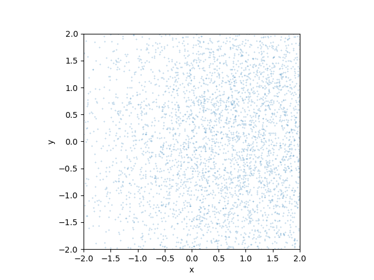

# A Beginner's Friendly Introduction to Diffusion Models in JAX

[](http://axeldonath.com/jax-diffusion-models-pydata-boston-2025/)

[](https://colab.research.google.com/github/adonath/jax-diffusion-models-pydata-boston-2025/blob/main/jax-diffusion-models-pydata-boston-2025.ipynb)


This repository contains a beginner-friendly introduction to diffusion models in JAX given at the Pydata Boston meeting on June 18th, 2025.



## Getting Started

If you would like to run the code yourself, you can clone the repository and install the dependencies. All the examples and notebook should run on a standard laptop.

```bash
git clone https://github.com/adonath/jax-diffusion-models-pydata-boston-2025.git
cd jax-diffusion-models-pydata-boston-2025
```

To setup the environment you can use just a standard Python virtual env:

```bash
python -m venv jax-diffusion-pydata-boston
./jax-diffusion-pydata-boston/bin/activate
python -m pip install -r requirements.txtx

```

Alternatively you can also use [`uv`](https://docs.astral.sh/uv/):

```bash
uv venv
source jax-diffusion-models-pydata-boston-2025/bin/activate
uv pip install -r requirements.txt
```

Or conda / mamba:

```bash
conda env create --name jax-diffusion-pydata-boston --file requirements.txt
conda activate jax-diffusion-pydata-boston
```

Finally:
```bash
jupyter notebook jax-diffusion-models-pydata-boston-2025.ipynb```
```


**Note on Colab GPUs**
If you use Google colab you can experiment with hardware accelerator GPU / TPU. For this you have to change the
runtime environment, using: `Runtime -> Change Runtime Type -> T4 GPU -> Save` and then reconnect.
JAX will create all the arrays on the default device, which is the GPU when selected. However please do not
expect large speed ups on these toy examples, the overhead might be much larger than the actual computing time.

If you are interested in hwo to benchmark JAX code, you should definitely read: https://docs.jax.dev/en/latest/faq.html#benchmarking-jax-code


