# A Beginner's Friendly Introduction to Diffusion Models in JAX

**Axel Donath**, PyData Meeting Boston June 18th, 2025 


**Who Am I?**
I am a Postdoctoral Researcher at the Center for Astrophysics | Harvard & Smithsonian where I research in the field X-Ray and Gamma-Ray Astronomy. I develop new AI, machine learning and statistical methods as well as scientific open source software for the analysis of astronomical low counts data. I'm also editor for the Astronomy and Astrophysics track of the Journal of Open Source Software [JOSS](https://joss.theoj.org).

You can find out more about me and my work at:

- [https://axeldonath.com](https://axeldonath.com)
- [https://github.com/adonath](https://github.com/adonath)


This tutorial notebook is a beginner's friendly introduction to diffusion models in JAX. It is mostly focused on introducing the core concepts of [diffusion models](https://en.wikipedia.org/wiki/Diffusion_model) from first principles along with teaching the basics of [JAX](https://docs.jax.dev/en/latest/), a differentiable, hardware accelerated, array library for deep learning and scientific computing.


## Prerequisites 

- \>2 years of experience with Python, [Numpy](https://numpy.org) and [Matplotlib](https://matplotlib.org)
    - Python standard library, functools, namedtuple, classes and dunder methods
    - Understanding of global and local scopes in Python
    - array operations, random number sampling, 1d/2d plotting, histograms
- Undergraduate level knowledge of ML, probability, statistics and linear algebra
    - Probability density functions, definitions of variance and mean
    - Multivariate Gaussian distributions
    - Joint and marginal distributions
    - Maximum Likelihood Estimation
    - (Stochastic) Gradient descent
    - Multilayer Perceptron
- No prior knowledge of Diffusion Models nor JAX is required!


## What are Diffusion Models?
Diffusion models are a class of generative models that are based on the concept of iteratively removing noise from an image
or other data. "Generative" means they model a probability distribution and can be used to draw new samples from the distribution and thus generate new plausible images. Or an alternative way of thinking about diffusion models is to think of them as sampling algorithms, that sample from a fixed distribution. Where the distribution we sample from is defined by the distribution of the data we use for training them. 


Image taken from: [https://yang-song.net/blog/2021/score/](https://yang-song.net/blog/2021/score/)

However sampling from high dimensional distributions, such as the distribution of natural images, where each pixel is treated as an independent dimension, can be technically quite challenging. Diffusion models are a way to make this sampling process feasible and scalable. Diffusion model are mathematically well founded and draw many parallels to actual physical diffusion processes, 
denoising methods in image processing as well as theory of (stochastic) differential equations.

In this tutorial We will take a look at a specific type of diffusion models called Denoising Diffusion Probabilistic Models (DDPMs) introduced by [Ho et al. in 2020.](https://arxiv.org/abs/2006.11239). We will use simple "toy examples" on 1d and 2d data to illustrate and understand the method. The goal is to build intuition and provide a solid foundation for working with production scale models. 

**Note**: I personally find that "diffusion models" are to a certain degree a misnomer, as the relevant part of the model is the reverse process, where the diffuson process is inverted. But we will learn about that later.

## What is JAX?
In a single sentence you can think of JAX as Numpy with support for GPUs and automatic differentiation.
It also includes a just in time compilation (JIT) and function transforms, such as vectorization (like np.vectorize)
which is automatically lowered to hardware accelerated XLA (XLA is an open source compiler for linear algebra / machine learnin)
instructions. 

The JAX docs are available at: https://docs.jax.dev/en/latest/

There is diverse ecosystem of open source tools build around JAX covering:

- Neural Networks: [Flax](https://flax.readthedocs.io/), [Equinox](https://docs.kidger.site/equinox/), [Keras](https://keras.io/)
- Optimizers: [Optax](https://optax.readthedocs.io/), [Optimistix](https://github.com/patrick-kidger/optimistix)
- Probabilistics Programming [Blackjax](https://blackjax-devs.github.io/blackjax/), [Numpyro](https://num.pyro.ai/en/latest/index.html)
- ...

There is also a curated list of resources around JAX here: [https://github.com/n2cholas/awesome-jax](https://github.com/n2cholas/awesome-jax)


## Quick Survey

- Who has worked with JAX before?
- Who has worked with PyTorch and deep learning?
- Who has worked with diffusion models before?
- If you are comfortable sharing: 
  - 2 years of Python experience or less?
  - Between 2 - 5 years?
  - More than 5 years?


## More Ressources 

An excellent intuitive introduction to the math behind diffusion models can be found in the following video series by
[Deepia](https://www.youtube.com/@Deepia-ls2fo) on Youtube:

- [Denoising Autoencoders](https://youtu.be/0V96wE7lY4w?si=h82tsQOYRc7-Vwly)
- [Langevin Algorithm](https://youtu.be/m0OTso2Dc2U?si=_Yld6zr2jkQEGuuI)
- [Diffusion Models](https://youtu.be/EhndHhIvWWw?si=e_s1A9dyOF7NLCsg)

If you would like to prepare for this tutorial I would recommend to watch those videos in advance. They are each 15-30 minutes long and watching them in the given order is recommended.

If you are interested in more details and different perspectives about diffusion models 
I recommend to checkout the following blog posts:

- Key read: [https://yang-song.net/blog/2021/score/](https://yang-song.net/blog/2021/score/)
- [https://lilianweng.github.io/posts/2021-07-11-diffusion-models/#nice](https://lilianweng.github.io/posts/2021-07-11-diffusion-models/#nice)


Other minimal implementations in PyTorch:

- [https://github.com/joseph-nagel/diffusion-demo/blob/main/notebooks/swissroll.ipynb](https://github.com/joseph-nagel/diffusion-demo/blob/main/notebooks/swissroll.ipynb)
- [https://github.com/acids-ircam/diffusion_models/](https://github.com/acids-ircam/diffusion_models/)


## Glossary
- **Score Function**: the score function of a distribution is the gradient of the log-density function with respect to the input
- **Reverse Process**: the reverse process is the process of removing noise from an image / data
- **Forward Process**: the forward process is the process of adding noise to an image / data
- **Sample / Particle**: a sample from a n-dimensional distribution is a n-dimensional vector / point described by its coordinates, a specific realisation (or measurment) of a random variable
- **Distribution / Probability Density Function / Likelihood**: a functional or numerical form describing the probability density of a random variable. 


```python
# uncomment on google collab to install dependencies
#import sys
#!{sys.executable} -m pip install -r https://raw.githubusercontent.com/adonath/jax-diffusion-models-pydata-boston-2025/main/requirements.txt
#!mkdir images 
```

## Warm Up: the Diffusion Process

Diffusion is typically a physical process where particles spread from regions of high concentration to regions of low concentration over time, driven by random motion. In nature, this can be seen in phenomena like the dispersal of ink in water or the flow of heat through a solid. Mathematically, diffusion is often modeled using stochastic processes or differential equations, capturing how randomness leads to gradual smoothing and homogenization of an initial state. In a more general understanding diffusion can also include convection, meaning a systematic drift of the particles driven by an external force, such as wind, a gravity driven flow in water, or stiring in a mixing process. 

We will first explore the process of diffusion on a simple example in JAX. Let's start with the relevant imports:


```python
from functools import partial
from collections import namedtuple

import numpy as np
import matplotlib.pyplot as plt
from matplotlib import animation

import jax
from jax import numpy as jnp
from jax import random
```

The `jax.numpy` namespace can be thought of as a "drop-in" replacement for Numpy. It was designed to be as similar as possible to the standard `numpy` namespace. In almost all cases you will find the equivalent of some `np.<>` function in `jnp.<>`. Howevere there is one important difference: **array objects in JAX are not mutable**, meaning they cannot be modified in place. Something like `array[2:3] = 3`, **does not work** in JAX, for reasons that become clear later, when we dicuss just in time compilation (JIT). There is a handful  more of these differences which are documented in ["JAX - The Sharp Bits"](https://docs.jax.dev/en/latest/notebooks/Common_Gotchas_in_JAX.html).

For this illustrative example we will work with a simple mixture of Gaussians as the inital distribution of the "particles" (I will use "particles" and "samples" synonymously). In JAX we can just use functionality in the `jnp.<>` namespace to define our model:


```python
def gaussian(x, norm, mu, sigma):
    """Single Gaussian distribution"""
    return norm * jnp.exp(-0.5 * ((x - mu) / sigma) ** 2) / (sigma * jnp.sqrt(2 * np.pi))


def gmm(x, norm, mu, sigma):
    """Gaussian Mixture Model"""
    values = jnp.sum(gaussian(x, norm, mu, sigma), axis=0) / mu.shape[0]

    # later we compute the gradient, which requires a returning a scalar value
    if values.shape == (1,):
        return values[0]
    
    return values

norm, mu, sigma = jnp.array([1, 1])[:, None], jnp.array([-1, 1])[:, None], jnp.array([0.25, 0.25])[:, None]

x_plot = jnp.linspace(-2, 2, 1000)
y = gmm(x_plot, norm, mu, sigma)
```

This is what the model looks like:


```python
ax = plt.subplot()
ax.plot(x_plot, y)
ax.set_xlabel('x')
ax.set_ylabel('p(x)')
```


    Text(0, 0.5, 'p(x)')


    
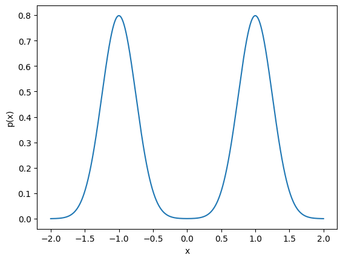
    


Now we proceed to drawing samples from the distribution. As it is a Gaussian distribution we can directly sample
from it using the build-in sampling methods from JAX. They are found in the `jax.random` namespace. This is
again very much like `numpy`, however there is an important difference: instead of a global `RandomState` object
JAX uses an approach, based on "keys", which can be split locally and are passed to the random sampling method:


```python
n_samples_ = 500_000

key = random.key(9834)

# TBD: this assumes equal norm, draw from bernoulli instead...
x_init = sigma * random.normal(key, (2, n_samples_ // 2,)) + mu
```

Let's make a histogram of the samples to verify the shape of the distribution:


```python
ax = plt.subplot()
ax.hist(x_init.flatten(), bins=100, density=True, histtype='step', label="Initial samples");
ax.set_xlabel('$x_i$')
ax.set_ylabel('$p(x_i)$');
```


    
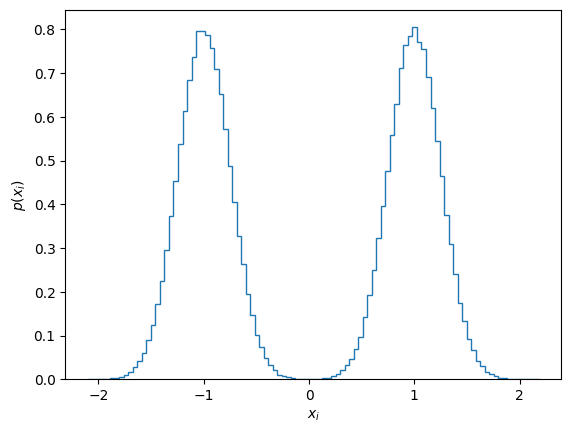
    


Now we introduce the actual diffusion process. The diffusion process we choose here consists of two distinct steps or terms:

- **Diffusion**: add noise to the sample, by adding a displacement drawn from a Gaussian mean 0 and variance $\beta_t$, this corresponds to a random motion of the particle (think e.g. [Brownian motion](https://en.wikipedia.org/wiki/Brownian_motion))
- **Drift**: move current position of sample towards the origin, by multiplying with a constant factor $\sqrt{1 - \beta_t}$, this is equivalent to an external force acting on the particle.


In addition we assume $\beta_t \in [0, 1] $ and $\beta_t \to 1$ with time. With this specific choice of can achieve that the process finally converges towards a normal Gaussian distribution $\mathcal{N}(0, 1)$. The choice of the factors given above seems a bit "magic" here, but the reasoning is given in more detail in the DDPM paper I linked above (**hint:** in addition to leading to convergence to a unit Gaussian it also allows for computing the n-th time step in closed form, which will see later in the tutorial).

For now we can just numerically convince ourselves that this process indeed transforms our two component GMM into a normal Gaussian Distribution:


```python
n_iter = 100
beta_t = jnp.linspace(0, 1, n_iter)
x = x_init.flatten()

sample_trace_diffusion_beta = []

for idx, beta in enumerate(beta_t):
    key, sub_key = random.split(key)
    x = jnp.sqrt(1. - beta) * x + beta * random.normal(key=sub_key, shape=x.shape)
    sample_trace_diffusion_beta.append(x)

sample_trace_diffusion_beta = jnp.stack(sample_trace_diffusion_beta, axis=0)
```

To visualize the process over time, we can make a histogram of the samples at each point in time `t`. Of course we can use a Python loop for this and call e.g. `np.histogram` and append all results, however this is a good time to introduce a first function transform in JAX, named `jax.vmap`. `jax.vmap` allows to map an arbitrary function over the leading dimension of an array. It is comparable to `np.vectorize`, however the latter literally implements a Python loop, while `jax.vmap` lowers the operation to compiled code and is thus much more performant.

So now we can use it to map `jnp.histogram` over the time dimension of our samples:


```python
default_hist = partial(jnp.histogram, bins=100, range=(-3, 3), density=True)

batched_histogram = jax.vmap(default_hist)
```

For covenience we combined this into a little helper function, we can use to see how the density changes with time and plot the trajectory of some example particles:


```python
def plot_trace(trace, n_traces=5, ax=None, x_min=-3, x_max=3):
    """Plot distribution at multiple points in time as trace"""
    hist_values, _ = batched_histogram(trace)    

    n_iter, n_samples = trace.shape

    ax = plt.subplot() or ax
    ax.imshow(hist_values.T[:, :], extent=[0, n_iter, x_min, x_max], aspect="auto", origin="lower")

    # plot some example traces
    key = random.PRNGKey(9823)
    for idx in random.randint(key, (n_traces,), 0, n_samples):
        ax.plot(trace[:, idx])

    ax.set_ylim(x_min, x_max)
    ax.set_xlabel("# Iteration")
    ax.set_ylabel("x")
    return ax

plot_trace(sample_trace_diffusion_beta);
```


    
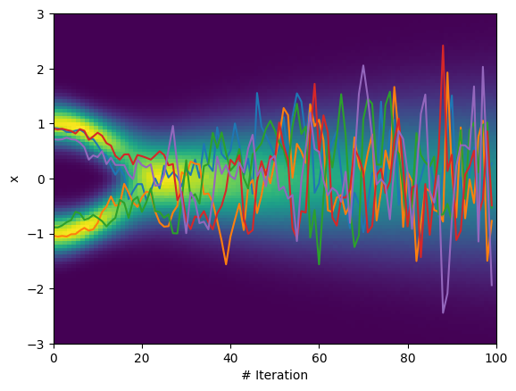
    


We can easily convince ourself, that the final (stationary) distribution is indeed a standard Gaussian:


```python
ax = plt.subplot()
ax.hist(sample_trace_diffusion_beta[-1], density=True, bins=50, label="Samples")

x_plot = jnp.linspace(-5, 5, 100)
ax.plot(x_plot, gaussian(x_plot, norm=1, mu=0, sigma=1), label="Unit Gaussian")
ax.set_xlabel("x")
ax.set_ylabel("PDF")
ax.legend();
```


    
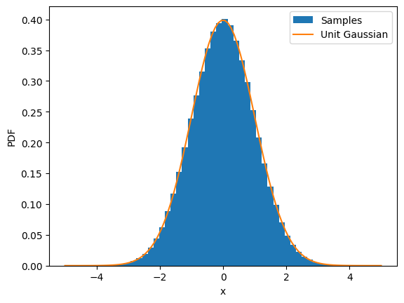
    


## "Reversing" Diffusion via Langevin Dynamics

Now that we have "destroyed" our intial distribution (the two component Gaussian) with the forward diffusion process, wouldn't it be great if we could reverse the process? This would give us a sampling algorithm, that allowed us to sample from an arbitrary distribution. Starting from a normal Gaussian distribution we would transform the samples back into the shape of the intial distribution.

It turns out such an algorithm exists, it is named ["Langevin Dynamics"](https://en.wikipedia.org/wiki/Stochastic_gradient_Langevin_dynamics). However the algorithm requires one additional piece of information: the score function of the target distribution. The score function is defined as the gradient of the log of the distribution.

In JAX we can directly get the score function by taking the gradient of the log using `jax.grad()`:


```python
def log_gmm(x, norm, mu, sigma):
    """Log of the GMM"""
    return jnp.log(gmm(x, norm, mu, sigma))

gmm_log_part = partial(log_gmm, norm=norm, mu=mu, sigma=sigma) # the partial just simplifies not parsing the parameters later...
score_fun = jax.vmap(jax.grad(gmm_log_part))
```

Now we can see what it looks like:


```python
ax = plt.subplot()
x_plot = jnp.linspace(-2, 2, 1000)
ax.plot(x_plot, score_fun(x_plot))
ax.set_xlabel('x')
ax.set_ylabel('d/dx log p(x)');
```


    
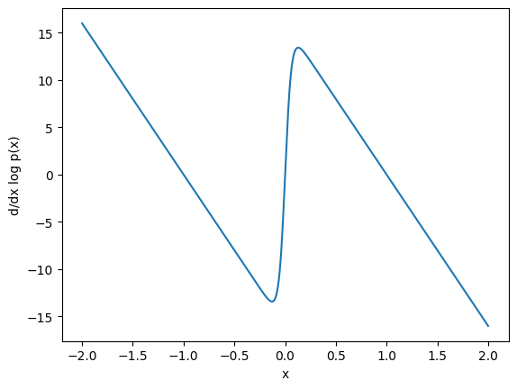
    


Now let us implement a reverse diffusion process based on "Langevin Dynamics". Starting from an initial sample $x_i$, the algorithm looks like this:

$\begin{align} \mathbf{x}_{i+1} \gets \mathbf{x}_i + 0.5 \alpha \nabla_\mathbf{x} \log p(\mathbf{x}) + \sqrt{\alpha}~ \mathbf{z}_i, \quad i=0,1,\cdots, K, \end{align}$

Where $\mathbf{z}_i \sim \mathcal{N}(0, I)$. When $\alpha \to 0$ and $K \to \infty$, this converges to the target distribution, defined by its score function $\nabla_\mathbf{x} \log p(\mathbf{x})$.

The intuition behind the algorithm is the following: give a starting point for a sample $x_0$ it is moved along the gradient (gradient descent!) to move towards the region of highest probability. However whith just this component all samples would end up in the same final location, the maximum of the distribution. To prevent this, the scale of the gradient is decreased with time ($\alpha$) and an addititional random update is added, which moves the sample in a random direction. The method was first introduced by [Welling et al. 2011](https://www.stats.ox.ac.uk/~teh/research/compstats/WelTeh2011a.pdf), where they also present proof of convergence. 


While we could implement the algorithm the same way we did above using a Python loop, we make use of another JAX fundemantal, named [`jax.lax.scan`](https://docs.jax.dev/en/latest/_autosummary/jax.lax.scan.html). `lax.scan` allows you scan a function over the leading array axes while carrying along a state. It requires us to define the "body" of the loop in a dedicated function:


```python
# JAX can natively handle "structs of arrays" or "PyTrees"
SampleArgs = namedtuple("Args", ["key", "idx", "x", "alpha_0", "p_0"])

def sample(score, args, _):
    # compute the "learning rate" depending on the iteration
    alpha = args.alpha_0 * (args.p_0 ** args.idx) ** 2

    # sample stochastic update
    key, subkey = random.split(args.key)
    dx = random.normal(subkey, args.x.shape)

    # combine the gradient and the stochastic update
    x = args.x + 0.5 * alpha * score(args.x) + jnp.sqrt(alpha) * dx
    return SampleArgs(key, args.idx + 1, x, args.alpha_0, args.p_0), x
```

**Note on pure functions**: Functions passed to `jax.lax.scan` are automatically JIT compiled, which allows for efficient execution. However this requires functions to be "pure" or alternatively they cannot have "side effects". Side effects include e.g. modifying an object / data that was passed to the function as argument in place,  printing something or interacting with global state in the function. This limitation becomes clear, when you remind yourself that for JIT compilation the Python code only serves as a laguage to define the computational graph and is never really executed. Instead a JIT compiled version of the code is executed, which is compiled to lower level hardware accelerated code. How should a remote GPU "know" how to modify a specific Python object in thh main process place? This would require supporting complex communication between process and platforms. The requirement of pure functions makes the implementation of the JIT much simpler and more stable.

Now we can use that function by defining the initial state first and calling `jax.lax.scan`:


```python
n_samples = 100_000
n_iter = 500

key = random.PRNGKey(42)
key, subkey = random.split(key)

init = SampleArgs(
    key=key,
    idx=0,
    x=random.normal(subkey, (n_samples,)),
    alpha_0=0.002,
    p_0=1.0
)

result, sample_trace = jax.lax.scan(partial(sample, score_fun), init, length=n_iter)
```


```python
plot_trace(sample_trace);
```


    
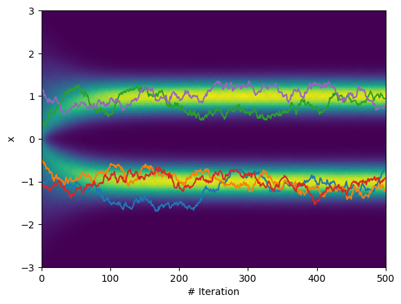
    


```python
ax = plt.subplot()
ax.hist(sample_trace[-1], density=True, bins=70, label="Samples")

x_plot = jnp.linspace(-2, 2, 100)
y = gmm(x_plot, norm, mu, sigma)
ax.plot(x_plot, y, label="Target distribution")
ax.set_xlim()
ax.set_xlabel("x")
ax.set_ylabel("PDF")
ax.legend();
```


    
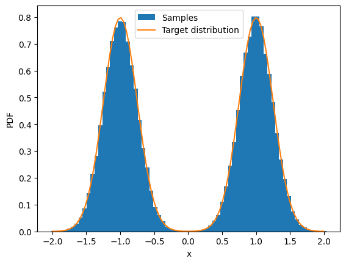
    


So we have transformed the samples from a unit Gaussian into the target distribution using Langevin dynamics!

## Score Matching
In this next section we will go from the simple Langevin dynamics example to Denoising Diffusion Probabilistic Models (DDPM) [Ho et al](https://arxiv.org/abs/2006.11239).
The Langevin dynamics example required the knowledge of the score function, which we derived from the bimodal Gaussian 
PDF using `jax.grad`.

However in general we do not have access to the score function, we just have access to the data distribution. Still we can estimate the score function from the data in a process called "score matching", introduced by [Hyvarinen, 2005](https://jmlr.org/papers/volume6/hyvarinen05a/hyvarinen05a.pdf). It is intuitive that to "match the score" we could minimize the expectation value of the squared difference between a model function $\mathcal{F}_{\theta}(\mathbf{x})$ and the score function computed from the data distribution (leaving open how to do this for now):

$$\mathcal{L}_{mse} = E_{\mathbf{x} \sim p(\mathbf{x})} \left[ \left\lVert \mathcal{F}_{\theta}(\mathbf{x}) - \nabla_{\mathbf{x}} \log p(\mathbf{x}) \right\lVert_2^2 \right]$$

The core of the method of "score matching" involves the intesting result, that the MSE loss between the score function and the gradient of the log PDF can be reformulated as:

$$\mathcal{L}_{matching} = E_{\mathbf{x} \sim p(\mathbf{x})} \left[ \text{ tr}\left( \nabla_{\mathbf{x}}  \mathcal{F}_{\theta}(\mathbf{x})  \right) + \frac{1}{2} \left\Vert \mathcal{F}_{\theta}(\mathbf{x}) \right\lVert_2^2 \right]$$

If you are interested in the mathematical derivation of this new loss, you can checkout e.g. http://yang-song.net/blog/2019/ssm/.


```python
from sklearn.datasets import make_swiss_roll
import equinox as eqx
import optax
```


For this next section we will work with another toy dataset,  the "swiss roll":


```python
random_state = np.random.RandomState(8923)

n_samples = 1_000
x = make_swiss_roll(n_samples=n_samples, noise=0.1, random_state=random_state)[0]
x = 0.13 * x[:, [0, 2]] # drop z axis
```

This is what the dataset look like:


```python
ax = plt.subplot()

ax.scatter(x[:, 0], x[:, 1], s=1)
ax.set_aspect('equal')

scale = 2.0
ax.set_xlim(-scale, scale)
ax.set_ylim(-scale, scale)
ax.set_xlabel("x")
ax.set_ylabel("y");
```


    
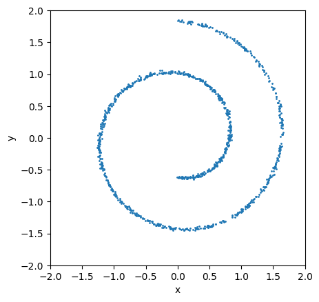
    


To model the score function we choose a simple multi-layer perceptron. In JAX there are multiple choices of deep learning libraries.
I personally found [Equinox](https://docs.kidger.site/equinox/) easiest to work with. However if you come from PyTorch than [flax / nnx](https://flax.readthedocs.io/en/latest/) might be even closer. 

The model definition in `equinox` looks like:


```python
class MLP(eqx.Module):
    """Simple MLP"""
    fc1: eqx.nn.Linear
    fc2: eqx.nn.Linear
    fc3: eqx.nn.Linear

    def __init__(self, in_dim, out_dim, key, hidden_dim=128):
        keys = jax.random.split(key, 3)
        self.fc1 = eqx.nn.Linear(in_dim, hidden_dim, key=keys[0])
        self.fc2 = eqx.nn.Linear(hidden_dim, hidden_dim, key=keys[1])
        self.fc3 = eqx.nn.Linear(hidden_dim, out_dim, key=keys[2])

    def __call__(self, x):
        x = jax.nn.gelu(self.fc1(x))
        x = jax.nn.gelu(self.fc2(x))
        x = self.fc3(x)
        return x
```

I you have worked with PyTorch before, this should still look familiar to you. Models are defined by inhereting from a `Module` object and implementing the forward pass, here defined in the `__call__` method. New are the class level declarations of class members, which are "borrowed" from dataclasses and the splitting of the random state, we have seen before.

One particular design choice in Equinox is that you never have to handle the "batch axis", but you can always use `jax.vmap` over an entire model definition. This is possible because `eqx.Module` objects are "structs of arrays" supported by JAX. However one thing to keep in mind (a "sharp bit") is that these structures can only be trees and not graphs! This makes for example sharing parameters a bit more complex.

Next we implement the loss function I we have defined above and to make the function more efficient, we will use JAX's built-in "just in time" compilation. The way this works is by decorating the function definition with the `jax.jit` object. 


```python
@jax.jit
def score_matching_loss(model, samples):
    """Score matching loss"""
    logp = jax.vmap(model)(samples)
    # Compute the norm loss
    norm_loss = jnp.linalg.norm(logp, axis=-1) ** 2 / 2.0
    
    # Compute the Jacobian loss
    jacob_mat = jax.vmap(jax.jacobian(model))(samples)
    tr_jacobian_loss = jnp.trace(jacob_mat, axis1=-2, axis2=-1)
    
    return (tr_jacobian_loss + norm_loss).mean()
```

Next we train the model on the dataset, using the Adam optimzer and the `optax` library. Equinox provide some extra methods such as `eqx.filter_jit`, which can be thought of an convenience wrapper around the `jax.jit` decorator, which automacilly filters which attributes of the model are arrays and relevant for JIT and gradient computation. I will not go into forther explanation, but refer to the [Equinox docs](https://docs.kidger.site/equinox/) instead.


```python
model = MLP(2, 2, key=jax.random.key(1234), hidden_dim=128)

optimizer = optax.adam(learning_rate=1e-3)
opt_state = optimizer.init(model)

n_iter = 1000

@eqx.filter_jit
def make_step(model, opt_state, x):
    """Make a single step in the optimization routine"""
    loss_value, grads = eqx.filter_value_and_grad(score_matching_loss)(model, x)
    updates, opt_state = optimizer.update(
        grads, opt_state, eqx.filter(model, eqx.is_array)
    )
    model = eqx.apply_updates(model, updates)
    return model, opt_state, loss_value


for idx in range(n_iter):
    model, opt_state, train_loss = make_step(model, opt_state, x)
    print(f"Iter {idx}, loss: {train_loss:.4f}", end="\r")
```

    Iter 0, loss: 0.0227
Iter 1, loss: -0.0900
Iter 2, loss: -0.1967
Iter 3, loss: -0.2977
Iter 4, loss: -0.3934
Iter 5, loss: -0.4842
Iter 6, loss: -0.5703
Iter 7, loss: -0.6518
Iter 8, loss: -0.7290
Iter 9, loss: -0.8016
Iter 10, loss: -0.8695
Iter 11, loss: -0.9327
Iter 12, loss: -0.9906
Iter 13, loss: -1.0432
Iter 14, loss: -1.0901
Iter 15, loss: -1.1312
Iter 16, loss: -1.1667
Iter 17, loss: -1.1966
Iter 18, loss: -1.2216
Iter 19, loss: -1.2421
Iter 20, loss: -1.2591
Iter 21, loss: -1.2731
Iter 22, loss: -1.2851
Iter 23, loss: -1.2958
Iter 24, loss: -1.3060

    Iter 25, loss: -1.3161
Iter 26, loss: -1.3268
Iter 27, loss: -1.3382
Iter 28, loss: -1.3507
Iter 29, loss: -1.3642
Iter 30, loss: -1.3785
Iter 31, loss: -1.3936
Iter 32, loss: -1.4091
Iter 33, loss: -1.4248
Iter 34, loss: -1.4404
Iter 35, loss: -1.4558
Iter 36, loss: -1.4709
Iter 37, loss: -1.4857
Iter 38, loss: -1.5002
Iter 39, loss: -1.5145
Iter 40, loss: -1.5287
Iter 41, loss: -1.5429
Iter 42, loss: -1.5571
Iter 43, loss: -1.5713
Iter 44, loss: -1.5857
Iter 45, loss: -1.6002
Iter 46, loss: -1.6148
Iter 47, loss: -1.6296
Iter 48, loss: -1.6445
Iter 49, loss: -1.6597

    Iter 50, loss: -1.6750
Iter 51, loss: -1.6907
Iter 52, loss: -1.7067
Iter 53, loss: -1.7230
Iter 54, loss: -1.7398
Iter 55, loss: -1.7569
Iter 56, loss: -1.7745
Iter 57, loss: -1.7925
Iter 58, loss: -1.8109
Iter 59, loss: -1.8299
Iter 60, loss: -1.8493
Iter 61, loss: -1.8693
Iter 62, loss: -1.8899
Iter 63, loss: -1.9111
Iter 64, loss: -1.9329
Iter 65, loss: -1.9555
Iter 66, loss: -1.9787
Iter 67, loss: -2.0028
Iter 68, loss: -2.0278
Iter 69, loss: -2.0537
Iter 70, loss: -2.0807
Iter 71, loss: -2.1086
Iter 72, loss: -2.1377
Iter 73, loss: -2.1680
Iter 74, loss: -2.1995

    Iter 75, loss: -2.2322
Iter 76, loss: -2.2662
Iter 77, loss: -2.3016
Iter 78, loss: -2.3384
Iter 79, loss: -2.3767
Iter 80, loss: -2.4165
Iter 81, loss: -2.4579
Iter 82, loss: -2.5010
Iter 83, loss: -2.5458
Iter 84, loss: -2.5924
Iter 85, loss: -2.6410
Iter 86, loss: -2.6914
Iter 87, loss: -2.7438
Iter 88, loss: -2.7982
Iter 89, loss: -2.8547
Iter 90, loss: -2.9134
Iter 91, loss: -2.9742
Iter 92, loss: -3.0373
Iter 93, loss: -3.1027
Iter 94, loss: -3.1704
Iter 95, loss: -3.2405
Iter 96, loss: -3.3130
Iter 97, loss: -3.3881
Iter 98, loss: -3.4658
Iter 99, loss: -3.5460
Iter 100, loss: -3.6290

    Iter 101, loss: -3.7147
Iter 102, loss: -3.8032
Iter 103, loss: -3.8946
Iter 104, loss: -3.9890
Iter 105, loss: -4.0865
Iter 106, loss: -4.1871
Iter 107, loss: -4.2910
Iter 108, loss: -4.3982
Iter 109, loss: -4.5091
Iter 110, loss: -4.6235
Iter 111, loss: -4.7418
Iter 112, loss: -4.8641
Iter 113, loss: -4.9905
Iter 114, loss: -5.1212
Iter 115, loss: -5.2563
Iter 116, loss: -5.3962
Iter 117, loss: -5.5409
Iter 118, loss: -5.6906
Iter 119, loss: -5.8456
Iter 120, loss: -6.0061
Iter 121, loss: -6.1722
Iter 122, loss: -6.3441
Iter 123, loss: -6.5222
Iter 124, loss: -6.7065
Iter 125, loss: -6.8973
Iter 126, loss: -7.0949

    Iter 127, loss: -7.2994
Iter 128, loss: -7.5111
Iter 129, loss: -7.7302
Iter 130, loss: -7.9569
Iter 131, loss: -8.1916
Iter 132, loss: -8.4343
Iter 133, loss: -8.6854
Iter 134, loss: -8.9451
Iter 135, loss: -9.2136
Iter 136, loss: -9.4911
Iter 137, loss: -9.7779
Iter 138, loss: -10.0743
Iter 139, loss: -10.3803
Iter 140, loss: -10.6963
Iter 141, loss: -11.0223
Iter 142, loss: -11.3586
Iter 143, loss: -11.7054
Iter 144, loss: -12.0628
Iter 145, loss: -12.4309
Iter 146, loss: -12.8100
Iter 147, loss: -13.2000
Iter 148, loss: -13.6013
Iter 149, loss: -14.0139
Iter 150, loss: -14.4379
Iter 151, loss: -14.8734
Iter 152, loss: -15.3207

    Iter 153, loss: -15.7797
Iter 154, loss: -16.2506
Iter 155, loss: -16.7336
Iter 156, loss: -17.2287
Iter 157, loss: -17.7361
Iter 158, loss: -18.2559
Iter 159, loss: -18.7883
Iter 160, loss: -19.3333
Iter 161, loss: -19.8911
Iter 162, loss: -20.4618
Iter 163, loss: -21.0456
Iter 164, loss: -21.6426
Iter 165, loss: -22.2529
Iter 166, loss: -22.8767
Iter 167, loss: -23.5140
Iter 168, loss: -24.1651
Iter 169, loss: -24.8300
Iter 170, loss: -25.5088
Iter 171, loss: -26.2018
Iter 172, loss: -26.9090
Iter 173, loss: -27.6306
Iter 174, loss: -28.3668
Iter 175, loss: -29.1175
Iter 176, loss: -29.8830
Iter 177, loss: -30.6634
Iter 178, loss: -31.4587

    Iter 179, loss: -32.2691
Iter 180, loss: -33.0946
Iter 181, loss: -33.9351
Iter 182, loss: -34.7908
Iter 183, loss: -35.6615
Iter 184, loss: -36.5473
Iter 185, loss: -37.4480
Iter 186, loss: -38.3638
Iter 187, loss: -39.2946
Iter 188, loss: -40.2404
Iter 189, loss: -41.2013
Iter 190, loss: -42.1774
Iter 191, loss: -43.1689
Iter 192, loss: -44.1761
Iter 193, loss: -45.1991
Iter 194, loss: -46.2382
Iter 195, loss: -47.2938
Iter 196, loss: -48.3660
Iter 197, loss: -49.4552
Iter 198, loss: -50.5615
Iter 199, loss: -51.6850
Iter 200, loss: -52.8258
Iter 201, loss: -53.9838
Iter 202, loss: -55.1586
Iter 203, loss: -56.3502
Iter 204, loss: -57.5580

    Iter 205, loss: -58.7818
Iter 206, loss: -60.0213
Iter 207, loss: -61.2764
Iter 208, loss: -62.5473
Iter 209, loss: -63.8344
Iter 210, loss: -65.1382
Iter 211, loss: -66.4592
Iter 212, loss: -67.7978
Iter 213, loss: -69.1542
Iter 214, loss: -70.5283
Iter 215, loss: -71.9201
Iter 216, loss: -73.3295
Iter 217, loss: -74.7562
Iter 218, loss: -76.2002
Iter 219, loss: -77.6613
Iter 220, loss: -79.1395
Iter 221, loss: -80.6349
Iter 222, loss: -82.1476
Iter 223, loss: -83.6776
Iter 224, loss: -85.2250
Iter 225, loss: -86.7898
Iter 226, loss: -88.3721
Iter 227, loss: -89.9714
Iter 228, loss: -91.5858
Iter 229, loss: -93.2189
Iter 230, loss: -94.8697

    Iter 231, loss: -96.5346
Iter 232, loss: -98.2172
Iter 233, loss: -99.9183
Iter 234, loss: -101.6335
Iter 235, loss: -103.3678
Iter 236, loss: -105.1203
Iter 237, loss: -106.8878
Iter 238, loss: -108.6752
Iter 239, loss: -110.4806
Iter 240, loss: -112.3021
Iter 241, loss: -114.1434
Iter 242, loss: -116.0030
Iter 243, loss: -117.8794
Iter 244, loss: -119.7756
Iter 245, loss: -121.6905
Iter 246, loss: -123.6231
Iter 247, loss: -125.5753
Iter 248, loss: -127.5469
Iter 249, loss: -129.5367
Iter 250, loss: -131.5455
Iter 251, loss: -133.5738
Iter 252, loss: -135.6208
Iter 253, loss: -137.6861
Iter 254, loss: -139.7699
Iter 255, loss: -141.8723

    Iter 256, loss: -143.9931
Iter 257, loss: -146.1316
Iter 258, loss: -148.2876
Iter 259, loss: -150.4610
Iter 260, loss: -152.6514
Iter 261, loss: -154.8570
Iter 262, loss: -157.0769
Iter 263, loss: -159.3072
Iter 264, loss: -161.5640
Iter 265, loss: -163.8353
Iter 266, loss: -166.1150
Iter 267, loss: -168.4131
Iter 268, loss: -170.7330
Iter 269, loss: -173.0684
Iter 270, loss: -175.4179
Iter 271, loss: -177.7889
Iter 272, loss: -180.1821
Iter 273, loss: -182.5898
Iter 274, loss: -185.0142
Iter 275, loss: -187.4615
Iter 276, loss: -189.9276
Iter 277, loss: -192.4092
Iter 278, loss: -194.9090
Iter 279, loss: -197.4271
Iter 280, loss: -199.9622
Iter 281, loss: -202.5085

    Iter 282, loss: -205.0715
Iter 283, loss: -207.6566
Iter 284, loss: -210.2579
Iter 285, loss: -212.8668
Iter 286, loss: -215.4897
Iter 287, loss: -218.1354
Iter 288, loss: -220.8017
Iter 289, loss: -223.4804
Iter 290, loss: -226.1716
Iter 291, loss: -228.8825
Iter 292, loss: -231.6142
Iter 293, loss: -234.3628
Iter 294, loss: -237.1254
Iter 295, loss: -239.9042
Iter 296, loss: -242.7020
Iter 297, loss: -245.5190
Iter 298, loss: -248.3518
Iter 299, loss: -251.1974
Iter 300, loss: -254.0504
Iter 301, loss: -256.9091
Iter 302, loss: -259.7653
Iter 303, loss: -262.6561
Iter 304, loss: -265.5446
Iter 305, loss: -268.4345
Iter 306, loss: -271.3401
Iter 307, loss: -274.2614

    Iter 308, loss: -277.1756
Iter 309, loss: -280.0966
Iter 310, loss: -283.0561
Iter 311, loss: -286.0235
Iter 312, loss: -288.9783
Iter 313, loss: -291.9572
Iter 314, loss: -294.9661
Iter 315, loss: -297.9736
Iter 316, loss: -300.9843
Iter 317, loss: -304.0215
Iter 318, loss: -307.0739
Iter 319, loss: -310.1261
Iter 320, loss: -313.1921
Iter 321, loss: -316.2799
Iter 322, loss: -319.3800
Iter 323, loss: -322.4842
Iter 324, loss: -325.6017
Iter 325, loss: -328.7382
Iter 326, loss: -331.8887
Iter 327, loss: -335.0462
Iter 328, loss: -338.2126
Iter 329, loss: -341.3889
Iter 330, loss: -344.5747
Iter 331, loss: -347.7515
Iter 332, loss: -350.9250
Iter 333, loss: -354.0678

    Iter 334, loss: -357.2769
Iter 335, loss: -360.5068
Iter 336, loss: -363.7079
Iter 337, loss: -366.8625
Iter 338, loss: -370.0291
Iter 339, loss: -373.2545
Iter 340, loss: -376.4775
Iter 341, loss: -379.6800
Iter 342, loss: -382.8868
Iter 343, loss: -386.1098
Iter 344, loss: -389.3420
Iter 345, loss: -392.5762
Iter 346, loss: -395.8273
Iter 347, loss: -399.0829
Iter 348, loss: -402.3310
Iter 349, loss: -405.5853
Iter 350, loss: -408.8578
Iter 351, loss: -412.1476
Iter 352, loss: -415.4341
Iter 353, loss: -418.7157
Iter 354, loss: -422.0053
Iter 355, loss: -425.3081
Iter 356, loss: -428.6200
Iter 357, loss: -431.9312
Iter 358, loss: -435.2425
Iter 359, loss: -438.5572

    Iter 360, loss: -441.8821
Iter 361, loss: -445.2120
Iter 362, loss: -448.5436
Iter 363, loss: -451.8642
Iter 364, loss: -455.1793
Iter 365, loss: -458.4778
Iter 366, loss: -461.7929
Iter 367, loss: -465.1023
Iter 368, loss: -468.4242
Iter 369, loss: -471.7304
Iter 370, loss: -475.0366
Iter 371, loss: -478.3496
Iter 372, loss: -481.6644
Iter 373, loss: -484.9704
Iter 374, loss: -488.2654
Iter 375, loss: -491.5669
Iter 376, loss: -494.8855
Iter 377, loss: -498.2295
Iter 378, loss: -501.5741
Iter 379, loss: -504.9099
Iter 380, loss: -508.2411
Iter 381, loss: -511.5859
Iter 382, loss: -514.9460
Iter 383, loss: -518.3112
Iter 384, loss: -521.6710
Iter 385, loss: -525.0239

    Iter 386, loss: -528.3748
Iter 387, loss: -531.7237
Iter 388, loss: -535.0691
Iter 389, loss: -538.3907
Iter 390, loss: -541.6752
Iter 391, loss: -544.8625
Iter 392, loss: -548.0308
Iter 393, loss: -551.2487
Iter 394, loss: -554.6914
Iter 395, loss: -557.9983
Iter 396, loss: -561.0600
Iter 397, loss: -564.1713
Iter 398, loss: -567.4440
Iter 399, loss: -570.6678
Iter 400, loss: -573.7614
Iter 401, loss: -576.9175
Iter 402, loss: -580.1248
Iter 403, loss: -583.2451
Iter 404, loss: -586.3752
Iter 405, loss: -589.5761
Iter 406, loss: -592.7174
Iter 407, loss: -595.8078
Iter 408, loss: -598.9728
Iter 409, loss: -602.1623
Iter 410, loss: -605.2737
Iter 411, loss: -608.3857

    Iter 412, loss: -611.5595
Iter 413, loss: -614.7137
Iter 414, loss: -617.8305
Iter 415, loss: -620.9766
Iter 416, loss: -624.1452
Iter 417, loss: -627.2833
Iter 418, loss: -630.4088
Iter 419, loss: -633.5637
Iter 420, loss: -636.7290
Iter 421, loss: -639.8746
Iter 422, loss: -643.0142
Iter 423, loss: -646.1715
Iter 424, loss: -649.3369
Iter 425, loss: -652.4914
Iter 426, loss: -655.6395
Iter 427, loss: -658.7968
Iter 428, loss: -661.9650
Iter 429, loss: -665.1329
Iter 430, loss: -668.2941
Iter 431, loss: -671.4517
Iter 432, loss: -674.6078
Iter 433, loss: -677.7471
Iter 434, loss: -680.8379
Iter 435, loss: -683.7963
Iter 436, loss: -686.6616

    Iter 437, loss: -689.5497
Iter 438, loss: -692.9543
Iter 439, loss: -696.3003
Iter 440, loss: -699.1670
Iter 441, loss: -701.9804
Iter 442, loss: -705.0797
Iter 443, loss: -708.2004
Iter 444, loss: -711.1052
Iter 445, loss: -714.0075
Iter 446, loss: -716.9669
Iter 447, loss: -719.8940
Iter 448, loss: -722.8158
Iter 449, loss: -725.6671
Iter 450, loss: -728.4734
Iter 451, loss: -731.3931
Iter 452, loss: -734.2934
Iter 453, loss: -737.0539
Iter 454, loss: -739.8947
Iter 455, loss: -742.8338
Iter 456, loss: -745.6566
Iter 457, loss: -748.4380
Iter 458, loss: -751.3253
Iter 459, loss: -754.2007
Iter 460, loss: -757.0026
Iter 461, loss: -759.8360
Iter 462, loss: -762.6934

    Iter 463, loss: -765.5159
Iter 464, loss: -768.3442
Iter 465, loss: -771.1942
Iter 466, loss: -774.0161
Iter 467, loss: -776.8235
Iter 468, loss: -779.6633
Iter 469, loss: -782.5107
Iter 470, loss: -785.3283
Iter 471, loss: -788.1385
Iter 472, loss: -790.9679
Iter 473, loss: -793.7994
Iter 474, loss: -796.6173
Iter 475, loss: -799.4358
Iter 476, loss: -802.2635
Iter 477, loss: -805.0873
Iter 478, loss: -807.8990
Iter 479, loss: -810.7078
Iter 480, loss: -813.5228
Iter 481, loss: -816.3396
Iter 482, loss: -819.1496
Iter 483, loss: -821.9536
Iter 484, loss: -824.7565
Iter 485, loss: -827.5608
Iter 486, loss: -830.3618
Iter 487, loss: -833.1549

    Iter 488, loss: -835.9385
Iter 489, loss: -838.7115
Iter 490, loss: -841.4657
Iter 491, loss: -844.1868
Iter 492, loss: -846.8416
Iter 493, loss: -849.4214
Iter 494, loss: -851.9346
Iter 495, loss: -854.6054
Iter 496, loss: -857.5202
Iter 497, loss: -860.5240
Iter 498, loss: -863.2225
Iter 499, loss: -865.6365
Iter 500, loss: -868.1282
Iter 501, loss: -870.8827
Iter 502, loss: -873.7051
Iter 503, loss: -876.2942
Iter 504, loss: -878.7282
Iter 505, loss: -881.2866
Iter 506, loss: -884.0038
Iter 507, loss: -886.6721
Iter 508, loss: -889.1764
Iter 509, loss: -891.6511
Iter 510, loss: -894.2421
Iter 511, loss: -896.8917
Iter 512, loss: -899.4667

    Iter 513, loss: -901.9542
Iter 514, loss: -904.4536
Iter 515, loss: -907.0261
Iter 516, loss: -909.6190
Iter 517, loss: -912.1621
Iter 518, loss: -914.6556
Iter 519, loss: -917.1533
Iter 520, loss: -919.6907
Iter 521, loss: -922.2477
Iter 522, loss: -924.7869
Iter 523, loss: -927.2935
Iter 524, loss: -929.7855
Iter 525, loss: -932.2878
Iter 526, loss: -934.8078
Iter 527, loss: -937.3365
Iter 528, loss: -939.8578
Iter 529, loss: -942.3646
Iter 530, loss: -944.8597
Iter 531, loss: -947.3508
Iter 532, loss: -949.8453
Iter 533, loss: -952.3446
Iter 534, loss: -954.8483
Iter 535, loss: -957.3527
Iter 536, loss: -959.8552
Iter 537, loss: -962.3537

    Iter 538, loss: -964.8478
Iter 539, loss: -967.3373
Iter 540, loss: -969.8223
Iter 541, loss: -972.3016
Iter 542, loss: -974.7719
Iter 543, loss: -977.2246
Iter 544, loss: -979.6384
Iter 545, loss: -981.9717
Iter 546, loss: -984.1694
Iter 547, loss: -986.3162
Iter 548, loss: -988.7554
Iter 549, loss: -991.5734
Iter 550, loss: -994.1413
Iter 551, loss: -996.2031
Iter 552, loss: -998.3425
Iter 553, loss: -1000.9259
Iter 554, loss: -1003.4068
Iter 555, loss: -1005.4825
Iter 556, loss: -1007.7172
Iter 557, loss: -1010.2598
Iter 558, loss: -1012.5682
Iter 559, loss: -1014.6837
Iter 560, loss: -1017.0267
Iter 561, loss: -1019.4419
Iter 562, loss: -1021.6270

    Iter 563, loss: -1023.8052
Iter 564, loss: -1026.1648
Iter 565, loss: -1028.4509
Iter 566, loss: -1030.5997
Iter 567, loss: -1032.8464
Iter 568, loss: -1035.1584
Iter 569, loss: -1037.3605
Iter 570, loss: -1039.5227
Iter 571, loss: -1041.7581
Iter 572, loss: -1043.9795
Iter 573, loss: -1046.1007
Iter 574, loss: -1048.2045
Iter 575, loss: -1050.3597
Iter 576, loss: -1052.4878
Iter 577, loss: -1054.6168
Iter 578, loss: -1056.8713
Iter 579, loss: -1059.2063
Iter 580, loss: -1061.4543
Iter 581, loss: -1063.6030
Iter 582, loss: -1065.6982
Iter 583, loss: -1067.7516
Iter 584, loss: -1069.7948
Iter 585, loss: -1071.9045
Iter 586, loss: -1074.0956
Iter 587, loss: -1076.2740

    Iter 588, loss: -1078.3936
Iter 589, loss: -1080.4835
Iter 590, loss: -1082.5472
Iter 591, loss: -1084.5833
Iter 592, loss: -1086.6300
Iter 593, loss: -1088.7178
Iter 594, loss: -1090.8267
Iter 595, loss: -1092.9258
Iter 596, loss: -1095.0076
Iter 597, loss: -1097.0801
Iter 598, loss: -1099.1362
Iter 599, loss: -1101.1686
Iter 600, loss: -1103.1925
Iter 601, loss: -1105.2222
Iter 602, loss: -1107.2546
Iter 603, loss: -1109.2836
Iter 604, loss: -1111.3105
Iter 605, loss: -1113.3396
Iter 606, loss: -1115.3721
Iter 607, loss: -1117.4001
Iter 608, loss: -1119.4213
Iter 609, loss: -1121.4374
Iter 610, loss: -1123.4521
Iter 611, loss: -1125.4623
Iter 612, loss: -1127.4648
Iter 613, loss: -1129.4585

    Iter 614, loss: -1131.4457
Iter 615, loss: -1133.4255
Iter 616, loss: -1135.3960
Iter 617, loss: -1137.3506
Iter 618, loss: -1139.2836
Iter 619, loss: -1141.1881
Iter 620, loss: -1143.0603
Iter 621, loss: -1144.8972
Iter 622, loss: -1146.7253
Iter 623, loss: -1148.5906
Iter 624, loss: -1150.5715
Iter 625, loss: -1152.6666
Iter 626, loss: -1154.7900
Iter 627, loss: -1156.8048
Iter 628, loss: -1158.6639
Iter 629, loss: -1160.4279
Iter 630, loss: -1162.1996
Iter 631, loss: -1164.0623
Iter 632, loss: -1166.0195
Iter 633, loss: -1168.0066
Iter 634, loss: -1169.9358
Iter 635, loss: -1171.7760
Iter 636, loss: -1173.5613
Iter 637, loss: -1175.3496
Iter 638, loss: -1177.1837
Iter 639, loss: -1179.0658

    Iter 640, loss: -1180.9668
Iter 641, loss: -1182.8463
Iter 642, loss: -1184.6846
Iter 643, loss: -1186.4877
Iter 644, loss: -1188.2764
Iter 645, loss: -1190.0714
Iter 646, loss: -1191.8834
Iter 647, loss: -1193.7133
Iter 648, loss: -1195.5508
Iter 649, loss: -1197.3859
Iter 650, loss: -1199.2094
Iter 651, loss: -1201.0181
Iter 652, loss: -1202.8136
Iter 653, loss: -1204.5996
Iter 654, loss: -1206.3798
Iter 655, loss: -1208.1561
Iter 656, loss: -1209.9299
Iter 657, loss: -1211.7008
Iter 658, loss: -1213.4688
Iter 659, loss: -1215.2319
Iter 660, loss: -1216.9904
Iter 661, loss: -1218.7418
Iter 662, loss: -1220.4873
Iter 663, loss: -1222.2244
Iter 664, loss: -1223.9561

    Iter 665, loss: -1225.6816
Iter 666, loss: -1227.4078
Iter 667, loss: -1229.1348
Iter 668, loss: -1230.8716
Iter 669, loss: -1232.6161
Iter 670, loss: -1234.3710
Iter 671, loss: -1236.1263
Iter 672, loss: -1237.8766
Iter 673, loss: -1239.6101
Iter 674, loss: -1241.3213
Iter 675, loss: -1243.0052
Iter 676, loss: -1244.6597
Iter 677, loss: -1246.2816
Iter 678, loss: -1247.8696
Iter 679, loss: -1249.4310
Iter 680, loss: -1250.9948
Iter 681, loss: -1252.6107
Iter 682, loss: -1254.3292
Iter 683, loss: -1256.1324
Iter 684, loss: -1257.9323
Iter 685, loss: -1259.6361
Iter 686, loss: -1261.2280
Iter 687, loss: -1262.7694
Iter 688, loss: -1264.3458
Iter 689, loss: -1266.0016
Iter 690, loss: -1267.7037

    Iter 691, loss: -1269.3749
Iter 692, loss: -1270.9707
Iter 693, loss: -1272.5109
Iter 694, loss: -1274.0526
Iter 695, loss: -1275.6433
Iter 696, loss: -1277.2833
Iter 697, loss: -1278.9287
Iter 698, loss: -1280.5336
Iter 699, loss: -1282.0913
Iter 700, loss: -1283.6311
Iter 701, loss: -1285.1870
Iter 702, loss: -1286.7721
Iter 703, loss: -1288.3726
Iter 704, loss: -1289.9623
Iter 705, loss: -1291.5236
Iter 706, loss: -1293.0563
Iter 707, loss: -1294.5703
Iter 708, loss: -1296.0757
Iter 709, loss: -1297.5723
Iter 710, loss: -1299.0502
Iter 711, loss: -1300.4885
Iter 712, loss: -1301.8833
Iter 713, loss: -1303.2554
Iter 714, loss: -1304.6912
Iter 715, loss: -1306.2898
Iter 716, loss: -1308.0707

    Iter 717, loss: -1309.8831
Iter 718, loss: -1311.5248
Iter 719, loss: -1312.9395
Iter 720, loss: -1314.2437
Iter 721, loss: -1315.6068
Iter 722, loss: -1317.1259
Iter 723, loss: -1318.7583
Iter 724, loss: -1320.3695
Iter 725, loss: -1321.8630
Iter 726, loss: -1323.2579
Iter 727, loss: -1324.6443
Iter 728, loss: -1326.0911
Iter 729, loss: -1327.5980
Iter 730, loss: -1329.1132
Iter 731, loss: -1330.5875
Iter 732, loss: -1332.0168
Iter 733, loss: -1333.4320
Iter 734, loss: -1334.8649
Iter 735, loss: -1336.3220
Iter 736, loss: -1337.7843
Iter 737, loss: -1339.2284
Iter 738, loss: -1340.6461
Iter 739, loss: -1342.0471
Iter 740, loss: -1343.4491
Iter 741, loss: -1344.8651
Iter 742, loss: -1346.2965

    Iter 743, loss: -1347.7330
Iter 744, loss: -1349.1620
Iter 745, loss: -1350.5750
Iter 746, loss: -1351.9725
Iter 747, loss: -1353.3607
Iter 748, loss: -1354.7461
Iter 749, loss: -1356.1334
Iter 750, loss: -1357.5244
Iter 751, loss: -1358.9187
Iter 752, loss: -1360.3125
Iter 753, loss: -1361.7029
Iter 754, loss: -1363.0868
Iter 755, loss: -1364.4618
Iter 756, loss: -1365.8252
Iter 757, loss: -1367.1731
Iter 758, loss: -1368.4995
Iter 759, loss: -1369.7938
Iter 760, loss: -1371.0430
Iter 761, loss: -1372.2306
Iter 762, loss: -1373.3635
Iter 763, loss: -1374.4858
Iter 764, loss: -1375.7313
Iter 765, loss: -1377.2146
Iter 766, loss: -1378.9100
Iter 767, loss: -1380.5641
Iter 768, loss: -1381.9559

    Iter 769, loss: -1383.1044
Iter 770, loss: -1384.2153
Iter 771, loss: -1385.4858
Iter 772, loss: -1386.9238
Iter 773, loss: -1388.3632
Iter 774, loss: -1389.6580
Iter 775, loss: -1390.8379
Iter 776, loss: -1392.0469
Iter 777, loss: -1393.3768
Iter 778, loss: -1394.7676
Iter 779, loss: -1396.0896
Iter 780, loss: -1397.2997
Iter 781, loss: -1398.4716
Iter 782, loss: -1399.7041
Iter 783, loss: -1401.0164
Iter 784, loss: -1402.3422
Iter 785, loss: -1403.6101
Iter 786, loss: -1404.8193
Iter 787, loss: -1406.0250
Iter 788, loss: -1407.2715
Iter 789, loss: -1408.5508
Iter 790, loss: -1409.8220
Iter 791, loss: -1411.0574
Iter 792, loss: -1412.2638
Iter 793, loss: -1413.4705
Iter 794, loss: -1414.6963

    Iter 795, loss: -1415.9403
Iter 796, loss: -1417.1833
Iter 797, loss: -1418.4098
Iter 798, loss: -1419.6163
Iter 799, loss: -1420.8118
Iter 800, loss: -1422.0066
Iter 801, loss: -1423.2041
Iter 802, loss: -1424.3976
Iter 803, loss: -1425.5746
Iter 804, loss: -1426.7218
Iter 805, loss: -1427.8273
Iter 806, loss: -1428.8918
Iter 807, loss: -1429.9255
Iter 808, loss: -1430.9750
Iter 809, loss: -1432.1062
Iter 810, loss: -1433.3989
Iter 811, loss: -1434.8374
Iter 812, loss: -1436.3063
Iter 813, loss: -1437.6500
Iter 814, loss: -1438.8112
Iter 815, loss: -1439.8541
Iter 816, loss: -1440.8990
Iter 817, loss: -1442.0469
Iter 818, loss: -1443.3158
Iter 819, loss: -1444.6416

    Iter 820, loss: -1445.9211
Iter 821, loss: -1447.0989
Iter 822, loss: -1448.1952
Iter 823, loss: -1449.2769
Iter 824, loss: -1450.4041
Iter 825, loss: -1451.5953
Iter 826, loss: -1452.8253
Iter 827, loss: -1454.0465
Iter 828, loss: -1455.2256
Iter 829, loss: -1456.3605
Iter 830, loss: -1457.4735
Iter 831, loss: -1458.5933
Iter 832, loss: -1459.7366
Iter 833, loss: -1460.9038
Iter 834, loss: -1462.0825
Iter 835, loss: -1463.2557
Iter 836, loss: -1464.4121
Iter 837, loss: -1465.5493
Iter 838, loss: -1466.6736
Iter 839, loss: -1467.7927
Iter 840, loss: -1468.9146
Iter 841, loss: -1470.0433
Iter 842, loss: -1471.1796
Iter 843, loss: -1472.3215
Iter 844, loss: -1473.4661
Iter 845, loss: -1474.6099

    Iter 846, loss: -1475.7506
Iter 847, loss: -1476.8868
Iter 848, loss: -1478.0168
Iter 849, loss: -1479.1376
Iter 850, loss: -1480.2430
Iter 851, loss: -1481.3209
Iter 852, loss: -1482.3516
Iter 853, loss: -1483.3075
Iter 854, loss: -1484.1731
Iter 855, loss: -1484.9980
Iter 856, loss: -1485.9451
Iter 857, loss: -1487.2031
Iter 858, loss: -1488.6915
Iter 859, loss: -1490.0686
Iter 860, loss: -1491.1125
Iter 861, loss: -1491.9501
Iter 862, loss: -1492.8811
Iter 863, loss: -1494.0679
Iter 864, loss: -1495.3617
Iter 865, loss: -1496.4805
Iter 866, loss: -1497.3683
Iter 867, loss: -1498.2461
Iter 868, loss: -1499.3169
Iter 869, loss: -1500.5140
Iter 870, loss: -1501.6099
Iter 871, loss: -1502.5405

    Iter 872, loss: -1503.4691
Iter 873, loss: -1504.5277
Iter 874, loss: -1505.6548
Iter 875, loss: -1506.7106
Iter 876, loss: -1507.6720
Iter 877, loss: -1508.6316
Iter 878, loss: -1509.6552
Iter 879, loss: -1510.7156
Iter 880, loss: -1511.7483
Iter 881, loss: -1512.7325
Iter 882, loss: -1513.7008
Iter 883, loss: -1514.6898
Iter 884, loss: -1515.7070
Iter 885, loss: -1516.7262
Iter 886, loss: -1517.7213
Iter 887, loss: -1518.6901
Iter 888, loss: -1519.6525
Iter 889, loss: -1520.6271
Iter 890, loss: -1521.6085
Iter 891, loss: -1522.5718
Iter 892, loss: -1523.4933
Iter 893, loss: -1524.3640
Iter 894, loss: -1525.1801
Iter 895, loss: -1525.9376
Iter 896, loss: -1526.6296
Iter 897, loss: -1527.3164

    Iter 898, loss: -1528.1212
Iter 899, loss: -1529.2394
Iter 900, loss: -1530.6628
Iter 901, loss: -1532.1213
Iter 902, loss: -1533.2657
Iter 903, loss: -1534.0319
Iter 904, loss: -1534.6592
Iter 905, loss: -1535.4536
Iter 906, loss: -1536.5481
Iter 907, loss: -1537.7806
Iter 908, loss: -1538.8776
Iter 909, loss: -1539.7313
Iter 910, loss: -1540.4736
Iter 911, loss: -1541.3102
Iter 912, loss: -1542.3206
Iter 913, loss: -1543.4083
Iter 914, loss: -1544.4150
Iter 915, loss: -1545.2853
Iter 916, loss: -1546.0967
Iter 917, loss: -1546.9618
Iter 918, loss: -1547.9221
Iter 919, loss: -1548.9233
Iter 920, loss: -1549.8842
Iter 921, loss: -1550.7723
Iter 922, loss: -1551.6222
Iter 923, loss: -1552.4908

    Iter 924, loss: -1553.4061
Iter 925, loss: -1554.3521
Iter 926, loss: -1555.2904
Iter 927, loss: -1556.1951
Iter 928, loss: -1557.0696
Iter 929, loss: -1557.9374
Iter 930, loss: -1558.8198
Iter 931, loss: -1559.7230
Iter 932, loss: -1560.6368
Iter 933, loss: -1561.5452
Iter 934, loss: -1562.4381
Iter 935, loss: -1563.3165
Iter 936, loss: -1564.1886
Iter 937, loss: -1565.0631
Iter 938, loss: -1565.9449
Iter 939, loss: -1566.8333
Iter 940, loss: -1567.7234
Iter 941, loss: -1568.6106
Iter 942, loss: -1569.4919
Iter 943, loss: -1570.3667
Iter 944, loss: -1571.2367
Iter 945, loss: -1572.1047
Iter 946, loss: -1572.9725
Iter 947, loss: -1573.8413
Iter 948, loss: -1574.7111
Iter 949, loss: -1575.5815

    Iter 950, loss: -1576.4514
Iter 951, loss: -1577.3206
Iter 952, loss: -1578.1869
Iter 953, loss: -1579.0513
Iter 954, loss: -1579.9133
Iter 955, loss: -1580.7723
Iter 956, loss: -1581.6279
Iter 957, loss: -1582.4801
Iter 958, loss: -1583.3258
Iter 959, loss: -1584.1624
Iter 960, loss: -1584.9833
Iter 961, loss: -1585.7794
Iter 962, loss: -1586.5341
Iter 963, loss: -1587.2338
Iter 964, loss: -1587.8776
Iter 965, loss: -1588.5223
Iter 966, loss: -1589.2742
Iter 967, loss: -1590.2296
Iter 968, loss: -1591.3195
Iter 969, loss: -1592.3779
Iter 970, loss: -1593.2877
Iter 971, loss: -1594.0546
Iter 972, loss: -1594.7512
Iter 973, loss: -1595.4644
Iter 974, loss: -1596.2758
Iter 975, loss: -1597.2021

    Iter 976, loss: -1598.1466
Iter 977, loss: -1598.9785
Iter 978, loss: -1599.6815
Iter 979, loss: -1600.3694
Iter 980, loss: -1601.1519
Iter 981, loss: -1602.0186
Iter 982, loss: -1602.8639
Iter 983, loss: -1603.6154
Iter 984, loss: -1604.2891
Iter 985, loss: -1604.9398
Iter 986, loss: -1605.5845
Iter 987, loss: -1606.2009
Iter 988, loss: -1606.7559
Iter 989, loss: -1607.2969
Iter 990, loss: -1607.9141
Iter 991, loss: -1608.7660
Iter 992, loss: -1609.8618
Iter 993, loss: -1611.0719
Iter 994, loss: -1612.1476
Iter 995, loss: -1612.9281
Iter 996, loss: -1613.4553
Iter 997, loss: -1613.9492
Iter 998, loss: -1614.6454
Iter 999, loss: -1615.5844

Remember that the score function parametrizes the gradient of the log, so it is a vector valued function. 
So we can use a little helper function to visualize the score function we have just fitted as a vector field:


```python
def plot_vector_field(model, ax=None, x_range=(-2, 2, 10), y_range=(-2, 2, 10), **kwargs):
    """Plot vector field of grad(log(p)), aka score function"""
    if ax is None:
        ax = plt.gca()
    
    xx, yy = jnp.meshgrid(
        jnp.linspace(*x_range),
        jnp.linspace(*y_range)
    )
    grid = jnp.stack([xx.ravel(), yy.ravel()], axis=-1)

    scores = jax.vmap(model)(grid)

    scores_norm = jnp.linalg.norm(scores, axis=-1, ord=2, keepdims=True)
    scores_log1p = scores / scores_norm * jnp.log(1 + scores_norm)
    ax.quiver(xx, yy, scores_log1p[:, 0], scores_log1p[:, 1], **kwargs)
    return ax

ax = plt.subplot()

ax.scatter(x[:, 0], x[:, 1], s=10, alpha=0.1)

ax.set_aspect('equal')
scale = 2.0
ax.set_xlim(-scale, scale)
ax.set_ylim(-scale, scale)
ax.set_xlabel("x")
ax.set_ylabel("y")
plot_vector_field(model, ax=ax, x_range=(-2, 2, 20), y_range=(-2, 2, 20), color="red");
```


    
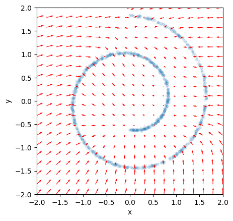
    


If you look closely you can see that the gradient always points towards the direction of the highest probability density at any point in the data space. Which is exactly what we expect from intuition.

Now that we have the score function of the distribution we can actually go back to our Langevin sampling method and replace the analytical score function with our fitted model:


```python
Args = namedtuple("Args", ["key", "idx", "x", "alpha_0", "p_0"])

def sample(score, args, _):
    key, subkey = random.split(args.key)
    alpha = args.alpha_0 * (args.p_0 ** args.idx) ** 2
    dx = random.normal(subkey, args.x.shape)
    x = args.x + 0.5 * alpha * jax.vmap(score)(args.x) + jnp.sqrt(alpha) * dx
    return Args(key, args.idx + 1, x, args.alpha_0, args.p_0), x


n_samples = 10_000
n_iter = 2000

key = random.PRNGKey(42)
key, subkey = random.split(key)

init = Args(
    key=key,
    idx=0,
    x=random.normal(subkey, (n_samples, 2)),
    alpha_0=0.0001,
    p_0=1,
)

result, sample_trace = jax.lax.scan(partial(sample, model), init, length=n_iter)
```

This is what the samples look like:


```python
ax = plt.subplot()

ax.scatter(sample_trace[-1, :, 0], sample_trace[-1, :, 1], s=1)
ax.set_aspect('equal')
scale = 2.0
ax.set_xlim(-scale, scale)
ax.set_ylim(-scale, scale)
ax.set_xlabel("x")
ax.set_ylabel("y");
```


    
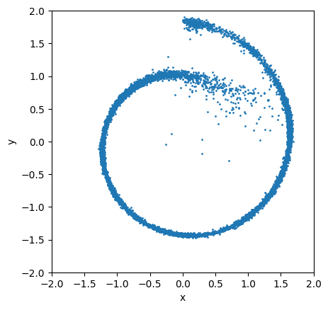
    


# (Break)

## Denoising Diffusion Probabilistic Models (DDPM)

The previous result just using score matching was not bad, but also not great either. The sampling process got "stuck" in regions of lower probability and missed details of the distribution. How can we improve upon this?

The answer that will finally bring us to the DDPM "diffusion model" has multiple aspects. The most important ideas is, we can make the model of the score function dependent (conditioned) on time. But how does the training of such a model look like? We can create "diffused" versions of our training data as we did above, which 
change with time and move (or "morph") from a simple Gaussian to the much more complex target distribution. 

Practically we can make another small improvement to the diffusion process: in order to get the "diffused" example data a given $t$, we had to compute all the previous steps (check the simple example above). Now, with a bit of math, because all the transitions between the different stages are Gaussian, one can derive a closed form expression to how much the data is diffused at given time $t$ (check the DDPM paper).

The solution is given by:

$q(x_t|x_0) = \sqrt{\bar{\alpha_t}}x_0 + (1 - \bar{\alpha_t}) \cdot \epsilon$

And

$\bar{\alpha} = (1 - \beta)^t, \textrm{with~} \alpha = 1 - \beta$


Now let's first define the range of $\beta$ values and compute $\alpha$ and $\bar{\alpha}$ from it:


```python
n_t_steps = 25 # number of time steps
betas = jnp.geomspace(1e-4, 0.9999, n_t_steps)
alphas = 1 - betas.reshape(1, -1, 1)
alpha_bars = jnp.cumprod(alphas, axis=1)
```

This we can use to diffuse the data:


```python
noise = jax.random.normal(jax.random.PRNGKey(1234), shape=(x.shape[0], n_t_steps, 2))
x_diffused_example = jnp.sqrt(alpha_bars) * x[:, jnp.newaxis, :] + jnp.sqrt(1 - alpha_bars) * noise
```

Now we can visualize the diffusion process with time:


```python
fig, axes = plt.subplots(nrows=5, ncols=5, figsize=(8, 8))

for idx, ax in enumerate(axes.flat):
    ax.scatter(x_diffused_example[:, idx, 0], x_diffused_example[:, idx, 1], s=1)
    ax.set_title(f"Step {idx}", fontdict={"size": 10}, pad=3)
    ax.set_xticks([])
    ax.set_yticks([])
```


    
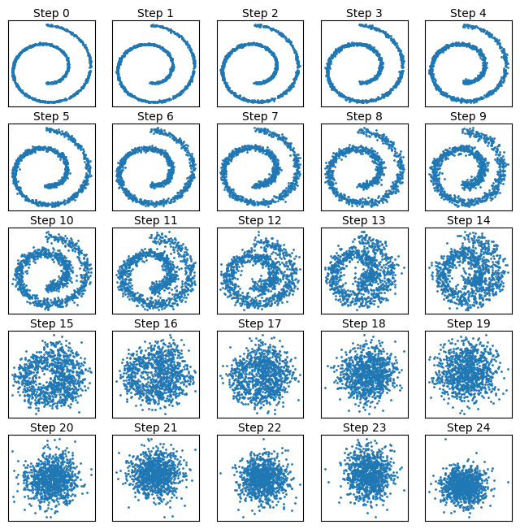
    


We can quickly verify that just as in the other example above the marginal distributions correspond to a unit Gaussian:


```python
ax = plt.subplot()

ax.hist(x_diffused_example[:, -1, 0], density=True, bins=50, label="X Marginal", histtype="step")
ax.hist(x_diffused_example[:, -1, 1], density=True, bins=50, label="Y Marginal", histtype="step")


x_plot = jnp.linspace(-5, 5, 100)
ax.plot(x_plot, jax.scipy.stats.norm.pdf(x_plot), label="Unit Gaussian")
ax.set_xlabel("x")
ax.set_ylabel("PDF")
ax.legend();
```


    
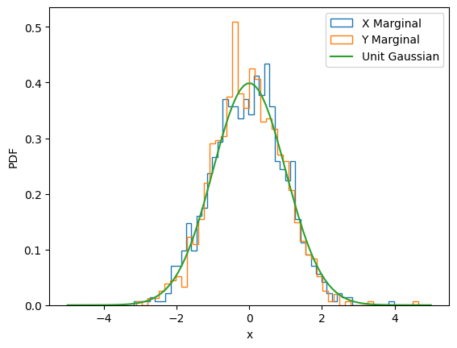
    


Now we modify our model to be dependent on the time coordinate. A common way to do this is via a so called "positional embedding".
For this we consider the time variable to be an integer value, and the embedding consists of a matrix of the size $N_t \times N_{out}$,
where $N_t$ is the number of time steps to consider and $N_{out}$ is the number of dimensions in the intermediate layer of the MLP. 

The given a time idx `t` we can just lookup the vector in the embedding and directly mutliply it to the intermediate activations: 


```python
class TimeConditionedLinear(eqx.Module):
    """Simple MLP"""
    linear: eqx.nn.Linear
    embedding: eqx.nn.Embedding

    def __init__(self, in_dim, out_dim, t_dim, key):
        keys = jax.random.split(key, 2)
        self.embedding = eqx.nn.Embedding(t_dim, out_dim, key=keys[0])
        self.linear = eqx.nn.Linear(in_dim, out_dim, key=keys[1])

    def __call__(self, x, t):
        out = self.linear(x)
        value = jax.vmap(self.embedding)(t)[0]
        result = out * value
        return result


class TimeConditionedMLP(eqx.Module):
    """Simple MLP"""
    fc1: TimeConditionedLinear
    fc2: TimeConditionedLinear
    fc3: eqx.nn.Linear

    def __init__(self, in_dim, out_dim, t_dim, key, hidden_dim=128):
        keys = jax.random.split(key, 3)
        self.fc1 = TimeConditionedLinear(in_dim, hidden_dim, t_dim, key=keys[0])
        self.fc2 = TimeConditionedLinear(hidden_dim, hidden_dim, t_dim, key=keys[1])
        self.fc3 = eqx.nn.Linear(hidden_dim, out_dim, key=keys[2])

    def __call__(self, x, t):
        x = jax.nn.gelu(self.fc1(x, t))
        x = jax.nn.gelu(self.fc2(x, t))
        x = self.fc3(x)
        return x
```

In the training we will apply one more additional modification. We define the model and loss function such that 
the model predicts the noise in each step. There is a nice but somewhat lenghty derivation in the Deepia 
video above and in the DDPM paper. 

But just intuitively: the model is trained to predict the noise in each step. In the sampling process we can
then just subtract the noise from the current iteration and get a less noisy version of the data. If we
do this iteratively we arrive at a final denoised sample of the data distribution, matching the process
illustrated in the figure at the top.

Ok let's implement this in code:


```python
n_t_steps = 100 # number of time steps
betas = jnp.geomspace(1e-4, 0.9999, n_t_steps)
alphas = 1.0 - betas
alpha_bars = jnp.cumprod(alphas)
```


```python
model_cond = TimeConditionedMLP(2, 2, t_dim=n_t_steps, key=jax.random.key(23))

optimizer = optax.adam(learning_rate=1e-3)
opt_state = optimizer.init(model_cond)
```


```python
n_iter = 20_000


def mse_loss(model, x, t, noise):
    """Mean squared losss"""
    pred = jax.vmap(model)(x, t)
    return ((pred - noise) ** 2).mean()


@eqx.filter_jit
def make_step(model, opt_state, x, t, noise):
    """Make a single update step"""
    loss_value, grads = eqx.filter_value_and_grad(mse_loss)(model, x, t, noise)
    updates, opt_state = optimizer.update(
        grads, opt_state, eqx.filter(model, eqx.is_array)
    )
    model = eqx.apply_updates(model, updates)
    return model, opt_state, loss_value


key = jax.random.PRNGKey(1234)

for idx in range(n_iter):
    key, subkey = random.split(key)
    noise = jax.random.normal(subkey, shape=x.shape)

    key, subkey = random.split(key)
    t = jax.random.randint(subkey, minval=0, maxval=n_t_steps, shape=(x.shape[0], 1))

    x_diffused = jnp.sqrt(alpha_bars[t]) * x + jnp.sqrt(1 - alpha_bars[t]) * noise

    model_cond, opt_state, train_loss = make_step(model_cond, opt_state, x_diffused, t, noise)
    print(f"Iter {idx}, loss: {train_loss:.4f}", end="\r")
```

    Iter 0, loss: 0.9840
Iter 1, loss: 0.9978
Iter 2, loss: 0.9667
Iter 3, loss: 0.9926
Iter 4, loss: 0.9654
Iter 5, loss: 0.9440
Iter 6, loss: 0.9776
Iter 7, loss: 0.9805
Iter 8, loss: 0.9519
Iter 9, loss: 0.9188
Iter 10, loss: 1.0504
Iter 11, loss: 0.9044
Iter 12, loss: 0.9489
Iter 13, loss: 0.9364
Iter 14, loss: 0.9026
Iter 15, loss: 0.9090
Iter 16, loss: 0.9580
Iter 17, loss: 0.9814
Iter 18, loss: 0.8847
Iter 19, loss: 0.8942
Iter 20, loss: 0.8895
Iter 21, loss: 0.8822
Iter 22, loss: 0.8895
Iter 23, loss: 0.8406
Iter 24, loss: 0.8471
Iter 25, loss: 0.8708
Iter 26, loss: 0.9356
Iter 27, loss: 0.8707
Iter 28, loss: 0.8433
Iter 29, loss: 0.8098
Iter 30, loss: 0.8481
Iter 31, loss: 0.8342
Iter 32, loss: 0.8431
Iter 33, loss: 0.8070
Iter 34, loss: 0.8239
Iter 35, loss: 0.7923
Iter 36, loss: 0.8325
Iter 37, loss: 0.8015
Iter 38, loss: 0.7957
Iter 39, loss: 0.8296
Iter 40, loss: 0.7984

    Iter 41, loss: 0.7781
Iter 42, loss: 0.7673
Iter 43, loss: 0.8154
Iter 44, loss: 0.7794
Iter 45, loss: 0.7998
Iter 46, loss: 0.7494
Iter 47, loss: 0.7387
Iter 48, loss: 0.7364
Iter 49, loss: 0.7280
Iter 50, loss: 0.7886
Iter 51, loss: 0.7448
Iter 52, loss: 0.7545
Iter 53, loss: 0.7375
Iter 54, loss: 0.7353
Iter 55, loss: 0.7798
Iter 56, loss: 0.8203
Iter 57, loss: 0.6955
Iter 58, loss: 0.7414
Iter 59, loss: 0.6853
Iter 60, loss: 0.7088
Iter 61, loss: 0.7057
Iter 62, loss: 0.7141
Iter 63, loss: 0.6953
Iter 64, loss: 0.7040
Iter 65, loss: 0.6626
Iter 66, loss: 0.7030
Iter 67, loss: 0.7011
Iter 68, loss: 0.7074
Iter 69, loss: 0.6634
Iter 70, loss: 0.7049
Iter 71, loss: 0.7018
Iter 72, loss: 0.6776
Iter 73, loss: 0.7339
Iter 74, loss: 0.6815
Iter 75, loss: 0.6861
Iter 76, loss: 0.6817
Iter 77, loss: 0.6882
Iter 78, loss: 0.6769
Iter 79, loss: 0.6488
Iter 80, loss: 0.7011

    Iter 81, loss: 0.6507
Iter 82, loss: 0.6816
Iter 83, loss: 0.6478
Iter 84, loss: 0.6817
Iter 85, loss: 0.6831
Iter 86, loss: 0.6878
Iter 87, loss: 0.6873
Iter 88, loss: 0.6736
Iter 89, loss: 0.6708
Iter 90, loss: 0.6649
Iter 91, loss: 0.6776
Iter 92, loss: 0.6793
Iter 93, loss: 0.6946
Iter 94, loss: 0.6601
Iter 95, loss: 0.6835
Iter 96, loss: 0.6482
Iter 97, loss: 0.6248
Iter 98, loss: 0.6646
Iter 99, loss: 0.6358
Iter 100, loss: 0.6348
Iter 101, loss: 0.6909
Iter 102, loss: 0.6511
Iter 103, loss: 0.6395
Iter 104, loss: 0.6439
Iter 105, loss: 0.6458
Iter 106, loss: 0.7220
Iter 107, loss: 0.6693
Iter 108, loss: 0.6868
Iter 109, loss: 0.6775
Iter 110, loss: 0.6945
Iter 111, loss: 0.6666
Iter 112, loss: 0.6386
Iter 113, loss: 0.6450
Iter 114, loss: 0.6794
Iter 115, loss: 0.6498
Iter 116, loss: 0.6191
Iter 117, loss: 0.6644
Iter 118, loss: 0.6718
Iter 119, loss: 0.6332
Iter 120, loss: 0.6370
Iter 121, loss: 0.6627

    Iter 122, loss: 0.6774
Iter 123, loss: 0.6581
Iter 124, loss: 0.6587
Iter 125, loss: 0.6758
Iter 126, loss: 0.6912
Iter 127, loss: 0.6662
Iter 128, loss: 0.6239
Iter 129, loss: 0.6085
Iter 130, loss: 0.6076
Iter 131, loss: 0.6420
Iter 132, loss: 0.6111
Iter 133, loss: 0.6593
Iter 134, loss: 0.6156
Iter 135, loss: 0.6735
Iter 136, loss: 0.6645
Iter 137, loss: 0.6629
Iter 138, loss: 0.6199
Iter 139, loss: 0.6649
Iter 140, loss: 0.6999
Iter 141, loss: 0.6520
Iter 142, loss: 0.6611
Iter 143, loss: 0.6456
Iter 144, loss: 0.6776
Iter 145, loss: 0.6486
Iter 146, loss: 0.6577
Iter 147, loss: 0.6527
Iter 148, loss: 0.6524
Iter 149, loss: 0.6540
Iter 150, loss: 0.6561
Iter 151, loss: 0.6793
Iter 152, loss: 0.6447
Iter 153, loss: 0.6181
Iter 154, loss: 0.6658
Iter 155, loss: 0.6534
Iter 156, loss: 0.6422
Iter 157, loss: 0.6766
Iter 158, loss: 0.6452
Iter 159, loss: 0.6989
Iter 160, loss: 0.6520
Iter 161, loss: 0.6371
Iter 162, loss: 0.6440

    Iter 163, loss: 0.6414
Iter 164, loss: 0.6796
Iter 165, loss: 0.6573
Iter 166, loss: 0.6752
Iter 167, loss: 0.6531
Iter 168, loss: 0.6171
Iter 169, loss: 0.6415
Iter 170, loss: 0.6796
Iter 171, loss: 0.6314
Iter 172, loss: 0.6558
Iter 173, loss: 0.6500
Iter 174, loss: 0.6725
Iter 175, loss: 0.6095
Iter 176, loss: 0.6550
Iter 177, loss: 0.6838
Iter 178, loss: 0.6450
Iter 179, loss: 0.6579
Iter 180, loss: 0.6577
Iter 181, loss: 0.6345
Iter 182, loss: 0.6914
Iter 183, loss: 0.6508
Iter 184, loss: 0.6407
Iter 185, loss: 0.6606
Iter 186, loss: 0.6642
Iter 187, loss: 0.6567
Iter 188, loss: 0.6634
Iter 189, loss: 0.6246
Iter 190, loss: 0.6696
Iter 191, loss: 0.6369
Iter 192, loss: 0.6486
Iter 193, loss: 0.6475
Iter 194, loss: 0.6565
Iter 195, loss: 0.6166
Iter 196, loss: 0.6095
Iter 197, loss: 0.6377
Iter 198, loss: 0.6178
Iter 199, loss: 0.6251
Iter 200, loss: 0.6452
Iter 201, loss: 0.6476
Iter 202, loss: 0.6580
Iter 203, loss: 0.6422

    Iter 204, loss: 0.6498
Iter 205, loss: 0.6230
Iter 206, loss: 0.6427
Iter 207, loss: 0.6173
Iter 208, loss: 0.6785
Iter 209, loss: 0.6581
Iter 210, loss: 0.6612
Iter 211, loss: 0.6223
Iter 212, loss: 0.6505
Iter 213, loss: 0.6912
Iter 214, loss: 0.6331
Iter 215, loss: 0.6287
Iter 216, loss: 0.6288
Iter 217, loss: 0.6394
Iter 218, loss: 0.6914
Iter 219, loss: 0.6744
Iter 220, loss: 0.6740
Iter 221, loss: 0.6369
Iter 222, loss: 0.6734
Iter 223, loss: 0.5976
Iter 224, loss: 0.6312
Iter 225, loss: 0.6925
Iter 226, loss: 0.6667
Iter 227, loss: 0.6861
Iter 228, loss: 0.6754
Iter 229, loss: 0.6702
Iter 230, loss: 0.6273
Iter 231, loss: 0.6556
Iter 232, loss: 0.6395
Iter 233, loss: 0.6280
Iter 234, loss: 0.6259
Iter 235, loss: 0.6569
Iter 236, loss: 0.6472
Iter 237, loss: 0.6169
Iter 238, loss: 0.6704
Iter 239, loss: 0.6400
Iter 240, loss: 0.6530
Iter 241, loss: 0.6662
Iter 242, loss: 0.6623
Iter 243, loss: 0.6497
Iter 244, loss: 0.6716

    Iter 245, loss: 0.6508
Iter 246, loss: 0.6350
Iter 247, loss: 0.5989
Iter 248, loss: 0.6138
Iter 249, loss: 0.6562
Iter 250, loss: 0.6676
Iter 251, loss: 0.6434
Iter 252, loss: 0.6560
Iter 253, loss: 0.6756
Iter 254, loss: 0.6903
Iter 255, loss: 0.6678
Iter 256, loss: 0.6605
Iter 257, loss: 0.6516
Iter 258, loss: 0.6979
Iter 259, loss: 0.6454
Iter 260, loss: 0.6508
Iter 261, loss: 0.5896
Iter 262, loss: 0.6423
Iter 263, loss: 0.6989
Iter 264, loss: 0.6604
Iter 265, loss: 0.6183
Iter 266, loss: 0.6405
Iter 267, loss: 0.6294
Iter 268, loss: 0.6289
Iter 269, loss: 0.6212
Iter 270, loss: 0.6316
Iter 271, loss: 0.6050
Iter 272, loss: 0.6980
Iter 273, loss: 0.5966
Iter 274, loss: 0.6311
Iter 275, loss: 0.6385
Iter 276, loss: 0.6298
Iter 277, loss: 0.6493
Iter 278, loss: 0.6061
Iter 279, loss: 0.6007
Iter 280, loss: 0.6242
Iter 281, loss: 0.6410
Iter 282, loss: 0.6321
Iter 283, loss: 0.6623
Iter 284, loss: 0.6358
Iter 285, loss: 0.6360

    Iter 286, loss: 0.6109
Iter 287, loss: 0.6384
Iter 288, loss: 0.5883
Iter 289, loss: 0.6315
Iter 290, loss: 0.6457
Iter 291, loss: 0.6526
Iter 292, loss: 0.6412
Iter 293, loss: 0.6680
Iter 294, loss: 0.6517
Iter 295, loss: 0.6186
Iter 296, loss: 0.6330
Iter 297, loss: 0.6469
Iter 298, loss: 0.6260
Iter 299, loss: 0.6048
Iter 300, loss: 0.6464
Iter 301, loss: 0.6536
Iter 302, loss: 0.6262
Iter 303, loss: 0.6517
Iter 304, loss: 0.7128
Iter 305, loss: 0.7030
Iter 306, loss: 0.6357
Iter 307, loss: 0.6451
Iter 308, loss: 0.6597
Iter 309, loss: 0.6387
Iter 310, loss: 0.6899
Iter 311, loss: 0.6719
Iter 312, loss: 0.6305
Iter 313, loss: 0.6554
Iter 314, loss: 0.6400
Iter 315, loss: 0.6329
Iter 316, loss: 0.6454
Iter 317, loss: 0.6125
Iter 318, loss: 0.6058
Iter 319, loss: 0.6636
Iter 320, loss: 0.6446
Iter 321, loss: 0.6516
Iter 322, loss: 0.6437
Iter 323, loss: 0.6604
Iter 324, loss: 0.6704
Iter 325, loss: 0.6281
Iter 326, loss: 0.6674

    Iter 327, loss: 0.6026
Iter 328, loss: 0.6335
Iter 329, loss: 0.6347
Iter 330, loss: 0.6205
Iter 331, loss: 0.6626
Iter 332, loss: 0.6119
Iter 333, loss: 0.5783
Iter 334, loss: 0.6545
Iter 335, loss: 0.6175
Iter 336, loss: 0.6341
Iter 337, loss: 0.6580
Iter 338, loss: 0.6240
Iter 339, loss: 0.6710
Iter 340, loss: 0.6338
Iter 341, loss: 0.6168
Iter 342, loss: 0.6516
Iter 343, loss: 0.6571
Iter 344, loss: 0.6823
Iter 345, loss: 0.6177
Iter 346, loss: 0.6452
Iter 347, loss: 0.5935
Iter 348, loss: 0.6484
Iter 349, loss: 0.6488
Iter 350, loss: 0.6720
Iter 351, loss: 0.6367
Iter 352, loss: 0.6753
Iter 353, loss: 0.6008
Iter 354, loss: 0.6325
Iter 355, loss: 0.6557
Iter 356, loss: 0.6439
Iter 357, loss: 0.6733
Iter 358, loss: 0.6142
Iter 359, loss: 0.5907
Iter 360, loss: 0.6622
Iter 361, loss: 0.6562
Iter 362, loss: 0.6673
Iter 363, loss: 0.6186
Iter 364, loss: 0.6357
Iter 365, loss: 0.6232
Iter 366, loss: 0.6373
Iter 367, loss: 0.6309

    Iter 368, loss: 0.6728
Iter 369, loss: 0.6801
Iter 370, loss: 0.6484
Iter 371, loss: 0.6354
Iter 372, loss: 0.6986
Iter 373, loss: 0.6493
Iter 374, loss: 0.6732
Iter 375, loss: 0.6207
Iter 376, loss: 0.6377
Iter 377, loss: 0.6827
Iter 378, loss: 0.6730
Iter 379, loss: 0.6371
Iter 380, loss: 0.6238
Iter 381, loss: 0.6284
Iter 382, loss: 0.6134
Iter 383, loss: 0.6458
Iter 384, loss: 0.6422
Iter 385, loss: 0.6133
Iter 386, loss: 0.6539
Iter 387, loss: 0.6348
Iter 388, loss: 0.6469
Iter 389, loss: 0.6385
Iter 390, loss: 0.6394
Iter 391, loss: 0.6686
Iter 392, loss: 0.6274
Iter 393, loss: 0.6292
Iter 394, loss: 0.6468
Iter 395, loss: 0.6288
Iter 396, loss: 0.6059
Iter 397, loss: 0.6721
Iter 398, loss: 0.6451
Iter 399, loss: 0.6520
Iter 400, loss: 0.6361
Iter 401, loss: 0.6849
Iter 402, loss: 0.6006
Iter 403, loss: 0.6501
Iter 404, loss: 0.6210
Iter 405, loss: 0.6418
Iter 406, loss: 0.6591
Iter 407, loss: 0.6562
Iter 408, loss: 0.6569

    Iter 409, loss: 0.7001
Iter 410, loss: 0.6418
Iter 411, loss: 0.6460
Iter 412, loss: 0.6361
Iter 413, loss: 0.6627
Iter 414, loss: 0.6607
Iter 415, loss: 0.6543
Iter 416, loss: 0.6329
Iter 417, loss: 0.6272
Iter 418, loss: 0.6831
Iter 419, loss: 0.6587
Iter 420, loss: 0.6111
Iter 421, loss: 0.6316
Iter 422, loss: 0.5967
Iter 423, loss: 0.6394
Iter 424, loss: 0.6555
Iter 425, loss: 0.5965
Iter 426, loss: 0.6051
Iter 427, loss: 0.6989
Iter 428, loss: 0.6072
Iter 429, loss: 0.6405
Iter 430, loss: 0.6011
Iter 431, loss: 0.6317
Iter 432, loss: 0.6330
Iter 433, loss: 0.6688
Iter 434, loss: 0.6098
Iter 435, loss: 0.6869
Iter 436, loss: 0.6301
Iter 437, loss: 0.6423
Iter 438, loss: 0.5856
Iter 439, loss: 0.6614
Iter 440, loss: 0.6264
Iter 441, loss: 0.6459
Iter 442, loss: 0.6334
Iter 443, loss: 0.6682
Iter 444, loss: 0.6451
Iter 445, loss: 0.6336
Iter 446, loss: 0.6263
Iter 447, loss: 0.6782
Iter 448, loss: 0.6213
Iter 449, loss: 0.6114

    Iter 450, loss: 0.6685
Iter 451, loss: 0.6227
Iter 452, loss: 0.6093
Iter 453, loss: 0.6869
Iter 454, loss: 0.5951
Iter 455, loss: 0.6397
Iter 456, loss: 0.6304
Iter 457, loss: 0.6266
Iter 458, loss: 0.5992
Iter 459, loss: 0.6282
Iter 460, loss: 0.6120
Iter 461, loss: 0.7017
Iter 462, loss: 0.5972
Iter 463, loss: 0.6447
Iter 464, loss: 0.6016
Iter 465, loss: 0.6475
Iter 466, loss: 0.6596
Iter 467, loss: 0.5907
Iter 468, loss: 0.6379
Iter 469, loss: 0.6863
Iter 470, loss: 0.6416
Iter 471, loss: 0.6296
Iter 472, loss: 0.6284
Iter 473, loss: 0.6412
Iter 474, loss: 0.6202
Iter 475, loss: 0.6682
Iter 476, loss: 0.6578
Iter 477, loss: 0.6336
Iter 478, loss: 0.6160
Iter 479, loss: 0.6263
Iter 480, loss: 0.6633
Iter 481, loss: 0.5978
Iter 482, loss: 0.6593
Iter 483, loss: 0.6035
Iter 484, loss: 0.6295
Iter 485, loss: 0.6378
Iter 486, loss: 0.6532
Iter 487, loss: 0.6849
Iter 488, loss: 0.6085
Iter 489, loss: 0.6268
Iter 490, loss: 0.5874

    Iter 491, loss: 0.6172
Iter 492, loss: 0.6050
Iter 493, loss: 0.5907
Iter 494, loss: 0.6495
Iter 495, loss: 0.6440
Iter 496, loss: 0.6499
Iter 497, loss: 0.5843
Iter 498, loss: 0.6359
Iter 499, loss: 0.6503
Iter 500, loss: 0.6795
Iter 501, loss: 0.6226
Iter 502, loss: 0.6829
Iter 503, loss: 0.6492
Iter 504, loss: 0.6351
Iter 505, loss: 0.6418
Iter 506, loss: 0.6180
Iter 507, loss: 0.5617
Iter 508, loss: 0.6302
Iter 509, loss: 0.6408
Iter 510, loss: 0.6268
Iter 511, loss: 0.6852
Iter 512, loss: 0.6791
Iter 513, loss: 0.6861
Iter 514, loss: 0.6607
Iter 515, loss: 0.6385
Iter 516, loss: 0.6890
Iter 517, loss: 0.6292
Iter 518, loss: 0.5869
Iter 519, loss: 0.6299
Iter 520, loss: 0.6107
Iter 521, loss: 0.6594
Iter 522, loss: 0.6429
Iter 523, loss: 0.6706
Iter 524, loss: 0.6336
Iter 525, loss: 0.5998
Iter 526, loss: 0.6287
Iter 527, loss: 0.6561
Iter 528, loss: 0.6687
Iter 529, loss: 0.6021
Iter 530, loss: 0.5789
Iter 531, loss: 0.6445
Iter 532, loss: 0.6411

    Iter 533, loss: 0.6666
Iter 534, loss: 0.6014
Iter 535, loss: 0.5940
Iter 536, loss: 0.6235
Iter 537, loss: 0.6249
Iter 538, loss: 0.6514
Iter 539, loss: 0.6297
Iter 540, loss: 0.5854
Iter 541, loss: 0.5765
Iter 542, loss: 0.5965
Iter 543, loss: 0.5760
Iter 544, loss: 0.6750
Iter 545, loss: 0.6423
Iter 546, loss: 0.6518
Iter 547, loss: 0.6292
Iter 548, loss: 0.6922
Iter 549, loss: 0.6803
Iter 550, loss: 0.6140
Iter 551, loss: 0.6387
Iter 552, loss: 0.6785
Iter 553, loss: 0.6517
Iter 554, loss: 0.5957
Iter 555, loss: 0.6492
Iter 556, loss: 0.6724
Iter 557, loss: 0.6550
Iter 558, loss: 0.6468
Iter 559, loss: 0.6720
Iter 560, loss: 0.6259
Iter 561, loss: 0.6222
Iter 562, loss: 0.6488
Iter 563, loss: 0.6254
Iter 564, loss: 0.6772
Iter 565, loss: 0.6016
Iter 566, loss: 0.6119
Iter 567, loss: 0.6481
Iter 568, loss: 0.6326
Iter 569, loss: 0.6431
Iter 570, loss: 0.6489
Iter 571, loss: 0.5973
Iter 572, loss: 0.6399
Iter 573, loss: 0.6323

    Iter 574, loss: 0.6321
Iter 575, loss: 0.6579
Iter 576, loss: 0.6102
Iter 577, loss: 0.6306
Iter 578, loss: 0.7164
Iter 579, loss: 0.6533
Iter 580, loss: 0.6441
Iter 581, loss: 0.6315
Iter 582, loss: 0.5976
Iter 583, loss: 0.5975
Iter 584, loss: 0.6334
Iter 585, loss: 0.6143
Iter 586, loss: 0.6502
Iter 587, loss: 0.5678
Iter 588, loss: 0.6767
Iter 589, loss: 0.6186
Iter 590, loss: 0.5854
Iter 591, loss: 0.6506
Iter 592, loss: 0.6360
Iter 593, loss: 0.6311
Iter 594, loss: 0.6803
Iter 595, loss: 0.6325
Iter 596, loss: 0.6527
Iter 597, loss: 0.6180
Iter 598, loss: 0.6562
Iter 599, loss: 0.6343
Iter 600, loss: 0.6260
Iter 601, loss: 0.6493
Iter 602, loss: 0.6309
Iter 603, loss: 0.6267
Iter 604, loss: 0.6256
Iter 605, loss: 0.6000
Iter 606, loss: 0.5947
Iter 607, loss: 0.6528
Iter 608, loss: 0.6433
Iter 609, loss: 0.7294
Iter 610, loss: 0.6049
Iter 611, loss: 0.6538
Iter 612, loss: 0.6481
Iter 613, loss: 0.6186
Iter 614, loss: 0.6734

    Iter 615, loss: 0.6214
Iter 616, loss: 0.6442
Iter 617, loss: 0.6221
Iter 618, loss: 0.6453
Iter 619, loss: 0.6195
Iter 620, loss: 0.6217
Iter 621, loss: 0.6099
Iter 622, loss: 0.6363
Iter 623, loss: 0.6630
Iter 624, loss: 0.6167
Iter 625, loss: 0.6159
Iter 626, loss: 0.6457
Iter 627, loss: 0.6719
Iter 628, loss: 0.6284
Iter 629, loss: 0.6118
Iter 630, loss: 0.6155
Iter 631, loss: 0.5841
Iter 632, loss: 0.6402
Iter 633, loss: 0.6494
Iter 634, loss: 0.6319
Iter 635, loss: 0.6424
Iter 636, loss: 0.6700
Iter 637, loss: 0.6106
Iter 638, loss: 0.6132
Iter 639, loss: 0.6696
Iter 640, loss: 0.6387
Iter 641, loss: 0.6416
Iter 642, loss: 0.5952
Iter 643, loss: 0.6510
Iter 644, loss: 0.6401
Iter 645, loss: 0.6389
Iter 646, loss: 0.6438
Iter 647, loss: 0.6546
Iter 648, loss: 0.6248
Iter 649, loss: 0.6340
Iter 650, loss: 0.6260
Iter 651, loss: 0.6554
Iter 652, loss: 0.6345
Iter 653, loss: 0.6484
Iter 654, loss: 0.6176
Iter 655, loss: 0.6612
Iter 656, loss: 0.6323

    Iter 657, loss: 0.6525
Iter 658, loss: 0.6302
Iter 659, loss: 0.6232
Iter 660, loss: 0.6332
Iter 661, loss: 0.6174
Iter 662, loss: 0.6628
Iter 663, loss: 0.6449
Iter 664, loss: 0.6393
Iter 665, loss: 0.5962
Iter 666, loss: 0.6542
Iter 667, loss: 0.6780
Iter 668, loss: 0.6210
Iter 669, loss: 0.6231
Iter 670, loss: 0.6057
Iter 671, loss: 0.5786
Iter 672, loss: 0.6182
Iter 673, loss: 0.6135
Iter 674, loss: 0.6645
Iter 675, loss: 0.6328
Iter 676, loss: 0.6408
Iter 677, loss: 0.6738
Iter 678, loss: 0.6492
Iter 679, loss: 0.6069
Iter 680, loss: 0.6411
Iter 681, loss: 0.6301
Iter 682, loss: 0.6174
Iter 683, loss: 0.6754
Iter 684, loss: 0.6631
Iter 685, loss: 0.6585
Iter 686, loss: 0.6127
Iter 687, loss: 0.6552
Iter 688, loss: 0.6361
Iter 689, loss: 0.6092
Iter 690, loss: 0.7215
Iter 691, loss: 0.6317
Iter 692, loss: 0.6567
Iter 693, loss: 0.7043
Iter 694, loss: 0.6333
Iter 695, loss: 0.6458
Iter 696, loss: 0.6289
Iter 697, loss: 0.6223

    Iter 698, loss: 0.6333
Iter 699, loss: 0.6801
Iter 700, loss: 0.6414
Iter 701, loss: 0.6521
Iter 702, loss: 0.6626
Iter 703, loss: 0.6568
Iter 704, loss: 0.6751
Iter 705, loss: 0.6393
Iter 706, loss: 0.6734
Iter 707, loss: 0.6280
Iter 708, loss: 0.6287
Iter 709, loss: 0.5924
Iter 710, loss: 0.7031
Iter 711, loss: 0.6595
Iter 712, loss: 0.6418
Iter 713, loss: 0.6438
Iter 714, loss: 0.6449
Iter 715, loss: 0.6695
Iter 716, loss: 0.6132
Iter 717, loss: 0.6555
Iter 718, loss: 0.6711
Iter 719, loss: 0.6172
Iter 720, loss: 0.6302
Iter 721, loss: 0.6745
Iter 722, loss: 0.5835
Iter 723, loss: 0.5990
Iter 724, loss: 0.6355
Iter 725, loss: 0.6690
Iter 726, loss: 0.6845
Iter 727, loss: 0.6075
Iter 728, loss: 0.6677
Iter 729, loss: 0.6203
Iter 730, loss: 0.6383
Iter 731, loss: 0.6165
Iter 732, loss: 0.6436
Iter 733, loss: 0.6182
Iter 734, loss: 0.6066
Iter 735, loss: 0.6362
Iter 736, loss: 0.6166
Iter 737, loss: 0.5968
Iter 738, loss: 0.6475

    Iter 739, loss: 0.6316
Iter 740, loss: 0.6269
Iter 741, loss: 0.6033
Iter 742, loss: 0.6436
Iter 743, loss: 0.7328
Iter 744, loss: 0.6149
Iter 745, loss: 0.6143
Iter 746, loss: 0.6228
Iter 747, loss: 0.6191
Iter 748, loss: 0.6789
Iter 749, loss: 0.6863
Iter 750, loss: 0.6824
Iter 751, loss: 0.6198
Iter 752, loss: 0.6227
Iter 753, loss: 0.6413
Iter 754, loss: 0.6275
Iter 755, loss: 0.6438
Iter 756, loss: 0.6340
Iter 757, loss: 0.6436
Iter 758, loss: 0.6185
Iter 759, loss: 0.6364
Iter 760, loss: 0.6667
Iter 761, loss: 0.6141
Iter 762, loss: 0.6804
Iter 763, loss: 0.6260
Iter 764, loss: 0.6645
Iter 765, loss: 0.6379
Iter 766, loss: 0.6082
Iter 767, loss: 0.6107
Iter 768, loss: 0.6231
Iter 769, loss: 0.6691
Iter 770, loss: 0.6568
Iter 771, loss: 0.6007
Iter 772, loss: 0.6247
Iter 773, loss: 0.6344
Iter 774, loss: 0.6331
Iter 775, loss: 0.6157
Iter 776, loss: 0.5919
Iter 777, loss: 0.5900
Iter 778, loss: 0.5956
Iter 779, loss: 0.6643
Iter 780, loss: 0.6437

    Iter 781, loss: 0.6706
Iter 782, loss: 0.6622
Iter 783, loss: 0.6773
Iter 784, loss: 0.6291
Iter 785, loss: 0.6186
Iter 786, loss: 0.6777
Iter 787, loss: 0.5930
Iter 788, loss: 0.5901
Iter 789, loss: 0.6416
Iter 790, loss: 0.6368
Iter 791, loss: 0.6355
Iter 792, loss: 0.6253
Iter 793, loss: 0.6518
Iter 794, loss: 0.6190
Iter 795, loss: 0.6561
Iter 796, loss: 0.6217
Iter 797, loss: 0.6354
Iter 798, loss: 0.6520
Iter 799, loss: 0.6289
Iter 800, loss: 0.6464
Iter 801, loss: 0.6380
Iter 802, loss: 0.6869
Iter 803, loss: 0.6476
Iter 804, loss: 0.6178
Iter 805, loss: 0.6486
Iter 806, loss: 0.6219
Iter 807, loss: 0.6305
Iter 808, loss: 0.5924
Iter 809, loss: 0.6301
Iter 810, loss: 0.6052
Iter 811, loss: 0.6332
Iter 812, loss: 0.6147
Iter 813, loss: 0.6428
Iter 814, loss: 0.6050
Iter 815, loss: 0.6335
Iter 816, loss: 0.6028
Iter 817, loss: 0.6485
Iter 818, loss: 0.6044
Iter 819, loss: 0.6127
Iter 820, loss: 0.6637
Iter 821, loss: 0.6260

    Iter 822, loss: 0.6233
Iter 823, loss: 0.6102
Iter 824, loss: 0.6335
Iter 825, loss: 0.5937
Iter 826, loss: 0.6360
Iter 827, loss: 0.6532
Iter 828, loss: 0.6471
Iter 829, loss: 0.5997
Iter 830, loss: 0.6602
Iter 831, loss: 0.6127
Iter 832, loss: 0.6589
Iter 833, loss: 0.6051
Iter 834, loss: 0.6037
Iter 835, loss: 0.6537
Iter 836, loss: 0.5819
Iter 837, loss: 0.6114
Iter 838, loss: 0.6430
Iter 839, loss: 0.6647
Iter 840, loss: 0.6195
Iter 841, loss: 0.6024
Iter 842, loss: 0.6357
Iter 843, loss: 0.6010
Iter 844, loss: 0.6807
Iter 845, loss: 0.6495
Iter 846, loss: 0.6553
Iter 847, loss: 0.6602
Iter 848, loss: 0.6538
Iter 849, loss: 0.6167
Iter 850, loss: 0.6317
Iter 851, loss: 0.6572
Iter 852, loss: 0.5987
Iter 853, loss: 0.6414
Iter 854, loss: 0.6522
Iter 855, loss: 0.6159
Iter 856, loss: 0.6154
Iter 857, loss: 0.6379
Iter 858, loss: 0.6571
Iter 859, loss: 0.6000
Iter 860, loss: 0.6520
Iter 861, loss: 0.6613
Iter 862, loss: 0.6539

    Iter 863, loss: 0.6945
Iter 864, loss: 0.5885
Iter 865, loss: 0.6163
Iter 866, loss: 0.6321
Iter 867, loss: 0.6125
Iter 868, loss: 0.6503
Iter 869, loss: 0.6360
Iter 870, loss: 0.6445
Iter 871, loss: 0.6455
Iter 872, loss: 0.6346
Iter 873, loss: 0.6358
Iter 874, loss: 0.5839
Iter 875, loss: 0.6343
Iter 876, loss: 0.6594
Iter 877, loss: 0.6074
Iter 878, loss: 0.5856
Iter 879, loss: 0.6038
Iter 880, loss: 0.6107
Iter 881, loss: 0.5340
Iter 882, loss: 0.6084
Iter 883, loss: 0.6483
Iter 884, loss: 0.6415
Iter 885, loss: 0.6433
Iter 886, loss: 0.6418
Iter 887, loss: 0.6443
Iter 888, loss: 0.6411
Iter 889, loss: 0.6087
Iter 890, loss: 0.6414
Iter 891, loss: 0.6525
Iter 892, loss: 0.6509
Iter 893, loss: 0.6596
Iter 894, loss: 0.5914
Iter 895, loss: 0.5847
Iter 896, loss: 0.6139
Iter 897, loss: 0.6372
Iter 898, loss: 0.6248
Iter 899, loss: 0.6387
Iter 900, loss: 0.6257
Iter 901, loss: 0.6804
Iter 902, loss: 0.5987

    Iter 903, loss: 0.6378
Iter 904, loss: 0.6146
Iter 905, loss: 0.6165
Iter 906, loss: 0.6295
Iter 907, loss: 0.5887
Iter 908, loss: 0.6304
Iter 909, loss: 0.5952
Iter 910, loss: 0.6386
Iter 911, loss: 0.6444
Iter 912, loss: 0.6349
Iter 913, loss: 0.5484
Iter 914, loss: 0.6229
Iter 915, loss: 0.6242
Iter 916, loss: 0.6270
Iter 917, loss: 0.5573
Iter 918, loss: 0.6321
Iter 919, loss: 0.6204
Iter 920, loss: 0.6393
Iter 921, loss: 0.6373
Iter 922, loss: 0.6142
Iter 923, loss: 0.5980
Iter 924, loss: 0.6241
Iter 925, loss: 0.6348
Iter 926, loss: 0.6556
Iter 927, loss: 0.6227
Iter 928, loss: 0.6075
Iter 929, loss: 0.6140
Iter 930, loss: 0.5846
Iter 931, loss: 0.6030
Iter 932, loss: 0.6394
Iter 933, loss: 0.5968
Iter 934, loss: 0.6386
Iter 935, loss: 0.6764
Iter 936, loss: 0.6487
Iter 937, loss: 0.6480
Iter 938, loss: 0.6095
Iter 939, loss: 0.6237
Iter 940, loss: 0.6410
Iter 941, loss: 0.6492
Iter 942, loss: 0.5928
Iter 943, loss: 0.6444

    Iter 944, loss: 0.6255
Iter 945, loss: 0.6491
Iter 946, loss: 0.6412
Iter 947, loss: 0.6873
Iter 948, loss: 0.6587
Iter 949, loss: 0.6234
Iter 950, loss: 0.6590
Iter 951, loss: 0.6609
Iter 952, loss: 0.6022
Iter 953, loss: 0.6106
Iter 954, loss: 0.6353
Iter 955, loss: 0.6031
Iter 956, loss: 0.6017
Iter 957, loss: 0.6575
Iter 958, loss: 0.6490
Iter 959, loss: 0.6145
Iter 960, loss: 0.6106
Iter 961, loss: 0.6549
Iter 962, loss: 0.6371
Iter 963, loss: 0.6325
Iter 964, loss: 0.6466
Iter 965, loss: 0.6618
Iter 966, loss: 0.6431
Iter 967, loss: 0.5900
Iter 968, loss: 0.6046
Iter 969, loss: 0.6043
Iter 970, loss: 0.5982
Iter 971, loss: 0.6117
Iter 972, loss: 0.5909
Iter 973, loss: 0.6246
Iter 974, loss: 0.6192
Iter 975, loss: 0.6153
Iter 976, loss: 0.6469
Iter 977, loss: 0.6368
Iter 978, loss: 0.6331
Iter 979, loss: 0.6258
Iter 980, loss: 0.6215
Iter 981, loss: 0.6068
Iter 982, loss: 0.6111
Iter 983, loss: 0.5840
Iter 984, loss: 0.6186

    Iter 985, loss: 0.6721
Iter 986, loss: 0.6277
Iter 987, loss: 0.6179
Iter 988, loss: 0.6203
Iter 989, loss: 0.6687
Iter 990, loss: 0.6358
Iter 991, loss: 0.6355
Iter 992, loss: 0.6525
Iter 993, loss: 0.6059
Iter 994, loss: 0.5957
Iter 995, loss: 0.6409
Iter 996, loss: 0.6545
Iter 997, loss: 0.6463
Iter 998, loss: 0.6105
Iter 999, loss: 0.6648
Iter 1000, loss: 0.6594
Iter 1001, loss: 0.6531
Iter 1002, loss: 0.6240
Iter 1003, loss: 0.6282
Iter 1004, loss: 0.6646
Iter 1005, loss: 0.6426
Iter 1006, loss: 0.6167
Iter 1007, loss: 0.6066
Iter 1008, loss: 0.6228
Iter 1009, loss: 0.6660
Iter 1010, loss: 0.6641
Iter 1011, loss: 0.6407
Iter 1012, loss: 0.6568
Iter 1013, loss: 0.6481
Iter 1014, loss: 0.6686
Iter 1015, loss: 0.6109
Iter 1016, loss: 0.6337
Iter 1017, loss: 0.6491
Iter 1018, loss: 0.6098
Iter 1019, loss: 0.6174
Iter 1020, loss: 0.6070
Iter 1021, loss: 0.6189
Iter 1022, loss: 0.6010
Iter 1023, loss: 0.6697
Iter 1024, loss: 0.6474
Iter 1025, loss: 0.6181

    Iter 1026, loss: 0.6301
Iter 1027, loss: 0.6347
Iter 1028, loss: 0.6206
Iter 1029, loss: 0.5878
Iter 1030, loss: 0.6265
Iter 1031, loss: 0.6113
Iter 1032, loss: 0.6508
Iter 1033, loss: 0.6058
Iter 1034, loss: 0.6533
Iter 1035, loss: 0.6426
Iter 1036, loss: 0.6056
Iter 1037, loss: 0.6319
Iter 1038, loss: 0.5863
Iter 1039, loss: 0.5929
Iter 1040, loss: 0.5761
Iter 1041, loss: 0.6235
Iter 1042, loss: 0.6428
Iter 1043, loss: 0.6484
Iter 1044, loss: 0.6351
Iter 1045, loss: 0.6369
Iter 1046, loss: 0.5990
Iter 1047, loss: 0.6388
Iter 1048, loss: 0.6182
Iter 1049, loss: 0.6129
Iter 1050, loss: 0.6116
Iter 1051, loss: 0.6167
Iter 1052, loss: 0.6657
Iter 1053, loss: 0.6802
Iter 1054, loss: 0.5778
Iter 1055, loss: 0.6609
Iter 1056, loss: 0.6212
Iter 1057, loss: 0.5584
Iter 1058, loss: 0.5995
Iter 1059, loss: 0.6393
Iter 1060, loss: 0.6349
Iter 1061, loss: 0.6045
Iter 1062, loss: 0.6401
Iter 1063, loss: 0.6116
Iter 1064, loss: 0.6042
Iter 1065, loss: 0.6580
Iter 1066, loss: 0.6648

    Iter 1067, loss: 0.6661
Iter 1068, loss: 0.6153
Iter 1069, loss: 0.6540
Iter 1070, loss: 0.6123
Iter 1071, loss: 0.6289
Iter 1072, loss: 0.6559
Iter 1073, loss: 0.6511
Iter 1074, loss: 0.6131
Iter 1075, loss: 0.6552
Iter 1076, loss: 0.6427
Iter 1077, loss: 0.5852
Iter 1078, loss: 0.6368
Iter 1079, loss: 0.6189
Iter 1080, loss: 0.6387
Iter 1081, loss: 0.6190
Iter 1082, loss: 0.6170
Iter 1083, loss: 0.6136
Iter 1084, loss: 0.5934
Iter 1085, loss: 0.5760
Iter 1086, loss: 0.6147
Iter 1087, loss: 0.5961
Iter 1088, loss: 0.6704
Iter 1089, loss: 0.6304
Iter 1090, loss: 0.6314
Iter 1091, loss: 0.6105
Iter 1092, loss: 0.6218
Iter 1093, loss: 0.5762
Iter 1094, loss: 0.6301
Iter 1095, loss: 0.6062
Iter 1096, loss: 0.6291
Iter 1097, loss: 0.6950
Iter 1098, loss: 0.6086
Iter 1099, loss: 0.6356
Iter 1100, loss: 0.6105
Iter 1101, loss: 0.6073
Iter 1102, loss: 0.6609
Iter 1103, loss: 0.6404
Iter 1104, loss: 0.5798
Iter 1105, loss: 0.6191
Iter 1106, loss: 0.5913
Iter 1107, loss: 0.6292

    Iter 1108, loss: 0.6566
Iter 1109, loss: 0.6019
Iter 1110, loss: 0.6767
Iter 1111, loss: 0.6426
Iter 1112, loss: 0.5827
Iter 1113, loss: 0.6246
Iter 1114, loss: 0.6462
Iter 1115, loss: 0.6601
Iter 1116, loss: 0.6469
Iter 1117, loss: 0.6118
Iter 1118, loss: 0.6261
Iter 1119, loss: 0.5948
Iter 1120, loss: 0.5852
Iter 1121, loss: 0.6136
Iter 1122, loss: 0.5925
Iter 1123, loss: 0.6602
Iter 1124, loss: 0.6368
Iter 1125, loss: 0.6072
Iter 1126, loss: 0.6220
Iter 1127, loss: 0.6183
Iter 1128, loss: 0.6157
Iter 1129, loss: 0.7042
Iter 1130, loss: 0.6657
Iter 1131, loss: 0.6116
Iter 1132, loss: 0.5925
Iter 1133, loss: 0.5816
Iter 1134, loss: 0.6394
Iter 1135, loss: 0.6284
Iter 1136, loss: 0.6633
Iter 1137, loss: 0.5855
Iter 1138, loss: 0.5914
Iter 1139, loss: 0.6631
Iter 1140, loss: 0.6038
Iter 1141, loss: 0.6425
Iter 1142, loss: 0.6355
Iter 1143, loss: 0.6163
Iter 1144, loss: 0.6140
Iter 1145, loss: 0.6031
Iter 1146, loss: 0.6263
Iter 1147, loss: 0.6373
Iter 1148, loss: 0.5903

    Iter 1149, loss: 0.6220
Iter 1150, loss: 0.6052
Iter 1151, loss: 0.5694
Iter 1152, loss: 0.6338
Iter 1153, loss: 0.6282
Iter 1154, loss: 0.6325
Iter 1155, loss: 0.5798
Iter 1156, loss: 0.6829
Iter 1157, loss: 0.5720
Iter 1158, loss: 0.6819
Iter 1159, loss: 0.6434
Iter 1160, loss: 0.5844
Iter 1161, loss: 0.6482
Iter 1162, loss: 0.6385
Iter 1163, loss: 0.5961
Iter 1164, loss: 0.6448
Iter 1165, loss: 0.6122
Iter 1166, loss: 0.6162
Iter 1167, loss: 0.6522
Iter 1168, loss: 0.6356
Iter 1169, loss: 0.5546
Iter 1170, loss: 0.5956
Iter 1171, loss: 0.6469
Iter 1172, loss: 0.6084
Iter 1173, loss: 0.5734
Iter 1174, loss: 0.6177
Iter 1175, loss: 0.6173
Iter 1176, loss: 0.6601
Iter 1177, loss: 0.5884
Iter 1178, loss: 0.6259
Iter 1179, loss: 0.6871
Iter 1180, loss: 0.6584
Iter 1181, loss: 0.6571
Iter 1182, loss: 0.6486
Iter 1183, loss: 0.6110
Iter 1184, loss: 0.5969
Iter 1185, loss: 0.6182
Iter 1186, loss: 0.6166
Iter 1187, loss: 0.5978
Iter 1188, loss: 0.5774
Iter 1189, loss: 0.6775

    Iter 1190, loss: 0.6231
Iter 1191, loss: 0.6620
Iter 1192, loss: 0.6373
Iter 1193, loss: 0.6343
Iter 1194, loss: 0.5702
Iter 1195, loss: 0.6609
Iter 1196, loss: 0.6159
Iter 1197, loss: 0.6060
Iter 1198, loss: 0.6566
Iter 1199, loss: 0.6545
Iter 1200, loss: 0.6190
Iter 1201, loss: 0.6179
Iter 1202, loss: 0.5992
Iter 1203, loss: 0.5899
Iter 1204, loss: 0.6125
Iter 1205, loss: 0.6350
Iter 1206, loss: 0.6343
Iter 1207, loss: 0.6472
Iter 1208, loss: 0.6432
Iter 1209, loss: 0.5749
Iter 1210, loss: 0.6009
Iter 1211, loss: 0.6229
Iter 1212, loss: 0.6038
Iter 1213, loss: 0.6352
Iter 1214, loss: 0.6175
Iter 1215, loss: 0.6200
Iter 1216, loss: 0.6093
Iter 1217, loss: 0.6285
Iter 1218, loss: 0.6373
Iter 1219, loss: 0.6181
Iter 1220, loss: 0.6590
Iter 1221, loss: 0.6567
Iter 1222, loss: 0.5980
Iter 1223, loss: 0.6550
Iter 1224, loss: 0.6423
Iter 1225, loss: 0.5942
Iter 1226, loss: 0.5860
Iter 1227, loss: 0.6800
Iter 1228, loss: 0.6305
Iter 1229, loss: 0.6831
Iter 1230, loss: 0.6208

    Iter 1231, loss: 0.6782
Iter 1232, loss: 0.6073
Iter 1233, loss: 0.6057
Iter 1234, loss: 0.6392
Iter 1235, loss: 0.6798
Iter 1236, loss: 0.6210
Iter 1237, loss: 0.6412
Iter 1238, loss: 0.5665
Iter 1239, loss: 0.6124
Iter 1240, loss: 0.6229
Iter 1241, loss: 0.5790
Iter 1242, loss: 0.6089
Iter 1243, loss: 0.6306
Iter 1244, loss: 0.6257
Iter 1245, loss: 0.6520
Iter 1246, loss: 0.6449
Iter 1247, loss: 0.6180
Iter 1248, loss: 0.6349
Iter 1249, loss: 0.6469
Iter 1250, loss: 0.5746
Iter 1251, loss: 0.5967
Iter 1252, loss: 0.6358
Iter 1253, loss: 0.6259
Iter 1254, loss: 0.6022
Iter 1255, loss: 0.6271
Iter 1256, loss: 0.6642
Iter 1257, loss: 0.6194
Iter 1258, loss: 0.6417
Iter 1259, loss: 0.6509
Iter 1260, loss: 0.6338
Iter 1261, loss: 0.6065
Iter 1262, loss: 0.6418
Iter 1263, loss: 0.6497
Iter 1264, loss: 0.6280
Iter 1265, loss: 0.6185
Iter 1266, loss: 0.6226
Iter 1267, loss: 0.6307
Iter 1268, loss: 0.6350
Iter 1269, loss: 0.6296
Iter 1270, loss: 0.6453
Iter 1271, loss: 0.6242

    Iter 1272, loss: 0.6158
Iter 1273, loss: 0.6264
Iter 1274, loss: 0.6025
Iter 1275, loss: 0.6077
Iter 1276, loss: 0.5965
Iter 1277, loss: 0.6433
Iter 1278, loss: 0.5971
Iter 1279, loss: 0.6365
Iter 1280, loss: 0.6201
Iter 1281, loss: 0.6391
Iter 1282, loss: 0.6164
Iter 1283, loss: 0.5982
Iter 1284, loss: 0.6138
Iter 1285, loss: 0.6288
Iter 1286, loss: 0.6259
Iter 1287, loss: 0.5904
Iter 1288, loss: 0.6567
Iter 1289, loss: 0.5878
Iter 1290, loss: 0.6220
Iter 1291, loss: 0.5534
Iter 1292, loss: 0.6345
Iter 1293, loss: 0.6282
Iter 1294, loss: 0.6096
Iter 1295, loss: 0.6167
Iter 1296, loss: 0.5972
Iter 1297, loss: 0.6351
Iter 1298, loss: 0.5652
Iter 1299, loss: 0.6150
Iter 1300, loss: 0.6462
Iter 1301, loss: 0.5944
Iter 1302, loss: 0.5797
Iter 1303, loss: 0.5786
Iter 1304, loss: 0.6078
Iter 1305, loss: 0.6590
Iter 1306, loss: 0.6152
Iter 1307, loss: 0.5944
Iter 1308, loss: 0.6405
Iter 1309, loss: 0.6257
Iter 1310, loss: 0.6165
Iter 1311, loss: 0.5947
Iter 1312, loss: 0.6423

    Iter 1313, loss: 0.5932
Iter 1314, loss: 0.5781
Iter 1315, loss: 0.6821
Iter 1316, loss: 0.6199
Iter 1317, loss: 0.6833
Iter 1318, loss: 0.5879
Iter 1319, loss: 0.6567
Iter 1320, loss: 0.6328
Iter 1321, loss: 0.6146
Iter 1322, loss: 0.6172
Iter 1323, loss: 0.6097
Iter 1324, loss: 0.5949
Iter 1325, loss: 0.6031
Iter 1326, loss: 0.6001
Iter 1327, loss: 0.5825
Iter 1328, loss: 0.6013
Iter 1329, loss: 0.6321
Iter 1330, loss: 0.5958
Iter 1331, loss: 0.6529
Iter 1332, loss: 0.6540
Iter 1333, loss: 0.6208
Iter 1334, loss: 0.6174
Iter 1335, loss: 0.6045
Iter 1336, loss: 0.6408
Iter 1337, loss: 0.6428
Iter 1338, loss: 0.6487
Iter 1339, loss: 0.6272
Iter 1340, loss: 0.5770
Iter 1341, loss: 0.6202
Iter 1342, loss: 0.6465
Iter 1343, loss: 0.6398
Iter 1344, loss: 0.6542
Iter 1345, loss: 0.6147
Iter 1346, loss: 0.6482
Iter 1347, loss: 0.6167
Iter 1348, loss: 0.6119
Iter 1349, loss: 0.6536
Iter 1350, loss: 0.6205
Iter 1351, loss: 0.6146
Iter 1352, loss: 0.6486
Iter 1353, loss: 0.6352

    Iter 1354, loss: 0.6324
Iter 1355, loss: 0.5768
Iter 1356, loss: 0.6362
Iter 1357, loss: 0.6358
Iter 1358, loss: 0.6302
Iter 1359, loss: 0.6029
Iter 1360, loss: 0.6303
Iter 1361, loss: 0.6703
Iter 1362, loss: 0.5805
Iter 1363, loss: 0.6425
Iter 1364, loss: 0.6406
Iter 1365, loss: 0.6271
Iter 1366, loss: 0.6552
Iter 1367, loss: 0.6646
Iter 1368, loss: 0.5322
Iter 1369, loss: 0.6175
Iter 1370, loss: 0.6145
Iter 1371, loss: 0.5861
Iter 1372, loss: 0.6356
Iter 1373, loss: 0.6003
Iter 1374, loss: 0.6059
Iter 1375, loss: 0.6575
Iter 1376, loss: 0.5884
Iter 1377, loss: 0.6225
Iter 1378, loss: 0.6168
Iter 1379, loss: 0.5918
Iter 1380, loss: 0.6230
Iter 1381, loss: 0.6413
Iter 1382, loss: 0.6020
Iter 1383, loss: 0.6203
Iter 1384, loss: 0.5898
Iter 1385, loss: 0.6056
Iter 1386, loss: 0.6427
Iter 1387, loss: 0.5923
Iter 1388, loss: 0.5708
Iter 1389, loss: 0.6062
Iter 1390, loss: 0.6279
Iter 1391, loss: 0.5733
Iter 1392, loss: 0.6177
Iter 1393, loss: 0.6059
Iter 1394, loss: 0.5471

    Iter 1395, loss: 0.6339
Iter 1396, loss: 0.6083
Iter 1397, loss: 0.6290
Iter 1398, loss: 0.6352
Iter 1399, loss: 0.6391
Iter 1400, loss: 0.5987
Iter 1401, loss: 0.6608
Iter 1402, loss: 0.6316
Iter 1403, loss: 0.6180
Iter 1404, loss: 0.6404
Iter 1405, loss: 0.6523
Iter 1406, loss: 0.6328
Iter 1407, loss: 0.6134
Iter 1408, loss: 0.6235
Iter 1409, loss: 0.6735
Iter 1410, loss: 0.6013
Iter 1411, loss: 0.6142
Iter 1412, loss: 0.6494
Iter 1413, loss: 0.6588
Iter 1414, loss: 0.6303
Iter 1415, loss: 0.6289
Iter 1416, loss: 0.6704
Iter 1417, loss: 0.6388
Iter 1418, loss: 0.5650
Iter 1419, loss: 0.6333
Iter 1420, loss: 0.6175
Iter 1421, loss: 0.6227
Iter 1422, loss: 0.5674
Iter 1423, loss: 0.6071
Iter 1424, loss: 0.6226
Iter 1425, loss: 0.6415
Iter 1426, loss: 0.5812
Iter 1427, loss: 0.6471
Iter 1428, loss: 0.5815
Iter 1429, loss: 0.6304
Iter 1430, loss: 0.5982
Iter 1431, loss: 0.6420
Iter 1432, loss: 0.6777
Iter 1433, loss: 0.6141
Iter 1434, loss: 0.6390
Iter 1435, loss: 0.6486

    Iter 1436, loss: 0.5931
Iter 1437, loss: 0.6222
Iter 1438, loss: 0.6066
Iter 1439, loss: 0.6023
Iter 1440, loss: 0.6444
Iter 1441, loss: 0.5952
Iter 1442, loss: 0.5990
Iter 1443, loss: 0.6652
Iter 1444, loss: 0.6071
Iter 1445, loss: 0.6330
Iter 1446, loss: 0.6080
Iter 1447, loss: 0.6453
Iter 1448, loss: 0.6100
Iter 1449, loss: 0.5968
Iter 1450, loss: 0.5988
Iter 1451, loss: 0.6227
Iter 1452, loss: 0.6184
Iter 1453, loss: 0.6597
Iter 1454, loss: 0.6119
Iter 1455, loss: 0.6215
Iter 1456, loss: 0.6185
Iter 1457, loss: 0.6570
Iter 1458, loss: 0.6292
Iter 1459, loss: 0.6474
Iter 1460, loss: 0.6272
Iter 1461, loss: 0.5986
Iter 1462, loss: 0.6422
Iter 1463, loss: 0.5864
Iter 1464, loss: 0.5738
Iter 1465, loss: 0.5929
Iter 1466, loss: 0.5982
Iter 1467, loss: 0.6345
Iter 1468, loss: 0.6362
Iter 1469, loss: 0.6230
Iter 1470, loss: 0.5977
Iter 1471, loss: 0.6235
Iter 1472, loss: 0.6355
Iter 1473, loss: 0.5862
Iter 1474, loss: 0.6438
Iter 1475, loss: 0.6778
Iter 1476, loss: 0.6397

    Iter 1477, loss: 0.6010
Iter 1478, loss: 0.6548
Iter 1479, loss: 0.6449
Iter 1480, loss: 0.6070
Iter 1481, loss: 0.6302
Iter 1482, loss: 0.6381
Iter 1483, loss: 0.6019
Iter 1484, loss: 0.6058
Iter 1485, loss: 0.6164
Iter 1486, loss: 0.5800
Iter 1487, loss: 0.6081
Iter 1488, loss: 0.6485
Iter 1489, loss: 0.5989
Iter 1490, loss: 0.6329
Iter 1491, loss: 0.6145
Iter 1492, loss: 0.5977
Iter 1493, loss: 0.6176
Iter 1494, loss: 0.5844
Iter 1495, loss: 0.6172
Iter 1496, loss: 0.6135
Iter 1497, loss: 0.5945
Iter 1498, loss: 0.6370
Iter 1499, loss: 0.6404
Iter 1500, loss: 0.6010
Iter 1501, loss: 0.6356
Iter 1502, loss: 0.5837
Iter 1503, loss: 0.5990
Iter 1504, loss: 0.6114
Iter 1505, loss: 0.6354
Iter 1506, loss: 0.6711
Iter 1507, loss: 0.6432
Iter 1508, loss: 0.6215
Iter 1509, loss: 0.6204
Iter 1510, loss: 0.6591
Iter 1511, loss: 0.6163
Iter 1512, loss: 0.6106
Iter 1513, loss: 0.6519
Iter 1514, loss: 0.6540
Iter 1515, loss: 0.6611
Iter 1516, loss: 0.6198
Iter 1517, loss: 0.6001
Iter 1518, loss: 0.6523

    Iter 1519, loss: 0.6643
Iter 1520, loss: 0.5978
Iter 1521, loss: 0.6639
Iter 1522, loss: 0.6467
Iter 1523, loss: 0.6244
Iter 1524, loss: 0.5908
Iter 1525, loss: 0.6313
Iter 1526, loss: 0.5848
Iter 1527, loss: 0.6710
Iter 1528, loss: 0.6195
Iter 1529, loss: 0.6460
Iter 1530, loss: 0.6085
Iter 1531, loss: 0.6430
Iter 1532, loss: 0.6152
Iter 1533, loss: 0.6275
Iter 1534, loss: 0.6405
Iter 1535, loss: 0.5903
Iter 1536, loss: 0.6336
Iter 1537, loss: 0.5834
Iter 1538, loss: 0.6052
Iter 1539, loss: 0.6402
Iter 1540, loss: 0.6189
Iter 1541, loss: 0.6559
Iter 1542, loss: 0.5983
Iter 1543, loss: 0.6193
Iter 1544, loss: 0.6342
Iter 1545, loss: 0.6470
Iter 1546, loss: 0.6467
Iter 1547, loss: 0.6194
Iter 1548, loss: 0.6051
Iter 1549, loss: 0.6140
Iter 1550, loss: 0.6058
Iter 1551, loss: 0.5915
Iter 1552, loss: 0.6587
Iter 1553, loss: 0.5882
Iter 1554, loss: 0.6276
Iter 1555, loss: 0.6308
Iter 1556, loss: 0.6518
Iter 1557, loss: 0.5790
Iter 1558, loss: 0.6497
Iter 1559, loss: 0.6385

    Iter 1560, loss: 0.6210
Iter 1561, loss: 0.6163
Iter 1562, loss: 0.6152
Iter 1563, loss: 0.6543
Iter 1564, loss: 0.5779
Iter 1565, loss: 0.5967
Iter 1566, loss: 0.6194
Iter 1567, loss: 0.5810
Iter 1568, loss: 0.6178
Iter 1569, loss: 0.5993
Iter 1570, loss: 0.6569
Iter 1571, loss: 0.6693
Iter 1572, loss: 0.6511
Iter 1573, loss: 0.5856
Iter 1574, loss: 0.6310
Iter 1575, loss: 0.6073
Iter 1576, loss: 0.6444
Iter 1577, loss: 0.6362
Iter 1578, loss: 0.6378
Iter 1579, loss: 0.6252
Iter 1580, loss: 0.6083
Iter 1581, loss: 0.5904
Iter 1582, loss: 0.6441
Iter 1583, loss: 0.6114
Iter 1584, loss: 0.5872
Iter 1585, loss: 0.5814
Iter 1586, loss: 0.6227
Iter 1587, loss: 0.6448
Iter 1588, loss: 0.6183
Iter 1589, loss: 0.6238
Iter 1590, loss: 0.5990
Iter 1591, loss: 0.5812
Iter 1592, loss: 0.5868
Iter 1593, loss: 0.5704
Iter 1594, loss: 0.5941
Iter 1595, loss: 0.5903
Iter 1596, loss: 0.6146
Iter 1597, loss: 0.6157
Iter 1598, loss: 0.6077
Iter 1599, loss: 0.6664
Iter 1600, loss: 0.6366

    Iter 1601, loss: 0.5951
Iter 1602, loss: 0.5894
Iter 1603, loss: 0.6864
Iter 1604, loss: 0.6345
Iter 1605, loss: 0.6440
Iter 1606, loss: 0.6217
Iter 1607, loss: 0.6291
Iter 1608, loss: 0.5988
Iter 1609, loss: 0.6192
Iter 1610, loss: 0.6230
Iter 1611, loss: 0.5894
Iter 1612, loss: 0.6743
Iter 1613, loss: 0.6003
Iter 1614, loss: 0.5914
Iter 1615, loss: 0.6402
Iter 1616, loss: 0.6208
Iter 1617, loss: 0.6057
Iter 1618, loss: 0.6041
Iter 1619, loss: 0.6723
Iter 1620, loss: 0.6068
Iter 1621, loss: 0.5903
Iter 1622, loss: 0.5526
Iter 1623, loss: 0.6092
Iter 1624, loss: 0.6359
Iter 1625, loss: 0.6285
Iter 1626, loss: 0.6323
Iter 1627, loss: 0.6746
Iter 1628, loss: 0.6281
Iter 1629, loss: 0.5940
Iter 1630, loss: 0.5898
Iter 1631, loss: 0.6255
Iter 1632, loss: 0.6358
Iter 1633, loss: 0.5832
Iter 1634, loss: 0.6003
Iter 1635, loss: 0.6290
Iter 1636, loss: 0.6492
Iter 1637, loss: 0.6107
Iter 1638, loss: 0.5687
Iter 1639, loss: 0.5936
Iter 1640, loss: 0.5826
Iter 1641, loss: 0.6253

    Iter 1642, loss: 0.6149
Iter 1643, loss: 0.6894
Iter 1644, loss: 0.5733
Iter 1645, loss: 0.5830
Iter 1646, loss: 0.6199
Iter 1647, loss: 0.5724
Iter 1648, loss: 0.5760
Iter 1649, loss: 0.6274
Iter 1650, loss: 0.6445
Iter 1651, loss: 0.6495
Iter 1652, loss: 0.5936
Iter 1653, loss: 0.6200
Iter 1654, loss: 0.5726
Iter 1655, loss: 0.5609
Iter 1656, loss: 0.6298
Iter 1657, loss: 0.5841
Iter 1658, loss: 0.6086
Iter 1659, loss: 0.5925
Iter 1660, loss: 0.6490
Iter 1661, loss: 0.6460
Iter 1662, loss: 0.6135
Iter 1663, loss: 0.6200
Iter 1664, loss: 0.6491
Iter 1665, loss: 0.5763
Iter 1666, loss: 0.6394
Iter 1667, loss: 0.6554
Iter 1668, loss: 0.6253
Iter 1669, loss: 0.5896
Iter 1670, loss: 0.6433
Iter 1671, loss: 0.6006
Iter 1672, loss: 0.6023
Iter 1673, loss: 0.6531
Iter 1674, loss: 0.6188
Iter 1675, loss: 0.6555
Iter 1676, loss: 0.6197
Iter 1677, loss: 0.6462
Iter 1678, loss: 0.5901
Iter 1679, loss: 0.6089
Iter 1680, loss: 0.6027
Iter 1681, loss: 0.6089
Iter 1682, loss: 0.6144

    Iter 1683, loss: 0.6336
Iter 1684, loss: 0.5728
Iter 1685, loss: 0.6099
Iter 1686, loss: 0.6355
Iter 1687, loss: 0.6384
Iter 1688, loss: 0.6227
Iter 1689, loss: 0.6358
Iter 1690, loss: 0.6118
Iter 1691, loss: 0.5879
Iter 1692, loss: 0.6307
Iter 1693, loss: 0.6268
Iter 1694, loss: 0.5851
Iter 1695, loss: 0.6215
Iter 1696, loss: 0.6707
Iter 1697, loss: 0.6519
Iter 1698, loss: 0.6015
Iter 1699, loss: 0.6206
Iter 1700, loss: 0.6602
Iter 1701, loss: 0.6147
Iter 1702, loss: 0.6075
Iter 1703, loss: 0.6142
Iter 1704, loss: 0.6364
Iter 1705, loss: 0.6067
Iter 1706, loss: 0.6158
Iter 1707, loss: 0.6670
Iter 1708, loss: 0.5991
Iter 1709, loss: 0.6199
Iter 1710, loss: 0.5897
Iter 1711, loss: 0.6009
Iter 1712, loss: 0.6122
Iter 1713, loss: 0.5706
Iter 1714, loss: 0.6257
Iter 1715, loss: 0.6604
Iter 1716, loss: 0.6018
Iter 1717, loss: 0.6845
Iter 1718, loss: 0.6554
Iter 1719, loss: 0.6144
Iter 1720, loss: 0.6106
Iter 1721, loss: 0.6087
Iter 1722, loss: 0.6353
Iter 1723, loss: 0.5936

    Iter 1724, loss: 0.6629
Iter 1725, loss: 0.6352
Iter 1726, loss: 0.5802
Iter 1727, loss: 0.6010
Iter 1728, loss: 0.5967
Iter 1729, loss: 0.6005
Iter 1730, loss: 0.6150
Iter 1731, loss: 0.6036
Iter 1732, loss: 0.6221
Iter 1733, loss: 0.5981
Iter 1734, loss: 0.6039
Iter 1735, loss: 0.6508
Iter 1736, loss: 0.6055
Iter 1737, loss: 0.6229
Iter 1738, loss: 0.6742
Iter 1739, loss: 0.6114
Iter 1740, loss: 0.6137
Iter 1741, loss: 0.5775
Iter 1742, loss: 0.6097
Iter 1743, loss: 0.6016
Iter 1744, loss: 0.5945
Iter 1745, loss: 0.6151
Iter 1746, loss: 0.6456
Iter 1747, loss: 0.5869
Iter 1748, loss: 0.6402
Iter 1749, loss: 0.6152
Iter 1750, loss: 0.6050
Iter 1751, loss: 0.5746
Iter 1752, loss: 0.6335
Iter 1753, loss: 0.6292
Iter 1754, loss: 0.5788
Iter 1755, loss: 0.6492
Iter 1756, loss: 0.5995
Iter 1757, loss: 0.6211
Iter 1758, loss: 0.6209
Iter 1759, loss: 0.5825
Iter 1760, loss: 0.6241
Iter 1761, loss: 0.5816
Iter 1762, loss: 0.6126
Iter 1763, loss: 0.5987
Iter 1764, loss: 0.6118

    Iter 1765, loss: 0.6072
Iter 1766, loss: 0.5973
Iter 1767, loss: 0.6113
Iter 1768, loss: 0.6204
Iter 1769, loss: 0.6402
Iter 1770, loss: 0.5908
Iter 1771, loss: 0.6172
Iter 1772, loss: 0.6399
Iter 1773, loss: 0.6546
Iter 1774, loss: 0.6316
Iter 1775, loss: 0.6448
Iter 1776, loss: 0.6059
Iter 1777, loss: 0.6215
Iter 1778, loss: 0.6226
Iter 1779, loss: 0.5911
Iter 1780, loss: 0.6315
Iter 1781, loss: 0.5952
Iter 1782, loss: 0.6341
Iter 1783, loss: 0.5884
Iter 1784, loss: 0.6488
Iter 1785, loss: 0.6172
Iter 1786, loss: 0.6111
Iter 1787, loss: 0.6269
Iter 1788, loss: 0.6350
Iter 1789, loss: 0.6298
Iter 1790, loss: 0.6019
Iter 1791, loss: 0.5844
Iter 1792, loss: 0.6335
Iter 1793, loss: 0.6317
Iter 1794, loss: 0.5810
Iter 1795, loss: 0.6172
Iter 1796, loss: 0.6060
Iter 1797, loss: 0.6170
Iter 1798, loss: 0.6272
Iter 1799, loss: 0.6035
Iter 1800, loss: 0.6440
Iter 1801, loss: 0.6309
Iter 1802, loss: 0.6276
Iter 1803, loss: 0.6117
Iter 1804, loss: 0.6617
Iter 1805, loss: 0.6457

    Iter 1806, loss: 0.6028
Iter 1807, loss: 0.6350
Iter 1808, loss: 0.5823
Iter 1809, loss: 0.6094
Iter 1810, loss: 0.6403
Iter 1811, loss: 0.6105
Iter 1812, loss: 0.6426
Iter 1813, loss: 0.5935
Iter 1814, loss: 0.6543
Iter 1815, loss: 0.5884
Iter 1816, loss: 0.6266
Iter 1817, loss: 0.6642
Iter 1818, loss: 0.5980
Iter 1819, loss: 0.6548
Iter 1820, loss: 0.6023
Iter 1821, loss: 0.6524
Iter 1822, loss: 0.6359
Iter 1823, loss: 0.6403
Iter 1824, loss: 0.6050
Iter 1825, loss: 0.6447
Iter 1826, loss: 0.6253
Iter 1827, loss: 0.5791
Iter 1828, loss: 0.5840
Iter 1829, loss: 0.6460
Iter 1830, loss: 0.6602
Iter 1831, loss: 0.5968
Iter 1832, loss: 0.6621
Iter 1833, loss: 0.5918
Iter 1834, loss: 0.6203
Iter 1835, loss: 0.6040
Iter 1836, loss: 0.6137
Iter 1837, loss: 0.6023
Iter 1838, loss: 0.5608
Iter 1839, loss: 0.5936
Iter 1840, loss: 0.6371
Iter 1841, loss: 0.5927
Iter 1842, loss: 0.6364
Iter 1843, loss: 0.5845
Iter 1844, loss: 0.6231
Iter 1845, loss: 0.5715
Iter 1846, loss: 0.5532

    Iter 1847, loss: 0.6238
Iter 1848, loss: 0.6437
Iter 1849, loss: 0.5918
Iter 1850, loss: 0.5964
Iter 1851, loss: 0.6214
Iter 1852, loss: 0.5701
Iter 1853, loss: 0.6101
Iter 1854, loss: 0.6172
Iter 1855, loss: 0.6194
Iter 1856, loss: 0.6311
Iter 1857, loss: 0.6170
Iter 1858, loss: 0.6558
Iter 1859, loss: 0.6420
Iter 1860, loss: 0.5966
Iter 1861, loss: 0.5983
Iter 1862, loss: 0.5953
Iter 1863, loss: 0.6107
Iter 1864, loss: 0.6305
Iter 1865, loss: 0.6191
Iter 1866, loss: 0.6463
Iter 1867, loss: 0.5830
Iter 1868, loss: 0.5910
Iter 1869, loss: 0.6004
Iter 1870, loss: 0.6629
Iter 1871, loss: 0.6122
Iter 1872, loss: 0.5979
Iter 1873, loss: 0.6150
Iter 1874, loss: 0.6063
Iter 1875, loss: 0.6582
Iter 1876, loss: 0.5699
Iter 1877, loss: 0.6005
Iter 1878, loss: 0.6053
Iter 1879, loss: 0.6362
Iter 1880, loss: 0.6541
Iter 1881, loss: 0.5998
Iter 1882, loss: 0.6486
Iter 1883, loss: 0.6142
Iter 1884, loss: 0.6151
Iter 1885, loss: 0.6444
Iter 1886, loss: 0.5966
Iter 1887, loss: 0.6117

    Iter 1888, loss: 0.5839
Iter 1889, loss: 0.6214
Iter 1890, loss: 0.6293
Iter 1891, loss: 0.6380
Iter 1892, loss: 0.6008
Iter 1893, loss: 0.5883
Iter 1894, loss: 0.5979
Iter 1895, loss: 0.6393
Iter 1896, loss: 0.6028
Iter 1897, loss: 0.6415
Iter 1898, loss: 0.6494
Iter 1899, loss: 0.6292
Iter 1900, loss: 0.6405
Iter 1901, loss: 0.6168
Iter 1902, loss: 0.5817
Iter 1903, loss: 0.6297
Iter 1904, loss: 0.6004
Iter 1905, loss: 0.5418
Iter 1906, loss: 0.6197
Iter 1907, loss: 0.6139
Iter 1908, loss: 0.5864
Iter 1909, loss: 0.5660
Iter 1910, loss: 0.6024
Iter 1911, loss: 0.6841
Iter 1912, loss: 0.5951
Iter 1913, loss: 0.6452
Iter 1914, loss: 0.5519
Iter 1915, loss: 0.5910
Iter 1916, loss: 0.5879
Iter 1917, loss: 0.5994
Iter 1918, loss: 0.5967
Iter 1919, loss: 0.6075
Iter 1920, loss: 0.6417
Iter 1921, loss: 0.5905
Iter 1922, loss: 0.6474
Iter 1923, loss: 0.6063
Iter 1924, loss: 0.5857
Iter 1925, loss: 0.6401
Iter 1926, loss: 0.6008
Iter 1927, loss: 0.6201
Iter 1928, loss: 0.6270

    Iter 1929, loss: 0.6053
Iter 1930, loss: 0.6180
Iter 1931, loss: 0.6465
Iter 1932, loss: 0.6545
Iter 1933, loss: 0.6034
Iter 1934, loss: 0.6287
Iter 1935, loss: 0.6025
Iter 1936, loss: 0.6563
Iter 1937, loss: 0.5784
Iter 1938, loss: 0.5939
Iter 1939, loss: 0.6027
Iter 1940, loss: 0.6246
Iter 1941, loss: 0.6332
Iter 1942, loss: 0.6002
Iter 1943, loss: 0.6250
Iter 1944, loss: 0.6493
Iter 1945, loss: 0.5891
Iter 1946, loss: 0.5962
Iter 1947, loss: 0.5874
Iter 1948, loss: 0.6417
Iter 1949, loss: 0.6121
Iter 1950, loss: 0.6379
Iter 1951, loss: 0.6206
Iter 1952, loss: 0.5951
Iter 1953, loss: 0.5795
Iter 1954, loss: 0.6255
Iter 1955, loss: 0.6283
Iter 1956, loss: 0.6575
Iter 1957, loss: 0.6228
Iter 1958, loss: 0.6212
Iter 1959, loss: 0.6030
Iter 1960, loss: 0.6355
Iter 1961, loss: 0.6187
Iter 1962, loss: 0.6195
Iter 1963, loss: 0.6246
Iter 1964, loss: 0.6545
Iter 1965, loss: 0.6354
Iter 1966, loss: 0.6173
Iter 1967, loss: 0.6367
Iter 1968, loss: 0.6013
Iter 1969, loss: 0.5942

    Iter 1970, loss: 0.6243
Iter 1971, loss: 0.5793
Iter 1972, loss: 0.5929
Iter 1973, loss: 0.5609
Iter 1974, loss: 0.6002
Iter 1975, loss: 0.5768
Iter 1976, loss: 0.5766
Iter 1977, loss: 0.6854
Iter 1978, loss: 0.5891
Iter 1979, loss: 0.6103
Iter 1980, loss: 0.6200
Iter 1981, loss: 0.5794
Iter 1982, loss: 0.6049
Iter 1983, loss: 0.6104
Iter 1984, loss: 0.6110
Iter 1985, loss: 0.6359
Iter 1986, loss: 0.6220
Iter 1987, loss: 0.6378
Iter 1988, loss: 0.6275
Iter 1989, loss: 0.6374
Iter 1990, loss: 0.5775
Iter 1991, loss: 0.6432
Iter 1992, loss: 0.5813
Iter 1993, loss: 0.5932
Iter 1994, loss: 0.6257
Iter 1995, loss: 0.6762
Iter 1996, loss: 0.6046
Iter 1997, loss: 0.6315
Iter 1998, loss: 0.6129
Iter 1999, loss: 0.5949
Iter 2000, loss: 0.5952
Iter 2001, loss: 0.6544
Iter 2002, loss: 0.6708
Iter 2003, loss: 0.6263
Iter 2004, loss: 0.6157
Iter 2005, loss: 0.5832
Iter 2006, loss: 0.5829
Iter 2007, loss: 0.6281
Iter 2008, loss: 0.6326
Iter 2009, loss: 0.6101
Iter 2010, loss: 0.5914

    Iter 2011, loss: 0.6692
Iter 2012, loss: 0.6114
Iter 2013, loss: 0.6144
Iter 2014, loss: 0.6358
Iter 2015, loss: 0.6273
Iter 2016, loss: 0.6053
Iter 2017, loss: 0.6406
Iter 2018, loss: 0.6241
Iter 2019, loss: 0.6155
Iter 2020, loss: 0.6254
Iter 2021, loss: 0.6175
Iter 2022, loss: 0.5797
Iter 2023, loss: 0.6224
Iter 2024, loss: 0.6155
Iter 2025, loss: 0.5904
Iter 2026, loss: 0.6037
Iter 2027, loss: 0.5994
Iter 2028, loss: 0.6155
Iter 2029, loss: 0.5976
Iter 2030, loss: 0.6020
Iter 2031, loss: 0.6207
Iter 2032, loss: 0.5843
Iter 2033, loss: 0.5924
Iter 2034, loss: 0.6351
Iter 2035, loss: 0.6060
Iter 2036, loss: 0.5958
Iter 2037, loss: 0.5780
Iter 2038, loss: 0.5826
Iter 2039, loss: 0.6072
Iter 2040, loss: 0.5837
Iter 2041, loss: 0.6344
Iter 2042, loss: 0.5902
Iter 2043, loss: 0.6514
Iter 2044, loss: 0.6170
Iter 2045, loss: 0.5869
Iter 2046, loss: 0.5979
Iter 2047, loss: 0.6078
Iter 2048, loss: 0.5985
Iter 2049, loss: 0.6108
Iter 2050, loss: 0.6371
Iter 2051, loss: 0.6284

    Iter 2052, loss: 0.6535
Iter 2053, loss: 0.6461
Iter 2054, loss: 0.6260
Iter 2055, loss: 0.6196
Iter 2056, loss: 0.6100
Iter 2057, loss: 0.5906
Iter 2058, loss: 0.6190
Iter 2059, loss: 0.6180
Iter 2060, loss: 0.6176
Iter 2061, loss: 0.6099
Iter 2062, loss: 0.6016
Iter 2063, loss: 0.5901
Iter 2064, loss: 0.6306
Iter 2065, loss: 0.5687
Iter 2066, loss: 0.6315
Iter 2067, loss: 0.6247
Iter 2068, loss: 0.5867
Iter 2069, loss: 0.6133
Iter 2070, loss: 0.6231
Iter 2071, loss: 0.6277
Iter 2072, loss: 0.6211
Iter 2073, loss: 0.6428
Iter 2074, loss: 0.5879
Iter 2075, loss: 0.5704
Iter 2076, loss: 0.5798
Iter 2077, loss: 0.5975
Iter 2078, loss: 0.6328
Iter 2079, loss: 0.6169
Iter 2080, loss: 0.6383
Iter 2081, loss: 0.6177
Iter 2082, loss: 0.5690
Iter 2083, loss: 0.5562
Iter 2084, loss: 0.5783
Iter 2085, loss: 0.6382
Iter 2086, loss: 0.6121
Iter 2087, loss: 0.6183
Iter 2088, loss: 0.5687
Iter 2089, loss: 0.6095
Iter 2090, loss: 0.5560
Iter 2091, loss: 0.6407
Iter 2092, loss: 0.6476

    Iter 2093, loss: 0.5921
Iter 2094, loss: 0.5988
Iter 2095, loss: 0.6349
Iter 2096, loss: 0.5873
Iter 2097, loss: 0.6349
Iter 2098, loss: 0.6252
Iter 2099, loss: 0.6135
Iter 2100, loss: 0.6688
Iter 2101, loss: 0.5716
Iter 2102, loss: 0.5741
Iter 2103, loss: 0.5988
Iter 2104, loss: 0.5936
Iter 2105, loss: 0.6609
Iter 2106, loss: 0.5780
Iter 2107, loss: 0.6076
Iter 2108, loss: 0.6149
Iter 2109, loss: 0.5880
Iter 2110, loss: 0.6205
Iter 2111, loss: 0.6034
Iter 2112, loss: 0.6092
Iter 2113, loss: 0.5951
Iter 2114, loss: 0.6347
Iter 2115, loss: 0.6020
Iter 2116, loss: 0.6103
Iter 2117, loss: 0.6284
Iter 2118, loss: 0.6252
Iter 2119, loss: 0.6452
Iter 2120, loss: 0.6290
Iter 2121, loss: 0.6366
Iter 2122, loss: 0.5850
Iter 2123, loss: 0.6173
Iter 2124, loss: 0.5797
Iter 2125, loss: 0.5903
Iter 2126, loss: 0.5860
Iter 2127, loss: 0.5788
Iter 2128, loss: 0.6072
Iter 2129, loss: 0.5828
Iter 2130, loss: 0.6200
Iter 2131, loss: 0.6029
Iter 2132, loss: 0.5970
Iter 2133, loss: 0.5892

    Iter 2134, loss: 0.6659
Iter 2135, loss: 0.6511
Iter 2136, loss: 0.6266
Iter 2137, loss: 0.6427
Iter 2138, loss: 0.5894
Iter 2139, loss: 0.6165
Iter 2140, loss: 0.6666
Iter 2141, loss: 0.6290
Iter 2142, loss: 0.6515
Iter 2143, loss: 0.6131
Iter 2144, loss: 0.6039
Iter 2145, loss: 0.6043
Iter 2146, loss: 0.6129
Iter 2147, loss: 0.6050
Iter 2148, loss: 0.6130
Iter 2149, loss: 0.6339
Iter 2150, loss: 0.6557
Iter 2151, loss: 0.6149
Iter 2152, loss: 0.5976
Iter 2153, loss: 0.5859
Iter 2154, loss: 0.5853
Iter 2155, loss: 0.5842
Iter 2156, loss: 0.6039
Iter 2157, loss: 0.6259
Iter 2158, loss: 0.6501
Iter 2159, loss: 0.6713
Iter 2160, loss: 0.6497
Iter 2161, loss: 0.5834
Iter 2162, loss: 0.6164
Iter 2163, loss: 0.6467
Iter 2164, loss: 0.6500
Iter 2165, loss: 0.5981
Iter 2166, loss: 0.6064
Iter 2167, loss: 0.6336
Iter 2168, loss: 0.6229
Iter 2169, loss: 0.5768
Iter 2170, loss: 0.5507
Iter 2171, loss: 0.5842
Iter 2172, loss: 0.6269
Iter 2173, loss: 0.6231
Iter 2174, loss: 0.6553

    Iter 2175, loss: 0.5880
Iter 2176, loss: 0.6190
Iter 2177, loss: 0.5640
Iter 2178, loss: 0.6377
Iter 2179, loss: 0.6147
Iter 2180, loss: 0.5995
Iter 2181, loss: 0.6175
Iter 2182, loss: 0.5653
Iter 2183, loss: 0.5851
Iter 2184, loss: 0.6444
Iter 2185, loss: 0.5735
Iter 2186, loss: 0.6227
Iter 2187, loss: 0.6372
Iter 2188, loss: 0.6123
Iter 2189, loss: 0.6408
Iter 2190, loss: 0.6197
Iter 2191, loss: 0.6388
Iter 2192, loss: 0.5800
Iter 2193, loss: 0.6186
Iter 2194, loss: 0.6235
Iter 2195, loss: 0.6244
Iter 2196, loss: 0.6214
Iter 2197, loss: 0.5852
Iter 2198, loss: 0.6053
Iter 2199, loss: 0.5812
Iter 2200, loss: 0.6336
Iter 2201, loss: 0.6096
Iter 2202, loss: 0.6190
Iter 2203, loss: 0.6271
Iter 2204, loss: 0.6234
Iter 2205, loss: 0.6216
Iter 2206, loss: 0.5604
Iter 2207, loss: 0.6642
Iter 2208, loss: 0.6184
Iter 2209, loss: 0.6127
Iter 2210, loss: 0.5722
Iter 2211, loss: 0.6116
Iter 2212, loss: 0.6234
Iter 2213, loss: 0.6071
Iter 2214, loss: 0.5997
Iter 2215, loss: 0.5780

    Iter 2216, loss: 0.6344
Iter 2217, loss: 0.6372
Iter 2218, loss: 0.5993
Iter 2219, loss: 0.5952
Iter 2220, loss: 0.6086
Iter 2221, loss: 0.5764
Iter 2222, loss: 0.6062
Iter 2223, loss: 0.5978
Iter 2224, loss: 0.5974
Iter 2225, loss: 0.6089
Iter 2226, loss: 0.6064
Iter 2227, loss: 0.6683
Iter 2228, loss: 0.6109
Iter 2229, loss: 0.5632
Iter 2230, loss: 0.5923
Iter 2231, loss: 0.5583
Iter 2232, loss: 0.6102
Iter 2233, loss: 0.6079
Iter 2234, loss: 0.6375
Iter 2235, loss: 0.6010
Iter 2236, loss: 0.5952
Iter 2237, loss: 0.6336
Iter 2238, loss: 0.6158
Iter 2239, loss: 0.5939
Iter 2240, loss: 0.6135
Iter 2241, loss: 0.6482
Iter 2242, loss: 0.6172
Iter 2243, loss: 0.6028
Iter 2244, loss: 0.6596
Iter 2245, loss: 0.6373
Iter 2246, loss: 0.6143
Iter 2247, loss: 0.5777
Iter 2248, loss: 0.6163
Iter 2249, loss: 0.6075
Iter 2250, loss: 0.6233
Iter 2251, loss: 0.5677
Iter 2252, loss: 0.6217
Iter 2253, loss: 0.6566
Iter 2254, loss: 0.5910
Iter 2255, loss: 0.6111
Iter 2256, loss: 0.6616

    Iter 2257, loss: 0.6073
Iter 2258, loss: 0.6183
Iter 2259, loss: 0.6212
Iter 2260, loss: 0.6159
Iter 2261, loss: 0.5633
Iter 2262, loss: 0.5735
Iter 2263, loss: 0.5634
Iter 2264, loss: 0.6138
Iter 2265, loss: 0.5964
Iter 2266, loss: 0.5966
Iter 2267, loss: 0.5464
Iter 2268, loss: 0.5928
Iter 2269, loss: 0.5912
Iter 2270, loss: 0.5824
Iter 2271, loss: 0.5838
Iter 2272, loss: 0.5831
Iter 2273, loss: 0.5962
Iter 2274, loss: 0.5589
Iter 2275, loss: 0.6090
Iter 2276, loss: 0.6046
Iter 2277, loss: 0.5934
Iter 2278, loss: 0.5620
Iter 2279, loss: 0.6419
Iter 2280, loss: 0.5948
Iter 2281, loss: 0.6439
Iter 2282, loss: 0.6005
Iter 2283, loss: 0.5956
Iter 2284, loss: 0.5818
Iter 2285, loss: 0.5924
Iter 2286, loss: 0.6065
Iter 2287, loss: 0.6166
Iter 2288, loss: 0.6036
Iter 2289, loss: 0.6051
Iter 2290, loss: 0.5926
Iter 2291, loss: 0.6408
Iter 2292, loss: 0.5840
Iter 2293, loss: 0.6136
Iter 2294, loss: 0.5971
Iter 2295, loss: 0.5882
Iter 2296, loss: 0.6440
Iter 2297, loss: 0.6475

    Iter 2298, loss: 0.5986
Iter 2299, loss: 0.6354
Iter 2300, loss: 0.5845
Iter 2301, loss: 0.6363
Iter 2302, loss: 0.5802
Iter 2303, loss: 0.5860
Iter 2304, loss: 0.6033
Iter 2305, loss: 0.6059
Iter 2306, loss: 0.6260
Iter 2307, loss: 0.6046
Iter 2308, loss: 0.6398
Iter 2309, loss: 0.6304
Iter 2310, loss: 0.6076
Iter 2311, loss: 0.5773
Iter 2312, loss: 0.5753
Iter 2313, loss: 0.5894
Iter 2314, loss: 0.6038
Iter 2315, loss: 0.6319
Iter 2316, loss: 0.5971
Iter 2317, loss: 0.5815
Iter 2318, loss: 0.6205
Iter 2319, loss: 0.5999
Iter 2320, loss: 0.6370
Iter 2321, loss: 0.6429
Iter 2322, loss: 0.6273
Iter 2323, loss: 0.6320
Iter 2324, loss: 0.6513
Iter 2325, loss: 0.6224
Iter 2326, loss: 0.6196
Iter 2327, loss: 0.6062
Iter 2328, loss: 0.6107
Iter 2329, loss: 0.6365
Iter 2330, loss: 0.5799
Iter 2331, loss: 0.5870
Iter 2332, loss: 0.5974
Iter 2333, loss: 0.5749
Iter 2334, loss: 0.5795
Iter 2335, loss: 0.6127
Iter 2336, loss: 0.6027
Iter 2337, loss: 0.6425
Iter 2338, loss: 0.6417

    Iter 2339, loss: 0.6261
Iter 2340, loss: 0.5766
Iter 2341, loss: 0.5426
Iter 2342, loss: 0.6396
Iter 2343, loss: 0.6460
Iter 2344, loss: 0.5965
Iter 2345, loss: 0.5754
Iter 2346, loss: 0.6025
Iter 2347, loss: 0.5814
Iter 2348, loss: 0.5709
Iter 2349, loss: 0.6305
Iter 2350, loss: 0.5925
Iter 2351, loss: 0.6115
Iter 2352, loss: 0.5915
Iter 2353, loss: 0.6203
Iter 2354, loss: 0.6476
Iter 2355, loss: 0.6108
Iter 2356, loss: 0.6158
Iter 2357, loss: 0.5818
Iter 2358, loss: 0.5976
Iter 2359, loss: 0.5851
Iter 2360, loss: 0.6005
Iter 2361, loss: 0.6279
Iter 2362, loss: 0.6025
Iter 2363, loss: 0.6008
Iter 2364, loss: 0.5647
Iter 2365, loss: 0.5637
Iter 2366, loss: 0.5684
Iter 2367, loss: 0.6227
Iter 2368, loss: 0.5956
Iter 2369, loss: 0.6139
Iter 2370, loss: 0.5911
Iter 2371, loss: 0.6346
Iter 2372, loss: 0.6232
Iter 2373, loss: 0.6012
Iter 2374, loss: 0.5749
Iter 2375, loss: 0.5991
Iter 2376, loss: 0.6335
Iter 2377, loss: 0.6435
Iter 2378, loss: 0.5973
Iter 2379, loss: 0.5849

    Iter 2380, loss: 0.5680
Iter 2381, loss: 0.6363
Iter 2382, loss: 0.6001
Iter 2383, loss: 0.6167
Iter 2384, loss: 0.5662
Iter 2385, loss: 0.5786
Iter 2386, loss: 0.5989
Iter 2387, loss: 0.6254
Iter 2388, loss: 0.6169
Iter 2389, loss: 0.5644
Iter 2390, loss: 0.6124
Iter 2391, loss: 0.6290
Iter 2392, loss: 0.6265
Iter 2393, loss: 0.6048
Iter 2394, loss: 0.5782
Iter 2395, loss: 0.6339
Iter 2396, loss: 0.5813
Iter 2397, loss: 0.6165
Iter 2398, loss: 0.5834
Iter 2399, loss: 0.6122
Iter 2400, loss: 0.5964
Iter 2401, loss: 0.6379
Iter 2402, loss: 0.6335
Iter 2403, loss: 0.6289
Iter 2404, loss: 0.5807
Iter 2405, loss: 0.6664
Iter 2406, loss: 0.6437
Iter 2407, loss: 0.6262
Iter 2408, loss: 0.6083
Iter 2409, loss: 0.6717
Iter 2410, loss: 0.5958
Iter 2411, loss: 0.5987
Iter 2412, loss: 0.6124
Iter 2413, loss: 0.5686
Iter 2414, loss: 0.6504
Iter 2415, loss: 0.6192
Iter 2416, loss: 0.6153
Iter 2417, loss: 0.6181
Iter 2418, loss: 0.6056
Iter 2419, loss: 0.6536
Iter 2420, loss: 0.5761

    Iter 2421, loss: 0.5808
Iter 2422, loss: 0.5739
Iter 2423, loss: 0.6230
Iter 2424, loss: 0.6372
Iter 2425, loss: 0.6323
Iter 2426, loss: 0.5428
Iter 2427, loss: 0.6274
Iter 2428, loss: 0.6181
Iter 2429, loss: 0.6154
Iter 2430, loss: 0.6193
Iter 2431, loss: 0.5937
Iter 2432, loss: 0.6407
Iter 2433, loss: 0.6209
Iter 2434, loss: 0.5966
Iter 2435, loss: 0.5612
Iter 2436, loss: 0.6091
Iter 2437, loss: 0.6115
Iter 2438, loss: 0.6008
Iter 2439, loss: 0.6040
Iter 2440, loss: 0.6240
Iter 2441, loss: 0.6041
Iter 2442, loss: 0.6341
Iter 2443, loss: 0.6181
Iter 2444, loss: 0.5847
Iter 2445, loss: 0.6015
Iter 2446, loss: 0.5382
Iter 2447, loss: 0.6151
Iter 2448, loss: 0.5532
Iter 2449, loss: 0.5970
Iter 2450, loss: 0.6104
Iter 2451, loss: 0.6326
Iter 2452, loss: 0.5973
Iter 2453, loss: 0.6054
Iter 2454, loss: 0.6265
Iter 2455, loss: 0.6032
Iter 2456, loss: 0.6014
Iter 2457, loss: 0.6233
Iter 2458, loss: 0.6581
Iter 2459, loss: 0.6405
Iter 2460, loss: 0.5824
Iter 2461, loss: 0.6410

    Iter 2462, loss: 0.6287
Iter 2463, loss: 0.6095
Iter 2464, loss: 0.5863
Iter 2465, loss: 0.5931
Iter 2466, loss: 0.6260
Iter 2467, loss: 0.6101
Iter 2468, loss: 0.5832
Iter 2469, loss: 0.5945
Iter 2470, loss: 0.5940
Iter 2471, loss: 0.5771
Iter 2472, loss: 0.6231
Iter 2473, loss: 0.5664
Iter 2474, loss: 0.5965
Iter 2475, loss: 0.5586
Iter 2476, loss: 0.5794
Iter 2477, loss: 0.5562
Iter 2478, loss: 0.5575
Iter 2479, loss: 0.5950
Iter 2480, loss: 0.5569
Iter 2481, loss: 0.5591
Iter 2482, loss: 0.6250
Iter 2483, loss: 0.6202
Iter 2484, loss: 0.6478
Iter 2485, loss: 0.6122
Iter 2486, loss: 0.5913
Iter 2487, loss: 0.5785
Iter 2488, loss: 0.6275
Iter 2489, loss: 0.6018
Iter 2490, loss: 0.6151
Iter 2491, loss: 0.5630
Iter 2492, loss: 0.6158
Iter 2493, loss: 0.6000
Iter 2494, loss: 0.6038
Iter 2495, loss: 0.6182
Iter 2496, loss: 0.5723
Iter 2497, loss: 0.6250
Iter 2498, loss: 0.6197
Iter 2499, loss: 0.6017
Iter 2500, loss: 0.6230
Iter 2501, loss: 0.6176
Iter 2502, loss: 0.5964

    Iter 2503, loss: 0.6592
Iter 2504, loss: 0.5831
Iter 2505, loss: 0.6231
Iter 2506, loss: 0.5272
Iter 2507, loss: 0.5873
Iter 2508, loss: 0.6123
Iter 2509, loss: 0.5847
Iter 2510, loss: 0.6207
Iter 2511, loss: 0.6045
Iter 2512, loss: 0.6118
Iter 2513, loss: 0.5670
Iter 2514, loss: 0.6561
Iter 2515, loss: 0.6125
Iter 2516, loss: 0.5983
Iter 2517, loss: 0.6511
Iter 2518, loss: 0.6362
Iter 2519, loss: 0.6489
Iter 2520, loss: 0.6295
Iter 2521, loss: 0.6479
Iter 2522, loss: 0.6044
Iter 2523, loss: 0.6562
Iter 2524, loss: 0.6101
Iter 2525, loss: 0.5991
Iter 2526, loss: 0.5485
Iter 2527, loss: 0.5975
Iter 2528, loss: 0.5467
Iter 2529, loss: 0.6143
Iter 2530, loss: 0.6362
Iter 2531, loss: 0.6105
Iter 2532, loss: 0.6128
Iter 2533, loss: 0.5800
Iter 2534, loss: 0.5923
Iter 2535, loss: 0.5811
Iter 2536, loss: 0.6360
Iter 2537, loss: 0.6113
Iter 2538, loss: 0.5959
Iter 2539, loss: 0.5958
Iter 2540, loss: 0.5780
Iter 2541, loss: 0.6234
Iter 2542, loss: 0.5984
Iter 2543, loss: 0.6219

    Iter 2544, loss: 0.6296
Iter 2545, loss: 0.5694
Iter 2546, loss: 0.5753
Iter 2547, loss: 0.5919
Iter 2548, loss: 0.6183
Iter 2549, loss: 0.6021
Iter 2550, loss: 0.5969
Iter 2551, loss: 0.5691
Iter 2552, loss: 0.6615
Iter 2553, loss: 0.6199
Iter 2554, loss: 0.5604
Iter 2555, loss: 0.6222
Iter 2556, loss: 0.6081
Iter 2557, loss: 0.5826
Iter 2558, loss: 0.6147
Iter 2559, loss: 0.5945
Iter 2560, loss: 0.6119
Iter 2561, loss: 0.5963
Iter 2562, loss: 0.6174
Iter 2563, loss: 0.5951
Iter 2564, loss: 0.5594
Iter 2565, loss: 0.6487
Iter 2566, loss: 0.6522
Iter 2567, loss: 0.6132
Iter 2568, loss: 0.5674
Iter 2569, loss: 0.6088
Iter 2570, loss: 0.5443
Iter 2571, loss: 0.6294
Iter 2572, loss: 0.5845
Iter 2573, loss: 0.6194
Iter 2574, loss: 0.6169
Iter 2575, loss: 0.6213
Iter 2576, loss: 0.5831
Iter 2577, loss: 0.5715
Iter 2578, loss: 0.6038
Iter 2579, loss: 0.5790
Iter 2580, loss: 0.6266
Iter 2581, loss: 0.6306
Iter 2582, loss: 0.5718
Iter 2583, loss: 0.5928
Iter 2584, loss: 0.5773

    Iter 2585, loss: 0.5884
Iter 2586, loss: 0.5892
Iter 2587, loss: 0.6443
Iter 2588, loss: 0.6623
Iter 2589, loss: 0.5936
Iter 2590, loss: 0.6445
Iter 2591, loss: 0.5752
Iter 2592, loss: 0.6095
Iter 2593, loss: 0.6181
Iter 2594, loss: 0.6239
Iter 2595, loss: 0.6007
Iter 2596, loss: 0.6402
Iter 2597, loss: 0.5475
Iter 2598, loss: 0.5771
Iter 2599, loss: 0.6074
Iter 2600, loss: 0.6117
Iter 2601, loss: 0.6565
Iter 2602, loss: 0.5943
Iter 2603, loss: 0.6070
Iter 2604, loss: 0.6317
Iter 2605, loss: 0.6246
Iter 2606, loss: 0.5732
Iter 2607, loss: 0.6513
Iter 2608, loss: 0.6135
Iter 2609, loss: 0.6014
Iter 2610, loss: 0.5754
Iter 2611, loss: 0.6036
Iter 2612, loss: 0.5858
Iter 2613, loss: 0.6027
Iter 2614, loss: 0.6014
Iter 2615, loss: 0.6107
Iter 2616, loss: 0.6048
Iter 2617, loss: 0.5920
Iter 2618, loss: 0.6152
Iter 2619, loss: 0.5844
Iter 2620, loss: 0.6130
Iter 2621, loss: 0.5892
Iter 2622, loss: 0.5874
Iter 2623, loss: 0.5921
Iter 2624, loss: 0.5693
Iter 2625, loss: 0.6078
Iter 2626, loss: 0.6243

    Iter 2627, loss: 0.6218
Iter 2628, loss: 0.6245
Iter 2629, loss: 0.5905
Iter 2630, loss: 0.6064
Iter 2631, loss: 0.6293
Iter 2632, loss: 0.6165
Iter 2633, loss: 0.5955
Iter 2634, loss: 0.6144
Iter 2635, loss: 0.5878
Iter 2636, loss: 0.6052
Iter 2637, loss: 0.6000
Iter 2638, loss: 0.6024
Iter 2639, loss: 0.5752
Iter 2640, loss: 0.5975
Iter 2641, loss: 0.5925
Iter 2642, loss: 0.5695
Iter 2643, loss: 0.6280
Iter 2644, loss: 0.6355
Iter 2645, loss: 0.6493
Iter 2646, loss: 0.5914
Iter 2647, loss: 0.6327
Iter 2648, loss: 0.6038
Iter 2649, loss: 0.6125
Iter 2650, loss: 0.6078
Iter 2651, loss: 0.5878
Iter 2652, loss: 0.6030
Iter 2653, loss: 0.6143
Iter 2654, loss: 0.5842
Iter 2655, loss: 0.6532
Iter 2656, loss: 0.6628
Iter 2657, loss: 0.6175
Iter 2658, loss: 0.6240
Iter 2659, loss: 0.5773
Iter 2660, loss: 0.5678
Iter 2661, loss: 0.6049
Iter 2662, loss: 0.5761
Iter 2663, loss: 0.6086
Iter 2664, loss: 0.5797
Iter 2665, loss: 0.5879
Iter 2666, loss: 0.5903
Iter 2667, loss: 0.6081

    Iter 2668, loss: 0.6109
Iter 2669, loss: 0.6248
Iter 2670, loss: 0.6110
Iter 2671, loss: 0.5859
Iter 2672, loss: 0.5891
Iter 2673, loss: 0.6057
Iter 2674, loss: 0.5788
Iter 2675, loss: 0.6340
Iter 2676, loss: 0.5867
Iter 2677, loss: 0.5526
Iter 2678, loss: 0.6225
Iter 2679, loss: 0.5850
Iter 2680, loss: 0.5890
Iter 2681, loss: 0.6215
Iter 2682, loss: 0.5382
Iter 2683, loss: 0.6079
Iter 2684, loss: 0.5932
Iter 2685, loss: 0.6138
Iter 2686, loss: 0.5858
Iter 2687, loss: 0.5465
Iter 2688, loss: 0.6240
Iter 2689, loss: 0.5935
Iter 2690, loss: 0.6266
Iter 2691, loss: 0.6146
Iter 2692, loss: 0.6005
Iter 2693, loss: 0.6376
Iter 2694, loss: 0.6208
Iter 2695, loss: 0.6198
Iter 2696, loss: 0.5947
Iter 2697, loss: 0.6310
Iter 2698, loss: 0.5880
Iter 2699, loss: 0.6444
Iter 2700, loss: 0.6015
Iter 2701, loss: 0.5855
Iter 2702, loss: 0.6072
Iter 2703, loss: 0.5744
Iter 2704, loss: 0.5673
Iter 2705, loss: 0.6278
Iter 2706, loss: 0.6209
Iter 2707, loss: 0.6138
Iter 2708, loss: 0.6384

    Iter 2709, loss: 0.5908
Iter 2710, loss: 0.5881
Iter 2711, loss: 0.6054
Iter 2712, loss: 0.5707
Iter 2713, loss: 0.6206
Iter 2714, loss: 0.5906
Iter 2715, loss: 0.6397
Iter 2716, loss: 0.6009
Iter 2717, loss: 0.5979
Iter 2718, loss: 0.6363
Iter 2719, loss: 0.6235
Iter 2720, loss: 0.6036
Iter 2721, loss: 0.5919
Iter 2722, loss: 0.6390
Iter 2723, loss: 0.5746
Iter 2724, loss: 0.5702
Iter 2725, loss: 0.5819
Iter 2726, loss: 0.6000
Iter 2727, loss: 0.6187
Iter 2728, loss: 0.5876
Iter 2729, loss: 0.6247
Iter 2730, loss: 0.6320
Iter 2731, loss: 0.5688
Iter 2732, loss: 0.5621
Iter 2733, loss: 0.5900
Iter 2734, loss: 0.6402
Iter 2735, loss: 0.5955
Iter 2736, loss: 0.5806
Iter 2737, loss: 0.6077
Iter 2738, loss: 0.6003
Iter 2739, loss: 0.6365
Iter 2740, loss: 0.6281
Iter 2741, loss: 0.5827
Iter 2742, loss: 0.6014
Iter 2743, loss: 0.5906
Iter 2744, loss: 0.6355
Iter 2745, loss: 0.6106
Iter 2746, loss: 0.5560
Iter 2747, loss: 0.5903
Iter 2748, loss: 0.6255
Iter 2749, loss: 0.5445

    Iter 2750, loss: 0.5769
Iter 2751, loss: 0.6498
Iter 2752, loss: 0.6069
Iter 2753, loss: 0.6364
Iter 2754, loss: 0.6303
Iter 2755, loss: 0.6525
Iter 2756, loss: 0.6027
Iter 2757, loss: 0.6154
Iter 2758, loss: 0.6182
Iter 2759, loss: 0.5882
Iter 2760, loss: 0.6295
Iter 2761, loss: 0.5867
Iter 2762, loss: 0.6424
Iter 2763, loss: 0.5699
Iter 2764, loss: 0.6637
Iter 2765, loss: 0.5995
Iter 2766, loss: 0.6715
Iter 2767, loss: 0.5939
Iter 2768, loss: 0.6271
Iter 2769, loss: 0.6365
Iter 2770, loss: 0.5958
Iter 2771, loss: 0.6324
Iter 2772, loss: 0.6597
Iter 2773, loss: 0.5868
Iter 2774, loss: 0.6092
Iter 2775, loss: 0.6001
Iter 2776, loss: 0.6114
Iter 2777, loss: 0.5864
Iter 2778, loss: 0.5748
Iter 2779, loss: 0.6089
Iter 2780, loss: 0.5684
Iter 2781, loss: 0.5941
Iter 2782, loss: 0.6397
Iter 2783, loss: 0.6401
Iter 2784, loss: 0.5777
Iter 2785, loss: 0.5799
Iter 2786, loss: 0.5986
Iter 2787, loss: 0.6765
Iter 2788, loss: 0.5576
Iter 2789, loss: 0.6334

    Iter 2790, loss: 0.6018
Iter 2791, loss: 0.6083
Iter 2792, loss: 0.6074
Iter 2793, loss: 0.6016
Iter 2794, loss: 0.6024
Iter 2795, loss: 0.6069
Iter 2796, loss: 0.6131
Iter 2797, loss: 0.5784
Iter 2798, loss: 0.6668
Iter 2799, loss: 0.5979
Iter 2800, loss: 0.5776
Iter 2801, loss: 0.6023
Iter 2802, loss: 0.5656
Iter 2803, loss: 0.6082
Iter 2804, loss: 0.6263
Iter 2805, loss: 0.6292
Iter 2806, loss: 0.5781
Iter 2807, loss: 0.5479
Iter 2808, loss: 0.6112
Iter 2809, loss: 0.6001
Iter 2810, loss: 0.6199
Iter 2811, loss: 0.5741
Iter 2812, loss: 0.6081
Iter 2813, loss: 0.5692
Iter 2814, loss: 0.6315
Iter 2815, loss: 0.5967
Iter 2816, loss: 0.5942
Iter 2817, loss: 0.6257
Iter 2818, loss: 0.6084
Iter 2819, loss: 0.5984
Iter 2820, loss: 0.5940
Iter 2821, loss: 0.6185
Iter 2822, loss: 0.5969
Iter 2823, loss: 0.5960
Iter 2824, loss: 0.6288
Iter 2825, loss: 0.5930
Iter 2826, loss: 0.6391
Iter 2827, loss: 0.5794
Iter 2828, loss: 0.5607
Iter 2829, loss: 0.5609
Iter 2830, loss: 0.6341

    Iter 2831, loss: 0.5982
Iter 2832, loss: 0.6294
Iter 2833, loss: 0.5917
Iter 2834, loss: 0.5649
Iter 2835, loss: 0.6176
Iter 2836, loss: 0.5477
Iter 2837, loss: 0.5887
Iter 2838, loss: 0.6044
Iter 2839, loss: 0.5994
Iter 2840, loss: 0.5474
Iter 2841, loss: 0.5802
Iter 2842, loss: 0.6032
Iter 2843, loss: 0.6538
Iter 2844, loss: 0.6434
Iter 2845, loss: 0.6298
Iter 2846, loss: 0.5920
Iter 2847, loss: 0.6359
Iter 2848, loss: 0.6307
Iter 2849, loss: 0.6054
Iter 2850, loss: 0.5769
Iter 2851, loss: 0.5790
Iter 2852, loss: 0.6170
Iter 2853, loss: 0.6009
Iter 2854, loss: 0.5872
Iter 2855, loss: 0.5799
Iter 2856, loss: 0.5797
Iter 2857, loss: 0.6386
Iter 2858, loss: 0.6031
Iter 2859, loss: 0.5911
Iter 2860, loss: 0.6198
Iter 2861, loss: 0.5952
Iter 2862, loss: 0.6453
Iter 2863, loss: 0.5866
Iter 2864, loss: 0.6320
Iter 2865, loss: 0.6404
Iter 2866, loss: 0.5848
Iter 2867, loss: 0.6000
Iter 2868, loss: 0.6212
Iter 2869, loss: 0.6208
Iter 2870, loss: 0.6481
Iter 2871, loss: 0.5784

    Iter 2872, loss: 0.6380
Iter 2873, loss: 0.6053
Iter 2874, loss: 0.6019
Iter 2875, loss: 0.6196
Iter 2876, loss: 0.5694
Iter 2877, loss: 0.6075
Iter 2878, loss: 0.6130
Iter 2879, loss: 0.6068
Iter 2880, loss: 0.5999
Iter 2881, loss: 0.6286
Iter 2882, loss: 0.6037
Iter 2883, loss: 0.5888
Iter 2884, loss: 0.6130
Iter 2885, loss: 0.5504
Iter 2886, loss: 0.6048
Iter 2887, loss: 0.6351
Iter 2888, loss: 0.6382
Iter 2889, loss: 0.6328
Iter 2890, loss: 0.6195
Iter 2891, loss: 0.5999
Iter 2892, loss: 0.5626
Iter 2893, loss: 0.6291
Iter 2894, loss: 0.6097
Iter 2895, loss: 0.6446
Iter 2896, loss: 0.6153
Iter 2897, loss: 0.5927
Iter 2898, loss: 0.5729
Iter 2899, loss: 0.6128
Iter 2900, loss: 0.6124
Iter 2901, loss: 0.5950
Iter 2902, loss: 0.6164
Iter 2903, loss: 0.6096
Iter 2904, loss: 0.6020
Iter 2905, loss: 0.5784
Iter 2906, loss: 0.6109
Iter 2907, loss: 0.5951
Iter 2908, loss: 0.5874
Iter 2909, loss: 0.5994
Iter 2910, loss: 0.5923
Iter 2911, loss: 0.6086
Iter 2912, loss: 0.6281

    Iter 2913, loss: 0.5911
Iter 2914, loss: 0.5909
Iter 2915, loss: 0.5978
Iter 2916, loss: 0.5782
Iter 2917, loss: 0.5870
Iter 2918, loss: 0.5914
Iter 2919, loss: 0.5937
Iter 2920, loss: 0.5655
Iter 2921, loss: 0.5847
Iter 2922, loss: 0.6067
Iter 2923, loss: 0.5906
Iter 2924, loss: 0.6012
Iter 2925, loss: 0.6436
Iter 2926, loss: 0.5539
Iter 2927, loss: 0.6008
Iter 2928, loss: 0.6106
Iter 2929, loss: 0.6021
Iter 2930, loss: 0.6544
Iter 2931, loss: 0.5490
Iter 2932, loss: 0.5992
Iter 2933, loss: 0.6260
Iter 2934, loss: 0.6133
Iter 2935, loss: 0.5800
Iter 2936, loss: 0.6106
Iter 2937, loss: 0.6086
Iter 2938, loss: 0.6324
Iter 2939, loss: 0.6010
Iter 2940, loss: 0.6133
Iter 2941, loss: 0.5750
Iter 2942, loss: 0.5872
Iter 2943, loss: 0.6390
Iter 2944, loss: 0.5765
Iter 2945, loss: 0.6087
Iter 2946, loss: 0.5816
Iter 2947, loss: 0.5978
Iter 2948, loss: 0.5888
Iter 2949, loss: 0.6175
Iter 2950, loss: 0.5818
Iter 2951, loss: 0.5737
Iter 2952, loss: 0.6159
Iter 2953, loss: 0.6118

    Iter 2954, loss: 0.6188
Iter 2955, loss: 0.5920
Iter 2956, loss: 0.6224
Iter 2957, loss: 0.6127
Iter 2958, loss: 0.5558
Iter 2959, loss: 0.6113
Iter 2960, loss: 0.6089
Iter 2961, loss: 0.6016
Iter 2962, loss: 0.6474
Iter 2963, loss: 0.5721
Iter 2964, loss: 0.5760
Iter 2965, loss: 0.5906
Iter 2966, loss: 0.5623
Iter 2967, loss: 0.6130
Iter 2968, loss: 0.5126
Iter 2969, loss: 0.6078
Iter 2970, loss: 0.5612
Iter 2971, loss: 0.6347
Iter 2972, loss: 0.5878
Iter 2973, loss: 0.6359
Iter 2974, loss: 0.5856
Iter 2975, loss: 0.6201
Iter 2976, loss: 0.6085
Iter 2977, loss: 0.6048
Iter 2978, loss: 0.5873
Iter 2979, loss: 0.6274
Iter 2980, loss: 0.6034
Iter 2981, loss: 0.5996
Iter 2982, loss: 0.5918
Iter 2983, loss: 0.5820
Iter 2984, loss: 0.5642
Iter 2985, loss: 0.6077
Iter 2986, loss: 0.5857
Iter 2987, loss: 0.5836
Iter 2988, loss: 0.6272
Iter 2989, loss: 0.5714
Iter 2990, loss: 0.5312
Iter 2991, loss: 0.6004
Iter 2992, loss: 0.5761
Iter 2993, loss: 0.5738

    Iter 2994, loss: 0.5685
Iter 2995, loss: 0.5509
Iter 2996, loss: 0.5868
Iter 2997, loss: 0.6262
Iter 2998, loss: 0.5612
Iter 2999, loss: 0.6126
Iter 3000, loss: 0.5710
Iter 3001, loss: 0.6125
Iter 3002, loss: 0.5761
Iter 3003, loss: 0.6698
Iter 3004, loss: 0.5711
Iter 3005, loss: 0.5752
Iter 3006, loss: 0.6431
Iter 3007, loss: 0.6402
Iter 3008, loss: 0.5924
Iter 3009, loss: 0.5881
Iter 3010, loss: 0.6052
Iter 3011, loss: 0.6561
Iter 3012, loss: 0.5963
Iter 3013, loss: 0.5878
Iter 3014, loss: 0.5772
Iter 3015, loss: 0.6548
Iter 3016, loss: 0.5881
Iter 3017, loss: 0.6195
Iter 3018, loss: 0.6147
Iter 3019, loss: 0.5394
Iter 3020, loss: 0.5828
Iter 3021, loss: 0.6169
Iter 3022, loss: 0.5548
Iter 3023, loss: 0.6470
Iter 3024, loss: 0.6084
Iter 3025, loss: 0.5795
Iter 3026, loss: 0.5967
Iter 3027, loss: 0.5860
Iter 3028, loss: 0.5912
Iter 3029, loss: 0.6275
Iter 3030, loss: 0.5649
Iter 3031, loss: 0.6003
Iter 3032, loss: 0.5635
Iter 3033, loss: 0.6041
Iter 3034, loss: 0.6244

    Iter 3035, loss: 0.5739
Iter 3036, loss: 0.6019
Iter 3037, loss: 0.6500
Iter 3038, loss: 0.6083
Iter 3039, loss: 0.6055
Iter 3040, loss: 0.6149
Iter 3041, loss: 0.6062
Iter 3042, loss: 0.5760
Iter 3043, loss: 0.5532
Iter 3044, loss: 0.6279
Iter 3045, loss: 0.6042
Iter 3046, loss: 0.6205
Iter 3047, loss: 0.5930
Iter 3048, loss: 0.6062
Iter 3049, loss: 0.5554
Iter 3050, loss: 0.5675
Iter 3051, loss: 0.5580
Iter 3052, loss: 0.5929
Iter 3053, loss: 0.5893
Iter 3054, loss: 0.6451
Iter 3055, loss: 0.5824
Iter 3056, loss: 0.6146
Iter 3057, loss: 0.6001
Iter 3058, loss: 0.5830
Iter 3059, loss: 0.5999
Iter 3060, loss: 0.5938
Iter 3061, loss: 0.6137
Iter 3062, loss: 0.5988
Iter 3063, loss: 0.5873
Iter 3064, loss: 0.6419
Iter 3065, loss: 0.5892
Iter 3066, loss: 0.5898
Iter 3067, loss: 0.5719
Iter 3068, loss: 0.5374
Iter 3069, loss: 0.5914
Iter 3070, loss: 0.6322
Iter 3071, loss: 0.6349
Iter 3072, loss: 0.6423
Iter 3073, loss: 0.5793
Iter 3074, loss: 0.5662
Iter 3075, loss: 0.6004

    Iter 3076, loss: 0.6299
Iter 3077, loss: 0.5664
Iter 3078, loss: 0.6080
Iter 3079, loss: 0.5594
Iter 3080, loss: 0.6139
Iter 3081, loss: 0.5943
Iter 3082, loss: 0.6109
Iter 3083, loss: 0.6035
Iter 3084, loss: 0.5775
Iter 3085, loss: 0.6173
Iter 3086, loss: 0.5958
Iter 3087, loss: 0.6209
Iter 3088, loss: 0.6424
Iter 3089, loss: 0.5891
Iter 3090, loss: 0.6075
Iter 3091, loss: 0.6027
Iter 3092, loss: 0.6065
Iter 3093, loss: 0.5746
Iter 3094, loss: 0.6222
Iter 3095, loss: 0.5569
Iter 3096, loss: 0.6175
Iter 3097, loss: 0.5932
Iter 3098, loss: 0.6028
Iter 3099, loss: 0.6020
Iter 3100, loss: 0.5761
Iter 3101, loss: 0.6049
Iter 3102, loss: 0.6074
Iter 3103, loss: 0.6285
Iter 3104, loss: 0.6350
Iter 3105, loss: 0.6394
Iter 3106, loss: 0.5721
Iter 3107, loss: 0.5866
Iter 3108, loss: 0.6008
Iter 3109, loss: 0.5985
Iter 3110, loss: 0.6081
Iter 3111, loss: 0.6048
Iter 3112, loss: 0.6015
Iter 3113, loss: 0.6163
Iter 3114, loss: 0.6079
Iter 3115, loss: 0.6498
Iter 3116, loss: 0.6510

    Iter 3117, loss: 0.5729
Iter 3118, loss: 0.5779
Iter 3119, loss: 0.6584
Iter 3120, loss: 0.5713
Iter 3121, loss: 0.6588
Iter 3122, loss: 0.5604
Iter 3123, loss: 0.6561
Iter 3124, loss: 0.5626
Iter 3125, loss: 0.6091
Iter 3126, loss: 0.6193
Iter 3127, loss: 0.5736
Iter 3128, loss: 0.6042
Iter 3129, loss: 0.5964
Iter 3130, loss: 0.6541
Iter 3131, loss: 0.6036
Iter 3132, loss: 0.6274
Iter 3133, loss: 0.5856
Iter 3134, loss: 0.5852
Iter 3135, loss: 0.5849
Iter 3136, loss: 0.6021
Iter 3137, loss: 0.6435
Iter 3138, loss: 0.5614
Iter 3139, loss: 0.5922
Iter 3140, loss: 0.5783
Iter 3141, loss: 0.5884
Iter 3142, loss: 0.6563
Iter 3143, loss: 0.6074
Iter 3144, loss: 0.6117
Iter 3145, loss: 0.5699
Iter 3146, loss: 0.5877
Iter 3147, loss: 0.6220
Iter 3148, loss: 0.6492
Iter 3149, loss: 0.5696
Iter 3150, loss: 0.6426
Iter 3151, loss: 0.6131
Iter 3152, loss: 0.5962
Iter 3153, loss: 0.6216
Iter 3154, loss: 0.5646
Iter 3155, loss: 0.5991
Iter 3156, loss: 0.5948
Iter 3157, loss: 0.5953

    Iter 3158, loss: 0.6095
Iter 3159, loss: 0.6138
Iter 3160, loss: 0.6203
Iter 3161, loss: 0.6259
Iter 3162, loss: 0.6048
Iter 3163, loss: 0.6207
Iter 3164, loss: 0.5474
Iter 3165, loss: 0.5960
Iter 3166, loss: 0.6244
Iter 3167, loss: 0.5241
Iter 3168, loss: 0.5637
Iter 3169, loss: 0.6676
Iter 3170, loss: 0.6200
Iter 3171, loss: 0.5829
Iter 3172, loss: 0.6425
Iter 3173, loss: 0.5766
Iter 3174, loss: 0.6154
Iter 3175, loss: 0.5712
Iter 3176, loss: 0.6269
Iter 3177, loss: 0.5579
Iter 3178, loss: 0.6004
Iter 3179, loss: 0.5581
Iter 3180, loss: 0.6024
Iter 3181, loss: 0.5782
Iter 3182, loss: 0.5956
Iter 3183, loss: 0.5994
Iter 3184, loss: 0.6249
Iter 3185, loss: 0.6087
Iter 3186, loss: 0.5901
Iter 3187, loss: 0.6051
Iter 3188, loss: 0.6245
Iter 3189, loss: 0.5937
Iter 3190, loss: 0.6561
Iter 3191, loss: 0.6131
Iter 3192, loss: 0.5957
Iter 3193, loss: 0.6234
Iter 3194, loss: 0.6095
Iter 3195, loss: 0.5997
Iter 3196, loss: 0.5916
Iter 3197, loss: 0.6034
Iter 3198, loss: 0.6058

    Iter 3199, loss: 0.5657
Iter 3200, loss: 0.5528
Iter 3201, loss: 0.5361
Iter 3202, loss: 0.6388
Iter 3203, loss: 0.5627
Iter 3204, loss: 0.6053
Iter 3205, loss: 0.5710
Iter 3206, loss: 0.6128
Iter 3207, loss: 0.6271
Iter 3208, loss: 0.5951
Iter 3209, loss: 0.6319
Iter 3210, loss: 0.6207
Iter 3211, loss: 0.6108
Iter 3212, loss: 0.5559
Iter 3213, loss: 0.6687
Iter 3214, loss: 0.6642
Iter 3215, loss: 0.6419
Iter 3216, loss: 0.5879
Iter 3217, loss: 0.5949
Iter 3218, loss: 0.5975
Iter 3219, loss: 0.5878
Iter 3220, loss: 0.5623
Iter 3221, loss: 0.5761
Iter 3222, loss: 0.5937
Iter 3223, loss: 0.5690
Iter 3224, loss: 0.5511
Iter 3225, loss: 0.6399
Iter 3226, loss: 0.5791
Iter 3227, loss: 0.6206
Iter 3228, loss: 0.5638
Iter 3229, loss: 0.5824
Iter 3230, loss: 0.5900
Iter 3231, loss: 0.5858
Iter 3232, loss: 0.5670
Iter 3233, loss: 0.6071
Iter 3234, loss: 0.5816
Iter 3235, loss: 0.5966
Iter 3236, loss: 0.6337
Iter 3237, loss: 0.5953
Iter 3238, loss: 0.6110
Iter 3239, loss: 0.5892

    Iter 3240, loss: 0.6035
Iter 3241, loss: 0.6381
Iter 3242, loss: 0.5932
Iter 3243, loss: 0.6402
Iter 3244, loss: 0.5696
Iter 3245, loss: 0.6259
Iter 3246, loss: 0.5742
Iter 3247, loss: 0.6575
Iter 3248, loss: 0.6279
Iter 3249, loss: 0.5636
Iter 3250, loss: 0.6577
Iter 3251, loss: 0.6289
Iter 3252, loss: 0.5756
Iter 3253, loss: 0.6267
Iter 3254, loss: 0.6163
Iter 3255, loss: 0.6580
Iter 3256, loss: 0.6220
Iter 3257, loss: 0.5547
Iter 3258, loss: 0.5767
Iter 3259, loss: 0.6134
Iter 3260, loss: 0.6329
Iter 3261, loss: 0.5998
Iter 3262, loss: 0.6110
Iter 3263, loss: 0.6077
Iter 3264, loss: 0.6008
Iter 3265, loss: 0.5615
Iter 3266, loss: 0.5613
Iter 3267, loss: 0.5689
Iter 3268, loss: 0.5971
Iter 3269, loss: 0.5654
Iter 3270, loss: 0.6114
Iter 3271, loss: 0.5844
Iter 3272, loss: 0.5786
Iter 3273, loss: 0.6204
Iter 3274, loss: 0.6016
Iter 3275, loss: 0.6283
Iter 3276, loss: 0.5880
Iter 3277, loss: 0.6276
Iter 3278, loss: 0.6590
Iter 3279, loss: 0.5205
Iter 3280, loss: 0.6528

    Iter 3281, loss: 0.6088
Iter 3282, loss: 0.5570
Iter 3283, loss: 0.5918
Iter 3284, loss: 0.5970
Iter 3285, loss: 0.6451
Iter 3286, loss: 0.5778
Iter 3287, loss: 0.6399
Iter 3288, loss: 0.6034
Iter 3289, loss: 0.5829
Iter 3290, loss: 0.5691
Iter 3291, loss: 0.6182
Iter 3292, loss: 0.5558
Iter 3293, loss: 0.5759
Iter 3294, loss: 0.6158
Iter 3295, loss: 0.6010
Iter 3296, loss: 0.6312
Iter 3297, loss: 0.5820
Iter 3298, loss: 0.5718
Iter 3299, loss: 0.5861
Iter 3300, loss: 0.6251
Iter 3301, loss: 0.6084
Iter 3302, loss: 0.6081
Iter 3303, loss: 0.6262
Iter 3304, loss: 0.5803
Iter 3305, loss: 0.5937
Iter 3306, loss: 0.6111
Iter 3307, loss: 0.6253
Iter 3308, loss: 0.6412
Iter 3309, loss: 0.6295
Iter 3310, loss: 0.6328
Iter 3311, loss: 0.6231
Iter 3312, loss: 0.6293
Iter 3313, loss: 0.6028
Iter 3314, loss: 0.6024
Iter 3315, loss: 0.5880
Iter 3316, loss: 0.6123
Iter 3317, loss: 0.6356
Iter 3318, loss: 0.6112
Iter 3319, loss: 0.5758
Iter 3320, loss: 0.6239
Iter 3321, loss: 0.5511

    Iter 3322, loss: 0.5817
Iter 3323, loss: 0.5962
Iter 3324, loss: 0.5988
Iter 3325, loss: 0.5960
Iter 3326, loss: 0.6140
Iter 3327, loss: 0.5663
Iter 3328, loss: 0.5925
Iter 3329, loss: 0.6062
Iter 3330, loss: 0.6082
Iter 3331, loss: 0.6208
Iter 3332, loss: 0.6355
Iter 3333, loss: 0.5656
Iter 3334, loss: 0.6209
Iter 3335, loss: 0.5777
Iter 3336, loss: 0.6112
Iter 3337, loss: 0.5892
Iter 3338, loss: 0.5952
Iter 3339, loss: 0.6021
Iter 3340, loss: 0.5646
Iter 3341, loss: 0.5836
Iter 3342, loss: 0.6153
Iter 3343, loss: 0.5991
Iter 3344, loss: 0.5569
Iter 3345, loss: 0.5812
Iter 3346, loss: 0.5971
Iter 3347, loss: 0.6169
Iter 3348, loss: 0.5793
Iter 3349, loss: 0.6370
Iter 3350, loss: 0.5533
Iter 3351, loss: 0.5695
Iter 3352, loss: 0.6273
Iter 3353, loss: 0.6151
Iter 3354, loss: 0.6371
Iter 3355, loss: 0.6278
Iter 3356, loss: 0.5938
Iter 3357, loss: 0.5502
Iter 3358, loss: 0.5723
Iter 3359, loss: 0.5678
Iter 3360, loss: 0.5867
Iter 3361, loss: 0.5947
Iter 3362, loss: 0.5588

    Iter 3363, loss: 0.5851
Iter 3364, loss: 0.5787
Iter 3365, loss: 0.6010
Iter 3366, loss: 0.5783
Iter 3367, loss: 0.5760
Iter 3368, loss: 0.6120
Iter 3369, loss: 0.6131
Iter 3370, loss: 0.5680
Iter 3371, loss: 0.6076
Iter 3372, loss: 0.6583
Iter 3373, loss: 0.5651
Iter 3374, loss: 0.6331
Iter 3375, loss: 0.5622
Iter 3376, loss: 0.5983
Iter 3377, loss: 0.6075
Iter 3378, loss: 0.6222
Iter 3379, loss: 0.5784
Iter 3380, loss: 0.5771
Iter 3381, loss: 0.5866
Iter 3382, loss: 0.6233
Iter 3383, loss: 0.6390
Iter 3384, loss: 0.5422
Iter 3385, loss: 0.5687
Iter 3386, loss: 0.5979
Iter 3387, loss: 0.6205
Iter 3388, loss: 0.5831
Iter 3389, loss: 0.5546
Iter 3390, loss: 0.6338
Iter 3391, loss: 0.5582
Iter 3392, loss: 0.5935
Iter 3393, loss: 0.5844
Iter 3394, loss: 0.6476
Iter 3395, loss: 0.6153
Iter 3396, loss: 0.5656
Iter 3397, loss: 0.5988
Iter 3398, loss: 0.5640
Iter 3399, loss: 0.5858
Iter 3400, loss: 0.6239
Iter 3401, loss: 0.5506
Iter 3402, loss: 0.6033
Iter 3403, loss: 0.5964

    Iter 3404, loss: 0.5851
Iter 3405, loss: 0.5760
Iter 3406, loss: 0.5793
Iter 3407, loss: 0.5924
Iter 3408, loss: 0.6227
Iter 3409, loss: 0.6182
Iter 3410, loss: 0.5851
Iter 3411, loss: 0.5841
Iter 3412, loss: 0.6009
Iter 3413, loss: 0.5604
Iter 3414, loss: 0.6111
Iter 3415, loss: 0.6029
Iter 3416, loss: 0.5674
Iter 3417, loss: 0.6004
Iter 3418, loss: 0.6083
Iter 3419, loss: 0.5353
Iter 3420, loss: 0.5900
Iter 3421, loss: 0.6503
Iter 3422, loss: 0.5901
Iter 3423, loss: 0.5616
Iter 3424, loss: 0.5955
Iter 3425, loss: 0.6231
Iter 3426, loss: 0.6066
Iter 3427, loss: 0.5801
Iter 3428, loss: 0.5993
Iter 3429, loss: 0.5781
Iter 3430, loss: 0.6593
Iter 3431, loss: 0.5502
Iter 3432, loss: 0.5873
Iter 3433, loss: 0.5955
Iter 3434, loss: 0.6432
Iter 3435, loss: 0.6544
Iter 3436, loss: 0.6146
Iter 3437, loss: 0.6155
Iter 3438, loss: 0.6222
Iter 3439, loss: 0.5693
Iter 3440, loss: 0.6084
Iter 3441, loss: 0.5744
Iter 3442, loss: 0.5703
Iter 3443, loss: 0.5746

    Iter 3444, loss: 0.5483
Iter 3445, loss: 0.5633
Iter 3446, loss: 0.6434
Iter 3447, loss: 0.5937
Iter 3448, loss: 0.5487
Iter 3449, loss: 0.6019
Iter 3450, loss: 0.6192
Iter 3451, loss: 0.5805
Iter 3452, loss: 0.5595
Iter 3453, loss: 0.5908
Iter 3454, loss: 0.6216
Iter 3455, loss: 0.6704
Iter 3456, loss: 0.5744
Iter 3457, loss: 0.6132
Iter 3458, loss: 0.5841
Iter 3459, loss: 0.6459
Iter 3460, loss: 0.5965
Iter 3461, loss: 0.5943
Iter 3462, loss: 0.5822
Iter 3463, loss: 0.6179
Iter 3464, loss: 0.5342
Iter 3465, loss: 0.5701
Iter 3466, loss: 0.5924
Iter 3467, loss: 0.5897
Iter 3468, loss: 0.5700
Iter 3469, loss: 0.6056
Iter 3470, loss: 0.5718
Iter 3471, loss: 0.6296
Iter 3472, loss: 0.6257
Iter 3473, loss: 0.5792
Iter 3474, loss: 0.5887
Iter 3475, loss: 0.5481
Iter 3476, loss: 0.5758
Iter 3477, loss: 0.5905
Iter 3478, loss: 0.5682
Iter 3479, loss: 0.5896
Iter 3480, loss: 0.5975
Iter 3481, loss: 0.6332
Iter 3482, loss: 0.5947
Iter 3483, loss: 0.5343
Iter 3484, loss: 0.6210

    Iter 3485, loss: 0.5778
Iter 3486, loss: 0.5940
Iter 3487, loss: 0.6021
Iter 3488, loss: 0.5784
Iter 3489, loss: 0.6046
Iter 3490, loss: 0.5922
Iter 3491, loss: 0.6102
Iter 3492, loss: 0.5923
Iter 3493, loss: 0.5776
Iter 3494, loss: 0.6066
Iter 3495, loss: 0.5806
Iter 3496, loss: 0.5754
Iter 3497, loss: 0.6161
Iter 3498, loss: 0.6051
Iter 3499, loss: 0.5454
Iter 3500, loss: 0.6035
Iter 3501, loss: 0.5827
Iter 3502, loss: 0.6038
Iter 3503, loss: 0.5748
Iter 3504, loss: 0.5755
Iter 3505, loss: 0.5732
Iter 3506, loss: 0.5962
Iter 3507, loss: 0.6133
Iter 3508, loss: 0.5815
Iter 3509, loss: 0.5934
Iter 3510, loss: 0.6138
Iter 3511, loss: 0.6024
Iter 3512, loss: 0.5882
Iter 3513, loss: 0.5853
Iter 3514, loss: 0.5777
Iter 3515, loss: 0.5489
Iter 3516, loss: 0.6134
Iter 3517, loss: 0.5596
Iter 3518, loss: 0.5813
Iter 3519, loss: 0.6198
Iter 3520, loss: 0.5818
Iter 3521, loss: 0.6030
Iter 3522, loss: 0.5742
Iter 3523, loss: 0.5951
Iter 3524, loss: 0.5602
Iter 3525, loss: 0.6184

    Iter 3526, loss: 0.6100
Iter 3527, loss: 0.6140
Iter 3528, loss: 0.5828
Iter 3529, loss: 0.5974
Iter 3530, loss: 0.5988
Iter 3531, loss: 0.5824
Iter 3532, loss: 0.6061
Iter 3533, loss: 0.5337
Iter 3534, loss: 0.5628
Iter 3535, loss: 0.6106
Iter 3536, loss: 0.6475
Iter 3537, loss: 0.5854
Iter 3538, loss: 0.5720
Iter 3539, loss: 0.5802
Iter 3540, loss: 0.5725
Iter 3541, loss: 0.6192
Iter 3542, loss: 0.5614
Iter 3543, loss: 0.5827
Iter 3544, loss: 0.5414
Iter 3545, loss: 0.5625
Iter 3546, loss: 0.6127
Iter 3547, loss: 0.5843
Iter 3548, loss: 0.6196
Iter 3549, loss: 0.5948
Iter 3550, loss: 0.5799
Iter 3551, loss: 0.5939
Iter 3552, loss: 0.6194
Iter 3553, loss: 0.5811
Iter 3554, loss: 0.6432
Iter 3555, loss: 0.5902
Iter 3556, loss: 0.6157
Iter 3557, loss: 0.5701
Iter 3558, loss: 0.5934
Iter 3559, loss: 0.5903
Iter 3560, loss: 0.6211
Iter 3561, loss: 0.5931
Iter 3562, loss: 0.5994
Iter 3563, loss: 0.6230
Iter 3564, loss: 0.6103
Iter 3565, loss: 0.5837
Iter 3566, loss: 0.5850
Iter 3567, loss: 0.6421

    Iter 3568, loss: 0.5989
Iter 3569, loss: 0.5757
Iter 3570, loss: 0.6245
Iter 3571, loss: 0.5795
Iter 3572, loss: 0.5934
Iter 3573, loss: 0.5989
Iter 3574, loss: 0.5937
Iter 3575, loss: 0.5997
Iter 3576, loss: 0.6273
Iter 3577, loss: 0.5767
Iter 3578, loss: 0.5848
Iter 3579, loss: 0.5932
Iter 3580, loss: 0.5953
Iter 3581, loss: 0.6035
Iter 3582, loss: 0.5614
Iter 3583, loss: 0.5830
Iter 3584, loss: 0.6032
Iter 3585, loss: 0.5606
Iter 3586, loss: 0.6075
Iter 3587, loss: 0.5944
Iter 3588, loss: 0.6130
Iter 3589, loss: 0.5640
Iter 3590, loss: 0.6337
Iter 3591, loss: 0.6241
Iter 3592, loss: 0.6161
Iter 3593, loss: 0.6125
Iter 3594, loss: 0.5528
Iter 3595, loss: 0.5946
Iter 3596, loss: 0.6509
Iter 3597, loss: 0.6596
Iter 3598, loss: 0.5499
Iter 3599, loss: 0.6091
Iter 3600, loss: 0.6255
Iter 3601, loss: 0.5802
Iter 3602, loss: 0.5849
Iter 3603, loss: 0.6009
Iter 3604, loss: 0.5589
Iter 3605, loss: 0.6345
Iter 3606, loss: 0.5862
Iter 3607, loss: 0.5769
Iter 3608, loss: 0.5504

    Iter 3609, loss: 0.5882
Iter 3610, loss: 0.6347
Iter 3611, loss: 0.6199
Iter 3612, loss: 0.6155
Iter 3613, loss: 0.6190
Iter 3614, loss: 0.5875
Iter 3615, loss: 0.5930
Iter 3616, loss: 0.5878
Iter 3617, loss: 0.5460
Iter 3618, loss: 0.5636
Iter 3619, loss: 0.6039
Iter 3620, loss: 0.5741
Iter 3621, loss: 0.5478
Iter 3622, loss: 0.6247
Iter 3623, loss: 0.5992
Iter 3624, loss: 0.6060
Iter 3625, loss: 0.6035
Iter 3626, loss: 0.5661
Iter 3627, loss: 0.5844
Iter 3628, loss: 0.5996
Iter 3629, loss: 0.5890
Iter 3630, loss: 0.6085
Iter 3631, loss: 0.6231
Iter 3632, loss: 0.6389
Iter 3633, loss: 0.6054
Iter 3634, loss: 0.5958
Iter 3635, loss: 0.6505
Iter 3636, loss: 0.6195
Iter 3637, loss: 0.5869
Iter 3638, loss: 0.6293
Iter 3639, loss: 0.5949
Iter 3640, loss: 0.6279
Iter 3641, loss: 0.5534
Iter 3642, loss: 0.5616
Iter 3643, loss: 0.5701
Iter 3644, loss: 0.5988
Iter 3645, loss: 0.6235
Iter 3646, loss: 0.6000
Iter 3647, loss: 0.5877
Iter 3648, loss: 0.5919
Iter 3649, loss: 0.5839

    Iter 3650, loss: 0.5862
Iter 3651, loss: 0.6132
Iter 3652, loss: 0.6223
Iter 3653, loss: 0.5857
Iter 3654, loss: 0.5686
Iter 3655, loss: 0.5583
Iter 3656, loss: 0.6247
Iter 3657, loss: 0.5922
Iter 3658, loss: 0.5851
Iter 3659, loss: 0.5881
Iter 3660, loss: 0.5834
Iter 3661, loss: 0.6170
Iter 3662, loss: 0.5805
Iter 3663, loss: 0.5516
Iter 3664, loss: 0.6042
Iter 3665, loss: 0.6226
Iter 3666, loss: 0.5784
Iter 3667, loss: 0.6318
Iter 3668, loss: 0.5992
Iter 3669, loss: 0.5645
Iter 3670, loss: 0.6045
Iter 3671, loss: 0.5607
Iter 3672, loss: 0.6015
Iter 3673, loss: 0.5615
Iter 3674, loss: 0.6282
Iter 3675, loss: 0.5962
Iter 3676, loss: 0.5737
Iter 3677, loss: 0.6067
Iter 3678, loss: 0.5712
Iter 3679, loss: 0.5427
Iter 3680, loss: 0.5999
Iter 3681, loss: 0.6082
Iter 3682, loss: 0.5495
Iter 3683, loss: 0.5973
Iter 3684, loss: 0.6132
Iter 3685, loss: 0.5623
Iter 3686, loss: 0.5748
Iter 3687, loss: 0.6274
Iter 3688, loss: 0.5746
Iter 3689, loss: 0.5215
Iter 3690, loss: 0.6154

    Iter 3691, loss: 0.5984
Iter 3692, loss: 0.6389
Iter 3693, loss: 0.5980
Iter 3694, loss: 0.5894
Iter 3695, loss: 0.5921
Iter 3696, loss: 0.5889
Iter 3697, loss: 0.5779
Iter 3698, loss: 0.5795
Iter 3699, loss: 0.5728
Iter 3700, loss: 0.5772
Iter 3701, loss: 0.6028
Iter 3702, loss: 0.5891
Iter 3703, loss: 0.5571
Iter 3704, loss: 0.5447
Iter 3705, loss: 0.6327
Iter 3706, loss: 0.6091
Iter 3707, loss: 0.5929
Iter 3708, loss: 0.5410
Iter 3709, loss: 0.5813
Iter 3710, loss: 0.5472
Iter 3711, loss: 0.5909
Iter 3712, loss: 0.5848
Iter 3713, loss: 0.5226
Iter 3714, loss: 0.6160
Iter 3715, loss: 0.6178
Iter 3716, loss: 0.6006
Iter 3717, loss: 0.6305
Iter 3718, loss: 0.5946
Iter 3719, loss: 0.6014
Iter 3720, loss: 0.5685
Iter 3721, loss: 0.5521
Iter 3722, loss: 0.6208
Iter 3723, loss: 0.6413
Iter 3724, loss: 0.6320
Iter 3725, loss: 0.5984
Iter 3726, loss: 0.5796
Iter 3727, loss: 0.6112
Iter 3728, loss: 0.5257
Iter 3729, loss: 0.6148
Iter 3730, loss: 0.5704
Iter 3731, loss: 0.5677

    Iter 3732, loss: 0.6113
Iter 3733, loss: 0.5895
Iter 3734, loss: 0.5891
Iter 3735, loss: 0.5777
Iter 3736, loss: 0.5788
Iter 3737, loss: 0.6276
Iter 3738, loss: 0.6225
Iter 3739, loss: 0.5652
Iter 3740, loss: 0.6087
Iter 3741, loss: 0.5763
Iter 3742, loss: 0.5937
Iter 3743, loss: 0.6101
Iter 3744, loss: 0.6070
Iter 3745, loss: 0.5681
Iter 3746, loss: 0.6043
Iter 3747, loss: 0.5906
Iter 3748, loss: 0.5976
Iter 3749, loss: 0.6023
Iter 3750, loss: 0.5936
Iter 3751, loss: 0.5934
Iter 3752, loss: 0.6166
Iter 3753, loss: 0.6038
Iter 3754, loss: 0.6112
Iter 3755, loss: 0.5795
Iter 3756, loss: 0.6072
Iter 3757, loss: 0.5966
Iter 3758, loss: 0.5794
Iter 3759, loss: 0.6115
Iter 3760, loss: 0.6410
Iter 3761, loss: 0.6290
Iter 3762, loss: 0.6253
Iter 3763, loss: 0.5667
Iter 3764, loss: 0.5908
Iter 3765, loss: 0.6040
Iter 3766, loss: 0.6236
Iter 3767, loss: 0.6104
Iter 3768, loss: 0.6103
Iter 3769, loss: 0.6081
Iter 3770, loss: 0.5771
Iter 3771, loss: 0.6172
Iter 3772, loss: 0.5435

    Iter 3773, loss: 0.5927
Iter 3774, loss: 0.5477
Iter 3775, loss: 0.5623
Iter 3776, loss: 0.5705
Iter 3777, loss: 0.6056
Iter 3778, loss: 0.5896
Iter 3779, loss: 0.5950
Iter 3780, loss: 0.5691
Iter 3781, loss: 0.5981
Iter 3782, loss: 0.5823
Iter 3783, loss: 0.6052
Iter 3784, loss: 0.5604
Iter 3785, loss: 0.6011
Iter 3786, loss: 0.6129
Iter 3787, loss: 0.5996
Iter 3788, loss: 0.6157
Iter 3789, loss: 0.5734
Iter 3790, loss: 0.5911
Iter 3791, loss: 0.5635
Iter 3792, loss: 0.5934
Iter 3793, loss: 0.6090
Iter 3794, loss: 0.5937
Iter 3795, loss: 0.5403
Iter 3796, loss: 0.5608
Iter 3797, loss: 0.6072
Iter 3798, loss: 0.5923
Iter 3799, loss: 0.5587
Iter 3800, loss: 0.5887
Iter 3801, loss: 0.6530
Iter 3802, loss: 0.5297
Iter 3803, loss: 0.5904
Iter 3804, loss: 0.5673
Iter 3805, loss: 0.6168
Iter 3806, loss: 0.5845
Iter 3807, loss: 0.6058
Iter 3808, loss: 0.6008
Iter 3809, loss: 0.6064
Iter 3810, loss: 0.5681
Iter 3811, loss: 0.5462
Iter 3812, loss: 0.5979
Iter 3813, loss: 0.6310

    Iter 3814, loss: 0.5710
Iter 3815, loss: 0.5790
Iter 3816, loss: 0.5834
Iter 3817, loss: 0.5877
Iter 3818, loss: 0.5886
Iter 3819, loss: 0.5977
Iter 3820, loss: 0.6084
Iter 3821, loss: 0.5970
Iter 3822, loss: 0.5677
Iter 3823, loss: 0.5961
Iter 3824, loss: 0.6027
Iter 3825, loss: 0.6249
Iter 3826, loss: 0.5981
Iter 3827, loss: 0.5590
Iter 3828, loss: 0.6511
Iter 3829, loss: 0.6222
Iter 3830, loss: 0.6211
Iter 3831, loss: 0.5878
Iter 3832, loss: 0.6009
Iter 3833, loss: 0.5839
Iter 3834, loss: 0.6000
Iter 3835, loss: 0.6352
Iter 3836, loss: 0.5858
Iter 3837, loss: 0.5717
Iter 3838, loss: 0.5958
Iter 3839, loss: 0.6263
Iter 3840, loss: 0.6117
Iter 3841, loss: 0.6091
Iter 3842, loss: 0.5651
Iter 3843, loss: 0.6077
Iter 3844, loss: 0.6098
Iter 3845, loss: 0.5909
Iter 3846, loss: 0.5867
Iter 3847, loss: 0.6146
Iter 3848, loss: 0.5935
Iter 3849, loss: 0.5844
Iter 3850, loss: 0.5981
Iter 3851, loss: 0.6029
Iter 3852, loss: 0.5965
Iter 3853, loss: 0.5832

    Iter 3854, loss: 0.5773
Iter 3855, loss: 0.6030
Iter 3856, loss: 0.5654
Iter 3857, loss: 0.6148
Iter 3858, loss: 0.5866
Iter 3859, loss: 0.6294
Iter 3860, loss: 0.6160
Iter 3861, loss: 0.5987
Iter 3862, loss: 0.6018
Iter 3863, loss: 0.6056
Iter 3864, loss: 0.5982
Iter 3865, loss: 0.5925
Iter 3866, loss: 0.5957
Iter 3867, loss: 0.5866
Iter 3868, loss: 0.6094
Iter 3869, loss: 0.6277
Iter 3870, loss: 0.5987
Iter 3871, loss: 0.6195
Iter 3872, loss: 0.6314
Iter 3873, loss: 0.6296
Iter 3874, loss: 0.5787
Iter 3875, loss: 0.6306
Iter 3876, loss: 0.5744
Iter 3877, loss: 0.5608
Iter 3878, loss: 0.5971
Iter 3879, loss: 0.5573
Iter 3880, loss: 0.5743
Iter 3881, loss: 0.6410
Iter 3882, loss: 0.6003
Iter 3883, loss: 0.5965
Iter 3884, loss: 0.5977
Iter 3885, loss: 0.6125
Iter 3886, loss: 0.6166
Iter 3887, loss: 0.5735
Iter 3888, loss: 0.5943
Iter 3889, loss: 0.6077
Iter 3890, loss: 0.5790
Iter 3891, loss: 0.5764
Iter 3892, loss: 0.6106
Iter 3893, loss: 0.6043
Iter 3894, loss: 0.6009

    Iter 3895, loss: 0.5912
Iter 3896, loss: 0.5892
Iter 3897, loss: 0.6091
Iter 3898, loss: 0.5731
Iter 3899, loss: 0.5986
Iter 3900, loss: 0.5767
Iter 3901, loss: 0.6173
Iter 3902, loss: 0.5735
Iter 3903, loss: 0.5821
Iter 3904, loss: 0.5785
Iter 3905, loss: 0.5937
Iter 3906, loss: 0.5733
Iter 3907, loss: 0.5886
Iter 3908, loss: 0.6117
Iter 3909, loss: 0.5940
Iter 3910, loss: 0.5824
Iter 3911, loss: 0.5839
Iter 3912, loss: 0.6232
Iter 3913, loss: 0.5805
Iter 3914, loss: 0.5914
Iter 3915, loss: 0.5756
Iter 3916, loss: 0.5744
Iter 3917, loss: 0.6140
Iter 3918, loss: 0.6007
Iter 3919, loss: 0.5912
Iter 3920, loss: 0.5715
Iter 3921, loss: 0.6281
Iter 3922, loss: 0.5543
Iter 3923, loss: 0.6402
Iter 3924, loss: 0.6264
Iter 3925, loss: 0.5819
Iter 3926, loss: 0.5734
Iter 3927, loss: 0.6124
Iter 3928, loss: 0.6412
Iter 3929, loss: 0.5782
Iter 3930, loss: 0.5867
Iter 3931, loss: 0.5933
Iter 3932, loss: 0.5874
Iter 3933, loss: 0.6133
Iter 3934, loss: 0.6059
Iter 3935, loss: 0.5277

    Iter 3936, loss: 0.6002
Iter 3937, loss: 0.6079
Iter 3938, loss: 0.6092
Iter 3939, loss: 0.5765
Iter 3940, loss: 0.5660
Iter 3941, loss: 0.5930
Iter 3942, loss: 0.6232
Iter 3943, loss: 0.6276
Iter 3944, loss: 0.5719
Iter 3945, loss: 0.5864
Iter 3946, loss: 0.5856
Iter 3947, loss: 0.6228
Iter 3948, loss: 0.5817
Iter 3949, loss: 0.6022
Iter 3950, loss: 0.5643
Iter 3951, loss: 0.5874
Iter 3952, loss: 0.6288
Iter 3953, loss: 0.6037
Iter 3954, loss: 0.5832
Iter 3955, loss: 0.5863
Iter 3956, loss: 0.6446
Iter 3957, loss: 0.5828
Iter 3958, loss: 0.5975
Iter 3959, loss: 0.5824
Iter 3960, loss: 0.6180
Iter 3961, loss: 0.5927
Iter 3962, loss: 0.5716
Iter 3963, loss: 0.6296
Iter 3964, loss: 0.5698
Iter 3965, loss: 0.6119
Iter 3966, loss: 0.6097
Iter 3967, loss: 0.5992
Iter 3968, loss: 0.5874
Iter 3969, loss: 0.6181
Iter 3970, loss: 0.5827
Iter 3971, loss: 0.5951
Iter 3972, loss: 0.5964
Iter 3973, loss: 0.5802
Iter 3974, loss: 0.6386
Iter 3975, loss: 0.5901
Iter 3976, loss: 0.5827

    Iter 3977, loss: 0.5984
Iter 3978, loss: 0.5894
Iter 3979, loss: 0.6092
Iter 3980, loss: 0.5949
Iter 3981, loss: 0.6066
Iter 3982, loss: 0.5908
Iter 3983, loss: 0.6148
Iter 3984, loss: 0.6080
Iter 3985, loss: 0.6379
Iter 3986, loss: 0.6028
Iter 3987, loss: 0.5539
Iter 3988, loss: 0.5558
Iter 3989, loss: 0.5928
Iter 3990, loss: 0.5824
Iter 3991, loss: 0.5503
Iter 3992, loss: 0.6131
Iter 3993, loss: 0.6276
Iter 3994, loss: 0.5939
Iter 3995, loss: 0.5787
Iter 3996, loss: 0.5505
Iter 3997, loss: 0.5482
Iter 3998, loss: 0.5484
Iter 3999, loss: 0.5458
Iter 4000, loss: 0.6003
Iter 4001, loss: 0.6006
Iter 4002, loss: 0.6422
Iter 4003, loss: 0.5931
Iter 4004, loss: 0.6110
Iter 4005, loss: 0.5952
Iter 4006, loss: 0.6301
Iter 4007, loss: 0.5585
Iter 4008, loss: 0.6238
Iter 4009, loss: 0.5956
Iter 4010, loss: 0.5573
Iter 4011, loss: 0.5795
Iter 4012, loss: 0.6082
Iter 4013, loss: 0.5652
Iter 4014, loss: 0.6147
Iter 4015, loss: 0.5979
Iter 4016, loss: 0.5811
Iter 4017, loss: 0.5909

    Iter 4018, loss: 0.5680
Iter 4019, loss: 0.5881
Iter 4020, loss: 0.6116
Iter 4021, loss: 0.5960
Iter 4022, loss: 0.5417
Iter 4023, loss: 0.6233
Iter 4024, loss: 0.5748
Iter 4025, loss: 0.6234
Iter 4026, loss: 0.6177
Iter 4027, loss: 0.6244
Iter 4028, loss: 0.5937
Iter 4029, loss: 0.5562
Iter 4030, loss: 0.5652
Iter 4031, loss: 0.5910
Iter 4032, loss: 0.5339
Iter 4033, loss: 0.6457
Iter 4034, loss: 0.6099
Iter 4035, loss: 0.5865
Iter 4036, loss: 0.6047
Iter 4037, loss: 0.5941
Iter 4038, loss: 0.5717
Iter 4039, loss: 0.6389
Iter 4040, loss: 0.5801
Iter 4041, loss: 0.6120
Iter 4042, loss: 0.5763
Iter 4043, loss: 0.6115
Iter 4044, loss: 0.5742
Iter 4045, loss: 0.6150
Iter 4046, loss: 0.5427
Iter 4047, loss: 0.5982
Iter 4048, loss: 0.6151
Iter 4049, loss: 0.5647
Iter 4050, loss: 0.5792
Iter 4051, loss: 0.5494
Iter 4052, loss: 0.5842
Iter 4053, loss: 0.6101
Iter 4054, loss: 0.6410
Iter 4055, loss: 0.5816
Iter 4056, loss: 0.5618
Iter 4057, loss: 0.5584
Iter 4058, loss: 0.6020

    Iter 4059, loss: 0.6141
Iter 4060, loss: 0.5764
Iter 4061, loss: 0.5474
Iter 4062, loss: 0.5733
Iter 4063, loss: 0.5632
Iter 4064, loss: 0.5901
Iter 4065, loss: 0.5787
Iter 4066, loss: 0.6315
Iter 4067, loss: 0.6061
Iter 4068, loss: 0.5692
Iter 4069, loss: 0.6101
Iter 4070, loss: 0.5807
Iter 4071, loss: 0.5792
Iter 4072, loss: 0.6563
Iter 4073, loss: 0.5981
Iter 4074, loss: 0.6424
Iter 4075, loss: 0.6084
Iter 4076, loss: 0.6063
Iter 4077, loss: 0.6510
Iter 4078, loss: 0.5831
Iter 4079, loss: 0.5366
Iter 4080, loss: 0.6278
Iter 4081, loss: 0.5557
Iter 4082, loss: 0.5855
Iter 4083, loss: 0.5789
Iter 4084, loss: 0.6284
Iter 4085, loss: 0.5994
Iter 4086, loss: 0.6104
Iter 4087, loss: 0.6081
Iter 4088, loss: 0.5675
Iter 4089, loss: 0.6055
Iter 4090, loss: 0.5842
Iter 4091, loss: 0.6000
Iter 4092, loss: 0.5812
Iter 4093, loss: 0.6288
Iter 4094, loss: 0.6096
Iter 4095, loss: 0.6094
Iter 4096, loss: 0.5972
Iter 4097, loss: 0.5553
Iter 4098, loss: 0.5941

    Iter 4099, loss: 0.6239
Iter 4100, loss: 0.5852
Iter 4101, loss: 0.5741
Iter 4102, loss: 0.5836
Iter 4103, loss: 0.6057
Iter 4104, loss: 0.5739
Iter 4105, loss: 0.5643
Iter 4106, loss: 0.6326
Iter 4107, loss: 0.6089
Iter 4108, loss: 0.6314
Iter 4109, loss: 0.6111
Iter 4110, loss: 0.6080
Iter 4111, loss: 0.5782
Iter 4112, loss: 0.6241
Iter 4113, loss: 0.6016
Iter 4114, loss: 0.5808
Iter 4115, loss: 0.5552
Iter 4116, loss: 0.5622
Iter 4117, loss: 0.5895
Iter 4118, loss: 0.6004
Iter 4119, loss: 0.5831
Iter 4120, loss: 0.5671
Iter 4121, loss: 0.5786
Iter 4122, loss: 0.5782
Iter 4123, loss: 0.6178
Iter 4124, loss: 0.5688
Iter 4125, loss: 0.6001
Iter 4126, loss: 0.5750
Iter 4127, loss: 0.6232
Iter 4128, loss: 0.5661
Iter 4129, loss: 0.5807
Iter 4130, loss: 0.5993
Iter 4131, loss: 0.5637
Iter 4132, loss: 0.6155
Iter 4133, loss: 0.6001
Iter 4134, loss: 0.5475
Iter 4135, loss: 0.6068
Iter 4136, loss: 0.6305
Iter 4137, loss: 0.6288
Iter 4138, loss: 0.5795
Iter 4139, loss: 0.5628

    Iter 4140, loss: 0.5763
Iter 4141, loss: 0.5796
Iter 4142, loss: 0.6311
Iter 4143, loss: 0.6352
Iter 4144, loss: 0.5932
Iter 4145, loss: 0.5720
Iter 4146, loss: 0.5638
Iter 4147, loss: 0.5871
Iter 4148, loss: 0.6190
Iter 4149, loss: 0.5772
Iter 4150, loss: 0.5909
Iter 4151, loss: 0.6015
Iter 4152, loss: 0.5684
Iter 4153, loss: 0.5838
Iter 4154, loss: 0.5564
Iter 4155, loss: 0.5991
Iter 4156, loss: 0.5573
Iter 4157, loss: 0.5883
Iter 4158, loss: 0.6367
Iter 4159, loss: 0.6178
Iter 4160, loss: 0.5844
Iter 4161, loss: 0.6336
Iter 4162, loss: 0.6202
Iter 4163, loss: 0.5806
Iter 4164, loss: 0.5857
Iter 4165, loss: 0.5946
Iter 4166, loss: 0.5950
Iter 4167, loss: 0.6092
Iter 4168, loss: 0.5673
Iter 4169, loss: 0.5510
Iter 4170, loss: 0.5742
Iter 4171, loss: 0.5980
Iter 4172, loss: 0.6585
Iter 4173, loss: 0.6386
Iter 4174, loss: 0.6013
Iter 4175, loss: 0.5918
Iter 4176, loss: 0.5783
Iter 4177, loss: 0.6104
Iter 4178, loss: 0.5491
Iter 4179, loss: 0.5705
Iter 4180, loss: 0.5589

    Iter 4181, loss: 0.5845
Iter 4182, loss: 0.6040
Iter 4183, loss: 0.5829
Iter 4184, loss: 0.6223
Iter 4185, loss: 0.5915
Iter 4186, loss: 0.5919
Iter 4187, loss: 0.6077
Iter 4188, loss: 0.5972
Iter 4189, loss: 0.5616
Iter 4190, loss: 0.5675
Iter 4191, loss: 0.5664
Iter 4192, loss: 0.6382
Iter 4193, loss: 0.5945
Iter 4194, loss: 0.5903
Iter 4195, loss: 0.5306
Iter 4196, loss: 0.5844
Iter 4197, loss: 0.6232
Iter 4198, loss: 0.5831
Iter 4199, loss: 0.6177
Iter 4200, loss: 0.5812
Iter 4201, loss: 0.5571
Iter 4202, loss: 0.5776
Iter 4203, loss: 0.6007
Iter 4204, loss: 0.6195
Iter 4205, loss: 0.5504
Iter 4206, loss: 0.6220
Iter 4207, loss: 0.6112
Iter 4208, loss: 0.6021
Iter 4209, loss: 0.6010
Iter 4210, loss: 0.6128
Iter 4211, loss: 0.6200
Iter 4212, loss: 0.6140
Iter 4213, loss: 0.6080
Iter 4214, loss: 0.6341
Iter 4215, loss: 0.5582
Iter 4216, loss: 0.5717
Iter 4217, loss: 0.6276
Iter 4218, loss: 0.6050
Iter 4219, loss: 0.6199
Iter 4220, loss: 0.5718
Iter 4221, loss: 0.5713

    Iter 4222, loss: 0.5266
Iter 4223, loss: 0.5329
Iter 4224, loss: 0.5815
Iter 4225, loss: 0.6036
Iter 4226, loss: 0.5718
Iter 4227, loss: 0.6067
Iter 4228, loss: 0.6115
Iter 4229, loss: 0.6120
Iter 4230, loss: 0.6095
Iter 4231, loss: 0.5818
Iter 4232, loss: 0.6164
Iter 4233, loss: 0.5973
Iter 4234, loss: 0.5904
Iter 4235, loss: 0.5863
Iter 4236, loss: 0.6105
Iter 4237, loss: 0.5862
Iter 4238, loss: 0.5674
Iter 4239, loss: 0.6265
Iter 4240, loss: 0.6008
Iter 4241, loss: 0.6092
Iter 4242, loss: 0.5892
Iter 4243, loss: 0.5995
Iter 4244, loss: 0.5965
Iter 4245, loss: 0.5930
Iter 4246, loss: 0.6172
Iter 4247, loss: 0.6104
Iter 4248, loss: 0.5639
Iter 4249, loss: 0.6010
Iter 4250, loss: 0.5907
Iter 4251, loss: 0.5987
Iter 4252, loss: 0.5688
Iter 4253, loss: 0.5885
Iter 4254, loss: 0.5731
Iter 4255, loss: 0.5203
Iter 4256, loss: 0.5944
Iter 4257, loss: 0.6040
Iter 4258, loss: 0.5910
Iter 4259, loss: 0.5454
Iter 4260, loss: 0.5438
Iter 4261, loss: 0.5757
Iter 4262, loss: 0.5806

    Iter 4263, loss: 0.5927
Iter 4264, loss: 0.5734
Iter 4265, loss: 0.6093
Iter 4266, loss: 0.5508
Iter 4267, loss: 0.6663
Iter 4268, loss: 0.5712
Iter 4269, loss: 0.6118
Iter 4270, loss: 0.6076
Iter 4271, loss: 0.5600
Iter 4272, loss: 0.5815
Iter 4273, loss: 0.6170
Iter 4274, loss: 0.5672
Iter 4275, loss: 0.5525
Iter 4276, loss: 0.5482
Iter 4277, loss: 0.5768
Iter 4278, loss: 0.5832
Iter 4279, loss: 0.5974
Iter 4280, loss: 0.6121
Iter 4281, loss: 0.5730
Iter 4282, loss: 0.5975
Iter 4283, loss: 0.5819
Iter 4284, loss: 0.5675
Iter 4285, loss: 0.5873
Iter 4286, loss: 0.5944
Iter 4287, loss: 0.5860
Iter 4288, loss: 0.5832
Iter 4289, loss: 0.6087
Iter 4290, loss: 0.5897
Iter 4291, loss: 0.5631
Iter 4292, loss: 0.6027
Iter 4293, loss: 0.5756
Iter 4294, loss: 0.6312
Iter 4295, loss: 0.6192
Iter 4296, loss: 0.5649
Iter 4297, loss: 0.6098
Iter 4298, loss: 0.6054
Iter 4299, loss: 0.6002
Iter 4300, loss: 0.5820
Iter 4301, loss: 0.5912
Iter 4302, loss: 0.5939
Iter 4303, loss: 0.5214

    Iter 4304, loss: 0.6204
Iter 4305, loss: 0.5693
Iter 4306, loss: 0.5860
Iter 4307, loss: 0.6633
Iter 4308, loss: 0.5803
Iter 4309, loss: 0.6544
Iter 4310, loss: 0.5886
Iter 4311, loss: 0.5630
Iter 4312, loss: 0.5537
Iter 4313, loss: 0.5953
Iter 4314, loss: 0.6256
Iter 4315, loss: 0.6026
Iter 4316, loss: 0.5534
Iter 4317, loss: 0.6131
Iter 4318, loss: 0.6210
Iter 4319, loss: 0.5559
Iter 4320, loss: 0.5714
Iter 4321, loss: 0.5900
Iter 4322, loss: 0.5789
Iter 4323, loss: 0.6083
Iter 4324, loss: 0.5875
Iter 4325, loss: 0.5946
Iter 4326, loss: 0.6099
Iter 4327, loss: 0.5963
Iter 4328, loss: 0.5589
Iter 4329, loss: 0.5943
Iter 4330, loss: 0.6063
Iter 4331, loss: 0.5808
Iter 4332, loss: 0.5587
Iter 4333, loss: 0.5776
Iter 4334, loss: 0.6258
Iter 4335, loss: 0.5892
Iter 4336, loss: 0.5964
Iter 4337, loss: 0.6124
Iter 4338, loss: 0.5694
Iter 4339, loss: 0.5506
Iter 4340, loss: 0.6032
Iter 4341, loss: 0.6001
Iter 4342, loss: 0.6140
Iter 4343, loss: 0.6010
Iter 4344, loss: 0.5895

    Iter 4345, loss: 0.5990
Iter 4346, loss: 0.6142
Iter 4347, loss: 0.6144
Iter 4348, loss: 0.5795
Iter 4349, loss: 0.5830
Iter 4350, loss: 0.6104
Iter 4351, loss: 0.6415
Iter 4352, loss: 0.5684
Iter 4353, loss: 0.5808
Iter 4354, loss: 0.6090
Iter 4355, loss: 0.6150
Iter 4356, loss: 0.5758
Iter 4357, loss: 0.5722
Iter 4358, loss: 0.5739
Iter 4359, loss: 0.6104
Iter 4360, loss: 0.5998
Iter 4361, loss: 0.6077
Iter 4362, loss: 0.5769
Iter 4363, loss: 0.5977
Iter 4364, loss: 0.5793
Iter 4365, loss: 0.6116
Iter 4366, loss: 0.5724
Iter 4367, loss: 0.5658
Iter 4368, loss: 0.5955
Iter 4369, loss: 0.5607
Iter 4370, loss: 0.5961
Iter 4371, loss: 0.5923
Iter 4372, loss: 0.5978
Iter 4373, loss: 0.5939
Iter 4374, loss: 0.6431
Iter 4375, loss: 0.5646
Iter 4376, loss: 0.5929
Iter 4377, loss: 0.5863
Iter 4378, loss: 0.6080
Iter 4379, loss: 0.5722
Iter 4380, loss: 0.5977
Iter 4381, loss: 0.5585
Iter 4382, loss: 0.6113
Iter 4383, loss: 0.5706
Iter 4384, loss: 0.6458
Iter 4385, loss: 0.5957

    Iter 4386, loss: 0.6251
Iter 4387, loss: 0.5743
Iter 4388, loss: 0.5764
Iter 4389, loss: 0.6146
Iter 4390, loss: 0.5786
Iter 4391, loss: 0.5998
Iter 4392, loss: 0.5943
Iter 4393, loss: 0.5531
Iter 4394, loss: 0.5600
Iter 4395, loss: 0.5631
Iter 4396, loss: 0.6539
Iter 4397, loss: 0.5684
Iter 4398, loss: 0.6346
Iter 4399, loss: 0.5637
Iter 4400, loss: 0.5681
Iter 4401, loss: 0.6329
Iter 4402, loss: 0.5665
Iter 4403, loss: 0.5944
Iter 4404, loss: 0.5967
Iter 4405, loss: 0.5843
Iter 4406, loss: 0.5593
Iter 4407, loss: 0.5293
Iter 4408, loss: 0.5885
Iter 4409, loss: 0.6142
Iter 4410, loss: 0.6416
Iter 4411, loss: 0.5822
Iter 4412, loss: 0.5556
Iter 4413, loss: 0.5718
Iter 4414, loss: 0.5694
Iter 4415, loss: 0.6205
Iter 4416, loss: 0.6095
Iter 4417, loss: 0.6205
Iter 4418, loss: 0.5911
Iter 4419, loss: 0.5693
Iter 4420, loss: 0.5581
Iter 4421, loss: 0.5628
Iter 4422, loss: 0.5686
Iter 4423, loss: 0.6007
Iter 4424, loss: 0.4896
Iter 4425, loss: 0.5934
Iter 4426, loss: 0.6464

    Iter 4427, loss: 0.5746
Iter 4428, loss: 0.5866
Iter 4429, loss: 0.6017
Iter 4430, loss: 0.5763
Iter 4431, loss: 0.5547
Iter 4432, loss: 0.6280
Iter 4433, loss: 0.6438
Iter 4434, loss: 0.6229
Iter 4435, loss: 0.5746
Iter 4436, loss: 0.6295
Iter 4437, loss: 0.6284
Iter 4438, loss: 0.5616
Iter 4439, loss: 0.5597
Iter 4440, loss: 0.5945
Iter 4441, loss: 0.5769
Iter 4442, loss: 0.6299
Iter 4443, loss: 0.6092
Iter 4444, loss: 0.5949
Iter 4445, loss: 0.6113
Iter 4446, loss: 0.5832
Iter 4447, loss: 0.6033
Iter 4448, loss: 0.6119
Iter 4449, loss: 0.5992
Iter 4450, loss: 0.6125
Iter 4451, loss: 0.6071
Iter 4452, loss: 0.5742
Iter 4453, loss: 0.5991
Iter 4454, loss: 0.5832
Iter 4455, loss: 0.5772
Iter 4456, loss: 0.5684
Iter 4457, loss: 0.6398
Iter 4458, loss: 0.6104
Iter 4459, loss: 0.6105
Iter 4460, loss: 0.6029
Iter 4461, loss: 0.5924
Iter 4462, loss: 0.5925
Iter 4463, loss: 0.5885
Iter 4464, loss: 0.5817
Iter 4465, loss: 0.6003
Iter 4466, loss: 0.5859
Iter 4467, loss: 0.5796

    Iter 4468, loss: 0.5829
Iter 4469, loss: 0.5271
Iter 4470, loss: 0.6108
Iter 4471, loss: 0.5953
Iter 4472, loss: 0.5750
Iter 4473, loss: 0.5917
Iter 4474, loss: 0.5701
Iter 4475, loss: 0.5790
Iter 4476, loss: 0.5409
Iter 4477, loss: 0.5750
Iter 4478, loss: 0.6002
Iter 4479, loss: 0.5501
Iter 4480, loss: 0.5658
Iter 4481, loss: 0.6353
Iter 4482, loss: 0.5590
Iter 4483, loss: 0.6051
Iter 4484, loss: 0.6099
Iter 4485, loss: 0.5818
Iter 4486, loss: 0.5943
Iter 4487, loss: 0.6341
Iter 4488, loss: 0.5413
Iter 4489, loss: 0.5982
Iter 4490, loss: 0.5698
Iter 4491, loss: 0.6422
Iter 4492, loss: 0.5483
Iter 4493, loss: 0.5908
Iter 4494, loss: 0.5747
Iter 4495, loss: 0.6323
Iter 4496, loss: 0.5757
Iter 4497, loss: 0.5542
Iter 4498, loss: 0.5862
Iter 4499, loss: 0.5788
Iter 4500, loss: 0.5916
Iter 4501, loss: 0.6328
Iter 4502, loss: 0.6195
Iter 4503, loss: 0.5669
Iter 4504, loss: 0.5733
Iter 4505, loss: 0.5946
Iter 4506, loss: 0.5346
Iter 4507, loss: 0.5475
Iter 4508, loss: 0.5631

    Iter 4509, loss: 0.5801
Iter 4510, loss: 0.5815
Iter 4511, loss: 0.6077
Iter 4512, loss: 0.5558
Iter 4513, loss: 0.5596
Iter 4514, loss: 0.5850
Iter 4515, loss: 0.6144
Iter 4516, loss: 0.6161
Iter 4517, loss: 0.5755
Iter 4518, loss: 0.5857
Iter 4519, loss: 0.5873
Iter 4520, loss: 0.5912
Iter 4521, loss: 0.6179
Iter 4522, loss: 0.6050
Iter 4523, loss: 0.6162
Iter 4524, loss: 0.5898
Iter 4525, loss: 0.5850
Iter 4526, loss: 0.5463
Iter 4527, loss: 0.5513
Iter 4528, loss: 0.5839
Iter 4529, loss: 0.6051
Iter 4530, loss: 0.5947
Iter 4531, loss: 0.5844
Iter 4532, loss: 0.5609
Iter 4533, loss: 0.5567
Iter 4534, loss: 0.6067
Iter 4535, loss: 0.6064
Iter 4536, loss: 0.5775
Iter 4537, loss: 0.6117
Iter 4538, loss: 0.6239
Iter 4539, loss: 0.5755
Iter 4540, loss: 0.6235
Iter 4541, loss: 0.5673
Iter 4542, loss: 0.5804
Iter 4543, loss: 0.5985
Iter 4544, loss: 0.5583
Iter 4545, loss: 0.6119
Iter 4546, loss: 0.5824
Iter 4547, loss: 0.6342
Iter 4548, loss: 0.6478
Iter 4549, loss: 0.6051

    Iter 4550, loss: 0.5946
Iter 4551, loss: 0.6184
Iter 4552, loss: 0.5881
Iter 4553, loss: 0.5556
Iter 4554, loss: 0.5824
Iter 4555, loss: 0.5742
Iter 4556, loss: 0.6442
Iter 4557, loss: 0.5654
Iter 4558, loss: 0.6005
Iter 4559, loss: 0.6169
Iter 4560, loss: 0.6160
Iter 4561, loss: 0.5911
Iter 4562, loss: 0.6274
Iter 4563, loss: 0.5954
Iter 4564, loss: 0.5589
Iter 4565, loss: 0.5671
Iter 4566, loss: 0.5532
Iter 4567, loss: 0.6030
Iter 4568, loss: 0.6088
Iter 4569, loss: 0.5622
Iter 4570, loss: 0.6075
Iter 4571, loss: 0.5921
Iter 4572, loss: 0.5926
Iter 4573, loss: 0.5504
Iter 4574, loss: 0.6406
Iter 4575, loss: 0.5833
Iter 4576, loss: 0.6259
Iter 4577, loss: 0.5968
Iter 4578, loss: 0.6332
Iter 4579, loss: 0.5887
Iter 4580, loss: 0.6335
Iter 4581, loss: 0.5727
Iter 4582, loss: 0.5973
Iter 4583, loss: 0.5425
Iter 4584, loss: 0.5987
Iter 4585, loss: 0.5923
Iter 4586, loss: 0.6279
Iter 4587, loss: 0.5829
Iter 4588, loss: 0.5970
Iter 4589, loss: 0.5411
Iter 4590, loss: 0.6191

    Iter 4591, loss: 0.5764
Iter 4592, loss: 0.5582
Iter 4593, loss: 0.5998
Iter 4594, loss: 0.5694
Iter 4595, loss: 0.6111
Iter 4596, loss: 0.6059
Iter 4597, loss: 0.5808
Iter 4598, loss: 0.5703
Iter 4599, loss: 0.6002
Iter 4600, loss: 0.5646
Iter 4601, loss: 0.5928
Iter 4602, loss: 0.5599
Iter 4603, loss: 0.6020
Iter 4604, loss: 0.5714
Iter 4605, loss: 0.6082
Iter 4606, loss: 0.5833
Iter 4607, loss: 0.5839
Iter 4608, loss: 0.6487
Iter 4609, loss: 0.5883
Iter 4610, loss: 0.6046
Iter 4611, loss: 0.5715
Iter 4612, loss: 0.5848
Iter 4613, loss: 0.6109
Iter 4614, loss: 0.5912
Iter 4615, loss: 0.6324
Iter 4616, loss: 0.5521
Iter 4617, loss: 0.5849
Iter 4618, loss: 0.5918
Iter 4619, loss: 0.5944
Iter 4620, loss: 0.5579
Iter 4621, loss: 0.5936
Iter 4622, loss: 0.6025
Iter 4623, loss: 0.5763
Iter 4624, loss: 0.5877
Iter 4625, loss: 0.5622
Iter 4626, loss: 0.6039
Iter 4627, loss: 0.5749
Iter 4628, loss: 0.6220
Iter 4629, loss: 0.5829
Iter 4630, loss: 0.5991
Iter 4631, loss: 0.5776

    Iter 4632, loss: 0.5263
Iter 4633, loss: 0.5871
Iter 4634, loss: 0.5845
Iter 4635, loss: 0.5948
Iter 4636, loss: 0.6040
Iter 4637, loss: 0.6311
Iter 4638, loss: 0.6324
Iter 4639, loss: 0.5691
Iter 4640, loss: 0.5273
Iter 4641, loss: 0.5818
Iter 4642, loss: 0.5716
Iter 4643, loss: 0.5951
Iter 4644, loss: 0.6219
Iter 4645, loss: 0.5849
Iter 4646, loss: 0.5772
Iter 4647, loss: 0.6120
Iter 4648, loss: 0.5863
Iter 4649, loss: 0.5401
Iter 4650, loss: 0.6018
Iter 4651, loss: 0.6109
Iter 4652, loss: 0.5908
Iter 4653, loss: 0.5393
Iter 4654, loss: 0.5779
Iter 4655, loss: 0.5727
Iter 4656, loss: 0.5977
Iter 4657, loss: 0.5999
Iter 4658, loss: 0.5605
Iter 4659, loss: 0.6023
Iter 4660, loss: 0.6290
Iter 4661, loss: 0.6165
Iter 4662, loss: 0.5602
Iter 4663, loss: 0.5687
Iter 4664, loss: 0.5900
Iter 4665, loss: 0.6082
Iter 4666, loss: 0.6156
Iter 4667, loss: 0.5672
Iter 4668, loss: 0.6023
Iter 4669, loss: 0.6051
Iter 4670, loss: 0.6284
Iter 4671, loss: 0.6016
Iter 4672, loss: 0.5488

    Iter 4673, loss: 0.5613
Iter 4674, loss: 0.5859
Iter 4675, loss: 0.5750
Iter 4676, loss: 0.5536
Iter 4677, loss: 0.5921
Iter 4678, loss: 0.5974
Iter 4679, loss: 0.6197
Iter 4680, loss: 0.5878
Iter 4681, loss: 0.6291
Iter 4682, loss: 0.5937
Iter 4683, loss: 0.6205
Iter 4684, loss: 0.6192
Iter 4685, loss: 0.5946
Iter 4686, loss: 0.6119
Iter 4687, loss: 0.5900
Iter 4688, loss: 0.5919
Iter 4689, loss: 0.6003
Iter 4690, loss: 0.6141
Iter 4691, loss: 0.6321
Iter 4692, loss: 0.6113
Iter 4693, loss: 0.5902
Iter 4694, loss: 0.5707
Iter 4695, loss: 0.5483
Iter 4696, loss: 0.5836
Iter 4697, loss: 0.5673
Iter 4698, loss: 0.5480
Iter 4699, loss: 0.6131
Iter 4700, loss: 0.5771
Iter 4701, loss: 0.6041
Iter 4702, loss: 0.5892
Iter 4703, loss: 0.5709
Iter 4704, loss: 0.5983
Iter 4705, loss: 0.6102
Iter 4706, loss: 0.6008
Iter 4707, loss: 0.5466
Iter 4708, loss: 0.5511
Iter 4709, loss: 0.5913
Iter 4710, loss: 0.5967
Iter 4711, loss: 0.5989
Iter 4712, loss: 0.5177
Iter 4713, loss: 0.5995

    Iter 4714, loss: 0.5745
Iter 4715, loss: 0.5411
Iter 4716, loss: 0.5661
Iter 4717, loss: 0.6058
Iter 4718, loss: 0.5535
Iter 4719, loss: 0.6350
Iter 4720, loss: 0.5906
Iter 4721, loss: 0.5906
Iter 4722, loss: 0.5864
Iter 4723, loss: 0.6186
Iter 4724, loss: 0.5832
Iter 4725, loss: 0.5947
Iter 4726, loss: 0.5965
Iter 4727, loss: 0.5725
Iter 4728, loss: 0.5761
Iter 4729, loss: 0.5639
Iter 4730, loss: 0.6005
Iter 4731, loss: 0.5795
Iter 4732, loss: 0.5501
Iter 4733, loss: 0.5919
Iter 4734, loss: 0.5992
Iter 4735, loss: 0.5694
Iter 4736, loss: 0.6007
Iter 4737, loss: 0.6121
Iter 4738, loss: 0.6052
Iter 4739, loss: 0.5959
Iter 4740, loss: 0.6103
Iter 4741, loss: 0.6390
Iter 4742, loss: 0.5648
Iter 4743, loss: 0.5963
Iter 4744, loss: 0.5397
Iter 4745, loss: 0.5800
Iter 4746, loss: 0.5833
Iter 4747, loss: 0.5507
Iter 4748, loss: 0.6330
Iter 4749, loss: 0.5795
Iter 4750, loss: 0.5837
Iter 4751, loss: 0.5880
Iter 4752, loss: 0.5764
Iter 4753, loss: 0.5794
Iter 4754, loss: 0.5667

    Iter 4755, loss: 0.6326
Iter 4756, loss: 0.5682
Iter 4757, loss: 0.5635
Iter 4758, loss: 0.5746
Iter 4759, loss: 0.6066
Iter 4760, loss: 0.6140
Iter 4761, loss: 0.5752
Iter 4762, loss: 0.6122
Iter 4763, loss: 0.5472
Iter 4764, loss: 0.5805
Iter 4765, loss: 0.5994
Iter 4766, loss: 0.5836
Iter 4767, loss: 0.5731
Iter 4768, loss: 0.5974
Iter 4769, loss: 0.5619
Iter 4770, loss: 0.5645
Iter 4771, loss: 0.6020
Iter 4772, loss: 0.5909
Iter 4773, loss: 0.5824
Iter 4774, loss: 0.5765
Iter 4775, loss: 0.5854
Iter 4776, loss: 0.6128
Iter 4777, loss: 0.5886
Iter 4778, loss: 0.6054
Iter 4779, loss: 0.5640
Iter 4780, loss: 0.5699
Iter 4781, loss: 0.5804
Iter 4782, loss: 0.5632
Iter 4783, loss: 0.5913
Iter 4784, loss: 0.5886
Iter 4785, loss: 0.5916
Iter 4786, loss: 0.5660
Iter 4787, loss: 0.5619
Iter 4788, loss: 0.5610
Iter 4789, loss: 0.6063
Iter 4790, loss: 0.6013
Iter 4791, loss: 0.5630
Iter 4792, loss: 0.5770
Iter 4793, loss: 0.5904
Iter 4794, loss: 0.6047
Iter 4795, loss: 0.5586

    Iter 4796, loss: 0.5948
Iter 4797, loss: 0.5861
Iter 4798, loss: 0.5952
Iter 4799, loss: 0.6317
Iter 4800, loss: 0.5378
Iter 4801, loss: 0.6096
Iter 4802, loss: 0.5755
Iter 4803, loss: 0.5447
Iter 4804, loss: 0.5580
Iter 4805, loss: 0.6145
Iter 4806, loss: 0.5885
Iter 4807, loss: 0.5770
Iter 4808, loss: 0.5741
Iter 4809, loss: 0.6078
Iter 4810, loss: 0.5610
Iter 4811, loss: 0.5607
Iter 4812, loss: 0.5131
Iter 4813, loss: 0.5932
Iter 4814, loss: 0.5679
Iter 4815, loss: 0.6088
Iter 4816, loss: 0.5703
Iter 4817, loss: 0.6100
Iter 4818, loss: 0.5952
Iter 4819, loss: 0.5401
Iter 4820, loss: 0.5692
Iter 4821, loss: 0.5710
Iter 4822, loss: 0.5562
Iter 4823, loss: 0.5642
Iter 4824, loss: 0.5992
Iter 4825, loss: 0.5668
Iter 4826, loss: 0.5836
Iter 4827, loss: 0.5627
Iter 4828, loss: 0.6078
Iter 4829, loss: 0.5878
Iter 4830, loss: 0.5944
Iter 4831, loss: 0.5763
Iter 4832, loss: 0.5716
Iter 4833, loss: 0.6130
Iter 4834, loss: 0.5822
Iter 4835, loss: 0.5927
Iter 4836, loss: 0.6156

    Iter 4837, loss: 0.6156
Iter 4838, loss: 0.6001
Iter 4839, loss: 0.6048
Iter 4840, loss: 0.5705
Iter 4841, loss: 0.5552
Iter 4842, loss: 0.5790
Iter 4843, loss: 0.6200
Iter 4844, loss: 0.6045
Iter 4845, loss: 0.5321
Iter 4846, loss: 0.5641
Iter 4847, loss: 0.5708
Iter 4848, loss: 0.6081
Iter 4849, loss: 0.6001
Iter 4850, loss: 0.5720
Iter 4851, loss: 0.5476
Iter 4852, loss: 0.5939
Iter 4853, loss: 0.5543
Iter 4854, loss: 0.5575
Iter 4855, loss: 0.5959
Iter 4856, loss: 0.6117
Iter 4857, loss: 0.5978
Iter 4858, loss: 0.5841
Iter 4859, loss: 0.5572
Iter 4860, loss: 0.5433
Iter 4861, loss: 0.5541
Iter 4862, loss: 0.5615
Iter 4863, loss: 0.5590
Iter 4864, loss: 0.6147
Iter 4865, loss: 0.5876
Iter 4866, loss: 0.6106
Iter 4867, loss: 0.6101
Iter 4868, loss: 0.5742
Iter 4869, loss: 0.5909
Iter 4870, loss: 0.5998
Iter 4871, loss: 0.5866
Iter 4872, loss: 0.5734
Iter 4873, loss: 0.5969
Iter 4874, loss: 0.5820
Iter 4875, loss: 0.6107
Iter 4876, loss: 0.5989
Iter 4877, loss: 0.5894

    Iter 4878, loss: 0.6086
Iter 4879, loss: 0.6480
Iter 4880, loss: 0.5848
Iter 4881, loss: 0.5824
Iter 4882, loss: 0.5870
Iter 4883, loss: 0.5378
Iter 4884, loss: 0.5992
Iter 4885, loss: 0.5970
Iter 4886, loss: 0.5699
Iter 4887, loss: 0.5665
Iter 4888, loss: 0.5472
Iter 4889, loss: 0.5683
Iter 4890, loss: 0.5816
Iter 4891, loss: 0.5793
Iter 4892, loss: 0.5961
Iter 4893, loss: 0.5961
Iter 4894, loss: 0.5835
Iter 4895, loss: 0.5791
Iter 4896, loss: 0.6147
Iter 4897, loss: 0.5748
Iter 4898, loss: 0.5846
Iter 4899, loss: 0.5963
Iter 4900, loss: 0.6276
Iter 4901, loss: 0.5263
Iter 4902, loss: 0.5656
Iter 4903, loss: 0.5923
Iter 4904, loss: 0.5444
Iter 4905, loss: 0.5814
Iter 4906, loss: 0.5755
Iter 4907, loss: 0.5614
Iter 4908, loss: 0.5680
Iter 4909, loss: 0.5978
Iter 4910, loss: 0.6176
Iter 4911, loss: 0.5870
Iter 4912, loss: 0.5836
Iter 4913, loss: 0.6253
Iter 4914, loss: 0.6215
Iter 4915, loss: 0.5871
Iter 4916, loss: 0.5838
Iter 4917, loss: 0.6055
Iter 4918, loss: 0.5969

    Iter 4919, loss: 0.5581
Iter 4920, loss: 0.5392
Iter 4921, loss: 0.5937
Iter 4922, loss: 0.6031
Iter 4923, loss: 0.5941
Iter 4924, loss: 0.6037
Iter 4925, loss: 0.5847
Iter 4926, loss: 0.5691
Iter 4927, loss: 0.5571
Iter 4928, loss: 0.5372
Iter 4929, loss: 0.6239
Iter 4930, loss: 0.6021
Iter 4931, loss: 0.5173
Iter 4932, loss: 0.5619
Iter 4933, loss: 0.5924
Iter 4934, loss: 0.6209
Iter 4935, loss: 0.5880
Iter 4936, loss: 0.5779
Iter 4937, loss: 0.5979
Iter 4938, loss: 0.5993
Iter 4939, loss: 0.5697
Iter 4940, loss: 0.6025
Iter 4941, loss: 0.5574
Iter 4942, loss: 0.5703
Iter 4943, loss: 0.6344
Iter 4944, loss: 0.5728
Iter 4945, loss: 0.6138
Iter 4946, loss: 0.5607
Iter 4947, loss: 0.5634
Iter 4948, loss: 0.6035
Iter 4949, loss: 0.6338
Iter 4950, loss: 0.5691
Iter 4951, loss: 0.5929
Iter 4952, loss: 0.5786
Iter 4953, loss: 0.5725
Iter 4954, loss: 0.5939
Iter 4955, loss: 0.5896
Iter 4956, loss: 0.5543
Iter 4957, loss: 0.5743
Iter 4958, loss: 0.5573
Iter 4959, loss: 0.5794

    Iter 4960, loss: 0.5842
Iter 4961, loss: 0.5805
Iter 4962, loss: 0.6214
Iter 4963, loss: 0.6045
Iter 4964, loss: 0.5672
Iter 4965, loss: 0.5867
Iter 4966, loss: 0.6174
Iter 4967, loss: 0.5611
Iter 4968, loss: 0.6002
Iter 4969, loss: 0.5905
Iter 4970, loss: 0.5971
Iter 4971, loss: 0.5899
Iter 4972, loss: 0.5982
Iter 4973, loss: 0.5880
Iter 4974, loss: 0.5841
Iter 4975, loss: 0.5889
Iter 4976, loss: 0.5666
Iter 4977, loss: 0.5671
Iter 4978, loss: 0.5602
Iter 4979, loss: 0.6183
Iter 4980, loss: 0.5842
Iter 4981, loss: 0.5668
Iter 4982, loss: 0.5810
Iter 4983, loss: 0.6156
Iter 4984, loss: 0.5545
Iter 4985, loss: 0.5546
Iter 4986, loss: 0.5714
Iter 4987, loss: 0.6425
Iter 4988, loss: 0.6278
Iter 4989, loss: 0.5800
Iter 4990, loss: 0.5830
Iter 4991, loss: 0.5787
Iter 4992, loss: 0.6052
Iter 4993, loss: 0.6010
Iter 4994, loss: 0.6152
Iter 4995, loss: 0.5496
Iter 4996, loss: 0.6302
Iter 4997, loss: 0.5812
Iter 4998, loss: 0.6171
Iter 4999, loss: 0.5677

    Iter 5000, loss: 0.5961
Iter 5001, loss: 0.5955
Iter 5002, loss: 0.5743
Iter 5003, loss: 0.6051
Iter 5004, loss: 0.5977
Iter 5005, loss: 0.5675
Iter 5006, loss: 0.5856
Iter 5007, loss: 0.5890
Iter 5008, loss: 0.6120
Iter 5009, loss: 0.5768
Iter 5010, loss: 0.5736
Iter 5011, loss: 0.5921
Iter 5012, loss: 0.6072
Iter 5013, loss: 0.6024
Iter 5014, loss: 0.6072
Iter 5015, loss: 0.6007
Iter 5016, loss: 0.6058
Iter 5017, loss: 0.5795
Iter 5018, loss: 0.5742
Iter 5019, loss: 0.5925
Iter 5020, loss: 0.5821
Iter 5021, loss: 0.5834
Iter 5022, loss: 0.5463
Iter 5023, loss: 0.5764
Iter 5024, loss: 0.6081
Iter 5025, loss: 0.5589
Iter 5026, loss: 0.5757
Iter 5027, loss: 0.5761
Iter 5028, loss: 0.6142
Iter 5029, loss: 0.5559
Iter 5030, loss: 0.5946
Iter 5031, loss: 0.5830
Iter 5032, loss: 0.5725
Iter 5033, loss: 0.5672
Iter 5034, loss: 0.6084
Iter 5035, loss: 0.6239
Iter 5036, loss: 0.6130
Iter 5037, loss: 0.5620
Iter 5038, loss: 0.5935
Iter 5039, loss: 0.5423

    Iter 5040, loss: 0.5627
Iter 5041, loss: 0.5431
Iter 5042, loss: 0.5808
Iter 5043, loss: 0.5655
Iter 5044, loss: 0.6666
Iter 5045, loss: 0.5613
Iter 5046, loss: 0.5974
Iter 5047, loss: 0.6041
Iter 5048, loss: 0.5914
Iter 5049, loss: 0.6541
Iter 5050, loss: 0.5854
Iter 5051, loss: 0.5733
Iter 5052, loss: 0.5528
Iter 5053, loss: 0.5870
Iter 5054, loss: 0.5866
Iter 5055, loss: 0.6525
Iter 5056, loss: 0.5758
Iter 5057, loss: 0.5766
Iter 5058, loss: 0.6419
Iter 5059, loss: 0.5869
Iter 5060, loss: 0.5721
Iter 5061, loss: 0.6047
Iter 5062, loss: 0.6028
Iter 5063, loss: 0.5610
Iter 5064, loss: 0.5911
Iter 5065, loss: 0.6058
Iter 5066, loss: 0.5630
Iter 5067, loss: 0.5507
Iter 5068, loss: 0.5270
Iter 5069, loss: 0.5684
Iter 5070, loss: 0.6080
Iter 5071, loss: 0.5750
Iter 5072, loss: 0.5746
Iter 5073, loss: 0.5656
Iter 5074, loss: 0.5926
Iter 5075, loss: 0.5705
Iter 5076, loss: 0.6160
Iter 5077, loss: 0.5576
Iter 5078, loss: 0.5163
Iter 5079, loss: 0.5890

    Iter 5080, loss: 0.5855
Iter 5081, loss: 0.5697
Iter 5082, loss: 0.5654
Iter 5083, loss: 0.5983
Iter 5084, loss: 0.5833
Iter 5085, loss: 0.5789
Iter 5086, loss: 0.5833
Iter 5087, loss: 0.5573
Iter 5088, loss: 0.5767
Iter 5089, loss: 0.5624
Iter 5090, loss: 0.6256
Iter 5091, loss: 0.6136
Iter 5092, loss: 0.5707
Iter 5093, loss: 0.5911
Iter 5094, loss: 0.5362
Iter 5095, loss: 0.5921
Iter 5096, loss: 0.5223
Iter 5097, loss: 0.5513
Iter 5098, loss: 0.5780
Iter 5099, loss: 0.5731
Iter 5100, loss: 0.5874
Iter 5101, loss: 0.6142
Iter 5102, loss: 0.6043
Iter 5103, loss: 0.5519
Iter 5104, loss: 0.6382
Iter 5105, loss: 0.5883
Iter 5106, loss: 0.5571
Iter 5107, loss: 0.6066
Iter 5108, loss: 0.5582
Iter 5109, loss: 0.5357
Iter 5110, loss: 0.5869
Iter 5111, loss: 0.5853
Iter 5112, loss: 0.5396
Iter 5113, loss: 0.6082
Iter 5114, loss: 0.5709
Iter 5115, loss: 0.5960
Iter 5116, loss: 0.5916
Iter 5117, loss: 0.5624
Iter 5118, loss: 0.5873
Iter 5119, loss: 0.5706

    Iter 5120, loss: 0.5693
Iter 5121, loss: 0.5853
Iter 5122, loss: 0.5797
Iter 5123, loss: 0.5490
Iter 5124, loss: 0.5828
Iter 5125, loss: 0.5701
Iter 5126, loss: 0.5641
Iter 5127, loss: 0.6224
Iter 5128, loss: 0.5687
Iter 5129, loss: 0.5645
Iter 5130, loss: 0.5893
Iter 5131, loss: 0.5874
Iter 5132, loss: 0.5866
Iter 5133, loss: 0.5937
Iter 5134, loss: 0.5576
Iter 5135, loss: 0.5779
Iter 5136, loss: 0.5953
Iter 5137, loss: 0.6188
Iter 5138, loss: 0.5793
Iter 5139, loss: 0.5614
Iter 5140, loss: 0.5498
Iter 5141, loss: 0.5652
Iter 5142, loss: 0.6004
Iter 5143, loss: 0.5851
Iter 5144, loss: 0.5629
Iter 5145, loss: 0.5989
Iter 5146, loss: 0.5824
Iter 5147, loss: 0.5738
Iter 5148, loss: 0.6035
Iter 5149, loss: 0.5602
Iter 5150, loss: 0.5759
Iter 5151, loss: 0.5765
Iter 5152, loss: 0.5772
Iter 5153, loss: 0.5875
Iter 5154, loss: 0.5910
Iter 5155, loss: 0.5195
Iter 5156, loss: 0.5779
Iter 5157, loss: 0.5324
Iter 5158, loss: 0.5780
Iter 5159, loss: 0.5851

    Iter 5160, loss: 0.5894
Iter 5161, loss: 0.5137
Iter 5162, loss: 0.6206
Iter 5163, loss: 0.6005
Iter 5164, loss: 0.5848
Iter 5165, loss: 0.5984
Iter 5166, loss: 0.5717
Iter 5167, loss: 0.6155
Iter 5168, loss: 0.5881
Iter 5169, loss: 0.5680
Iter 5170, loss: 0.5942
Iter 5171, loss: 0.5240
Iter 5172, loss: 0.5575
Iter 5173, loss: 0.5617
Iter 5174, loss: 0.5796
Iter 5175, loss: 0.5780
Iter 5176, loss: 0.5946
Iter 5177, loss: 0.5682
Iter 5178, loss: 0.5631
Iter 5179, loss: 0.6103
Iter 5180, loss: 0.5369
Iter 5181, loss: 0.5957
Iter 5182, loss: 0.5401
Iter 5183, loss: 0.6103
Iter 5184, loss: 0.5886
Iter 5185, loss: 0.5306
Iter 5186, loss: 0.5649
Iter 5187, loss: 0.6076
Iter 5188, loss: 0.6112
Iter 5189, loss: 0.5990
Iter 5190, loss: 0.5960
Iter 5191, loss: 0.5662
Iter 5192, loss: 0.5772
Iter 5193, loss: 0.5584
Iter 5194, loss: 0.5583
Iter 5195, loss: 0.5922
Iter 5196, loss: 0.5661
Iter 5197, loss: 0.6054
Iter 5198, loss: 0.6218
Iter 5199, loss: 0.6052

    Iter 5200, loss: 0.5824
Iter 5201, loss: 0.5909
Iter 5202, loss: 0.5756
Iter 5203, loss: 0.5459
Iter 5204, loss: 0.5562
Iter 5205, loss: 0.5558
Iter 5206, loss: 0.6231
Iter 5207, loss: 0.6351
Iter 5208, loss: 0.5488
Iter 5209, loss: 0.5742
Iter 5210, loss: 0.5716
Iter 5211, loss: 0.5542
Iter 5212, loss: 0.6097
Iter 5213, loss: 0.6029
Iter 5214, loss: 0.5441
Iter 5215, loss: 0.6210
Iter 5216, loss: 0.5287
Iter 5217, loss: 0.6070
Iter 5218, loss: 0.5554
Iter 5219, loss: 0.5942
Iter 5220, loss: 0.6287
Iter 5221, loss: 0.5936
Iter 5222, loss: 0.5837
Iter 5223, loss: 0.5662
Iter 5224, loss: 0.5894
Iter 5225, loss: 0.5727
Iter 5226, loss: 0.5934
Iter 5227, loss: 0.6135
Iter 5228, loss: 0.5896
Iter 5229, loss: 0.5446
Iter 5230, loss: 0.5972
Iter 5231, loss: 0.6107
Iter 5232, loss: 0.5775
Iter 5233, loss: 0.5591
Iter 5234, loss: 0.5533
Iter 5235, loss: 0.6212
Iter 5236, loss: 0.5999
Iter 5237, loss: 0.5398
Iter 5238, loss: 0.5953
Iter 5239, loss: 0.5908

    Iter 5240, loss: 0.5813
Iter 5241, loss: 0.5976
Iter 5242, loss: 0.6279
Iter 5243, loss: 0.5712
Iter 5244, loss: 0.6170
Iter 5245, loss: 0.5827
Iter 5246, loss: 0.5660
Iter 5247, loss: 0.5727
Iter 5248, loss: 0.5760
Iter 5249, loss: 0.5939
Iter 5250, loss: 0.5738
Iter 5251, loss: 0.5645
Iter 5252, loss: 0.6102
Iter 5253, loss: 0.5865
Iter 5254, loss: 0.5991
Iter 5255, loss: 0.5992
Iter 5256, loss: 0.5748
Iter 5257, loss: 0.5854
Iter 5258, loss: 0.5629
Iter 5259, loss: 0.5752
Iter 5260, loss: 0.5404
Iter 5261, loss: 0.5553
Iter 5262, loss: 0.5515
Iter 5263, loss: 0.5969
Iter 5264, loss: 0.5909
Iter 5265, loss: 0.6003
Iter 5266, loss: 0.5797
Iter 5267, loss: 0.5560
Iter 5268, loss: 0.5729
Iter 5269, loss: 0.5960
Iter 5270, loss: 0.5754
Iter 5271, loss: 0.5746
Iter 5272, loss: 0.5863
Iter 5273, loss: 0.5705
Iter 5274, loss: 0.5376
Iter 5275, loss: 0.5568
Iter 5276, loss: 0.5576
Iter 5277, loss: 0.5496
Iter 5278, loss: 0.5460
Iter 5279, loss: 0.5794

    Iter 5280, loss: 0.5901
Iter 5281, loss: 0.6015
Iter 5282, loss: 0.5500
Iter 5283, loss: 0.5867
Iter 5284, loss: 0.5974
Iter 5285, loss: 0.6120
Iter 5286, loss: 0.5408
Iter 5287, loss: 0.5865
Iter 5288, loss: 0.5503
Iter 5289, loss: 0.5204
Iter 5290, loss: 0.5677
Iter 5291, loss: 0.5806
Iter 5292, loss: 0.5762
Iter 5293, loss: 0.5423
Iter 5294, loss: 0.5925
Iter 5295, loss: 0.6109
Iter 5296, loss: 0.5801
Iter 5297, loss: 0.5284
Iter 5298, loss: 0.5791
Iter 5299, loss: 0.6094
Iter 5300, loss: 0.6377
Iter 5301, loss: 0.5607
Iter 5302, loss: 0.5784
Iter 5303, loss: 0.5578
Iter 5304, loss: 0.5728
Iter 5305, loss: 0.6019
Iter 5306, loss: 0.5935
Iter 5307, loss: 0.5444
Iter 5308, loss: 0.5554
Iter 5309, loss: 0.5899
Iter 5310, loss: 0.5451
Iter 5311, loss: 0.5721
Iter 5312, loss: 0.5778
Iter 5313, loss: 0.5962
Iter 5314, loss: 0.5923
Iter 5315, loss: 0.5581
Iter 5316, loss: 0.6019
Iter 5317, loss: 0.5953
Iter 5318, loss: 0.5620
Iter 5319, loss: 0.5709

    Iter 5320, loss: 0.6201
Iter 5321, loss: 0.6122
Iter 5322, loss: 0.5659
Iter 5323, loss: 0.5521
Iter 5324, loss: 0.6051
Iter 5325, loss: 0.6032
Iter 5326, loss: 0.6059
Iter 5327, loss: 0.5827
Iter 5328, loss: 0.5528
Iter 5329, loss: 0.5949
Iter 5330, loss: 0.5726
Iter 5331, loss: 0.5551
Iter 5332, loss: 0.5514
Iter 5333, loss: 0.5759
Iter 5334, loss: 0.5581
Iter 5335, loss: 0.5750
Iter 5336, loss: 0.5526
Iter 5337, loss: 0.5927
Iter 5338, loss: 0.5720
Iter 5339, loss: 0.5383
Iter 5340, loss: 0.5795
Iter 5341, loss: 0.5513
Iter 5342, loss: 0.5518
Iter 5343, loss: 0.5631
Iter 5344, loss: 0.5901
Iter 5345, loss: 0.5805
Iter 5346, loss: 0.5640
Iter 5347, loss: 0.6262
Iter 5348, loss: 0.5713
Iter 5349, loss: 0.5835
Iter 5350, loss: 0.5936
Iter 5351, loss: 0.5939
Iter 5352, loss: 0.5828
Iter 5353, loss: 0.5711
Iter 5354, loss: 0.5763
Iter 5355, loss: 0.5624
Iter 5356, loss: 0.5686
Iter 5357, loss: 0.5899
Iter 5358, loss: 0.6061
Iter 5359, loss: 0.5846
Iter 5360, loss: 0.5623

    Iter 5361, loss: 0.6059
Iter 5362, loss: 0.5928
Iter 5363, loss: 0.5622
Iter 5364, loss: 0.5780
Iter 5365, loss: 0.5792
Iter 5366, loss: 0.5818
Iter 5367, loss: 0.5826
Iter 5368, loss: 0.5767
Iter 5369, loss: 0.5396
Iter 5370, loss: 0.5574
Iter 5371, loss: 0.5388
Iter 5372, loss: 0.5640
Iter 5373, loss: 0.5466
Iter 5374, loss: 0.5551
Iter 5375, loss: 0.5583
Iter 5376, loss: 0.5951
Iter 5377, loss: 0.5519
Iter 5378, loss: 0.5390
Iter 5379, loss: 0.5741
Iter 5380, loss: 0.5866
Iter 5381, loss: 0.5498
Iter 5382, loss: 0.5624
Iter 5383, loss: 0.5761
Iter 5384, loss: 0.6107
Iter 5385, loss: 0.6013
Iter 5386, loss: 0.5695
Iter 5387, loss: 0.5500
Iter 5388, loss: 0.5847
Iter 5389, loss: 0.5923
Iter 5390, loss: 0.5617
Iter 5391, loss: 0.5816
Iter 5392, loss: 0.6124
Iter 5393, loss: 0.6160
Iter 5394, loss: 0.5881
Iter 5395, loss: 0.5425
Iter 5396, loss: 0.6212
Iter 5397, loss: 0.5457
Iter 5398, loss: 0.5718
Iter 5399, loss: 0.6038
Iter 5400, loss: 0.6045
Iter 5401, loss: 0.5647

    Iter 5402, loss: 0.6531
Iter 5403, loss: 0.5931
Iter 5404, loss: 0.6125
Iter 5405, loss: 0.5767
Iter 5406, loss: 0.6374
Iter 5407, loss: 0.5776
Iter 5408, loss: 0.5780
Iter 5409, loss: 0.5494
Iter 5410, loss: 0.5820
Iter 5411, loss: 0.5801
Iter 5412, loss: 0.5799
Iter 5413, loss: 0.6001
Iter 5414, loss: 0.5228
Iter 5415, loss: 0.5786
Iter 5416, loss: 0.5764
Iter 5417, loss: 0.5588
Iter 5418, loss: 0.5688
Iter 5419, loss: 0.5750
Iter 5420, loss: 0.5794
Iter 5421, loss: 0.5663
Iter 5422, loss: 0.5934
Iter 5423, loss: 0.5482
Iter 5424, loss: 0.5579
Iter 5425, loss: 0.5435
Iter 5426, loss: 0.5682
Iter 5427, loss: 0.5518
Iter 5428, loss: 0.5329
Iter 5429, loss: 0.5697
Iter 5430, loss: 0.5889
Iter 5431, loss: 0.5503
Iter 5432, loss: 0.5265
Iter 5433, loss: 0.6154
Iter 5434, loss: 0.6021
Iter 5435, loss: 0.5689
Iter 5436, loss: 0.5787
Iter 5437, loss: 0.5621
Iter 5438, loss: 0.5834
Iter 5439, loss: 0.5571
Iter 5440, loss: 0.5712
Iter 5441, loss: 0.5809
Iter 5442, loss: 0.5546

    Iter 5443, loss: 0.5861
Iter 5444, loss: 0.6255
Iter 5445, loss: 0.5849
Iter 5446, loss: 0.5207
Iter 5447, loss: 0.5845
Iter 5448, loss: 0.5816
Iter 5449, loss: 0.5408
Iter 5450, loss: 0.6031
Iter 5451, loss: 0.6335
Iter 5452, loss: 0.6139
Iter 5453, loss: 0.6174
Iter 5454, loss: 0.6157
Iter 5455, loss: 0.5803
Iter 5456, loss: 0.5901
Iter 5457, loss: 0.5568
Iter 5458, loss: 0.6119
Iter 5459, loss: 0.6058
Iter 5460, loss: 0.5589
Iter 5461, loss: 0.5885
Iter 5462, loss: 0.5519
Iter 5463, loss: 0.5930
Iter 5464, loss: 0.5676
Iter 5465, loss: 0.5560
Iter 5466, loss: 0.5772
Iter 5467, loss: 0.5971
Iter 5468, loss: 0.6171
Iter 5469, loss: 0.5948
Iter 5470, loss: 0.5581
Iter 5471, loss: 0.5837
Iter 5472, loss: 0.5768
Iter 5473, loss: 0.5879
Iter 5474, loss: 0.5917
Iter 5475, loss: 0.6024
Iter 5476, loss: 0.5698
Iter 5477, loss: 0.5820
Iter 5478, loss: 0.5484
Iter 5479, loss: 0.5586
Iter 5480, loss: 0.5758
Iter 5481, loss: 0.5754
Iter 5482, loss: 0.5866

    Iter 5483, loss: 0.5967
Iter 5484, loss: 0.5905
Iter 5485, loss: 0.5837
Iter 5486, loss: 0.5693
Iter 5487, loss: 0.5972
Iter 5488, loss: 0.5729
Iter 5489, loss: 0.5915
Iter 5490, loss: 0.5667
Iter 5491, loss: 0.5365
Iter 5492, loss: 0.6024
Iter 5493, loss: 0.5658
Iter 5494, loss: 0.5828
Iter 5495, loss: 0.6202
Iter 5496, loss: 0.5824
Iter 5497, loss: 0.6017
Iter 5498, loss: 0.5701
Iter 5499, loss: 0.5677
Iter 5500, loss: 0.5475
Iter 5501, loss: 0.5028
Iter 5502, loss: 0.6054
Iter 5503, loss: 0.5512
Iter 5504, loss: 0.5434
Iter 5505, loss: 0.5806
Iter 5506, loss: 0.6006
Iter 5507, loss: 0.5651
Iter 5508, loss: 0.5754
Iter 5509, loss: 0.5664
Iter 5510, loss: 0.5393
Iter 5511, loss: 0.5267
Iter 5512, loss: 0.5718
Iter 5513, loss: 0.5670
Iter 5514, loss: 0.5826
Iter 5515, loss: 0.5683
Iter 5516, loss: 0.5680
Iter 5517, loss: 0.5621
Iter 5518, loss: 0.5703
Iter 5519, loss: 0.6250
Iter 5520, loss: 0.5685
Iter 5521, loss: 0.5517
Iter 5522, loss: 0.5642

    Iter 5523, loss: 0.5805
Iter 5524, loss: 0.5805
Iter 5525, loss: 0.6290
Iter 5526, loss: 0.5811
Iter 5527, loss: 0.5742
Iter 5528, loss: 0.5832
Iter 5529, loss: 0.5943
Iter 5530, loss: 0.5974
Iter 5531, loss: 0.5837
Iter 5532, loss: 0.5686
Iter 5533, loss: 0.5624
Iter 5534, loss: 0.5680
Iter 5535, loss: 0.5612
Iter 5536, loss: 0.5492
Iter 5537, loss: 0.5484
Iter 5538, loss: 0.6002
Iter 5539, loss: 0.5668
Iter 5540, loss: 0.5647
Iter 5541, loss: 0.6222
Iter 5542, loss: 0.6178
Iter 5543, loss: 0.5759
Iter 5544, loss: 0.5661
Iter 5545, loss: 0.5896
Iter 5546, loss: 0.5964
Iter 5547, loss: 0.5753
Iter 5548, loss: 0.5778
Iter 5549, loss: 0.6127
Iter 5550, loss: 0.5822
Iter 5551, loss: 0.5743
Iter 5552, loss: 0.5501
Iter 5553, loss: 0.5719
Iter 5554, loss: 0.5767
Iter 5555, loss: 0.5644
Iter 5556, loss: 0.5695
Iter 5557, loss: 0.6165
Iter 5558, loss: 0.5472
Iter 5559, loss: 0.5142
Iter 5560, loss: 0.5862
Iter 5561, loss: 0.5998
Iter 5562, loss: 0.5957

    Iter 5563, loss: 0.5831
Iter 5564, loss: 0.5696
Iter 5565, loss: 0.5479
Iter 5566, loss: 0.5373
Iter 5567, loss: 0.5858
Iter 5568, loss: 0.5790
Iter 5569, loss: 0.5834
Iter 5570, loss: 0.5439
Iter 5571, loss: 0.5813
Iter 5572, loss: 0.5993
Iter 5573, loss: 0.5882
Iter 5574, loss: 0.5824
Iter 5575, loss: 0.5998
Iter 5576, loss: 0.5729
Iter 5577, loss: 0.5479
Iter 5578, loss: 0.6030
Iter 5579, loss: 0.5548
Iter 5580, loss: 0.5620
Iter 5581, loss: 0.5925
Iter 5582, loss: 0.6018
Iter 5583, loss: 0.5331
Iter 5584, loss: 0.5994
Iter 5585, loss: 0.5629
Iter 5586, loss: 0.5305
Iter 5587, loss: 0.5577
Iter 5588, loss: 0.5784
Iter 5589, loss: 0.5533
Iter 5590, loss: 0.5778
Iter 5591, loss: 0.6041
Iter 5592, loss: 0.6095
Iter 5593, loss: 0.6170
Iter 5594, loss: 0.5805
Iter 5595, loss: 0.5573
Iter 5596, loss: 0.5325

    Iter 5597, loss: 0.5605
Iter 5598, loss: 0.6023
Iter 5599, loss: 0.5470
Iter 5600, loss: 0.5774
Iter 5601, loss: 0.5536
Iter 5602, loss: 0.6492
Iter 5603, loss: 0.6155
Iter 5604, loss: 0.5647
Iter 5605, loss: 0.5864
Iter 5606, loss: 0.5875
Iter 5607, loss: 0.5711
Iter 5608, loss: 0.5527
Iter 5609, loss: 0.6213
Iter 5610, loss: 0.5422
Iter 5611, loss: 0.5737
Iter 5612, loss: 0.5946
Iter 5613, loss: 0.5955
Iter 5614, loss: 0.5574
Iter 5615, loss: 0.6158
Iter 5616, loss: 0.6069
Iter 5617, loss: 0.5359
Iter 5618, loss: 0.5691
Iter 5619, loss: 0.5528
Iter 5620, loss: 0.5680
Iter 5621, loss: 0.5580
Iter 5622, loss: 0.5865
Iter 5623, loss: 0.5730
Iter 5624, loss: 0.5829
Iter 5625, loss: 0.5724
Iter 5626, loss: 0.5597
Iter 5627, loss: 0.6099
Iter 5628, loss: 0.5622
Iter 5629, loss: 0.5619
Iter 5630, loss: 0.5907
Iter 5631, loss: 0.5383
Iter 5632, loss: 0.5741
Iter 5633, loss: 0.5540
Iter 5634, loss: 0.5539
Iter 5635, loss: 0.5905

    Iter 5636, loss: 0.5952
Iter 5637, loss: 0.5737
Iter 5638, loss: 0.5729
Iter 5639, loss: 0.6063
Iter 5640, loss: 0.6122
Iter 5641, loss: 0.5730
Iter 5642, loss: 0.5490
Iter 5643, loss: 0.6091
Iter 5644, loss: 0.5399
Iter 5645, loss: 0.5658
Iter 5646, loss: 0.5877
Iter 5647, loss: 0.5412
Iter 5648, loss: 0.5381
Iter 5649, loss: 0.5655
Iter 5650, loss: 0.5587
Iter 5651, loss: 0.5657
Iter 5652, loss: 0.5872
Iter 5653, loss: 0.5813
Iter 5654, loss: 0.5933
Iter 5655, loss: 0.5668
Iter 5656, loss: 0.6021
Iter 5657, loss: 0.6147
Iter 5658, loss: 0.6518
Iter 5659, loss: 0.6157
Iter 5660, loss: 0.5723
Iter 5661, loss: 0.6145
Iter 5662, loss: 0.6253
Iter 5663, loss: 0.5743
Iter 5664, loss: 0.5253
Iter 5665, loss: 0.5918
Iter 5666, loss: 0.5453
Iter 5667, loss: 0.5263
Iter 5668, loss: 0.5831
Iter 5669, loss: 0.5412
Iter 5670, loss: 0.5961
Iter 5671, loss: 0.5655
Iter 5672, loss: 0.5305
Iter 5673, loss: 0.5677
Iter 5674, loss: 0.5854
Iter 5675, loss: 0.5974

    Iter 5676, loss: 0.6005
Iter 5677, loss: 0.5540
Iter 5678, loss: 0.5625
Iter 5679, loss: 0.5571
Iter 5680, loss: 0.5569
Iter 5681, loss: 0.6062
Iter 5682, loss: 0.6036
Iter 5683, loss: 0.6171
Iter 5684, loss: 0.5765
Iter 5685, loss: 0.5491
Iter 5686, loss: 0.5943
Iter 5687, loss: 0.5748
Iter 5688, loss: 0.5977
Iter 5689, loss: 0.5781
Iter 5690, loss: 0.5733
Iter 5691, loss: 0.5508
Iter 5692, loss: 0.5995
Iter 5693, loss: 0.5645
Iter 5694, loss: 0.5652
Iter 5695, loss: 0.6007
Iter 5696, loss: 0.6154
Iter 5697, loss: 0.5949
Iter 5698, loss: 0.5711
Iter 5699, loss: 0.5082
Iter 5700, loss: 0.5759
Iter 5701, loss: 0.5926
Iter 5702, loss: 0.5688
Iter 5703, loss: 0.5471
Iter 5704, loss: 0.5477
Iter 5705, loss: 0.5780
Iter 5706, loss: 0.5938
Iter 5707, loss: 0.5826
Iter 5708, loss: 0.5973
Iter 5709, loss: 0.5978
Iter 5710, loss: 0.5880
Iter 5711, loss: 0.6169
Iter 5712, loss: 0.5818
Iter 5713, loss: 0.6394
Iter 5714, loss: 0.5886
Iter 5715, loss: 0.6092
Iter 5716, loss: 0.5584

    Iter 5717, loss: 0.5480
Iter 5718, loss: 0.5486
Iter 5719, loss: 0.6299
Iter 5720, loss: 0.5609
Iter 5721, loss: 0.5897
Iter 5722, loss: 0.6008
Iter 5723, loss: 0.5946
Iter 5724, loss: 0.5871
Iter 5725, loss: 0.5752
Iter 5726, loss: 0.5627
Iter 5727, loss: 0.5595
Iter 5728, loss: 0.5695
Iter 5729, loss: 0.5602
Iter 5730, loss: 0.6081
Iter 5731, loss: 0.5772
Iter 5732, loss: 0.5696
Iter 5733, loss: 0.5658
Iter 5734, loss: 0.5406
Iter 5735, loss: 0.5453
Iter 5736, loss: 0.5475
Iter 5737, loss: 0.5442
Iter 5738, loss: 0.5626
Iter 5739, loss: 0.5689
Iter 5740, loss: 0.6046
Iter 5741, loss: 0.5715
Iter 5742, loss: 0.5505
Iter 5743, loss: 0.5862
Iter 5744, loss: 0.5881
Iter 5745, loss: 0.5539
Iter 5746, loss: 0.5296
Iter 5747, loss: 0.5401
Iter 5748, loss: 0.5789
Iter 5749, loss: 0.5768
Iter 5750, loss: 0.5839
Iter 5751, loss: 0.5351
Iter 5752, loss: 0.5335
Iter 5753, loss: 0.6048
Iter 5754, loss: 0.5805
Iter 5755, loss: 0.5567
Iter 5756, loss: 0.5546

    Iter 5757, loss: 0.5490
Iter 5758, loss: 0.5492
Iter 5759, loss: 0.5489
Iter 5760, loss: 0.5161
Iter 5761, loss: 0.5513
Iter 5762, loss: 0.6116
Iter 5763, loss: 0.5737
Iter 5764, loss: 0.5545
Iter 5765, loss: 0.5667
Iter 5766, loss: 0.6315
Iter 5767, loss: 0.6363
Iter 5768, loss: 0.5611
Iter 5769, loss: 0.5412
Iter 5770, loss: 0.5856
Iter 5771, loss: 0.5923
Iter 5772, loss: 0.6161
Iter 5773, loss: 0.5564
Iter 5774, loss: 0.5914
Iter 5775, loss: 0.5841
Iter 5776, loss: 0.5629
Iter 5777, loss: 0.5331
Iter 5778, loss: 0.5797
Iter 5779, loss: 0.5608
Iter 5780, loss: 0.5922
Iter 5781, loss: 0.5553
Iter 5782, loss: 0.5641
Iter 5783, loss: 0.6065
Iter 5784, loss: 0.6060
Iter 5785, loss: 0.5760
Iter 5786, loss: 0.5490
Iter 5787, loss: 0.5675
Iter 5788, loss: 0.6069
Iter 5789, loss: 0.5545
Iter 5790, loss: 0.5317
Iter 5791, loss: 0.5729
Iter 5792, loss: 0.5898
Iter 5793, loss: 0.5776
Iter 5794, loss: 0.5884
Iter 5795, loss: 0.5986
Iter 5796, loss: 0.6307
Iter 5797, loss: 0.6336

    Iter 5798, loss: 0.6014
Iter 5799, loss: 0.5991
Iter 5800, loss: 0.5779
Iter 5801, loss: 0.5730
Iter 5802, loss: 0.5623
Iter 5803, loss: 0.5859
Iter 5804, loss: 0.6225
Iter 5805, loss: 0.5788
Iter 5806, loss: 0.5869
Iter 5807, loss: 0.5810
Iter 5808, loss: 0.5529
Iter 5809, loss: 0.5956
Iter 5810, loss: 0.5859
Iter 5811, loss: 0.5982
Iter 5812, loss: 0.6015
Iter 5813, loss: 0.5359
Iter 5814, loss: 0.5398
Iter 5815, loss: 0.5978
Iter 5816, loss: 0.5686
Iter 5817, loss: 0.5985
Iter 5818, loss: 0.5742
Iter 5819, loss: 0.5224
Iter 5820, loss: 0.5742
Iter 5821, loss: 0.5619
Iter 5822, loss: 0.6060
Iter 5823, loss: 0.6166
Iter 5824, loss: 0.5842
Iter 5825, loss: 0.5191
Iter 5826, loss: 0.5639
Iter 5827, loss: 0.5633
Iter 5828, loss: 0.5679
Iter 5829, loss: 0.5324
Iter 5830, loss: 0.5461
Iter 5831, loss: 0.5767
Iter 5832, loss: 0.5713
Iter 5833, loss: 0.5282
Iter 5834, loss: 0.5718
Iter 5835, loss: 0.5963
Iter 5836, loss: 0.6123
Iter 5837, loss: 0.5555
Iter 5838, loss: 0.5541

    Iter 5839, loss: 0.5716
Iter 5840, loss: 0.6021
Iter 5841, loss: 0.5760
Iter 5842, loss: 0.5522
Iter 5843, loss: 0.5692
Iter 5844, loss: 0.5285
Iter 5845, loss: 0.6092
Iter 5846, loss: 0.5542
Iter 5847, loss: 0.5761
Iter 5848, loss: 0.5894
Iter 5849, loss: 0.5474
Iter 5850, loss: 0.5883
Iter 5851, loss: 0.5916
Iter 5852, loss: 0.5878
Iter 5853, loss: 0.5415
Iter 5854, loss: 0.6169
Iter 5855, loss: 0.5878
Iter 5856, loss: 0.5606
Iter 5857, loss: 0.5593
Iter 5858, loss: 0.5937
Iter 5859, loss: 0.5918
Iter 5860, loss: 0.5845
Iter 5861, loss: 0.5458
Iter 5862, loss: 0.5406
Iter 5863, loss: 0.5509
Iter 5864, loss: 0.5784
Iter 5865, loss: 0.5783
Iter 5866, loss: 0.5636
Iter 5867, loss: 0.5717
Iter 5868, loss: 0.6062
Iter 5869, loss: 0.5964
Iter 5870, loss: 0.6049
Iter 5871, loss: 0.5435
Iter 5872, loss: 0.5447
Iter 5873, loss: 0.6102
Iter 5874, loss: 0.5561
Iter 5875, loss: 0.6013
Iter 5876, loss: 0.5566
Iter 5877, loss: 0.5829
Iter 5878, loss: 0.5761
Iter 5879, loss: 0.6068

    Iter 5880, loss: 0.6040
Iter 5881, loss: 0.5450
Iter 5882, loss: 0.5650
Iter 5883, loss: 0.5986
Iter 5884, loss: 0.6006
Iter 5885, loss: 0.6258
Iter 5886, loss: 0.5910
Iter 5887, loss: 0.5711
Iter 5888, loss: 0.5721
Iter 5889, loss: 0.6135
Iter 5890, loss: 0.5956
Iter 5891, loss: 0.5773
Iter 5892, loss: 0.5952
Iter 5893, loss: 0.5482
Iter 5894, loss: 0.5195
Iter 5895, loss: 0.5968
Iter 5896, loss: 0.5652
Iter 5897, loss: 0.5476
Iter 5898, loss: 0.5654
Iter 5899, loss: 0.5619
Iter 5900, loss: 0.5591
Iter 5901, loss: 0.5559
Iter 5902, loss: 0.5602
Iter 5903, loss: 0.6036
Iter 5904, loss: 0.5823
Iter 5905, loss: 0.5696
Iter 5906, loss: 0.5697
Iter 5907, loss: 0.5651
Iter 5908, loss: 0.5533
Iter 5909, loss: 0.5725
Iter 5910, loss: 0.5928
Iter 5911, loss: 0.5812
Iter 5912, loss: 0.5810
Iter 5913, loss: 0.5305
Iter 5914, loss: 0.6174
Iter 5915, loss: 0.5315
Iter 5916, loss: 0.5885
Iter 5917, loss: 0.5865
Iter 5918, loss: 0.5349
Iter 5919, loss: 0.5787
Iter 5920, loss: 0.5952

    Iter 5921, loss: 0.5705
Iter 5922, loss: 0.5655
Iter 5923, loss: 0.6131
Iter 5924, loss: 0.6293
Iter 5925, loss: 0.5814
Iter 5926, loss: 0.5583
Iter 5927, loss: 0.5823
Iter 5928, loss: 0.5573
Iter 5929, loss: 0.5764
Iter 5930, loss: 0.5917
Iter 5931, loss: 0.5484
Iter 5932, loss: 0.5570
Iter 5933, loss: 0.5701
Iter 5934, loss: 0.5417
Iter 5935, loss: 0.5652
Iter 5936, loss: 0.5723
Iter 5937, loss: 0.5666
Iter 5938, loss: 0.5843
Iter 5939, loss: 0.5718
Iter 5940, loss: 0.5330
Iter 5941, loss: 0.5269
Iter 5942, loss: 0.5272
Iter 5943, loss: 0.5459
Iter 5944, loss: 0.5754
Iter 5945, loss: 0.5818
Iter 5946, loss: 0.5342
Iter 5947, loss: 0.5680
Iter 5948, loss: 0.6102
Iter 5949, loss: 0.5405
Iter 5950, loss: 0.5725
Iter 5951, loss: 0.5634
Iter 5952, loss: 0.6105
Iter 5953, loss: 0.6227
Iter 5954, loss: 0.5575
Iter 5955, loss: 0.5855
Iter 5956, loss: 0.6040
Iter 5957, loss: 0.5959
Iter 5958, loss: 0.5477
Iter 5959, loss: 0.5695
Iter 5960, loss: 0.5691
Iter 5961, loss: 0.5514

    Iter 5962, loss: 0.5837
Iter 5963, loss: 0.5516
Iter 5964, loss: 0.5914
Iter 5965, loss: 0.5606
Iter 5966, loss: 0.5712
Iter 5967, loss: 0.5840
Iter 5968, loss: 0.5551
Iter 5969, loss: 0.5725
Iter 5970, loss: 0.5930
Iter 5971, loss: 0.5898
Iter 5972, loss: 0.5640
Iter 5973, loss: 0.5705
Iter 5974, loss: 0.5548
Iter 5975, loss: 0.5974
Iter 5976, loss: 0.5608
Iter 5977, loss: 0.5494
Iter 5978, loss: 0.5335
Iter 5979, loss: 0.5445
Iter 5980, loss: 0.5999
Iter 5981, loss: 0.5559
Iter 5982, loss: 0.5569
Iter 5983, loss: 0.5783
Iter 5984, loss: 0.5678
Iter 5985, loss: 0.6477
Iter 5986, loss: 0.5753
Iter 5987, loss: 0.5904
Iter 5988, loss: 0.5552
Iter 5989, loss: 0.5507
Iter 5990, loss: 0.5855
Iter 5991, loss: 0.5621
Iter 5992, loss: 0.5672
Iter 5993, loss: 0.5929
Iter 5994, loss: 0.5698
Iter 5995, loss: 0.5702
Iter 5996, loss: 0.5711
Iter 5997, loss: 0.5991
Iter 5998, loss: 0.5715
Iter 5999, loss: 0.5396
Iter 6000, loss: 0.5485
Iter 6001, loss: 0.5978
Iter 6002, loss: 0.5450

    Iter 6003, loss: 0.5902
Iter 6004, loss: 0.5754
Iter 6005, loss: 0.5792
Iter 6006, loss: 0.5865
Iter 6007, loss: 0.5409
Iter 6008, loss: 0.6184
Iter 6009, loss: 0.5878
Iter 6010, loss: 0.5650
Iter 6011, loss: 0.6009
Iter 6012, loss: 0.6040
Iter 6013, loss: 0.5396
Iter 6014, loss: 0.5497
Iter 6015, loss: 0.5635
Iter 6016, loss: 0.5548
Iter 6017, loss: 0.5278
Iter 6018, loss: 0.5725
Iter 6019, loss: 0.5722
Iter 6020, loss: 0.5754
Iter 6021, loss: 0.5683
Iter 6022, loss: 0.5835
Iter 6023, loss: 0.5459
Iter 6024, loss: 0.5945
Iter 6025, loss: 0.5565
Iter 6026, loss: 0.6359
Iter 6027, loss: 0.5660
Iter 6028, loss: 0.5865
Iter 6029, loss: 0.5626
Iter 6030, loss: 0.5820
Iter 6031, loss: 0.5728
Iter 6032, loss: 0.5484
Iter 6033, loss: 0.5883
Iter 6034, loss: 0.5671
Iter 6035, loss: 0.5169
Iter 6036, loss: 0.5313
Iter 6037, loss: 0.5725
Iter 6038, loss: 0.5940
Iter 6039, loss: 0.5707
Iter 6040, loss: 0.5520
Iter 6041, loss: 0.6351
Iter 6042, loss: 0.5640
Iter 6043, loss: 0.5665

    Iter 6044, loss: 0.6234
Iter 6045, loss: 0.5796
Iter 6046, loss: 0.5955
Iter 6047, loss: 0.5610
Iter 6048, loss: 0.5592
Iter 6049, loss: 0.5207
Iter 6050, loss: 0.5520
Iter 6051, loss: 0.6084
Iter 6052, loss: 0.5552
Iter 6053, loss: 0.5764
Iter 6054, loss: 0.5624
Iter 6055, loss: 0.5659
Iter 6056, loss: 0.6046
Iter 6057, loss: 0.5965
Iter 6058, loss: 0.5668
Iter 6059, loss: 0.6230
Iter 6060, loss: 0.5394
Iter 6061, loss: 0.5261
Iter 6062, loss: 0.5356
Iter 6063, loss: 0.5422
Iter 6064, loss: 0.5910
Iter 6065, loss: 0.5778
Iter 6066, loss: 0.6148
Iter 6067, loss: 0.5425
Iter 6068, loss: 0.5733
Iter 6069, loss: 0.5852
Iter 6070, loss: 0.5204
Iter 6071, loss: 0.5658
Iter 6072, loss: 0.5980
Iter 6073, loss: 0.5926
Iter 6074, loss: 0.5647
Iter 6075, loss: 0.5604
Iter 6076, loss: 0.5446
Iter 6077, loss: 0.5525
Iter 6078, loss: 0.5754
Iter 6079, loss: 0.5777
Iter 6080, loss: 0.5682
Iter 6081, loss: 0.5499
Iter 6082, loss: 0.5419

    Iter 6083, loss: 0.5601
Iter 6084, loss: 0.5303
Iter 6085, loss: 0.5519
Iter 6086, loss: 0.6088
Iter 6087, loss: 0.5949
Iter 6088, loss: 0.5629
Iter 6089, loss: 0.5877
Iter 6090, loss: 0.5345
Iter 6091, loss: 0.5570
Iter 6092, loss: 0.5823
Iter 6093, loss: 0.5914
Iter 6094, loss: 0.5653
Iter 6095, loss: 0.5654
Iter 6096, loss: 0.5918
Iter 6097, loss: 0.5983
Iter 6098, loss: 0.5946
Iter 6099, loss: 0.5809
Iter 6100, loss: 0.5629
Iter 6101, loss: 0.6078
Iter 6102, loss: 0.5801
Iter 6103, loss: 0.5696
Iter 6104, loss: 0.5734
Iter 6105, loss: 0.5419
Iter 6106, loss: 0.5904
Iter 6107, loss: 0.5706
Iter 6108, loss: 0.5435
Iter 6109, loss: 0.5440
Iter 6110, loss: 0.5812
Iter 6111, loss: 0.5681
Iter 6112, loss: 0.6019
Iter 6113, loss: 0.5723
Iter 6114, loss: 0.6000
Iter 6115, loss: 0.5457
Iter 6116, loss: 0.6011
Iter 6117, loss: 0.5815
Iter 6118, loss: 0.5863
Iter 6119, loss: 0.5776
Iter 6120, loss: 0.5641
Iter 6121, loss: 0.5393
Iter 6122, loss: 0.5334
Iter 6123, loss: 0.6262

    Iter 6124, loss: 0.5871
Iter 6125, loss: 0.5874
Iter 6126, loss: 0.5559
Iter 6127, loss: 0.5532
Iter 6128, loss: 0.5928
Iter 6129, loss: 0.5332
Iter 6130, loss: 0.5575
Iter 6131, loss: 0.5954
Iter 6132, loss: 0.5689
Iter 6133, loss: 0.5332
Iter 6134, loss: 0.5776
Iter 6135, loss: 0.5550
Iter 6136, loss: 0.5903
Iter 6137, loss: 0.5534
Iter 6138, loss: 0.5209
Iter 6139, loss: 0.5765
Iter 6140, loss: 0.5880
Iter 6141, loss: 0.5522
Iter 6142, loss: 0.5756
Iter 6143, loss: 0.5881
Iter 6144, loss: 0.5583
Iter 6145, loss: 0.5553
Iter 6146, loss: 0.6044
Iter 6147, loss: 0.5621
Iter 6148, loss: 0.5433
Iter 6149, loss: 0.5716
Iter 6150, loss: 0.5482
Iter 6151, loss: 0.6235
Iter 6152, loss: 0.5618
Iter 6153, loss: 0.5892
Iter 6154, loss: 0.5360
Iter 6155, loss: 0.5926
Iter 6156, loss: 0.5629
Iter 6157, loss: 0.5842
Iter 6158, loss: 0.6310
Iter 6159, loss: 0.5841
Iter 6160, loss: 0.6244
Iter 6161, loss: 0.5588
Iter 6162, loss: 0.5751
Iter 6163, loss: 0.5647
Iter 6164, loss: 0.5607

    Iter 6165, loss: 0.5639
Iter 6166, loss: 0.5575
Iter 6167, loss: 0.5852
Iter 6168, loss: 0.5903
Iter 6169, loss: 0.5983
Iter 6170, loss: 0.5618
Iter 6171, loss: 0.5477
Iter 6172, loss: 0.5871
Iter 6173, loss: 0.5729
Iter 6174, loss: 0.5876
Iter 6175, loss: 0.5869
Iter 6176, loss: 0.5897
Iter 6177, loss: 0.5886
Iter 6178, loss: 0.5841
Iter 6179, loss: 0.5713
Iter 6180, loss: 0.5659
Iter 6181, loss: 0.5635
Iter 6182, loss: 0.6147
Iter 6183, loss: 0.6168
Iter 6184, loss: 0.5018
Iter 6185, loss: 0.5476
Iter 6186, loss: 0.5826
Iter 6187, loss: 0.5681
Iter 6188, loss: 0.5910
Iter 6189, loss: 0.5418
Iter 6190, loss: 0.5639
Iter 6191, loss: 0.5760
Iter 6192, loss: 0.5628
Iter 6193, loss: 0.6183
Iter 6194, loss: 0.5898
Iter 6195, loss: 0.5511
Iter 6196, loss: 0.5791
Iter 6197, loss: 0.5987
Iter 6198, loss: 0.6314
Iter 6199, loss: 0.5450
Iter 6200, loss: 0.5792
Iter 6201, loss: 0.5605
Iter 6202, loss: 0.5587
Iter 6203, loss: 0.5911
Iter 6204, loss: 0.5676
Iter 6205, loss: 0.5424

    Iter 6206, loss: 0.5915
Iter 6207, loss: 0.5794
Iter 6208, loss: 0.6022
Iter 6209, loss: 0.5663
Iter 6210, loss: 0.5326
Iter 6211, loss: 0.5542
Iter 6212, loss: 0.6145
Iter 6213, loss: 0.5620
Iter 6214, loss: 0.5443
Iter 6215, loss: 0.5066
Iter 6216, loss: 0.5204
Iter 6217, loss: 0.5603
Iter 6218, loss: 0.5775
Iter 6219, loss: 0.5750
Iter 6220, loss: 0.5923
Iter 6221, loss: 0.6009
Iter 6222, loss: 0.5556
Iter 6223, loss: 0.5997
Iter 6224, loss: 0.5520
Iter 6225, loss: 0.5868
Iter 6226, loss: 0.5476
Iter 6227, loss: 0.5579
Iter 6228, loss: 0.5651
Iter 6229, loss: 0.5375
Iter 6230, loss: 0.5583
Iter 6231, loss: 0.5576
Iter 6232, loss: 0.5744
Iter 6233, loss: 0.5494
Iter 6234, loss: 0.6167
Iter 6235, loss: 0.5658
Iter 6236, loss: 0.5365
Iter 6237, loss: 0.5456
Iter 6238, loss: 0.5479
Iter 6239, loss: 0.5487
Iter 6240, loss: 0.5448
Iter 6241, loss: 0.5506
Iter 6242, loss: 0.5833
Iter 6243, loss: 0.5642
Iter 6244, loss: 0.5888
Iter 6245, loss: 0.5594
Iter 6246, loss: 0.5785

    Iter 6247, loss: 0.5556
Iter 6248, loss: 0.5598
Iter 6249, loss: 0.5974
Iter 6250, loss: 0.5798
Iter 6251, loss: 0.5437
Iter 6252, loss: 0.5468
Iter 6253, loss: 0.5457
Iter 6254, loss: 0.5799
Iter 6255, loss: 0.5840
Iter 6256, loss: 0.5488
Iter 6257, loss: 0.5650
Iter 6258, loss: 0.5825
Iter 6259, loss: 0.5601
Iter 6260, loss: 0.6187
Iter 6261, loss: 0.5364
Iter 6262, loss: 0.5701
Iter 6263, loss: 0.5612
Iter 6264, loss: 0.5826
Iter 6265, loss: 0.5374
Iter 6266, loss: 0.5930
Iter 6267, loss: 0.5917
Iter 6268, loss: 0.5201
Iter 6269, loss: 0.5776
Iter 6270, loss: 0.6052
Iter 6271, loss: 0.5671
Iter 6272, loss: 0.5302
Iter 6273, loss: 0.5717
Iter 6274, loss: 0.5556
Iter 6275, loss: 0.5589
Iter 6276, loss: 0.5927
Iter 6277, loss: 0.5660
Iter 6278, loss: 0.5705
Iter 6279, loss: 0.5587
Iter 6280, loss: 0.5424
Iter 6281, loss: 0.5678
Iter 6282, loss: 0.5383
Iter 6283, loss: 0.5530
Iter 6284, loss: 0.5728
Iter 6285, loss: 0.5754
Iter 6286, loss: 0.5431
Iter 6287, loss: 0.5602

    Iter 6288, loss: 0.5609
Iter 6289, loss: 0.5829
Iter 6290, loss: 0.5565
Iter 6291, loss: 0.5731
Iter 6292, loss: 0.6126
Iter 6293, loss: 0.5614
Iter 6294, loss: 0.6236
Iter 6295, loss: 0.5504
Iter 6296, loss: 0.5902
Iter 6297, loss: 0.5519
Iter 6298, loss: 0.5592
Iter 6299, loss: 0.5692
Iter 6300, loss: 0.5621
Iter 6301, loss: 0.5344
Iter 6302, loss: 0.5751
Iter 6303, loss: 0.5380
Iter 6304, loss: 0.5741
Iter 6305, loss: 0.5407
Iter 6306, loss: 0.5728
Iter 6307, loss: 0.5768
Iter 6308, loss: 0.5437
Iter 6309, loss: 0.5660
Iter 6310, loss: 0.5764
Iter 6311, loss: 0.5555
Iter 6312, loss: 0.5712
Iter 6313, loss: 0.5835
Iter 6314, loss: 0.5693
Iter 6315, loss: 0.5766
Iter 6316, loss: 0.5999
Iter 6317, loss: 0.5509
Iter 6318, loss: 0.5370
Iter 6319, loss: 0.5764
Iter 6320, loss: 0.5607
Iter 6321, loss: 0.5570
Iter 6322, loss: 0.5777
Iter 6323, loss: 0.5394
Iter 6324, loss: 0.5603
Iter 6325, loss: 0.5745

    Iter 6326, loss: 0.5714
Iter 6327, loss: 0.5314
Iter 6328, loss: 0.5240
Iter 6329, loss: 0.6117
Iter 6330, loss: 0.5783
Iter 6331, loss: 0.5901
Iter 6332, loss: 0.6187
Iter 6333, loss: 0.5949
Iter 6334, loss: 0.5110
Iter 6335, loss: 0.5585
Iter 6336, loss: 0.5734
Iter 6337, loss: 0.5529
Iter 6338, loss: 0.5583
Iter 6339, loss: 0.5730
Iter 6340, loss: 0.6194
Iter 6341, loss: 0.6060
Iter 6342, loss: 0.6079
Iter 6343, loss: 0.5793
Iter 6344, loss: 0.6105
Iter 6345, loss: 0.5649
Iter 6346, loss: 0.5845
Iter 6347, loss: 0.5656
Iter 6348, loss: 0.5682
Iter 6349, loss: 0.5499
Iter 6350, loss: 0.5737
Iter 6351, loss: 0.5646
Iter 6352, loss: 0.5592
Iter 6353, loss: 0.5880
Iter 6354, loss: 0.6196
Iter 6355, loss: 0.5569
Iter 6356, loss: 0.5741
Iter 6357, loss: 0.5423
Iter 6358, loss: 0.5695
Iter 6359, loss: 0.5332
Iter 6360, loss: 0.5130
Iter 6361, loss: 0.6237
Iter 6362, loss: 0.5880
Iter 6363, loss: 0.5573
Iter 6364, loss: 0.5427
Iter 6365, loss: 0.6101
Iter 6366, loss: 0.5927

    Iter 6367, loss: 0.5917
Iter 6368, loss: 0.5727
Iter 6369, loss: 0.5826
Iter 6370, loss: 0.5477
Iter 6371, loss: 0.5604
Iter 6372, loss: 0.5588
Iter 6373, loss: 0.5524
Iter 6374, loss: 0.5766
Iter 6375, loss: 0.5488
Iter 6376, loss: 0.5532
Iter 6377, loss: 0.5826
Iter 6378, loss: 0.5976
Iter 6379, loss: 0.6187
Iter 6380, loss: 0.5820
Iter 6381, loss: 0.5996
Iter 6382, loss: 0.5542
Iter 6383, loss: 0.5518
Iter 6384, loss: 0.5748
Iter 6385, loss: 0.5630
Iter 6386, loss: 0.5321
Iter 6387, loss: 0.5992
Iter 6388, loss: 0.6024
Iter 6389, loss: 0.5468
Iter 6390, loss: 0.5506
Iter 6391, loss: 0.5530
Iter 6392, loss: 0.5763
Iter 6393, loss: 0.5636
Iter 6394, loss: 0.5404
Iter 6395, loss: 0.5155
Iter 6396, loss: 0.5506
Iter 6397, loss: 0.6032
Iter 6398, loss: 0.5905
Iter 6399, loss: 0.5592
Iter 6400, loss: 0.5732
Iter 6401, loss: 0.5802
Iter 6402, loss: 0.5312
Iter 6403, loss: 0.5600
Iter 6404, loss: 0.5571
Iter 6405, loss: 0.5884
Iter 6406, loss: 0.5470
Iter 6407, loss: 0.5630

    Iter 6408, loss: 0.5842
Iter 6409, loss: 0.5732
Iter 6410, loss: 0.5695
Iter 6411, loss: 0.5383
Iter 6412, loss: 0.5859
Iter 6413, loss: 0.5522
Iter 6414, loss: 0.5555
Iter 6415, loss: 0.5548
Iter 6416, loss: 0.5368
Iter 6417, loss: 0.5452
Iter 6418, loss: 0.5059
Iter 6419, loss: 0.5399
Iter 6420, loss: 0.5792
Iter 6421, loss: 0.5359
Iter 6422, loss: 0.5602
Iter 6423, loss: 0.5665
Iter 6424, loss: 0.5535
Iter 6425, loss: 0.5788
Iter 6426, loss: 0.5457
Iter 6427, loss: 0.5854
Iter 6428, loss: 0.6052
Iter 6429, loss: 0.5949
Iter 6430, loss: 0.5878
Iter 6431, loss: 0.5761
Iter 6432, loss: 0.5588
Iter 6433, loss: 0.6151
Iter 6434, loss: 0.5015
Iter 6435, loss: 0.5390
Iter 6436, loss: 0.5918
Iter 6437, loss: 0.5755
Iter 6438, loss: 0.6159
Iter 6439, loss: 0.5766
Iter 6440, loss: 0.5153
Iter 6441, loss: 0.6018
Iter 6442, loss: 0.6097
Iter 6443, loss: 0.5711
Iter 6444, loss: 0.5375
Iter 6445, loss: 0.5653
Iter 6446, loss: 0.5921
Iter 6447, loss: 0.5456
Iter 6448, loss: 0.5228

    Iter 6449, loss: 0.5759
Iter 6450, loss: 0.5641
Iter 6451, loss: 0.5666
Iter 6452, loss: 0.5229
Iter 6453, loss: 0.5405
Iter 6454, loss: 0.5617
Iter 6455, loss: 0.5347
Iter 6456, loss: 0.5546
Iter 6457, loss: 0.5456
Iter 6458, loss: 0.5952
Iter 6459, loss: 0.5675
Iter 6460, loss: 0.5238
Iter 6461, loss: 0.5622
Iter 6462, loss: 0.5284
Iter 6463, loss: 0.5145
Iter 6464, loss: 0.5661
Iter 6465, loss: 0.5847
Iter 6466, loss: 0.5474
Iter 6467, loss: 0.5272
Iter 6468, loss: 0.6144
Iter 6469, loss: 0.6014
Iter 6470, loss: 0.5503
Iter 6471, loss: 0.5236
Iter 6472, loss: 0.5492
Iter 6473, loss: 0.5977
Iter 6474, loss: 0.5870
Iter 6475, loss: 0.5996
Iter 6476, loss: 0.5783
Iter 6477, loss: 0.5747
Iter 6478, loss: 0.5574
Iter 6479, loss: 0.5455
Iter 6480, loss: 0.5774
Iter 6481, loss: 0.5503
Iter 6482, loss: 0.5578
Iter 6483, loss: 0.5481
Iter 6484, loss: 0.5728
Iter 6485, loss: 0.5876
Iter 6486, loss: 0.5133
Iter 6487, loss: 0.6046
Iter 6488, loss: 0.5764
Iter 6489, loss: 0.5388

    Iter 6490, loss: 0.5786
Iter 6491, loss: 0.5653
Iter 6492, loss: 0.5455
Iter 6493, loss: 0.5640
Iter 6494, loss: 0.5801
Iter 6495, loss: 0.5594
Iter 6496, loss: 0.5753
Iter 6497, loss: 0.5459
Iter 6498, loss: 0.5654
Iter 6499, loss: 0.5490
Iter 6500, loss: 0.5874
Iter 6501, loss: 0.5439
Iter 6502, loss: 0.5764
Iter 6503, loss: 0.5373
Iter 6504, loss: 0.5537
Iter 6505, loss: 0.5838
Iter 6506, loss: 0.6190
Iter 6507, loss: 0.5624
Iter 6508, loss: 0.5343
Iter 6509, loss: 0.5801
Iter 6510, loss: 0.5993
Iter 6511, loss: 0.5558
Iter 6512, loss: 0.5327
Iter 6513, loss: 0.5428
Iter 6514, loss: 0.5610
Iter 6515, loss: 0.5657
Iter 6516, loss: 0.5325
Iter 6517, loss: 0.5591
Iter 6518, loss: 0.5546
Iter 6519, loss: 0.5506
Iter 6520, loss: 0.5968
Iter 6521, loss: 0.6294
Iter 6522, loss: 0.5763
Iter 6523, loss: 0.5588
Iter 6524, loss: 0.5603
Iter 6525, loss: 0.5794
Iter 6526, loss: 0.5247
Iter 6527, loss: 0.5989
Iter 6528, loss: 0.5932
Iter 6529, loss: 0.5641
Iter 6530, loss: 0.5679

    Iter 6531, loss: 0.5126
Iter 6532, loss: 0.5610
Iter 6533, loss: 0.5267
Iter 6534, loss: 0.5553
Iter 6535, loss: 0.5670
Iter 6536, loss: 0.5579
Iter 6537, loss: 0.5460
Iter 6538, loss: 0.5560
Iter 6539, loss: 0.5473
Iter 6540, loss: 0.5426
Iter 6541, loss: 0.5670
Iter 6542, loss: 0.5547
Iter 6543, loss: 0.5441
Iter 6544, loss: 0.5690
Iter 6545, loss: 0.5632
Iter 6546, loss: 0.5306
Iter 6547, loss: 0.5675
Iter 6548, loss: 0.5956
Iter 6549, loss: 0.5936
Iter 6550, loss: 0.5694
Iter 6551, loss: 0.5505
Iter 6552, loss: 0.5619
Iter 6553, loss: 0.5690
Iter 6554, loss: 0.5610
Iter 6555, loss: 0.5770
Iter 6556, loss: 0.5557
Iter 6557, loss: 0.5486
Iter 6558, loss: 0.5142
Iter 6559, loss: 0.5927
Iter 6560, loss: 0.5166
Iter 6561, loss: 0.5806
Iter 6562, loss: 0.5688
Iter 6563, loss: 0.5524
Iter 6564, loss: 0.5880
Iter 6565, loss: 0.6298
Iter 6566, loss: 0.5777
Iter 6567, loss: 0.5677
Iter 6568, loss: 0.5382
Iter 6569, loss: 0.5347
Iter 6570, loss: 0.5217
Iter 6571, loss: 0.5697

    Iter 6572, loss: 0.5423
Iter 6573, loss: 0.5797
Iter 6574, loss: 0.5731
Iter 6575, loss: 0.5655
Iter 6576, loss: 0.5754
Iter 6577, loss: 0.5612
Iter 6578, loss: 0.5661
Iter 6579, loss: 0.5406
Iter 6580, loss: 0.5300
Iter 6581, loss: 0.5518
Iter 6582, loss: 0.5546
Iter 6583, loss: 0.5343
Iter 6584, loss: 0.5627
Iter 6585, loss: 0.5196
Iter 6586, loss: 0.6066
Iter 6587, loss: 0.5675
Iter 6588, loss: 0.5937
Iter 6589, loss: 0.5370
Iter 6590, loss: 0.5377
Iter 6591, loss: 0.5330
Iter 6592, loss: 0.5511
Iter 6593, loss: 0.5472
Iter 6594, loss: 0.5529
Iter 6595, loss: 0.5806
Iter 6596, loss: 0.5778
Iter 6597, loss: 0.5424
Iter 6598, loss: 0.5850
Iter 6599, loss: 0.5300
Iter 6600, loss: 0.5440
Iter 6601, loss: 0.5750
Iter 6602, loss: 0.6185
Iter 6603, loss: 0.5968
Iter 6604, loss: 0.5897
Iter 6605, loss: 0.5875
Iter 6606, loss: 0.5357
Iter 6607, loss: 0.5799
Iter 6608, loss: 0.5780
Iter 6609, loss: 0.5817
Iter 6610, loss: 0.5817
Iter 6611, loss: 0.5989
Iter 6612, loss: 0.5575

    Iter 6613, loss: 0.5473
Iter 6614, loss: 0.5274
Iter 6615, loss: 0.5428
Iter 6616, loss: 0.5398
Iter 6617, loss: 0.5482
Iter 6618, loss: 0.5796
Iter 6619, loss: 0.6165
Iter 6620, loss: 0.5189
Iter 6621, loss: 0.5919
Iter 6622, loss: 0.5200
Iter 6623, loss: 0.5770
Iter 6624, loss: 0.5663
Iter 6625, loss: 0.5872
Iter 6626, loss: 0.5752
Iter 6627, loss: 0.5743
Iter 6628, loss: 0.5279
Iter 6629, loss: 0.5718
Iter 6630, loss: 0.5588
Iter 6631, loss: 0.5791
Iter 6632, loss: 0.5148
Iter 6633, loss: 0.5687
Iter 6634, loss: 0.5316
Iter 6635, loss: 0.5680
Iter 6636, loss: 0.5479
Iter 6637, loss: 0.6080
Iter 6638, loss: 0.5506
Iter 6639, loss: 0.5450
Iter 6640, loss: 0.5371
Iter 6641, loss: 0.5926
Iter 6642, loss: 0.5392
Iter 6643, loss: 0.5411
Iter 6644, loss: 0.5844
Iter 6645, loss: 0.5533
Iter 6646, loss: 0.5933
Iter 6647, loss: 0.5365
Iter 6648, loss: 0.5429
Iter 6649, loss: 0.5390
Iter 6650, loss: 0.5862
Iter 6651, loss: 0.6123
Iter 6652, loss: 0.6113
Iter 6653, loss: 0.5636

    Iter 6654, loss: 0.5972
Iter 6655, loss: 0.5680
Iter 6656, loss: 0.5624
Iter 6657, loss: 0.5764
Iter 6658, loss: 0.5631
Iter 6659, loss: 0.5560
Iter 6660, loss: 0.5793
Iter 6661, loss: 0.5738
Iter 6662, loss: 0.5722
Iter 6663, loss: 0.5779
Iter 6664, loss: 0.5843
Iter 6665, loss: 0.5411
Iter 6666, loss: 0.5782
Iter 6667, loss: 0.5842
Iter 6668, loss: 0.5282
Iter 6669, loss: 0.5828
Iter 6670, loss: 0.5279
Iter 6671, loss: 0.5953
Iter 6672, loss: 0.5787
Iter 6673, loss: 0.5573
Iter 6674, loss: 0.5732
Iter 6675, loss: 0.5278
Iter 6676, loss: 0.5875
Iter 6677, loss: 0.5179
Iter 6678, loss: 0.5564
Iter 6679, loss: 0.5583
Iter 6680, loss: 0.5568
Iter 6681, loss: 0.5835
Iter 6682, loss: 0.5710
Iter 6683, loss: 0.5793
Iter 6684, loss: 0.5918
Iter 6685, loss: 0.5955
Iter 6686, loss: 0.5720
Iter 6687, loss: 0.5417
Iter 6688, loss: 0.5784
Iter 6689, loss: 0.5711
Iter 6690, loss: 0.6115
Iter 6691, loss: 0.5843
Iter 6692, loss: 0.5295
Iter 6693, loss: 0.5516
Iter 6694, loss: 0.5905

    Iter 6695, loss: 0.5550
Iter 6696, loss: 0.5601
Iter 6697, loss: 0.4988
Iter 6698, loss: 0.5860
Iter 6699, loss: 0.5935
Iter 6700, loss: 0.5440
Iter 6701, loss: 0.5490
Iter 6702, loss: 0.5740
Iter 6703, loss: 0.5645
Iter 6704, loss: 0.5576
Iter 6705, loss: 0.5853
Iter 6706, loss: 0.5872
Iter 6707, loss: 0.5425
Iter 6708, loss: 0.5368
Iter 6709, loss: 0.5341
Iter 6710, loss: 0.5149
Iter 6711, loss: 0.5654
Iter 6712, loss: 0.5444
Iter 6713, loss: 0.5608
Iter 6714, loss: 0.5717
Iter 6715, loss: 0.5412
Iter 6716, loss: 0.5287
Iter 6717, loss: 0.5481
Iter 6718, loss: 0.5515
Iter 6719, loss: 0.5455
Iter 6720, loss: 0.5890
Iter 6721, loss: 0.5573
Iter 6722, loss: 0.5952
Iter 6723, loss: 0.6266
Iter 6724, loss: 0.5648
Iter 6725, loss: 0.5928
Iter 6726, loss: 0.5478
Iter 6727, loss: 0.5638
Iter 6728, loss: 0.5763
Iter 6729, loss: 0.5443
Iter 6730, loss: 0.5698
Iter 6731, loss: 0.5765
Iter 6732, loss: 0.5600
Iter 6733, loss: 0.5707
Iter 6734, loss: 0.5710
Iter 6735, loss: 0.5612

    Iter 6736, loss: 0.5568
Iter 6737, loss: 0.5113
Iter 6738, loss: 0.5577
Iter 6739, loss: 0.5502
Iter 6740, loss: 0.5841
Iter 6741, loss: 0.5642
Iter 6742, loss: 0.5585
Iter 6743, loss: 0.5854
Iter 6744, loss: 0.5742
Iter 6745, loss: 0.5854
Iter 6746, loss: 0.5272
Iter 6747, loss: 0.5284
Iter 6748, loss: 0.5608
Iter 6749, loss: 0.5852
Iter 6750, loss: 0.5179
Iter 6751, loss: 0.5663
Iter 6752, loss: 0.5663
Iter 6753, loss: 0.5828
Iter 6754, loss: 0.5586
Iter 6755, loss: 0.5427
Iter 6756, loss: 0.6181
Iter 6757, loss: 0.5473
Iter 6758, loss: 0.5641
Iter 6759, loss: 0.5016
Iter 6760, loss: 0.6193
Iter 6761, loss: 0.5580
Iter 6762, loss: 0.5663
Iter 6763, loss: 0.5681
Iter 6764, loss: 0.5361
Iter 6765, loss: 0.5629
Iter 6766, loss: 0.5207
Iter 6767, loss: 0.5679
Iter 6768, loss: 0.5737
Iter 6769, loss: 0.5784
Iter 6770, loss: 0.5272
Iter 6771, loss: 0.6005
Iter 6772, loss: 0.5440
Iter 6773, loss: 0.5559
Iter 6774, loss: 0.6200
Iter 6775, loss: 0.5062
Iter 6776, loss: 0.5669

    Iter 6777, loss: 0.5579
Iter 6778, loss: 0.5316
Iter 6779, loss: 0.5469
Iter 6780, loss: 0.5818
Iter 6781, loss: 0.5881
Iter 6782, loss: 0.5199
Iter 6783, loss: 0.5518
Iter 6784, loss: 0.5915
Iter 6785, loss: 0.5409
Iter 6786, loss: 0.5979
Iter 6787, loss: 0.5825
Iter 6788, loss: 0.6019
Iter 6789, loss: 0.5379
Iter 6790, loss: 0.5486
Iter 6791, loss: 0.5680
Iter 6792, loss: 0.5359
Iter 6793, loss: 0.5493
Iter 6794, loss: 0.5386
Iter 6795, loss: 0.5900
Iter 6796, loss: 0.5774
Iter 6797, loss: 0.5320
Iter 6798, loss: 0.5083
Iter 6799, loss: 0.5551
Iter 6800, loss: 0.5964
Iter 6801, loss: 0.5563
Iter 6802, loss: 0.5838
Iter 6803, loss: 0.5616
Iter 6804, loss: 0.5665
Iter 6805, loss: 0.5798
Iter 6806, loss: 0.5986
Iter 6807, loss: 0.5643
Iter 6808, loss: 0.5394
Iter 6809, loss: 0.5371
Iter 6810, loss: 0.5694
Iter 6811, loss: 0.5629
Iter 6812, loss: 0.5561
Iter 6813, loss: 0.5651
Iter 6814, loss: 0.5699
Iter 6815, loss: 0.6431

    Iter 6816, loss: 0.6090
Iter 6817, loss: 0.5338
Iter 6818, loss: 0.5996
Iter 6819, loss: 0.5847
Iter 6820, loss: 0.6072
Iter 6821, loss: 0.5074
Iter 6822, loss: 0.6058
Iter 6823, loss: 0.5624
Iter 6824, loss: 0.5706
Iter 6825, loss: 0.5737
Iter 6826, loss: 0.5489
Iter 6827, loss: 0.6063
Iter 6828, loss: 0.5626
Iter 6829, loss: 0.5586
Iter 6830, loss: 0.5423
Iter 6831, loss: 0.5773
Iter 6832, loss: 0.5401
Iter 6833, loss: 0.5687
Iter 6834, loss: 0.5139
Iter 6835, loss: 0.5422
Iter 6836, loss: 0.5710
Iter 6837, loss: 0.5867
Iter 6838, loss: 0.5336
Iter 6839, loss: 0.5569
Iter 6840, loss: 0.5109
Iter 6841, loss: 0.5669
Iter 6842, loss: 0.5615
Iter 6843, loss: 0.5489
Iter 6844, loss: 0.5559
Iter 6845, loss: 0.5290
Iter 6846, loss: 0.5319
Iter 6847, loss: 0.5563
Iter 6848, loss: 0.5064
Iter 6849, loss: 0.5671
Iter 6850, loss: 0.5989
Iter 6851, loss: 0.5534
Iter 6852, loss: 0.6403
Iter 6853, loss: 0.5535
Iter 6854, loss: 0.5367
Iter 6855, loss: 0.5446
Iter 6856, loss: 0.5641

    Iter 6857, loss: 0.5650
Iter 6858, loss: 0.5284
Iter 6859, loss: 0.5907
Iter 6860, loss: 0.5342
Iter 6861, loss: 0.5565
Iter 6862, loss: 0.5952
Iter 6863, loss: 0.5635
Iter 6864, loss: 0.5651
Iter 6865, loss: 0.5636
Iter 6866, loss: 0.5665
Iter 6867, loss: 0.5526
Iter 6868, loss: 0.5668
Iter 6869, loss: 0.5592
Iter 6870, loss: 0.5615
Iter 6871, loss: 0.5895
Iter 6872, loss: 0.6104
Iter 6873, loss: 0.5665
Iter 6874, loss: 0.5412
Iter 6875, loss: 0.5654
Iter 6876, loss: 0.5467
Iter 6877, loss: 0.5253
Iter 6878, loss: 0.5776
Iter 6879, loss: 0.5610
Iter 6880, loss: 0.5644
Iter 6881, loss: 0.5725
Iter 6882, loss: 0.5855
Iter 6883, loss: 0.5764
Iter 6884, loss: 0.5564
Iter 6885, loss: 0.5749
Iter 6886, loss: 0.5910
Iter 6887, loss: 0.5400
Iter 6888, loss: 0.5709
Iter 6889, loss: 0.5612
Iter 6890, loss: 0.5565
Iter 6891, loss: 0.5471
Iter 6892, loss: 0.5063
Iter 6893, loss: 0.5471
Iter 6894, loss: 0.5888
Iter 6895, loss: 0.6021

    Iter 6896, loss: 0.5075
Iter 6897, loss: 0.5239
Iter 6898, loss: 0.5630
Iter 6899, loss: 0.5431
Iter 6900, loss: 0.5485
Iter 6901, loss: 0.5669
Iter 6902, loss: 0.5893
Iter 6903, loss: 0.5755
Iter 6904, loss: 0.5792
Iter 6905, loss: 0.5939
Iter 6906, loss: 0.5784
Iter 6907, loss: 0.5538
Iter 6908, loss: 0.5790
Iter 6909, loss: 0.5780
Iter 6910, loss: 0.5732
Iter 6911, loss: 0.5505
Iter 6912, loss: 0.5885
Iter 6913, loss: 0.6054
Iter 6914, loss: 0.5608
Iter 6915, loss: 0.5461
Iter 6916, loss: 0.6119
Iter 6917, loss: 0.5766
Iter 6918, loss: 0.5658
Iter 6919, loss: 0.5097
Iter 6920, loss: 0.5404
Iter 6921, loss: 0.5594
Iter 6922, loss: 0.5913
Iter 6923, loss: 0.5754
Iter 6924, loss: 0.5768
Iter 6925, loss: 0.5312
Iter 6926, loss: 0.5703
Iter 6927, loss: 0.5106
Iter 6928, loss: 0.5670
Iter 6929, loss: 0.5875
Iter 6930, loss: 0.5877
Iter 6931, loss: 0.5309
Iter 6932, loss: 0.5568
Iter 6933, loss: 0.6073
Iter 6934, loss: 0.5363
Iter 6935, loss: 0.5558

    Iter 6936, loss: 0.5457
Iter 6937, loss: 0.5643
Iter 6938, loss: 0.5583
Iter 6939, loss: 0.5764
Iter 6940, loss: 0.5724
Iter 6941, loss: 0.5390
Iter 6942, loss: 0.5315
Iter 6943, loss: 0.5709
Iter 6944, loss: 0.5438
Iter 6945, loss: 0.5416
Iter 6946, loss: 0.5487
Iter 6947, loss: 0.5246
Iter 6948, loss: 0.5357
Iter 6949, loss: 0.5929
Iter 6950, loss: 0.5557
Iter 6951, loss: 0.5235
Iter 6952, loss: 0.5606
Iter 6953, loss: 0.5556
Iter 6954, loss: 0.5698
Iter 6955, loss: 0.6162
Iter 6956, loss: 0.5543
Iter 6957, loss: 0.5608
Iter 6958, loss: 0.5234
Iter 6959, loss: 0.5943
Iter 6960, loss: 0.5991
Iter 6961, loss: 0.5367
Iter 6962, loss: 0.5844
Iter 6963, loss: 0.5895
Iter 6964, loss: 0.5357
Iter 6965, loss: 0.5740
Iter 6966, loss: 0.5583
Iter 6967, loss: 0.5775
Iter 6968, loss: 0.5127
Iter 6969, loss: 0.5660
Iter 6970, loss: 0.5464
Iter 6971, loss: 0.5710
Iter 6972, loss: 0.5581
Iter 6973, loss: 0.5650
Iter 6974, loss: 0.5581
Iter 6975, loss: 0.5371

    Iter 6976, loss: 0.5690
Iter 6977, loss: 0.5566
Iter 6978, loss: 0.5508
Iter 6979, loss: 0.5513
Iter 6980, loss: 0.5908
Iter 6981, loss: 0.5734
Iter 6982, loss: 0.5570
Iter 6983, loss: 0.5743
Iter 6984, loss: 0.5490
Iter 6985, loss: 0.5863
Iter 6986, loss: 0.5339
Iter 6987, loss: 0.5309
Iter 6988, loss: 0.5551
Iter 6989, loss: 0.5654
Iter 6990, loss: 0.5622
Iter 6991, loss: 0.5368
Iter 6992, loss: 0.5425
Iter 6993, loss: 0.4998
Iter 6994, loss: 0.5572
Iter 6995, loss: 0.5227
Iter 6996, loss: 0.5007
Iter 6997, loss: 0.5157
Iter 6998, loss: 0.5631
Iter 6999, loss: 0.5723
Iter 7000, loss: 0.6288
Iter 7001, loss: 0.5290
Iter 7002, loss: 0.5875
Iter 7003, loss: 0.5836
Iter 7004, loss: 0.5584
Iter 7005, loss: 0.5607
Iter 7006, loss: 0.5705
Iter 7007, loss: 0.5371
Iter 7008, loss: 0.6216
Iter 7009, loss: 0.5746
Iter 7010, loss: 0.5712
Iter 7011, loss: 0.6103
Iter 7012, loss: 0.5317
Iter 7013, loss: 0.5704
Iter 7014, loss: 0.5381

    Iter 7015, loss: 0.5704
Iter 7016, loss: 0.5819
Iter 7017, loss: 0.5878
Iter 7018, loss: 0.5707
Iter 7019, loss: 0.5762
Iter 7020, loss: 0.5646
Iter 7021, loss: 0.5770
Iter 7022, loss: 0.5179
Iter 7023, loss: 0.5506
Iter 7024, loss: 0.5125
Iter 7025, loss: 0.5533
Iter 7026, loss: 0.5796
Iter 7027, loss: 0.5783
Iter 7028, loss: 0.5168
Iter 7029, loss: 0.5665
Iter 7030, loss: 0.5580
Iter 7031, loss: 0.5617
Iter 7032, loss: 0.5474
Iter 7033, loss: 0.5603
Iter 7034, loss: 0.5284
Iter 7035, loss: 0.5677
Iter 7036, loss: 0.5306
Iter 7037, loss: 0.5641
Iter 7038, loss: 0.5621
Iter 7039, loss: 0.5296
Iter 7040, loss: 0.5417
Iter 7041, loss: 0.5917
Iter 7042, loss: 0.5324
Iter 7043, loss: 0.5830
Iter 7044, loss: 0.5365
Iter 7045, loss: 0.5500
Iter 7046, loss: 0.5772
Iter 7047, loss: 0.5689
Iter 7048, loss: 0.5552
Iter 7049, loss: 0.5525
Iter 7050, loss: 0.5380
Iter 7051, loss: 0.5612
Iter 7052, loss: 0.5433
Iter 7053, loss: 0.5745

    Iter 7054, loss: 0.5606
Iter 7055, loss: 0.5975
Iter 7056, loss: 0.6129
Iter 7057, loss: 0.5291
Iter 7058, loss: 0.5504
Iter 7059, loss: 0.5688
Iter 7060, loss: 0.5495
Iter 7061, loss: 0.6007
Iter 7062, loss: 0.5427
Iter 7063, loss: 0.5274
Iter 7064, loss: 0.5093
Iter 7065, loss: 0.5629
Iter 7066, loss: 0.5714
Iter 7067, loss: 0.5238
Iter 7068, loss: 0.5745
Iter 7069, loss: 0.5742
Iter 7070, loss: 0.5421
Iter 7071, loss: 0.5409
Iter 7072, loss: 0.6035
Iter 7073, loss: 0.5256
Iter 7074, loss: 0.5817
Iter 7075, loss: 0.5271
Iter 7076, loss: 0.5552
Iter 7077, loss: 0.5699
Iter 7078, loss: 0.5150
Iter 7079, loss: 0.6148
Iter 7080, loss: 0.6086
Iter 7081, loss: 0.5483
Iter 7082, loss: 0.5375
Iter 7083, loss: 0.5451
Iter 7084, loss: 0.5628
Iter 7085, loss: 0.5336
Iter 7086, loss: 0.5715
Iter 7087, loss: 0.5593
Iter 7088, loss: 0.5362
Iter 7089, loss: 0.5309
Iter 7090, loss: 0.5194
Iter 7091, loss: 0.5519
Iter 7092, loss: 0.5320
Iter 7093, loss: 0.5706

    Iter 7094, loss: 0.5695
Iter 7095, loss: 0.5439
Iter 7096, loss: 0.5403
Iter 7097, loss: 0.5200
Iter 7098, loss: 0.5478
Iter 7099, loss: 0.5542
Iter 7100, loss: 0.5346
Iter 7101, loss: 0.6357
Iter 7102, loss: 0.5112
Iter 7103, loss: 0.6229
Iter 7104, loss: 0.5569
Iter 7105, loss: 0.6072
Iter 7106, loss: 0.5344
Iter 7107, loss: 0.5449
Iter 7108, loss: 0.5133
Iter 7109, loss: 0.5407
Iter 7110, loss: 0.5386
Iter 7111, loss: 0.5320
Iter 7112, loss: 0.5655
Iter 7113, loss: 0.5700
Iter 7114, loss: 0.5942
Iter 7115, loss: 0.5476
Iter 7116, loss: 0.5602
Iter 7117, loss: 0.5509
Iter 7118, loss: 0.5964
Iter 7119, loss: 0.5425
Iter 7120, loss: 0.5648
Iter 7121, loss: 0.5492
Iter 7122, loss: 0.5832
Iter 7123, loss: 0.5789
Iter 7124, loss: 0.5666
Iter 7125, loss: 0.5633
Iter 7126, loss: 0.5243
Iter 7127, loss: 0.5154
Iter 7128, loss: 0.5419
Iter 7129, loss: 0.5727
Iter 7130, loss: 0.5731
Iter 7131, loss: 0.6048
Iter 7132, loss: 0.5827
Iter 7133, loss: 0.5941

    Iter 7134, loss: 0.5292
Iter 7135, loss: 0.5520
Iter 7136, loss: 0.5370
Iter 7137, loss: 0.5501
Iter 7138, loss: 0.5444
Iter 7139, loss: 0.5412
Iter 7140, loss: 0.5703
Iter 7141, loss: 0.5840
Iter 7142, loss: 0.5419
Iter 7143, loss: 0.5946
Iter 7144, loss: 0.6182
Iter 7145, loss: 0.5487
Iter 7146, loss: 0.5381
Iter 7147, loss: 0.5339
Iter 7148, loss: 0.5250
Iter 7149, loss: 0.5481
Iter 7150, loss: 0.5477
Iter 7151, loss: 0.5651
Iter 7152, loss: 0.5279
Iter 7153, loss: 0.5987
Iter 7154, loss: 0.5390
Iter 7155, loss: 0.5926
Iter 7156, loss: 0.6008
Iter 7157, loss: 0.5583
Iter 7158, loss: 0.5577
Iter 7159, loss: 0.5982
Iter 7160, loss: 0.5983
Iter 7161, loss: 0.5584
Iter 7162, loss: 0.5314
Iter 7163, loss: 0.5596
Iter 7164, loss: 0.5686
Iter 7165, loss: 0.5740
Iter 7166, loss: 0.5472
Iter 7167, loss: 0.5581
Iter 7168, loss: 0.5628
Iter 7169, loss: 0.5290
Iter 7170, loss: 0.5233
Iter 7171, loss: 0.5676
Iter 7172, loss: 0.5089
Iter 7173, loss: 0.5385
Iter 7174, loss: 0.5644

    Iter 7175, loss: 0.5519
Iter 7176, loss: 0.5973
Iter 7177, loss: 0.5486
Iter 7178, loss: 0.5739
Iter 7179, loss: 0.5526
Iter 7180, loss: 0.5527
Iter 7181, loss: 0.5738
Iter 7182, loss: 0.5361
Iter 7183, loss: 0.5022
Iter 7184, loss: 0.5795
Iter 7185, loss: 0.5877
Iter 7186, loss: 0.5584
Iter 7187, loss: 0.5745
Iter 7188, loss: 0.5563
Iter 7189, loss: 0.5202
Iter 7190, loss: 0.6093
Iter 7191, loss: 0.4843
Iter 7192, loss: 0.5781
Iter 7193, loss: 0.5278
Iter 7194, loss: 0.5364
Iter 7195, loss: 0.5959
Iter 7196, loss: 0.5745
Iter 7197, loss: 0.5181
Iter 7198, loss: 0.5261
Iter 7199, loss: 0.5660
Iter 7200, loss: 0.5413
Iter 7201, loss: 0.5407
Iter 7202, loss: 0.5631
Iter 7203, loss: 0.5687
Iter 7204, loss: 0.5561
Iter 7205, loss: 0.5048
Iter 7206, loss: 0.5782
Iter 7207, loss: 0.4837
Iter 7208, loss: 0.5776
Iter 7209, loss: 0.5702
Iter 7210, loss: 0.5527
Iter 7211, loss: 0.5579
Iter 7212, loss: 0.5884
Iter 7213, loss: 0.5870
Iter 7214, loss: 0.5806
Iter 7215, loss: 0.5584

    Iter 7216, loss: 0.5276
Iter 7217, loss: 0.5192
Iter 7218, loss: 0.5608
Iter 7219, loss: 0.4989
Iter 7220, loss: 0.5349
Iter 7221, loss: 0.5222
Iter 7222, loss: 0.5652
Iter 7223, loss: 0.5643
Iter 7224, loss: 0.5160
Iter 7225, loss: 0.5722
Iter 7226, loss: 0.5447
Iter 7227, loss: 0.5495
Iter 7228, loss: 0.5517
Iter 7229, loss: 0.6010
Iter 7230, loss: 0.5657
Iter 7231, loss: 0.5770
Iter 7232, loss: 0.5510
Iter 7233, loss: 0.5972
Iter 7234, loss: 0.5687
Iter 7235, loss: 0.5353
Iter 7236, loss: 0.5520
Iter 7237, loss: 0.5512
Iter 7238, loss: 0.5732
Iter 7239, loss: 0.5452
Iter 7240, loss: 0.5243
Iter 7241, loss: 0.6101
Iter 7242, loss: 0.5681
Iter 7243, loss: 0.6069
Iter 7244, loss: 0.5525
Iter 7245, loss: 0.5270
Iter 7246, loss: 0.5394
Iter 7247, loss: 0.5331
Iter 7248, loss: 0.5367
Iter 7249, loss: 0.6075
Iter 7250, loss: 0.5641
Iter 7251, loss: 0.5367
Iter 7252, loss: 0.5544
Iter 7253, loss: 0.5073
Iter 7254, loss: 0.5384
Iter 7255, loss: 0.5623
Iter 7256, loss: 0.5464

    Iter 7257, loss: 0.5566
Iter 7258, loss: 0.5459
Iter 7259, loss: 0.5692
Iter 7260, loss: 0.5540
Iter 7261, loss: 0.5691
Iter 7262, loss: 0.5743
Iter 7263, loss: 0.5290
Iter 7264, loss: 0.5295
Iter 7265, loss: 0.5870
Iter 7266, loss: 0.5664
Iter 7267, loss: 0.5509
Iter 7268, loss: 0.5631
Iter 7269, loss: 0.6175
Iter 7270, loss: 0.5660
Iter 7271, loss: 0.5156
Iter 7272, loss: 0.5606
Iter 7273, loss: 0.5952
Iter 7274, loss: 0.5504
Iter 7275, loss: 0.6100
Iter 7276, loss: 0.5131
Iter 7277, loss: 0.4893
Iter 7278, loss: 0.5465
Iter 7279, loss: 0.6044
Iter 7280, loss: 0.5710
Iter 7281, loss: 0.5682
Iter 7282, loss: 0.5421
Iter 7283, loss: 0.5349
Iter 7284, loss: 0.5755
Iter 7285, loss: 0.5325
Iter 7286, loss: 0.5679
Iter 7287, loss: 0.5754
Iter 7288, loss: 0.5838
Iter 7289, loss: 0.5707
Iter 7290, loss: 0.5800
Iter 7291, loss: 0.5808
Iter 7292, loss: 0.6095
Iter 7293, loss: 0.5378
Iter 7294, loss: 0.5483
Iter 7295, loss: 0.5635
Iter 7296, loss: 0.5846
Iter 7297, loss: 0.5405

    Iter 7298, loss: 0.5555
Iter 7299, loss: 0.5776
Iter 7300, loss: 0.5654
Iter 7301, loss: 0.5483
Iter 7302, loss: 0.5470
Iter 7303, loss: 0.5253
Iter 7304, loss: 0.5864
Iter 7305, loss: 0.5837
Iter 7306, loss: 0.5172
Iter 7307, loss: 0.5884
Iter 7308, loss: 0.5531
Iter 7309, loss: 0.5189
Iter 7310, loss: 0.5556
Iter 7311, loss: 0.5470
Iter 7312, loss: 0.5308
Iter 7313, loss: 0.5317
Iter 7314, loss: 0.5609
Iter 7315, loss: 0.5849
Iter 7316, loss: 0.5735
Iter 7317, loss: 0.5631
Iter 7318, loss: 0.5364
Iter 7319, loss: 0.5633
Iter 7320, loss: 0.5468
Iter 7321, loss: 0.5567
Iter 7322, loss: 0.5151
Iter 7323, loss: 0.5257
Iter 7324, loss: 0.5227
Iter 7325, loss: 0.5967
Iter 7326, loss: 0.5382
Iter 7327, loss: 0.5177
Iter 7328, loss: 0.5599
Iter 7329, loss: 0.5326
Iter 7330, loss: 0.5149
Iter 7331, loss: 0.5354
Iter 7332, loss: 0.5460
Iter 7333, loss: 0.6162
Iter 7334, loss: 0.6046
Iter 7335, loss: 0.5320
Iter 7336, loss: 0.5739
Iter 7337, loss: 0.5475
Iter 7338, loss: 0.5811

    Iter 7339, loss: 0.5874
Iter 7340, loss: 0.5833
Iter 7341, loss: 0.5403
Iter 7342, loss: 0.5620
Iter 7343, loss: 0.5402
Iter 7344, loss: 0.5570
Iter 7345, loss: 0.5280
Iter 7346, loss: 0.5600
Iter 7347, loss: 0.5644
Iter 7348, loss: 0.5576
Iter 7349, loss: 0.5497
Iter 7350, loss: 0.5608
Iter 7351, loss: 0.5807
Iter 7352, loss: 0.5471
Iter 7353, loss: 0.5778
Iter 7354, loss: 0.6017
Iter 7355, loss: 0.5938
Iter 7356, loss: 0.5589
Iter 7357, loss: 0.5173
Iter 7358, loss: 0.5648
Iter 7359, loss: 0.6122
Iter 7360, loss: 0.5627
Iter 7361, loss: 0.5113
Iter 7362, loss: 0.5205
Iter 7363, loss: 0.5629
Iter 7364, loss: 0.5529
Iter 7365, loss: 0.5583
Iter 7366, loss: 0.5862
Iter 7367, loss: 0.5331
Iter 7368, loss: 0.5813
Iter 7369, loss: 0.6057
Iter 7370, loss: 0.5419
Iter 7371, loss: 0.5641
Iter 7372, loss: 0.5911
Iter 7373, loss: 0.5736
Iter 7374, loss: 0.5766
Iter 7375, loss: 0.5261
Iter 7376, loss: 0.5533
Iter 7377, loss: 0.5920
Iter 7378, loss: 0.5704
Iter 7379, loss: 0.5525

    Iter 7380, loss: 0.5914
Iter 7381, loss: 0.5541
Iter 7382, loss: 0.5103
Iter 7383, loss: 0.5360
Iter 7384, loss: 0.5370
Iter 7385, loss: 0.5072
Iter 7386, loss: 0.5537
Iter 7387, loss: 0.5464
Iter 7388, loss: 0.6019
Iter 7389, loss: 0.5534
Iter 7390, loss: 0.5666
Iter 7391, loss: 0.5485
Iter 7392, loss: 0.5466
Iter 7393, loss: 0.6001
Iter 7394, loss: 0.5641
Iter 7395, loss: 0.5786
Iter 7396, loss: 0.5190
Iter 7397, loss: 0.5588
Iter 7398, loss: 0.5297
Iter 7399, loss: 0.5776
Iter 7400, loss: 0.5737
Iter 7401, loss: 0.5799
Iter 7402, loss: 0.5444
Iter 7403, loss: 0.5886
Iter 7404, loss: 0.6426
Iter 7405, loss: 0.5657
Iter 7406, loss: 0.5712
Iter 7407, loss: 0.5544
Iter 7408, loss: 0.5609
Iter 7409, loss: 0.5630
Iter 7410, loss: 0.5577
Iter 7411, loss: 0.5310
Iter 7412, loss: 0.5117
Iter 7413, loss: 0.5510
Iter 7414, loss: 0.5500
Iter 7415, loss: 0.5483
Iter 7416, loss: 0.5774
Iter 7417, loss: 0.5410
Iter 7418, loss: 0.5609
Iter 7419, loss: 0.5146
Iter 7420, loss: 0.5605
Iter 7421, loss: 0.5195

    Iter 7422, loss: 0.5536
Iter 7423, loss: 0.5532
Iter 7424, loss: 0.5298
Iter 7425, loss: 0.5619
Iter 7426, loss: 0.5890
Iter 7427, loss: 0.5785
Iter 7428, loss: 0.5483
Iter 7429, loss: 0.6357
Iter 7430, loss: 0.5411
Iter 7431, loss: 0.5448
Iter 7432, loss: 0.5702
Iter 7433, loss: 0.5622
Iter 7434, loss: 0.5666
Iter 7435, loss: 0.5406
Iter 7436, loss: 0.5610
Iter 7437, loss: 0.5183
Iter 7438, loss: 0.5376
Iter 7439, loss: 0.5547
Iter 7440, loss: 0.5741
Iter 7441, loss: 0.5769
Iter 7442, loss: 0.5704
Iter 7443, loss: 0.5542
Iter 7444, loss: 0.5377
Iter 7445, loss: 0.5551
Iter 7446, loss: 0.5627
Iter 7447, loss: 0.5445
Iter 7448, loss: 0.5564
Iter 7449, loss: 0.5485
Iter 7450, loss: 0.5274
Iter 7451, loss: 0.5577
Iter 7452, loss: 0.5630
Iter 7453, loss: 0.5788
Iter 7454, loss: 0.5003
Iter 7455, loss: 0.5557
Iter 7456, loss: 0.5451
Iter 7457, loss: 0.5501
Iter 7458, loss: 0.5234
Iter 7459, loss: 0.5094
Iter 7460, loss: 0.5136
Iter 7461, loss: 0.5253
Iter 7462, loss: 0.5442

    Iter 7463, loss: 0.5232
Iter 7464, loss: 0.5523
Iter 7465, loss: 0.5886
Iter 7466, loss: 0.5818
Iter 7467, loss: 0.5543
Iter 7468, loss: 0.5648
Iter 7469, loss: 0.5411
Iter 7470, loss: 0.5746
Iter 7471, loss: 0.5939
Iter 7472, loss: 0.5440
Iter 7473, loss: 0.5649
Iter 7474, loss: 0.5662
Iter 7475, loss: 0.5626
Iter 7476, loss: 0.5524
Iter 7477, loss: 0.5586
Iter 7478, loss: 0.5695
Iter 7479, loss: 0.5423
Iter 7480, loss: 0.5135
Iter 7481, loss: 0.5293
Iter 7482, loss: 0.5311
Iter 7483, loss: 0.5931
Iter 7484, loss: 0.5761
Iter 7485, loss: 0.4821
Iter 7486, loss: 0.5169
Iter 7487, loss: 0.5652
Iter 7488, loss: 0.5523
Iter 7489, loss: 0.5618
Iter 7490, loss: 0.5118
Iter 7491, loss: 0.5795
Iter 7492, loss: 0.5344
Iter 7493, loss: 0.5442
Iter 7494, loss: 0.5436
Iter 7495, loss: 0.5149
Iter 7496, loss: 0.5393
Iter 7497, loss: 0.5258
Iter 7498, loss: 0.5090
Iter 7499, loss: 0.5775
Iter 7500, loss: 0.5272
Iter 7501, loss: 0.5013
Iter 7502, loss: 0.5762
Iter 7503, loss: 0.5258

    Iter 7504, loss: 0.5196
Iter 7505, loss: 0.5836
Iter 7506, loss: 0.5329
Iter 7507, loss: 0.5858
Iter 7508, loss: 0.5223
Iter 7509, loss: 0.5826
Iter 7510, loss: 0.5556
Iter 7511, loss: 0.5674
Iter 7512, loss: 0.5367
Iter 7513, loss: 0.5594
Iter 7514, loss: 0.5792
Iter 7515, loss: 0.5203
Iter 7516, loss: 0.5705
Iter 7517, loss: 0.5087
Iter 7518, loss: 0.5498
Iter 7519, loss: 0.5331
Iter 7520, loss: 0.5371
Iter 7521, loss: 0.5389
Iter 7522, loss: 0.5427
Iter 7523, loss: 0.5734
Iter 7524, loss: 0.5930
Iter 7525, loss: 0.5370
Iter 7526, loss: 0.5237
Iter 7527, loss: 0.5969
Iter 7528, loss: 0.5891
Iter 7529, loss: 0.5253
Iter 7530, loss: 0.5732
Iter 7531, loss: 0.5519
Iter 7532, loss: 0.5529
Iter 7533, loss: 0.5776
Iter 7534, loss: 0.5595
Iter 7535, loss: 0.5160
Iter 7536, loss: 0.5166
Iter 7537, loss: 0.5266
Iter 7538, loss: 0.5817
Iter 7539, loss: 0.5189
Iter 7540, loss: 0.5504
Iter 7541, loss: 0.5156
Iter 7542, loss: 0.5581
Iter 7543, loss: 0.5431
Iter 7544, loss: 0.5698

    Iter 7545, loss: 0.5607
Iter 7546, loss: 0.5702
Iter 7547, loss: 0.5800
Iter 7548, loss: 0.5757
Iter 7549, loss: 0.5247
Iter 7550, loss: 0.5611
Iter 7551, loss: 0.5253
Iter 7552, loss: 0.5067
Iter 7553, loss: 0.5623
Iter 7554, loss: 0.5252
Iter 7555, loss: 0.5599
Iter 7556, loss: 0.5863
Iter 7557, loss: 0.5164
Iter 7558, loss: 0.5748
Iter 7559, loss: 0.5258
Iter 7560, loss: 0.5639
Iter 7561, loss: 0.5451
Iter 7562, loss: 0.5676
Iter 7563, loss: 0.6020
Iter 7564, loss: 0.5521
Iter 7565, loss: 0.5227
Iter 7566, loss: 0.5680
Iter 7567, loss: 0.5354
Iter 7568, loss: 0.5448
Iter 7569, loss: 0.5544
Iter 7570, loss: 0.5737
Iter 7571, loss: 0.5958
Iter 7572, loss: 0.5602
Iter 7573, loss: 0.5697
Iter 7574, loss: 0.5727
Iter 7575, loss: 0.5285
Iter 7576, loss: 0.5364
Iter 7577, loss: 0.5601
Iter 7578, loss: 0.5255
Iter 7579, loss: 0.5393
Iter 7580, loss: 0.5591
Iter 7581, loss: 0.6079
Iter 7582, loss: 0.5293
Iter 7583, loss: 0.5344
Iter 7584, loss: 0.5134
Iter 7585, loss: 0.5747

    Iter 7586, loss: 0.5396
Iter 7587, loss: 0.5783
Iter 7588, loss: 0.5716
Iter 7589, loss: 0.5878
Iter 7590, loss: 0.5349
Iter 7591, loss: 0.5643
Iter 7592, loss: 0.5531
Iter 7593, loss: 0.5064
Iter 7594, loss: 0.5774
Iter 7595, loss: 0.5688
Iter 7596, loss: 0.5237
Iter 7597, loss: 0.5645
Iter 7598, loss: 0.5919
Iter 7599, loss: 0.5685
Iter 7600, loss: 0.5625
Iter 7601, loss: 0.5845
Iter 7602, loss: 0.5420
Iter 7603, loss: 0.5349
Iter 7604, loss: 0.5252
Iter 7605, loss: 0.5145
Iter 7606, loss: 0.5735
Iter 7607, loss: 0.5924
Iter 7608, loss: 0.5155
Iter 7609, loss: 0.5439
Iter 7610, loss: 0.5837
Iter 7611, loss: 0.5553
Iter 7612, loss: 0.5484
Iter 7613, loss: 0.5377
Iter 7614, loss: 0.5599
Iter 7615, loss: 0.5593
Iter 7616, loss: 0.5641
Iter 7617, loss: 0.5601
Iter 7618, loss: 0.5386
Iter 7619, loss: 0.5314
Iter 7620, loss: 0.5348
Iter 7621, loss: 0.5480
Iter 7622, loss: 0.5805
Iter 7623, loss: 0.5444
Iter 7624, loss: 0.5396
Iter 7625, loss: 0.5404
Iter 7626, loss: 0.5752

    Iter 7627, loss: 0.5582
Iter 7628, loss: 0.5592
Iter 7629, loss: 0.5423
Iter 7630, loss: 0.5371
Iter 7631, loss: 0.5751
Iter 7632, loss: 0.5433
Iter 7633, loss: 0.5748
Iter 7634, loss: 0.5673
Iter 7635, loss: 0.5693
Iter 7636, loss: 0.5602
Iter 7637, loss: 0.5488
Iter 7638, loss: 0.4945
Iter 7639, loss: 0.5727
Iter 7640, loss: 0.5104
Iter 7641, loss: 0.5292
Iter 7642, loss: 0.5470
Iter 7643, loss: 0.5672
Iter 7644, loss: 0.5475
Iter 7645, loss: 0.5960
Iter 7646, loss: 0.5024
Iter 7647, loss: 0.4973
Iter 7648, loss: 0.5298
Iter 7649, loss: 0.5792
Iter 7650, loss: 0.5336
Iter 7651, loss: 0.5563
Iter 7652, loss: 0.5816
Iter 7653, loss: 0.5737
Iter 7654, loss: 0.5673
Iter 7655, loss: 0.5617
Iter 7656, loss: 0.5769
Iter 7657, loss: 0.5598
Iter 7658, loss: 0.4959
Iter 7659, loss: 0.5392
Iter 7660, loss: 0.5257
Iter 7661, loss: 0.5556
Iter 7662, loss: 0.5450
Iter 7663, loss: 0.5230
Iter 7664, loss: 0.6097
Iter 7665, loss: 0.5345
Iter 7666, loss: 0.5396
Iter 7667, loss: 0.5456

    Iter 7668, loss: 0.6041
Iter 7669, loss: 0.5526
Iter 7670, loss: 0.5793
Iter 7671, loss: 0.6184
Iter 7672, loss: 0.5807
Iter 7673, loss: 0.5305
Iter 7674, loss: 0.5653
Iter 7675, loss: 0.5253
Iter 7676, loss: 0.5695
Iter 7677, loss: 0.5100
Iter 7678, loss: 0.5386
Iter 7679, loss: 0.5471
Iter 7680, loss: 0.5611
Iter 7681, loss: 0.5376
Iter 7682, loss: 0.5362
Iter 7683, loss: 0.5253
Iter 7684, loss: 0.5699
Iter 7685, loss: 0.5535
Iter 7686, loss: 0.5607
Iter 7687, loss: 0.5195
Iter 7688, loss: 0.5724
Iter 7689, loss: 0.5538
Iter 7690, loss: 0.5397
Iter 7691, loss: 0.5761
Iter 7692, loss: 0.5536
Iter 7693, loss: 0.5865
Iter 7694, loss: 0.5427
Iter 7695, loss: 0.5478
Iter 7696, loss: 0.5549
Iter 7697, loss: 0.5592
Iter 7698, loss: 0.5066
Iter 7699, loss: 0.5771
Iter 7700, loss: 0.5315
Iter 7701, loss: 0.5550
Iter 7702, loss: 0.5427
Iter 7703, loss: 0.5463
Iter 7704, loss: 0.5445
Iter 7705, loss: 0.5346
Iter 7706, loss: 0.5616
Iter 7707, loss: 0.5481
Iter 7708, loss: 0.5759

    Iter 7709, loss: 0.5413
Iter 7710, loss: 0.5235
Iter 7711, loss: 0.5369
Iter 7712, loss: 0.5304
Iter 7713, loss: 0.5343
Iter 7714, loss: 0.5524
Iter 7715, loss: 0.5384
Iter 7716, loss: 0.5076
Iter 7717, loss: 0.4992
Iter 7718, loss: 0.5993
Iter 7719, loss: 0.5243
Iter 7720, loss: 0.5837
Iter 7721, loss: 0.5548
Iter 7722, loss: 0.5677
Iter 7723, loss: 0.5493
Iter 7724, loss: 0.5388
Iter 7725, loss: 0.5794
Iter 7726, loss: 0.5314
Iter 7727, loss: 0.5589
Iter 7728, loss: 0.5556
Iter 7729, loss: 0.5648
Iter 7730, loss: 0.5303
Iter 7731, loss: 0.5282
Iter 7732, loss: 0.5375
Iter 7733, loss: 0.5409
Iter 7734, loss: 0.5405
Iter 7735, loss: 0.5336
Iter 7736, loss: 0.5589
Iter 7737, loss: 0.5107
Iter 7738, loss: 0.5877
Iter 7739, loss: 0.5329
Iter 7740, loss: 0.5253
Iter 7741, loss: 0.5253
Iter 7742, loss: 0.5619
Iter 7743, loss: 0.5461
Iter 7744, loss: 0.6001
Iter 7745, loss: 0.5935
Iter 7746, loss: 0.5593
Iter 7747, loss: 0.5409
Iter 7748, loss: 0.4985
Iter 7749, loss: 0.5438
Iter 7750, loss: 0.5420

    Iter 7751, loss: 0.5711
Iter 7752, loss: 0.5600
Iter 7753, loss: 0.5483
Iter 7754, loss: 0.5335
Iter 7755, loss: 0.5624
Iter 7756, loss: 0.5256
Iter 7757, loss: 0.5572
Iter 7758, loss: 0.5427
Iter 7759, loss: 0.5372
Iter 7760, loss: 0.5657
Iter 7761, loss: 0.5328
Iter 7762, loss: 0.5318
Iter 7763, loss: 0.5701
Iter 7764, loss: 0.5400
Iter 7765, loss: 0.4964
Iter 7766, loss: 0.5336
Iter 7767, loss: 0.5509
Iter 7768, loss: 0.5364
Iter 7769, loss: 0.5796
Iter 7770, loss: 0.5493
Iter 7771, loss: 0.5367
Iter 7772, loss: 0.5293
Iter 7773, loss: 0.5536
Iter 7774, loss: 0.5317
Iter 7775, loss: 0.5100
Iter 7776, loss: 0.5804
Iter 7777, loss: 0.5048
Iter 7778, loss: 0.5246
Iter 7779, loss: 0.5638
Iter 7780, loss: 0.5037
Iter 7781, loss: 0.5317
Iter 7782, loss: 0.5646
Iter 7783, loss: 0.6096
Iter 7784, loss: 0.5879
Iter 7785, loss: 0.5466
Iter 7786, loss: 0.5227
Iter 7787, loss: 0.5550
Iter 7788, loss: 0.5342
Iter 7789, loss: 0.5599
Iter 7790, loss: 0.5025
Iter 7791, loss: 0.5598

    Iter 7792, loss: 0.5618
Iter 7793, loss: 0.5736
Iter 7794, loss: 0.5511
Iter 7795, loss: 0.5536
Iter 7796, loss: 0.5524
Iter 7797, loss: 0.5226
Iter 7798, loss: 0.5730
Iter 7799, loss: 0.5026
Iter 7800, loss: 0.5833
Iter 7801, loss: 0.5761
Iter 7802, loss: 0.5995
Iter 7803, loss: 0.5665
Iter 7804, loss: 0.5562
Iter 7805, loss: 0.5460
Iter 7806, loss: 0.5122
Iter 7807, loss: 0.5729
Iter 7808, loss: 0.5562
Iter 7809, loss: 0.5248
Iter 7810, loss: 0.5838
Iter 7811, loss: 0.4985
Iter 7812, loss: 0.5692
Iter 7813, loss: 0.5045
Iter 7814, loss: 0.5233
Iter 7815, loss: 0.5526
Iter 7816, loss: 0.5428
Iter 7817, loss: 0.5485
Iter 7818, loss: 0.5632
Iter 7819, loss: 0.5260
Iter 7820, loss: 0.5539
Iter 7821, loss: 0.5445
Iter 7822, loss: 0.5250
Iter 7823, loss: 0.5532
Iter 7824, loss: 0.5230
Iter 7825, loss: 0.5494
Iter 7826, loss: 0.5586
Iter 7827, loss: 0.5086
Iter 7828, loss: 0.5555
Iter 7829, loss: 0.5450
Iter 7830, loss: 0.5581
Iter 7831, loss: 0.4870
Iter 7832, loss: 0.5573
Iter 7833, loss: 0.5893

    Iter 7834, loss: 0.5178
Iter 7835, loss: 0.5572
Iter 7836, loss: 0.5108
Iter 7837, loss: 0.5551
Iter 7838, loss: 0.5481
Iter 7839, loss: 0.5437
Iter 7840, loss: 0.5498
Iter 7841, loss: 0.5277
Iter 7842, loss: 0.5622
Iter 7843, loss: 0.5637
Iter 7844, loss: 0.5838
Iter 7845, loss: 0.5464
Iter 7846, loss: 0.5215
Iter 7847, loss: 0.5158
Iter 7848, loss: 0.5193
Iter 7849, loss: 0.6126
Iter 7850, loss: 0.5815
Iter 7851, loss: 0.5251
Iter 7852, loss: 0.5097
Iter 7853, loss: 0.5745
Iter 7854, loss: 0.5599
Iter 7855, loss: 0.5195
Iter 7856, loss: 0.5845
Iter 7857, loss: 0.5482
Iter 7858, loss: 0.5787
Iter 7859, loss: 0.4780
Iter 7860, loss: 0.5914
Iter 7861, loss: 0.5866
Iter 7862, loss: 0.5345
Iter 7863, loss: 0.5771
Iter 7864, loss: 0.5489
Iter 7865, loss: 0.5729
Iter 7866, loss: 0.5308
Iter 7867, loss: 0.5305
Iter 7868, loss: 0.4968
Iter 7869, loss: 0.5167
Iter 7870, loss: 0.5541
Iter 7871, loss: 0.5744
Iter 7872, loss: 0.5770
Iter 7873, loss: 0.5564
Iter 7874, loss: 0.4900

    Iter 7875, loss: 0.5439
Iter 7876, loss: 0.5328
Iter 7877, loss: 0.5699
Iter 7878, loss: 0.5654
Iter 7879, loss: 0.5330
Iter 7880, loss: 0.4999
Iter 7881, loss: 0.5298
Iter 7882, loss: 0.5396
Iter 7883, loss: 0.5527
Iter 7884, loss: 0.5432
Iter 7885, loss: 0.5268
Iter 7886, loss: 0.5839
Iter 7887, loss: 0.5295
Iter 7888, loss: 0.5771
Iter 7889, loss: 0.5787
Iter 7890, loss: 0.5173
Iter 7891, loss: 0.5094
Iter 7892, loss: 0.5201
Iter 7893, loss: 0.5705
Iter 7894, loss: 0.5350
Iter 7895, loss: 0.6088
Iter 7896, loss: 0.5752
Iter 7897, loss: 0.5105
Iter 7898, loss: 0.5454
Iter 7899, loss: 0.5530
Iter 7900, loss: 0.5481
Iter 7901, loss: 0.5757
Iter 7902, loss: 0.5697
Iter 7903, loss: 0.5212
Iter 7904, loss: 0.5340
Iter 7905, loss: 0.5441
Iter 7906, loss: 0.5183
Iter 7907, loss: 0.5066
Iter 7908, loss: 0.5538
Iter 7909, loss: 0.5890
Iter 7910, loss: 0.5036
Iter 7911, loss: 0.5625
Iter 7912, loss: 0.5367
Iter 7913, loss: 0.5688
Iter 7914, loss: 0.5498
Iter 7915, loss: 0.5564

    Iter 7916, loss: 0.5544
Iter 7917, loss: 0.5412
Iter 7918, loss: 0.4839
Iter 7919, loss: 0.5176
Iter 7920, loss: 0.5328
Iter 7921, loss: 0.5389
Iter 7922, loss: 0.5399
Iter 7923, loss: 0.5364
Iter 7924, loss: 0.5495
Iter 7925, loss: 0.5469
Iter 7926, loss: 0.5468
Iter 7927, loss: 0.5261
Iter 7928, loss: 0.5481
Iter 7929, loss: 0.5326
Iter 7930, loss: 0.5374
Iter 7931, loss: 0.5607
Iter 7932, loss: 0.5566
Iter 7933, loss: 0.5621
Iter 7934, loss: 0.5659
Iter 7935, loss: 0.5399
Iter 7936, loss: 0.5590
Iter 7937, loss: 0.5740
Iter 7938, loss: 0.4657
Iter 7939, loss: 0.5363
Iter 7940, loss: 0.5690
Iter 7941, loss: 0.5677
Iter 7942, loss: 0.5067
Iter 7943, loss: 0.5492
Iter 7944, loss: 0.5483
Iter 7945, loss: 0.5427
Iter 7946, loss: 0.5291
Iter 7947, loss: 0.5141
Iter 7948, loss: 0.5542
Iter 7949, loss: 0.5905
Iter 7950, loss: 0.5769
Iter 7951, loss: 0.5384
Iter 7952, loss: 0.5718
Iter 7953, loss: 0.5287
Iter 7954, loss: 0.5199
Iter 7955, loss: 0.5132
Iter 7956, loss: 0.5333

    Iter 7957, loss: 0.5113
Iter 7958, loss: 0.5583
Iter 7959, loss: 0.5279
Iter 7960, loss: 0.5575
Iter 7961, loss: 0.5106
Iter 7962, loss: 0.5257
Iter 7963, loss: 0.5192
Iter 7964, loss: 0.5414
Iter 7965, loss: 0.5023
Iter 7966, loss: 0.4972
Iter 7967, loss: 0.5408
Iter 7968, loss: 0.5191
Iter 7969, loss: 0.5495
Iter 7970, loss: 0.5195
Iter 7971, loss: 0.5524
Iter 7972, loss: 0.5452
Iter 7973, loss: 0.5562
Iter 7974, loss: 0.5968
Iter 7975, loss: 0.5447
Iter 7976, loss: 0.5708
Iter 7977, loss: 0.5561
Iter 7978, loss: 0.5297
Iter 7979, loss: 0.5790
Iter 7980, loss: 0.5453
Iter 7981, loss: 0.5594
Iter 7982, loss: 0.5402
Iter 7983, loss: 0.5199
Iter 7984, loss: 0.5830
Iter 7985, loss: 0.5289
Iter 7986, loss: 0.5643
Iter 7987, loss: 0.5707
Iter 7988, loss: 0.5402
Iter 7989, loss: 0.5133
Iter 7990, loss: 0.5462
Iter 7991, loss: 0.5042
Iter 7992, loss: 0.5361
Iter 7993, loss: 0.5553
Iter 7994, loss: 0.5772
Iter 7995, loss: 0.5330
Iter 7996, loss: 0.5568
Iter 7997, loss: 0.5353

    Iter 7998, loss: 0.5038
Iter 7999, loss: 0.5957
Iter 8000, loss: 0.5421
Iter 8001, loss: 0.5709
Iter 8002, loss: 0.5869
Iter 8003, loss: 0.5426
Iter 8004, loss: 0.5570
Iter 8005, loss: 0.5445
Iter 8006, loss: 0.5311
Iter 8007, loss: 0.4815
Iter 8008, loss: 0.4883
Iter 8009, loss: 0.5617
Iter 8010, loss: 0.5277
Iter 8011, loss: 0.5285
Iter 8012, loss: 0.5851
Iter 8013, loss: 0.5140
Iter 8014, loss: 0.5313
Iter 8015, loss: 0.5818
Iter 8016, loss: 0.5264
Iter 8017, loss: 0.5298
Iter 8018, loss: 0.5790
Iter 8019, loss: 0.5809
Iter 8020, loss: 0.5533
Iter 8021, loss: 0.5250
Iter 8022, loss: 0.5133
Iter 8023, loss: 0.5570
Iter 8024, loss: 0.5608
Iter 8025, loss: 0.5850
Iter 8026, loss: 0.5849
Iter 8027, loss: 0.5798
Iter 8028, loss: 0.5726
Iter 8029, loss: 0.5227
Iter 8030, loss: 0.5022
Iter 8031, loss: 0.5425
Iter 8032, loss: 0.5710
Iter 8033, loss: 0.5404
Iter 8034, loss: 0.5232
Iter 8035, loss: 0.5706
Iter 8036, loss: 0.5730
Iter 8037, loss: 0.5336
Iter 8038, loss: 0.5195

    Iter 8039, loss: 0.5806
Iter 8040, loss: 0.5060
Iter 8041, loss: 0.5252
Iter 8042, loss: 0.5457
Iter 8043, loss: 0.5385
Iter 8044, loss: 0.5471
Iter 8045, loss: 0.5125
Iter 8046, loss: 0.5468
Iter 8047, loss: 0.5285
Iter 8048, loss: 0.5501
Iter 8049, loss: 0.5346
Iter 8050, loss: 0.5508
Iter 8051, loss: 0.5178
Iter 8052, loss: 0.5375
Iter 8053, loss: 0.4700
Iter 8054, loss: 0.5586
Iter 8055, loss: 0.5522
Iter 8056, loss: 0.5456
Iter 8057, loss: 0.5586
Iter 8058, loss: 0.5425
Iter 8059, loss: 0.5302
Iter 8060, loss: 0.5040
Iter 8061, loss: 0.5630
Iter 8062, loss: 0.5683
Iter 8063, loss: 0.5416
Iter 8064, loss: 0.5302
Iter 8065, loss: 0.5415
Iter 8066, loss: 0.5472
Iter 8067, loss: 0.5256
Iter 8068, loss: 0.5282
Iter 8069, loss: 0.5294
Iter 8070, loss: 0.5432
Iter 8071, loss: 0.5166
Iter 8072, loss: 0.5487
Iter 8073, loss: 0.5270
Iter 8074, loss: 0.5788
Iter 8075, loss: 0.4727
Iter 8076, loss: 0.5548
Iter 8077, loss: 0.5403
Iter 8078, loss: 0.5126
Iter 8079, loss: 0.4998

    Iter 8080, loss: 0.5594
Iter 8081, loss: 0.5671
Iter 8082, loss: 0.5685
Iter 8083, loss: 0.5086
Iter 8084, loss: 0.5478
Iter 8085, loss: 0.5398
Iter 8086, loss: 0.5499
Iter 8087, loss: 0.5374
Iter 8088, loss: 0.5106
Iter 8089, loss: 0.5481
Iter 8090, loss: 0.5289
Iter 8091, loss: 0.5218
Iter 8092, loss: 0.5665
Iter 8093, loss: 0.6042
Iter 8094, loss: 0.5445
Iter 8095, loss: 0.5540
Iter 8096, loss: 0.5733
Iter 8097, loss: 0.5418
Iter 8098, loss: 0.5557
Iter 8099, loss: 0.5443
Iter 8100, loss: 0.6158
Iter 8101, loss: 0.5338
Iter 8102, loss: 0.5396
Iter 8103, loss: 0.5378
Iter 8104, loss: 0.5563
Iter 8105, loss: 0.5848
Iter 8106, loss: 0.5559
Iter 8107, loss: 0.5448
Iter 8108, loss: 0.5733
Iter 8109, loss: 0.5520
Iter 8110, loss: 0.5623
Iter 8111, loss: 0.5131
Iter 8112, loss: 0.5416
Iter 8113, loss: 0.5423
Iter 8114, loss: 0.5861
Iter 8115, loss: 0.5528
Iter 8116, loss: 0.5430
Iter 8117, loss: 0.5658
Iter 8118, loss: 0.5031
Iter 8119, loss: 0.5392

    Iter 8120, loss: 0.5175
Iter 8121, loss: 0.5583
Iter 8122, loss: 0.5690
Iter 8123, loss: 0.5229
Iter 8124, loss: 0.5204
Iter 8125, loss: 0.5364
Iter 8126, loss: 0.5293
Iter 8127, loss: 0.5239
Iter 8128, loss: 0.5629
Iter 8129, loss: 0.5600
Iter 8130, loss: 0.5109
Iter 8131, loss: 0.5577
Iter 8132, loss: 0.5054
Iter 8133, loss: 0.5579
Iter 8134, loss: 0.5222
Iter 8135, loss: 0.5435
Iter 8136, loss: 0.5463
Iter 8137, loss: 0.5410
Iter 8138, loss: 0.5516
Iter 8139, loss: 0.5447
Iter 8140, loss: 0.6064
Iter 8141, loss: 0.5552
Iter 8142, loss: 0.5756
Iter 8143, loss: 0.5258
Iter 8144, loss: 0.5316
Iter 8145, loss: 0.5528
Iter 8146, loss: 0.5232
Iter 8147, loss: 0.5636
Iter 8148, loss: 0.4902
Iter 8149, loss: 0.5362
Iter 8150, loss: 0.5275
Iter 8151, loss: 0.5323
Iter 8152, loss: 0.5553
Iter 8153, loss: 0.5410
Iter 8154, loss: 0.5593
Iter 8155, loss: 0.5508
Iter 8156, loss: 0.5544
Iter 8157, loss: 0.4988
Iter 8158, loss: 0.5701
Iter 8159, loss: 0.5330
Iter 8160, loss: 0.5227

    Iter 8161, loss: 0.5374
Iter 8162, loss: 0.5379
Iter 8163, loss: 0.5477
Iter 8164, loss: 0.5416
Iter 8165, loss: 0.5862
Iter 8166, loss: 0.5464
Iter 8167, loss: 0.5224
Iter 8168, loss: 0.5371
Iter 8169, loss: 0.5330
Iter 8170, loss: 0.5746
Iter 8171, loss: 0.5466
Iter 8172, loss: 0.5248
Iter 8173, loss: 0.5100
Iter 8174, loss: 0.5777
Iter 8175, loss: 0.4865
Iter 8176, loss: 0.5537
Iter 8177, loss: 0.5059
Iter 8178, loss: 0.5876
Iter 8179, loss: 0.5229
Iter 8180, loss: 0.5465
Iter 8181, loss: 0.5214
Iter 8182, loss: 0.5297
Iter 8183, loss: 0.5470
Iter 8184, loss: 0.5478
Iter 8185, loss: 0.5307
Iter 8186, loss: 0.5548
Iter 8187, loss: 0.5424
Iter 8188, loss: 0.5691
Iter 8189, loss: 0.5643
Iter 8190, loss: 0.5054
Iter 8191, loss: 0.5123
Iter 8192, loss: 0.5834
Iter 8193, loss: 0.5114
Iter 8194, loss: 0.5217
Iter 8195, loss: 0.5076
Iter 8196, loss: 0.5406
Iter 8197, loss: 0.5861
Iter 8198, loss: 0.5040
Iter 8199, loss: 0.5496
Iter 8200, loss: 0.5287
Iter 8201, loss: 0.4860

    Iter 8202, loss: 0.5568
Iter 8203, loss: 0.5153
Iter 8204, loss: 0.5683
Iter 8205, loss: 0.5361
Iter 8206, loss: 0.5836
Iter 8207, loss: 0.5437
Iter 8208, loss: 0.5548
Iter 8209, loss: 0.4928
Iter 8210, loss: 0.5636
Iter 8211, loss: 0.5053
Iter 8212, loss: 0.5421
Iter 8213, loss: 0.5382
Iter 8214, loss: 0.5641
Iter 8215, loss: 0.5079
Iter 8216, loss: 0.5493
Iter 8217, loss: 0.5540
Iter 8218, loss: 0.5117
Iter 8219, loss: 0.5232
Iter 8220, loss: 0.5332
Iter 8221, loss: 0.5223
Iter 8222, loss: 0.5287
Iter 8223, loss: 0.5562
Iter 8224, loss: 0.5204
Iter 8225, loss: 0.5149
Iter 8226, loss: 0.5563
Iter 8227, loss: 0.5570
Iter 8228, loss: 0.5081
Iter 8229, loss: 0.5804
Iter 8230, loss: 0.5510
Iter 8231, loss: 0.5814
Iter 8232, loss: 0.5608
Iter 8233, loss: 0.5026
Iter 8234, loss: 0.5574
Iter 8235, loss: 0.5532
Iter 8236, loss: 0.5563
Iter 8237, loss: 0.5457
Iter 8238, loss: 0.5997
Iter 8239, loss: 0.5485
Iter 8240, loss: 0.5457
Iter 8241, loss: 0.5387
Iter 8242, loss: 0.5404

    Iter 8243, loss: 0.5485
Iter 8244, loss: 0.5230
Iter 8245, loss: 0.5349
Iter 8246, loss: 0.5302
Iter 8247, loss: 0.5226
Iter 8248, loss: 0.5869
Iter 8249, loss: 0.5818
Iter 8250, loss: 0.5674
Iter 8251, loss: 0.5495
Iter 8252, loss: 0.5693
Iter 8253, loss: 0.5640
Iter 8254, loss: 0.5198
Iter 8255, loss: 0.5461
Iter 8256, loss: 0.5463
Iter 8257, loss: 0.5587
Iter 8258, loss: 0.5955
Iter 8259, loss: 0.5314
Iter 8260, loss: 0.5416
Iter 8261, loss: 0.5764
Iter 8262, loss: 0.5471
Iter 8263, loss: 0.5490
Iter 8264, loss: 0.5531
Iter 8265, loss: 0.5528
Iter 8266, loss: 0.5524
Iter 8267, loss: 0.5614
Iter 8268, loss: 0.5714
Iter 8269, loss: 0.5186
Iter 8270, loss: 0.5618
Iter 8271, loss: 0.5489
Iter 8272, loss: 0.5083
Iter 8273, loss: 0.5340
Iter 8274, loss: 0.5357
Iter 8275, loss: 0.5401
Iter 8276, loss: 0.5685
Iter 8277, loss: 0.5231
Iter 8278, loss: 0.5778
Iter 8279, loss: 0.5489
Iter 8280, loss: 0.5319
Iter 8281, loss: 0.5076
Iter 8282, loss: 0.5342
Iter 8283, loss: 0.5179

    Iter 8284, loss: 0.5207
Iter 8285, loss: 0.5748
Iter 8286, loss: 0.5914
Iter 8287, loss: 0.5650
Iter 8288, loss: 0.5550
Iter 8289, loss: 0.5533
Iter 8290, loss: 0.5570
Iter 8291, loss: 0.5422
Iter 8292, loss: 0.5615
Iter 8293, loss: 0.5641
Iter 8294, loss: 0.5372
Iter 8295, loss: 0.5263
Iter 8296, loss: 0.5539
Iter 8297, loss: 0.5745
Iter 8298, loss: 0.5350
Iter 8299, loss: 0.5212
Iter 8300, loss: 0.4911
Iter 8301, loss: 0.5361
Iter 8302, loss: 0.5186
Iter 8303, loss: 0.5067
Iter 8304, loss: 0.5193
Iter 8305, loss: 0.5463
Iter 8306, loss: 0.5390
Iter 8307, loss: 0.5225
Iter 8308, loss: 0.5313
Iter 8309, loss: 0.5505
Iter 8310, loss: 0.5592
Iter 8311, loss: 0.5603
Iter 8312, loss: 0.5471
Iter 8313, loss: 0.5664
Iter 8314, loss: 0.5062
Iter 8315, loss: 0.5526
Iter 8316, loss: 0.5821
Iter 8317, loss: 0.5172
Iter 8318, loss: 0.5665
Iter 8319, loss: 0.5592
Iter 8320, loss: 0.5333
Iter 8321, loss: 0.5250
Iter 8322, loss: 0.5528
Iter 8323, loss: 0.5623
Iter 8324, loss: 0.5173

    Iter 8325, loss: 0.5516
Iter 8326, loss: 0.5518
Iter 8327, loss: 0.5595
Iter 8328, loss: 0.4868
Iter 8329, loss: 0.5317
Iter 8330, loss: 0.5231
Iter 8331, loss: 0.5193
Iter 8332, loss: 0.5234
Iter 8333, loss: 0.5559
Iter 8334, loss: 0.5273
Iter 8335, loss: 0.5436
Iter 8336, loss: 0.5124
Iter 8337, loss: 0.5472
Iter 8338, loss: 0.5353
Iter 8339, loss: 0.5729
Iter 8340, loss: 0.5838
Iter 8341, loss: 0.5136
Iter 8342, loss: 0.5393
Iter 8343, loss: 0.5254
Iter 8344, loss: 0.5380
Iter 8345, loss: 0.5812
Iter 8346, loss: 0.5330
Iter 8347, loss: 0.5369
Iter 8348, loss: 0.5283
Iter 8349, loss: 0.5572
Iter 8350, loss: 0.5464
Iter 8351, loss: 0.5356
Iter 8352, loss: 0.5373
Iter 8353, loss: 0.5831
Iter 8354, loss: 0.5529
Iter 8355, loss: 0.5391
Iter 8356, loss: 0.5685
Iter 8357, loss: 0.5303
Iter 8358, loss: 0.5410
Iter 8359, loss: 0.5079
Iter 8360, loss: 0.5523
Iter 8361, loss: 0.5503
Iter 8362, loss: 0.5588
Iter 8363, loss: 0.5369

    Iter 8364, loss: 0.5400
Iter 8365, loss: 0.5631
Iter 8366, loss: 0.5339
Iter 8367, loss: 0.5597
Iter 8368, loss: 0.5345
Iter 8369, loss: 0.5268
Iter 8370, loss: 0.5379
Iter 8371, loss: 0.5839
Iter 8372, loss: 0.5243
Iter 8373, loss: 0.5328
Iter 8374, loss: 0.5344
Iter 8375, loss: 0.4702
Iter 8376, loss: 0.5834
Iter 8377, loss: 0.5757
Iter 8378, loss: 0.4974
Iter 8379, loss: 0.5172
Iter 8380, loss: 0.5413
Iter 8381, loss: 0.5618
Iter 8382, loss: 0.5513
Iter 8383, loss: 0.5570
Iter 8384, loss: 0.4910
Iter 8385, loss: 0.5295
Iter 8386, loss: 0.5586
Iter 8387, loss: 0.5532
Iter 8388, loss: 0.5111
Iter 8389, loss: 0.5849
Iter 8390, loss: 0.5372
Iter 8391, loss: 0.5418
Iter 8392, loss: 0.5676
Iter 8393, loss: 0.5167
Iter 8394, loss: 0.5157
Iter 8395, loss: 0.5253
Iter 8396, loss: 0.5467
Iter 8397, loss: 0.5043
Iter 8398, loss: 0.5513
Iter 8399, loss: 0.5188
Iter 8400, loss: 0.5271
Iter 8401, loss: 0.5884
Iter 8402, loss: 0.5572
Iter 8403, loss: 0.6075

    Iter 8404, loss: 0.5102
Iter 8405, loss: 0.5116
Iter 8406, loss: 0.5328
Iter 8407, loss: 0.5648
Iter 8408, loss: 0.5431
Iter 8409, loss: 0.5648
Iter 8410, loss: 0.4895
Iter 8411, loss: 0.5716
Iter 8412, loss: 0.5131
Iter 8413, loss: 0.5033
Iter 8414, loss: 0.5278
Iter 8415, loss: 0.5138
Iter 8416, loss: 0.5529
Iter 8417, loss: 0.5529
Iter 8418, loss: 0.5358
Iter 8419, loss: 0.5709
Iter 8420, loss: 0.5271
Iter 8421, loss: 0.5459
Iter 8422, loss: 0.5668
Iter 8423, loss: 0.5263
Iter 8424, loss: 0.5755
Iter 8425, loss: 0.5046
Iter 8426, loss: 0.5136
Iter 8427, loss: 0.5905
Iter 8428, loss: 0.5422
Iter 8429, loss: 0.5426
Iter 8430, loss: 0.5431
Iter 8431, loss: 0.5168
Iter 8432, loss: 0.5560
Iter 8433, loss: 0.5163
Iter 8434, loss: 0.5635
Iter 8435, loss: 0.5259
Iter 8436, loss: 0.5583
Iter 8437, loss: 0.5588
Iter 8438, loss: 0.5526
Iter 8439, loss: 0.5629
Iter 8440, loss: 0.5159
Iter 8441, loss: 0.5933
Iter 8442, loss: 0.5463
Iter 8443, loss: 0.5330
Iter 8444, loss: 0.5373

    Iter 8445, loss: 0.5756
Iter 8446, loss: 0.5366
Iter 8447, loss: 0.5744
Iter 8448, loss: 0.5422
Iter 8449, loss: 0.5297
Iter 8450, loss: 0.5450
Iter 8451, loss: 0.4572
Iter 8452, loss: 0.5523
Iter 8453, loss: 0.5480
Iter 8454, loss: 0.5524
Iter 8455, loss: 0.5400
Iter 8456, loss: 0.5560
Iter 8457, loss: 0.5193
Iter 8458, loss: 0.5449
Iter 8459, loss: 0.5373
Iter 8460, loss: 0.5210
Iter 8461, loss: 0.4926
Iter 8462, loss: 0.5227
Iter 8463, loss: 0.5193
Iter 8464, loss: 0.5267
Iter 8465, loss: 0.5597
Iter 8466, loss: 0.5196
Iter 8467, loss: 0.5168
Iter 8468, loss: 0.5481
Iter 8469, loss: 0.4870
Iter 8470, loss: 0.5064
Iter 8471, loss: 0.5665
Iter 8472, loss: 0.5828
Iter 8473, loss: 0.5256
Iter 8474, loss: 0.5204
Iter 8475, loss: 0.5418
Iter 8476, loss: 0.5636
Iter 8477, loss: 0.5323
Iter 8478, loss: 0.5351
Iter 8479, loss: 0.5127
Iter 8480, loss: 0.5180
Iter 8481, loss: 0.5366
Iter 8482, loss: 0.5304
Iter 8483, loss: 0.5203
Iter 8484, loss: 0.5494
Iter 8485, loss: 0.5145

    Iter 8486, loss: 0.5431
Iter 8487, loss: 0.5109
Iter 8488, loss: 0.5224
Iter 8489, loss: 0.5638
Iter 8490, loss: 0.5210
Iter 8491, loss: 0.5204
Iter 8492, loss: 0.5668
Iter 8493, loss: 0.5382
Iter 8494, loss: 0.5568
Iter 8495, loss: 0.6175
Iter 8496, loss: 0.5494
Iter 8497, loss: 0.5476
Iter 8498, loss: 0.5332
Iter 8499, loss: 0.5067
Iter 8500, loss: 0.5155
Iter 8501, loss: 0.5257
Iter 8502, loss: 0.5376
Iter 8503, loss: 0.5142
Iter 8504, loss: 0.5307
Iter 8505, loss: 0.5499
Iter 8506, loss: 0.5527
Iter 8507, loss: 0.5004
Iter 8508, loss: 0.5474
Iter 8509, loss: 0.5493
Iter 8510, loss: 0.5647
Iter 8511, loss: 0.5596
Iter 8512, loss: 0.5740
Iter 8513, loss: 0.5521
Iter 8514, loss: 0.5222
Iter 8515, loss: 0.5822
Iter 8516, loss: 0.5022
Iter 8517, loss: 0.5190
Iter 8518, loss: 0.5477
Iter 8519, loss: 0.5370
Iter 8520, loss: 0.5392
Iter 8521, loss: 0.5280
Iter 8522, loss: 0.5284
Iter 8523, loss: 0.5160
Iter 8524, loss: 0.5678
Iter 8525, loss: 0.4948
Iter 8526, loss: 0.5519

    Iter 8527, loss: 0.5065
Iter 8528, loss: 0.4982
Iter 8529, loss: 0.5739
Iter 8530, loss: 0.5259
Iter 8531, loss: 0.5099
Iter 8532, loss: 0.4998
Iter 8533, loss: 0.5511
Iter 8534, loss: 0.5596
Iter 8535, loss: 0.5019
Iter 8536, loss: 0.5201
Iter 8537, loss: 0.5562
Iter 8538, loss: 0.5408
Iter 8539, loss: 0.5451
Iter 8540, loss: 0.5548
Iter 8541, loss: 0.5372
Iter 8542, loss: 0.5464
Iter 8543, loss: 0.4810
Iter 8544, loss: 0.5133
Iter 8545, loss: 0.5053
Iter 8546, loss: 0.5325
Iter 8547, loss: 0.5454
Iter 8548, loss: 0.5422
Iter 8549, loss: 0.5514
Iter 8550, loss: 0.5441
Iter 8551, loss: 0.5463
Iter 8552, loss: 0.5340
Iter 8553, loss: 0.5126
Iter 8554, loss: 0.5525
Iter 8555, loss: 0.5305
Iter 8556, loss: 0.5738
Iter 8557, loss: 0.5326
Iter 8558, loss: 0.5326
Iter 8559, loss: 0.5654
Iter 8560, loss: 0.5807
Iter 8561, loss: 0.5643
Iter 8562, loss: 0.4911
Iter 8563, loss: 0.5269
Iter 8564, loss: 0.5152
Iter 8565, loss: 0.5284
Iter 8566, loss: 0.5713
Iter 8567, loss: 0.5233

    Iter 8568, loss: 0.5086
Iter 8569, loss: 0.5102
Iter 8570, loss: 0.5469
Iter 8571, loss: 0.5535
Iter 8572, loss: 0.5120
Iter 8573, loss: 0.5721
Iter 8574, loss: 0.5181
Iter 8575, loss: 0.5283
Iter 8576, loss: 0.5134
Iter 8577, loss: 0.5409
Iter 8578, loss: 0.5303
Iter 8579, loss: 0.5407
Iter 8580, loss: 0.5392
Iter 8581, loss: 0.5260
Iter 8582, loss: 0.5149
Iter 8583, loss: 0.5934
Iter 8584, loss: 0.5752
Iter 8585, loss: 0.5224
Iter 8586, loss: 0.5317
Iter 8587, loss: 0.5192
Iter 8588, loss: 0.5340
Iter 8589, loss: 0.5334
Iter 8590, loss: 0.5728
Iter 8591, loss: 0.5702
Iter 8592, loss: 0.5191
Iter 8593, loss: 0.5476
Iter 8594, loss: 0.5333
Iter 8595, loss: 0.5033
Iter 8596, loss: 0.5658
Iter 8597, loss: 0.5734
Iter 8598, loss: 0.5158
Iter 8599, loss: 0.5470
Iter 8600, loss: 0.5449
Iter 8601, loss: 0.5508
Iter 8602, loss: 0.5615
Iter 8603, loss: 0.5697
Iter 8604, loss: 0.5107
Iter 8605, loss: 0.5528
Iter 8606, loss: 0.5386
Iter 8607, loss: 0.5765
Iter 8608, loss: 0.5464

    Iter 8609, loss: 0.5178
Iter 8610, loss: 0.5600
Iter 8611, loss: 0.5726
Iter 8612, loss: 0.5614
Iter 8613, loss: 0.5431
Iter 8614, loss: 0.5857
Iter 8615, loss: 0.5582
Iter 8616, loss: 0.5573
Iter 8617, loss: 0.5719
Iter 8618, loss: 0.5428
Iter 8619, loss: 0.5265
Iter 8620, loss: 0.5507
Iter 8621, loss: 0.5619
Iter 8622, loss: 0.5361
Iter 8623, loss: 0.5025
Iter 8624, loss: 0.5262
Iter 8625, loss: 0.4985
Iter 8626, loss: 0.5349
Iter 8627, loss: 0.5755
Iter 8628, loss: 0.5722
Iter 8629, loss: 0.5502
Iter 8630, loss: 0.5541
Iter 8631, loss: 0.5328
Iter 8632, loss: 0.5165
Iter 8633, loss: 0.5470
Iter 8634, loss: 0.5280
Iter 8635, loss: 0.5534
Iter 8636, loss: 0.5131
Iter 8637, loss: 0.5646
Iter 8638, loss: 0.5312
Iter 8639, loss: 0.5560
Iter 8640, loss: 0.5322
Iter 8641, loss: 0.5204
Iter 8642, loss: 0.5323
Iter 8643, loss: 0.5206
Iter 8644, loss: 0.5285
Iter 8645, loss: 0.5189
Iter 8646, loss: 0.5426
Iter 8647, loss: 0.5516
Iter 8648, loss: 0.5538
Iter 8649, loss: 0.4903

    Iter 8650, loss: 0.4916
Iter 8651, loss: 0.4973
Iter 8652, loss: 0.5325
Iter 8653, loss: 0.5860
Iter 8654, loss: 0.5226
Iter 8655, loss: 0.5206
Iter 8656, loss: 0.5297
Iter 8657, loss: 0.5427
Iter 8658, loss: 0.5637
Iter 8659, loss: 0.5015
Iter 8660, loss: 0.5209
Iter 8661, loss: 0.5922
Iter 8662, loss: 0.5204
Iter 8663, loss: 0.5222
Iter 8664, loss: 0.5455
Iter 8665, loss: 0.5323
Iter 8666, loss: 0.4918
Iter 8667, loss: 0.5330
Iter 8668, loss: 0.5548
Iter 8669, loss: 0.5376
Iter 8670, loss: 0.5087
Iter 8671, loss: 0.4981
Iter 8672, loss: 0.5402
Iter 8673, loss: 0.5620
Iter 8674, loss: 0.5376
Iter 8675, loss: 0.5133
Iter 8676, loss: 0.5415
Iter 8677, loss: 0.5592
Iter 8678, loss: 0.5216
Iter 8679, loss: 0.5879
Iter 8680, loss: 0.5684
Iter 8681, loss: 0.5322
Iter 8682, loss: 0.5325
Iter 8683, loss: 0.5283
Iter 8684, loss: 0.5692
Iter 8685, loss: 0.5874
Iter 8686, loss: 0.5404
Iter 8687, loss: 0.5031
Iter 8688, loss: 0.5258
Iter 8689, loss: 0.5536
Iter 8690, loss: 0.5786

    Iter 8691, loss: 0.5626
Iter 8692, loss: 0.5066
Iter 8693, loss: 0.5436
Iter 8694, loss: 0.5329
Iter 8695, loss: 0.5378
Iter 8696, loss: 0.5341
Iter 8697, loss: 0.5192
Iter 8698, loss: 0.5142
Iter 8699, loss: 0.5170
Iter 8700, loss: 0.5565
Iter 8701, loss: 0.5657
Iter 8702, loss: 0.5767
Iter 8703, loss: 0.5830
Iter 8704, loss: 0.5149
Iter 8705, loss: 0.5658
Iter 8706, loss: 0.5246
Iter 8707, loss: 0.5038
Iter 8708, loss: 0.4659
Iter 8709, loss: 0.5366
Iter 8710, loss: 0.5398
Iter 8711, loss: 0.5180
Iter 8712, loss: 0.5719
Iter 8713, loss: 0.5072
Iter 8714, loss: 0.4993
Iter 8715, loss: 0.5272
Iter 8716, loss: 0.5348
Iter 8717, loss: 0.5816
Iter 8718, loss: 0.4950
Iter 8719, loss: 0.4970
Iter 8720, loss: 0.6154
Iter 8721, loss: 0.4977
Iter 8722, loss: 0.5334
Iter 8723, loss: 0.4977
Iter 8724, loss: 0.5355
Iter 8725, loss: 0.5537
Iter 8726, loss: 0.5679
Iter 8727, loss: 0.5363
Iter 8728, loss: 0.5234
Iter 8729, loss: 0.5474
Iter 8730, loss: 0.4878
Iter 8731, loss: 0.5273

    Iter 8732, loss: 0.4998
Iter 8733, loss: 0.5397
Iter 8734, loss: 0.5556
Iter 8735, loss: 0.5319
Iter 8736, loss: 0.5531
Iter 8737, loss: 0.5566
Iter 8738, loss: 0.5334
Iter 8739, loss: 0.5685
Iter 8740, loss: 0.5293
Iter 8741, loss: 0.5210
Iter 8742, loss: 0.5382
Iter 8743, loss: 0.5509
Iter 8744, loss: 0.5432
Iter 8745, loss: 0.4697
Iter 8746, loss: 0.5504
Iter 8747, loss: 0.5324
Iter 8748, loss: 0.5055
Iter 8749, loss: 0.5228
Iter 8750, loss: 0.5098
Iter 8751, loss: 0.5171
Iter 8752, loss: 0.5324
Iter 8753, loss: 0.5091
Iter 8754, loss: 0.5144
Iter 8755, loss: 0.5181
Iter 8756, loss: 0.5695
Iter 8757, loss: 0.5679
Iter 8758, loss: 0.5516
Iter 8759, loss: 0.5434
Iter 8760, loss: 0.5138
Iter 8761, loss: 0.4660
Iter 8762, loss: 0.5078
Iter 8763, loss: 0.5767
Iter 8764, loss: 0.5528
Iter 8765, loss: 0.5299
Iter 8766, loss: 0.5152
Iter 8767, loss: 0.5519
Iter 8768, loss: 0.5218
Iter 8769, loss: 0.5104
Iter 8770, loss: 0.5372
Iter 8771, loss: 0.5264
Iter 8772, loss: 0.5395

    Iter 8773, loss: 0.5442
Iter 8774, loss: 0.5169
Iter 8775, loss: 0.5373
Iter 8776, loss: 0.5395
Iter 8777, loss: 0.5458
Iter 8778, loss: 0.5169
Iter 8779, loss: 0.5455
Iter 8780, loss: 0.5257
Iter 8781, loss: 0.5419
Iter 8782, loss: 0.5440
Iter 8783, loss: 0.5053
Iter 8784, loss: 0.5017
Iter 8785, loss: 0.5390
Iter 8786, loss: 0.5455
Iter 8787, loss: 0.5155
Iter 8788, loss: 0.5449
Iter 8789, loss: 0.5305
Iter 8790, loss: 0.5027
Iter 8791, loss: 0.5350
Iter 8792, loss: 0.5601
Iter 8793, loss: 0.4798
Iter 8794, loss: 0.5291
Iter 8795, loss: 0.5125
Iter 8796, loss: 0.5209
Iter 8797, loss: 0.4835
Iter 8798, loss: 0.5058
Iter 8799, loss: 0.5601
Iter 8800, loss: 0.5596
Iter 8801, loss: 0.5706
Iter 8802, loss: 0.5667
Iter 8803, loss: 0.5133
Iter 8804, loss: 0.5310
Iter 8805, loss: 0.5269
Iter 8806, loss: 0.5047
Iter 8807, loss: 0.5005
Iter 8808, loss: 0.5333
Iter 8809, loss: 0.5534
Iter 8810, loss: 0.5742
Iter 8811, loss: 0.5415
Iter 8812, loss: 0.5505
Iter 8813, loss: 0.5689

    Iter 8814, loss: 0.4813
Iter 8815, loss: 0.5166
Iter 8816, loss: 0.4977
Iter 8817, loss: 0.5376
Iter 8818, loss: 0.5463
Iter 8819, loss: 0.4976
Iter 8820, loss: 0.5088
Iter 8821, loss: 0.5377
Iter 8822, loss: 0.5082
Iter 8823, loss: 0.5617
Iter 8824, loss: 0.5306
Iter 8825, loss: 0.5207
Iter 8826, loss: 0.5140
Iter 8827, loss: 0.5231
Iter 8828, loss: 0.5185
Iter 8829, loss: 0.5520
Iter 8830, loss: 0.5354
Iter 8831, loss: 0.5250
Iter 8832, loss: 0.5437
Iter 8833, loss: 0.5568
Iter 8834, loss: 0.5406
Iter 8835, loss: 0.5199
Iter 8836, loss: 0.5668
Iter 8837, loss: 0.5448
Iter 8838, loss: 0.5229
Iter 8839, loss: 0.5366
Iter 8840, loss: 0.5291
Iter 8841, loss: 0.5324
Iter 8842, loss: 0.5804
Iter 8843, loss: 0.4929
Iter 8844, loss: 0.5438
Iter 8845, loss: 0.5194
Iter 8846, loss: 0.5294
Iter 8847, loss: 0.5328
Iter 8848, loss: 0.5120
Iter 8849, loss: 0.5199
Iter 8850, loss: 0.5215
Iter 8851, loss: 0.5259
Iter 8852, loss: 0.5198
Iter 8853, loss: 0.5211
Iter 8854, loss: 0.5592

    Iter 8855, loss: 0.4896
Iter 8856, loss: 0.5131
Iter 8857, loss: 0.5132
Iter 8858, loss: 0.5574
Iter 8859, loss: 0.5213
Iter 8860, loss: 0.5800
Iter 8861, loss: 0.5504
Iter 8862, loss: 0.5425
Iter 8863, loss: 0.5046
Iter 8864, loss: 0.5537
Iter 8865, loss: 0.5002
Iter 8866, loss: 0.5169
Iter 8867, loss: 0.5257
Iter 8868, loss: 0.5248
Iter 8869, loss: 0.5001
Iter 8870, loss: 0.5388
Iter 8871, loss: 0.5414
Iter 8872, loss: 0.5349
Iter 8873, loss: 0.5820
Iter 8874, loss: 0.5403
Iter 8875, loss: 0.5249
Iter 8876, loss: 0.5338
Iter 8877, loss: 0.5743
Iter 8878, loss: 0.5378
Iter 8879, loss: 0.4984
Iter 8880, loss: 0.5364
Iter 8881, loss: 0.5499
Iter 8882, loss: 0.5713
Iter 8883, loss: 0.5763
Iter 8884, loss: 0.5143
Iter 8885, loss: 0.5768
Iter 8886, loss: 0.5083
Iter 8887, loss: 0.5334
Iter 8888, loss: 0.5595
Iter 8889, loss: 0.5659
Iter 8890, loss: 0.4966
Iter 8891, loss: 0.5255
Iter 8892, loss: 0.5389
Iter 8893, loss: 0.5461
Iter 8894, loss: 0.5462
Iter 8895, loss: 0.4962

    Iter 8896, loss: 0.5388
Iter 8897, loss: 0.5379
Iter 8898, loss: 0.5776
Iter 8899, loss: 0.5254
Iter 8900, loss: 0.5472
Iter 8901, loss: 0.4896
Iter 8902, loss: 0.5516
Iter 8903, loss: 0.4793
Iter 8904, loss: 0.5473
Iter 8905, loss: 0.5308
Iter 8906, loss: 0.5294
Iter 8907, loss: 0.5496
Iter 8908, loss: 0.5357
Iter 8909, loss: 0.5052
Iter 8910, loss: 0.5470
Iter 8911, loss: 0.5046
Iter 8912, loss: 0.5808
Iter 8913, loss: 0.5168
Iter 8914, loss: 0.5025
Iter 8915, loss: 0.5397
Iter 8916, loss: 0.5568
Iter 8917, loss: 0.5321
Iter 8918, loss: 0.5606
Iter 8919, loss: 0.5530
Iter 8920, loss: 0.6004
Iter 8921, loss: 0.4973
Iter 8922, loss: 0.5341
Iter 8923, loss: 0.5526
Iter 8924, loss: 0.5217
Iter 8925, loss: 0.5657
Iter 8926, loss: 0.5736
Iter 8927, loss: 0.5330
Iter 8928, loss: 0.5426
Iter 8929, loss: 0.5485
Iter 8930, loss: 0.5260
Iter 8931, loss: 0.5470
Iter 8932, loss: 0.4804
Iter 8933, loss: 0.5010
Iter 8934, loss: 0.5407
Iter 8935, loss: 0.5344
Iter 8936, loss: 0.5014
Iter 8937, loss: 0.5225

    Iter 8938, loss: 0.4785
Iter 8939, loss: 0.5113
Iter 8940, loss: 0.5275
Iter 8941, loss: 0.5211
Iter 8942, loss: 0.5023
Iter 8943, loss: 0.5815
Iter 8944, loss: 0.4977
Iter 8945, loss: 0.4982
Iter 8946, loss: 0.5557
Iter 8947, loss: 0.6033
Iter 8948, loss: 0.5342
Iter 8949, loss: 0.5749
Iter 8950, loss: 0.5035
Iter 8951, loss: 0.5156
Iter 8952, loss: 0.5619
Iter 8953, loss: 0.5306
Iter 8954, loss: 0.5195
Iter 8955, loss: 0.5300
Iter 8956, loss: 0.5306
Iter 8957, loss: 0.5396
Iter 8958, loss: 0.5612
Iter 8959, loss: 0.5019
Iter 8960, loss: 0.5582
Iter 8961, loss: 0.5112
Iter 8962, loss: 0.5305
Iter 8963, loss: 0.5146
Iter 8964, loss: 0.5949
Iter 8965, loss: 0.5714
Iter 8966, loss: 0.5583
Iter 8967, loss: 0.5103
Iter 8968, loss: 0.4847
Iter 8969, loss: 0.5090
Iter 8970, loss: 0.5460
Iter 8971, loss: 0.5025
Iter 8972, loss: 0.5466
Iter 8973, loss: 0.5128
Iter 8974, loss: 0.5123
Iter 8975, loss: 0.5127
Iter 8976, loss: 0.5989
Iter 8977, loss: 0.5132
Iter 8978, loss: 0.5641

    Iter 8979, loss: 0.5585
Iter 8980, loss: 0.4886
Iter 8981, loss: 0.5475
Iter 8982, loss: 0.5620
Iter 8983, loss: 0.4981
Iter 8984, loss: 0.5483
Iter 8985, loss: 0.5195
Iter 8986, loss: 0.5094
Iter 8987, loss: 0.5602
Iter 8988, loss: 0.5069
Iter 8989, loss: 0.5148
Iter 8990, loss: 0.5437
Iter 8991, loss: 0.5380
Iter 8992, loss: 0.5739
Iter 8993, loss: 0.5408
Iter 8994, loss: 0.5124
Iter 8995, loss: 0.5184
Iter 8996, loss: 0.5504
Iter 8997, loss: 0.4922
Iter 8998, loss: 0.5400
Iter 8999, loss: 0.5457
Iter 9000, loss: 0.5340
Iter 9001, loss: 0.5504
Iter 9002, loss: 0.5155
Iter 9003, loss: 0.5401
Iter 9004, loss: 0.5357
Iter 9005, loss: 0.5097
Iter 9006, loss: 0.5488
Iter 9007, loss: 0.4856
Iter 9008, loss: 0.4960
Iter 9009, loss: 0.5271
Iter 9010, loss: 0.5129
Iter 9011, loss: 0.5112
Iter 9012, loss: 0.4914
Iter 9013, loss: 0.5486
Iter 9014, loss: 0.5496
Iter 9015, loss: 0.5114
Iter 9016, loss: 0.5589
Iter 9017, loss: 0.5173
Iter 9018, loss: 0.5161
Iter 9019, loss: 0.4930

    Iter 9020, loss: 0.5645
Iter 9021, loss: 0.5475
Iter 9022, loss: 0.5294
Iter 9023, loss: 0.5557
Iter 9024, loss: 0.5244
Iter 9025, loss: 0.5356
Iter 9026, loss: 0.5100
Iter 9027, loss: 0.5269
Iter 9028, loss: 0.5321
Iter 9029, loss: 0.5393
Iter 9030, loss: 0.5358
Iter 9031, loss: 0.5475
Iter 9032, loss: 0.4874
Iter 9033, loss: 0.5862
Iter 9034, loss: 0.5377
Iter 9035, loss: 0.6225
Iter 9036, loss: 0.5370
Iter 9037, loss: 0.5536
Iter 9038, loss: 0.5056
Iter 9039, loss: 0.5190
Iter 9040, loss: 0.5814
Iter 9041, loss: 0.5241
Iter 9042, loss: 0.4695
Iter 9043, loss: 0.5322
Iter 9044, loss: 0.5368
Iter 9045, loss: 0.5449
Iter 9046, loss: 0.4854
Iter 9047, loss: 0.5668
Iter 9048, loss: 0.5118
Iter 9049, loss: 0.5072
Iter 9050, loss: 0.5479
Iter 9051, loss: 0.5135
Iter 9052, loss: 0.5089
Iter 9053, loss: 0.5095
Iter 9054, loss: 0.5524
Iter 9055, loss: 0.5228
Iter 9056, loss: 0.5642
Iter 9057, loss: 0.5241
Iter 9058, loss: 0.5530
Iter 9059, loss: 0.5691
Iter 9060, loss: 0.5162
Iter 9061, loss: 0.5021

    Iter 9062, loss: 0.5207
Iter 9063, loss: 0.5231
Iter 9064, loss: 0.5244
Iter 9065, loss: 0.5013
Iter 9066, loss: 0.5334
Iter 9067, loss: 0.5391
Iter 9068, loss: 0.5452
Iter 9069, loss: 0.5298
Iter 9070, loss: 0.5336
Iter 9071, loss: 0.5603
Iter 9072, loss: 0.5460
Iter 9073, loss: 0.5101
Iter 9074, loss: 0.5455
Iter 9075, loss: 0.5577
Iter 9076, loss: 0.5134
Iter 9077, loss: 0.5350
Iter 9078, loss: 0.5184
Iter 9079, loss: 0.5480
Iter 9080, loss: 0.5723
Iter 9081, loss: 0.5663
Iter 9082, loss: 0.5569
Iter 9083, loss: 0.5249
Iter 9084, loss: 0.5310
Iter 9085, loss: 0.4784
Iter 9086, loss: 0.5202
Iter 9087, loss: 0.5543
Iter 9088, loss: 0.5572
Iter 9089, loss: 0.5132
Iter 9090, loss: 0.4964
Iter 9091, loss: 0.5235
Iter 9092, loss: 0.5595
Iter 9093, loss: 0.5168
Iter 9094, loss: 0.4915
Iter 9095, loss: 0.5316
Iter 9096, loss: 0.5335
Iter 9097, loss: 0.5302
Iter 9098, loss: 0.5510
Iter 9099, loss: 0.5373
Iter 9100, loss: 0.6129
Iter 9101, loss: 0.5080
Iter 9102, loss: 0.4989

    Iter 9103, loss: 0.4971
Iter 9104, loss: 0.5328
Iter 9105, loss: 0.5798
Iter 9106, loss: 0.5039
Iter 9107, loss: 0.5420
Iter 9108, loss: 0.5355
Iter 9109, loss: 0.5112
Iter 9110, loss: 0.5709
Iter 9111, loss: 0.5847
Iter 9112, loss: 0.4905
Iter 9113, loss: 0.6109
Iter 9114, loss: 0.5123
Iter 9115, loss: 0.5138
Iter 9116, loss: 0.5299
Iter 9117, loss: 0.5298
Iter 9118, loss: 0.5098
Iter 9119, loss: 0.5727
Iter 9120, loss: 0.4932
Iter 9121, loss: 0.5040
Iter 9122, loss: 0.5003
Iter 9123, loss: 0.5134
Iter 9124, loss: 0.5626
Iter 9125, loss: 0.5370
Iter 9126, loss: 0.5595
Iter 9127, loss: 0.5171
Iter 9128, loss: 0.5763
Iter 9129, loss: 0.5775
Iter 9130, loss: 0.4972
Iter 9131, loss: 0.5268
Iter 9132, loss: 0.4921
Iter 9133, loss: 0.4947
Iter 9134, loss: 0.5184
Iter 9135, loss: 0.5913
Iter 9136, loss: 0.5260
Iter 9137, loss: 0.5450
Iter 9138, loss: 0.5089
Iter 9139, loss: 0.5253
Iter 9140, loss: 0.5158
Iter 9141, loss: 0.5035
Iter 9142, loss: 0.5467
Iter 9143, loss: 0.5477

    Iter 9144, loss: 0.5246
Iter 9145, loss: 0.5186
Iter 9146, loss: 0.5205
Iter 9147, loss: 0.5265
Iter 9148, loss: 0.5786
Iter 9149, loss: 0.5450
Iter 9150, loss: 0.4960
Iter 9151, loss: 0.5464
Iter 9152, loss: 0.5362
Iter 9153, loss: 0.5293
Iter 9154, loss: 0.4732
Iter 9155, loss: 0.5489
Iter 9156, loss: 0.5414
Iter 9157, loss: 0.4791
Iter 9158, loss: 0.5298
Iter 9159, loss: 0.5282
Iter 9160, loss: 0.5508
Iter 9161, loss: 0.5290
Iter 9162, loss: 0.5832
Iter 9163, loss: 0.4941
Iter 9164, loss: 0.5145
Iter 9165, loss: 0.5444
Iter 9166, loss: 0.5359
Iter 9167, loss: 0.5510
Iter 9168, loss: 0.5419
Iter 9169, loss: 0.5288
Iter 9170, loss: 0.5427
Iter 9171, loss: 0.5012
Iter 9172, loss: 0.5307
Iter 9173, loss: 0.5612
Iter 9174, loss: 0.5753
Iter 9175, loss: 0.5007
Iter 9176, loss: 0.5129
Iter 9177, loss: 0.5083
Iter 9178, loss: 0.5224
Iter 9179, loss: 0.5397
Iter 9180, loss: 0.5095
Iter 9181, loss: 0.4996
Iter 9182, loss: 0.5396
Iter 9183, loss: 0.5218
Iter 9184, loss: 0.5143

    Iter 9185, loss: 0.5118
Iter 9186, loss: 0.5280
Iter 9187, loss: 0.5437
Iter 9188, loss: 0.5219
Iter 9189, loss: 0.5479
Iter 9190, loss: 0.5087
Iter 9191, loss: 0.5184
Iter 9192, loss: 0.5558
Iter 9193, loss: 0.5356
Iter 9194, loss: 0.5405
Iter 9195, loss: 0.5455
Iter 9196, loss: 0.4941
Iter 9197, loss: 0.5411
Iter 9198, loss: 0.5112
Iter 9199, loss: 0.5263
Iter 9200, loss: 0.5387
Iter 9201, loss: 0.4986
Iter 9202, loss: 0.5110
Iter 9203, loss: 0.5393
Iter 9204, loss: 0.5319
Iter 9205, loss: 0.5246
Iter 9206, loss: 0.5199
Iter 9207, loss: 0.5366
Iter 9208, loss: 0.5571
Iter 9209, loss: 0.5230
Iter 9210, loss: 0.5168
Iter 9211, loss: 0.5207
Iter 9212, loss: 0.5181
Iter 9213, loss: 0.5397
Iter 9214, loss: 0.5063
Iter 9215, loss: 0.5248
Iter 9216, loss: 0.5227
Iter 9217, loss: 0.5445
Iter 9218, loss: 0.5245
Iter 9219, loss: 0.4811
Iter 9220, loss: 0.5018
Iter 9221, loss: 0.5185
Iter 9222, loss: 0.5313
Iter 9223, loss: 0.5243
Iter 9224, loss: 0.5537
Iter 9225, loss: 0.5209
Iter 9226, loss: 0.5427

    Iter 9227, loss: 0.5041
Iter 9228, loss: 0.5460
Iter 9229, loss: 0.5183
Iter 9230, loss: 0.5408
Iter 9231, loss: 0.5107
Iter 9232, loss: 0.4884
Iter 9233, loss: 0.5339
Iter 9234, loss: 0.5310
Iter 9235, loss: 0.5311
Iter 9236, loss: 0.5804
Iter 9237, loss: 0.5348
Iter 9238, loss: 0.5107
Iter 9239, loss: 0.5175
Iter 9240, loss: 0.5073
Iter 9241, loss: 0.5670
Iter 9242, loss: 0.5311
Iter 9243, loss: 0.5184
Iter 9244, loss: 0.5468
Iter 9245, loss: 0.5558
Iter 9246, loss: 0.5333
Iter 9247, loss: 0.5235
Iter 9248, loss: 0.5144
Iter 9249, loss: 0.5206
Iter 9250, loss: 0.5194
Iter 9251, loss: 0.5269
Iter 9252, loss: 0.5554
Iter 9253, loss: 0.5073
Iter 9254, loss: 0.5417
Iter 9255, loss: 0.5371
Iter 9256, loss: 0.4971
Iter 9257, loss: 0.5426
Iter 9258, loss: 0.5465
Iter 9259, loss: 0.5274
Iter 9260, loss: 0.5584
Iter 9261, loss: 0.5582
Iter 9262, loss: 0.5330
Iter 9263, loss: 0.5351
Iter 9264, loss: 0.5369
Iter 9265, loss: 0.5571
Iter 9266, loss: 0.5421
Iter 9267, loss: 0.5517
Iter 9268, loss: 0.4982

    Iter 9269, loss: 0.5195
Iter 9270, loss: 0.5029
Iter 9271, loss: 0.5165
Iter 9272, loss: 0.5250
Iter 9273, loss: 0.5150
Iter 9274, loss: 0.5347
Iter 9275, loss: 0.5299
Iter 9276, loss: 0.5078
Iter 9277, loss: 0.5254
Iter 9278, loss: 0.4932
Iter 9279, loss: 0.5069
Iter 9280, loss: 0.4819
Iter 9281, loss: 0.5540
Iter 9282, loss: 0.5350
Iter 9283, loss: 0.5694
Iter 9284, loss: 0.5689
Iter 9285, loss: 0.5683
Iter 9286, loss: 0.5673
Iter 9287, loss: 0.5386
Iter 9288, loss: 0.5193
Iter 9289, loss: 0.5308
Iter 9290, loss: 0.5162
Iter 9291, loss: 0.4978
Iter 9292, loss: 0.5148
Iter 9293, loss: 0.5810
Iter 9294, loss: 0.5683
Iter 9295, loss: 0.4973
Iter 9296, loss: 0.5229
Iter 9297, loss: 0.5468
Iter 9298, loss: 0.5113
Iter 9299, loss: 0.4892
Iter 9300, loss: 0.5356
Iter 9301, loss: 0.4930
Iter 9302, loss: 0.5416
Iter 9303, loss: 0.5614
Iter 9304, loss: 0.5504
Iter 9305, loss: 0.5201
Iter 9306, loss: 0.5687
Iter 9307, loss: 0.5340
Iter 9308, loss: 0.5828
Iter 9309, loss: 0.4994

    Iter 9310, loss: 0.5175
Iter 9311, loss: 0.5295
Iter 9312, loss: 0.5083
Iter 9313, loss: 0.5346
Iter 9314, loss: 0.5305
Iter 9315, loss: 0.5490
Iter 9316, loss: 0.4972
Iter 9317, loss: 0.4734
Iter 9318, loss: 0.5458
Iter 9319, loss: 0.5498
Iter 9320, loss: 0.5190
Iter 9321, loss: 0.5226
Iter 9322, loss: 0.5164
Iter 9323, loss: 0.5321
Iter 9324, loss: 0.5625
Iter 9325, loss: 0.5423
Iter 9326, loss: 0.5313
Iter 9327, loss: 0.5320
Iter 9328, loss: 0.5357
Iter 9329, loss: 0.4870
Iter 9330, loss: 0.5061
Iter 9331, loss: 0.5495
Iter 9332, loss: 0.5124
Iter 9333, loss: 0.5383
Iter 9334, loss: 0.4966
Iter 9335, loss: 0.5145
Iter 9336, loss: 0.5457
Iter 9337, loss: 0.5574
Iter 9338, loss: 0.5112
Iter 9339, loss: 0.5277
Iter 9340, loss: 0.5238
Iter 9341, loss: 0.5221
Iter 9342, loss: 0.5467
Iter 9343, loss: 0.5429
Iter 9344, loss: 0.5241
Iter 9345, loss: 0.4922
Iter 9346, loss: 0.5397
Iter 9347, loss: 0.5156
Iter 9348, loss: 0.4897
Iter 9349, loss: 0.5257
Iter 9350, loss: 0.5584
Iter 9351, loss: 0.5297

    Iter 9352, loss: 0.5720
Iter 9353, loss: 0.5509
Iter 9354, loss: 0.5434
Iter 9355, loss: 0.5164
Iter 9356, loss: 0.5272
Iter 9357, loss: 0.5406
Iter 9358, loss: 0.5007
Iter 9359, loss: 0.5100
Iter 9360, loss: 0.5091
Iter 9361, loss: 0.5065
Iter 9362, loss: 0.5094
Iter 9363, loss: 0.5744
Iter 9364, loss: 0.4768
Iter 9365, loss: 0.5468
Iter 9366, loss: 0.5739
Iter 9367, loss: 0.5195
Iter 9368, loss: 0.5330
Iter 9369, loss: 0.5237
Iter 9370, loss: 0.5515
Iter 9371, loss: 0.5151
Iter 9372, loss: 0.5122
Iter 9373, loss: 0.5783
Iter 9374, loss: 0.4997
Iter 9375, loss: 0.5389
Iter 9376, loss: 0.4951
Iter 9377, loss: 0.5269
Iter 9378, loss: 0.5568
Iter 9379, loss: 0.5303
Iter 9380, loss: 0.5302
Iter 9381, loss: 0.5083
Iter 9382, loss: 0.5149
Iter 9383, loss: 0.5165
Iter 9384, loss: 0.5171
Iter 9385, loss: 0.5265
Iter 9386, loss: 0.5041
Iter 9387, loss: 0.5582
Iter 9388, loss: 0.5271
Iter 9389, loss: 0.5182
Iter 9390, loss: 0.5219
Iter 9391, loss: 0.4664
Iter 9392, loss: 0.5303
Iter 9393, loss: 0.5344

    Iter 9394, loss: 0.5311
Iter 9395, loss: 0.5232
Iter 9396, loss: 0.4987
Iter 9397, loss: 0.5591
Iter 9398, loss: 0.5468
Iter 9399, loss: 0.5096
Iter 9400, loss: 0.5470
Iter 9401, loss: 0.5446
Iter 9402, loss: 0.5087
Iter 9403, loss: 0.4972
Iter 9404, loss: 0.5337
Iter 9405, loss: 0.4814
Iter 9406, loss: 0.5158
Iter 9407, loss: 0.5641
Iter 9408, loss: 0.5086
Iter 9409, loss: 0.5425
Iter 9410, loss: 0.5425
Iter 9411, loss: 0.5804
Iter 9412, loss: 0.5555
Iter 9413, loss: 0.5636
Iter 9414, loss: 0.5327
Iter 9415, loss: 0.5310
Iter 9416, loss: 0.5653
Iter 9417, loss: 0.4922
Iter 9418, loss: 0.5190
Iter 9419, loss: 0.5000
Iter 9420, loss: 0.4976
Iter 9421, loss: 0.5040
Iter 9422, loss: 0.5371
Iter 9423, loss: 0.5144
Iter 9424, loss: 0.5419
Iter 9425, loss: 0.5259
Iter 9426, loss: 0.5245
Iter 9427, loss: 0.5093
Iter 9428, loss: 0.5095
Iter 9429, loss: 0.5205
Iter 9430, loss: 0.5502
Iter 9431, loss: 0.5423
Iter 9432, loss: 0.5286
Iter 9433, loss: 0.5509
Iter 9434, loss: 0.5303

    Iter 9435, loss: 0.5131
Iter 9436, loss: 0.5435
Iter 9437, loss: 0.5441
Iter 9438, loss: 0.4888
Iter 9439, loss: 0.5616
Iter 9440, loss: 0.5264
Iter 9441, loss: 0.5483
Iter 9442, loss: 0.4780
Iter 9443, loss: 0.5284
Iter 9444, loss: 0.5293
Iter 9445, loss: 0.5534
Iter 9446, loss: 0.5358
Iter 9447, loss: 0.5662
Iter 9448, loss: 0.4998
Iter 9449, loss: 0.5192
Iter 9450, loss: 0.4970
Iter 9451, loss: 0.4962
Iter 9452, loss: 0.5316
Iter 9453, loss: 0.5154
Iter 9454, loss: 0.5269
Iter 9455, loss: 0.5646
Iter 9456, loss: 0.5299
Iter 9457, loss: 0.5596
Iter 9458, loss: 0.5406
Iter 9459, loss: 0.5559
Iter 9460, loss: 0.5600
Iter 9461, loss: 0.5481
Iter 9462, loss: 0.5332
Iter 9463, loss: 0.4840
Iter 9464, loss: 0.5114
Iter 9465, loss: 0.5368
Iter 9466, loss: 0.5265
Iter 9467, loss: 0.5273
Iter 9468, loss: 0.5188
Iter 9469, loss: 0.5195
Iter 9470, loss: 0.4761
Iter 9471, loss: 0.5259
Iter 9472, loss: 0.5243
Iter 9473, loss: 0.5519
Iter 9474, loss: 0.5840
Iter 9475, loss: 0.4973
Iter 9476, loss: 0.5154

    Iter 9477, loss: 0.5376
Iter 9478, loss: 0.5267
Iter 9479, loss: 0.5122
Iter 9480, loss: 0.4908
Iter 9481, loss: 0.5086
Iter 9482, loss: 0.5090
Iter 9483, loss: 0.5260
Iter 9484, loss: 0.5232
Iter 9485, loss: 0.5124
Iter 9486, loss: 0.4786
Iter 9487, loss: 0.4979
Iter 9488, loss: 0.5731
Iter 9489, loss: 0.5429
Iter 9490, loss: 0.5251
Iter 9491, loss: 0.5157
Iter 9492, loss: 0.5266
Iter 9493, loss: 0.5016
Iter 9494, loss: 0.5097
Iter 9495, loss: 0.5169
Iter 9496, loss: 0.5030
Iter 9497, loss: 0.5399
Iter 9498, loss: 0.5317
Iter 9499, loss: 0.5222
Iter 9500, loss: 0.5279
Iter 9501, loss: 0.5323
Iter 9502, loss: 0.5316
Iter 9503, loss: 0.4890
Iter 9504, loss: 0.5431
Iter 9505, loss: 0.5107
Iter 9506, loss: 0.5205
Iter 9507, loss: 0.5284
Iter 9508, loss: 0.5384
Iter 9509, loss: 0.4954
Iter 9510, loss: 0.5578
Iter 9511, loss: 0.5316
Iter 9512, loss: 0.5187
Iter 9513, loss: 0.4748
Iter 9514, loss: 0.5207
Iter 9515, loss: 0.5173
Iter 9516, loss: 0.5030
Iter 9517, loss: 0.4957

    Iter 9518, loss: 0.5163
Iter 9519, loss: 0.5135
Iter 9520, loss: 0.5072
Iter 9521, loss: 0.5073
Iter 9522, loss: 0.5555
Iter 9523, loss: 0.4925
Iter 9524, loss: 0.4995
Iter 9525, loss: 0.5401
Iter 9526, loss: 0.5320
Iter 9527, loss: 0.4979
Iter 9528, loss: 0.5379
Iter 9529, loss: 0.5115
Iter 9530, loss: 0.5010
Iter 9531, loss: 0.5494
Iter 9532, loss: 0.5310
Iter 9533, loss: 0.5343
Iter 9534, loss: 0.5295
Iter 9535, loss: 0.5311
Iter 9536, loss: 0.5236
Iter 9537, loss: 0.5470
Iter 9538, loss: 0.5708
Iter 9539, loss: 0.5316
Iter 9540, loss: 0.5058
Iter 9541, loss: 0.5447
Iter 9542, loss: 0.5336
Iter 9543, loss: 0.5266
Iter 9544, loss: 0.5072
Iter 9545, loss: 0.5046
Iter 9546, loss: 0.5198
Iter 9547, loss: 0.5069
Iter 9548, loss: 0.5237
Iter 9549, loss: 0.5388
Iter 9550, loss: 0.5504
Iter 9551, loss: 0.5436
Iter 9552, loss: 0.5474
Iter 9553, loss: 0.5173
Iter 9554, loss: 0.5314
Iter 9555, loss: 0.5097
Iter 9556, loss: 0.5334
Iter 9557, loss: 0.5369
Iter 9558, loss: 0.5391

    Iter 9559, loss: 0.5216
Iter 9560, loss: 0.4960
Iter 9561, loss: 0.5348
Iter 9562, loss: 0.5499
Iter 9563, loss: 0.5426
Iter 9564, loss: 0.4889
Iter 9565, loss: 0.5267
Iter 9566, loss: 0.5259
Iter 9567, loss: 0.5572
Iter 9568, loss: 0.4977
Iter 9569, loss: 0.5054
Iter 9570, loss: 0.5189
Iter 9571, loss: 0.5375
Iter 9572, loss: 0.5270
Iter 9573, loss: 0.5315
Iter 9574, loss: 0.5152
Iter 9575, loss: 0.5218
Iter 9576, loss: 0.5001
Iter 9577, loss: 0.5156
Iter 9578, loss: 0.5108
Iter 9579, loss: 0.5637
Iter 9580, loss: 0.5577
Iter 9581, loss: 0.5218
Iter 9582, loss: 0.5577
Iter 9583, loss: 0.5187
Iter 9584, loss: 0.5287
Iter 9585, loss: 0.5363
Iter 9586, loss: 0.5054
Iter 9587, loss: 0.4985
Iter 9588, loss: 0.5141
Iter 9589, loss: 0.5100
Iter 9590, loss: 0.5446
Iter 9591, loss: 0.5483
Iter 9592, loss: 0.5382
Iter 9593, loss: 0.5149
Iter 9594, loss: 0.5293
Iter 9595, loss: 0.5334
Iter 9596, loss: 0.5037
Iter 9597, loss: 0.5105
Iter 9598, loss: 0.5211
Iter 9599, loss: 0.5158

    Iter 9600, loss: 0.5513
Iter 9601, loss: 0.4984
Iter 9602, loss: 0.5097
Iter 9603, loss: 0.5103
Iter 9604, loss: 0.5534
Iter 9605, loss: 0.4790
Iter 9606, loss: 0.5193
Iter 9607, loss: 0.5170
Iter 9608, loss: 0.5055
Iter 9609, loss: 0.5195
Iter 9610, loss: 0.5327
Iter 9611, loss: 0.5369
Iter 9612, loss: 0.5009
Iter 9613, loss: 0.5040
Iter 9614, loss: 0.5474
Iter 9615, loss: 0.5546
Iter 9616, loss: 0.5500
Iter 9617, loss: 0.5366
Iter 9618, loss: 0.5553
Iter 9619, loss: 0.4920
Iter 9620, loss: 0.5411
Iter 9621, loss: 0.4831
Iter 9622, loss: 0.5053
Iter 9623, loss: 0.4974
Iter 9624, loss: 0.4859
Iter 9625, loss: 0.5360
Iter 9626, loss: 0.5176
Iter 9627, loss: 0.4738
Iter 9628, loss: 0.4942
Iter 9629, loss: 0.5507
Iter 9630, loss: 0.4952
Iter 9631, loss: 0.5231
Iter 9632, loss: 0.5045
Iter 9633, loss: 0.5612
Iter 9634, loss: 0.5194
Iter 9635, loss: 0.5466
Iter 9636, loss: 0.5262
Iter 9637, loss: 0.4990
Iter 9638, loss: 0.5624
Iter 9639, loss: 0.5390
Iter 9640, loss: 0.5281

    Iter 9641, loss: 0.4832
Iter 9642, loss: 0.5492
Iter 9643, loss: 0.4958
Iter 9644, loss: 0.5629
Iter 9645, loss: 0.5703
Iter 9646, loss: 0.5081
Iter 9647, loss: 0.5441
Iter 9648, loss: 0.5634
Iter 9649, loss: 0.5748
Iter 9650, loss: 0.5523
Iter 9651, loss: 0.5492
Iter 9652, loss: 0.5745
Iter 9653, loss: 0.5087
Iter 9654, loss: 0.5513
Iter 9655, loss: 0.5060
Iter 9656, loss: 0.5439
Iter 9657, loss: 0.5219
Iter 9658, loss: 0.5260
Iter 9659, loss: 0.5100
Iter 9660, loss: 0.5289
Iter 9661, loss: 0.5497
Iter 9662, loss: 0.5427
Iter 9663, loss: 0.5116
Iter 9664, loss: 0.5030
Iter 9665, loss: 0.5774
Iter 9666, loss: 0.5236
Iter 9667, loss: 0.4656
Iter 9668, loss: 0.5315
Iter 9669, loss: 0.5070
Iter 9670, loss: 0.5389
Iter 9671, loss: 0.5584
Iter 9672, loss: 0.5483
Iter 9673, loss: 0.5473
Iter 9674, loss: 0.5313
Iter 9675, loss: 0.5491
Iter 9676, loss: 0.5024
Iter 9677, loss: 0.5469
Iter 9678, loss: 0.5000
Iter 9679, loss: 0.4667
Iter 9680, loss: 0.4892
Iter 9681, loss: 0.5212
Iter 9682, loss: 0.5687

    Iter 9683, loss: 0.5502
Iter 9684, loss: 0.5074
Iter 9685, loss: 0.5258
Iter 9686, loss: 0.4756
Iter 9687, loss: 0.5298
Iter 9688, loss: 0.5767
Iter 9689, loss: 0.5132
Iter 9690, loss: 0.4856
Iter 9691, loss: 0.5565
Iter 9692, loss: 0.5414
Iter 9693, loss: 0.5373
Iter 9694, loss: 0.4919
Iter 9695, loss: 0.5170
Iter 9696, loss: 0.5085
Iter 9697, loss: 0.5336
Iter 9698, loss: 0.5211
Iter 9699, loss: 0.4908
Iter 9700, loss: 0.4987
Iter 9701, loss: 0.5277
Iter 9702, loss: 0.5267
Iter 9703, loss: 0.5347
Iter 9704, loss: 0.5036
Iter 9705, loss: 0.4646
Iter 9706, loss: 0.5445
Iter 9707, loss: 0.5509
Iter 9708, loss: 0.5114
Iter 9709, loss: 0.5307
Iter 9710, loss: 0.5332
Iter 9711, loss: 0.5292
Iter 9712, loss: 0.5445
Iter 9713, loss: 0.5515
Iter 9714, loss: 0.5174
Iter 9715, loss: 0.5167
Iter 9716, loss: 0.4796
Iter 9717, loss: 0.5581
Iter 9718, loss: 0.5081
Iter 9719, loss: 0.5185
Iter 9720, loss: 0.4979
Iter 9721, loss: 0.5298
Iter 9722, loss: 0.5600
Iter 9723, loss: 0.5267
Iter 9724, loss: 0.5294

    Iter 9725, loss: 0.5057
Iter 9726, loss: 0.5503
Iter 9727, loss: 0.5287
Iter 9728, loss: 0.5033
Iter 9729, loss: 0.5081
Iter 9730, loss: 0.5170
Iter 9731, loss: 0.5033
Iter 9732, loss: 0.5103
Iter 9733, loss: 0.5047
Iter 9734, loss: 0.5096
Iter 9735, loss: 0.5277
Iter 9736, loss: 0.4804
Iter 9737, loss: 0.4695
Iter 9738, loss: 0.5136
Iter 9739, loss: 0.5663
Iter 9740, loss: 0.5205
Iter 9741, loss: 0.5706
Iter 9742, loss: 0.5471
Iter 9743, loss: 0.5000
Iter 9744, loss: 0.5469
Iter 9745, loss: 0.5250
Iter 9746, loss: 0.4999
Iter 9747, loss: 0.5428
Iter 9748, loss: 0.5342
Iter 9749, loss: 0.5227
Iter 9750, loss: 0.5092
Iter 9751, loss: 0.4923
Iter 9752, loss: 0.5249
Iter 9753, loss: 0.5373
Iter 9754, loss: 0.4916
Iter 9755, loss: 0.5158
Iter 9756, loss: 0.4873
Iter 9757, loss: 0.5008
Iter 9758, loss: 0.4933
Iter 9759, loss: 0.5141
Iter 9760, loss: 0.5275
Iter 9761, loss: 0.5407
Iter 9762, loss: 0.5099
Iter 9763, loss: 0.5505
Iter 9764, loss: 0.5321
Iter 9765, loss: 0.5199

    Iter 9766, loss: 0.5232
Iter 9767, loss: 0.4842
Iter 9768, loss: 0.5527
Iter 9769, loss: 0.5270
Iter 9770, loss: 0.5038
Iter 9771, loss: 0.5603
Iter 9772, loss: 0.5156
Iter 9773, loss: 0.5477
Iter 9774, loss: 0.4973
Iter 9775, loss: 0.5619
Iter 9776, loss: 0.5115
Iter 9777, loss: 0.5323
Iter 9778, loss: 0.5282
Iter 9779, loss: 0.5248
Iter 9780, loss: 0.5371
Iter 9781, loss: 0.5156
Iter 9782, loss: 0.5214
Iter 9783, loss: 0.5159
Iter 9784, loss: 0.5565
Iter 9785, loss: 0.5359
Iter 9786, loss: 0.5695
Iter 9787, loss: 0.5824
Iter 9788, loss: 0.5585
Iter 9789, loss: 0.5513
Iter 9790, loss: 0.5046
Iter 9791, loss: 0.4900
Iter 9792, loss: 0.5589
Iter 9793, loss: 0.5232
Iter 9794, loss: 0.5106
Iter 9795, loss: 0.5339
Iter 9796, loss: 0.4796
Iter 9797, loss: 0.5448
Iter 9798, loss: 0.5110
Iter 9799, loss: 0.4823
Iter 9800, loss: 0.5464
Iter 9801, loss: 0.5252
Iter 9802, loss: 0.5254
Iter 9803, loss: 0.5094
Iter 9804, loss: 0.5023
Iter 9805, loss: 0.4677
Iter 9806, loss: 0.5465
Iter 9807, loss: 0.5326

    Iter 9808, loss: 0.5199
Iter 9809, loss: 0.5097
Iter 9810, loss: 0.5279
Iter 9811, loss: 0.5029
Iter 9812, loss: 0.5669
Iter 9813, loss: 0.4792
Iter 9814, loss: 0.5089
Iter 9815, loss: 0.5535
Iter 9816, loss: 0.5033
Iter 9817, loss: 0.4955
Iter 9818, loss: 0.5006
Iter 9819, loss: 0.5055
Iter 9820, loss: 0.5328
Iter 9821, loss: 0.4951
Iter 9822, loss: 0.5720
Iter 9823, loss: 0.5267
Iter 9824, loss: 0.5185
Iter 9825, loss: 0.5673
Iter 9826, loss: 0.5441
Iter 9827, loss: 0.5462
Iter 9828, loss: 0.5595
Iter 9829, loss: 0.5473
Iter 9830, loss: 0.5452
Iter 9831, loss: 0.4903
Iter 9832, loss: 0.5465
Iter 9833, loss: 0.5213
Iter 9834, loss: 0.4928
Iter 9835, loss: 0.5096
Iter 9836, loss: 0.5045
Iter 9837, loss: 0.5413
Iter 9838, loss: 0.5525
Iter 9839, loss: 0.5655
Iter 9840, loss: 0.5283
Iter 9841, loss: 0.4941
Iter 9842, loss: 0.4878
Iter 9843, loss: 0.5533
Iter 9844, loss: 0.5178
Iter 9845, loss: 0.5368
Iter 9846, loss: 0.4876
Iter 9847, loss: 0.4911
Iter 9848, loss: 0.5305

    Iter 9849, loss: 0.4859
Iter 9850, loss: 0.5392
Iter 9851, loss: 0.5123
Iter 9852, loss: 0.4570
Iter 9853, loss: 0.5213
Iter 9854, loss: 0.5389
Iter 9855, loss: 0.5186
Iter 9856, loss: 0.4676
Iter 9857, loss: 0.5152
Iter 9858, loss: 0.5290
Iter 9859, loss: 0.5674
Iter 9860, loss: 0.4765
Iter 9861, loss: 0.5097
Iter 9862, loss: 0.5240
Iter 9863, loss: 0.5030
Iter 9864, loss: 0.5293
Iter 9865, loss: 0.4873
Iter 9866, loss: 0.4986
Iter 9867, loss: 0.5144
Iter 9868, loss: 0.5154
Iter 9869, loss: 0.5145
Iter 9870, loss: 0.5087
Iter 9871, loss: 0.5520
Iter 9872, loss: 0.4833
Iter 9873, loss: 0.5425
Iter 9874, loss: 0.5024
Iter 9875, loss: 0.5054
Iter 9876, loss: 0.4935
Iter 9877, loss: 0.4988
Iter 9878, loss: 0.5316
Iter 9879, loss: 0.5139
Iter 9880, loss: 0.5247
Iter 9881, loss: 0.4865
Iter 9882, loss: 0.5138
Iter 9883, loss: 0.5112
Iter 9884, loss: 0.5082
Iter 9885, loss: 0.5014
Iter 9886, loss: 0.5217
Iter 9887, loss: 0.5096
Iter 9888, loss: 0.5168
Iter 9889, loss: 0.5443
Iter 9890, loss: 0.5168

    Iter 9891, loss: 0.4900
Iter 9892, loss: 0.5184
Iter 9893, loss: 0.4982
Iter 9894, loss: 0.4999
Iter 9895, loss: 0.5414
Iter 9896, loss: 0.4597
Iter 9897, loss: 0.5153
Iter 9898, loss: 0.5004
Iter 9899, loss: 0.5559
Iter 9900, loss: 0.4894
Iter 9901, loss: 0.5291
Iter 9902, loss: 0.4725
Iter 9903, loss: 0.4889
Iter 9904, loss: 0.4750
Iter 9905, loss: 0.5300
Iter 9906, loss: 0.5000
Iter 9907, loss: 0.5229
Iter 9908, loss: 0.5382
Iter 9909, loss: 0.5178
Iter 9910, loss: 0.5367
Iter 9911, loss: 0.5157
Iter 9912, loss: 0.5007
Iter 9913, loss: 0.5163
Iter 9914, loss: 0.5509
Iter 9915, loss: 0.5336
Iter 9916, loss: 0.5075
Iter 9917, loss: 0.5455
Iter 9918, loss: 0.4987
Iter 9919, loss: 0.5221
Iter 9920, loss: 0.5097
Iter 9921, loss: 0.5352
Iter 9922, loss: 0.5711
Iter 9923, loss: 0.4932
Iter 9924, loss: 0.5006
Iter 9925, loss: 0.5142
Iter 9926, loss: 0.5067
Iter 9927, loss: 0.5329
Iter 9928, loss: 0.5221
Iter 9929, loss: 0.4965
Iter 9930, loss: 0.5940
Iter 9931, loss: 0.5291

    Iter 9932, loss: 0.5212
Iter 9933, loss: 0.5099
Iter 9934, loss: 0.4967
Iter 9935, loss: 0.5141
Iter 9936, loss: 0.4806
Iter 9937, loss: 0.5205
Iter 9938, loss: 0.5482
Iter 9939, loss: 0.4823
Iter 9940, loss: 0.4982
Iter 9941, loss: 0.5647
Iter 9942, loss: 0.4772
Iter 9943, loss: 0.5172
Iter 9944, loss: 0.5700
Iter 9945, loss: 0.4876
Iter 9946, loss: 0.5354
Iter 9947, loss: 0.4987
Iter 9948, loss: 0.5410
Iter 9949, loss: 0.5211
Iter 9950, loss: 0.4760
Iter 9951, loss: 0.5081
Iter 9952, loss: 0.4753
Iter 9953, loss: 0.4912
Iter 9954, loss: 0.5470
Iter 9955, loss: 0.4887
Iter 9956, loss: 0.5356
Iter 9957, loss: 0.5377
Iter 9958, loss: 0.4983
Iter 9959, loss: 0.5172
Iter 9960, loss: 0.5305
Iter 9961, loss: 0.5468
Iter 9962, loss: 0.5673
Iter 9963, loss: 0.5352
Iter 9964, loss: 0.5533
Iter 9965, loss: 0.5175
Iter 9966, loss: 0.5222
Iter 9967, loss: 0.5016
Iter 9968, loss: 0.5388
Iter 9969, loss: 0.5387
Iter 9970, loss: 0.5299
Iter 9971, loss: 0.5731
Iter 9972, loss: 0.5179

    Iter 9973, loss: 0.5036
Iter 9974, loss: 0.5148
Iter 9975, loss: 0.5441
Iter 9976, loss: 0.5449
Iter 9977, loss: 0.5468
Iter 9978, loss: 0.5369
Iter 9979, loss: 0.4883
Iter 9980, loss: 0.5243
Iter 9981, loss: 0.5160
Iter 9982, loss: 0.5529
Iter 9983, loss: 0.5049
Iter 9984, loss: 0.4594
Iter 9985, loss: 0.5086
Iter 9986, loss: 0.4905
Iter 9987, loss: 0.5361
Iter 9988, loss: 0.4923
Iter 9989, loss: 0.5347
Iter 9990, loss: 0.5344
Iter 9991, loss: 0.4845
Iter 9992, loss: 0.5008
Iter 9993, loss: 0.5575
Iter 9994, loss: 0.4965
Iter 9995, loss: 0.5818
Iter 9996, loss: 0.5198
Iter 9997, loss: 0.5324
Iter 9998, loss: 0.4766
Iter 9999, loss: 0.4666
Iter 10000, loss: 0.4925
Iter 10001, loss: 0.4480
Iter 10002, loss: 0.4971
Iter 10003, loss: 0.5388
Iter 10004, loss: 0.5429
Iter 10005, loss: 0.5289
Iter 10006, loss: 0.5637
Iter 10007, loss: 0.4936
Iter 10008, loss: 0.5014
Iter 10009, loss: 0.5290
Iter 10010, loss: 0.5226
Iter 10011, loss: 0.4897
Iter 10012, loss: 0.5331
Iter 10013, loss: 0.5405
Iter 10014, loss: 0.5325

    Iter 10015, loss: 0.4783
Iter 10016, loss: 0.5200
Iter 10017, loss: 0.5402
Iter 10018, loss: 0.4877
Iter 10019, loss: 0.5300
Iter 10020, loss: 0.5055
Iter 10021, loss: 0.5230
Iter 10022, loss: 0.5009
Iter 10023, loss: 0.4914
Iter 10024, loss: 0.5167
Iter 10025, loss: 0.5442
Iter 10026, loss: 0.4827
Iter 10027, loss: 0.5168
Iter 10028, loss: 0.4976
Iter 10029, loss: 0.5406
Iter 10030, loss: 0.5193
Iter 10031, loss: 0.5436
Iter 10032, loss: 0.5139
Iter 10033, loss: 0.5168
Iter 10034, loss: 0.5115
Iter 10035, loss: 0.5170
Iter 10036, loss: 0.5328
Iter 10037, loss: 0.5055
Iter 10038, loss: 0.5097
Iter 10039, loss: 0.5303
Iter 10040, loss: 0.5375
Iter 10041, loss: 0.5045
Iter 10042, loss: 0.4812
Iter 10043, loss: 0.5269
Iter 10044, loss: 0.5382
Iter 10045, loss: 0.5434
Iter 10046, loss: 0.5144
Iter 10047, loss: 0.5716
Iter 10048, loss: 0.5571
Iter 10049, loss: 0.4701
Iter 10050, loss: 0.5721
Iter 10051, loss: 0.5134
Iter 10052, loss: 0.5124
Iter 10053, loss: 0.5484
Iter 10054, loss: 0.5248
Iter 10055, loss: 0.5043
Iter 10056, loss: 0.5352

    Iter 10057, loss: 0.5243
Iter 10058, loss: 0.5314
Iter 10059, loss: 0.4860
Iter 10060, loss: 0.5079
Iter 10061, loss: 0.5085
Iter 10062, loss: 0.5103
Iter 10063, loss: 0.5273
Iter 10064, loss: 0.5486
Iter 10065, loss: 0.5447
Iter 10066, loss: 0.5415
Iter 10067, loss: 0.5072
Iter 10068, loss: 0.5340
Iter 10069, loss: 0.5256
Iter 10070, loss: 0.5233
Iter 10071, loss: 0.5097
Iter 10072, loss: 0.5304
Iter 10073, loss: 0.4884
Iter 10074, loss: 0.5019
Iter 10075, loss: 0.4991
Iter 10076, loss: 0.5235
Iter 10077, loss: 0.4828
Iter 10078, loss: 0.5047
Iter 10079, loss: 0.5017
Iter 10080, loss: 0.5159
Iter 10081, loss: 0.5376
Iter 10082, loss: 0.4987
Iter 10083, loss: 0.5018
Iter 10084, loss: 0.5300
Iter 10085, loss: 0.4933
Iter 10086, loss: 0.5173
Iter 10087, loss: 0.4937
Iter 10088, loss: 0.5516
Iter 10089, loss: 0.5256
Iter 10090, loss: 0.4854
Iter 10091, loss: 0.5191
Iter 10092, loss: 0.5218
Iter 10093, loss: 0.4732
Iter 10094, loss: 0.5399
Iter 10095, loss: 0.5454
Iter 10096, loss: 0.4919
Iter 10097, loss: 0.4861

    Iter 10098, loss: 0.5245
Iter 10099, loss: 0.5450
Iter 10100, loss: 0.5209
Iter 10101, loss: 0.5003
Iter 10102, loss: 0.5143
Iter 10103, loss: 0.4914
Iter 10104, loss: 0.5326
Iter 10105, loss: 0.5292
Iter 10106, loss: 0.5440
Iter 10107, loss: 0.5225
Iter 10108, loss: 0.5216
Iter 10109, loss: 0.5177
Iter 10110, loss: 0.5178
Iter 10111, loss: 0.5318
Iter 10112, loss: 0.5023
Iter 10113, loss: 0.5384
Iter 10114, loss: 0.5315
Iter 10115, loss: 0.5053
Iter 10116, loss: 0.5295
Iter 10117, loss: 0.5125
Iter 10118, loss: 0.5366
Iter 10119, loss: 0.5112
Iter 10120, loss: 0.5013
Iter 10121, loss: 0.5075
Iter 10122, loss: 0.5113
Iter 10123, loss: 0.5150
Iter 10124, loss: 0.5058
Iter 10125, loss: 0.5007
Iter 10126, loss: 0.4984
Iter 10127, loss: 0.5009
Iter 10128, loss: 0.5281
Iter 10129, loss: 0.5805
Iter 10130, loss: 0.5299
Iter 10131, loss: 0.5063
Iter 10132, loss: 0.5069
Iter 10133, loss: 0.4832
Iter 10134, loss: 0.5391
Iter 10135, loss: 0.5164
Iter 10136, loss: 0.5198
Iter 10137, loss: 0.4893
Iter 10138, loss: 0.5172
Iter 10139, loss: 0.5688

    Iter 10140, loss: 0.5278
Iter 10141, loss: 0.4891
Iter 10142, loss: 0.5160
Iter 10143, loss: 0.4838
Iter 10144, loss: 0.5348
Iter 10145, loss: 0.5113
Iter 10146, loss: 0.5278
Iter 10147, loss: 0.5361
Iter 10148, loss: 0.5058
Iter 10149, loss: 0.5462
Iter 10150, loss: 0.4925
Iter 10151, loss: 0.4948
Iter 10152, loss: 0.4650
Iter 10153, loss: 0.4958
Iter 10154, loss: 0.5167
Iter 10155, loss: 0.5844
Iter 10156, loss: 0.5563
Iter 10157, loss: 0.5074
Iter 10158, loss: 0.5129
Iter 10159, loss: 0.5599
Iter 10160, loss: 0.5353
Iter 10161, loss: 0.4954
Iter 10162, loss: 0.5152
Iter 10163, loss: 0.5004
Iter 10164, loss: 0.5012
Iter 10165, loss: 0.5127
Iter 10166, loss: 0.5268
Iter 10167, loss: 0.5065
Iter 10168, loss: 0.5024
Iter 10169, loss: 0.5566
Iter 10170, loss: 0.4696
Iter 10171, loss: 0.5257
Iter 10172, loss: 0.5363
Iter 10173, loss: 0.5086
Iter 10174, loss: 0.5201
Iter 10175, loss: 0.5230
Iter 10176, loss: 0.4820
Iter 10177, loss: 0.5341
Iter 10178, loss: 0.5112
Iter 10179, loss: 0.5362
Iter 10180, loss: 0.5351
Iter 10181, loss: 0.5128

    Iter 10182, loss: 0.5165
Iter 10183, loss: 0.5078
Iter 10184, loss: 0.4848
Iter 10185, loss: 0.5366
Iter 10186, loss: 0.5128
Iter 10187, loss: 0.4960
Iter 10188, loss: 0.5011
Iter 10189, loss: 0.5064
Iter 10190, loss: 0.4589
Iter 10191, loss: 0.5280
Iter 10192, loss: 0.4928
Iter 10193, loss: 0.4947
Iter 10194, loss: 0.5214
Iter 10195, loss: 0.5261
Iter 10196, loss: 0.5343
Iter 10197, loss: 0.5446
Iter 10198, loss: 0.5444
Iter 10199, loss: 0.5355
Iter 10200, loss: 0.5485
Iter 10201, loss: 0.5167
Iter 10202, loss: 0.5098
Iter 10203, loss: 0.4871
Iter 10204, loss: 0.4939
Iter 10205, loss: 0.5097
Iter 10206, loss: 0.4900
Iter 10207, loss: 0.5023
Iter 10208, loss: 0.5118
Iter 10209, loss: 0.5161
Iter 10210, loss: 0.5017
Iter 10211, loss: 0.5258
Iter 10212, loss: 0.5278
Iter 10213, loss: 0.4769
Iter 10214, loss: 0.5202
Iter 10215, loss: 0.5300
Iter 10216, loss: 0.4798
Iter 10217, loss: 0.5176
Iter 10218, loss: 0.4823
Iter 10219, loss: 0.5499
Iter 10220, loss: 0.5125
Iter 10221, loss: 0.5097
Iter 10222, loss: 0.5094

    Iter 10223, loss: 0.5199
Iter 10224, loss: 0.5410
Iter 10225, loss: 0.5500
Iter 10226, loss: 0.5232
Iter 10227, loss: 0.5155
Iter 10228, loss: 0.5325
Iter 10229, loss: 0.4732
Iter 10230, loss: 0.4741
Iter 10231, loss: 0.5227
Iter 10232, loss: 0.4779
Iter 10233, loss: 0.5288
Iter 10234, loss: 0.5230
Iter 10235, loss: 0.5134
Iter 10236, loss: 0.4699
Iter 10237, loss: 0.5004
Iter 10238, loss: 0.5162
Iter 10239, loss: 0.5199
Iter 10240, loss: 0.5222
Iter 10241, loss: 0.4987
Iter 10242, loss: 0.5433
Iter 10243, loss: 0.5346
Iter 10244, loss: 0.5118
Iter 10245, loss: 0.5268
Iter 10246, loss: 0.5005
Iter 10247, loss: 0.5586
Iter 10248, loss: 0.5239
Iter 10249, loss: 0.4941
Iter 10250, loss: 0.4864
Iter 10251, loss: 0.5010
Iter 10252, loss: 0.5228
Iter 10253, loss: 0.4831
Iter 10254, loss: 0.4900
Iter 10255, loss: 0.4745
Iter 10256, loss: 0.5200
Iter 10257, loss: 0.5054
Iter 10258, loss: 0.4900
Iter 10259, loss: 0.5415
Iter 10260, loss: 0.5504
Iter 10261, loss: 0.4871
Iter 10262, loss: 0.5178
Iter 10263, loss: 0.5227
Iter 10264, loss: 0.5207

    Iter 10265, loss: 0.5503
Iter 10266, loss: 0.5226
Iter 10267, loss: 0.5443
Iter 10268, loss: 0.5216
Iter 10269, loss: 0.5545
Iter 10270, loss: 0.5107
Iter 10271, loss: 0.5342
Iter 10272, loss: 0.4906
Iter 10273, loss: 0.5077
Iter 10274, loss: 0.5125
Iter 10275, loss: 0.5557
Iter 10276, loss: 0.5257
Iter 10277, loss: 0.5120
Iter 10278, loss: 0.4835
Iter 10279, loss: 0.5480
Iter 10280, loss: 0.5341
Iter 10281, loss: 0.5309
Iter 10282, loss: 0.4900
Iter 10283, loss: 0.4841
Iter 10284, loss: 0.5169
Iter 10285, loss: 0.5306
Iter 10286, loss: 0.5030
Iter 10287, loss: 0.5161
Iter 10288, loss: 0.5049
Iter 10289, loss: 0.4949
Iter 10290, loss: 0.5256
Iter 10291, loss: 0.5248
Iter 10292, loss: 0.4931
Iter 10293, loss: 0.5094
Iter 10294, loss: 0.4991
Iter 10295, loss: 0.5261
Iter 10296, loss: 0.5076
Iter 10297, loss: 0.5183
Iter 10298, loss: 0.5115
Iter 10299, loss: 0.5239
Iter 10300, loss: 0.4951
Iter 10301, loss: 0.5397
Iter 10302, loss: 0.5385
Iter 10303, loss: 0.5212
Iter 10304, loss: 0.5116
Iter 10305, loss: 0.5468

    Iter 10306, loss: 0.4813
Iter 10307, loss: 0.5073
Iter 10308, loss: 0.4803
Iter 10309, loss: 0.5151
Iter 10310, loss: 0.5481
Iter 10311, loss: 0.5032
Iter 10312, loss: 0.5031
Iter 10313, loss: 0.5240
Iter 10314, loss: 0.5283
Iter 10315, loss: 0.4780
Iter 10316, loss: 0.5299
Iter 10317, loss: 0.4785
Iter 10318, loss: 0.5174
Iter 10319, loss: 0.5183
Iter 10320, loss: 0.5465
Iter 10321, loss: 0.5307
Iter 10322, loss: 0.5202
Iter 10323, loss: 0.5101
Iter 10324, loss: 0.4968
Iter 10325, loss: 0.4824
Iter 10326, loss: 0.4952
Iter 10327, loss: 0.5941
Iter 10328, loss: 0.5455
Iter 10329, loss: 0.5196
Iter 10330, loss: 0.5582
Iter 10331, loss: 0.5258
Iter 10332, loss: 0.5719
Iter 10333, loss: 0.5174
Iter 10334, loss: 0.5355
Iter 10335, loss: 0.5558
Iter 10336, loss: 0.4854
Iter 10337, loss: 0.5009
Iter 10338, loss: 0.5233
Iter 10339, loss: 0.5034
Iter 10340, loss: 0.5147
Iter 10341, loss: 0.5502
Iter 10342, loss: 0.5124
Iter 10343, loss: 0.4694
Iter 10344, loss: 0.5162
Iter 10345, loss: 0.5620
Iter 10346, loss: 0.5245

    Iter 10347, loss: 0.4935
Iter 10348, loss: 0.4840
Iter 10349, loss: 0.5453
Iter 10350, loss: 0.5418
Iter 10351, loss: 0.4963
Iter 10352, loss: 0.5284
Iter 10353, loss: 0.5120
Iter 10354, loss: 0.5003
Iter 10355, loss: 0.5252
Iter 10356, loss: 0.4859
Iter 10357, loss: 0.5230
Iter 10358, loss: 0.5005
Iter 10359, loss: 0.5245
Iter 10360, loss: 0.5423
Iter 10361, loss: 0.5041
Iter 10362, loss: 0.4786
Iter 10363, loss: 0.5286
Iter 10364, loss: 0.5057
Iter 10365, loss: 0.5181
Iter 10366, loss: 0.5095
Iter 10367, loss: 0.5610
Iter 10368, loss: 0.5316
Iter 10369, loss: 0.5206
Iter 10370, loss: 0.5129
Iter 10371, loss: 0.4790
Iter 10372, loss: 0.4798
Iter 10373, loss: 0.5164
Iter 10374, loss: 0.5146
Iter 10375, loss: 0.4936
Iter 10376, loss: 0.5191
Iter 10377, loss: 0.5055
Iter 10378, loss: 0.5238
Iter 10379, loss: 0.5002
Iter 10380, loss: 0.5203
Iter 10381, loss: 0.4966
Iter 10382, loss: 0.5040
Iter 10383, loss: 0.5240
Iter 10384, loss: 0.5130
Iter 10385, loss: 0.4881
Iter 10386, loss: 0.5126
Iter 10387, loss: 0.5248

    Iter 10388, loss: 0.5203
Iter 10389, loss: 0.5626
Iter 10390, loss: 0.4867
Iter 10391, loss: 0.5195
Iter 10392, loss: 0.5250
Iter 10393, loss: 0.5122
Iter 10394, loss: 0.5678
Iter 10395, loss: 0.4966
Iter 10396, loss: 0.5066
Iter 10397, loss: 0.4619
Iter 10398, loss: 0.5229
Iter 10399, loss: 0.5056
Iter 10400, loss: 0.5369
Iter 10401, loss: 0.4928
Iter 10402, loss: 0.5136
Iter 10403, loss: 0.5160
Iter 10404, loss: 0.4852
Iter 10405, loss: 0.5117
Iter 10406, loss: 0.4713
Iter 10407, loss: 0.4904
Iter 10408, loss: 0.5038
Iter 10409, loss: 0.5046
Iter 10410, loss: 0.4670
Iter 10411, loss: 0.5043
Iter 10412, loss: 0.5152
Iter 10413, loss: 0.5184
Iter 10414, loss: 0.4650
Iter 10415, loss: 0.5378
Iter 10416, loss: 0.5234
Iter 10417, loss: 0.5232
Iter 10418, loss: 0.5094
Iter 10419, loss: 0.5235
Iter 10420, loss: 0.5208
Iter 10421, loss: 0.4829
Iter 10422, loss: 0.4753
Iter 10423, loss: 0.5027
Iter 10424, loss: 0.5036
Iter 10425, loss: 0.5249
Iter 10426, loss: 0.4847
Iter 10427, loss: 0.5194
Iter 10428, loss: 0.4974
Iter 10429, loss: 0.4969

    Iter 10430, loss: 0.5420
Iter 10431, loss: 0.5175
Iter 10432, loss: 0.5318
Iter 10433, loss: 0.5092
Iter 10434, loss: 0.4991
Iter 10435, loss: 0.5532
Iter 10436, loss: 0.5261
Iter 10437, loss: 0.5524
Iter 10438, loss: 0.5023
Iter 10439, loss: 0.5290
Iter 10440, loss: 0.5227
Iter 10441, loss: 0.5232
Iter 10442, loss: 0.4928
Iter 10443, loss: 0.5166
Iter 10444, loss: 0.5012
Iter 10445, loss: 0.5010
Iter 10446, loss: 0.5222
Iter 10447, loss: 0.5883
Iter 10448, loss: 0.4949
Iter 10449, loss: 0.5681
Iter 10450, loss: 0.5024
Iter 10451, loss: 0.4714
Iter 10452, loss: 0.4993
Iter 10453, loss: 0.5012
Iter 10454, loss: 0.5177
Iter 10455, loss: 0.5310
Iter 10456, loss: 0.4789
Iter 10457, loss: 0.5088
Iter 10458, loss: 0.4817
Iter 10459, loss: 0.5265
Iter 10460, loss: 0.5108
Iter 10461, loss: 0.5081
Iter 10462, loss: 0.5132
Iter 10463, loss: 0.5100
Iter 10464, loss: 0.5652
Iter 10465, loss: 0.4832
Iter 10466, loss: 0.4972
Iter 10467, loss: 0.4910
Iter 10468, loss: 0.5329
Iter 10469, loss: 0.5436
Iter 10470, loss: 0.5495

    Iter 10471, loss: 0.5264
Iter 10472, loss: 0.4968
Iter 10473, loss: 0.5369
Iter 10474, loss: 0.5173
Iter 10475, loss: 0.5259
Iter 10476, loss: 0.5141
Iter 10477, loss: 0.4994
Iter 10478, loss: 0.5381
Iter 10479, loss: 0.5991
Iter 10480, loss: 0.4966
Iter 10481, loss: 0.5245
Iter 10482, loss: 0.5120
Iter 10483, loss: 0.5318
Iter 10484, loss: 0.4941
Iter 10485, loss: 0.5072
Iter 10486, loss: 0.5053
Iter 10487, loss: 0.4770
Iter 10488, loss: 0.4912
Iter 10489, loss: 0.5078
Iter 10490, loss: 0.5504
Iter 10491, loss: 0.5111
Iter 10492, loss: 0.5350
Iter 10493, loss: 0.5147
Iter 10494, loss: 0.5408
Iter 10495, loss: 0.4926
Iter 10496, loss: 0.5053
Iter 10497, loss: 0.4815
Iter 10498, loss: 0.5084
Iter 10499, loss: 0.5241
Iter 10500, loss: 0.5203
Iter 10501, loss: 0.4788
Iter 10502, loss: 0.5686
Iter 10503, loss: 0.4937
Iter 10504, loss: 0.5359
Iter 10505, loss: 0.5082
Iter 10506, loss: 0.4919
Iter 10507, loss: 0.4932
Iter 10508, loss: 0.5217
Iter 10509, loss: 0.5478
Iter 10510, loss: 0.5340
Iter 10511, loss: 0.5310

    Iter 10512, loss: 0.5508
Iter 10513, loss: 0.5139
Iter 10514, loss: 0.4886
Iter 10515, loss: 0.5561
Iter 10516, loss: 0.4814
Iter 10517, loss: 0.4961
Iter 10518, loss: 0.4999
Iter 10519, loss: 0.5063
Iter 10520, loss: 0.5282
Iter 10521, loss: 0.4982
Iter 10522, loss: 0.5105
Iter 10523, loss: 0.5538
Iter 10524, loss: 0.5311
Iter 10525, loss: 0.5299
Iter 10526, loss: 0.5190
Iter 10527, loss: 0.5278
Iter 10528, loss: 0.5120
Iter 10529, loss: 0.5111
Iter 10530, loss: 0.5252
Iter 10531, loss: 0.4722
Iter 10532, loss: 0.5207
Iter 10533, loss: 0.4777
Iter 10534, loss: 0.4856
Iter 10535, loss: 0.5352
Iter 10536, loss: 0.4847
Iter 10537, loss: 0.5418
Iter 10538, loss: 0.5127
Iter 10539, loss: 0.4980
Iter 10540, loss: 0.5420
Iter 10541, loss: 0.4973
Iter 10542, loss: 0.4898
Iter 10543, loss: 0.5338
Iter 10544, loss: 0.5281
Iter 10545, loss: 0.5167
Iter 10546, loss: 0.4925
Iter 10547, loss: 0.5113
Iter 10548, loss: 0.5130
Iter 10549, loss: 0.5396
Iter 10550, loss: 0.5224
Iter 10551, loss: 0.5096
Iter 10552, loss: 0.5319
Iter 10553, loss: 0.5077

    Iter 10554, loss: 0.5414
Iter 10555, loss: 0.5558
Iter 10556, loss: 0.4962
Iter 10557, loss: 0.4790
Iter 10558, loss: 0.5587
Iter 10559, loss: 0.5067
Iter 10560, loss: 0.5100
Iter 10561, loss: 0.5081
Iter 10562, loss: 0.5316
Iter 10563, loss: 0.4776
Iter 10564, loss: 0.5449
Iter 10565, loss: 0.5421
Iter 10566, loss: 0.5452
Iter 10567, loss: 0.5449
Iter 10568, loss: 0.5267
Iter 10569, loss: 0.5169
Iter 10570, loss: 0.4917
Iter 10571, loss: 0.5395
Iter 10572, loss: 0.4952
Iter 10573, loss: 0.5007
Iter 10574, loss: 0.5338
Iter 10575, loss: 0.5066
Iter 10576, loss: 0.5234
Iter 10577, loss: 0.5426
Iter 10578, loss: 0.5199
Iter 10579, loss: 0.5139
Iter 10580, loss: 0.5221
Iter 10581, loss: 0.5202
Iter 10582, loss: 0.5038
Iter 10583, loss: 0.4920
Iter 10584, loss: 0.5296
Iter 10585, loss: 0.4986
Iter 10586, loss: 0.5212
Iter 10587, loss: 0.4983
Iter 10588, loss: 0.5695
Iter 10589, loss: 0.4927
Iter 10590, loss: 0.4999
Iter 10591, loss: 0.5598
Iter 10592, loss: 0.5423
Iter 10593, loss: 0.5252
Iter 10594, loss: 0.4804
Iter 10595, loss: 0.4921

    Iter 10596, loss: 0.5357
Iter 10597, loss: 0.5106
Iter 10598, loss: 0.5468
Iter 10599, loss: 0.5515
Iter 10600, loss: 0.5235
Iter 10601, loss: 0.5386
Iter 10602, loss: 0.5256
Iter 10603, loss: 0.4931
Iter 10604, loss: 0.5519
Iter 10605, loss: 0.4884
Iter 10606, loss: 0.5340
Iter 10607, loss: 0.5056
Iter 10608, loss: 0.4763
Iter 10609, loss: 0.5116
Iter 10610, loss: 0.4884
Iter 10611, loss: 0.5317
Iter 10612, loss: 0.5170
Iter 10613, loss: 0.5032
Iter 10614, loss: 0.5221
Iter 10615, loss: 0.5213
Iter 10616, loss: 0.4910
Iter 10617, loss: 0.5078
Iter 10618, loss: 0.5231
Iter 10619, loss: 0.5356
Iter 10620, loss: 0.4970
Iter 10621, loss: 0.5135
Iter 10622, loss: 0.5311
Iter 10623, loss: 0.5179
Iter 10624, loss: 0.5390
Iter 10625, loss: 0.5232
Iter 10626, loss: 0.5242
Iter 10627, loss: 0.4760
Iter 10628, loss: 0.4827
Iter 10629, loss: 0.5417
Iter 10630, loss: 0.5447
Iter 10631, loss: 0.5150
Iter 10632, loss: 0.5052
Iter 10633, loss: 0.4843
Iter 10634, loss: 0.5318
Iter 10635, loss: 0.4858
Iter 10636, loss: 0.5000
Iter 10637, loss: 0.5157

    Iter 10638, loss: 0.4876
Iter 10639, loss: 0.5253
Iter 10640, loss: 0.5126
Iter 10641, loss: 0.5450
Iter 10642, loss: 0.5258
Iter 10643, loss: 0.4857
Iter 10644, loss: 0.5439
Iter 10645, loss: 0.5460
Iter 10646, loss: 0.5157
Iter 10647, loss: 0.5555
Iter 10648, loss: 0.4879
Iter 10649, loss: 0.5068
Iter 10650, loss: 0.4853
Iter 10651, loss: 0.4928
Iter 10652, loss: 0.5367
Iter 10653, loss: 0.5243
Iter 10654, loss: 0.4496
Iter 10655, loss: 0.5514
Iter 10656, loss: 0.4918
Iter 10657, loss: 0.4714
Iter 10658, loss: 0.4691
Iter 10659, loss: 0.5075
Iter 10660, loss: 0.4736
Iter 10661, loss: 0.4867
Iter 10662, loss: 0.4625
Iter 10663, loss: 0.5475
Iter 10664, loss: 0.5177
Iter 10665, loss: 0.4878
Iter 10666, loss: 0.4808
Iter 10667, loss: 0.5050
Iter 10668, loss: 0.5019
Iter 10669, loss: 0.4746
Iter 10670, loss: 0.5404
Iter 10671, loss: 0.5052
Iter 10672, loss: 0.4989
Iter 10673, loss: 0.4875
Iter 10674, loss: 0.5396
Iter 10675, loss: 0.4918
Iter 10676, loss: 0.4855
Iter 10677, loss: 0.5008
Iter 10678, loss: 0.5386
Iter 10679, loss: 0.5327

    Iter 10680, loss: 0.4822
Iter 10681, loss: 0.4619
Iter 10682, loss: 0.5646
Iter 10683, loss: 0.4977
Iter 10684, loss: 0.4782
Iter 10685, loss: 0.4795
Iter 10686, loss: 0.5308
Iter 10687, loss: 0.5070
Iter 10688, loss: 0.5437
Iter 10689, loss: 0.4821
Iter 10690, loss: 0.4734
Iter 10691, loss: 0.4960
Iter 10692, loss: 0.5082
Iter 10693, loss: 0.5289
Iter 10694, loss: 0.5052
Iter 10695, loss: 0.5097
Iter 10696, loss: 0.5362
Iter 10697, loss: 0.4987
Iter 10698, loss: 0.5216
Iter 10699, loss: 0.5250
Iter 10700, loss: 0.4968
Iter 10701, loss: 0.5150
Iter 10702, loss: 0.4954
Iter 10703, loss: 0.4687
Iter 10704, loss: 0.5095
Iter 10705, loss: 0.4771
Iter 10706, loss: 0.5089
Iter 10707, loss: 0.4745
Iter 10708, loss: 0.5280
Iter 10709, loss: 0.5107
Iter 10710, loss: 0.4979
Iter 10711, loss: 0.5144
Iter 10712, loss: 0.4972
Iter 10713, loss: 0.5127
Iter 10714, loss: 0.5166
Iter 10715, loss: 0.5358
Iter 10716, loss: 0.5393
Iter 10717, loss: 0.5540
Iter 10718, loss: 0.5178
Iter 10719, loss: 0.5065
Iter 10720, loss: 0.5216

    Iter 10721, loss: 0.5130
Iter 10722, loss: 0.4924
Iter 10723, loss: 0.5016
Iter 10724, loss: 0.5092
Iter 10725, loss: 0.5187
Iter 10726, loss: 0.5137
Iter 10727, loss: 0.4942
Iter 10728, loss: 0.5129
Iter 10729, loss: 0.5021
Iter 10730, loss: 0.5126
Iter 10731, loss: 0.4867
Iter 10732, loss: 0.5274
Iter 10733, loss: 0.5463
Iter 10734, loss: 0.4735
Iter 10735, loss: 0.5088
Iter 10736, loss: 0.5335
Iter 10737, loss: 0.5494
Iter 10738, loss: 0.4777
Iter 10739, loss: 0.4906
Iter 10740, loss: 0.5150
Iter 10741, loss: 0.4751
Iter 10742, loss: 0.4908
Iter 10743, loss: 0.5075
Iter 10744, loss: 0.4880
Iter 10745, loss: 0.5195
Iter 10746, loss: 0.4918
Iter 10747, loss: 0.5256
Iter 10748, loss: 0.4686
Iter 10749, loss: 0.5042
Iter 10750, loss: 0.4916
Iter 10751, loss: 0.5410
Iter 10752, loss: 0.4934
Iter 10753, loss: 0.5445
Iter 10754, loss: 0.5079
Iter 10755, loss: 0.4934
Iter 10756, loss: 0.5477
Iter 10757, loss: 0.5291
Iter 10758, loss: 0.4937
Iter 10759, loss: 0.5058
Iter 10760, loss: 0.5246
Iter 10761, loss: 0.5196

    Iter 10762, loss: 0.4931
Iter 10763, loss: 0.5136
Iter 10764, loss: 0.5133
Iter 10765, loss: 0.4955
Iter 10766, loss: 0.5447
Iter 10767, loss: 0.5069
Iter 10768, loss: 0.4961
Iter 10769, loss: 0.5032
Iter 10770, loss: 0.5054
Iter 10771, loss: 0.5235
Iter 10772, loss: 0.5140
Iter 10773, loss: 0.5293
Iter 10774, loss: 0.5306
Iter 10775, loss: 0.5057
Iter 10776, loss: 0.4939
Iter 10777, loss: 0.5067
Iter 10778, loss: 0.5126
Iter 10779, loss: 0.5211
Iter 10780, loss: 0.4880
Iter 10781, loss: 0.5150
Iter 10782, loss: 0.4736
Iter 10783, loss: 0.4909
Iter 10784, loss: 0.5028
Iter 10785, loss: 0.5359
Iter 10786, loss: 0.4972
Iter 10787, loss: 0.5362
Iter 10788, loss: 0.5342
Iter 10789, loss: 0.5163
Iter 10790, loss: 0.5055
Iter 10791, loss: 0.4949
Iter 10792, loss: 0.5154
Iter 10793, loss: 0.4753
Iter 10794, loss: 0.5085
Iter 10795, loss: 0.5260
Iter 10796, loss: 0.5532
Iter 10797, loss: 0.4757
Iter 10798, loss: 0.5156
Iter 10799, loss: 0.5053
Iter 10800, loss: 0.5293
Iter 10801, loss: 0.4894
Iter 10802, loss: 0.5288
Iter 10803, loss: 0.4643

    Iter 10804, loss: 0.5222
Iter 10805, loss: 0.5222
Iter 10806, loss: 0.5238
Iter 10807, loss: 0.5340
Iter 10808, loss: 0.4859
Iter 10809, loss: 0.5216
Iter 10810, loss: 0.4944
Iter 10811, loss: 0.5134
Iter 10812, loss: 0.5361
Iter 10813, loss: 0.5332
Iter 10814, loss: 0.5141
Iter 10815, loss: 0.4870
Iter 10816, loss: 0.5365
Iter 10817, loss: 0.4661
Iter 10818, loss: 0.5379
Iter 10819, loss: 0.5020
Iter 10820, loss: 0.4917
Iter 10821, loss: 0.4995
Iter 10822, loss: 0.5295
Iter 10823, loss: 0.5350
Iter 10824, loss: 0.5216
Iter 10825, loss: 0.5345
Iter 10826, loss: 0.5408
Iter 10827, loss: 0.5087
Iter 10828, loss: 0.4913
Iter 10829, loss: 0.5186
Iter 10830, loss: 0.4815
Iter 10831, loss: 0.4822
Iter 10832, loss: 0.4854
Iter 10833, loss: 0.4799
Iter 10834, loss: 0.4867
Iter 10835, loss: 0.5371
Iter 10836, loss: 0.4899
Iter 10837, loss: 0.5398
Iter 10838, loss: 0.4997
Iter 10839, loss: 0.4879
Iter 10840, loss: 0.5085
Iter 10841, loss: 0.5431
Iter 10842, loss: 0.5187
Iter 10843, loss: 0.5208
Iter 10844, loss: 0.5561
Iter 10845, loss: 0.5100

    Iter 10846, loss: 0.5141
Iter 10847, loss: 0.4799
Iter 10848, loss: 0.4609
Iter 10849, loss: 0.5217
Iter 10850, loss: 0.5469
Iter 10851, loss: 0.4664
Iter 10852, loss: 0.4460
Iter 10853, loss: 0.5139
Iter 10854, loss: 0.5390
Iter 10855, loss: 0.5222
Iter 10856, loss: 0.5170
Iter 10857, loss: 0.5185
Iter 10858, loss: 0.5201
Iter 10859, loss: 0.5536
Iter 10860, loss: 0.5104
Iter 10861, loss: 0.5232
Iter 10862, loss: 0.4975
Iter 10863, loss: 0.4651
Iter 10864, loss: 0.5016
Iter 10865, loss: 0.5244
Iter 10866, loss: 0.4793
Iter 10867, loss: 0.5288
Iter 10868, loss: 0.4981
Iter 10869, loss: 0.5274
Iter 10870, loss: 0.5412
Iter 10871, loss: 0.4708
Iter 10872, loss: 0.4913
Iter 10873, loss: 0.5022
Iter 10874, loss: 0.5448
Iter 10875, loss: 0.5143
Iter 10876, loss: 0.5172
Iter 10877, loss: 0.5315
Iter 10878, loss: 0.5063
Iter 10879, loss: 0.5012
Iter 10880, loss: 0.5168
Iter 10881, loss: 0.5222
Iter 10882, loss: 0.4867
Iter 10883, loss: 0.5277
Iter 10884, loss: 0.4819
Iter 10885, loss: 0.5042
Iter 10886, loss: 0.5061
Iter 10887, loss: 0.5020

    Iter 10888, loss: 0.5023
Iter 10889, loss: 0.4784
Iter 10890, loss: 0.5003
Iter 10891, loss: 0.4883
Iter 10892, loss: 0.5512
Iter 10893, loss: 0.5208
Iter 10894, loss: 0.4578
Iter 10895, loss: 0.4763
Iter 10896, loss: 0.5186
Iter 10897, loss: 0.5340
Iter 10898, loss: 0.5074
Iter 10899, loss: 0.4863
Iter 10900, loss: 0.5562
Iter 10901, loss: 0.5650
Iter 10902, loss: 0.5287
Iter 10903, loss: 0.5388
Iter 10904, loss: 0.5254
Iter 10905, loss: 0.5041
Iter 10906, loss: 0.5118
Iter 10907, loss: 0.5426
Iter 10908, loss: 0.5259
Iter 10909, loss: 0.4721
Iter 10910, loss: 0.4869
Iter 10911, loss: 0.4885
Iter 10912, loss: 0.4676
Iter 10913, loss: 0.4711
Iter 10914, loss: 0.4992
Iter 10915, loss: 0.5331
Iter 10916, loss: 0.5027
Iter 10917, loss: 0.4743
Iter 10918, loss: 0.5102
Iter 10919, loss: 0.4617
Iter 10920, loss: 0.4841
Iter 10921, loss: 0.5411
Iter 10922, loss: 0.5411
Iter 10923, loss: 0.5169
Iter 10924, loss: 0.5349
Iter 10925, loss: 0.4555
Iter 10926, loss: 0.4910
Iter 10927, loss: 0.5196
Iter 10928, loss: 0.5434

    Iter 10929, loss: 0.5527
Iter 10930, loss: 0.4943
Iter 10931, loss: 0.5142
Iter 10932, loss: 0.5300
Iter 10933, loss: 0.4779
Iter 10934, loss: 0.5100
Iter 10935, loss: 0.5252
Iter 10936, loss: 0.5512
Iter 10937, loss: 0.5154
Iter 10938, loss: 0.5196
Iter 10939, loss: 0.4990
Iter 10940, loss: 0.5027
Iter 10941, loss: 0.5274
Iter 10942, loss: 0.4894
Iter 10943, loss: 0.4696
Iter 10944, loss: 0.5337
Iter 10945, loss: 0.4607
Iter 10946, loss: 0.5356
Iter 10947, loss: 0.4974
Iter 10948, loss: 0.4873
Iter 10949, loss: 0.5353
Iter 10950, loss: 0.4919
Iter 10951, loss: 0.5066
Iter 10952, loss: 0.5088
Iter 10953, loss: 0.4668
Iter 10954, loss: 0.5100
Iter 10955, loss: 0.5344
Iter 10956, loss: 0.5340
Iter 10957, loss: 0.5235
Iter 10958, loss: 0.4844
Iter 10959, loss: 0.5033
Iter 10960, loss: 0.5273
Iter 10961, loss: 0.5004
Iter 10962, loss: 0.4616
Iter 10963, loss: 0.4993
Iter 10964, loss: 0.4992
Iter 10965, loss: 0.5062
Iter 10966, loss: 0.5234
Iter 10967, loss: 0.5160
Iter 10968, loss: 0.4985
Iter 10969, loss: 0.5215
Iter 10970, loss: 0.4904

    Iter 10971, loss: 0.5264
Iter 10972, loss: 0.5022
Iter 10973, loss: 0.4547
Iter 10974, loss: 0.5310
Iter 10975, loss: 0.4969
Iter 10976, loss: 0.4806
Iter 10977, loss: 0.4598
Iter 10978, loss: 0.5001
Iter 10979, loss: 0.5167
Iter 10980, loss: 0.4945
Iter 10981, loss: 0.4858
Iter 10982, loss: 0.5444
Iter 10983, loss: 0.4628
Iter 10984, loss: 0.5145
Iter 10985, loss: 0.5240
Iter 10986, loss: 0.5312
Iter 10987, loss: 0.4967
Iter 10988, loss: 0.5015
Iter 10989, loss: 0.5344
Iter 10990, loss: 0.4720
Iter 10991, loss: 0.5237
Iter 10992, loss: 0.4975
Iter 10993, loss: 0.5209
Iter 10994, loss: 0.5487
Iter 10995, loss: 0.4802
Iter 10996, loss: 0.4741
Iter 10997, loss: 0.4857
Iter 10998, loss: 0.5113
Iter 10999, loss: 0.5461
Iter 11000, loss: 0.5398
Iter 11001, loss: 0.4855
Iter 11002, loss: 0.5239
Iter 11003, loss: 0.5134
Iter 11004, loss: 0.4757
Iter 11005, loss: 0.4772
Iter 11006, loss: 0.5109
Iter 11007, loss: 0.5209
Iter 11008, loss: 0.5120
Iter 11009, loss: 0.5194
Iter 11010, loss: 0.4720
Iter 11011, loss: 0.5001
Iter 11012, loss: 0.4932

    Iter 11013, loss: 0.5049
Iter 11014, loss: 0.5077
Iter 11015, loss: 0.5323
Iter 11016, loss: 0.5109
Iter 11017, loss: 0.5380
Iter 11018, loss: 0.5064
Iter 11019, loss: 0.5444
Iter 11020, loss: 0.5178
Iter 11021, loss: 0.5020
Iter 11022, loss: 0.5369
Iter 11023, loss: 0.4964
Iter 11024, loss: 0.5176
Iter 11025, loss: 0.4396
Iter 11026, loss: 0.5218
Iter 11027, loss: 0.4978
Iter 11028, loss: 0.5070
Iter 11029, loss: 0.4833
Iter 11030, loss: 0.5025
Iter 11031, loss: 0.5147
Iter 11032, loss: 0.5204
Iter 11033, loss: 0.4713
Iter 11034, loss: 0.5144
Iter 11035, loss: 0.4554
Iter 11036, loss: 0.5113
Iter 11037, loss: 0.5065
Iter 11038, loss: 0.5076
Iter 11039, loss: 0.5225
Iter 11040, loss: 0.5021
Iter 11041, loss: 0.5078
Iter 11042, loss: 0.5430
Iter 11043, loss: 0.5220
Iter 11044, loss: 0.5363
Iter 11045, loss: 0.4718
Iter 11046, loss: 0.5187
Iter 11047, loss: 0.5053
Iter 11048, loss: 0.5119
Iter 11049, loss: 0.4641
Iter 11050, loss: 0.4820
Iter 11051, loss: 0.5030
Iter 11052, loss: 0.5098
Iter 11053, loss: 0.4405

    Iter 11054, loss: 0.4813
Iter 11055, loss: 0.5421
Iter 11056, loss: 0.4976
Iter 11057, loss: 0.5231
Iter 11058, loss: 0.5056
Iter 11059, loss: 0.5198
Iter 11060, loss: 0.4715
Iter 11061, loss: 0.5253
Iter 11062, loss: 0.4903
Iter 11063, loss: 0.5172
Iter 11064, loss: 0.5020
Iter 11065, loss: 0.5098
Iter 11066, loss: 0.4877
Iter 11067, loss: 0.4894
Iter 11068, loss: 0.5150
Iter 11069, loss: 0.5082
Iter 11070, loss: 0.5311
Iter 11071, loss: 0.4830
Iter 11072, loss: 0.5856
Iter 11073, loss: 0.5331
Iter 11074, loss: 0.5060
Iter 11075, loss: 0.5059
Iter 11076, loss: 0.4846
Iter 11077, loss: 0.4943
Iter 11078, loss: 0.5626
Iter 11079, loss: 0.4981
Iter 11080, loss: 0.5561
Iter 11081, loss: 0.5292
Iter 11082, loss: 0.5354
Iter 11083, loss: 0.5369
Iter 11084, loss: 0.5088
Iter 11085, loss: 0.5245
Iter 11086, loss: 0.5270
Iter 11087, loss: 0.5180
Iter 11088, loss: 0.5100
Iter 11089, loss: 0.5083
Iter 11090, loss: 0.5130
Iter 11091, loss: 0.5631
Iter 11092, loss: 0.5201
Iter 11093, loss: 0.5206
Iter 11094, loss: 0.4958
Iter 11095, loss: 0.5213

    Iter 11096, loss: 0.4877
Iter 11097, loss: 0.5655
Iter 11098, loss: 0.4686
Iter 11099, loss: 0.4961
Iter 11100, loss: 0.5191
Iter 11101, loss: 0.4677
Iter 11102, loss: 0.5201
Iter 11103, loss: 0.4957
Iter 11104, loss: 0.4982
Iter 11105, loss: 0.5107
Iter 11106, loss: 0.4919
Iter 11107, loss: 0.4824
Iter 11108, loss: 0.4799
Iter 11109, loss: 0.5066
Iter 11110, loss: 0.4882
Iter 11111, loss: 0.5147
Iter 11112, loss: 0.4957
Iter 11113, loss: 0.5187
Iter 11114, loss: 0.5495
Iter 11115, loss: 0.5315
Iter 11116, loss: 0.4668
Iter 11117, loss: 0.4580
Iter 11118, loss: 0.5151
Iter 11119, loss: 0.4976
Iter 11120, loss: 0.5271
Iter 11121, loss: 0.5147
Iter 11122, loss: 0.5091
Iter 11123, loss: 0.4848
Iter 11124, loss: 0.4823
Iter 11125, loss: 0.5214
Iter 11126, loss: 0.4909
Iter 11127, loss: 0.4844
Iter 11128, loss: 0.4936
Iter 11129, loss: 0.5032
Iter 11130, loss: 0.5189
Iter 11131, loss: 0.4998
Iter 11132, loss: 0.4880
Iter 11133, loss: 0.4887
Iter 11134, loss: 0.5136
Iter 11135, loss: 0.5375
Iter 11136, loss: 0.5526
Iter 11137, loss: 0.4991

    Iter 11138, loss: 0.5167
Iter 11139, loss: 0.5036
Iter 11140, loss: 0.5234
Iter 11141, loss: 0.5141
Iter 11142, loss: 0.4785
Iter 11143, loss: 0.5042
Iter 11144, loss: 0.5460
Iter 11145, loss: 0.4976
Iter 11146, loss: 0.5241
Iter 11147, loss: 0.4980
Iter 11148, loss: 0.4717
Iter 11149, loss: 0.4895
Iter 11150, loss: 0.4978
Iter 11151, loss: 0.5378
Iter 11152, loss: 0.5065
Iter 11153, loss: 0.5166
Iter 11154, loss: 0.5371
Iter 11155, loss: 0.5192
Iter 11156, loss: 0.5122
Iter 11157, loss: 0.5261
Iter 11158, loss: 0.5231
Iter 11159, loss: 0.5087
Iter 11160, loss: 0.4968
Iter 11161, loss: 0.5000
Iter 11162, loss: 0.5401
Iter 11163, loss: 0.4942
Iter 11164, loss: 0.5030
Iter 11165, loss: 0.5265
Iter 11166, loss: 0.4859
Iter 11167, loss: 0.5038
Iter 11168, loss: 0.4860
Iter 11169, loss: 0.4961
Iter 11170, loss: 0.5153
Iter 11171, loss: 0.5349
Iter 11172, loss: 0.5194
Iter 11173, loss: 0.4906
Iter 11174, loss: 0.5009
Iter 11175, loss: 0.5172
Iter 11176, loss: 0.4943
Iter 11177, loss: 0.4901
Iter 11178, loss: 0.5423

    Iter 11179, loss: 0.5165
Iter 11180, loss: 0.5030
Iter 11181, loss: 0.5048
Iter 11182, loss: 0.4843
Iter 11183, loss: 0.4919
Iter 11184, loss: 0.5045
Iter 11185, loss: 0.5209
Iter 11186, loss: 0.5086
Iter 11187, loss: 0.5005
Iter 11188, loss: 0.4819
Iter 11189, loss: 0.4681
Iter 11190, loss: 0.5114
Iter 11191, loss: 0.5279
Iter 11192, loss: 0.5227
Iter 11193, loss: 0.5238
Iter 11194, loss: 0.4907
Iter 11195, loss: 0.5204
Iter 11196, loss: 0.4653
Iter 11197, loss: 0.5037
Iter 11198, loss: 0.4951
Iter 11199, loss: 0.5569
Iter 11200, loss: 0.5192
Iter 11201, loss: 0.4907
Iter 11202, loss: 0.4999
Iter 11203, loss: 0.5380
Iter 11204, loss: 0.5376
Iter 11205, loss: 0.4941
Iter 11206, loss: 0.4848
Iter 11207, loss: 0.5246
Iter 11208, loss: 0.5042
Iter 11209, loss: 0.4520
Iter 11210, loss: 0.4972
Iter 11211, loss: 0.5013
Iter 11212, loss: 0.4848
Iter 11213, loss: 0.4913
Iter 11214, loss: 0.5085
Iter 11215, loss: 0.4920
Iter 11216, loss: 0.4998
Iter 11217, loss: 0.5014
Iter 11218, loss: 0.5071
Iter 11219, loss: 0.5126
Iter 11220, loss: 0.5180

    Iter 11221, loss: 0.5164
Iter 11222, loss: 0.5246
Iter 11223, loss: 0.5277
Iter 11224, loss: 0.5218
Iter 11225, loss: 0.4997
Iter 11226, loss: 0.5163
Iter 11227, loss: 0.5375
Iter 11228, loss: 0.5500
Iter 11229, loss: 0.4758
Iter 11230, loss: 0.4480
Iter 11231, loss: 0.5133
Iter 11232, loss: 0.5231
Iter 11233, loss: 0.5291
Iter 11234, loss: 0.5120
Iter 11235, loss: 0.5065
Iter 11236, loss: 0.4753
Iter 11237, loss: 0.4835
Iter 11238, loss: 0.4887
Iter 11239, loss: 0.4797
Iter 11240, loss: 0.5071
Iter 11241, loss: 0.5022
Iter 11242, loss: 0.4987
Iter 11243, loss: 0.4826
Iter 11244, loss: 0.4882
Iter 11245, loss: 0.5085
Iter 11246, loss: 0.5114
Iter 11247, loss: 0.4490
Iter 11248, loss: 0.5247
Iter 11249, loss: 0.5204
Iter 11250, loss: 0.5482
Iter 11251, loss: 0.5257
Iter 11252, loss: 0.5369
Iter 11253, loss: 0.5220
Iter 11254, loss: 0.5068
Iter 11255, loss: 0.5246
Iter 11256, loss: 0.4691
Iter 11257, loss: 0.4790
Iter 11258, loss: 0.4866
Iter 11259, loss: 0.4880
Iter 11260, loss: 0.5376
Iter 11261, loss: 0.4886

    Iter 11262, loss: 0.4992
Iter 11263, loss: 0.5091
Iter 11264, loss: 0.5012
Iter 11265, loss: 0.4888
Iter 11266, loss: 0.4945
Iter 11267, loss: 0.4790
Iter 11268, loss: 0.5140
Iter 11269, loss: 0.4757
Iter 11270, loss: 0.4953
Iter 11271, loss: 0.5152
Iter 11272, loss: 0.5248
Iter 11273, loss: 0.4832
Iter 11274, loss: 0.5031
Iter 11275, loss: 0.5110
Iter 11276, loss: 0.5145
Iter 11277, loss: 0.5183
Iter 11278, loss: 0.5000
Iter 11279, loss: 0.4988
Iter 11280, loss: 0.5265
Iter 11281, loss: 0.5390
Iter 11282, loss: 0.5084
Iter 11283, loss: 0.5141
Iter 11284, loss: 0.5221
Iter 11285, loss: 0.4924
Iter 11286, loss: 0.5210
Iter 11287, loss: 0.4886
Iter 11288, loss: 0.4895
Iter 11289, loss: 0.5007
Iter 11290, loss: 0.4608
Iter 11291, loss: 0.4878
Iter 11292, loss: 0.4864
Iter 11293, loss: 0.5353
Iter 11294, loss: 0.5076
Iter 11295, loss: 0.5049
Iter 11296, loss: 0.5270
Iter 11297, loss: 0.4802
Iter 11298, loss: 0.4933
Iter 11299, loss: 0.5126
Iter 11300, loss: 0.4883
Iter 11301, loss: 0.5419
Iter 11302, loss: 0.4952
Iter 11303, loss: 0.5247

    Iter 11304, loss: 0.4779
Iter 11305, loss: 0.5148
Iter 11306, loss: 0.4711
Iter 11307, loss: 0.5415
Iter 11308, loss: 0.5257
Iter 11309, loss: 0.5394
Iter 11310, loss: 0.4965
Iter 11311, loss: 0.4811
Iter 11312, loss: 0.4761
Iter 11313, loss: 0.4700
Iter 11314, loss: 0.5092
Iter 11315, loss: 0.5068
Iter 11316, loss: 0.4953
Iter 11317, loss: 0.5089
Iter 11318, loss: 0.5128
Iter 11319, loss: 0.5272
Iter 11320, loss: 0.5078
Iter 11321, loss: 0.4938
Iter 11322, loss: 0.5164
Iter 11323, loss: 0.5138
Iter 11324, loss: 0.5136
Iter 11325, loss: 0.5384
Iter 11326, loss: 0.5235
Iter 11327, loss: 0.4963
Iter 11328, loss: 0.4999
Iter 11329, loss: 0.5086
Iter 11330, loss: 0.5024
Iter 11331, loss: 0.4957
Iter 11332, loss: 0.5447
Iter 11333, loss: 0.4771
Iter 11334, loss: 0.5090
Iter 11335, loss: 0.4968
Iter 11336, loss: 0.4596
Iter 11337, loss: 0.5295
Iter 11338, loss: 0.5185
Iter 11339, loss: 0.4648
Iter 11340, loss: 0.4953
Iter 11341, loss: 0.4965
Iter 11342, loss: 0.5341
Iter 11343, loss: 0.5230
Iter 11344, loss: 0.4788
Iter 11345, loss: 0.4769

    Iter 11346, loss: 0.4969
Iter 11347, loss: 0.5593
Iter 11348, loss: 0.4486
Iter 11349, loss: 0.4638
Iter 11350, loss: 0.5202
Iter 11351, loss: 0.5134
Iter 11352, loss: 0.4889
Iter 11353, loss: 0.5294
Iter 11354, loss: 0.5408
Iter 11355, loss: 0.4720
Iter 11356, loss: 0.5104
Iter 11357, loss: 0.4885
Iter 11358, loss: 0.4855
Iter 11359, loss: 0.4732
Iter 11360, loss: 0.5259
Iter 11361, loss: 0.5007
Iter 11362, loss: 0.5117
Iter 11363, loss: 0.5021
Iter 11364, loss: 0.5075
Iter 11365, loss: 0.4804
Iter 11366, loss: 0.4796
Iter 11367, loss: 0.4960
Iter 11368, loss: 0.5005
Iter 11369, loss: 0.5566
Iter 11370, loss: 0.4864
Iter 11371, loss: 0.4909
Iter 11372, loss: 0.4977
Iter 11373, loss: 0.4997
Iter 11374, loss: 0.4876
Iter 11375, loss: 0.5248
Iter 11376, loss: 0.5482
Iter 11377, loss: 0.4744
Iter 11378, loss: 0.5293
Iter 11379, loss: 0.4502
Iter 11380, loss: 0.4680
Iter 11381, loss: 0.4783
Iter 11382, loss: 0.5291
Iter 11383, loss: 0.5198
Iter 11384, loss: 0.5221
Iter 11385, loss: 0.5086
Iter 11386, loss: 0.5197

    Iter 11387, loss: 0.4826
Iter 11388, loss: 0.5161
Iter 11389, loss: 0.4882
Iter 11390, loss: 0.5121
Iter 11391, loss: 0.4864
Iter 11392, loss: 0.5227
Iter 11393, loss: 0.5034
Iter 11394, loss: 0.5238
Iter 11395, loss: 0.4856
Iter 11396, loss: 0.5185
Iter 11397, loss: 0.5287
Iter 11398, loss: 0.5430
Iter 11399, loss: 0.4909
Iter 11400, loss: 0.4746
Iter 11401, loss: 0.4890
Iter 11402, loss: 0.5052
Iter 11403, loss: 0.4751
Iter 11404, loss: 0.5196
Iter 11405, loss: 0.5394
Iter 11406, loss: 0.4926
Iter 11407, loss: 0.5024
Iter 11408, loss: 0.4840
Iter 11409, loss: 0.5141
Iter 11410, loss: 0.4545
Iter 11411, loss: 0.4994
Iter 11412, loss: 0.4876
Iter 11413, loss: 0.4821
Iter 11414, loss: 0.5364
Iter 11415, loss: 0.5120
Iter 11416, loss: 0.5134
Iter 11417, loss: 0.4615
Iter 11418, loss: 0.5083
Iter 11419, loss: 0.5214
Iter 11420, loss: 0.5018
Iter 11421, loss: 0.5261
Iter 11422, loss: 0.4992
Iter 11423, loss: 0.5039
Iter 11424, loss: 0.5104
Iter 11425, loss: 0.5111
Iter 11426, loss: 0.5226
Iter 11427, loss: 0.4949
Iter 11428, loss: 0.4800

    Iter 11429, loss: 0.5246
Iter 11430, loss: 0.4939
Iter 11431, loss: 0.5389
Iter 11432, loss: 0.5303
Iter 11433, loss: 0.5145
Iter 11434, loss: 0.4847
Iter 11435, loss: 0.4896
Iter 11436, loss: 0.4859
Iter 11437, loss: 0.4620
Iter 11438, loss: 0.5079
Iter 11439, loss: 0.5096
Iter 11440, loss: 0.4800
Iter 11441, loss: 0.4842
Iter 11442, loss: 0.5159
Iter 11443, loss: 0.4509
Iter 11444, loss: 0.5596
Iter 11445, loss: 0.5049
Iter 11446, loss: 0.4668
Iter 11447, loss: 0.5164
Iter 11448, loss: 0.5223
Iter 11449, loss: 0.5133
Iter 11450, loss: 0.5101
Iter 11451, loss: 0.4985
Iter 11452, loss: 0.4875
Iter 11453, loss: 0.5036
Iter 11454, loss: 0.5305
Iter 11455, loss: 0.5162
Iter 11456, loss: 0.5412
Iter 11457, loss: 0.5337
Iter 11458, loss: 0.4647
Iter 11459, loss: 0.5211
Iter 11460, loss: 0.4816
Iter 11461, loss: 0.5009
Iter 11462, loss: 0.5152
Iter 11463, loss: 0.5235
Iter 11464, loss: 0.5004
Iter 11465, loss: 0.4857
Iter 11466, loss: 0.5195
Iter 11467, loss: 0.5054
Iter 11468, loss: 0.4951
Iter 11469, loss: 0.4981
Iter 11470, loss: 0.5400

    Iter 11471, loss: 0.4809
Iter 11472, loss: 0.4819
Iter 11473, loss: 0.4892
Iter 11474, loss: 0.5104
Iter 11475, loss: 0.5249
Iter 11476, loss: 0.4663
Iter 11477, loss: 0.5160
Iter 11478, loss: 0.4533
Iter 11479, loss: 0.4981
Iter 11480, loss: 0.5235
Iter 11481, loss: 0.4960
Iter 11482, loss: 0.5198
Iter 11483, loss: 0.5084
Iter 11484, loss: 0.5569
Iter 11485, loss: 0.4673
Iter 11486, loss: 0.5132
Iter 11487, loss: 0.5355
Iter 11488, loss: 0.5306
Iter 11489, loss: 0.4967
Iter 11490, loss: 0.5052
Iter 11491, loss: 0.4942
Iter 11492, loss: 0.5180
Iter 11493, loss: 0.5027
Iter 11494, loss: 0.5296
Iter 11495, loss: 0.5110
Iter 11496, loss: 0.5405
Iter 11497, loss: 0.5215
Iter 11498, loss: 0.4672
Iter 11499, loss: 0.5413
Iter 11500, loss: 0.4740
Iter 11501, loss: 0.5031
Iter 11502, loss: 0.4910
Iter 11503, loss: 0.4812
Iter 11504, loss: 0.5294
Iter 11505, loss: 0.5119
Iter 11506, loss: 0.4713
Iter 11507, loss: 0.5080
Iter 11508, loss: 0.5057
Iter 11509, loss: 0.5109
Iter 11510, loss: 0.4960
Iter 11511, loss: 0.4812

    Iter 11512, loss: 0.5296
Iter 11513, loss: 0.4915
Iter 11514, loss: 0.4989
Iter 11515, loss: 0.4915
Iter 11516, loss: 0.5039
Iter 11517, loss: 0.5097
Iter 11518, loss: 0.5008
Iter 11519, loss: 0.5527
Iter 11520, loss: 0.5540
Iter 11521, loss: 0.5494
Iter 11522, loss: 0.4675
Iter 11523, loss: 0.4911
Iter 11524, loss: 0.5100
Iter 11525, loss: 0.4845
Iter 11526, loss: 0.5228
Iter 11527, loss: 0.5060
Iter 11528, loss: 0.4922
Iter 11529, loss: 0.4849
Iter 11530, loss: 0.4904
Iter 11531, loss: 0.5524
Iter 11532, loss: 0.5086
Iter 11533, loss: 0.5225
Iter 11534, loss: 0.5016
Iter 11535, loss: 0.4726
Iter 11536, loss: 0.5104
Iter 11537, loss: 0.4890
Iter 11538, loss: 0.4803
Iter 11539, loss: 0.5097
Iter 11540, loss: 0.4974
Iter 11541, loss: 0.4877
Iter 11542, loss: 0.4889
Iter 11543, loss: 0.5059
Iter 11544, loss: 0.5479
Iter 11545, loss: 0.5160
Iter 11546, loss: 0.5739
Iter 11547, loss: 0.5146
Iter 11548, loss: 0.5013
Iter 11549, loss: 0.5290
Iter 11550, loss: 0.5278
Iter 11551, loss: 0.5076
Iter 11552, loss: 0.5339
Iter 11553, loss: 0.4729

    Iter 11554, loss: 0.5229
Iter 11555, loss: 0.4614
Iter 11556, loss: 0.4760
Iter 11557, loss: 0.5236
Iter 11558, loss: 0.5305
Iter 11559, loss: 0.5013
Iter 11560, loss: 0.5390
Iter 11561, loss: 0.4908
Iter 11562, loss: 0.4794
Iter 11563, loss: 0.5100
Iter 11564, loss: 0.5258
Iter 11565, loss: 0.5137
Iter 11566, loss: 0.5059
Iter 11567, loss: 0.4877
Iter 11568, loss: 0.4900
Iter 11569, loss: 0.4772
Iter 11570, loss: 0.4681
Iter 11571, loss: 0.5085
Iter 11572, loss: 0.4828
Iter 11573, loss: 0.5255
Iter 11574, loss: 0.4705
Iter 11575, loss: 0.4928
Iter 11576, loss: 0.4858
Iter 11577, loss: 0.4990
Iter 11578, loss: 0.4857
Iter 11579, loss: 0.5133
Iter 11580, loss: 0.4779
Iter 11581, loss: 0.5069
Iter 11582, loss: 0.5230
Iter 11583, loss: 0.5157
Iter 11584, loss: 0.5429
Iter 11585, loss: 0.4969
Iter 11586, loss: 0.5165
Iter 11587, loss: 0.5228
Iter 11588, loss: 0.5368
Iter 11589, loss: 0.4804
Iter 11590, loss: 0.5073
Iter 11591, loss: 0.4855
Iter 11592, loss: 0.5302
Iter 11593, loss: 0.4792
Iter 11594, loss: 0.5000

    Iter 11595, loss: 0.5061
Iter 11596, loss: 0.5152
Iter 11597, loss: 0.5372
Iter 11598, loss: 0.4749
Iter 11599, loss: 0.5008
Iter 11600, loss: 0.5125
Iter 11601, loss: 0.5190
Iter 11602, loss: 0.4901
Iter 11603, loss: 0.4670
Iter 11604, loss: 0.4659
Iter 11605, loss: 0.5359
Iter 11606, loss: 0.5280
Iter 11607, loss: 0.5049
Iter 11608, loss: 0.5149
Iter 11609, loss: 0.4775
Iter 11610, loss: 0.4838
Iter 11611, loss: 0.5040
Iter 11612, loss: 0.5027
Iter 11613, loss: 0.5168
Iter 11614, loss: 0.5300
Iter 11615, loss: 0.4808
Iter 11616, loss: 0.4687
Iter 11617, loss: 0.5218
Iter 11618, loss: 0.5323
Iter 11619, loss: 0.5351
Iter 11620, loss: 0.4918
Iter 11621, loss: 0.4771
Iter 11622, loss: 0.5297
Iter 11623, loss: 0.4813
Iter 11624, loss: 0.5437
Iter 11625, loss: 0.5127
Iter 11626, loss: 0.4995
Iter 11627, loss: 0.5253
Iter 11628, loss: 0.4874
Iter 11629, loss: 0.4927
Iter 11630, loss: 0.5133
Iter 11631, loss: 0.4818
Iter 11632, loss: 0.4827
Iter 11633, loss: 0.4966
Iter 11634, loss: 0.4786
Iter 11635, loss: 0.4805
Iter 11636, loss: 0.5433

    Iter 11637, loss: 0.5004
Iter 11638, loss: 0.5006
Iter 11639, loss: 0.4847
Iter 11640, loss: 0.4966
Iter 11641, loss: 0.4689
Iter 11642, loss: 0.4825
Iter 11643, loss: 0.4867
Iter 11644, loss: 0.5222
Iter 11645, loss: 0.5410
Iter 11646, loss: 0.4657
Iter 11647, loss: 0.5061
Iter 11648, loss: 0.4953
Iter 11649, loss: 0.5122
Iter 11650, loss: 0.5149
Iter 11651, loss: 0.4686
Iter 11652, loss: 0.4996
Iter 11653, loss: 0.5049
Iter 11654, loss: 0.5338
Iter 11655, loss: 0.5192
Iter 11656, loss: 0.5236
Iter 11657, loss: 0.4975
Iter 11658, loss: 0.4980
Iter 11659, loss: 0.5313
Iter 11660, loss: 0.5113
Iter 11661, loss: 0.5287
Iter 11662, loss: 0.4715
Iter 11663, loss: 0.4885
Iter 11664, loss: 0.5352
Iter 11665, loss: 0.5067
Iter 11666, loss: 0.5273
Iter 11667, loss: 0.5058
Iter 11668, loss: 0.5089
Iter 11669, loss: 0.5369
Iter 11670, loss: 0.5267
Iter 11671, loss: 0.5103
Iter 11672, loss: 0.4732
Iter 11673, loss: 0.4938
Iter 11674, loss: 0.5366
Iter 11675, loss: 0.5225
Iter 11676, loss: 0.5291
Iter 11677, loss: 0.5357

    Iter 11678, loss: 0.5147
Iter 11679, loss: 0.5280
Iter 11680, loss: 0.4915
Iter 11681, loss: 0.5022
Iter 11682, loss: 0.4841
Iter 11683, loss: 0.5468
Iter 11684, loss: 0.4939
Iter 11685, loss: 0.5371
Iter 11686, loss: 0.5167
Iter 11687, loss: 0.5214
Iter 11688, loss: 0.4818
Iter 11689, loss: 0.4812
Iter 11690, loss: 0.5051
Iter 11691, loss: 0.5185
Iter 11692, loss: 0.4648
Iter 11693, loss: 0.5124
Iter 11694, loss: 0.4815
Iter 11695, loss: 0.5049
Iter 11696, loss: 0.5022
Iter 11697, loss: 0.4837
Iter 11698, loss: 0.4850
Iter 11699, loss: 0.5139
Iter 11700, loss: 0.5423
Iter 11701, loss: 0.5394
Iter 11702, loss: 0.4995
Iter 11703, loss: 0.4942
Iter 11704, loss: 0.4722
Iter 11705, loss: 0.4900
Iter 11706, loss: 0.4872
Iter 11707, loss: 0.5008
Iter 11708, loss: 0.5190
Iter 11709, loss: 0.5204
Iter 11710, loss: 0.4775
Iter 11711, loss: 0.5031
Iter 11712, loss: 0.5194
Iter 11713, loss: 0.4836
Iter 11714, loss: 0.4749
Iter 11715, loss: 0.4947
Iter 11716, loss: 0.5220
Iter 11717, loss: 0.5124
Iter 11718, loss: 0.5290

    Iter 11719, loss: 0.5160
Iter 11720, loss: 0.5349
Iter 11721, loss: 0.4718
Iter 11722, loss: 0.5417
Iter 11723, loss: 0.5118
Iter 11724, loss: 0.4834
Iter 11725, loss: 0.4964
Iter 11726, loss: 0.5326
Iter 11727, loss: 0.4720
Iter 11728, loss: 0.5802
Iter 11729, loss: 0.4930
Iter 11730, loss: 0.5072
Iter 11731, loss: 0.4859
Iter 11732, loss: 0.5267
Iter 11733, loss: 0.4969
Iter 11734, loss: 0.4904
Iter 11735, loss: 0.4818
Iter 11736, loss: 0.5096
Iter 11737, loss: 0.5083
Iter 11738, loss: 0.4666
Iter 11739, loss: 0.4648
Iter 11740, loss: 0.4585
Iter 11741, loss: 0.5172
Iter 11742, loss: 0.5354
Iter 11743, loss: 0.4668
Iter 11744, loss: 0.5151
Iter 11745, loss: 0.5233
Iter 11746, loss: 0.4839
Iter 11747, loss: 0.4561
Iter 11748, loss: 0.5078
Iter 11749, loss: 0.5458
Iter 11750, loss: 0.4957
Iter 11751, loss: 0.4778
Iter 11752, loss: 0.5061
Iter 11753, loss: 0.4752
Iter 11754, loss: 0.4466
Iter 11755, loss: 0.4979
Iter 11756, loss: 0.5353
Iter 11757, loss: 0.5528
Iter 11758, loss: 0.4960
Iter 11759, loss: 0.4990

    Iter 11760, loss: 0.5233
Iter 11761, loss: 0.4726
Iter 11762, loss: 0.4708
Iter 11763, loss: 0.5092
Iter 11764, loss: 0.5501
Iter 11765, loss: 0.4736
Iter 11766, loss: 0.4801
Iter 11767, loss: 0.5167
Iter 11768, loss: 0.4711
Iter 11769, loss: 0.4842
Iter 11770, loss: 0.5169
Iter 11771, loss: 0.5049
Iter 11772, loss: 0.5025
Iter 11773, loss: 0.5383
Iter 11774, loss: 0.5345
Iter 11775, loss: 0.5061
Iter 11776, loss: 0.5250
Iter 11777, loss: 0.4530
Iter 11778, loss: 0.5211
Iter 11779, loss: 0.4896
Iter 11780, loss: 0.5212
Iter 11781, loss: 0.5057
Iter 11782, loss: 0.5053
Iter 11783, loss: 0.4609
Iter 11784, loss: 0.5170
Iter 11785, loss: 0.5198
Iter 11786, loss: 0.5407
Iter 11787, loss: 0.4759
Iter 11788, loss: 0.5091
Iter 11789, loss: 0.4868
Iter 11790, loss: 0.4608
Iter 11791, loss: 0.5026
Iter 11792, loss: 0.4777
Iter 11793, loss: 0.5029
Iter 11794, loss: 0.5547
Iter 11795, loss: 0.5388
Iter 11796, loss: 0.5106
Iter 11797, loss: 0.4830
Iter 11798, loss: 0.4999
Iter 11799, loss: 0.5207
Iter 11800, loss: 0.5014

    Iter 11801, loss: 0.4749
Iter 11802, loss: 0.5141
Iter 11803, loss: 0.5340
Iter 11804, loss: 0.4691
Iter 11805, loss: 0.5322
Iter 11806, loss: 0.4664
Iter 11807, loss: 0.5046
Iter 11808, loss: 0.4781
Iter 11809, loss: 0.5266
Iter 11810, loss: 0.4843
Iter 11811, loss: 0.4976
Iter 11812, loss: 0.5186
Iter 11813, loss: 0.4967
Iter 11814, loss: 0.5179
Iter 11815, loss: 0.5381
Iter 11816, loss: 0.4860
Iter 11817, loss: 0.4677
Iter 11818, loss: 0.5275
Iter 11819, loss: 0.4720
Iter 11820, loss: 0.4731
Iter 11821, loss: 0.5005
Iter 11822, loss: 0.5570
Iter 11823, loss: 0.5047
Iter 11824, loss: 0.4927
Iter 11825, loss: 0.5143
Iter 11826, loss: 0.4752
Iter 11827, loss: 0.4985
Iter 11828, loss: 0.5416
Iter 11829, loss: 0.5163
Iter 11830, loss: 0.5080
Iter 11831, loss: 0.5486
Iter 11832, loss: 0.4729
Iter 11833, loss: 0.5193
Iter 11834, loss: 0.5212
Iter 11835, loss: 0.5421
Iter 11836, loss: 0.4516
Iter 11837, loss: 0.5143
Iter 11838, loss: 0.5078
Iter 11839, loss: 0.4847
Iter 11840, loss: 0.5044
Iter 11841, loss: 0.4548

    Iter 11842, loss: 0.5196
Iter 11843, loss: 0.5184
Iter 11844, loss: 0.4855
Iter 11845, loss: 0.5471
Iter 11846, loss: 0.4827
Iter 11847, loss: 0.5115
Iter 11848, loss: 0.5505
Iter 11849, loss: 0.4980
Iter 11850, loss: 0.4996
Iter 11851, loss: 0.4604
Iter 11852, loss: 0.5190
Iter 11853, loss: 0.5469
Iter 11854, loss: 0.5133
Iter 11855, loss: 0.5302
Iter 11856, loss: 0.5096
Iter 11857, loss: 0.5408
Iter 11858, loss: 0.5116
Iter 11859, loss: 0.5250
Iter 11860, loss: 0.5081
Iter 11861, loss: 0.5256
Iter 11862, loss: 0.5578
Iter 11863, loss: 0.5087
Iter 11864, loss: 0.4893
Iter 11865, loss: 0.5038
Iter 11866, loss: 0.4941
Iter 11867, loss: 0.4995
Iter 11868, loss: 0.5180
Iter 11869, loss: 0.5139
Iter 11870, loss: 0.4739
Iter 11871, loss: 0.5211
Iter 11872, loss: 0.4628
Iter 11873, loss: 0.4564
Iter 11874, loss: 0.5132
Iter 11875, loss: 0.4882
Iter 11876, loss: 0.5291
Iter 11877, loss: 0.4994
Iter 11878, loss: 0.5231
Iter 11879, loss: 0.5049
Iter 11880, loss: 0.4885
Iter 11881, loss: 0.5020
Iter 11882, loss: 0.5150
Iter 11883, loss: 0.5379

    Iter 11884, loss: 0.4585
Iter 11885, loss: 0.4898
Iter 11886, loss: 0.5207
Iter 11887, loss: 0.5136
Iter 11888, loss: 0.4612
Iter 11889, loss: 0.5455
Iter 11890, loss: 0.5112
Iter 11891, loss: 0.5279
Iter 11892, loss: 0.4935
Iter 11893, loss: 0.5338
Iter 11894, loss: 0.4896
Iter 11895, loss: 0.4779
Iter 11896, loss: 0.5183
Iter 11897, loss: 0.5138
Iter 11898, loss: 0.4659
Iter 11899, loss: 0.4604
Iter 11900, loss: 0.5126
Iter 11901, loss: 0.5475
Iter 11902, loss: 0.4709
Iter 11903, loss: 0.5453
Iter 11904, loss: 0.4889
Iter 11905, loss: 0.4665
Iter 11906, loss: 0.4506
Iter 11907, loss: 0.4791
Iter 11908, loss: 0.4971
Iter 11909, loss: 0.5045
Iter 11910, loss: 0.5073
Iter 11911, loss: 0.5222
Iter 11912, loss: 0.4875
Iter 11913, loss: 0.4659
Iter 11914, loss: 0.4898
Iter 11915, loss: 0.4608
Iter 11916, loss: 0.5045
Iter 11917, loss: 0.4779
Iter 11918, loss: 0.4957
Iter 11919, loss: 0.4636
Iter 11920, loss: 0.4963
Iter 11921, loss: 0.5515
Iter 11922, loss: 0.5197
Iter 11923, loss: 0.4963
Iter 11924, loss: 0.5067

    Iter 11925, loss: 0.5332
Iter 11926, loss: 0.4908
Iter 11927, loss: 0.4687
Iter 11928, loss: 0.4946
Iter 11929, loss: 0.5120
Iter 11930, loss: 0.5054
Iter 11931, loss: 0.4591
Iter 11932, loss: 0.4842
Iter 11933, loss: 0.5319
Iter 11934, loss: 0.5058
Iter 11935, loss: 0.4761
Iter 11936, loss: 0.4754
Iter 11937, loss: 0.4680
Iter 11938, loss: 0.4114
Iter 11939, loss: 0.4987
Iter 11940, loss: 0.5158
Iter 11941, loss: 0.4756
Iter 11942, loss: 0.5332
Iter 11943, loss: 0.5248
Iter 11944, loss: 0.4977
Iter 11945, loss: 0.4935
Iter 11946, loss: 0.4691
Iter 11947, loss: 0.4555
Iter 11948, loss: 0.4774
Iter 11949, loss: 0.5112
Iter 11950, loss: 0.4866
Iter 11951, loss: 0.4930
Iter 11952, loss: 0.4959
Iter 11953, loss: 0.5499
Iter 11954, loss: 0.5291
Iter 11955, loss: 0.5552
Iter 11956, loss: 0.5292
Iter 11957, loss: 0.4701
Iter 11958, loss: 0.5201
Iter 11959, loss: 0.4818
Iter 11960, loss: 0.5159
Iter 11961, loss: 0.5151
Iter 11962, loss: 0.5016
Iter 11963, loss: 0.5259
Iter 11964, loss: 0.4993
Iter 11965, loss: 0.4700

    Iter 11966, loss: 0.4833
Iter 11967, loss: 0.4806
Iter 11968, loss: 0.5098
Iter 11969, loss: 0.4983
Iter 11970, loss: 0.4981
Iter 11971, loss: 0.5171
Iter 11972, loss: 0.4859
Iter 11973, loss: 0.4968
Iter 11974, loss: 0.5131
Iter 11975, loss: 0.5053
Iter 11976, loss: 0.4891
Iter 11977, loss: 0.4798
Iter 11978, loss: 0.5055
Iter 11979, loss: 0.4988
Iter 11980, loss: 0.4752
Iter 11981, loss: 0.5185
Iter 11982, loss: 0.5349
Iter 11983, loss: 0.4944
Iter 11984, loss: 0.5202
Iter 11985, loss: 0.4891
Iter 11986, loss: 0.5379
Iter 11987, loss: 0.5295
Iter 11988, loss: 0.5100
Iter 11989, loss: 0.4920
Iter 11990, loss: 0.5211
Iter 11991, loss: 0.4940
Iter 11992, loss: 0.5060
Iter 11993, loss: 0.5021
Iter 11994, loss: 0.4944
Iter 11995, loss: 0.5046
Iter 11996, loss: 0.5326
Iter 11997, loss: 0.5080
Iter 11998, loss: 0.5140
Iter 11999, loss: 0.5294
Iter 12000, loss: 0.4857
Iter 12001, loss: 0.5021
Iter 12002, loss: 0.4432
Iter 12003, loss: 0.5158
Iter 12004, loss: 0.4840
Iter 12005, loss: 0.5119
Iter 12006, loss: 0.4835

    Iter 12007, loss: 0.4491
Iter 12008, loss: 0.5020
Iter 12009, loss: 0.4812
Iter 12010, loss: 0.4941
Iter 12011, loss: 0.5175
Iter 12012, loss: 0.5082
Iter 12013, loss: 0.5004
Iter 12014, loss: 0.5169
Iter 12015, loss: 0.4739
Iter 12016, loss: 0.4721
Iter 12017, loss: 0.5023
Iter 12018, loss: 0.4931
Iter 12019, loss: 0.5567
Iter 12020, loss: 0.5182
Iter 12021, loss: 0.4906
Iter 12022, loss: 0.5027
Iter 12023, loss: 0.4731
Iter 12024, loss: 0.5165
Iter 12025, loss: 0.5379
Iter 12026, loss: 0.4873
Iter 12027, loss: 0.4802
Iter 12028, loss: 0.4975
Iter 12029, loss: 0.4996
Iter 12030, loss: 0.5106
Iter 12031, loss: 0.5274
Iter 12032, loss: 0.4950
Iter 12033, loss: 0.5079
Iter 12034, loss: 0.5055
Iter 12035, loss: 0.5131
Iter 12036, loss: 0.4872
Iter 12037, loss: 0.5248
Iter 12038, loss: 0.5125
Iter 12039, loss: 0.5112
Iter 12040, loss: 0.4916
Iter 12041, loss: 0.4945
Iter 12042, loss: 0.5184
Iter 12043, loss: 0.5284
Iter 12044, loss: 0.5062
Iter 12045, loss: 0.4676
Iter 12046, loss: 0.5648
Iter 12047, loss: 0.4943

    Iter 12048, loss: 0.4821
Iter 12049, loss: 0.5202
Iter 12050, loss: 0.4795
Iter 12051, loss: 0.4897
Iter 12052, loss: 0.4801
Iter 12053, loss: 0.4939
Iter 12054, loss: 0.4959
Iter 12055, loss: 0.5330
Iter 12056, loss: 0.5016
Iter 12057, loss: 0.5078
Iter 12058, loss: 0.4926
Iter 12059, loss: 0.4743
Iter 12060, loss: 0.4781
Iter 12061, loss: 0.5253
Iter 12062, loss: 0.4975
Iter 12063, loss: 0.5085
Iter 12064, loss: 0.4940
Iter 12065, loss: 0.5015
Iter 12066, loss: 0.5255
Iter 12067, loss: 0.4803
Iter 12068, loss: 0.5071
Iter 12069, loss: 0.5217
Iter 12070, loss: 0.5151
Iter 12071, loss: 0.5082
Iter 12072, loss: 0.4906
Iter 12073, loss: 0.5077
Iter 12074, loss: 0.5110
Iter 12075, loss: 0.4510
Iter 12076, loss: 0.4776
Iter 12077, loss: 0.4773
Iter 12078, loss: 0.5078
Iter 12079, loss: 0.5053
Iter 12080, loss: 0.5063
Iter 12081, loss: 0.4588
Iter 12082, loss: 0.4651
Iter 12083, loss: 0.5182
Iter 12084, loss: 0.5088
Iter 12085, loss: 0.4750
Iter 12086, loss: 0.4821
Iter 12087, loss: 0.4736
Iter 12088, loss: 0.5337
Iter 12089, loss: 0.4508

    Iter 12090, loss: 0.5089
Iter 12091, loss: 0.4650
Iter 12092, loss: 0.5139
Iter 12093, loss: 0.5032
Iter 12094, loss: 0.4649
Iter 12095, loss: 0.5194
Iter 12096, loss: 0.4932
Iter 12097, loss: 0.5353
Iter 12098, loss: 0.5271
Iter 12099, loss: 0.4681
Iter 12100, loss: 0.4986
Iter 12101, loss: 0.4900
Iter 12102, loss: 0.4579
Iter 12103, loss: 0.5146
Iter 12104, loss: 0.4726
Iter 12105, loss: 0.4642
Iter 12106, loss: 0.5089
Iter 12107, loss: 0.5057
Iter 12108, loss: 0.4911
Iter 12109, loss: 0.5182
Iter 12110, loss: 0.5314
Iter 12111, loss: 0.5018
Iter 12112, loss: 0.4726
Iter 12113, loss: 0.5310
Iter 12114, loss: 0.5185
Iter 12115, loss: 0.4795
Iter 12116, loss: 0.5063
Iter 12117, loss: 0.5490
Iter 12118, loss: 0.5092
Iter 12119, loss: 0.4869
Iter 12120, loss: 0.5032
Iter 12121, loss: 0.5173
Iter 12122, loss: 0.5223
Iter 12123, loss: 0.5324
Iter 12124, loss: 0.4746
Iter 12125, loss: 0.4707
Iter 12126, loss: 0.5368
Iter 12127, loss: 0.5136
Iter 12128, loss: 0.5124
Iter 12129, loss: 0.4723
Iter 12130, loss: 0.4930

    Iter 12131, loss: 0.4959
Iter 12132, loss: 0.4641
Iter 12133, loss: 0.5082
Iter 12134, loss: 0.4863
Iter 12135, loss: 0.4860
Iter 12136, loss: 0.5084
Iter 12137, loss: 0.4995
Iter 12138, loss: 0.4902
Iter 12139, loss: 0.5299
Iter 12140, loss: 0.4916
Iter 12141, loss: 0.4832
Iter 12142, loss: 0.5306
Iter 12143, loss: 0.4779
Iter 12144, loss: 0.4835
Iter 12145, loss: 0.5193
Iter 12146, loss: 0.5117
Iter 12147, loss: 0.4607
Iter 12148, loss: 0.5158
Iter 12149, loss: 0.5252
Iter 12150, loss: 0.4512
Iter 12151, loss: 0.4536
Iter 12152, loss: 0.4955
Iter 12153, loss: 0.4999
Iter 12154, loss: 0.5035
Iter 12155, loss: 0.4796
Iter 12156, loss: 0.4780
Iter 12157, loss: 0.5526
Iter 12158, loss: 0.4955
Iter 12159, loss: 0.4564
Iter 12160, loss: 0.4655
Iter 12161, loss: 0.5193
Iter 12162, loss: 0.5195
Iter 12163, loss: 0.4872
Iter 12164, loss: 0.5094
Iter 12165, loss: 0.4879
Iter 12166, loss: 0.5415
Iter 12167, loss: 0.5077
Iter 12168, loss: 0.5206
Iter 12169, loss: 0.5152
Iter 12170, loss: 0.4601
Iter 12171, loss: 0.4856
Iter 12172, loss: 0.5354

    Iter 12173, loss: 0.4787
Iter 12174, loss: 0.5217
Iter 12175, loss: 0.4721
Iter 12176, loss: 0.5199
Iter 12177, loss: 0.4882
Iter 12178, loss: 0.5084
Iter 12179, loss: 0.5108
Iter 12180, loss: 0.4663
Iter 12181, loss: 0.4772
Iter 12182, loss: 0.5056
Iter 12183, loss: 0.4663
Iter 12184, loss: 0.4819
Iter 12185, loss: 0.4772
Iter 12186, loss: 0.5118
Iter 12187, loss: 0.4908
Iter 12188, loss: 0.5058
Iter 12189, loss: 0.4989
Iter 12190, loss: 0.5179
Iter 12191, loss: 0.4866
Iter 12192, loss: 0.5035
Iter 12193, loss: 0.5020
Iter 12194, loss: 0.5234
Iter 12195, loss: 0.5209
Iter 12196, loss: 0.4967
Iter 12197, loss: 0.5001
Iter 12198, loss: 0.5098
Iter 12199, loss: 0.4890
Iter 12200, loss: 0.4519
Iter 12201, loss: 0.5147
Iter 12202, loss: 0.5467
Iter 12203, loss: 0.4704
Iter 12204, loss: 0.4848
Iter 12205, loss: 0.4737
Iter 12206, loss: 0.5011
Iter 12207, loss: 0.4896
Iter 12208, loss: 0.4843
Iter 12209, loss: 0.5060
Iter 12210, loss: 0.5402
Iter 12211, loss: 0.5241
Iter 12212, loss: 0.4943
Iter 12213, loss: 0.5163
Iter 12214, loss: 0.4682

    Iter 12215, loss: 0.4784
Iter 12216, loss: 0.4706
Iter 12217, loss: 0.4886
Iter 12218, loss: 0.4788
Iter 12219, loss: 0.4700
Iter 12220, loss: 0.4915
Iter 12221, loss: 0.4768
Iter 12222, loss: 0.4899
Iter 12223, loss: 0.5027
Iter 12224, loss: 0.4806
Iter 12225, loss: 0.4870
Iter 12226, loss: 0.4824
Iter 12227, loss: 0.4634
Iter 12228, loss: 0.5048
Iter 12229, loss: 0.4861
Iter 12230, loss: 0.4586
Iter 12231, loss: 0.4922
Iter 12232, loss: 0.5192
Iter 12233, loss: 0.4941
Iter 12234, loss: 0.5162
Iter 12235, loss: 0.4566
Iter 12236, loss: 0.4949
Iter 12237, loss: 0.4734
Iter 12238, loss: 0.4981
Iter 12239, loss: 0.5041
Iter 12240, loss: 0.4737
Iter 12241, loss: 0.5251
Iter 12242, loss: 0.5330
Iter 12243, loss: 0.4964
Iter 12244, loss: 0.4762
Iter 12245, loss: 0.4700
Iter 12246, loss: 0.5264
Iter 12247, loss: 0.4847
Iter 12248, loss: 0.4766
Iter 12249, loss: 0.4909
Iter 12250, loss: 0.5152
Iter 12251, loss: 0.5419
Iter 12252, loss: 0.4946
Iter 12253, loss: 0.4634
Iter 12254, loss: 0.5041
Iter 12255, loss: 0.5044
Iter 12256, loss: 0.4915

    Iter 12257, loss: 0.5262
Iter 12258, loss: 0.5310
Iter 12259, loss: 0.4720
Iter 12260, loss: 0.4851
Iter 12261, loss: 0.5255
Iter 12262, loss: 0.4962
Iter 12263, loss: 0.4892
Iter 12264, loss: 0.5094
Iter 12265, loss: 0.5292
Iter 12266, loss: 0.5367
Iter 12267, loss: 0.5077
Iter 12268, loss: 0.5084
Iter 12269, loss: 0.5465
Iter 12270, loss: 0.5751
Iter 12271, loss: 0.5136
Iter 12272, loss: 0.4671
Iter 12273, loss: 0.5019
Iter 12274, loss: 0.4888
Iter 12275, loss: 0.5531
Iter 12276, loss: 0.5115
Iter 12277, loss: 0.4933
Iter 12278, loss: 0.4755
Iter 12279, loss: 0.4944
Iter 12280, loss: 0.4734
Iter 12281, loss: 0.5082
Iter 12282, loss: 0.4677
Iter 12283, loss: 0.5710
Iter 12284, loss: 0.5277
Iter 12285, loss: 0.4863
Iter 12286, loss: 0.5358
Iter 12287, loss: 0.5002
Iter 12288, loss: 0.5329
Iter 12289, loss: 0.5344
Iter 12290, loss: 0.5014
Iter 12291, loss: 0.4820
Iter 12292, loss: 0.4981
Iter 12293, loss: 0.4752
Iter 12294, loss: 0.5151
Iter 12295, loss: 0.4927
Iter 12296, loss: 0.5166
Iter 12297, loss: 0.5232
Iter 12298, loss: 0.4831

    Iter 12299, loss: 0.5157
Iter 12300, loss: 0.4996
Iter 12301, loss: 0.4962
Iter 12302, loss: 0.5294
Iter 12303, loss: 0.5145
Iter 12304, loss: 0.4551
Iter 12305, loss: 0.5208
Iter 12306, loss: 0.4973
Iter 12307, loss: 0.5075
Iter 12308, loss: 0.4775
Iter 12309, loss: 0.4780
Iter 12310, loss: 0.5029
Iter 12311, loss: 0.5239
Iter 12312, loss: 0.4635
Iter 12313, loss: 0.4876
Iter 12314, loss: 0.5315
Iter 12315, loss: 0.4754
Iter 12316, loss: 0.4798
Iter 12317, loss: 0.5073
Iter 12318, loss: 0.5046
Iter 12319, loss: 0.5350
Iter 12320, loss: 0.4779
Iter 12321, loss: 0.5101
Iter 12322, loss: 0.4750
Iter 12323, loss: 0.4803
Iter 12324, loss: 0.4809
Iter 12325, loss: 0.5277
Iter 12326, loss: 0.5266
Iter 12327, loss: 0.4937
Iter 12328, loss: 0.4688
Iter 12329, loss: 0.4432
Iter 12330, loss: 0.4548
Iter 12331, loss: 0.4692
Iter 12332, loss: 0.4672
Iter 12333, loss: 0.4821
Iter 12334, loss: 0.5067
Iter 12335, loss: 0.4815
Iter 12336, loss: 0.5368
Iter 12337, loss: 0.4660
Iter 12338, loss: 0.4932
Iter 12339, loss: 0.5040
Iter 12340, loss: 0.5297

    Iter 12341, loss: 0.4843
Iter 12342, loss: 0.4877
Iter 12343, loss: 0.4773
Iter 12344, loss: 0.4651
Iter 12345, loss: 0.5407
Iter 12346, loss: 0.5144
Iter 12347, loss: 0.5244
Iter 12348, loss: 0.5111
Iter 12349, loss: 0.4794
Iter 12350, loss: 0.5136
Iter 12351, loss: 0.5007
Iter 12352, loss: 0.5084
Iter 12353, loss: 0.4639
Iter 12354, loss: 0.5266
Iter 12355, loss: 0.4882
Iter 12356, loss: 0.4867
Iter 12357, loss: 0.5229
Iter 12358, loss: 0.5027
Iter 12359, loss: 0.4627
Iter 12360, loss: 0.5454
Iter 12361, loss: 0.4844
Iter 12362, loss: 0.4685
Iter 12363, loss: 0.4797
Iter 12364, loss: 0.4776
Iter 12365, loss: 0.5218
Iter 12366, loss: 0.5035
Iter 12367, loss: 0.4455
Iter 12368, loss: 0.4613
Iter 12369, loss: 0.5240
Iter 12370, loss: 0.4771
Iter 12371, loss: 0.4698
Iter 12372, loss: 0.4738
Iter 12373, loss: 0.4922
Iter 12374, loss: 0.4705
Iter 12375, loss: 0.4773
Iter 12376, loss: 0.5111
Iter 12377, loss: 0.5081
Iter 12378, loss: 0.4984
Iter 12379, loss: 0.5189
Iter 12380, loss: 0.5338
Iter 12381, loss: 0.5048

    Iter 12382, loss: 0.4819
Iter 12383, loss: 0.4755
Iter 12384, loss: 0.5031
Iter 12385, loss: 0.5030
Iter 12386, loss: 0.5077
Iter 12387, loss: 0.4761
Iter 12388, loss: 0.5026
Iter 12389, loss: 0.4965
Iter 12390, loss: 0.5105
Iter 12391, loss: 0.5209
Iter 12392, loss: 0.5194
Iter 12393, loss: 0.4829
Iter 12394, loss: 0.5073
Iter 12395, loss: 0.5358
Iter 12396, loss: 0.4679
Iter 12397, loss: 0.5308
Iter 12398, loss: 0.5203
Iter 12399, loss: 0.4927
Iter 12400, loss: 0.5048
Iter 12401, loss: 0.4598
Iter 12402, loss: 0.4786
Iter 12403, loss: 0.5008
Iter 12404, loss: 0.5325
Iter 12405, loss: 0.5243
Iter 12406, loss: 0.5207
Iter 12407, loss: 0.4749
Iter 12408, loss: 0.5588
Iter 12409, loss: 0.4641
Iter 12410, loss: 0.4754
Iter 12411, loss: 0.4702
Iter 12412, loss: 0.4844
Iter 12413, loss: 0.5502
Iter 12414, loss: 0.4895
Iter 12415, loss: 0.4710
Iter 12416, loss: 0.4920
Iter 12417, loss: 0.5157
Iter 12418, loss: 0.5236
Iter 12419, loss: 0.5281
Iter 12420, loss: 0.5043
Iter 12421, loss: 0.4921
Iter 12422, loss: 0.5043
Iter 12423, loss: 0.4788

    Iter 12424, loss: 0.5615
Iter 12425, loss: 0.5103
Iter 12426, loss: 0.4903
Iter 12427, loss: 0.4814
Iter 12428, loss: 0.4951
Iter 12429, loss: 0.4985
Iter 12430, loss: 0.5467
Iter 12431, loss: 0.4926
Iter 12432, loss: 0.4680
Iter 12433, loss: 0.4949
Iter 12434, loss: 0.5007
Iter 12435, loss: 0.5173
Iter 12436, loss: 0.4995
Iter 12437, loss: 0.4775
Iter 12438, loss: 0.5302
Iter 12439, loss: 0.4761
Iter 12440, loss: 0.5074
Iter 12441, loss: 0.4690
Iter 12442, loss: 0.5423
Iter 12443, loss: 0.4628
Iter 12444, loss: 0.5200
Iter 12445, loss: 0.4934
Iter 12446, loss: 0.4619
Iter 12447, loss: 0.4638
Iter 12448, loss: 0.4882
Iter 12449, loss: 0.4832
Iter 12450, loss: 0.5405
Iter 12451, loss: 0.5086
Iter 12452, loss: 0.5325
Iter 12453, loss: 0.4931
Iter 12454, loss: 0.5353
Iter 12455, loss: 0.4890
Iter 12456, loss: 0.4898
Iter 12457, loss: 0.4861
Iter 12458, loss: 0.4768
Iter 12459, loss: 0.4960
Iter 12460, loss: 0.4995
Iter 12461, loss: 0.5348
Iter 12462, loss: 0.5103
Iter 12463, loss: 0.5509
Iter 12464, loss: 0.4967
Iter 12465, loss: 0.5279

    Iter 12466, loss: 0.5322
Iter 12467, loss: 0.4926
Iter 12468, loss: 0.4991
Iter 12469, loss: 0.5268
Iter 12470, loss: 0.4610
Iter 12471, loss: 0.5100
Iter 12472, loss: 0.5160
Iter 12473, loss: 0.4667
Iter 12474, loss: 0.4948
Iter 12475, loss: 0.4900
Iter 12476, loss: 0.4922
Iter 12477, loss: 0.4869
Iter 12478, loss: 0.4957
Iter 12479, loss: 0.4913
Iter 12480, loss: 0.4795
Iter 12481, loss: 0.5382
Iter 12482, loss: 0.5138
Iter 12483, loss: 0.5196
Iter 12484, loss: 0.5093
Iter 12485, loss: 0.5036
Iter 12486, loss: 0.4801
Iter 12487, loss: 0.5298
Iter 12488, loss: 0.5313
Iter 12489, loss: 0.4885
Iter 12490, loss: 0.5288
Iter 12491, loss: 0.4862
Iter 12492, loss: 0.4959
Iter 12493, loss: 0.4490
Iter 12494, loss: 0.4790
Iter 12495, loss: 0.5355
Iter 12496, loss: 0.5002
Iter 12497, loss: 0.4719
Iter 12498, loss: 0.4657
Iter 12499, loss: 0.4978
Iter 12500, loss: 0.5056
Iter 12501, loss: 0.4974
Iter 12502, loss: 0.5222
Iter 12503, loss: 0.4896
Iter 12504, loss: 0.5158
Iter 12505, loss: 0.4870
Iter 12506, loss: 0.5108
Iter 12507, loss: 0.5326

    Iter 12508, loss: 0.5607
Iter 12509, loss: 0.5006
Iter 12510, loss: 0.4877
Iter 12511, loss: 0.5067
Iter 12512, loss: 0.4562
Iter 12513, loss: 0.5020
Iter 12514, loss: 0.5084
Iter 12515, loss: 0.4786
Iter 12516, loss: 0.5267
Iter 12517, loss: 0.5120
Iter 12518, loss: 0.5073
Iter 12519, loss: 0.4684
Iter 12520, loss: 0.5286
Iter 12521, loss: 0.4986
Iter 12522, loss: 0.4951
Iter 12523, loss: 0.4810
Iter 12524, loss: 0.4807
Iter 12525, loss: 0.4762
Iter 12526, loss: 0.4810
Iter 12527, loss: 0.4791
Iter 12528, loss: 0.5350
Iter 12529, loss: 0.4993
Iter 12530, loss: 0.4574
Iter 12531, loss: 0.5004
Iter 12532, loss: 0.5055
Iter 12533, loss: 0.5124
Iter 12534, loss: 0.5006
Iter 12535, loss: 0.4673
Iter 12536, loss: 0.4785
Iter 12537, loss: 0.4996
Iter 12538, loss: 0.5196
Iter 12539, loss: 0.5346
Iter 12540, loss: 0.5139
Iter 12541, loss: 0.5004
Iter 12542, loss: 0.4661
Iter 12543, loss: 0.4932
Iter 12544, loss: 0.5114
Iter 12545, loss: 0.4619
Iter 12546, loss: 0.5020
Iter 12547, loss: 0.4792
Iter 12548, loss: 0.4753

    Iter 12549, loss: 0.4687
Iter 12550, loss: 0.4864
Iter 12551, loss: 0.5008
Iter 12552, loss: 0.5128
Iter 12553, loss: 0.4940
Iter 12554, loss: 0.4667
Iter 12555, loss: 0.4853
Iter 12556, loss: 0.5290
Iter 12557, loss: 0.4906
Iter 12558, loss: 0.5412
Iter 12559, loss: 0.4884
Iter 12560, loss: 0.5252
Iter 12561, loss: 0.4897
Iter 12562, loss: 0.4981
Iter 12563, loss: 0.4891
Iter 12564, loss: 0.4873
Iter 12565, loss: 0.5038
Iter 12566, loss: 0.5074
Iter 12567, loss: 0.4922
Iter 12568, loss: 0.4905
Iter 12569, loss: 0.5157
Iter 12570, loss: 0.5262
Iter 12571, loss: 0.5219
Iter 12572, loss: 0.4933
Iter 12573, loss: 0.5309
Iter 12574, loss: 0.5226
Iter 12575, loss: 0.4937
Iter 12576, loss: 0.4938
Iter 12577, loss: 0.4519
Iter 12578, loss: 0.4945
Iter 12579, loss: 0.5194
Iter 12580, loss: 0.4796
Iter 12581, loss: 0.5285
Iter 12582, loss: 0.5131
Iter 12583, loss: 0.4794
Iter 12584, loss: 0.5152
Iter 12585, loss: 0.5080
Iter 12586, loss: 0.4538
Iter 12587, loss: 0.5240
Iter 12588, loss: 0.4926
Iter 12589, loss: 0.5214

    Iter 12590, loss: 0.5306
Iter 12591, loss: 0.4684
Iter 12592, loss: 0.4781
Iter 12593, loss: 0.5334
Iter 12594, loss: 0.5165
Iter 12595, loss: 0.5181
Iter 12596, loss: 0.4714
Iter 12597, loss: 0.5256
Iter 12598, loss: 0.4942
Iter 12599, loss: 0.5093
Iter 12600, loss: 0.4933
Iter 12601, loss: 0.4643
Iter 12602, loss: 0.4855
Iter 12603, loss: 0.4692
Iter 12604, loss: 0.4863
Iter 12605, loss: 0.5053
Iter 12606, loss: 0.5261
Iter 12607, loss: 0.5146
Iter 12608, loss: 0.5059
Iter 12609, loss: 0.5072
Iter 12610, loss: 0.4668
Iter 12611, loss: 0.5112
Iter 12612, loss: 0.4698
Iter 12613, loss: 0.4864
Iter 12614, loss: 0.4812
Iter 12615, loss: 0.5213
Iter 12616, loss: 0.4479
Iter 12617, loss: 0.4842
Iter 12618, loss: 0.4919
Iter 12619, loss: 0.4878
Iter 12620, loss: 0.4499
Iter 12621, loss: 0.4983
Iter 12622, loss: 0.4793
Iter 12623, loss: 0.4782
Iter 12624, loss: 0.5391
Iter 12625, loss: 0.4953
Iter 12626, loss: 0.5357
Iter 12627, loss: 0.4760
Iter 12628, loss: 0.4886
Iter 12629, loss: 0.5109
Iter 12630, loss: 0.4809

    Iter 12631, loss: 0.4963
Iter 12632, loss: 0.4778
Iter 12633, loss: 0.5099
Iter 12634, loss: 0.5431
Iter 12635, loss: 0.4698
Iter 12636, loss: 0.4926
Iter 12637, loss: 0.5038
Iter 12638, loss: 0.5219
Iter 12639, loss: 0.5100
Iter 12640, loss: 0.4895
Iter 12641, loss: 0.4807
Iter 12642, loss: 0.5048
Iter 12643, loss: 0.5026
Iter 12644, loss: 0.4972
Iter 12645, loss: 0.4901
Iter 12646, loss: 0.4937
Iter 12647, loss: 0.5080
Iter 12648, loss: 0.4883
Iter 12649, loss: 0.4780
Iter 12650, loss: 0.4811
Iter 12651, loss: 0.4816
Iter 12652, loss: 0.4676
Iter 12653, loss: 0.5232
Iter 12654, loss: 0.5329
Iter 12655, loss: 0.5228
Iter 12656, loss: 0.5097
Iter 12657, loss: 0.4522
Iter 12658, loss: 0.5228
Iter 12659, loss: 0.4668
Iter 12660, loss: 0.5209
Iter 12661, loss: 0.4912
Iter 12662, loss: 0.4799
Iter 12663, loss: 0.4814
Iter 12664, loss: 0.5116
Iter 12665, loss: 0.5176
Iter 12666, loss: 0.5126
Iter 12667, loss: 0.5061
Iter 12668, loss: 0.5359
Iter 12669, loss: 0.4998
Iter 12670, loss: 0.4795
Iter 12671, loss: 0.4870

    Iter 12672, loss: 0.5303
Iter 12673, loss: 0.4442
Iter 12674, loss: 0.4964
Iter 12675, loss: 0.4826
Iter 12676, loss: 0.4716
Iter 12677, loss: 0.4880
Iter 12678, loss: 0.5218
Iter 12679, loss: 0.5324
Iter 12680, loss: 0.4890
Iter 12681, loss: 0.5164
Iter 12682, loss: 0.4898
Iter 12683, loss: 0.5106
Iter 12684, loss: 0.5081
Iter 12685, loss: 0.5101
Iter 12686, loss: 0.5429
Iter 12687, loss: 0.4876
Iter 12688, loss: 0.4960
Iter 12689, loss: 0.5051
Iter 12690, loss: 0.5004
Iter 12691, loss: 0.4905
Iter 12692, loss: 0.4691
Iter 12693, loss: 0.4796
Iter 12694, loss: 0.4781
Iter 12695, loss: 0.4520
Iter 12696, loss: 0.4966
Iter 12697, loss: 0.4919
Iter 12698, loss: 0.4973
Iter 12699, loss: 0.4928
Iter 12700, loss: 0.5078
Iter 12701, loss: 0.5260
Iter 12702, loss: 0.5440
Iter 12703, loss: 0.5368
Iter 12704, loss: 0.4969

    Iter 12705, loss: 0.4894
Iter 12706, loss: 0.5131
Iter 12707, loss: 0.4819
Iter 12708, loss: 0.4932
Iter 12709, loss: 0.5131
Iter 12710, loss: 0.4978
Iter 12711, loss: 0.4790
Iter 12712, loss: 0.4885
Iter 12713, loss: 0.5033
Iter 12714, loss: 0.4850
Iter 12715, loss: 0.5091
Iter 12716, loss: 0.5079
Iter 12717, loss: 0.5021
Iter 12718, loss: 0.5197
Iter 12719, loss: 0.5008
Iter 12720, loss: 0.4701
Iter 12721, loss: 0.5080
Iter 12722, loss: 0.4721
Iter 12723, loss: 0.4969
Iter 12724, loss: 0.4977
Iter 12725, loss: 0.4613
Iter 12726, loss: 0.4955
Iter 12727, loss: 0.4943
Iter 12728, loss: 0.4579
Iter 12729, loss: 0.5407
Iter 12730, loss: 0.4881
Iter 12731, loss: 0.4933
Iter 12732, loss: 0.4892
Iter 12733, loss: 0.4715
Iter 12734, loss: 0.5035
Iter 12735, loss: 0.5074
Iter 12736, loss: 0.4903
Iter 12737, loss: 0.4952
Iter 12738, loss: 0.5421
Iter 12739, loss: 0.5144
Iter 12740, loss: 0.5137
Iter 12741, loss: 0.5184
Iter 12742, loss: 0.4924
Iter 12743, loss: 0.4497
Iter 12744, loss: 0.5338
Iter 12745, loss: 0.5384
Iter 12746, loss: 0.4882

    Iter 12747, loss: 0.4748
Iter 12748, loss: 0.4864
Iter 12749, loss: 0.4968
Iter 12750, loss: 0.4872
Iter 12751, loss: 0.5120
Iter 12752, loss: 0.5394
Iter 12753, loss: 0.4840
Iter 12754, loss: 0.5048
Iter 12755, loss: 0.5324
Iter 12756, loss: 0.5315
Iter 12757, loss: 0.4590
Iter 12758, loss: 0.4675
Iter 12759, loss: 0.4808
Iter 12760, loss: 0.4890
Iter 12761, loss: 0.4851
Iter 12762, loss: 0.4870
Iter 12763, loss: 0.5059
Iter 12764, loss: 0.4715
Iter 12765, loss: 0.4830
Iter 12766, loss: 0.4651
Iter 12767, loss: 0.5167
Iter 12768, loss: 0.4821
Iter 12769, loss: 0.4933
Iter 12770, loss: 0.4834
Iter 12771, loss: 0.4839
Iter 12772, loss: 0.5014
Iter 12773, loss: 0.5128
Iter 12774, loss: 0.5272
Iter 12775, loss: 0.4856
Iter 12776, loss: 0.4818
Iter 12777, loss: 0.4953
Iter 12778, loss: 0.4770
Iter 12779, loss: 0.4667
Iter 12780, loss: 0.4656
Iter 12781, loss: 0.4832
Iter 12782, loss: 0.4932
Iter 12783, loss: 0.4751
Iter 12784, loss: 0.5151
Iter 12785, loss: 0.4650
Iter 12786, loss: 0.5260
Iter 12787, loss: 0.4827

    Iter 12788, loss: 0.5155
Iter 12789, loss: 0.4680
Iter 12790, loss: 0.5059
Iter 12791, loss: 0.5125
Iter 12792, loss: 0.4949
Iter 12793, loss: 0.4759
Iter 12794, loss: 0.5098
Iter 12795, loss: 0.4802
Iter 12796, loss: 0.5137
Iter 12797, loss: 0.5180
Iter 12798, loss: 0.5062
Iter 12799, loss: 0.4656
Iter 12800, loss: 0.5004
Iter 12801, loss: 0.4876
Iter 12802, loss: 0.4975
Iter 12803, loss: 0.4901
Iter 12804, loss: 0.5324
Iter 12805, loss: 0.4843
Iter 12806, loss: 0.5255
Iter 12807, loss: 0.4813
Iter 12808, loss: 0.5135
Iter 12809, loss: 0.5012
Iter 12810, loss: 0.5077
Iter 12811, loss: 0.5049
Iter 12812, loss: 0.5099
Iter 12813, loss: 0.4641
Iter 12814, loss: 0.4843
Iter 12815, loss: 0.4697
Iter 12816, loss: 0.5468
Iter 12817, loss: 0.5216
Iter 12818, loss: 0.5016
Iter 12819, loss: 0.4724
Iter 12820, loss: 0.4890
Iter 12821, loss: 0.4880
Iter 12822, loss: 0.4835
Iter 12823, loss: 0.4836
Iter 12824, loss: 0.5149
Iter 12825, loss: 0.4878
Iter 12826, loss: 0.4988
Iter 12827, loss: 0.4554
Iter 12828, loss: 0.4670
Iter 12829, loss: 0.5601

    Iter 12830, loss: 0.4931
Iter 12831, loss: 0.4998
Iter 12832, loss: 0.5261
Iter 12833, loss: 0.4733
Iter 12834, loss: 0.5424
Iter 12835, loss: 0.5145
Iter 12836, loss: 0.5175
Iter 12837, loss: 0.4724
Iter 12838, loss: 0.4975
Iter 12839, loss: 0.4898
Iter 12840, loss: 0.4732
Iter 12841, loss: 0.4813
Iter 12842, loss: 0.4754
Iter 12843, loss: 0.4684
Iter 12844, loss: 0.5038
Iter 12845, loss: 0.4797
Iter 12846, loss: 0.5199
Iter 12847, loss: 0.4681
Iter 12848, loss: 0.4857
Iter 12849, loss: 0.5258
Iter 12850, loss: 0.4753
Iter 12851, loss: 0.4877
Iter 12852, loss: 0.4874
Iter 12853, loss: 0.4951
Iter 12854, loss: 0.5088
Iter 12855, loss: 0.4934
Iter 12856, loss: 0.4764
Iter 12857, loss: 0.4988
Iter 12858, loss: 0.5212
Iter 12859, loss: 0.4902
Iter 12860, loss: 0.4963
Iter 12861, loss: 0.5385
Iter 12862, loss: 0.4967
Iter 12863, loss: 0.5121
Iter 12864, loss: 0.4824
Iter 12865, loss: 0.4810
Iter 12866, loss: 0.5435
Iter 12867, loss: 0.5295
Iter 12868, loss: 0.4759
Iter 12869, loss: 0.4845
Iter 12870, loss: 0.5155
Iter 12871, loss: 0.5266

    Iter 12872, loss: 0.5239
Iter 12873, loss: 0.4675
Iter 12874, loss: 0.4796
Iter 12875, loss: 0.4734
Iter 12876, loss: 0.5112
Iter 12877, loss: 0.4811
Iter 12878, loss: 0.4748
Iter 12879, loss: 0.4442
Iter 12880, loss: 0.4797
Iter 12881, loss: 0.5377
Iter 12882, loss: 0.5120
Iter 12883, loss: 0.4640
Iter 12884, loss: 0.4907
Iter 12885, loss: 0.4856
Iter 12886, loss: 0.4883
Iter 12887, loss: 0.4824
Iter 12888, loss: 0.4726
Iter 12889, loss: 0.5606
Iter 12890, loss: 0.5089
Iter 12891, loss: 0.4963
Iter 12892, loss: 0.4828
Iter 12893, loss: 0.5165
Iter 12894, loss: 0.4761
Iter 12895, loss: 0.4897
Iter 12896, loss: 0.4933
Iter 12897, loss: 0.4867
Iter 12898, loss: 0.4934
Iter 12899, loss: 0.4827
Iter 12900, loss: 0.4668
Iter 12901, loss: 0.4943
Iter 12902, loss: 0.5204
Iter 12903, loss: 0.5003
Iter 12904, loss: 0.5081
Iter 12905, loss: 0.4995
Iter 12906, loss: 0.5066
Iter 12907, loss: 0.4970
Iter 12908, loss: 0.4851
Iter 12909, loss: 0.4684
Iter 12910, loss: 0.4928
Iter 12911, loss: 0.4793
Iter 12912, loss: 0.5352

    Iter 12913, loss: 0.4934
Iter 12914, loss: 0.5042
Iter 12915, loss: 0.5012
Iter 12916, loss: 0.4807
Iter 12917, loss: 0.5134
Iter 12918, loss: 0.4662
Iter 12919, loss: 0.5385
Iter 12920, loss: 0.4861
Iter 12921, loss: 0.4711
Iter 12922, loss: 0.4884
Iter 12923, loss: 0.5167
Iter 12924, loss: 0.4723
Iter 12925, loss: 0.4650
Iter 12926, loss: 0.5110
Iter 12927, loss: 0.4843
Iter 12928, loss: 0.4785
Iter 12929, loss: 0.5249
Iter 12930, loss: 0.5470
Iter 12931, loss: 0.4758
Iter 12932, loss: 0.4925
Iter 12933, loss: 0.4667
Iter 12934, loss: 0.5095
Iter 12935, loss: 0.5056
Iter 12936, loss: 0.5038
Iter 12937, loss: 0.5153
Iter 12938, loss: 0.5184
Iter 12939, loss: 0.4719
Iter 12940, loss: 0.5150
Iter 12941, loss: 0.4988
Iter 12942, loss: 0.4834
Iter 12943, loss: 0.4962
Iter 12944, loss: 0.4559
Iter 12945, loss: 0.4410
Iter 12946, loss: 0.4968
Iter 12947, loss: 0.4997
Iter 12948, loss: 0.4485
Iter 12949, loss: 0.4889
Iter 12950, loss: 0.5046
Iter 12951, loss: 0.4664
Iter 12952, loss: 0.4685
Iter 12953, loss: 0.4848
Iter 12954, loss: 0.5029

    Iter 12955, loss: 0.5189
Iter 12956, loss: 0.4931
Iter 12957, loss: 0.4661
Iter 12958, loss: 0.4951
Iter 12959, loss: 0.4985
Iter 12960, loss: 0.4606
Iter 12961, loss: 0.4918
Iter 12962, loss: 0.5075
Iter 12963, loss: 0.5071
Iter 12964, loss: 0.5191
Iter 12965, loss: 0.4636
Iter 12966, loss: 0.5388
Iter 12967, loss: 0.4615
Iter 12968, loss: 0.4889
Iter 12969, loss: 0.5082
Iter 12970, loss: 0.4964
Iter 12971, loss: 0.4773
Iter 12972, loss: 0.4876
Iter 12973, loss: 0.5036
Iter 12974, loss: 0.4758
Iter 12975, loss: 0.5094
Iter 12976, loss: 0.5028
Iter 12977, loss: 0.4934
Iter 12978, loss: 0.4646
Iter 12979, loss: 0.4737
Iter 12980, loss: 0.5053
Iter 12981, loss: 0.5155
Iter 12982, loss: 0.4848
Iter 12983, loss: 0.4991
Iter 12984, loss: 0.4335
Iter 12985, loss: 0.4691
Iter 12986, loss: 0.4764
Iter 12987, loss: 0.4949
Iter 12988, loss: 0.4843
Iter 12989, loss: 0.4933
Iter 12990, loss: 0.4906
Iter 12991, loss: 0.4939
Iter 12992, loss: 0.4861
Iter 12993, loss: 0.4904
Iter 12994, loss: 0.4871
Iter 12995, loss: 0.4713

    Iter 12996, loss: 0.4883
Iter 12997, loss: 0.4987
Iter 12998, loss: 0.4863
Iter 12999, loss: 0.5570
Iter 13000, loss: 0.4526
Iter 13001, loss: 0.5158
Iter 13002, loss: 0.4610
Iter 13003, loss: 0.4885
Iter 13004, loss: 0.4580
Iter 13005, loss: 0.4669
Iter 13006, loss: 0.5185
Iter 13007, loss: 0.5145
Iter 13008, loss: 0.5074
Iter 13009, loss: 0.5053
Iter 13010, loss: 0.4777
Iter 13011, loss: 0.4765
Iter 13012, loss: 0.4741
Iter 13013, loss: 0.4796
Iter 13014, loss: 0.4930
Iter 13015, loss: 0.4735
Iter 13016, loss: 0.5078
Iter 13017, loss: 0.4907
Iter 13018, loss: 0.5199
Iter 13019, loss: 0.5103
Iter 13020, loss: 0.5125
Iter 13021, loss: 0.4456
Iter 13022, loss: 0.5318
Iter 13023, loss: 0.5074
Iter 13024, loss: 0.4738
Iter 13025, loss: 0.5112
Iter 13026, loss: 0.4257
Iter 13027, loss: 0.4990
Iter 13028, loss: 0.4937
Iter 13029, loss: 0.4945
Iter 13030, loss: 0.4708
Iter 13031, loss: 0.4814
Iter 13032, loss: 0.4923
Iter 13033, loss: 0.4739
Iter 13034, loss: 0.5325
Iter 13035, loss: 0.4519
Iter 13036, loss: 0.4856

    Iter 13037, loss: 0.5146
Iter 13038, loss: 0.4859
Iter 13039, loss: 0.4836
Iter 13040, loss: 0.5248
Iter 13041, loss: 0.5148
Iter 13042, loss: 0.4727
Iter 13043, loss: 0.5048
Iter 13044, loss: 0.4802
Iter 13045, loss: 0.4933
Iter 13046, loss: 0.5122
Iter 13047, loss: 0.5011
Iter 13048, loss: 0.5137
Iter 13049, loss: 0.5450
Iter 13050, loss: 0.5015
Iter 13051, loss: 0.4885
Iter 13052, loss: 0.4483
Iter 13053, loss: 0.5147
Iter 13054, loss: 0.4958
Iter 13055, loss: 0.4910
Iter 13056, loss: 0.5109
Iter 13057, loss: 0.4462
Iter 13058, loss: 0.4392
Iter 13059, loss: 0.5249
Iter 13060, loss: 0.4853
Iter 13061, loss: 0.5117
Iter 13062, loss: 0.4803
Iter 13063, loss: 0.4795
Iter 13064, loss: 0.5380
Iter 13065, loss: 0.4777
Iter 13066, loss: 0.4986
Iter 13067, loss: 0.5160
Iter 13068, loss: 0.4755
Iter 13069, loss: 0.4713
Iter 13070, loss: 0.5292
Iter 13071, loss: 0.5323
Iter 13072, loss: 0.5029
Iter 13073, loss: 0.5139
Iter 13074, loss: 0.5220
Iter 13075, loss: 0.4958
Iter 13076, loss: 0.5285
Iter 13077, loss: 0.5056

    Iter 13078, loss: 0.4560
Iter 13079, loss: 0.5234
Iter 13080, loss: 0.4981
Iter 13081, loss: 0.4949
Iter 13082, loss: 0.4515
Iter 13083, loss: 0.5151
Iter 13084, loss: 0.5201
Iter 13085, loss: 0.4874
Iter 13086, loss: 0.5146
Iter 13087, loss: 0.4898
Iter 13088, loss: 0.4697
Iter 13089, loss: 0.4665
Iter 13090, loss: 0.4792
Iter 13091, loss: 0.5149
Iter 13092, loss: 0.4887
Iter 13093, loss: 0.4591
Iter 13094, loss: 0.4925
Iter 13095, loss: 0.5210
Iter 13096, loss: 0.5118
Iter 13097, loss: 0.5062
Iter 13098, loss: 0.4857
Iter 13099, loss: 0.4766
Iter 13100, loss: 0.4941
Iter 13101, loss: 0.4938
Iter 13102, loss: 0.4630
Iter 13103, loss: 0.5056
Iter 13104, loss: 0.4984
Iter 13105, loss: 0.4969
Iter 13106, loss: 0.4998
Iter 13107, loss: 0.5223
Iter 13108, loss: 0.5225
Iter 13109, loss: 0.4794
Iter 13110, loss: 0.4692
Iter 13111, loss: 0.5046
Iter 13112, loss: 0.4902
Iter 13113, loss: 0.4492
Iter 13114, loss: 0.4535
Iter 13115, loss: 0.5267
Iter 13116, loss: 0.4875
Iter 13117, loss: 0.4693
Iter 13118, loss: 0.5462

    Iter 13119, loss: 0.4974
Iter 13120, loss: 0.4479
Iter 13121, loss: 0.5155
Iter 13122, loss: 0.4785
Iter 13123, loss: 0.4606
Iter 13124, loss: 0.5080
Iter 13125, loss: 0.4837
Iter 13126, loss: 0.4713
Iter 13127, loss: 0.4592
Iter 13128, loss: 0.4712
Iter 13129, loss: 0.4619
Iter 13130, loss: 0.4623
Iter 13131, loss: 0.4970
Iter 13132, loss: 0.4936
Iter 13133, loss: 0.4915
Iter 13134, loss: 0.4679
Iter 13135, loss: 0.4651
Iter 13136, loss: 0.5027
Iter 13137, loss: 0.4579
Iter 13138, loss: 0.4735
Iter 13139, loss: 0.5242
Iter 13140, loss: 0.5300
Iter 13141, loss: 0.4782
Iter 13142, loss: 0.4967
Iter 13143, loss: 0.5146
Iter 13144, loss: 0.5094
Iter 13145, loss: 0.4823
Iter 13146, loss: 0.5152
Iter 13147, loss: 0.5192
Iter 13148, loss: 0.5154
Iter 13149, loss: 0.5078
Iter 13150, loss: 0.4620
Iter 13151, loss: 0.4994
Iter 13152, loss: 0.5288
Iter 13153, loss: 0.4918
Iter 13154, loss: 0.5402
Iter 13155, loss: 0.5253
Iter 13156, loss: 0.4777
Iter 13157, loss: 0.4959
Iter 13158, loss: 0.5143
Iter 13159, loss: 0.5048

    Iter 13160, loss: 0.4966
Iter 13161, loss: 0.4965
Iter 13162, loss: 0.5225
Iter 13163, loss: 0.4560
Iter 13164, loss: 0.4810
Iter 13165, loss: 0.5012
Iter 13166, loss: 0.4856
Iter 13167, loss: 0.4932
Iter 13168, loss: 0.4808
Iter 13169, loss: 0.5328
Iter 13170, loss: 0.4909
Iter 13171, loss: 0.4858
Iter 13172, loss: 0.5280
Iter 13173, loss: 0.4617
Iter 13174, loss: 0.5035
Iter 13175, loss: 0.5027
Iter 13176, loss: 0.4997
Iter 13177, loss: 0.5140
Iter 13178, loss: 0.4745
Iter 13179, loss: 0.5114
Iter 13180, loss: 0.4705
Iter 13181, loss: 0.4796
Iter 13182, loss: 0.4652
Iter 13183, loss: 0.4788
Iter 13184, loss: 0.4573
Iter 13185, loss: 0.4875
Iter 13186, loss: 0.5205
Iter 13187, loss: 0.4839
Iter 13188, loss: 0.4906
Iter 13189, loss: 0.4573
Iter 13190, loss: 0.4835
Iter 13191, loss: 0.5125
Iter 13192, loss: 0.4780
Iter 13193, loss: 0.5123
Iter 13194, loss: 0.5188
Iter 13195, loss: 0.5138
Iter 13196, loss: 0.4668
Iter 13197, loss: 0.4904
Iter 13198, loss: 0.4941
Iter 13199, loss: 0.4838
Iter 13200, loss: 0.5012

    Iter 13201, loss: 0.5164
Iter 13202, loss: 0.4668
Iter 13203, loss: 0.5220
Iter 13204, loss: 0.4639
Iter 13205, loss: 0.4690
Iter 13206, loss: 0.5058
Iter 13207, loss: 0.4224
Iter 13208, loss: 0.4790
Iter 13209, loss: 0.5138
Iter 13210, loss: 0.4960
Iter 13211, loss: 0.4954
Iter 13212, loss: 0.5117
Iter 13213, loss: 0.5319
Iter 13214, loss: 0.4845
Iter 13215, loss: 0.5087
Iter 13216, loss: 0.5217
Iter 13217, loss: 0.4366
Iter 13218, loss: 0.5027
Iter 13219, loss: 0.5184
Iter 13220, loss: 0.5186
Iter 13221, loss: 0.5031
Iter 13222, loss: 0.4993
Iter 13223, loss: 0.5183
Iter 13224, loss: 0.4703
Iter 13225, loss: 0.4938
Iter 13226, loss: 0.4897
Iter 13227, loss: 0.5331
Iter 13228, loss: 0.4953
Iter 13229, loss: 0.4741
Iter 13230, loss: 0.4958
Iter 13231, loss: 0.4920
Iter 13232, loss: 0.4989
Iter 13233, loss: 0.5035
Iter 13234, loss: 0.4721
Iter 13235, loss: 0.4750
Iter 13236, loss: 0.5099
Iter 13237, loss: 0.4544
Iter 13238, loss: 0.5012
Iter 13239, loss: 0.5199
Iter 13240, loss: 0.4540
Iter 13241, loss: 0.4831
Iter 13242, loss: 0.4920

    Iter 13243, loss: 0.4715
Iter 13244, loss: 0.4891
Iter 13245, loss: 0.4867
Iter 13246, loss: 0.5204
Iter 13247, loss: 0.4510
Iter 13248, loss: 0.5187
Iter 13249, loss: 0.4746
Iter 13250, loss: 0.5079
Iter 13251, loss: 0.5306
Iter 13252, loss: 0.5055
Iter 13253, loss: 0.5350
Iter 13254, loss: 0.4729
Iter 13255, loss: 0.5010
Iter 13256, loss: 0.4494
Iter 13257, loss: 0.4873
Iter 13258, loss: 0.5201
Iter 13259, loss: 0.5133
Iter 13260, loss: 0.4862
Iter 13261, loss: 0.5191
Iter 13262, loss: 0.4823
Iter 13263, loss: 0.5001
Iter 13264, loss: 0.4725
Iter 13265, loss: 0.4994
Iter 13266, loss: 0.5044
Iter 13267, loss: 0.4834
Iter 13268, loss: 0.5256
Iter 13269, loss: 0.4635
Iter 13270, loss: 0.4635
Iter 13271, loss: 0.5082
Iter 13272, loss: 0.5113
Iter 13273, loss: 0.4844
Iter 13274, loss: 0.5021
Iter 13275, loss: 0.5538
Iter 13276, loss: 0.5009
Iter 13277, loss: 0.5240
Iter 13278, loss: 0.4861
Iter 13279, loss: 0.5231
Iter 13280, loss: 0.4674
Iter 13281, loss: 0.4750
Iter 13282, loss: 0.4704
Iter 13283, loss: 0.4726
Iter 13284, loss: 0.4998

    Iter 13285, loss: 0.4509
Iter 13286, loss: 0.4910
Iter 13287, loss: 0.5165
Iter 13288, loss: 0.5134
Iter 13289, loss: 0.5135
Iter 13290, loss: 0.4876
Iter 13291, loss: 0.5090
Iter 13292, loss: 0.4788
Iter 13293, loss: 0.4848
Iter 13294, loss: 0.5099
Iter 13295, loss: 0.4887
Iter 13296, loss: 0.5307
Iter 13297, loss: 0.4531
Iter 13298, loss: 0.5260
Iter 13299, loss: 0.4907
Iter 13300, loss: 0.5122
Iter 13301, loss: 0.4547
Iter 13302, loss: 0.4803
Iter 13303, loss: 0.4837
Iter 13304, loss: 0.4561
Iter 13305, loss: 0.5267
Iter 13306, loss: 0.4947
Iter 13307, loss: 0.4594
Iter 13308, loss: 0.5175
Iter 13309, loss: 0.4617
Iter 13310, loss: 0.5266
Iter 13311, loss: 0.4852
Iter 13312, loss: 0.4525
Iter 13313, loss: 0.4973
Iter 13314, loss: 0.4879
Iter 13315, loss: 0.4705
Iter 13316, loss: 0.5099
Iter 13317, loss: 0.5344
Iter 13318, loss: 0.4689
Iter 13319, loss: 0.4870
Iter 13320, loss: 0.5186
Iter 13321, loss: 0.4613
Iter 13322, loss: 0.5041
Iter 13323, loss: 0.5454
Iter 13324, loss: 0.4804
Iter 13325, loss: 0.4714
Iter 13326, loss: 0.4804

    Iter 13327, loss: 0.5069
Iter 13328, loss: 0.5244
Iter 13329, loss: 0.4720
Iter 13330, loss: 0.5164
Iter 13331, loss: 0.5282
Iter 13332, loss: 0.4863
Iter 13333, loss: 0.4794
Iter 13334, loss: 0.4563
Iter 13335, loss: 0.5367
Iter 13336, loss: 0.4982
Iter 13337, loss: 0.4914
Iter 13338, loss: 0.5201
Iter 13339, loss: 0.4797
Iter 13340, loss: 0.4821
Iter 13341, loss: 0.4836
Iter 13342, loss: 0.5172
Iter 13343, loss: 0.4598
Iter 13344, loss: 0.4628
Iter 13345, loss: 0.4666
Iter 13346, loss: 0.4916
Iter 13347, loss: 0.4992
Iter 13348, loss: 0.5154
Iter 13349, loss: 0.4967
Iter 13350, loss: 0.5021
Iter 13351, loss: 0.4820
Iter 13352, loss: 0.4747
Iter 13353, loss: 0.4538
Iter 13354, loss: 0.4926
Iter 13355, loss: 0.4664
Iter 13356, loss: 0.4748
Iter 13357, loss: 0.4934
Iter 13358, loss: 0.4966
Iter 13359, loss: 0.5046
Iter 13360, loss: 0.5119
Iter 13361, loss: 0.4900
Iter 13362, loss: 0.4638
Iter 13363, loss: 0.4910
Iter 13364, loss: 0.4618
Iter 13365, loss: 0.4927
Iter 13366, loss: 0.4825
Iter 13367, loss: 0.4596

    Iter 13368, loss: 0.5089
Iter 13369, loss: 0.4604
Iter 13370, loss: 0.5163
Iter 13371, loss: 0.5232
Iter 13372, loss: 0.4947
Iter 13373, loss: 0.4881
Iter 13374, loss: 0.4606
Iter 13375, loss: 0.4864
Iter 13376, loss: 0.5072
Iter 13377, loss: 0.4930
Iter 13378, loss: 0.5172
Iter 13379, loss: 0.5315
Iter 13380, loss: 0.4875
Iter 13381, loss: 0.5423
Iter 13382, loss: 0.4320
Iter 13383, loss: 0.5048
Iter 13384, loss: 0.5406
Iter 13385, loss: 0.4879
Iter 13386, loss: 0.4736
Iter 13387, loss: 0.4742
Iter 13388, loss: 0.4721
Iter 13389, loss: 0.4864
Iter 13390, loss: 0.4992
Iter 13391, loss: 0.4987
Iter 13392, loss: 0.5180
Iter 13393, loss: 0.4736
Iter 13394, loss: 0.5014
Iter 13395, loss: 0.5144
Iter 13396, loss: 0.5456
Iter 13397, loss: 0.4726
Iter 13398, loss: 0.4704
Iter 13399, loss: 0.4921
Iter 13400, loss: 0.5227
Iter 13401, loss: 0.5101
Iter 13402, loss: 0.4646
Iter 13403, loss: 0.4917
Iter 13404, loss: 0.5060
Iter 13405, loss: 0.4608
Iter 13406, loss: 0.4577
Iter 13407, loss: 0.5338
Iter 13408, loss: 0.5187

    Iter 13409, loss: 0.5260
Iter 13410, loss: 0.5056
Iter 13411, loss: 0.4904
Iter 13412, loss: 0.4712
Iter 13413, loss: 0.4721
Iter 13414, loss: 0.4766
Iter 13415, loss: 0.5445
Iter 13416, loss: 0.5120
Iter 13417, loss: 0.4939
Iter 13418, loss: 0.5046
Iter 13419, loss: 0.5019
Iter 13420, loss: 0.5030
Iter 13421, loss: 0.4635
Iter 13422, loss: 0.5160
Iter 13423, loss: 0.4888
Iter 13424, loss: 0.4826
Iter 13425, loss: 0.4640
Iter 13426, loss: 0.4969
Iter 13427, loss: 0.5122
Iter 13428, loss: 0.5032
Iter 13429, loss: 0.4838
Iter 13430, loss: 0.4789
Iter 13431, loss: 0.4779
Iter 13432, loss: 0.4759
Iter 13433, loss: 0.4451
Iter 13434, loss: 0.4826
Iter 13435, loss: 0.5127
Iter 13436, loss: 0.4854
Iter 13437, loss: 0.5135
Iter 13438, loss: 0.5435
Iter 13439, loss: 0.4893
Iter 13440, loss: 0.4909
Iter 13441, loss: 0.4635
Iter 13442, loss: 0.4664
Iter 13443, loss: 0.5007
Iter 13444, loss: 0.4866
Iter 13445, loss: 0.4851
Iter 13446, loss: 0.5519
Iter 13447, loss: 0.5316
Iter 13448, loss: 0.4790
Iter 13449, loss: 0.4405

    Iter 13450, loss: 0.5055
Iter 13451, loss: 0.4881
Iter 13452, loss: 0.4618
Iter 13453, loss: 0.5377
Iter 13454, loss: 0.4765
Iter 13455, loss: 0.4802
Iter 13456, loss: 0.4938
Iter 13457, loss: 0.4766
Iter 13458, loss: 0.4859
Iter 13459, loss: 0.5030
Iter 13460, loss: 0.5050
Iter 13461, loss: 0.4962
Iter 13462, loss: 0.4658
Iter 13463, loss: 0.4394
Iter 13464, loss: 0.5099
Iter 13465, loss: 0.4818
Iter 13466, loss: 0.4557
Iter 13467, loss: 0.4976
Iter 13468, loss: 0.4865
Iter 13469, loss: 0.4970
Iter 13470, loss: 0.4946
Iter 13471, loss: 0.4920
Iter 13472, loss: 0.4724
Iter 13473, loss: 0.4890
Iter 13474, loss: 0.5417
Iter 13475, loss: 0.4976
Iter 13476, loss: 0.4754
Iter 13477, loss: 0.4670
Iter 13478, loss: 0.5122
Iter 13479, loss: 0.4928
Iter 13480, loss: 0.4883
Iter 13481, loss: 0.4659
Iter 13482, loss: 0.4761
Iter 13483, loss: 0.4980
Iter 13484, loss: 0.4926
Iter 13485, loss: 0.4977
Iter 13486, loss: 0.5194
Iter 13487, loss: 0.4933
Iter 13488, loss: 0.4880
Iter 13489, loss: 0.4793
Iter 13490, loss: 0.4855
Iter 13491, loss: 0.4891

    Iter 13492, loss: 0.5269
Iter 13493, loss: 0.4857
Iter 13494, loss: 0.4754
Iter 13495, loss: 0.4662
Iter 13496, loss: 0.5124
Iter 13497, loss: 0.4713
Iter 13498, loss: 0.4895
Iter 13499, loss: 0.4568
Iter 13500, loss: 0.5213
Iter 13501, loss: 0.5245
Iter 13502, loss: 0.4952
Iter 13503, loss: 0.4980
Iter 13504, loss: 0.5054
Iter 13505, loss: 0.4793
Iter 13506, loss: 0.5089
Iter 13507, loss: 0.4940
Iter 13508, loss: 0.4867
Iter 13509, loss: 0.5033
Iter 13510, loss: 0.4720
Iter 13511, loss: 0.4990
Iter 13512, loss: 0.4629
Iter 13513, loss: 0.4839
Iter 13514, loss: 0.4733
Iter 13515, loss: 0.4813
Iter 13516, loss: 0.5253
Iter 13517, loss: 0.4543
Iter 13518, loss: 0.5218
Iter 13519, loss: 0.4767
Iter 13520, loss: 0.5225
Iter 13521, loss: 0.4626
Iter 13522, loss: 0.4521
Iter 13523, loss: 0.4769
Iter 13524, loss: 0.4868
Iter 13525, loss: 0.4795
Iter 13526, loss: 0.5136
Iter 13527, loss: 0.4985
Iter 13528, loss: 0.4966
Iter 13529, loss: 0.5003
Iter 13530, loss: 0.5153
Iter 13531, loss: 0.5556
Iter 13532, loss: 0.4858
Iter 13533, loss: 0.4796

    Iter 13534, loss: 0.5074
Iter 13535, loss: 0.5011
Iter 13536, loss: 0.5018
Iter 13537, loss: 0.4630
Iter 13538, loss: 0.5300
Iter 13539, loss: 0.4869
Iter 13540, loss: 0.4903
Iter 13541, loss: 0.4613
Iter 13542, loss: 0.4620
Iter 13543, loss: 0.4694
Iter 13544, loss: 0.5080
Iter 13545, loss: 0.5037
Iter 13546, loss: 0.5066
Iter 13547, loss: 0.5127
Iter 13548, loss: 0.4486
Iter 13549, loss: 0.4808
Iter 13550, loss: 0.4785
Iter 13551, loss: 0.4740
Iter 13552, loss: 0.4749
Iter 13553, loss: 0.4944
Iter 13554, loss: 0.4944
Iter 13555, loss: 0.4868
Iter 13556, loss: 0.4831
Iter 13557, loss: 0.5062
Iter 13558, loss: 0.5085
Iter 13559, loss: 0.5140
Iter 13560, loss: 0.4599
Iter 13561, loss: 0.4901
Iter 13562, loss: 0.4736
Iter 13563, loss: 0.4853
Iter 13564, loss: 0.4841
Iter 13565, loss: 0.5301
Iter 13566, loss: 0.5205
Iter 13567, loss: 0.4973
Iter 13568, loss: 0.5053
Iter 13569, loss: 0.4898
Iter 13570, loss: 0.5108
Iter 13571, loss: 0.4871
Iter 13572, loss: 0.4821
Iter 13573, loss: 0.4906
Iter 13574, loss: 0.5018
Iter 13575, loss: 0.5169

    Iter 13576, loss: 0.4811
Iter 13577, loss: 0.4979
Iter 13578, loss: 0.4634
Iter 13579, loss: 0.4788
Iter 13580, loss: 0.4674
Iter 13581, loss: 0.4581
Iter 13582, loss: 0.4463
Iter 13583, loss: 0.4716
Iter 13584, loss: 0.5501
Iter 13585, loss: 0.4844
Iter 13586, loss: 0.4655
Iter 13587, loss: 0.4912
Iter 13588, loss: 0.4891
Iter 13589, loss: 0.4706
Iter 13590, loss: 0.4562
Iter 13591, loss: 0.4631
Iter 13592, loss: 0.4953
Iter 13593, loss: 0.5053
Iter 13594, loss: 0.4620
Iter 13595, loss: 0.5138
Iter 13596, loss: 0.4788
Iter 13597, loss: 0.4917
Iter 13598, loss: 0.5414
Iter 13599, loss: 0.5135
Iter 13600, loss: 0.4973
Iter 13601, loss: 0.5069
Iter 13602, loss: 0.4631
Iter 13603, loss: 0.4903
Iter 13604, loss: 0.5109
Iter 13605, loss: 0.4646
Iter 13606, loss: 0.5259
Iter 13607, loss: 0.5200
Iter 13608, loss: 0.4846
Iter 13609, loss: 0.4679
Iter 13610, loss: 0.4740
Iter 13611, loss: 0.4675
Iter 13612, loss: 0.4673
Iter 13613, loss: 0.4795
Iter 13614, loss: 0.4866
Iter 13615, loss: 0.5116
Iter 13616, loss: 0.4769
Iter 13617, loss: 0.4850

    Iter 13618, loss: 0.5339
Iter 13619, loss: 0.4518
Iter 13620, loss: 0.4419
Iter 13621, loss: 0.4907
Iter 13622, loss: 0.4901
Iter 13623, loss: 0.4893
Iter 13624, loss: 0.4742
Iter 13625, loss: 0.5290
Iter 13626, loss: 0.4835
Iter 13627, loss: 0.5107
Iter 13628, loss: 0.5099
Iter 13629, loss: 0.4978
Iter 13630, loss: 0.4750
Iter 13631, loss: 0.4841
Iter 13632, loss: 0.4806
Iter 13633, loss: 0.4826
Iter 13634, loss: 0.4938
Iter 13635, loss: 0.4946
Iter 13636, loss: 0.5048
Iter 13637, loss: 0.5256
Iter 13638, loss: 0.4627
Iter 13639, loss: 0.4839
Iter 13640, loss: 0.4489
Iter 13641, loss: 0.4612
Iter 13642, loss: 0.5050
Iter 13643, loss: 0.5138
Iter 13644, loss: 0.5128
Iter 13645, loss: 0.5019
Iter 13646, loss: 0.4880
Iter 13647, loss: 0.4834
Iter 13648, loss: 0.4372
Iter 13649, loss: 0.4749
Iter 13650, loss: 0.4938
Iter 13651, loss: 0.5191
Iter 13652, loss: 0.4751
Iter 13653, loss: 0.5125
Iter 13654, loss: 0.4784
Iter 13655, loss: 0.4929
Iter 13656, loss: 0.4466
Iter 13657, loss: 0.4439
Iter 13658, loss: 0.4983
Iter 13659, loss: 0.4607

    Iter 13660, loss: 0.5131
Iter 13661, loss: 0.5190
Iter 13662, loss: 0.4801
Iter 13663, loss: 0.4802
Iter 13664, loss: 0.4729
Iter 13665, loss: 0.5256
Iter 13666, loss: 0.4943
Iter 13667, loss: 0.5092
Iter 13668, loss: 0.5077
Iter 13669, loss: 0.4932
Iter 13670, loss: 0.5073
Iter 13671, loss: 0.4665
Iter 13672, loss: 0.4610
Iter 13673, loss: 0.4498
Iter 13674, loss: 0.4883
Iter 13675, loss: 0.5313
Iter 13676, loss: 0.4844
Iter 13677, loss: 0.4983
Iter 13678, loss: 0.4883
Iter 13679, loss: 0.4970
Iter 13680, loss: 0.4490
Iter 13681, loss: 0.5124
Iter 13682, loss: 0.4854
Iter 13683, loss: 0.4547
Iter 13684, loss: 0.5129
Iter 13685, loss: 0.4759
Iter 13686, loss: 0.5038
Iter 13687, loss: 0.4852
Iter 13688, loss: 0.4926
Iter 13689, loss: 0.4588
Iter 13690, loss: 0.5408
Iter 13691, loss: 0.5236
Iter 13692, loss: 0.4854
Iter 13693, loss: 0.5263
Iter 13694, loss: 0.5082
Iter 13695, loss: 0.4901
Iter 13696, loss: 0.4735
Iter 13697, loss: 0.4745
Iter 13698, loss: 0.4879
Iter 13699, loss: 0.4829
Iter 13700, loss: 0.5065
Iter 13701, loss: 0.5294

    Iter 13702, loss: 0.4406
Iter 13703, loss: 0.4728
Iter 13704, loss: 0.4467
Iter 13705, loss: 0.5042
Iter 13706, loss: 0.4902
Iter 13707, loss: 0.4695
Iter 13708, loss: 0.4801
Iter 13709, loss: 0.5159
Iter 13710, loss: 0.5054
Iter 13711, loss: 0.5197
Iter 13712, loss: 0.4910
Iter 13713, loss: 0.5019
Iter 13714, loss: 0.4619
Iter 13715, loss: 0.5059
Iter 13716, loss: 0.5135
Iter 13717, loss: 0.5278
Iter 13718, loss: 0.4922
Iter 13719, loss: 0.5313
Iter 13720, loss: 0.4922
Iter 13721, loss: 0.4905
Iter 13722, loss: 0.5412
Iter 13723, loss: 0.4854
Iter 13724, loss: 0.5007
Iter 13725, loss: 0.5085
Iter 13726, loss: 0.4982
Iter 13727, loss: 0.4804
Iter 13728, loss: 0.4698
Iter 13729, loss: 0.4716
Iter 13730, loss: 0.5291
Iter 13731, loss: 0.4893
Iter 13732, loss: 0.4464
Iter 13733, loss: 0.4852
Iter 13734, loss: 0.4824
Iter 13735, loss: 0.4769
Iter 13736, loss: 0.5311
Iter 13737, loss: 0.4775
Iter 13738, loss: 0.5057
Iter 13739, loss: 0.5255
Iter 13740, loss: 0.5029
Iter 13741, loss: 0.4668
Iter 13742, loss: 0.4818

    Iter 13743, loss: 0.4922
Iter 13744, loss: 0.4928
Iter 13745, loss: 0.5193
Iter 13746, loss: 0.4654
Iter 13747, loss: 0.4984
Iter 13748, loss: 0.4639
Iter 13749, loss: 0.5099
Iter 13750, loss: 0.5170
Iter 13751, loss: 0.4791
Iter 13752, loss: 0.5003
Iter 13753, loss: 0.5074
Iter 13754, loss: 0.4898
Iter 13755, loss: 0.5017
Iter 13756, loss: 0.4959
Iter 13757, loss: 0.5124
Iter 13758, loss: 0.4465
Iter 13759, loss: 0.5039
Iter 13760, loss: 0.5229
Iter 13761, loss: 0.5170
Iter 13762, loss: 0.4481
Iter 13763, loss: 0.5042
Iter 13764, loss: 0.5165
Iter 13765, loss: 0.5278
Iter 13766, loss: 0.4679
Iter 13767, loss: 0.4677
Iter 13768, loss: 0.5000
Iter 13769, loss: 0.4723
Iter 13770, loss: 0.4691
Iter 13771, loss: 0.4585
Iter 13772, loss: 0.4688
Iter 13773, loss: 0.5088
Iter 13774, loss: 0.4543
Iter 13775, loss: 0.4500
Iter 13776, loss: 0.5437
Iter 13777, loss: 0.4925
Iter 13778, loss: 0.4998
Iter 13779, loss: 0.5058
Iter 13780, loss: 0.4686
Iter 13781, loss: 0.5049
Iter 13782, loss: 0.5058
Iter 13783, loss: 0.4641
Iter 13784, loss: 0.5235

    Iter 13785, loss: 0.4696
Iter 13786, loss: 0.5206
Iter 13787, loss: 0.4962
Iter 13788, loss: 0.5501
Iter 13789, loss: 0.4646
Iter 13790, loss: 0.5115
Iter 13791, loss: 0.5099
Iter 13792, loss: 0.4945
Iter 13793, loss: 0.4924
Iter 13794, loss: 0.5178
Iter 13795, loss: 0.5053
Iter 13796, loss: 0.5106
Iter 13797, loss: 0.5258
Iter 13798, loss: 0.4819
Iter 13799, loss: 0.4841
Iter 13800, loss: 0.4696
Iter 13801, loss: 0.4691
Iter 13802, loss: 0.4939
Iter 13803, loss: 0.4766
Iter 13804, loss: 0.4954
Iter 13805, loss: 0.4675
Iter 13806, loss: 0.4636
Iter 13807, loss: 0.5131
Iter 13808, loss: 0.5054
Iter 13809, loss: 0.4650
Iter 13810, loss: 0.5114
Iter 13811, loss: 0.4715
Iter 13812, loss: 0.4691
Iter 13813, loss: 0.4865
Iter 13814, loss: 0.5137
Iter 13815, loss: 0.5258
Iter 13816, loss: 0.4999
Iter 13817, loss: 0.4703
Iter 13818, loss: 0.4780
Iter 13819, loss: 0.4794
Iter 13820, loss: 0.4611
Iter 13821, loss: 0.4641
Iter 13822, loss: 0.4994
Iter 13823, loss: 0.5533
Iter 13824, loss: 0.4739
Iter 13825, loss: 0.4775
Iter 13826, loss: 0.4884

    Iter 13827, loss: 0.5097
Iter 13828, loss: 0.4736
Iter 13829, loss: 0.4787
Iter 13830, loss: 0.5309
Iter 13831, loss: 0.5080
Iter 13832, loss: 0.5034
Iter 13833, loss: 0.4456
Iter 13834, loss: 0.4645
Iter 13835, loss: 0.4504
Iter 13836, loss: 0.4660
Iter 13837, loss: 0.4513
Iter 13838, loss: 0.5289
Iter 13839, loss: 0.4642
Iter 13840, loss: 0.4756
Iter 13841, loss: 0.4965
Iter 13842, loss: 0.4945
Iter 13843, loss: 0.4696
Iter 13844, loss: 0.4790
Iter 13845, loss: 0.4945
Iter 13846, loss: 0.5050
Iter 13847, loss: 0.5139
Iter 13848, loss: 0.4905
Iter 13849, loss: 0.5455
Iter 13850, loss: 0.5006
Iter 13851, loss: 0.4448
Iter 13852, loss: 0.4983
Iter 13853, loss: 0.4972
Iter 13854, loss: 0.4581
Iter 13855, loss: 0.4698
Iter 13856, loss: 0.4621
Iter 13857, loss: 0.5001
Iter 13858, loss: 0.5000
Iter 13859, loss: 0.4950
Iter 13860, loss: 0.4981
Iter 13861, loss: 0.5045
Iter 13862, loss: 0.4777
Iter 13863, loss: 0.4889
Iter 13864, loss: 0.4708
Iter 13865, loss: 0.4651
Iter 13866, loss: 0.5101
Iter 13867, loss: 0.5051

    Iter 13868, loss: 0.4580
Iter 13869, loss: 0.5152
Iter 13870, loss: 0.5054
Iter 13871, loss: 0.4991
Iter 13872, loss: 0.4971
Iter 13873, loss: 0.4617
Iter 13874, loss: 0.5224
Iter 13875, loss: 0.4492
Iter 13876, loss: 0.4741
Iter 13877, loss: 0.5161
Iter 13878, loss: 0.4946
Iter 13879, loss: 0.5211
Iter 13880, loss: 0.5262
Iter 13881, loss: 0.5079
Iter 13882, loss: 0.4607
Iter 13883, loss: 0.5071
Iter 13884, loss: 0.4721
Iter 13885, loss: 0.4432
Iter 13886, loss: 0.5285
Iter 13887, loss: 0.5028
Iter 13888, loss: 0.4837
Iter 13889, loss: 0.5021
Iter 13890, loss: 0.4664
Iter 13891, loss: 0.4797
Iter 13892, loss: 0.4742
Iter 13893, loss: 0.5242
Iter 13894, loss: 0.4811
Iter 13895, loss: 0.5352
Iter 13896, loss: 0.5366
Iter 13897, loss: 0.5045
Iter 13898, loss: 0.4918
Iter 13899, loss: 0.5201
Iter 13900, loss: 0.5052
Iter 13901, loss: 0.4440
Iter 13902, loss: 0.4772
Iter 13903, loss: 0.4672
Iter 13904, loss: 0.4925
Iter 13905, loss: 0.4701
Iter 13906, loss: 0.4853
Iter 13907, loss: 0.4699
Iter 13908, loss: 0.4519
Iter 13909, loss: 0.5246

    Iter 13910, loss: 0.4839
Iter 13911, loss: 0.4908
Iter 13912, loss: 0.5434
Iter 13913, loss: 0.4758
Iter 13914, loss: 0.4613
Iter 13915, loss: 0.5072
Iter 13916, loss: 0.5053
Iter 13917, loss: 0.4999
Iter 13918, loss: 0.4516
Iter 13919, loss: 0.5066
Iter 13920, loss: 0.4873
Iter 13921, loss: 0.4752
Iter 13922, loss: 0.5201
Iter 13923, loss: 0.5457
Iter 13924, loss: 0.4948
Iter 13925, loss: 0.4827
Iter 13926, loss: 0.4728
Iter 13927, loss: 0.4766
Iter 13928, loss: 0.4888
Iter 13929, loss: 0.4689
Iter 13930, loss: 0.4871
Iter 13931, loss: 0.4897
Iter 13932, loss: 0.4779
Iter 13933, loss: 0.4917
Iter 13934, loss: 0.4758
Iter 13935, loss: 0.4954
Iter 13936, loss: 0.5040
Iter 13937, loss: 0.5296
Iter 13938, loss: 0.4917
Iter 13939, loss: 0.4792
Iter 13940, loss: 0.4870
Iter 13941, loss: 0.4813
Iter 13942, loss: 0.5049
Iter 13943, loss: 0.4737
Iter 13944, loss: 0.4981
Iter 13945, loss: 0.4622
Iter 13946, loss: 0.4679
Iter 13947, loss: 0.4902
Iter 13948, loss: 0.4209
Iter 13949, loss: 0.4667
Iter 13950, loss: 0.5083

    Iter 13951, loss: 0.4253
Iter 13952, loss: 0.4618
Iter 13953, loss: 0.4855
Iter 13954, loss: 0.5238
Iter 13955, loss: 0.4899
Iter 13956, loss: 0.5105
Iter 13957, loss: 0.4800
Iter 13958, loss: 0.4595
Iter 13959, loss: 0.5274
Iter 13960, loss: 0.4536
Iter 13961, loss: 0.4753
Iter 13962, loss: 0.5051
Iter 13963, loss: 0.4827
Iter 13964, loss: 0.4925
Iter 13965, loss: 0.4958
Iter 13966, loss: 0.4851
Iter 13967, loss: 0.4571
Iter 13968, loss: 0.4917
Iter 13969, loss: 0.4880
Iter 13970, loss: 0.4592
Iter 13971, loss: 0.4550
Iter 13972, loss: 0.5117
Iter 13973, loss: 0.4524
Iter 13974, loss: 0.5119
Iter 13975, loss: 0.4950
Iter 13976, loss: 0.4334
Iter 13977, loss: 0.4625
Iter 13978, loss: 0.4616
Iter 13979, loss: 0.4833
Iter 13980, loss: 0.4645
Iter 13981, loss: 0.5018
Iter 13982, loss: 0.4843
Iter 13983, loss: 0.5033
Iter 13984, loss: 0.4853
Iter 13985, loss: 0.4974
Iter 13986, loss: 0.4864
Iter 13987, loss: 0.4928
Iter 13988, loss: 0.5068
Iter 13989, loss: 0.4932
Iter 13990, loss: 0.4797
Iter 13991, loss: 0.4996

    Iter 13992, loss: 0.4784
Iter 13993, loss: 0.4848
Iter 13994, loss: 0.4696
Iter 13995, loss: 0.4494
Iter 13996, loss: 0.5060
Iter 13997, loss: 0.5175
Iter 13998, loss: 0.4755
Iter 13999, loss: 0.4702
Iter 14000, loss: 0.5225
Iter 14001, loss: 0.4958
Iter 14002, loss: 0.4895
Iter 14003, loss: 0.4717
Iter 14004, loss: 0.5120
Iter 14005, loss: 0.4742
Iter 14006, loss: 0.4678
Iter 14007, loss: 0.5203
Iter 14008, loss: 0.5047
Iter 14009, loss: 0.4848
Iter 14010, loss: 0.4884
Iter 14011, loss: 0.4925
Iter 14012, loss: 0.4311
Iter 14013, loss: 0.4856
Iter 14014, loss: 0.4892
Iter 14015, loss: 0.5098
Iter 14016, loss: 0.5366
Iter 14017, loss: 0.4663
Iter 14018, loss: 0.4788
Iter 14019, loss: 0.4793
Iter 14020, loss: 0.4316
Iter 14021, loss: 0.4802
Iter 14022, loss: 0.4780
Iter 14023, loss: 0.4924
Iter 14024, loss: 0.4994
Iter 14025, loss: 0.5084
Iter 14026, loss: 0.4970
Iter 14027, loss: 0.5112
Iter 14028, loss: 0.4535
Iter 14029, loss: 0.4931
Iter 14030, loss: 0.5089
Iter 14031, loss: 0.5101
Iter 14032, loss: 0.5084
Iter 14033, loss: 0.4661

    Iter 14034, loss: 0.4873
Iter 14035, loss: 0.4996
Iter 14036, loss: 0.4889
Iter 14037, loss: 0.4819
Iter 14038, loss: 0.4582
Iter 14039, loss: 0.4864
Iter 14040, loss: 0.4892
Iter 14041, loss: 0.5355
Iter 14042, loss: 0.4932
Iter 14043, loss: 0.4533
Iter 14044, loss: 0.4485
Iter 14045, loss: 0.4983
Iter 14046, loss: 0.4985
Iter 14047, loss: 0.4590
Iter 14048, loss: 0.4648
Iter 14049, loss: 0.4864
Iter 14050, loss: 0.4752
Iter 14051, loss: 0.5074
Iter 14052, loss: 0.4656
Iter 14053, loss: 0.4703
Iter 14054, loss: 0.4824
Iter 14055, loss: 0.4802
Iter 14056, loss: 0.4701
Iter 14057, loss: 0.4814
Iter 14058, loss: 0.4964
Iter 14059, loss: 0.5038
Iter 14060, loss: 0.4665
Iter 14061, loss: 0.4814
Iter 14062, loss: 0.4665
Iter 14063, loss: 0.4609
Iter 14064, loss: 0.4631
Iter 14065, loss: 0.5162
Iter 14066, loss: 0.4995
Iter 14067, loss: 0.4590
Iter 14068, loss: 0.4954
Iter 14069, loss: 0.5007
Iter 14070, loss: 0.5004
Iter 14071, loss: 0.5074
Iter 14072, loss: 0.4740
Iter 14073, loss: 0.4726
Iter 14074, loss: 0.4433
Iter 14075, loss: 0.4967

    Iter 14076, loss: 0.4946
Iter 14077, loss: 0.4489
Iter 14078, loss: 0.5030
Iter 14079, loss: 0.4729
Iter 14080, loss: 0.4750
Iter 14081, loss: 0.4820
Iter 14082, loss: 0.5176
Iter 14083, loss: 0.4565
Iter 14084, loss: 0.4719
Iter 14085, loss: 0.4867
Iter 14086, loss: 0.5072
Iter 14087, loss: 0.5230
Iter 14088, loss: 0.4878
Iter 14089, loss: 0.5143
Iter 14090, loss: 0.4977
Iter 14091, loss: 0.4951
Iter 14092, loss: 0.4843
Iter 14093, loss: 0.5095
Iter 14094, loss: 0.4498
Iter 14095, loss: 0.4758
Iter 14096, loss: 0.5179
Iter 14097, loss: 0.4897
Iter 14098, loss: 0.4305
Iter 14099, loss: 0.4515
Iter 14100, loss: 0.4872
Iter 14101, loss: 0.4868
Iter 14102, loss: 0.4849
Iter 14103, loss: 0.4990
Iter 14104, loss: 0.5551
Iter 14105, loss: 0.5022
Iter 14106, loss: 0.4913
Iter 14107, loss: 0.4765
Iter 14108, loss: 0.5033
Iter 14109, loss: 0.4871
Iter 14110, loss: 0.4628
Iter 14111, loss: 0.4453
Iter 14112, loss: 0.4881
Iter 14113, loss: 0.5100
Iter 14114, loss: 0.4689
Iter 14115, loss: 0.4825
Iter 14116, loss: 0.4999
Iter 14117, loss: 0.4699

    Iter 14118, loss: 0.4567
Iter 14119, loss: 0.4854
Iter 14120, loss: 0.4763
Iter 14121, loss: 0.4688
Iter 14122, loss: 0.4642
Iter 14123, loss: 0.4617
Iter 14124, loss: 0.4615
Iter 14125, loss: 0.4786
Iter 14126, loss: 0.4794
Iter 14127, loss: 0.5144
Iter 14128, loss: 0.4842
Iter 14129, loss: 0.4791
Iter 14130, loss: 0.5206
Iter 14131, loss: 0.4945
Iter 14132, loss: 0.4897
Iter 14133, loss: 0.5445
Iter 14134, loss: 0.4638
Iter 14135, loss: 0.5229
Iter 14136, loss: 0.4886
Iter 14137, loss: 0.5027
Iter 14138, loss: 0.5008
Iter 14139, loss: 0.5317
Iter 14140, loss: 0.4607
Iter 14141, loss: 0.5081
Iter 14142, loss: 0.5051
Iter 14143, loss: 0.4655
Iter 14144, loss: 0.4970
Iter 14145, loss: 0.5083
Iter 14146, loss: 0.5148
Iter 14147, loss: 0.4968
Iter 14148, loss: 0.4973
Iter 14149, loss: 0.5142
Iter 14150, loss: 0.4933
Iter 14151, loss: 0.5011
Iter 14152, loss: 0.4787
Iter 14153, loss: 0.4797
Iter 14154, loss: 0.4433
Iter 14155, loss: 0.4939
Iter 14156, loss: 0.5244
Iter 14157, loss: 0.5264
Iter 14158, loss: 0.5032
Iter 14159, loss: 0.4612

    Iter 14160, loss: 0.5317
Iter 14161, loss: 0.5284
Iter 14162, loss: 0.5020
Iter 14163, loss: 0.5066
Iter 14164, loss: 0.4658
Iter 14165, loss: 0.5081
Iter 14166, loss: 0.4962
Iter 14167, loss: 0.4961
Iter 14168, loss: 0.5224
Iter 14169, loss: 0.4675
Iter 14170, loss: 0.4705
Iter 14171, loss: 0.4382
Iter 14172, loss: 0.4670
Iter 14173, loss: 0.4941
Iter 14174, loss: 0.4764
Iter 14175, loss: 0.4856
Iter 14176, loss: 0.4901
Iter 14177, loss: 0.4724
Iter 14178, loss: 0.4891
Iter 14179, loss: 0.4979
Iter 14180, loss: 0.4640
Iter 14181, loss: 0.4544
Iter 14182, loss: 0.4870
Iter 14183, loss: 0.4928
Iter 14184, loss: 0.4768
Iter 14185, loss: 0.4612
Iter 14186, loss: 0.4829
Iter 14187, loss: 0.5280
Iter 14188, loss: 0.4665
Iter 14189, loss: 0.4569
Iter 14190, loss: 0.4997
Iter 14191, loss: 0.4485
Iter 14192, loss: 0.4672
Iter 14193, loss: 0.4820
Iter 14194, loss: 0.4691
Iter 14195, loss: 0.4834
Iter 14196, loss: 0.5265
Iter 14197, loss: 0.4342
Iter 14198, loss: 0.4604
Iter 14199, loss: 0.5025
Iter 14200, loss: 0.4617

    Iter 14201, loss: 0.5005
Iter 14202, loss: 0.4948
Iter 14203, loss: 0.5322
Iter 14204, loss: 0.4678
Iter 14205, loss: 0.4812
Iter 14206, loss: 0.5052
Iter 14207, loss: 0.4533
Iter 14208, loss: 0.5169
Iter 14209, loss: 0.4866
Iter 14210, loss: 0.5165
Iter 14211, loss: 0.4620
Iter 14212, loss: 0.4883
Iter 14213, loss: 0.5171
Iter 14214, loss: 0.5130
Iter 14215, loss: 0.5130
Iter 14216, loss: 0.5042
Iter 14217, loss: 0.4889
Iter 14218, loss: 0.4965
Iter 14219, loss: 0.4765
Iter 14220, loss: 0.4684
Iter 14221, loss: 0.5104
Iter 14222, loss: 0.4891
Iter 14223, loss: 0.5017
Iter 14224, loss: 0.4632
Iter 14225, loss: 0.4946
Iter 14226, loss: 0.4991
Iter 14227, loss: 0.4921
Iter 14228, loss: 0.4810
Iter 14229, loss: 0.4984
Iter 14230, loss: 0.4854
Iter 14231, loss: 0.4813
Iter 14232, loss: 0.4999
Iter 14233, loss: 0.4851
Iter 14234, loss: 0.4539
Iter 14235, loss: 0.4570
Iter 14236, loss: 0.4700
Iter 14237, loss: 0.5242
Iter 14238, loss: 0.4559
Iter 14239, loss: 0.4845
Iter 14240, loss: 0.4955
Iter 14241, loss: 0.4965
Iter 14242, loss: 0.5000

    Iter 14243, loss: 0.4758
Iter 14244, loss: 0.4574
Iter 14245, loss: 0.4711
Iter 14246, loss: 0.4434
Iter 14247, loss: 0.4927
Iter 14248, loss: 0.5326
Iter 14249, loss: 0.4771
Iter 14250, loss: 0.4922
Iter 14251, loss: 0.4849
Iter 14252, loss: 0.4801
Iter 14253, loss: 0.4729
Iter 14254, loss: 0.5065
Iter 14255, loss: 0.4889
Iter 14256, loss: 0.4948
Iter 14257, loss: 0.4582
Iter 14258, loss: 0.5228
Iter 14259, loss: 0.5176
Iter 14260, loss: 0.4732
Iter 14261, loss: 0.4735
Iter 14262, loss: 0.4646
Iter 14263, loss: 0.4894
Iter 14264, loss: 0.4713
Iter 14265, loss: 0.4707
Iter 14266, loss: 0.5259
Iter 14267, loss: 0.4898
Iter 14268, loss: 0.4721
Iter 14269, loss: 0.4357
Iter 14270, loss: 0.4941
Iter 14271, loss: 0.4938
Iter 14272, loss: 0.4905
Iter 14273, loss: 0.4834
Iter 14274, loss: 0.5085
Iter 14275, loss: 0.4515
Iter 14276, loss: 0.4927
Iter 14277, loss: 0.5134
Iter 14278, loss: 0.4936
Iter 14279, loss: 0.5016
Iter 14280, loss: 0.4588
Iter 14281, loss: 0.4705
Iter 14282, loss: 0.4690
Iter 14283, loss: 0.4585
Iter 14284, loss: 0.4688

    Iter 14285, loss: 0.5304
Iter 14286, loss: 0.4858
Iter 14287, loss: 0.4791
Iter 14288, loss: 0.4909
Iter 14289, loss: 0.4509
Iter 14290, loss: 0.5294
Iter 14291, loss: 0.4818
Iter 14292, loss: 0.5159
Iter 14293, loss: 0.4715
Iter 14294, loss: 0.4997
Iter 14295, loss: 0.4814
Iter 14296, loss: 0.4717
Iter 14297, loss: 0.4567
Iter 14298, loss: 0.4726
Iter 14299, loss: 0.4815
Iter 14300, loss: 0.4818
Iter 14301, loss: 0.4559
Iter 14302, loss: 0.5218
Iter 14303, loss: 0.4849
Iter 14304, loss: 0.4928
Iter 14305, loss: 0.5259
Iter 14306, loss: 0.4745
Iter 14307, loss: 0.5088
Iter 14308, loss: 0.5033
Iter 14309, loss: 0.4982
Iter 14310, loss: 0.4885
Iter 14311, loss: 0.5155
Iter 14312, loss: 0.4713
Iter 14313, loss: 0.4709
Iter 14314, loss: 0.4928
Iter 14315, loss: 0.5080
Iter 14316, loss: 0.5054
Iter 14317, loss: 0.4662
Iter 14318, loss: 0.5047
Iter 14319, loss: 0.5618
Iter 14320, loss: 0.4822
Iter 14321, loss: 0.4835
Iter 14322, loss: 0.5185
Iter 14323, loss: 0.5373
Iter 14324, loss: 0.4970
Iter 14325, loss: 0.4970
Iter 14326, loss: 0.4603

    Iter 14327, loss: 0.5209
Iter 14328, loss: 0.4654
Iter 14329, loss: 0.4868
Iter 14330, loss: 0.4752
Iter 14331, loss: 0.4955
Iter 14332, loss: 0.4853
Iter 14333, loss: 0.5285
Iter 14334, loss: 0.4992
Iter 14335, loss: 0.5046
Iter 14336, loss: 0.4891
Iter 14337, loss: 0.5009
Iter 14338, loss: 0.4788
Iter 14339, loss: 0.4776
Iter 14340, loss: 0.5153
Iter 14341, loss: 0.5125
Iter 14342, loss: 0.5346
Iter 14343, loss: 0.4560
Iter 14344, loss: 0.5058
Iter 14345, loss: 0.4726
Iter 14346, loss: 0.4784
Iter 14347, loss: 0.4877
Iter 14348, loss: 0.4606
Iter 14349, loss: 0.4635
Iter 14350, loss: 0.4785
Iter 14351, loss: 0.4979
Iter 14352, loss: 0.5003
Iter 14353, loss: 0.5226
Iter 14354, loss: 0.4900
Iter 14355, loss: 0.4870
Iter 14356, loss: 0.4662
Iter 14357, loss: 0.4699
Iter 14358, loss: 0.5163
Iter 14359, loss: 0.5052
Iter 14360, loss: 0.4643
Iter 14361, loss: 0.4613
Iter 14362, loss: 0.5225
Iter 14363, loss: 0.4953
Iter 14364, loss: 0.5617
Iter 14365, loss: 0.5039
Iter 14366, loss: 0.4655
Iter 14367, loss: 0.4862
Iter 14368, loss: 0.4981

    Iter 14369, loss: 0.4421
Iter 14370, loss: 0.5044
Iter 14371, loss: 0.4936
Iter 14372, loss: 0.4612
Iter 14373, loss: 0.4885
Iter 14374, loss: 0.4727
Iter 14375, loss: 0.4471
Iter 14376, loss: 0.4565
Iter 14377, loss: 0.4962
Iter 14378, loss: 0.4809
Iter 14379, loss: 0.4863
Iter 14380, loss: 0.4937
Iter 14381, loss: 0.5112
Iter 14382, loss: 0.4883
Iter 14383, loss: 0.4859
Iter 14384, loss: 0.4586
Iter 14385, loss: 0.4797
Iter 14386, loss: 0.5063
Iter 14387, loss: 0.5212
Iter 14388, loss: 0.5102
Iter 14389, loss: 0.4562
Iter 14390, loss: 0.4823
Iter 14391, loss: 0.4934
Iter 14392, loss: 0.4637
Iter 14393, loss: 0.4832
Iter 14394, loss: 0.5188
Iter 14395, loss: 0.5137
Iter 14396, loss: 0.5096
Iter 14397, loss: 0.4605
Iter 14398, loss: 0.4842
Iter 14399, loss: 0.4988
Iter 14400, loss: 0.4781
Iter 14401, loss: 0.5211
Iter 14402, loss: 0.4746
Iter 14403, loss: 0.5134
Iter 14404, loss: 0.4621
Iter 14405, loss: 0.4735
Iter 14406, loss: 0.4796
Iter 14407, loss: 0.4913
Iter 14408, loss: 0.4864
Iter 14409, loss: 0.5041

    Iter 14410, loss: 0.4805
Iter 14411, loss: 0.4836
Iter 14412, loss: 0.4836
Iter 14413, loss: 0.4894
Iter 14414, loss: 0.4877
Iter 14415, loss: 0.5045
Iter 14416, loss: 0.4825
Iter 14417, loss: 0.4647
Iter 14418, loss: 0.4779
Iter 14419, loss: 0.5158
Iter 14420, loss: 0.4968
Iter 14421, loss: 0.4871
Iter 14422, loss: 0.4977
Iter 14423, loss: 0.5053
Iter 14424, loss: 0.5111
Iter 14425, loss: 0.5014
Iter 14426, loss: 0.5247
Iter 14427, loss: 0.5198
Iter 14428, loss: 0.5204
Iter 14429, loss: 0.4849
Iter 14430, loss: 0.4534
Iter 14431, loss: 0.5160
Iter 14432, loss: 0.4534
Iter 14433, loss: 0.5030
Iter 14434, loss: 0.5007
Iter 14435, loss: 0.5017
Iter 14436, loss: 0.5071
Iter 14437, loss: 0.4641
Iter 14438, loss: 0.5005
Iter 14439, loss: 0.4900
Iter 14440, loss: 0.4837
Iter 14441, loss: 0.5142
Iter 14442, loss: 0.4617
Iter 14443, loss: 0.5103
Iter 14444, loss: 0.5043
Iter 14445, loss: 0.4725
Iter 14446, loss: 0.4520
Iter 14447, loss: 0.4900
Iter 14448, loss: 0.4912
Iter 14449, loss: 0.5123
Iter 14450, loss: 0.4519
Iter 14451, loss: 0.4973

    Iter 14452, loss: 0.4664
Iter 14453, loss: 0.4799
Iter 14454, loss: 0.4712
Iter 14455, loss: 0.4667
Iter 14456, loss: 0.4839
Iter 14457, loss: 0.4928
Iter 14458, loss: 0.4964
Iter 14459, loss: 0.4993
Iter 14460, loss: 0.5141
Iter 14461, loss: 0.4828
Iter 14462, loss: 0.4770
Iter 14463, loss: 0.4883
Iter 14464, loss: 0.4702
Iter 14465, loss: 0.5116
Iter 14466, loss: 0.4606
Iter 14467, loss: 0.4540
Iter 14468, loss: 0.5325
Iter 14469, loss: 0.5089
Iter 14470, loss: 0.4578
Iter 14471, loss: 0.4917
Iter 14472, loss: 0.5050
Iter 14473, loss: 0.5113
Iter 14474, loss: 0.5369
Iter 14475, loss: 0.4546
Iter 14476, loss: 0.5162
Iter 14477, loss: 0.4713
Iter 14478, loss: 0.4888
Iter 14479, loss: 0.4867
Iter 14480, loss: 0.4617
Iter 14481, loss: 0.4978
Iter 14482, loss: 0.5025
Iter 14483, loss: 0.4983
Iter 14484, loss: 0.4779
Iter 14485, loss: 0.5110
Iter 14486, loss: 0.4796
Iter 14487, loss: 0.4256
Iter 14488, loss: 0.5354
Iter 14489, loss: 0.4924
Iter 14490, loss: 0.4925
Iter 14491, loss: 0.4789
Iter 14492, loss: 0.5119
Iter 14493, loss: 0.4851

    Iter 14494, loss: 0.4852
Iter 14495, loss: 0.5092
Iter 14496, loss: 0.5359
Iter 14497, loss: 0.4634
Iter 14498, loss: 0.4946
Iter 14499, loss: 0.4660
Iter 14500, loss: 0.5078
Iter 14501, loss: 0.4681
Iter 14502, loss: 0.4695
Iter 14503, loss: 0.4889
Iter 14504, loss: 0.4839
Iter 14505, loss: 0.5095
Iter 14506, loss: 0.4530
Iter 14507, loss: 0.4614
Iter 14508, loss: 0.4754
Iter 14509, loss: 0.4624
Iter 14510, loss: 0.4926
Iter 14511, loss: 0.4895
Iter 14512, loss: 0.5024
Iter 14513, loss: 0.4925
Iter 14514, loss: 0.5184
Iter 14515, loss: 0.4877
Iter 14516, loss: 0.4691
Iter 14517, loss: 0.5193
Iter 14518, loss: 0.4786
Iter 14519, loss: 0.5013
Iter 14520, loss: 0.4968
Iter 14521, loss: 0.4933
Iter 14522, loss: 0.4959
Iter 14523, loss: 0.4864
Iter 14524, loss: 0.4863
Iter 14525, loss: 0.4412
Iter 14526, loss: 0.4839
Iter 14527, loss: 0.4850
Iter 14528, loss: 0.4761
Iter 14529, loss: 0.5162
Iter 14530, loss: 0.4987
Iter 14531, loss: 0.4882
Iter 14532, loss: 0.5019
Iter 14533, loss: 0.4850
Iter 14534, loss: 0.4526

    Iter 14535, loss: 0.4727
Iter 14536, loss: 0.4826
Iter 14537, loss: 0.4789
Iter 14538, loss: 0.4674
Iter 14539, loss: 0.4418
Iter 14540, loss: 0.4728
Iter 14541, loss: 0.4578
Iter 14542, loss: 0.4879
Iter 14543, loss: 0.4872
Iter 14544, loss: 0.4636
Iter 14545, loss: 0.4748
Iter 14546, loss: 0.4744
Iter 14547, loss: 0.4675
Iter 14548, loss: 0.4621
Iter 14549, loss: 0.5083
Iter 14550, loss: 0.4665
Iter 14551, loss: 0.5098
Iter 14552, loss: 0.4964
Iter 14553, loss: 0.4691
Iter 14554, loss: 0.4842
Iter 14555, loss: 0.5123
Iter 14556, loss: 0.5149
Iter 14557, loss: 0.4899
Iter 14558, loss: 0.5240
Iter 14559, loss: 0.4485
Iter 14560, loss: 0.4576
Iter 14561, loss: 0.4870
Iter 14562, loss: 0.4566
Iter 14563, loss: 0.5029
Iter 14564, loss: 0.4696
Iter 14565, loss: 0.4860
Iter 14566, loss: 0.4753
Iter 14567, loss: 0.5138
Iter 14568, loss: 0.4763
Iter 14569, loss: 0.5080
Iter 14570, loss: 0.4499
Iter 14571, loss: 0.4990
Iter 14572, loss: 0.4956
Iter 14573, loss: 0.4872
Iter 14574, loss: 0.4985
Iter 14575, loss: 0.4844

    Iter 14576, loss: 0.5185
Iter 14577, loss: 0.4550
Iter 14578, loss: 0.4882
Iter 14579, loss: 0.4835
Iter 14580, loss: 0.5004
Iter 14581, loss: 0.4946
Iter 14582, loss: 0.5215
Iter 14583, loss: 0.4767
Iter 14584, loss: 0.5163
Iter 14585, loss: 0.5038
Iter 14586, loss: 0.4723
Iter 14587, loss: 0.4811
Iter 14588, loss: 0.4908
Iter 14589, loss: 0.4456
Iter 14590, loss: 0.5096
Iter 14591, loss: 0.4646
Iter 14592, loss: 0.4852
Iter 14593, loss: 0.4931
Iter 14594, loss: 0.5370
Iter 14595, loss: 0.4918
Iter 14596, loss: 0.4726
Iter 14597, loss: 0.4791
Iter 14598, loss: 0.4892
Iter 14599, loss: 0.4805
Iter 14600, loss: 0.5046
Iter 14601, loss: 0.4709
Iter 14602, loss: 0.4905
Iter 14603, loss: 0.5030
Iter 14604, loss: 0.4814
Iter 14605, loss: 0.4643
Iter 14606, loss: 0.4728
Iter 14607, loss: 0.4531
Iter 14608, loss: 0.4548
Iter 14609, loss: 0.4566
Iter 14610, loss: 0.4911
Iter 14611, loss: 0.5240
Iter 14612, loss: 0.5280
Iter 14613, loss: 0.4916
Iter 14614, loss: 0.4913
Iter 14615, loss: 0.4991
Iter 14616, loss: 0.5085

    Iter 14617, loss: 0.4986
Iter 14618, loss: 0.4880
Iter 14619, loss: 0.4767
Iter 14620, loss: 0.4659
Iter 14621, loss: 0.4748
Iter 14622, loss: 0.4641
Iter 14623, loss: 0.4356
Iter 14624, loss: 0.4895
Iter 14625, loss: 0.4903
Iter 14626, loss: 0.5007
Iter 14627, loss: 0.4998
Iter 14628, loss: 0.4704
Iter 14629, loss: 0.4915
Iter 14630, loss: 0.4573
Iter 14631, loss: 0.4470
Iter 14632, loss: 0.4969
Iter 14633, loss: 0.4696
Iter 14634, loss: 0.4562
Iter 14635, loss: 0.4699
Iter 14636, loss: 0.4600
Iter 14637, loss: 0.4913
Iter 14638, loss: 0.4990
Iter 14639, loss: 0.5124
Iter 14640, loss: 0.4817
Iter 14641, loss: 0.4904
Iter 14642, loss: 0.5033
Iter 14643, loss: 0.4764
Iter 14644, loss: 0.4968
Iter 14645, loss: 0.5161
Iter 14646, loss: 0.4803
Iter 14647, loss: 0.5221
Iter 14648, loss: 0.4851
Iter 14649, loss: 0.4669
Iter 14650, loss: 0.4564
Iter 14651, loss: 0.4973
Iter 14652, loss: 0.5011
Iter 14653, loss: 0.5026
Iter 14654, loss: 0.4813
Iter 14655, loss: 0.4902
Iter 14656, loss: 0.4646
Iter 14657, loss: 0.5076

    Iter 14658, loss: 0.4923
Iter 14659, loss: 0.4748
Iter 14660, loss: 0.4825
Iter 14661, loss: 0.5194
Iter 14662, loss: 0.4593
Iter 14663, loss: 0.4870
Iter 14664, loss: 0.4529
Iter 14665, loss: 0.5014
Iter 14666, loss: 0.4999
Iter 14667, loss: 0.4797
Iter 14668, loss: 0.4741
Iter 14669, loss: 0.5076
Iter 14670, loss: 0.5300
Iter 14671, loss: 0.4858
Iter 14672, loss: 0.4580
Iter 14673, loss: 0.4756
Iter 14674, loss: 0.4768
Iter 14675, loss: 0.4807
Iter 14676, loss: 0.4670
Iter 14677, loss: 0.4861
Iter 14678, loss: 0.4705
Iter 14679, loss: 0.4508
Iter 14680, loss: 0.4443
Iter 14681, loss: 0.5023
Iter 14682, loss: 0.4699
Iter 14683, loss: 0.4764
Iter 14684, loss: 0.4826
Iter 14685, loss: 0.4826
Iter 14686, loss: 0.5562
Iter 14687, loss: 0.5021
Iter 14688, loss: 0.4986
Iter 14689, loss: 0.5344
Iter 14690, loss: 0.4980
Iter 14691, loss: 0.4647
Iter 14692, loss: 0.4819
Iter 14693, loss: 0.4510
Iter 14694, loss: 0.5149
Iter 14695, loss: 0.4869
Iter 14696, loss: 0.4602
Iter 14697, loss: 0.5105
Iter 14698, loss: 0.4994

    Iter 14699, loss: 0.5226
Iter 14700, loss: 0.5073
Iter 14701, loss: 0.4794
Iter 14702, loss: 0.5204
Iter 14703, loss: 0.4986
Iter 14704, loss: 0.5002
Iter 14705, loss: 0.4649
Iter 14706, loss: 0.4659
Iter 14707, loss: 0.4789
Iter 14708, loss: 0.4948
Iter 14709, loss: 0.4932
Iter 14710, loss: 0.4448
Iter 14711, loss: 0.4910
Iter 14712, loss: 0.4382
Iter 14713, loss: 0.5456
Iter 14714, loss: 0.4892
Iter 14715, loss: 0.4606
Iter 14716, loss: 0.4821
Iter 14717, loss: 0.4869
Iter 14718, loss: 0.4997
Iter 14719, loss: 0.4884
Iter 14720, loss: 0.5407
Iter 14721, loss: 0.4838
Iter 14722, loss: 0.4826
Iter 14723, loss: 0.4739
Iter 14724, loss: 0.4749
Iter 14725, loss: 0.5044
Iter 14726, loss: 0.4818
Iter 14727, loss: 0.5625
Iter 14728, loss: 0.5101
Iter 14729, loss: 0.4633
Iter 14730, loss: 0.4526
Iter 14731, loss: 0.4849
Iter 14732, loss: 0.5144
Iter 14733, loss: 0.4952
Iter 14734, loss: 0.4792
Iter 14735, loss: 0.4941
Iter 14736, loss: 0.4766
Iter 14737, loss: 0.4943
Iter 14738, loss: 0.4921
Iter 14739, loss: 0.4852

    Iter 14740, loss: 0.4982
Iter 14741, loss: 0.4648
Iter 14742, loss: 0.4960
Iter 14743, loss: 0.4819
Iter 14744, loss: 0.4694
Iter 14745, loss: 0.4742
Iter 14746, loss: 0.4554
Iter 14747, loss: 0.5027
Iter 14748, loss: 0.5310
Iter 14749, loss: 0.5387
Iter 14750, loss: 0.4926
Iter 14751, loss: 0.4614
Iter 14752, loss: 0.5055
Iter 14753, loss: 0.5490
Iter 14754, loss: 0.4832
Iter 14755, loss: 0.5109
Iter 14756, loss: 0.5433
Iter 14757, loss: 0.4982
Iter 14758, loss: 0.5007
Iter 14759, loss: 0.5165
Iter 14760, loss: 0.5070
Iter 14761, loss: 0.5081
Iter 14762, loss: 0.4773
Iter 14763, loss: 0.4630
Iter 14764, loss: 0.4902
Iter 14765, loss: 0.5289
Iter 14766, loss: 0.4750
Iter 14767, loss: 0.4958
Iter 14768, loss: 0.4925
Iter 14769, loss: 0.4803
Iter 14770, loss: 0.5166
Iter 14771, loss: 0.5188
Iter 14772, loss: 0.4937
Iter 14773, loss: 0.4923
Iter 14774, loss: 0.4844
Iter 14775, loss: 0.4528
Iter 14776, loss: 0.4963
Iter 14777, loss: 0.4299
Iter 14778, loss: 0.4870
Iter 14779, loss: 0.5350
Iter 14780, loss: 0.5005
Iter 14781, loss: 0.4858

    Iter 14782, loss: 0.4930
Iter 14783, loss: 0.4951
Iter 14784, loss: 0.5152
Iter 14785, loss: 0.4898
Iter 14786, loss: 0.5142
Iter 14787, loss: 0.4819
Iter 14788, loss: 0.4829
Iter 14789, loss: 0.4960
Iter 14790, loss: 0.5081
Iter 14791, loss: 0.5062
Iter 14792, loss: 0.5002
Iter 14793, loss: 0.4779
Iter 14794, loss: 0.5066
Iter 14795, loss: 0.4953
Iter 14796, loss: 0.4703
Iter 14797, loss: 0.4758
Iter 14798, loss: 0.4514
Iter 14799, loss: 0.4781
Iter 14800, loss: 0.4730
Iter 14801, loss: 0.4656
Iter 14802, loss: 0.4519
Iter 14803, loss: 0.4832
Iter 14804, loss: 0.5038
Iter 14805, loss: 0.4838
Iter 14806, loss: 0.4886
Iter 14807, loss: 0.4743
Iter 14808, loss: 0.5203
Iter 14809, loss: 0.4550
Iter 14810, loss: 0.5091
Iter 14811, loss: 0.4499
Iter 14812, loss: 0.4655
Iter 14813, loss: 0.4955
Iter 14814, loss: 0.4511
Iter 14815, loss: 0.4720
Iter 14816, loss: 0.4699
Iter 14817, loss: 0.5056
Iter 14818, loss: 0.4729
Iter 14819, loss: 0.4356
Iter 14820, loss: 0.4805
Iter 14821, loss: 0.4870
Iter 14822, loss: 0.4901

    Iter 14823, loss: 0.4688
Iter 14824, loss: 0.4747
Iter 14825, loss: 0.4972
Iter 14826, loss: 0.4717
Iter 14827, loss: 0.4884
Iter 14828, loss: 0.4872
Iter 14829, loss: 0.4962
Iter 14830, loss: 0.4945
Iter 14831, loss: 0.4882
Iter 14832, loss: 0.4540
Iter 14833, loss: 0.4944
Iter 14834, loss: 0.5207
Iter 14835, loss: 0.4789
Iter 14836, loss: 0.4620
Iter 14837, loss: 0.4812
Iter 14838, loss: 0.4779
Iter 14839, loss: 0.4748
Iter 14840, loss: 0.4860
Iter 14841, loss: 0.4605
Iter 14842, loss: 0.4675
Iter 14843, loss: 0.4712
Iter 14844, loss: 0.5416
Iter 14845, loss: 0.5084
Iter 14846, loss: 0.4667
Iter 14847, loss: 0.4937
Iter 14848, loss: 0.4995
Iter 14849, loss: 0.4969
Iter 14850, loss: 0.5121
Iter 14851, loss: 0.4887
Iter 14852, loss: 0.4627
Iter 14853, loss: 0.4764
Iter 14854, loss: 0.4659
Iter 14855, loss: 0.4882
Iter 14856, loss: 0.4576
Iter 14857, loss: 0.4843
Iter 14858, loss: 0.4924
Iter 14859, loss: 0.4697
Iter 14860, loss: 0.4627
Iter 14861, loss: 0.4780
Iter 14862, loss: 0.4867
Iter 14863, loss: 0.4661

    Iter 14864, loss: 0.4920
Iter 14865, loss: 0.4756
Iter 14866, loss: 0.4832
Iter 14867, loss: 0.4826
Iter 14868, loss: 0.4908
Iter 14869, loss: 0.4637
Iter 14870, loss: 0.5021
Iter 14871, loss: 0.4718
Iter 14872, loss: 0.5098
Iter 14873, loss: 0.5249
Iter 14874, loss: 0.4851
Iter 14875, loss: 0.4946
Iter 14876, loss: 0.4763
Iter 14877, loss: 0.4853
Iter 14878, loss: 0.4833
Iter 14879, loss: 0.5124
Iter 14880, loss: 0.4436
Iter 14881, loss: 0.4989
Iter 14882, loss: 0.4878
Iter 14883, loss: 0.4858
Iter 14884, loss: 0.4715
Iter 14885, loss: 0.4841
Iter 14886, loss: 0.4924
Iter 14887, loss: 0.5100
Iter 14888, loss: 0.4905
Iter 14889, loss: 0.4704
Iter 14890, loss: 0.5051
Iter 14891, loss: 0.5459
Iter 14892, loss: 0.5368
Iter 14893, loss: 0.5126
Iter 14894, loss: 0.4776
Iter 14895, loss: 0.4894
Iter 14896, loss: 0.4831
Iter 14897, loss: 0.4832
Iter 14898, loss: 0.4990
Iter 14899, loss: 0.4553
Iter 14900, loss: 0.5024
Iter 14901, loss: 0.5202
Iter 14902, loss: 0.5142
Iter 14903, loss: 0.5032
Iter 14904, loss: 0.5156
Iter 14905, loss: 0.4882

    Iter 14906, loss: 0.5093
Iter 14907, loss: 0.4939
Iter 14908, loss: 0.5128
Iter 14909, loss: 0.4829
Iter 14910, loss: 0.4721
Iter 14911, loss: 0.4688
Iter 14912, loss: 0.4885
Iter 14913, loss: 0.4685
Iter 14914, loss: 0.4822
Iter 14915, loss: 0.4520
Iter 14916, loss: 0.4693
Iter 14917, loss: 0.4805
Iter 14918, loss: 0.4851
Iter 14919, loss: 0.5019
Iter 14920, loss: 0.4548
Iter 14921, loss: 0.4602
Iter 14922, loss: 0.4873
Iter 14923, loss: 0.5115
Iter 14924, loss: 0.5012
Iter 14925, loss: 0.4813
Iter 14926, loss: 0.5069
Iter 14927, loss: 0.5082
Iter 14928, loss: 0.4577
Iter 14929, loss: 0.5040
Iter 14930, loss: 0.4772
Iter 14931, loss: 0.5054
Iter 14932, loss: 0.5176
Iter 14933, loss: 0.4796
Iter 14934, loss: 0.4594
Iter 14935, loss: 0.4973
Iter 14936, loss: 0.4994
Iter 14937, loss: 0.5063
Iter 14938, loss: 0.5177
Iter 14939, loss: 0.4641
Iter 14940, loss: 0.5035
Iter 14941, loss: 0.4770
Iter 14942, loss: 0.4767
Iter 14943, loss: 0.4757
Iter 14944, loss: 0.4844
Iter 14945, loss: 0.4405
Iter 14946, loss: 0.4897
Iter 14947, loss: 0.4992

    Iter 14948, loss: 0.4796
Iter 14949, loss: 0.4714
Iter 14950, loss: 0.4309
Iter 14951, loss: 0.4865
Iter 14952, loss: 0.4569
Iter 14953, loss: 0.4942
Iter 14954, loss: 0.5184
Iter 14955, loss: 0.4843
Iter 14956, loss: 0.5007
Iter 14957, loss: 0.4885
Iter 14958, loss: 0.5085
Iter 14959, loss: 0.4602
Iter 14960, loss: 0.4845
Iter 14961, loss: 0.5065
Iter 14962, loss: 0.4771
Iter 14963, loss: 0.4880
Iter 14964, loss: 0.4936
Iter 14965, loss: 0.5156
Iter 14966, loss: 0.4694
Iter 14967, loss: 0.4972
Iter 14968, loss: 0.4767
Iter 14969, loss: 0.4667
Iter 14970, loss: 0.4779
Iter 14971, loss: 0.4936
Iter 14972, loss: 0.4829
Iter 14973, loss: 0.4951
Iter 14974, loss: 0.5001
Iter 14975, loss: 0.5359
Iter 14976, loss: 0.4668
Iter 14977, loss: 0.5032
Iter 14978, loss: 0.4885
Iter 14979, loss: 0.5308
Iter 14980, loss: 0.4853
Iter 14981, loss: 0.4830
Iter 14982, loss: 0.4745
Iter 14983, loss: 0.4796
Iter 14984, loss: 0.4238
Iter 14985, loss: 0.4944
Iter 14986, loss: 0.4913
Iter 14987, loss: 0.4710
Iter 14988, loss: 0.4902

    Iter 14989, loss: 0.5183
Iter 14990, loss: 0.5024
Iter 14991, loss: 0.4784
Iter 14992, loss: 0.4755
Iter 14993, loss: 0.4878
Iter 14994, loss: 0.4884
Iter 14995, loss: 0.5357
Iter 14996, loss: 0.4792
Iter 14997, loss: 0.4541
Iter 14998, loss: 0.4940
Iter 14999, loss: 0.4808
Iter 15000, loss: 0.4758
Iter 15001, loss: 0.4497
Iter 15002, loss: 0.4904
Iter 15003, loss: 0.4852
Iter 15004, loss: 0.4977
Iter 15005, loss: 0.4697
Iter 15006, loss: 0.4706
Iter 15007, loss: 0.5011
Iter 15008, loss: 0.5129
Iter 15009, loss: 0.5154
Iter 15010, loss: 0.4639
Iter 15011, loss: 0.5301
Iter 15012, loss: 0.4757
Iter 15013, loss: 0.4896
Iter 15014, loss: 0.4870
Iter 15015, loss: 0.5038
Iter 15016, loss: 0.4885
Iter 15017, loss: 0.4488
Iter 15018, loss: 0.4729
Iter 15019, loss: 0.4664
Iter 15020, loss: 0.4565
Iter 15021, loss: 0.4541
Iter 15022, loss: 0.4926
Iter 15023, loss: 0.5022
Iter 15024, loss: 0.5161
Iter 15025, loss: 0.4627
Iter 15026, loss: 0.4650
Iter 15027, loss: 0.5060
Iter 15028, loss: 0.5121
Iter 15029, loss: 0.4816
Iter 15030, loss: 0.4522

    Iter 15031, loss: 0.4624
Iter 15032, loss: 0.4703
Iter 15033, loss: 0.4580
Iter 15034, loss: 0.4642
Iter 15035, loss: 0.4834
Iter 15036, loss: 0.4775
Iter 15037, loss: 0.5254
Iter 15038, loss: 0.4940
Iter 15039, loss: 0.4879
Iter 15040, loss: 0.4707
Iter 15041, loss: 0.4743
Iter 15042, loss: 0.4989
Iter 15043, loss: 0.4986
Iter 15044, loss: 0.4889
Iter 15045, loss: 0.4543
Iter 15046, loss: 0.4571
Iter 15047, loss: 0.4794
Iter 15048, loss: 0.4791
Iter 15049, loss: 0.4488
Iter 15050, loss: 0.5236
Iter 15051, loss: 0.5002
Iter 15052, loss: 0.4855
Iter 15053, loss: 0.4694
Iter 15054, loss: 0.5164
Iter 15055, loss: 0.4508
Iter 15056, loss: 0.4981
Iter 15057, loss: 0.5842
Iter 15058, loss: 0.5173
Iter 15059, loss: 0.5066
Iter 15060, loss: 0.4576
Iter 15061, loss: 0.4646
Iter 15062, loss: 0.5060
Iter 15063, loss: 0.5099
Iter 15064, loss: 0.4698
Iter 15065, loss: 0.4650
Iter 15066, loss: 0.5272
Iter 15067, loss: 0.4836
Iter 15068, loss: 0.5056
Iter 15069, loss: 0.4865
Iter 15070, loss: 0.4864
Iter 15071, loss: 0.4687

    Iter 15072, loss: 0.5018
Iter 15073, loss: 0.5010
Iter 15074, loss: 0.5036
Iter 15075, loss: 0.4915
Iter 15076, loss: 0.4863
Iter 15077, loss: 0.4792
Iter 15078, loss: 0.5161
Iter 15079, loss: 0.4868
Iter 15080, loss: 0.5078
Iter 15081, loss: 0.5018
Iter 15082, loss: 0.5123
Iter 15083, loss: 0.4748
Iter 15084, loss: 0.4522
Iter 15085, loss: 0.4968
Iter 15086, loss: 0.4907
Iter 15087, loss: 0.4763
Iter 15088, loss: 0.4788
Iter 15089, loss: 0.5162
Iter 15090, loss: 0.4870
Iter 15091, loss: 0.5097
Iter 15092, loss: 0.4824
Iter 15093, loss: 0.4803
Iter 15094, loss: 0.5096
Iter 15095, loss: 0.5272
Iter 15096, loss: 0.4594
Iter 15097, loss: 0.4628
Iter 15098, loss: 0.4507
Iter 15099, loss: 0.4552
Iter 15100, loss: 0.5208
Iter 15101, loss: 0.4875
Iter 15102, loss: 0.4870
Iter 15103, loss: 0.4986
Iter 15104, loss: 0.5063
Iter 15105, loss: 0.5084
Iter 15106, loss: 0.4892
Iter 15107, loss: 0.4777
Iter 15108, loss: 0.4865
Iter 15109, loss: 0.4245
Iter 15110, loss: 0.4715
Iter 15111, loss: 0.4755
Iter 15112, loss: 0.4669

    Iter 15113, loss: 0.4711
Iter 15114, loss: 0.5172
Iter 15115, loss: 0.4742
Iter 15116, loss: 0.4909
Iter 15117, loss: 0.4726
Iter 15118, loss: 0.4513
Iter 15119, loss: 0.4809
Iter 15120, loss: 0.4643
Iter 15121, loss: 0.4861
Iter 15122, loss: 0.4764
Iter 15123, loss: 0.5030
Iter 15124, loss: 0.5346
Iter 15125, loss: 0.4981
Iter 15126, loss: 0.5077
Iter 15127, loss: 0.4953
Iter 15128, loss: 0.5090
Iter 15129, loss: 0.4963
Iter 15130, loss: 0.4638
Iter 15131, loss: 0.4518
Iter 15132, loss: 0.4441
Iter 15133, loss: 0.4643
Iter 15134, loss: 0.4914
Iter 15135, loss: 0.4858
Iter 15136, loss: 0.4762
Iter 15137, loss: 0.4206
Iter 15138, loss: 0.4708
Iter 15139, loss: 0.4750
Iter 15140, loss: 0.5005
Iter 15141, loss: 0.4865
Iter 15142, loss: 0.4866
Iter 15143, loss: 0.4955
Iter 15144, loss: 0.4663
Iter 15145, loss: 0.5513
Iter 15146, loss: 0.4889
Iter 15147, loss: 0.4973
Iter 15148, loss: 0.4554
Iter 15149, loss: 0.5100
Iter 15150, loss: 0.4916
Iter 15151, loss: 0.5005
Iter 15152, loss: 0.4816
Iter 15153, loss: 0.4792
Iter 15154, loss: 0.4512

    Iter 15155, loss: 0.4910
Iter 15156, loss: 0.4865
Iter 15157, loss: 0.4928
Iter 15158, loss: 0.4450
Iter 15159, loss: 0.4728
Iter 15160, loss: 0.4977
Iter 15161, loss: 0.4866
Iter 15162, loss: 0.4812
Iter 15163, loss: 0.4616
Iter 15164, loss: 0.4883
Iter 15165, loss: 0.4911
Iter 15166, loss: 0.4525
Iter 15167, loss: 0.4789
Iter 15168, loss: 0.5061
Iter 15169, loss: 0.5070
Iter 15170, loss: 0.4581
Iter 15171, loss: 0.5097
Iter 15172, loss: 0.5361
Iter 15173, loss: 0.4320
Iter 15174, loss: 0.5022
Iter 15175, loss: 0.4840
Iter 15176, loss: 0.4770
Iter 15177, loss: 0.4862
Iter 15178, loss: 0.5131
Iter 15179, loss: 0.4746
Iter 15180, loss: 0.4799
Iter 15181, loss: 0.4602
Iter 15182, loss: 0.5160
Iter 15183, loss: 0.4859
Iter 15184, loss: 0.4649
Iter 15185, loss: 0.4925
Iter 15186, loss: 0.5062
Iter 15187, loss: 0.5408
Iter 15188, loss: 0.4814
Iter 15189, loss: 0.5319
Iter 15190, loss: 0.4734
Iter 15191, loss: 0.4800
Iter 15192, loss: 0.4879
Iter 15193, loss: 0.5033
Iter 15194, loss: 0.4647
Iter 15195, loss: 0.5026
Iter 15196, loss: 0.5236

    Iter 15197, loss: 0.4905
Iter 15198, loss: 0.4364
Iter 15199, loss: 0.4986
Iter 15200, loss: 0.4742
Iter 15201, loss: 0.4835
Iter 15202, loss: 0.4498
Iter 15203, loss: 0.4500
Iter 15204, loss: 0.4508
Iter 15205, loss: 0.5023
Iter 15206, loss: 0.4935
Iter 15207, loss: 0.4484
Iter 15208, loss: 0.4848
Iter 15209, loss: 0.5297
Iter 15210, loss: 0.4570
Iter 15211, loss: 0.4876
Iter 15212, loss: 0.4562
Iter 15213, loss: 0.4843
Iter 15214, loss: 0.5221
Iter 15215, loss: 0.5081
Iter 15216, loss: 0.4690
Iter 15217, loss: 0.4789
Iter 15218, loss: 0.4706
Iter 15219, loss: 0.4903
Iter 15220, loss: 0.4814
Iter 15221, loss: 0.5102
Iter 15222, loss: 0.5034
Iter 15223, loss: 0.4790
Iter 15224, loss: 0.4880
Iter 15225, loss: 0.4564
Iter 15226, loss: 0.4850
Iter 15227, loss: 0.4497
Iter 15228, loss: 0.4824
Iter 15229, loss: 0.4842
Iter 15230, loss: 0.4810
Iter 15231, loss: 0.5071
Iter 15232, loss: 0.4714
Iter 15233, loss: 0.4660
Iter 15234, loss: 0.5154
Iter 15235, loss: 0.4730
Iter 15236, loss: 0.5320
Iter 15237, loss: 0.4715
Iter 15238, loss: 0.4851

    Iter 15239, loss: 0.4671
Iter 15240, loss: 0.4916
Iter 15241, loss: 0.5064
Iter 15242, loss: 0.4757
Iter 15243, loss: 0.4684
Iter 15244, loss: 0.4764
Iter 15245, loss: 0.4802
Iter 15246, loss: 0.4662
Iter 15247, loss: 0.4673
Iter 15248, loss: 0.4460
Iter 15249, loss: 0.5026
Iter 15250, loss: 0.4654
Iter 15251, loss: 0.5025
Iter 15252, loss: 0.5052
Iter 15253, loss: 0.4874
Iter 15254, loss: 0.4686
Iter 15255, loss: 0.4979
Iter 15256, loss: 0.4803
Iter 15257, loss: 0.4868
Iter 15258, loss: 0.4594
Iter 15259, loss: 0.4944
Iter 15260, loss: 0.4775
Iter 15261, loss: 0.4708
Iter 15262, loss: 0.4745
Iter 15263, loss: 0.4555
Iter 15264, loss: 0.4419
Iter 15265, loss: 0.4977
Iter 15266, loss: 0.5052
Iter 15267, loss: 0.4266
Iter 15268, loss: 0.4849
Iter 15269, loss: 0.4743
Iter 15270, loss: 0.4574
Iter 15271, loss: 0.4698
Iter 15272, loss: 0.4686
Iter 15273, loss: 0.5051
Iter 15274, loss: 0.5279
Iter 15275, loss: 0.4638
Iter 15276, loss: 0.4761
Iter 15277, loss: 0.5173
Iter 15278, loss: 0.4513
Iter 15279, loss: 0.4948
Iter 15280, loss: 0.5217

    Iter 15281, loss: 0.4843
Iter 15282, loss: 0.4989
Iter 15283, loss: 0.4802
Iter 15284, loss: 0.5142
Iter 15285, loss: 0.4816
Iter 15286, loss: 0.5035
Iter 15287, loss: 0.4640
Iter 15288, loss: 0.4799
Iter 15289, loss: 0.4908
Iter 15290, loss: 0.4842
Iter 15291, loss: 0.4995
Iter 15292, loss: 0.4731
Iter 15293, loss: 0.4818
Iter 15294, loss: 0.4527
Iter 15295, loss: 0.4738
Iter 15296, loss: 0.4897
Iter 15297, loss: 0.4972
Iter 15298, loss: 0.5055
Iter 15299, loss: 0.5136
Iter 15300, loss: 0.4670
Iter 15301, loss: 0.4678
Iter 15302, loss: 0.4993
Iter 15303, loss: 0.5049
Iter 15304, loss: 0.4876
Iter 15305, loss: 0.4742
Iter 15306, loss: 0.5019
Iter 15307, loss: 0.4336
Iter 15308, loss: 0.4818
Iter 15309, loss: 0.4672
Iter 15310, loss: 0.5046
Iter 15311, loss: 0.5094
Iter 15312, loss: 0.4941
Iter 15313, loss: 0.4679
Iter 15314, loss: 0.4610
Iter 15315, loss: 0.5004
Iter 15316, loss: 0.5009
Iter 15317, loss: 0.4552
Iter 15318, loss: 0.5000
Iter 15319, loss: 0.4864
Iter 15320, loss: 0.4751
Iter 15321, loss: 0.5131
Iter 15322, loss: 0.4707

    Iter 15323, loss: 0.4933
Iter 15324, loss: 0.5112
Iter 15325, loss: 0.4596
Iter 15326, loss: 0.4492
Iter 15327, loss: 0.5157
Iter 15328, loss: 0.4817
Iter 15329, loss: 0.4781
Iter 15330, loss: 0.4824
Iter 15331, loss: 0.4875
Iter 15332, loss: 0.4730
Iter 15333, loss: 0.4712
Iter 15334, loss: 0.4716
Iter 15335, loss: 0.4885
Iter 15336, loss: 0.4901
Iter 15337, loss: 0.4982
Iter 15338, loss: 0.4725
Iter 15339, loss: 0.5064
Iter 15340, loss: 0.4855
Iter 15341, loss: 0.4812
Iter 15342, loss: 0.4788
Iter 15343, loss: 0.5052
Iter 15344, loss: 0.4761
Iter 15345, loss: 0.5000
Iter 15346, loss: 0.4778
Iter 15347, loss: 0.4476
Iter 15348, loss: 0.5038
Iter 15349, loss: 0.4901
Iter 15350, loss: 0.4705
Iter 15351, loss: 0.4778
Iter 15352, loss: 0.4782
Iter 15353, loss: 0.4680
Iter 15354, loss: 0.4808
Iter 15355, loss: 0.4820
Iter 15356, loss: 0.4467
Iter 15357, loss: 0.4390
Iter 15358, loss: 0.4610
Iter 15359, loss: 0.4846
Iter 15360, loss: 0.4475
Iter 15361, loss: 0.4750
Iter 15362, loss: 0.4708
Iter 15363, loss: 0.5138
Iter 15364, loss: 0.4742

    Iter 15365, loss: 0.4768
Iter 15366, loss: 0.4854
Iter 15367, loss: 0.5059
Iter 15368, loss: 0.4551
Iter 15369, loss: 0.4417
Iter 15370, loss: 0.4619
Iter 15371, loss: 0.4705
Iter 15372, loss: 0.4987
Iter 15373, loss: 0.5035
Iter 15374, loss: 0.5120
Iter 15375, loss: 0.4790
Iter 15376, loss: 0.4727
Iter 15377, loss: 0.5043
Iter 15378, loss: 0.4778
Iter 15379, loss: 0.5030
Iter 15380, loss: 0.4766
Iter 15381, loss: 0.5229
Iter 15382, loss: 0.4342
Iter 15383, loss: 0.4840
Iter 15384, loss: 0.4585
Iter 15385, loss: 0.4968
Iter 15386, loss: 0.4806
Iter 15387, loss: 0.5272
Iter 15388, loss: 0.4824
Iter 15389, loss: 0.4977
Iter 15390, loss: 0.5259
Iter 15391, loss: 0.5029
Iter 15392, loss: 0.5108
Iter 15393, loss: 0.4644
Iter 15394, loss: 0.4530
Iter 15395, loss: 0.5189
Iter 15396, loss: 0.4922
Iter 15397, loss: 0.4556
Iter 15398, loss: 0.5580
Iter 15399, loss: 0.4706
Iter 15400, loss: 0.4670
Iter 15401, loss: 0.4951
Iter 15402, loss: 0.4878
Iter 15403, loss: 0.4988
Iter 15404, loss: 0.4752
Iter 15405, loss: 0.4909
Iter 15406, loss: 0.4836

    Iter 15407, loss: 0.4799
Iter 15408, loss: 0.4988
Iter 15409, loss: 0.4643
Iter 15410, loss: 0.5030
Iter 15411, loss: 0.4432
Iter 15412, loss: 0.4711
Iter 15413, loss: 0.4865
Iter 15414, loss: 0.4957
Iter 15415, loss: 0.4582
Iter 15416, loss: 0.5095
Iter 15417, loss: 0.5306
Iter 15418, loss: 0.5142
Iter 15419, loss: 0.4899
Iter 15420, loss: 0.4490
Iter 15421, loss: 0.4787
Iter 15422, loss: 0.4853
Iter 15423, loss: 0.4638
Iter 15424, loss: 0.4698
Iter 15425, loss: 0.4854
Iter 15426, loss: 0.4874
Iter 15427, loss: 0.5292
Iter 15428, loss: 0.4901
Iter 15429, loss: 0.4847
Iter 15430, loss: 0.4640
Iter 15431, loss: 0.4913
Iter 15432, loss: 0.5104
Iter 15433, loss: 0.4404
Iter 15434, loss: 0.4790
Iter 15435, loss: 0.5120
Iter 15436, loss: 0.5191
Iter 15437, loss: 0.5045
Iter 15438, loss: 0.4676
Iter 15439, loss: 0.4581
Iter 15440, loss: 0.4916
Iter 15441, loss: 0.4881
Iter 15442, loss: 0.4602
Iter 15443, loss: 0.4998
Iter 15444, loss: 0.4434
Iter 15445, loss: 0.5047
Iter 15446, loss: 0.4840
Iter 15447, loss: 0.4695
Iter 15448, loss: 0.5126

    Iter 15449, loss: 0.4777
Iter 15450, loss: 0.4936
Iter 15451, loss: 0.4488
Iter 15452, loss: 0.4968
Iter 15453, loss: 0.4934
Iter 15454, loss: 0.4400
Iter 15455, loss: 0.4735
Iter 15456, loss: 0.4868
Iter 15457, loss: 0.5171
Iter 15458, loss: 0.4909
Iter 15459, loss: 0.4919
Iter 15460, loss: 0.4715
Iter 15461, loss: 0.4908
Iter 15462, loss: 0.4651
Iter 15463, loss: 0.5210
Iter 15464, loss: 0.5099
Iter 15465, loss: 0.4870
Iter 15466, loss: 0.4729
Iter 15467, loss: 0.4530
Iter 15468, loss: 0.4857
Iter 15469, loss: 0.4629
Iter 15470, loss: 0.5068
Iter 15471, loss: 0.5184
Iter 15472, loss: 0.4761
Iter 15473, loss: 0.4927
Iter 15474, loss: 0.4850
Iter 15475, loss: 0.4750
Iter 15476, loss: 0.4748
Iter 15477, loss: 0.5618
Iter 15478, loss: 0.4520
Iter 15479, loss: 0.4411
Iter 15480, loss: 0.4987
Iter 15481, loss: 0.4881
Iter 15482, loss: 0.4892
Iter 15483, loss: 0.4633
Iter 15484, loss: 0.4922
Iter 15485, loss: 0.4490
Iter 15486, loss: 0.4828
Iter 15487, loss: 0.4644
Iter 15488, loss: 0.4958
Iter 15489, loss: 0.4520
Iter 15490, loss: 0.4606

    Iter 15491, loss: 0.4981
Iter 15492, loss: 0.4928
Iter 15493, loss: 0.4555
Iter 15494, loss: 0.4688
Iter 15495, loss: 0.5017
Iter 15496, loss: 0.4754
Iter 15497, loss: 0.4652
Iter 15498, loss: 0.4949
Iter 15499, loss: 0.4831
Iter 15500, loss: 0.4941
Iter 15501, loss: 0.4997
Iter 15502, loss: 0.4668
Iter 15503, loss: 0.4963
Iter 15504, loss: 0.5037
Iter 15505, loss: 0.4893
Iter 15506, loss: 0.4835
Iter 15507, loss: 0.5132
Iter 15508, loss: 0.4837
Iter 15509, loss: 0.5088
Iter 15510, loss: 0.4610
Iter 15511, loss: 0.5020
Iter 15512, loss: 0.5013
Iter 15513, loss: 0.4776
Iter 15514, loss: 0.4790
Iter 15515, loss: 0.4501
Iter 15516, loss: 0.4833
Iter 15517, loss: 0.4715
Iter 15518, loss: 0.4977
Iter 15519, loss: 0.4747
Iter 15520, loss: 0.4953
Iter 15521, loss: 0.4897
Iter 15522, loss: 0.4626
Iter 15523, loss: 0.5031
Iter 15524, loss: 0.5034
Iter 15525, loss: 0.4970
Iter 15526, loss: 0.4686
Iter 15527, loss: 0.5077
Iter 15528, loss: 0.4901
Iter 15529, loss: 0.4741
Iter 15530, loss: 0.4798
Iter 15531, loss: 0.4696
Iter 15532, loss: 0.5093

    Iter 15533, loss: 0.4554
Iter 15534, loss: 0.4451
Iter 15535, loss: 0.4477
Iter 15536, loss: 0.5071
Iter 15537, loss: 0.5110
Iter 15538, loss: 0.5006
Iter 15539, loss: 0.4860
Iter 15540, loss: 0.5042
Iter 15541, loss: 0.4867
Iter 15542, loss: 0.4554
Iter 15543, loss: 0.4597
Iter 15544, loss: 0.4839
Iter 15545, loss: 0.4657
Iter 15546, loss: 0.4529
Iter 15547, loss: 0.4763
Iter 15548, loss: 0.5041
Iter 15549, loss: 0.4847
Iter 15550, loss: 0.5277
Iter 15551, loss: 0.5061
Iter 15552, loss: 0.4849
Iter 15553, loss: 0.4940
Iter 15554, loss: 0.4783
Iter 15555, loss: 0.4588
Iter 15556, loss: 0.4456
Iter 15557, loss: 0.4382
Iter 15558, loss: 0.4868
Iter 15559, loss: 0.5144
Iter 15560, loss: 0.4980
Iter 15561, loss: 0.5271
Iter 15562, loss: 0.4700
Iter 15563, loss: 0.4873
Iter 15564, loss: 0.5345
Iter 15565, loss: 0.5045
Iter 15566, loss: 0.4580
Iter 15567, loss: 0.4683
Iter 15568, loss: 0.4696
Iter 15569, loss: 0.5223
Iter 15570, loss: 0.4724
Iter 15571, loss: 0.4532
Iter 15572, loss: 0.4959
Iter 15573, loss: 0.4827
Iter 15574, loss: 0.5013

    Iter 15575, loss: 0.4723
Iter 15576, loss: 0.4588
Iter 15577, loss: 0.5411
Iter 15578, loss: 0.4689
Iter 15579, loss: 0.5121
Iter 15580, loss: 0.4715
Iter 15581, loss: 0.4940
Iter 15582, loss: 0.4752
Iter 15583, loss: 0.5226
Iter 15584, loss: 0.4501
Iter 15585, loss: 0.4566
Iter 15586, loss: 0.4943
Iter 15587, loss: 0.4894
Iter 15588, loss: 0.5112
Iter 15589, loss: 0.4598
Iter 15590, loss: 0.4888
Iter 15591, loss: 0.4848
Iter 15592, loss: 0.4949
Iter 15593, loss: 0.4892
Iter 15594, loss: 0.5133
Iter 15595, loss: 0.5150
Iter 15596, loss: 0.5221
Iter 15597, loss: 0.4667
Iter 15598, loss: 0.4674
Iter 15599, loss: 0.5229
Iter 15600, loss: 0.4874
Iter 15601, loss: 0.4969
Iter 15602, loss: 0.4863
Iter 15603, loss: 0.5063
Iter 15604, loss: 0.5063
Iter 15605, loss: 0.4006
Iter 15606, loss: 0.4728
Iter 15607, loss: 0.5228
Iter 15608, loss: 0.5074
Iter 15609, loss: 0.4789
Iter 15610, loss: 0.4710
Iter 15611, loss: 0.5308
Iter 15612, loss: 0.4799
Iter 15613, loss: 0.4816
Iter 15614, loss: 0.4834
Iter 15615, loss: 0.4809

    Iter 15616, loss: 0.5309
Iter 15617, loss: 0.4786
Iter 15618, loss: 0.5188
Iter 15619, loss: 0.4779
Iter 15620, loss: 0.4839
Iter 15621, loss: 0.4733
Iter 15622, loss: 0.5505
Iter 15623, loss: 0.4563
Iter 15624, loss: 0.4551
Iter 15625, loss: 0.4556
Iter 15626, loss: 0.4564
Iter 15627, loss: 0.4636
Iter 15628, loss: 0.4609
Iter 15629, loss: 0.4843
Iter 15630, loss: 0.4557
Iter 15631, loss: 0.4883
Iter 15632, loss: 0.4644
Iter 15633, loss: 0.5051
Iter 15634, loss: 0.4982
Iter 15635, loss: 0.4490
Iter 15636, loss: 0.4490
Iter 15637, loss: 0.4775
Iter 15638, loss: 0.4767
Iter 15639, loss: 0.4654
Iter 15640, loss: 0.4883
Iter 15641, loss: 0.5116
Iter 15642, loss: 0.5095
Iter 15643, loss: 0.4565
Iter 15644, loss: 0.4858
Iter 15645, loss: 0.4749
Iter 15646, loss: 0.4762
Iter 15647, loss: 0.4789
Iter 15648, loss: 0.5188
Iter 15649, loss: 0.4821
Iter 15650, loss: 0.5274
Iter 15651, loss: 0.4571
Iter 15652, loss: 0.4874
Iter 15653, loss: 0.4988
Iter 15654, loss: 0.4827
Iter 15655, loss: 0.4902
Iter 15656, loss: 0.4773

    Iter 15657, loss: 0.4751
Iter 15658, loss: 0.4867
Iter 15659, loss: 0.5084
Iter 15660, loss: 0.4851
Iter 15661, loss: 0.4326
Iter 15662, loss: 0.4527
Iter 15663, loss: 0.4518
Iter 15664, loss: 0.4492
Iter 15665, loss: 0.5001
Iter 15666, loss: 0.4904
Iter 15667, loss: 0.4828
Iter 15668, loss: 0.4868
Iter 15669, loss: 0.4731
Iter 15670, loss: 0.4635
Iter 15671, loss: 0.4871
Iter 15672, loss: 0.4776
Iter 15673, loss: 0.4870
Iter 15674, loss: 0.4499
Iter 15675, loss: 0.4931
Iter 15676, loss: 0.4767
Iter 15677, loss: 0.4927
Iter 15678, loss: 0.4740
Iter 15679, loss: 0.4795
Iter 15680, loss: 0.5507
Iter 15681, loss: 0.4791
Iter 15682, loss: 0.4745
Iter 15683, loss: 0.5109
Iter 15684, loss: 0.4924
Iter 15685, loss: 0.4776
Iter 15686, loss: 0.4832
Iter 15687, loss: 0.4652
Iter 15688, loss: 0.4811
Iter 15689, loss: 0.4681
Iter 15690, loss: 0.4943
Iter 15691, loss: 0.4855
Iter 15692, loss: 0.5218
Iter 15693, loss: 0.5108
Iter 15694, loss: 0.4751
Iter 15695, loss: 0.4824
Iter 15696, loss: 0.4948
Iter 15697, loss: 0.4999
Iter 15698, loss: 0.4837

    Iter 15699, loss: 0.4777
Iter 15700, loss: 0.4483
Iter 15701, loss: 0.4907
Iter 15702, loss: 0.4883
Iter 15703, loss: 0.4723
Iter 15704, loss: 0.4745
Iter 15705, loss: 0.4831
Iter 15706, loss: 0.4773
Iter 15707, loss: 0.5088
Iter 15708, loss: 0.4892
Iter 15709, loss: 0.4840
Iter 15710, loss: 0.4623
Iter 15711, loss: 0.4813
Iter 15712, loss: 0.4698
Iter 15713, loss: 0.4963
Iter 15714, loss: 0.5032
Iter 15715, loss: 0.4555
Iter 15716, loss: 0.4747
Iter 15717, loss: 0.5041
Iter 15718, loss: 0.4966
Iter 15719, loss: 0.4798
Iter 15720, loss: 0.4890
Iter 15721, loss: 0.4598
Iter 15722, loss: 0.4396
Iter 15723, loss: 0.4756
Iter 15724, loss: 0.5122
Iter 15725, loss: 0.5345
Iter 15726, loss: 0.5116
Iter 15727, loss: 0.5173
Iter 15728, loss: 0.4746
Iter 15729, loss: 0.5329
Iter 15730, loss: 0.4746
Iter 15731, loss: 0.5048
Iter 15732, loss: 0.4943
Iter 15733, loss: 0.4536
Iter 15734, loss: 0.4715
Iter 15735, loss: 0.4508
Iter 15736, loss: 0.4640
Iter 15737, loss: 0.4648
Iter 15738, loss: 0.4359
Iter 15739, loss: 0.5007

    Iter 15740, loss: 0.5339
Iter 15741, loss: 0.4695
Iter 15742, loss: 0.4825
Iter 15743, loss: 0.4544
Iter 15744, loss: 0.4299
Iter 15745, loss: 0.4689
Iter 15746, loss: 0.4681
Iter 15747, loss: 0.5013
Iter 15748, loss: 0.4532
Iter 15749, loss: 0.4496
Iter 15750, loss: 0.4757
Iter 15751, loss: 0.4588
Iter 15752, loss: 0.5143
Iter 15753, loss: 0.4552
Iter 15754, loss: 0.4656
Iter 15755, loss: 0.4785
Iter 15756, loss: 0.5069
Iter 15757, loss: 0.4878
Iter 15758, loss: 0.4845
Iter 15759, loss: 0.4459
Iter 15760, loss: 0.4873
Iter 15761, loss: 0.5316
Iter 15762, loss: 0.4744
Iter 15763, loss: 0.5204
Iter 15764, loss: 0.4894
Iter 15765, loss: 0.4687
Iter 15766, loss: 0.5162
Iter 15767, loss: 0.5143
Iter 15768, loss: 0.5301
Iter 15769, loss: 0.4779
Iter 15770, loss: 0.4863
Iter 15771, loss: 0.4711
Iter 15772, loss: 0.4560
Iter 15773, loss: 0.4590
Iter 15774, loss: 0.5093
Iter 15775, loss: 0.4991
Iter 15776, loss: 0.4896
Iter 15777, loss: 0.4742
Iter 15778, loss: 0.4272
Iter 15779, loss: 0.4663
Iter 15780, loss: 0.4816
Iter 15781, loss: 0.4997

    Iter 15782, loss: 0.4904
Iter 15783, loss: 0.5008
Iter 15784, loss: 0.4631
Iter 15785, loss: 0.4823
Iter 15786, loss: 0.4927
Iter 15787, loss: 0.4660
Iter 15788, loss: 0.4859
Iter 15789, loss: 0.4861
Iter 15790, loss: 0.5122
Iter 15791, loss: 0.4871
Iter 15792, loss: 0.4639
Iter 15793, loss: 0.5144
Iter 15794, loss: 0.4902
Iter 15795, loss: 0.4613
Iter 15796, loss: 0.4531
Iter 15797, loss: 0.5320
Iter 15798, loss: 0.4597
Iter 15799, loss: 0.5329
Iter 15800, loss: 0.4627
Iter 15801, loss: 0.4441
Iter 15802, loss: 0.5169
Iter 15803, loss: 0.4605
Iter 15804, loss: 0.4784
Iter 15805, loss: 0.4907
Iter 15806, loss: 0.4998
Iter 15807, loss: 0.5261
Iter 15808, loss: 0.4836
Iter 15809, loss: 0.4878
Iter 15810, loss: 0.5036
Iter 15811, loss: 0.4428
Iter 15812, loss: 0.4946
Iter 15813, loss: 0.4652
Iter 15814, loss: 0.4989
Iter 15815, loss: 0.4961
Iter 15816, loss: 0.4773
Iter 15817, loss: 0.4797
Iter 15818, loss: 0.4771
Iter 15819, loss: 0.5301
Iter 15820, loss: 0.4831
Iter 15821, loss: 0.4771
Iter 15822, loss: 0.5219
Iter 15823, loss: 0.4645

    Iter 15824, loss: 0.4810
Iter 15825, loss: 0.5070
Iter 15826, loss: 0.4769
Iter 15827, loss: 0.4776
Iter 15828, loss: 0.4952
Iter 15829, loss: 0.4497
Iter 15830, loss: 0.5134
Iter 15831, loss: 0.4942
Iter 15832, loss: 0.4576
Iter 15833, loss: 0.5017
Iter 15834, loss: 0.4923
Iter 15835, loss: 0.4627
Iter 15836, loss: 0.4776
Iter 15837, loss: 0.4756
Iter 15838, loss: 0.4899
Iter 15839, loss: 0.4739
Iter 15840, loss: 0.4508
Iter 15841, loss: 0.4680
Iter 15842, loss: 0.4889
Iter 15843, loss: 0.4757
Iter 15844, loss: 0.4640
Iter 15845, loss: 0.4645
Iter 15846, loss: 0.4534
Iter 15847, loss: 0.5033
Iter 15848, loss: 0.4577
Iter 15849, loss: 0.4879
Iter 15850, loss: 0.4870
Iter 15851, loss: 0.4782
Iter 15852, loss: 0.4728
Iter 15853, loss: 0.4912
Iter 15854, loss: 0.4808
Iter 15855, loss: 0.4769
Iter 15856, loss: 0.4868
Iter 15857, loss: 0.4738
Iter 15858, loss: 0.4663
Iter 15859, loss: 0.4804
Iter 15860, loss: 0.5294
Iter 15861, loss: 0.4793
Iter 15862, loss: 0.4776
Iter 15863, loss: 0.4828
Iter 15864, loss: 0.4806

    Iter 15865, loss: 0.4741
Iter 15866, loss: 0.5486
Iter 15867, loss: 0.4679
Iter 15868, loss: 0.4893
Iter 15869, loss: 0.4619
Iter 15870, loss: 0.4220
Iter 15871, loss: 0.4822
Iter 15872, loss: 0.4540
Iter 15873, loss: 0.4762
Iter 15874, loss: 0.4745
Iter 15875, loss: 0.4766
Iter 15876, loss: 0.4853
Iter 15877, loss: 0.5011
Iter 15878, loss: 0.5379
Iter 15879, loss: 0.5129
Iter 15880, loss: 0.4596
Iter 15881, loss: 0.4585
Iter 15882, loss: 0.4850
Iter 15883, loss: 0.4754
Iter 15884, loss: 0.4632
Iter 15885, loss: 0.4689
Iter 15886, loss: 0.5298
Iter 15887, loss: 0.5002
Iter 15888, loss: 0.4623
Iter 15889, loss: 0.4559
Iter 15890, loss: 0.4703
Iter 15891, loss: 0.4829
Iter 15892, loss: 0.5110
Iter 15893, loss: 0.5003
Iter 15894, loss: 0.4830
Iter 15895, loss: 0.5055
Iter 15896, loss: 0.4657
Iter 15897, loss: 0.4710
Iter 15898, loss: 0.4921
Iter 15899, loss: 0.4646
Iter 15900, loss: 0.4940
Iter 15901, loss: 0.4957
Iter 15902, loss: 0.4493
Iter 15903, loss: 0.5254
Iter 15904, loss: 0.5111
Iter 15905, loss: 0.4744
Iter 15906, loss: 0.4838

    Iter 15907, loss: 0.4746
Iter 15908, loss: 0.4927
Iter 15909, loss: 0.4898
Iter 15910, loss: 0.5109
Iter 15911, loss: 0.4804
Iter 15912, loss: 0.4642
Iter 15913, loss: 0.4984
Iter 15914, loss: 0.4376
Iter 15915, loss: 0.4932
Iter 15916, loss: 0.4770
Iter 15917, loss: 0.4862
Iter 15918, loss: 0.4552
Iter 15919, loss: 0.5070
Iter 15920, loss: 0.5275
Iter 15921, loss: 0.4855
Iter 15922, loss: 0.4691
Iter 15923, loss: 0.5274
Iter 15924, loss: 0.5125
Iter 15925, loss: 0.4691
Iter 15926, loss: 0.5055
Iter 15927, loss: 0.4804
Iter 15928, loss: 0.4971
Iter 15929, loss: 0.5042
Iter 15930, loss: 0.4628
Iter 15931, loss: 0.5223
Iter 15932, loss: 0.4561
Iter 15933, loss: 0.4609
Iter 15934, loss: 0.4964
Iter 15935, loss: 0.4763
Iter 15936, loss: 0.4522
Iter 15937, loss: 0.4857
Iter 15938, loss: 0.4832
Iter 15939, loss: 0.4673
Iter 15940, loss: 0.5117
Iter 15941, loss: 0.4485
Iter 15942, loss: 0.4955
Iter 15943, loss: 0.5038
Iter 15944, loss: 0.5203
Iter 15945, loss: 0.4746
Iter 15946, loss: 0.4472
Iter 15947, loss: 0.5096
Iter 15948, loss: 0.4673

    Iter 15949, loss: 0.4941
Iter 15950, loss: 0.4972
Iter 15951, loss: 0.5205
Iter 15952, loss: 0.5150
Iter 15953, loss: 0.4656
Iter 15954, loss: 0.4753
Iter 15955, loss: 0.4789
Iter 15956, loss: 0.5293
Iter 15957, loss: 0.4752
Iter 15958, loss: 0.5003
Iter 15959, loss: 0.4866
Iter 15960, loss: 0.4973
Iter 15961, loss: 0.4731
Iter 15962, loss: 0.4887
Iter 15963, loss: 0.4739
Iter 15964, loss: 0.4785
Iter 15965, loss: 0.4272
Iter 15966, loss: 0.4885
Iter 15967, loss: 0.4884
Iter 15968, loss: 0.4900
Iter 15969, loss: 0.4917
Iter 15970, loss: 0.4804
Iter 15971, loss: 0.4676
Iter 15972, loss: 0.5062
Iter 15973, loss: 0.4605
Iter 15974, loss: 0.4501
Iter 15975, loss: 0.5166
Iter 15976, loss: 0.4594
Iter 15977, loss: 0.4566
Iter 15978, loss: 0.4822
Iter 15979, loss: 0.4701
Iter 15980, loss: 0.4883
Iter 15981, loss: 0.4927
Iter 15982, loss: 0.4956
Iter 15983, loss: 0.4662
Iter 15984, loss: 0.4683
Iter 15985, loss: 0.4972
Iter 15986, loss: 0.5291
Iter 15987, loss: 0.4942
Iter 15988, loss: 0.4893
Iter 15989, loss: 0.4428
Iter 15990, loss: 0.5125

    Iter 15991, loss: 0.4886
Iter 15992, loss: 0.5025
Iter 15993, loss: 0.5052
Iter 15994, loss: 0.5141
Iter 15995, loss: 0.4892
Iter 15996, loss: 0.4986
Iter 15997, loss: 0.4962
Iter 15998, loss: 0.4829
Iter 15999, loss: 0.5160
Iter 16000, loss: 0.4952
Iter 16001, loss: 0.4681
Iter 16002, loss: 0.4709
Iter 16003, loss: 0.4780
Iter 16004, loss: 0.5057
Iter 16005, loss: 0.4888
Iter 16006, loss: 0.4724
Iter 16007, loss: 0.4509
Iter 16008, loss: 0.4368
Iter 16009, loss: 0.4826
Iter 16010, loss: 0.5108
Iter 16011, loss: 0.4876
Iter 16012, loss: 0.4982
Iter 16013, loss: 0.4834
Iter 16014, loss: 0.5246
Iter 16015, loss: 0.5135
Iter 16016, loss: 0.4676
Iter 16017, loss: 0.4680
Iter 16018, loss: 0.4748
Iter 16019, loss: 0.4799
Iter 16020, loss: 0.5157
Iter 16021, loss: 0.4806
Iter 16022, loss: 0.5201
Iter 16023, loss: 0.4848
Iter 16024, loss: 0.4766
Iter 16025, loss: 0.4977
Iter 16026, loss: 0.5080
Iter 16027, loss: 0.5465
Iter 16028, loss: 0.4604
Iter 16029, loss: 0.5190
Iter 16030, loss: 0.4797
Iter 16031, loss: 0.4560

    Iter 16032, loss: 0.4553
Iter 16033, loss: 0.4897
Iter 16034, loss: 0.4723
Iter 16035, loss: 0.5108
Iter 16036, loss: 0.4849
Iter 16037, loss: 0.5080
Iter 16038, loss: 0.4601
Iter 16039, loss: 0.4819
Iter 16040, loss: 0.5186
Iter 16041, loss: 0.4690
Iter 16042, loss: 0.5313
Iter 16043, loss: 0.4632
Iter 16044, loss: 0.5035
Iter 16045, loss: 0.4905
Iter 16046, loss: 0.4647
Iter 16047, loss: 0.5175
Iter 16048, loss: 0.5193
Iter 16049, loss: 0.5078
Iter 16050, loss: 0.4711
Iter 16051, loss: 0.5101
Iter 16052, loss: 0.4637
Iter 16053, loss: 0.4755
Iter 16054, loss: 0.4898
Iter 16055, loss: 0.4919
Iter 16056, loss: 0.4579
Iter 16057, loss: 0.4973
Iter 16058, loss: 0.4719
Iter 16059, loss: 0.4765
Iter 16060, loss: 0.4829
Iter 16061, loss: 0.4358
Iter 16062, loss: 0.4846
Iter 16063, loss: 0.4840
Iter 16064, loss: 0.4774
Iter 16065, loss: 0.5164
Iter 16066, loss: 0.4389
Iter 16067, loss: 0.4871
Iter 16068, loss: 0.4884
Iter 16069, loss: 0.4783
Iter 16070, loss: 0.4689
Iter 16071, loss: 0.4836
Iter 16072, loss: 0.4556

    Iter 16073, loss: 0.4853
Iter 16074, loss: 0.4546
Iter 16075, loss: 0.4684
Iter 16076, loss: 0.4858
Iter 16077, loss: 0.4753
Iter 16078, loss: 0.4599
Iter 16079, loss: 0.4449
Iter 16080, loss: 0.4817
Iter 16081, loss: 0.4946
Iter 16082, loss: 0.4542
Iter 16083, loss: 0.5237
Iter 16084, loss: 0.4669
Iter 16085, loss: 0.5043
Iter 16086, loss: 0.4767
Iter 16087, loss: 0.4592
Iter 16088, loss: 0.4180
Iter 16089, loss: 0.4846
Iter 16090, loss: 0.5021
Iter 16091, loss: 0.4799
Iter 16092, loss: 0.4829
Iter 16093, loss: 0.4632
Iter 16094, loss: 0.4952
Iter 16095, loss: 0.4565
Iter 16096, loss: 0.5042
Iter 16097, loss: 0.5003
Iter 16098, loss: 0.4775
Iter 16099, loss: 0.5064
Iter 16100, loss: 0.4629
Iter 16101, loss: 0.4640
Iter 16102, loss: 0.5137
Iter 16103, loss: 0.4865
Iter 16104, loss: 0.5018
Iter 16105, loss: 0.4786
Iter 16106, loss: 0.4507
Iter 16107, loss: 0.4558
Iter 16108, loss: 0.4869
Iter 16109, loss: 0.4677
Iter 16110, loss: 0.4751
Iter 16111, loss: 0.4825
Iter 16112, loss: 0.4569
Iter 16113, loss: 0.4706
Iter 16114, loss: 0.4819

    Iter 16115, loss: 0.4929
Iter 16116, loss: 0.4920
Iter 16117, loss: 0.4649
Iter 16118, loss: 0.4376
Iter 16119, loss: 0.4776
Iter 16120, loss: 0.5087
Iter 16121, loss: 0.4654
Iter 16122, loss: 0.4677
Iter 16123, loss: 0.4783
Iter 16124, loss: 0.5035
Iter 16125, loss: 0.4859
Iter 16126, loss: 0.4734
Iter 16127, loss: 0.4812
Iter 16128, loss: 0.5051
Iter 16129, loss: 0.5070
Iter 16130, loss: 0.4593
Iter 16131, loss: 0.4666
Iter 16132, loss: 0.4884
Iter 16133, loss: 0.4665
Iter 16134, loss: 0.4824
Iter 16135, loss: 0.4674
Iter 16136, loss: 0.4728
Iter 16137, loss: 0.4914
Iter 16138, loss: 0.4590
Iter 16139, loss: 0.4601
Iter 16140, loss: 0.4858
Iter 16141, loss: 0.4731
Iter 16142, loss: 0.4950
Iter 16143, loss: 0.4549
Iter 16144, loss: 0.4687
Iter 16145, loss: 0.4426
Iter 16146, loss: 0.5252
Iter 16147, loss: 0.4994
Iter 16148, loss: 0.4945
Iter 16149, loss: 0.4559
Iter 16150, loss: 0.4645
Iter 16151, loss: 0.4793
Iter 16152, loss: 0.4911
Iter 16153, loss: 0.4815
Iter 16154, loss: 0.4748
Iter 16155, loss: 0.4572
Iter 16156, loss: 0.5240

    Iter 16157, loss: 0.5028
Iter 16158, loss: 0.4823
Iter 16159, loss: 0.4709
Iter 16160, loss: 0.5396
Iter 16161, loss: 0.4524
Iter 16162, loss: 0.4973
Iter 16163, loss: 0.4441
Iter 16164, loss: 0.4554
Iter 16165, loss: 0.4753
Iter 16166, loss: 0.4809
Iter 16167, loss: 0.4675
Iter 16168, loss: 0.5332
Iter 16169, loss: 0.4374
Iter 16170, loss: 0.4882
Iter 16171, loss: 0.4913
Iter 16172, loss: 0.4752
Iter 16173, loss: 0.4816
Iter 16174, loss: 0.4798
Iter 16175, loss: 0.4821
Iter 16176, loss: 0.4633
Iter 16177, loss: 0.4524
Iter 16178, loss: 0.4925
Iter 16179, loss: 0.4626
Iter 16180, loss: 0.4827
Iter 16181, loss: 0.5033
Iter 16182, loss: 0.4449
Iter 16183, loss: 0.4742
Iter 16184, loss: 0.4577
Iter 16185, loss: 0.4921
Iter 16186, loss: 0.4816
Iter 16187, loss: 0.4574
Iter 16188, loss: 0.4729
Iter 16189, loss: 0.5021
Iter 16190, loss: 0.4879
Iter 16191, loss: 0.4757
Iter 16192, loss: 0.4700
Iter 16193, loss: 0.4938
Iter 16194, loss: 0.4855
Iter 16195, loss: 0.4588
Iter 16196, loss: 0.4912
Iter 16197, loss: 0.4507

    Iter 16198, loss: 0.4926
Iter 16199, loss: 0.4403
Iter 16200, loss: 0.5150
Iter 16201, loss: 0.4759
Iter 16202, loss: 0.5070
Iter 16203, loss: 0.4894
Iter 16204, loss: 0.4690
Iter 16205, loss: 0.4583
Iter 16206, loss: 0.4669
Iter 16207, loss: 0.4906
Iter 16208, loss: 0.4716
Iter 16209, loss: 0.5135
Iter 16210, loss: 0.5094
Iter 16211, loss: 0.4671
Iter 16212, loss: 0.4902
Iter 16213, loss: 0.4333
Iter 16214, loss: 0.4663
Iter 16215, loss: 0.4885
Iter 16216, loss: 0.4742
Iter 16217, loss: 0.4591
Iter 16218, loss: 0.4614
Iter 16219, loss: 0.4619
Iter 16220, loss: 0.4606
Iter 16221, loss: 0.5133
Iter 16222, loss: 0.4529
Iter 16223, loss: 0.5159
Iter 16224, loss: 0.5001
Iter 16225, loss: 0.4653
Iter 16226, loss: 0.5292
Iter 16227, loss: 0.4689
Iter 16228, loss: 0.4628
Iter 16229, loss: 0.4976
Iter 16230, loss: 0.5287
Iter 16231, loss: 0.4919
Iter 16232, loss: 0.4767
Iter 16233, loss: 0.4801
Iter 16234, loss: 0.5059
Iter 16235, loss: 0.4667
Iter 16236, loss: 0.4717
Iter 16237, loss: 0.4534
Iter 16238, loss: 0.5034

    Iter 16239, loss: 0.4863
Iter 16240, loss: 0.4780
Iter 16241, loss: 0.4960
Iter 16242, loss: 0.4681
Iter 16243, loss: 0.5099
Iter 16244, loss: 0.4824
Iter 16245, loss: 0.4556
Iter 16246, loss: 0.4911
Iter 16247, loss: 0.4541
Iter 16248, loss: 0.5090
Iter 16249, loss: 0.4869
Iter 16250, loss: 0.4976
Iter 16251, loss: 0.4850
Iter 16252, loss: 0.5283
Iter 16253, loss: 0.4738
Iter 16254, loss: 0.4825
Iter 16255, loss: 0.4981
Iter 16256, loss: 0.5253
Iter 16257, loss: 0.5303
Iter 16258, loss: 0.5060
Iter 16259, loss: 0.4997
Iter 16260, loss: 0.4804
Iter 16261, loss: 0.4894
Iter 16262, loss: 0.4809
Iter 16263, loss: 0.4789
Iter 16264, loss: 0.4707
Iter 16265, loss: 0.5111
Iter 16266, loss: 0.4706
Iter 16267, loss: 0.4669
Iter 16268, loss: 0.4889
Iter 16269, loss: 0.4891
Iter 16270, loss: 0.4824
Iter 16271, loss: 0.4349
Iter 16272, loss: 0.4908
Iter 16273, loss: 0.4699
Iter 16274, loss: 0.5510
Iter 16275, loss: 0.5133
Iter 16276, loss: 0.4885
Iter 16277, loss: 0.4795
Iter 16278, loss: 0.4440
Iter 16279, loss: 0.5095

    Iter 16280, loss: 0.4969
Iter 16281, loss: 0.4753
Iter 16282, loss: 0.4624
Iter 16283, loss: 0.4627
Iter 16284, loss: 0.4587
Iter 16285, loss: 0.4861
Iter 16286, loss: 0.4603
Iter 16287, loss: 0.4500
Iter 16288, loss: 0.4876
Iter 16289, loss: 0.4601
Iter 16290, loss: 0.4738
Iter 16291, loss: 0.5040
Iter 16292, loss: 0.4983
Iter 16293, loss: 0.4891
Iter 16294, loss: 0.5111
Iter 16295, loss: 0.4788
Iter 16296, loss: 0.4520
Iter 16297, loss: 0.4419
Iter 16298, loss: 0.5240
Iter 16299, loss: 0.5046
Iter 16300, loss: 0.4896
Iter 16301, loss: 0.4876
Iter 16302, loss: 0.4532
Iter 16303, loss: 0.4729
Iter 16304, loss: 0.4907
Iter 16305, loss: 0.4444
Iter 16306, loss: 0.5020
Iter 16307, loss: 0.4886
Iter 16308, loss: 0.4737
Iter 16309, loss: 0.4964
Iter 16310, loss: 0.4651
Iter 16311, loss: 0.4693
Iter 16312, loss: 0.4474
Iter 16313, loss: 0.5159
Iter 16314, loss: 0.5035
Iter 16315, loss: 0.4975
Iter 16316, loss: 0.4680
Iter 16317, loss: 0.5096
Iter 16318, loss: 0.5136
Iter 16319, loss: 0.4927
Iter 16320, loss: 0.5066
Iter 16321, loss: 0.5149

    Iter 16322, loss: 0.4470
Iter 16323, loss: 0.5184
Iter 16324, loss: 0.4364
Iter 16325, loss: 0.4667
Iter 16326, loss: 0.4343
Iter 16327, loss: 0.4918
Iter 16328, loss: 0.5022
Iter 16329, loss: 0.5054
Iter 16330, loss: 0.4694
Iter 16331, loss: 0.4506
Iter 16332, loss: 0.4629
Iter 16333, loss: 0.4865
Iter 16334, loss: 0.5019
Iter 16335, loss: 0.4201
Iter 16336, loss: 0.4812
Iter 16337, loss: 0.4783
Iter 16338, loss: 0.5080
Iter 16339, loss: 0.4498
Iter 16340, loss: 0.4941
Iter 16341, loss: 0.4995
Iter 16342, loss: 0.4619
Iter 16343, loss: 0.5014
Iter 16344, loss: 0.4688
Iter 16345, loss: 0.4680
Iter 16346, loss: 0.4890
Iter 16347, loss: 0.4976
Iter 16348, loss: 0.4623
Iter 16349, loss: 0.5011
Iter 16350, loss: 0.4719
Iter 16351, loss: 0.4647
Iter 16352, loss: 0.4457
Iter 16353, loss: 0.4610
Iter 16354, loss: 0.4875
Iter 16355, loss: 0.5299
Iter 16356, loss: 0.4797
Iter 16357, loss: 0.4271
Iter 16358, loss: 0.4706
Iter 16359, loss: 0.4680
Iter 16360, loss: 0.4940
Iter 16361, loss: 0.4461
Iter 16362, loss: 0.5112
Iter 16363, loss: 0.4638

    Iter 16364, loss: 0.4782
Iter 16365, loss: 0.4884
Iter 16366, loss: 0.4989
Iter 16367, loss: 0.5037
Iter 16368, loss: 0.4911
Iter 16369, loss: 0.4966
Iter 16370, loss: 0.4565
Iter 16371, loss: 0.4982
Iter 16372, loss: 0.4875
Iter 16373, loss: 0.4871
Iter 16374, loss: 0.5096
Iter 16375, loss: 0.4814
Iter 16376, loss: 0.4661
Iter 16377, loss: 0.4733
Iter 16378, loss: 0.4720
Iter 16379, loss: 0.4616
Iter 16380, loss: 0.4533
Iter 16381, loss: 0.4500
Iter 16382, loss: 0.4629
Iter 16383, loss: 0.4822
Iter 16384, loss: 0.4539
Iter 16385, loss: 0.4641
Iter 16386, loss: 0.4712
Iter 16387, loss: 0.4777
Iter 16388, loss: 0.4657
Iter 16389, loss: 0.5320
Iter 16390, loss: 0.4542
Iter 16391, loss: 0.4743
Iter 16392, loss: 0.4820
Iter 16393, loss: 0.4852
Iter 16394, loss: 0.5185
Iter 16395, loss: 0.4192
Iter 16396, loss: 0.4686
Iter 16397, loss: 0.5116
Iter 16398, loss: 0.5150
Iter 16399, loss: 0.4916
Iter 16400, loss: 0.4705
Iter 16401, loss: 0.4787
Iter 16402, loss: 0.4892
Iter 16403, loss: 0.4683
Iter 16404, loss: 0.5099
Iter 16405, loss: 0.4733

    Iter 16406, loss: 0.5048
Iter 16407, loss: 0.4905
Iter 16408, loss: 0.5061
Iter 16409, loss: 0.4687
Iter 16410, loss: 0.4562
Iter 16411, loss: 0.4391
Iter 16412, loss: 0.4592
Iter 16413, loss: 0.4622
Iter 16414, loss: 0.4763
Iter 16415, loss: 0.4894
Iter 16416, loss: 0.4811
Iter 16417, loss: 0.4894
Iter 16418, loss: 0.4518
Iter 16419, loss: 0.4769
Iter 16420, loss: 0.4686
Iter 16421, loss: 0.4875
Iter 16422, loss: 0.4579
Iter 16423, loss: 0.5179
Iter 16424, loss: 0.4573
Iter 16425, loss: 0.4901
Iter 16426, loss: 0.4463
Iter 16427, loss: 0.5055
Iter 16428, loss: 0.4768
Iter 16429, loss: 0.4696
Iter 16430, loss: 0.4455
Iter 16431, loss: 0.4728
Iter 16432, loss: 0.4646
Iter 16433, loss: 0.4376
Iter 16434, loss: 0.4869
Iter 16435, loss: 0.4869
Iter 16436, loss: 0.4959
Iter 16437, loss: 0.4255
Iter 16438, loss: 0.4668
Iter 16439, loss: 0.4620
Iter 16440, loss: 0.4567
Iter 16441, loss: 0.4711
Iter 16442, loss: 0.4817
Iter 16443, loss: 0.4855
Iter 16444, loss: 0.5198
Iter 16445, loss: 0.4845
Iter 16446, loss: 0.4773

    Iter 16447, loss: 0.4800
Iter 16448, loss: 0.4849
Iter 16449, loss: 0.4492
Iter 16450, loss: 0.4838
Iter 16451, loss: 0.5364
Iter 16452, loss: 0.4700
Iter 16453, loss: 0.4933
Iter 16454, loss: 0.4566
Iter 16455, loss: 0.4704
Iter 16456, loss: 0.4921
Iter 16457, loss: 0.4747
Iter 16458, loss: 0.4749
Iter 16459, loss: 0.4581
Iter 16460, loss: 0.4641
Iter 16461, loss: 0.4855
Iter 16462, loss: 0.4731
Iter 16463, loss: 0.4795
Iter 16464, loss: 0.4930
Iter 16465, loss: 0.4861
Iter 16466, loss: 0.4404
Iter 16467, loss: 0.4837
Iter 16468, loss: 0.5365
Iter 16469, loss: 0.5122
Iter 16470, loss: 0.4922
Iter 16471, loss: 0.4731
Iter 16472, loss: 0.4561
Iter 16473, loss: 0.4890
Iter 16474, loss: 0.4422
Iter 16475, loss: 0.4623
Iter 16476, loss: 0.4775
Iter 16477, loss: 0.4684
Iter 16478, loss: 0.4931
Iter 16479, loss: 0.4706
Iter 16480, loss: 0.4795
Iter 16481, loss: 0.4543
Iter 16482, loss: 0.4592
Iter 16483, loss: 0.5257
Iter 16484, loss: 0.5218
Iter 16485, loss: 0.4391
Iter 16486, loss: 0.4632
Iter 16487, loss: 0.4709
Iter 16488, loss: 0.5074

    Iter 16489, loss: 0.4621
Iter 16490, loss: 0.5075
Iter 16491, loss: 0.4521
Iter 16492, loss: 0.4977
Iter 16493, loss: 0.4659
Iter 16494, loss: 0.4683
Iter 16495, loss: 0.4833
Iter 16496, loss: 0.4764
Iter 16497, loss: 0.5230
Iter 16498, loss: 0.4984
Iter 16499, loss: 0.4730
Iter 16500, loss: 0.5024
Iter 16501, loss: 0.4837
Iter 16502, loss: 0.4342
Iter 16503, loss: 0.4603
Iter 16504, loss: 0.4375
Iter 16505, loss: 0.4669
Iter 16506, loss: 0.4787
Iter 16507, loss: 0.4955
Iter 16508, loss: 0.4952
Iter 16509, loss: 0.5026
Iter 16510, loss: 0.4544
Iter 16511, loss: 0.4921
Iter 16512, loss: 0.4560
Iter 16513, loss: 0.5166
Iter 16514, loss: 0.4670
Iter 16515, loss: 0.4683
Iter 16516, loss: 0.4826
Iter 16517, loss: 0.4676
Iter 16518, loss: 0.4386
Iter 16519, loss: 0.4851
Iter 16520, loss: 0.5195
Iter 16521, loss: 0.4819
Iter 16522, loss: 0.5066
Iter 16523, loss: 0.4628
Iter 16524, loss: 0.5062
Iter 16525, loss: 0.5140
Iter 16526, loss: 0.4835
Iter 16527, loss: 0.5078
Iter 16528, loss: 0.4633
Iter 16529, loss: 0.4781
Iter 16530, loss: 0.5053

    Iter 16531, loss: 0.4890
Iter 16532, loss: 0.4666
Iter 16533, loss: 0.4672
Iter 16534, loss: 0.4496
Iter 16535, loss: 0.4656
Iter 16536, loss: 0.4462
Iter 16537, loss: 0.5262
Iter 16538, loss: 0.4593
Iter 16539, loss: 0.4995
Iter 16540, loss: 0.4510
Iter 16541, loss: 0.5305
Iter 16542, loss: 0.4568
Iter 16543, loss: 0.4490
Iter 16544, loss: 0.4479
Iter 16545, loss: 0.4720
Iter 16546, loss: 0.4751
Iter 16547, loss: 0.4852
Iter 16548, loss: 0.4608
Iter 16549, loss: 0.4560
Iter 16550, loss: 0.4638
Iter 16551, loss: 0.5078
Iter 16552, loss: 0.4810
Iter 16553, loss: 0.5099
Iter 16554, loss: 0.4610
Iter 16555, loss: 0.4702
Iter 16556, loss: 0.4730
Iter 16557, loss: 0.4448
Iter 16558, loss: 0.4823
Iter 16559, loss: 0.4629
Iter 16560, loss: 0.4714
Iter 16561, loss: 0.5070
Iter 16562, loss: 0.4903
Iter 16563, loss: 0.4242
Iter 16564, loss: 0.4629
Iter 16565, loss: 0.4842
Iter 16566, loss: 0.4684
Iter 16567, loss: 0.4808
Iter 16568, loss: 0.4757
Iter 16569, loss: 0.4537
Iter 16570, loss: 0.5082
Iter 16571, loss: 0.4807

    Iter 16572, loss: 0.5159
Iter 16573, loss: 0.4548
Iter 16574, loss: 0.4675
Iter 16575, loss: 0.4581
Iter 16576, loss: 0.4861
Iter 16577, loss: 0.4974
Iter 16578, loss: 0.4611
Iter 16579, loss: 0.4906
Iter 16580, loss: 0.4512
Iter 16581, loss: 0.4647
Iter 16582, loss: 0.5306
Iter 16583, loss: 0.4898
Iter 16584, loss: 0.4747
Iter 16585, loss: 0.4684
Iter 16586, loss: 0.4954
Iter 16587, loss: 0.4657
Iter 16588, loss: 0.5014
Iter 16589, loss: 0.4477
Iter 16590, loss: 0.4698
Iter 16591, loss: 0.4454
Iter 16592, loss: 0.4777
Iter 16593, loss: 0.4928
Iter 16594, loss: 0.4822
Iter 16595, loss: 0.4650
Iter 16596, loss: 0.4683
Iter 16597, loss: 0.5427
Iter 16598, loss: 0.4951
Iter 16599, loss: 0.5328
Iter 16600, loss: 0.4468
Iter 16601, loss: 0.4841
Iter 16602, loss: 0.4693
Iter 16603, loss: 0.4907
Iter 16604, loss: 0.4513
Iter 16605, loss: 0.5098
Iter 16606, loss: 0.4603
Iter 16607, loss: 0.4858
Iter 16608, loss: 0.4687
Iter 16609, loss: 0.4326
Iter 16610, loss: 0.5045
Iter 16611, loss: 0.4567
Iter 16612, loss: 0.5043

    Iter 16613, loss: 0.4976
Iter 16614, loss: 0.4646
Iter 16615, loss: 0.4540
Iter 16616, loss: 0.5031
Iter 16617, loss: 0.4663
Iter 16618, loss: 0.4648
Iter 16619, loss: 0.5115
Iter 16620, loss: 0.4689
Iter 16621, loss: 0.4655
Iter 16622, loss: 0.4739
Iter 16623, loss: 0.4733
Iter 16624, loss: 0.4743
Iter 16625, loss: 0.4761
Iter 16626, loss: 0.4730
Iter 16627, loss: 0.4619
Iter 16628, loss: 0.4838
Iter 16629, loss: 0.4681
Iter 16630, loss: 0.4716
Iter 16631, loss: 0.5063
Iter 16632, loss: 0.4827
Iter 16633, loss: 0.4778
Iter 16634, loss: 0.4752
Iter 16635, loss: 0.4725
Iter 16636, loss: 0.4580
Iter 16637, loss: 0.4631
Iter 16638, loss: 0.4799
Iter 16639, loss: 0.5249
Iter 16640, loss: 0.4970
Iter 16641, loss: 0.4975
Iter 16642, loss: 0.4565
Iter 16643, loss: 0.4828
Iter 16644, loss: 0.4196
Iter 16645, loss: 0.4823
Iter 16646, loss: 0.5318
Iter 16647, loss: 0.4553
Iter 16648, loss: 0.5205
Iter 16649, loss: 0.4675
Iter 16650, loss: 0.5059
Iter 16651, loss: 0.4569
Iter 16652, loss: 0.5150
Iter 16653, loss: 0.4885

    Iter 16654, loss: 0.4733
Iter 16655, loss: 0.4915
Iter 16656, loss: 0.4921
Iter 16657, loss: 0.4294
Iter 16658, loss: 0.5075
Iter 16659, loss: 0.4567
Iter 16660, loss: 0.4870
Iter 16661, loss: 0.5008
Iter 16662, loss: 0.4961
Iter 16663, loss: 0.4337
Iter 16664, loss: 0.4992
Iter 16665, loss: 0.4446
Iter 16666, loss: 0.5021
Iter 16667, loss: 0.4955
Iter 16668, loss: 0.4726
Iter 16669, loss: 0.5401
Iter 16670, loss: 0.5028
Iter 16671, loss: 0.4382
Iter 16672, loss: 0.5080
Iter 16673, loss: 0.4377
Iter 16674, loss: 0.4931
Iter 16675, loss: 0.4503
Iter 16676, loss: 0.4809
Iter 16677, loss: 0.4850
Iter 16678, loss: 0.4918
Iter 16679, loss: 0.5057
Iter 16680, loss: 0.4371
Iter 16681, loss: 0.4715
Iter 16682, loss: 0.5046
Iter 16683, loss: 0.5351
Iter 16684, loss: 0.5166
Iter 16685, loss: 0.4886
Iter 16686, loss: 0.4843
Iter 16687, loss: 0.4808
Iter 16688, loss: 0.4852
Iter 16689, loss: 0.5035
Iter 16690, loss: 0.5238
Iter 16691, loss: 0.4332
Iter 16692, loss: 0.4421
Iter 16693, loss: 0.5065
Iter 16694, loss: 0.4794
Iter 16695, loss: 0.4691

    Iter 16696, loss: 0.4669
Iter 16697, loss: 0.4809
Iter 16698, loss: 0.4312
Iter 16699, loss: 0.4921
Iter 16700, loss: 0.4861
Iter 16701, loss: 0.4553
Iter 16702, loss: 0.4902
Iter 16703, loss: 0.4550
Iter 16704, loss: 0.4695
Iter 16705, loss: 0.4815
Iter 16706, loss: 0.4897
Iter 16707, loss: 0.4724
Iter 16708, loss: 0.4623
Iter 16709, loss: 0.5154
Iter 16710, loss: 0.4649
Iter 16711, loss: 0.5086
Iter 16712, loss: 0.4367
Iter 16713, loss: 0.4593
Iter 16714, loss: 0.5052
Iter 16715, loss: 0.4960
Iter 16716, loss: 0.4914
Iter 16717, loss: 0.4952
Iter 16718, loss: 0.4822
Iter 16719, loss: 0.4140
Iter 16720, loss: 0.4948
Iter 16721, loss: 0.4695
Iter 16722, loss: 0.4401
Iter 16723, loss: 0.4527
Iter 16724, loss: 0.4979
Iter 16725, loss: 0.4499
Iter 16726, loss: 0.4861
Iter 16727, loss: 0.4898
Iter 16728, loss: 0.4814
Iter 16729, loss: 0.4687
Iter 16730, loss: 0.4905
Iter 16731, loss: 0.4486
Iter 16732, loss: 0.4541
Iter 16733, loss: 0.4668
Iter 16734, loss: 0.5005
Iter 16735, loss: 0.5026
Iter 16736, loss: 0.4750

    Iter 16737, loss: 0.4529
Iter 16738, loss: 0.4607
Iter 16739, loss: 0.4949
Iter 16740, loss: 0.4864
Iter 16741, loss: 0.4593
Iter 16742, loss: 0.5292
Iter 16743, loss: 0.4945
Iter 16744, loss: 0.4567
Iter 16745, loss: 0.4344
Iter 16746, loss: 0.4817
Iter 16747, loss: 0.5111
Iter 16748, loss: 0.4825
Iter 16749, loss: 0.4921
Iter 16750, loss: 0.4852
Iter 16751, loss: 0.4816
Iter 16752, loss: 0.4818
Iter 16753, loss: 0.4842
Iter 16754, loss: 0.4982
Iter 16755, loss: 0.4816
Iter 16756, loss: 0.5011
Iter 16757, loss: 0.5148
Iter 16758, loss: 0.4939
Iter 16759, loss: 0.4837
Iter 16760, loss: 0.4537
Iter 16761, loss: 0.4695
Iter 16762, loss: 0.4798
Iter 16763, loss: 0.4657
Iter 16764, loss: 0.4876
Iter 16765, loss: 0.4553
Iter 16766, loss: 0.4530
Iter 16767, loss: 0.5209
Iter 16768, loss: 0.4870
Iter 16769, loss: 0.4703
Iter 16770, loss: 0.4794
Iter 16771, loss: 0.5290
Iter 16772, loss: 0.5072
Iter 16773, loss: 0.4638
Iter 16774, loss: 0.4396
Iter 16775, loss: 0.5002
Iter 16776, loss: 0.4990
Iter 16777, loss: 0.4542
Iter 16778, loss: 0.4490

    Iter 16779, loss: 0.4785
Iter 16780, loss: 0.4835
Iter 16781, loss: 0.4892
Iter 16782, loss: 0.4603
Iter 16783, loss: 0.4516
Iter 16784, loss: 0.4773
Iter 16785, loss: 0.4557
Iter 16786, loss: 0.4320
Iter 16787, loss: 0.4817
Iter 16788, loss: 0.4587
Iter 16789, loss: 0.5100
Iter 16790, loss: 0.4877
Iter 16791, loss: 0.4594
Iter 16792, loss: 0.4812
Iter 16793, loss: 0.4878
Iter 16794, loss: 0.4803
Iter 16795, loss: 0.4835
Iter 16796, loss: 0.4663
Iter 16797, loss: 0.5078
Iter 16798, loss: 0.4868
Iter 16799, loss: 0.4801
Iter 16800, loss: 0.5123
Iter 16801, loss: 0.4787
Iter 16802, loss: 0.4545
Iter 16803, loss: 0.4636
Iter 16804, loss: 0.4892
Iter 16805, loss: 0.4781
Iter 16806, loss: 0.4721
Iter 16807, loss: 0.4872
Iter 16808, loss: 0.4583
Iter 16809, loss: 0.5390
Iter 16810, loss: 0.5234
Iter 16811, loss: 0.5025
Iter 16812, loss: 0.4291
Iter 16813, loss: 0.4466
Iter 16814, loss: 0.4888
Iter 16815, loss: 0.4578
Iter 16816, loss: 0.4688
Iter 16817, loss: 0.4500
Iter 16818, loss: 0.4890
Iter 16819, loss: 0.4952
Iter 16820, loss: 0.4727

    Iter 16821, loss: 0.5016
Iter 16822, loss: 0.4420
Iter 16823, loss: 0.4922
Iter 16824, loss: 0.4495
Iter 16825, loss: 0.4833
Iter 16826, loss: 0.5016
Iter 16827, loss: 0.4550
Iter 16828, loss: 0.4753
Iter 16829, loss: 0.5055
Iter 16830, loss: 0.4936
Iter 16831, loss: 0.5298
Iter 16832, loss: 0.5078
Iter 16833, loss: 0.4689
Iter 16834, loss: 0.5159
Iter 16835, loss: 0.4925
Iter 16836, loss: 0.4721
Iter 16837, loss: 0.4779
Iter 16838, loss: 0.4590
Iter 16839, loss: 0.4449
Iter 16840, loss: 0.5307
Iter 16841, loss: 0.4788
Iter 16842, loss: 0.4797
Iter 16843, loss: 0.4836
Iter 16844, loss: 0.4717
Iter 16845, loss: 0.4872
Iter 16846, loss: 0.4999
Iter 16847, loss: 0.4945
Iter 16848, loss: 0.5147
Iter 16849, loss: 0.4813
Iter 16850, loss: 0.4951
Iter 16851, loss: 0.4705
Iter 16852, loss: 0.4858
Iter 16853, loss: 0.4702
Iter 16854, loss: 0.4467
Iter 16855, loss: 0.4624
Iter 16856, loss: 0.4917
Iter 16857, loss: 0.4986
Iter 16858, loss: 0.5363
Iter 16859, loss: 0.4678
Iter 16860, loss: 0.4707
Iter 16861, loss: 0.4922
Iter 16862, loss: 0.4370

    Iter 16863, loss: 0.5140
Iter 16864, loss: 0.4473
Iter 16865, loss: 0.4683
Iter 16866, loss: 0.4787
Iter 16867, loss: 0.4674
Iter 16868, loss: 0.4823
Iter 16869, loss: 0.4448
Iter 16870, loss: 0.4751
Iter 16871, loss: 0.5173
Iter 16872, loss: 0.4966
Iter 16873, loss: 0.5001
Iter 16874, loss: 0.4895
Iter 16875, loss: 0.4441
Iter 16876, loss: 0.4915
Iter 16877, loss: 0.4503
Iter 16878, loss: 0.4998
Iter 16879, loss: 0.4907
Iter 16880, loss: 0.5173
Iter 16881, loss: 0.4794
Iter 16882, loss: 0.4555
Iter 16883, loss: 0.5122
Iter 16884, loss: 0.4982
Iter 16885, loss: 0.4665
Iter 16886, loss: 0.5057
Iter 16887, loss: 0.4659
Iter 16888, loss: 0.4681
Iter 16889, loss: 0.4909
Iter 16890, loss: 0.5016
Iter 16891, loss: 0.5000
Iter 16892, loss: 0.4734
Iter 16893, loss: 0.4758
Iter 16894, loss: 0.4514
Iter 16895, loss: 0.4852
Iter 16896, loss: 0.4842
Iter 16897, loss: 0.4772
Iter 16898, loss: 0.5056
Iter 16899, loss: 0.4744
Iter 16900, loss: 0.4704
Iter 16901, loss: 0.4793
Iter 16902, loss: 0.4432
Iter 16903, loss: 0.4466
Iter 16904, loss: 0.4683

    Iter 16905, loss: 0.4856
Iter 16906, loss: 0.4756
Iter 16907, loss: 0.4745
Iter 16908, loss: 0.4666
Iter 16909, loss: 0.4541
Iter 16910, loss: 0.5047
Iter 16911, loss: 0.4415
Iter 16912, loss: 0.5166
Iter 16913, loss: 0.4625
Iter 16914, loss: 0.4229
Iter 16915, loss: 0.5115
Iter 16916, loss: 0.4854
Iter 16917, loss: 0.4907
Iter 16918, loss: 0.4827
Iter 16919, loss: 0.4845
Iter 16920, loss: 0.5126
Iter 16921, loss: 0.4454
Iter 16922, loss: 0.4772
Iter 16923, loss: 0.4588
Iter 16924, loss: 0.4962
Iter 16925, loss: 0.4658
Iter 16926, loss: 0.4948
Iter 16927, loss: 0.5136
Iter 16928, loss: 0.4853
Iter 16929, loss: 0.4403
Iter 16930, loss: 0.4587
Iter 16931, loss: 0.4578
Iter 16932, loss: 0.4339
Iter 16933, loss: 0.4948
Iter 16934, loss: 0.5157
Iter 16935, loss: 0.4770
Iter 16936, loss: 0.4604
Iter 16937, loss: 0.4828
Iter 16938, loss: 0.4521
Iter 16939, loss: 0.4868
Iter 16940, loss: 0.5058
Iter 16941, loss: 0.5059
Iter 16942, loss: 0.4588
Iter 16943, loss: 0.4537
Iter 16944, loss: 0.4862
Iter 16945, loss: 0.4707
Iter 16946, loss: 0.4832

    Iter 16947, loss: 0.4603
Iter 16948, loss: 0.4710
Iter 16949, loss: 0.4891
Iter 16950, loss: 0.4704
Iter 16951, loss: 0.4104
Iter 16952, loss: 0.4573
Iter 16953, loss: 0.4686
Iter 16954, loss: 0.4375
Iter 16955, loss: 0.4535
Iter 16956, loss: 0.5142
Iter 16957, loss: 0.5095
Iter 16958, loss: 0.4750
Iter 16959, loss: 0.5170
Iter 16960, loss: 0.4573
Iter 16961, loss: 0.4754
Iter 16962, loss: 0.4727
Iter 16963, loss: 0.4802
Iter 16964, loss: 0.4521
Iter 16965, loss: 0.4799
Iter 16966, loss: 0.4557
Iter 16967, loss: 0.4888
Iter 16968, loss: 0.4881
Iter 16969, loss: 0.4748
Iter 16970, loss: 0.5064
Iter 16971, loss: 0.4318
Iter 16972, loss: 0.4703
Iter 16973, loss: 0.5082
Iter 16974, loss: 0.4606
Iter 16975, loss: 0.4882
Iter 16976, loss: 0.4717
Iter 16977, loss: 0.4618
Iter 16978, loss: 0.4566
Iter 16979, loss: 0.5353
Iter 16980, loss: 0.4786
Iter 16981, loss: 0.4495
Iter 16982, loss: 0.4842
Iter 16983, loss: 0.4776
Iter 16984, loss: 0.4688
Iter 16985, loss: 0.4722
Iter 16986, loss: 0.4949
Iter 16987, loss: 0.4411
Iter 16988, loss: 0.4989

    Iter 16989, loss: 0.4359
Iter 16990, loss: 0.4599
Iter 16991, loss: 0.5039
Iter 16992, loss: 0.4807
Iter 16993, loss: 0.4547
Iter 16994, loss: 0.4422
Iter 16995, loss: 0.4456
Iter 16996, loss: 0.4889
Iter 16997, loss: 0.5042
Iter 16998, loss: 0.4567
Iter 16999, loss: 0.4684
Iter 17000, loss: 0.4802
Iter 17001, loss: 0.5550
Iter 17002, loss: 0.4644
Iter 17003, loss: 0.4851
Iter 17004, loss: 0.4359
Iter 17005, loss: 0.4987
Iter 17006, loss: 0.4688
Iter 17007, loss: 0.4595
Iter 17008, loss: 0.4468
Iter 17009, loss: 0.4497
Iter 17010, loss: 0.4648
Iter 17011, loss: 0.4518
Iter 17012, loss: 0.4598
Iter 17013, loss: 0.5019
Iter 17014, loss: 0.5376
Iter 17015, loss: 0.4308
Iter 17016, loss: 0.4935
Iter 17017, loss: 0.4986
Iter 17018, loss: 0.4663
Iter 17019, loss: 0.4655
Iter 17020, loss: 0.4569
Iter 17021, loss: 0.4378
Iter 17022, loss: 0.4899
Iter 17023, loss: 0.5053
Iter 17024, loss: 0.4366
Iter 17025, loss: 0.4701
Iter 17026, loss: 0.4605
Iter 17027, loss: 0.5191
Iter 17028, loss: 0.4967
Iter 17029, loss: 0.4847

    Iter 17030, loss: 0.4998
Iter 17031, loss: 0.4680
Iter 17032, loss: 0.4478
Iter 17033, loss: 0.4220
Iter 17034, loss: 0.4867
Iter 17035, loss: 0.4719
Iter 17036, loss: 0.4559
Iter 17037, loss: 0.4812
Iter 17038, loss: 0.4322
Iter 17039, loss: 0.4830
Iter 17040, loss: 0.4605
Iter 17041, loss: 0.5373
Iter 17042, loss: 0.4904
Iter 17043, loss: 0.4686
Iter 17044, loss: 0.4791
Iter 17045, loss: 0.5288
Iter 17046, loss: 0.4610
Iter 17047, loss: 0.4929
Iter 17048, loss: 0.4684
Iter 17049, loss: 0.4689
Iter 17050, loss: 0.4402
Iter 17051, loss: 0.4400
Iter 17052, loss: 0.4923
Iter 17053, loss: 0.4542
Iter 17054, loss: 0.4408
Iter 17055, loss: 0.4684
Iter 17056, loss: 0.5011
Iter 17057, loss: 0.4751
Iter 17058, loss: 0.4799
Iter 17059, loss: 0.4735
Iter 17060, loss: 0.4786
Iter 17061, loss: 0.4905
Iter 17062, loss: 0.4653
Iter 17063, loss: 0.5110
Iter 17064, loss: 0.4540
Iter 17065, loss: 0.5038
Iter 17066, loss: 0.4567
Iter 17067, loss: 0.4771
Iter 17068, loss: 0.4769
Iter 17069, loss: 0.4734
Iter 17070, loss: 0.4975

    Iter 17071, loss: 0.4788
Iter 17072, loss: 0.4815
Iter 17073, loss: 0.4768
Iter 17074, loss: 0.4906
Iter 17075, loss: 0.4728
Iter 17076, loss: 0.4687
Iter 17077, loss: 0.4537
Iter 17078, loss: 0.5356
Iter 17079, loss: 0.4927
Iter 17080, loss: 0.4680
Iter 17081, loss: 0.5039
Iter 17082, loss: 0.4376
Iter 17083, loss: 0.4603
Iter 17084, loss: 0.4792
Iter 17085, loss: 0.4862
Iter 17086, loss: 0.5030
Iter 17087, loss: 0.4984
Iter 17088, loss: 0.4676
Iter 17089, loss: 0.4698
Iter 17090, loss: 0.4725
Iter 17091, loss: 0.4565
Iter 17092, loss: 0.4836
Iter 17093, loss: 0.4624
Iter 17094, loss: 0.4562
Iter 17095, loss: 0.4636
Iter 17096, loss: 0.4963
Iter 17097, loss: 0.4788
Iter 17098, loss: 0.5004
Iter 17099, loss: 0.4692
Iter 17100, loss: 0.5033
Iter 17101, loss: 0.4850
Iter 17102, loss: 0.4615
Iter 17103, loss: 0.4981
Iter 17104, loss: 0.4862
Iter 17105, loss: 0.4396
Iter 17106, loss: 0.4660
Iter 17107, loss: 0.4781
Iter 17108, loss: 0.4656
Iter 17109, loss: 0.4580
Iter 17110, loss: 0.4918
Iter 17111, loss: 0.4671
Iter 17112, loss: 0.4750

    Iter 17113, loss: 0.4482
Iter 17114, loss: 0.4870
Iter 17115, loss: 0.5286
Iter 17116, loss: 0.4497
Iter 17117, loss: 0.4518
Iter 17118, loss: 0.5310
Iter 17119, loss: 0.5040
Iter 17120, loss: 0.4789
Iter 17121, loss: 0.4664
Iter 17122, loss: 0.4715
Iter 17123, loss: 0.5034
Iter 17124, loss: 0.4522
Iter 17125, loss: 0.4760
Iter 17126, loss: 0.4608
Iter 17127, loss: 0.4899
Iter 17128, loss: 0.4803
Iter 17129, loss: 0.4385
Iter 17130, loss: 0.4585
Iter 17131, loss: 0.4744
Iter 17132, loss: 0.4885
Iter 17133, loss: 0.4971
Iter 17134, loss: 0.4790
Iter 17135, loss: 0.4860
Iter 17136, loss: 0.4727
Iter 17137, loss: 0.4519
Iter 17138, loss: 0.4705
Iter 17139, loss: 0.4533
Iter 17140, loss: 0.5085
Iter 17141, loss: 0.4515
Iter 17142, loss: 0.4786
Iter 17143, loss: 0.4653
Iter 17144, loss: 0.5110
Iter 17145, loss: 0.4816
Iter 17146, loss: 0.4593
Iter 17147, loss: 0.5075
Iter 17148, loss: 0.4292
Iter 17149, loss: 0.5038
Iter 17150, loss: 0.4870
Iter 17151, loss: 0.4750
Iter 17152, loss: 0.4639
Iter 17153, loss: 0.4724

    Iter 17154, loss: 0.4865
Iter 17155, loss: 0.4921
Iter 17156, loss: 0.4323
Iter 17157, loss: 0.5003
Iter 17158, loss: 0.4629
Iter 17159, loss: 0.4754
Iter 17160, loss: 0.4647
Iter 17161, loss: 0.5430
Iter 17162, loss: 0.4726
Iter 17163, loss: 0.4592
Iter 17164, loss: 0.4717
Iter 17165, loss: 0.4618
Iter 17166, loss: 0.5033
Iter 17167, loss: 0.4512
Iter 17168, loss: 0.4759
Iter 17169, loss: 0.4643
Iter 17170, loss: 0.4924
Iter 17171, loss: 0.4888
Iter 17172, loss: 0.4929
Iter 17173, loss: 0.4715
Iter 17174, loss: 0.4653
Iter 17175, loss: 0.4793
Iter 17176, loss: 0.4836
Iter 17177, loss: 0.4751
Iter 17178, loss: 0.4966
Iter 17179, loss: 0.4824
Iter 17180, loss: 0.5047
Iter 17181, loss: 0.4577
Iter 17182, loss: 0.4728
Iter 17183, loss: 0.4809
Iter 17184, loss: 0.4351
Iter 17185, loss: 0.4774
Iter 17186, loss: 0.4946
Iter 17187, loss: 0.4688
Iter 17188, loss: 0.4753
Iter 17189, loss: 0.4887
Iter 17190, loss: 0.4430
Iter 17191, loss: 0.4784
Iter 17192, loss: 0.4918
Iter 17193, loss: 0.4519
Iter 17194, loss: 0.4736

    Iter 17195, loss: 0.5100
Iter 17196, loss: 0.4349
Iter 17197, loss: 0.5003
Iter 17198, loss: 0.4765
Iter 17199, loss: 0.5064
Iter 17200, loss: 0.4467
Iter 17201, loss: 0.4942
Iter 17202, loss: 0.4435
Iter 17203, loss: 0.4503
Iter 17204, loss: 0.4703
Iter 17205, loss: 0.5147
Iter 17206, loss: 0.4699
Iter 17207, loss: 0.4875
Iter 17208, loss: 0.4723
Iter 17209, loss: 0.5008
Iter 17210, loss: 0.4504
Iter 17211, loss: 0.4750
Iter 17212, loss: 0.4809
Iter 17213, loss: 0.4451
Iter 17214, loss: 0.4708
Iter 17215, loss: 0.4737
Iter 17216, loss: 0.4464
Iter 17217, loss: 0.4827
Iter 17218, loss: 0.4451
Iter 17219, loss: 0.4753
Iter 17220, loss: 0.4941
Iter 17221, loss: 0.4886
Iter 17222, loss: 0.4823
Iter 17223, loss: 0.4860
Iter 17224, loss: 0.4724
Iter 17225, loss: 0.4495
Iter 17226, loss: 0.4916
Iter 17227, loss: 0.4851
Iter 17228, loss: 0.4830
Iter 17229, loss: 0.4867
Iter 17230, loss: 0.4462
Iter 17231, loss: 0.4356
Iter 17232, loss: 0.4666
Iter 17233, loss: 0.4944
Iter 17234, loss: 0.4813
Iter 17235, loss: 0.4865
Iter 17236, loss: 0.4811

    Iter 17237, loss: 0.4622
Iter 17238, loss: 0.5092
Iter 17239, loss: 0.4702
Iter 17240, loss: 0.4910
Iter 17241, loss: 0.4769
Iter 17242, loss: 0.4722
Iter 17243, loss: 0.4558
Iter 17244, loss: 0.5005
Iter 17245, loss: 0.4745
Iter 17246, loss: 0.4832
Iter 17247, loss: 0.4810
Iter 17248, loss: 0.4987
Iter 17249, loss: 0.4870
Iter 17250, loss: 0.4823
Iter 17251, loss: 0.4630
Iter 17252, loss: 0.4593
Iter 17253, loss: 0.4858
Iter 17254, loss: 0.4972
Iter 17255, loss: 0.4685
Iter 17256, loss: 0.4895
Iter 17257, loss: 0.4889
Iter 17258, loss: 0.4842
Iter 17259, loss: 0.5057
Iter 17260, loss: 0.4914
Iter 17261, loss: 0.4999
Iter 17262, loss: 0.4934
Iter 17263, loss: 0.4617
Iter 17264, loss: 0.4527
Iter 17265, loss: 0.4664
Iter 17266, loss: 0.4685
Iter 17267, loss: 0.4705
Iter 17268, loss: 0.5040
Iter 17269, loss: 0.4751
Iter 17270, loss: 0.5032
Iter 17271, loss: 0.4580
Iter 17272, loss: 0.4415
Iter 17273, loss: 0.4981
Iter 17274, loss: 0.4992
Iter 17275, loss: 0.4895
Iter 17276, loss: 0.4599
Iter 17277, loss: 0.4183

    Iter 17278, loss: 0.5152
Iter 17279, loss: 0.4570
Iter 17280, loss: 0.4708
Iter 17281, loss: 0.4600
Iter 17282, loss: 0.4937
Iter 17283, loss: 0.4826
Iter 17284, loss: 0.4679
Iter 17285, loss: 0.4884
Iter 17286, loss: 0.4849
Iter 17287, loss: 0.4810
Iter 17288, loss: 0.4965
Iter 17289, loss: 0.4762
Iter 17290, loss: 0.4638
Iter 17291, loss: 0.4398
Iter 17292, loss: 0.5023
Iter 17293, loss: 0.5026
Iter 17294, loss: 0.4979
Iter 17295, loss: 0.5010
Iter 17296, loss: 0.4267
Iter 17297, loss: 0.4475
Iter 17298, loss: 0.4763
Iter 17299, loss: 0.4941
Iter 17300, loss: 0.4886
Iter 17301, loss: 0.4655
Iter 17302, loss: 0.4288
Iter 17303, loss: 0.4429
Iter 17304, loss: 0.4538
Iter 17305, loss: 0.4928
Iter 17306, loss: 0.4573
Iter 17307, loss: 0.4512
Iter 17308, loss: 0.5069
Iter 17309, loss: 0.4358
Iter 17310, loss: 0.4433
Iter 17311, loss: 0.4656
Iter 17312, loss: 0.4339
Iter 17313, loss: 0.5007
Iter 17314, loss: 0.4739
Iter 17315, loss: 0.4758
Iter 17316, loss: 0.4868
Iter 17317, loss: 0.4944
Iter 17318, loss: 0.4645
Iter 17319, loss: 0.5079

    Iter 17320, loss: 0.4998
Iter 17321, loss: 0.4861
Iter 17322, loss: 0.4640
Iter 17323, loss: 0.4508
Iter 17324, loss: 0.4758
Iter 17325, loss: 0.4845
Iter 17326, loss: 0.4658
Iter 17327, loss: 0.4639
Iter 17328, loss: 0.4350
Iter 17329, loss: 0.5026
Iter 17330, loss: 0.4805
Iter 17331, loss: 0.5089
Iter 17332, loss: 0.4521
Iter 17333, loss: 0.4542
Iter 17334, loss: 0.4544
Iter 17335, loss: 0.5048
Iter 17336, loss: 0.5182
Iter 17337, loss: 0.4869
Iter 17338, loss: 0.4832
Iter 17339, loss: 0.4697
Iter 17340, loss: 0.4666
Iter 17341, loss: 0.4988
Iter 17342, loss: 0.4757
Iter 17343, loss: 0.4270
Iter 17344, loss: 0.5151
Iter 17345, loss: 0.4593
Iter 17346, loss: 0.4577
Iter 17347, loss: 0.5024
Iter 17348, loss: 0.5302
Iter 17349, loss: 0.4806
Iter 17350, loss: 0.4947
Iter 17351, loss: 0.4652
Iter 17352, loss: 0.4767
Iter 17353, loss: 0.4536
Iter 17354, loss: 0.4780
Iter 17355, loss: 0.4325
Iter 17356, loss: 0.4614
Iter 17357, loss: 0.4626
Iter 17358, loss: 0.4393
Iter 17359, loss: 0.5102
Iter 17360, loss: 0.4692

    Iter 17361, loss: 0.4633
Iter 17362, loss: 0.4916
Iter 17363, loss: 0.4712
Iter 17364, loss: 0.4788
Iter 17365, loss: 0.4488
Iter 17366, loss: 0.4762
Iter 17367, loss: 0.4548
Iter 17368, loss: 0.4742
Iter 17369, loss: 0.4682
Iter 17370, loss: 0.4718
Iter 17371, loss: 0.4946
Iter 17372, loss: 0.4843
Iter 17373, loss: 0.4882
Iter 17374, loss: 0.4731
Iter 17375, loss: 0.5038
Iter 17376, loss: 0.4761
Iter 17377, loss: 0.4665
Iter 17378, loss: 0.4723
Iter 17379, loss: 0.4751
Iter 17380, loss: 0.5107
Iter 17381, loss: 0.4289
Iter 17382, loss: 0.4856
Iter 17383, loss: 0.4806
Iter 17384, loss: 0.5060
Iter 17385, loss: 0.4766
Iter 17386, loss: 0.4365
Iter 17387, loss: 0.4752
Iter 17388, loss: 0.4928
Iter 17389, loss: 0.5011
Iter 17390, loss: 0.4814
Iter 17391, loss: 0.4702
Iter 17392, loss: 0.4720
Iter 17393, loss: 0.4759
Iter 17394, loss: 0.4402
Iter 17395, loss: 0.4534
Iter 17396, loss: 0.4504
Iter 17397, loss: 0.4592
Iter 17398, loss: 0.4572
Iter 17399, loss: 0.4896
Iter 17400, loss: 0.4872
Iter 17401, loss: 0.4671
Iter 17402, loss: 0.4795

    Iter 17403, loss: 0.4918
Iter 17404, loss: 0.5113
Iter 17405, loss: 0.4420
Iter 17406, loss: 0.5092
Iter 17407, loss: 0.4772
Iter 17408, loss: 0.4813
Iter 17409, loss: 0.5040
Iter 17410, loss: 0.4850
Iter 17411, loss: 0.4859
Iter 17412, loss: 0.5199
Iter 17413, loss: 0.4485
Iter 17414, loss: 0.4648
Iter 17415, loss: 0.5082
Iter 17416, loss: 0.4873
Iter 17417, loss: 0.4896
Iter 17418, loss: 0.4366
Iter 17419, loss: 0.4431
Iter 17420, loss: 0.4902
Iter 17421, loss: 0.4900
Iter 17422, loss: 0.5035
Iter 17423, loss: 0.5063
Iter 17424, loss: 0.4324
Iter 17425, loss: 0.5039
Iter 17426, loss: 0.4639
Iter 17427, loss: 0.4979
Iter 17428, loss: 0.4517
Iter 17429, loss: 0.5084
Iter 17430, loss: 0.4319
Iter 17431, loss: 0.4503
Iter 17432, loss: 0.4461
Iter 17433, loss: 0.4573
Iter 17434, loss: 0.4981
Iter 17435, loss: 0.5020
Iter 17436, loss: 0.4477
Iter 17437, loss: 0.4331
Iter 17438, loss: 0.4487
Iter 17439, loss: 0.4943
Iter 17440, loss: 0.4309
Iter 17441, loss: 0.4585
Iter 17442, loss: 0.4654
Iter 17443, loss: 0.4298

    Iter 17444, loss: 0.4551
Iter 17445, loss: 0.4728
Iter 17446, loss: 0.4322
Iter 17447, loss: 0.4817
Iter 17448, loss: 0.4901
Iter 17449, loss: 0.5317
Iter 17450, loss: 0.4793
Iter 17451, loss: 0.4125
Iter 17452, loss: 0.4780
Iter 17453, loss: 0.5212
Iter 17454, loss: 0.5185
Iter 17455, loss: 0.4443
Iter 17456, loss: 0.4879
Iter 17457, loss: 0.4802
Iter 17458, loss: 0.4263
Iter 17459, loss: 0.4728
Iter 17460, loss: 0.4548
Iter 17461, loss: 0.4633
Iter 17462, loss: 0.4813
Iter 17463, loss: 0.4862
Iter 17464, loss: 0.4652
Iter 17465, loss: 0.5253
Iter 17466, loss: 0.4549
Iter 17467, loss: 0.4425
Iter 17468, loss: 0.4587
Iter 17469, loss: 0.4815
Iter 17470, loss: 0.5362
Iter 17471, loss: 0.4504
Iter 17472, loss: 0.4835
Iter 17473, loss: 0.4720
Iter 17474, loss: 0.4762
Iter 17475, loss: 0.4528
Iter 17476, loss: 0.4706
Iter 17477, loss: 0.5398
Iter 17478, loss: 0.4545
Iter 17479, loss: 0.4802
Iter 17480, loss: 0.4882
Iter 17481, loss: 0.4976
Iter 17482, loss: 0.4405
Iter 17483, loss: 0.4597
Iter 17484, loss: 0.4579

    Iter 17485, loss: 0.4623
Iter 17486, loss: 0.4539
Iter 17487, loss: 0.5030
Iter 17488, loss: 0.5006
Iter 17489, loss: 0.4757
Iter 17490, loss: 0.4733
Iter 17491, loss: 0.5151
Iter 17492, loss: 0.4836
Iter 17493, loss: 0.4551
Iter 17494, loss: 0.4522
Iter 17495, loss: 0.4768
Iter 17496, loss: 0.4957
Iter 17497, loss: 0.5080
Iter 17498, loss: 0.4696
Iter 17499, loss: 0.4988
Iter 17500, loss: 0.4496
Iter 17501, loss: 0.4437
Iter 17502, loss: 0.4618
Iter 17503, loss: 0.5014
Iter 17504, loss: 0.4941
Iter 17505, loss: 0.4941
Iter 17506, loss: 0.4862
Iter 17507, loss: 0.4579
Iter 17508, loss: 0.5133
Iter 17509, loss: 0.4782
Iter 17510, loss: 0.4619
Iter 17511, loss: 0.4552
Iter 17512, loss: 0.4591
Iter 17513, loss: 0.4635
Iter 17514, loss: 0.5139
Iter 17515, loss: 0.4765
Iter 17516, loss: 0.4860
Iter 17517, loss: 0.4713
Iter 17518, loss: 0.4572
Iter 17519, loss: 0.4661
Iter 17520, loss: 0.4513
Iter 17521, loss: 0.4576
Iter 17522, loss: 0.4328
Iter 17523, loss: 0.4360
Iter 17524, loss: 0.4430
Iter 17525, loss: 0.4564
Iter 17526, loss: 0.5237

    Iter 17527, loss: 0.4731
Iter 17528, loss: 0.4817
Iter 17529, loss: 0.4484
Iter 17530, loss: 0.5051
Iter 17531, loss: 0.4944
Iter 17532, loss: 0.4771
Iter 17533, loss: 0.5382
Iter 17534, loss: 0.4504
Iter 17535, loss: 0.4800
Iter 17536, loss: 0.4827
Iter 17537, loss: 0.4558
Iter 17538, loss: 0.4623
Iter 17539, loss: 0.4818
Iter 17540, loss: 0.4756
Iter 17541, loss: 0.4402
Iter 17542, loss: 0.4459
Iter 17543, loss: 0.4695
Iter 17544, loss: 0.4982
Iter 17545, loss: 0.4659
Iter 17546, loss: 0.5408
Iter 17547, loss: 0.4690
Iter 17548, loss: 0.5526
Iter 17549, loss: 0.5093
Iter 17550, loss: 0.5027
Iter 17551, loss: 0.4996
Iter 17552, loss: 0.4557
Iter 17553, loss: 0.4813
Iter 17554, loss: 0.4627
Iter 17555, loss: 0.4849
Iter 17556, loss: 0.4901
Iter 17557, loss: 0.4874
Iter 17558, loss: 0.4519
Iter 17559, loss: 0.4785
Iter 17560, loss: 0.4800
Iter 17561, loss: 0.5131
Iter 17562, loss: 0.4707
Iter 17563, loss: 0.4754
Iter 17564, loss: 0.4311
Iter 17565, loss: 0.4919
Iter 17566, loss: 0.4417
Iter 17567, loss: 0.4746

    Iter 17568, loss: 0.4833
Iter 17569, loss: 0.4742
Iter 17570, loss: 0.4457
Iter 17571, loss: 0.5193
Iter 17572, loss: 0.4997
Iter 17573, loss: 0.4798
Iter 17574, loss: 0.5015
Iter 17575, loss: 0.4856
Iter 17576, loss: 0.4410
Iter 17577, loss: 0.4870
Iter 17578, loss: 0.4750
Iter 17579, loss: 0.4879
Iter 17580, loss: 0.4790
Iter 17581, loss: 0.4959
Iter 17582, loss: 0.4646
Iter 17583, loss: 0.4986
Iter 17584, loss: 0.4871
Iter 17585, loss: 0.4810
Iter 17586, loss: 0.4728
Iter 17587, loss: 0.4729
Iter 17588, loss: 0.4913
Iter 17589, loss: 0.4698
Iter 17590, loss: 0.5003
Iter 17591, loss: 0.4914
Iter 17592, loss: 0.4674
Iter 17593, loss: 0.4666
Iter 17594, loss: 0.4609
Iter 17595, loss: 0.4547
Iter 17596, loss: 0.5012
Iter 17597, loss: 0.4560
Iter 17598, loss: 0.4796
Iter 17599, loss: 0.4500
Iter 17600, loss: 0.4450
Iter 17601, loss: 0.4626
Iter 17602, loss: 0.4670
Iter 17603, loss: 0.4657
Iter 17604, loss: 0.4681
Iter 17605, loss: 0.5073
Iter 17606, loss: 0.4488
Iter 17607, loss: 0.4860
Iter 17608, loss: 0.4542
Iter 17609, loss: 0.5495

    Iter 17610, loss: 0.4701
Iter 17611, loss: 0.4895
Iter 17612, loss: 0.4930
Iter 17613, loss: 0.4846
Iter 17614, loss: 0.4880
Iter 17615, loss: 0.5356
Iter 17616, loss: 0.5112
Iter 17617, loss: 0.4664
Iter 17618, loss: 0.4999
Iter 17619, loss: 0.4711
Iter 17620, loss: 0.4834
Iter 17621, loss: 0.4981
Iter 17622, loss: 0.5018
Iter 17623, loss: 0.4476
Iter 17624, loss: 0.4995
Iter 17625, loss: 0.4526
Iter 17626, loss: 0.4776
Iter 17627, loss: 0.4771
Iter 17628, loss: 0.4612
Iter 17629, loss: 0.4991
Iter 17630, loss: 0.4862
Iter 17631, loss: 0.4967
Iter 17632, loss: 0.4976
Iter 17633, loss: 0.4354
Iter 17634, loss: 0.4880
Iter 17635, loss: 0.4965
Iter 17636, loss: 0.5205
Iter 17637, loss: 0.4893
Iter 17638, loss: 0.4581
Iter 17639, loss: 0.4562
Iter 17640, loss: 0.4989
Iter 17641, loss: 0.4924
Iter 17642, loss: 0.4862
Iter 17643, loss: 0.4760
Iter 17644, loss: 0.4615
Iter 17645, loss: 0.4854
Iter 17646, loss: 0.4404
Iter 17647, loss: 0.4892
Iter 17648, loss: 0.4626
Iter 17649, loss: 0.4756
Iter 17650, loss: 0.5097
Iter 17651, loss: 0.4769

    Iter 17652, loss: 0.5107
Iter 17653, loss: 0.4666
Iter 17654, loss: 0.4632
Iter 17655, loss: 0.4332
Iter 17656, loss: 0.5027
Iter 17657, loss: 0.4501
Iter 17658, loss: 0.4918
Iter 17659, loss: 0.4828
Iter 17660, loss: 0.4687
Iter 17661, loss: 0.4726
Iter 17662, loss: 0.4714
Iter 17663, loss: 0.4711
Iter 17664, loss: 0.4986
Iter 17665, loss: 0.4772
Iter 17666, loss: 0.5305
Iter 17667, loss: 0.4717
Iter 17668, loss: 0.5246
Iter 17669, loss: 0.4911
Iter 17670, loss: 0.4651
Iter 17671, loss: 0.4486
Iter 17672, loss: 0.4257
Iter 17673, loss: 0.4799
Iter 17674, loss: 0.4906
Iter 17675, loss: 0.4730
Iter 17676, loss: 0.4400
Iter 17677, loss: 0.4442
Iter 17678, loss: 0.4970
Iter 17679, loss: 0.4559
Iter 17680, loss: 0.4688
Iter 17681, loss: 0.4188
Iter 17682, loss: 0.4393
Iter 17683, loss: 0.4976
Iter 17684, loss: 0.4879
Iter 17685, loss: 0.4915
Iter 17686, loss: 0.5230
Iter 17687, loss: 0.5009
Iter 17688, loss: 0.4652
Iter 17689, loss: 0.4107
Iter 17690, loss: 0.4585
Iter 17691, loss: 0.4753
Iter 17692, loss: 0.4716

    Iter 17693, loss: 0.4610
Iter 17694, loss: 0.4798
Iter 17695, loss: 0.5035
Iter 17696, loss: 0.4649
Iter 17697, loss: 0.5049
Iter 17698, loss: 0.4570
Iter 17699, loss: 0.4431
Iter 17700, loss: 0.4598
Iter 17701, loss: 0.4501
Iter 17702, loss: 0.4674
Iter 17703, loss: 0.5043
Iter 17704, loss: 0.4734
Iter 17705, loss: 0.4651
Iter 17706, loss: 0.4965
Iter 17707, loss: 0.4578
Iter 17708, loss: 0.4675
Iter 17709, loss: 0.4924
Iter 17710, loss: 0.4855
Iter 17711, loss: 0.4800
Iter 17712, loss: 0.5182
Iter 17713, loss: 0.4956
Iter 17714, loss: 0.4792
Iter 17715, loss: 0.4938
Iter 17716, loss: 0.4432
Iter 17717, loss: 0.4982
Iter 17718, loss: 0.4779
Iter 17719, loss: 0.5172
Iter 17720, loss: 0.4602
Iter 17721, loss: 0.4757
Iter 17722, loss: 0.4643
Iter 17723, loss: 0.4633
Iter 17724, loss: 0.4497
Iter 17725, loss: 0.4302
Iter 17726, loss: 0.4891
Iter 17727, loss: 0.4365
Iter 17728, loss: 0.5136
Iter 17729, loss: 0.4817
Iter 17730, loss: 0.4817
Iter 17731, loss: 0.4794
Iter 17732, loss: 0.5104
Iter 17733, loss: 0.5131

    Iter 17734, loss: 0.4712
Iter 17735, loss: 0.5185
Iter 17736, loss: 0.4997
Iter 17737, loss: 0.4987
Iter 17738, loss: 0.5117
Iter 17739, loss: 0.4776
Iter 17740, loss: 0.4724
Iter 17741, loss: 0.4487
Iter 17742, loss: 0.4863
Iter 17743, loss: 0.5137
Iter 17744, loss: 0.4982
Iter 17745, loss: 0.4572
Iter 17746, loss: 0.4703
Iter 17747, loss: 0.4906
Iter 17748, loss: 0.4901
Iter 17749, loss: 0.4756
Iter 17750, loss: 0.4818
Iter 17751, loss: 0.4965
Iter 17752, loss: 0.4509
Iter 17753, loss: 0.4237
Iter 17754, loss: 0.4830
Iter 17755, loss: 0.4852
Iter 17756, loss: 0.4744
Iter 17757, loss: 0.4750
Iter 17758, loss: 0.5036
Iter 17759, loss: 0.4687
Iter 17760, loss: 0.4498
Iter 17761, loss: 0.5142
Iter 17762, loss: 0.5156
Iter 17763, loss: 0.4635
Iter 17764, loss: 0.4869
Iter 17765, loss: 0.4568
Iter 17766, loss: 0.4425
Iter 17767, loss: 0.4556
Iter 17768, loss: 0.4743
Iter 17769, loss: 0.4692
Iter 17770, loss: 0.4978
Iter 17771, loss: 0.5346
Iter 17772, loss: 0.4568
Iter 17773, loss: 0.4602
Iter 17774, loss: 0.5025

    Iter 17775, loss: 0.4480
Iter 17776, loss: 0.4236
Iter 17777, loss: 0.4626
Iter 17778, loss: 0.4666
Iter 17779, loss: 0.4766
Iter 17780, loss: 0.4563
Iter 17781, loss: 0.4529
Iter 17782, loss: 0.4871
Iter 17783, loss: 0.4836
Iter 17784, loss: 0.4885
Iter 17785, loss: 0.4603
Iter 17786, loss: 0.4672
Iter 17787, loss: 0.4517
Iter 17788, loss: 0.4307
Iter 17789, loss: 0.5204
Iter 17790, loss: 0.5040
Iter 17791, loss: 0.4531
Iter 17792, loss: 0.5144
Iter 17793, loss: 0.4536
Iter 17794, loss: 0.4773
Iter 17795, loss: 0.4580
Iter 17796, loss: 0.4993
Iter 17797, loss: 0.4468
Iter 17798, loss: 0.4622
Iter 17799, loss: 0.4808
Iter 17800, loss: 0.4725
Iter 17801, loss: 0.4748
Iter 17802, loss: 0.4788
Iter 17803, loss: 0.4887
Iter 17804, loss: 0.4720
Iter 17805, loss: 0.4737
Iter 17806, loss: 0.5041
Iter 17807, loss: 0.4572
Iter 17808, loss: 0.4684
Iter 17809, loss: 0.4405
Iter 17810, loss: 0.4479
Iter 17811, loss: 0.4829
Iter 17812, loss: 0.4533
Iter 17813, loss: 0.4743
Iter 17814, loss: 0.4735
Iter 17815, loss: 0.4689

    Iter 17816, loss: 0.4721
Iter 17817, loss: 0.4752
Iter 17818, loss: 0.4760
Iter 17819, loss: 0.4588
Iter 17820, loss: 0.4752
Iter 17821, loss: 0.4933
Iter 17822, loss: 0.4837
Iter 17823, loss: 0.4739
Iter 17824, loss: 0.4836
Iter 17825, loss: 0.4599
Iter 17826, loss: 0.5013
Iter 17827, loss: 0.4367
Iter 17828, loss: 0.4899
Iter 17829, loss: 0.4512
Iter 17830, loss: 0.4826
Iter 17831, loss: 0.4680
Iter 17832, loss: 0.4629
Iter 17833, loss: 0.4822
Iter 17834, loss: 0.4637
Iter 17835, loss: 0.4556
Iter 17836, loss: 0.4805
Iter 17837, loss: 0.4897
Iter 17838, loss: 0.4923
Iter 17839, loss: 0.5057
Iter 17840, loss: 0.4676
Iter 17841, loss: 0.4474
Iter 17842, loss: 0.4465
Iter 17843, loss: 0.4587
Iter 17844, loss: 0.5415
Iter 17845, loss: 0.4796
Iter 17846, loss: 0.4759
Iter 17847, loss: 0.4939
Iter 17848, loss: 0.4731
Iter 17849, loss: 0.4362
Iter 17850, loss: 0.5129
Iter 17851, loss: 0.5072
Iter 17852, loss: 0.5075
Iter 17853, loss: 0.5413
Iter 17854, loss: 0.4707
Iter 17855, loss: 0.4679
Iter 17856, loss: 0.4551
Iter 17857, loss: 0.4829

    Iter 17858, loss: 0.5033
Iter 17859, loss: 0.4969
Iter 17860, loss: 0.4836
Iter 17861, loss: 0.4817
Iter 17862, loss: 0.5064
Iter 17863, loss: 0.4992
Iter 17864, loss: 0.4724
Iter 17865, loss: 0.4850
Iter 17866, loss: 0.4645
Iter 17867, loss: 0.4621
Iter 17868, loss: 0.4315
Iter 17869, loss: 0.4727
Iter 17870, loss: 0.4551
Iter 17871, loss: 0.4752
Iter 17872, loss: 0.4913
Iter 17873, loss: 0.4576
Iter 17874, loss: 0.4536
Iter 17875, loss: 0.4766
Iter 17876, loss: 0.5169
Iter 17877, loss: 0.4644
Iter 17878, loss: 0.4810
Iter 17879, loss: 0.5111
Iter 17880, loss: 0.4892
Iter 17881, loss: 0.4665
Iter 17882, loss: 0.4498
Iter 17883, loss: 0.4378
Iter 17884, loss: 0.4565
Iter 17885, loss: 0.5014
Iter 17886, loss: 0.5015
Iter 17887, loss: 0.4816
Iter 17888, loss: 0.4712
Iter 17889, loss: 0.4681
Iter 17890, loss: 0.4891
Iter 17891, loss: 0.4965
Iter 17892, loss: 0.5027
Iter 17893, loss: 0.4669
Iter 17894, loss: 0.5088
Iter 17895, loss: 0.4687
Iter 17896, loss: 0.4352
Iter 17897, loss: 0.5205
Iter 17898, loss: 0.4704

    Iter 17899, loss: 0.4577
Iter 17900, loss: 0.5126
Iter 17901, loss: 0.5232
Iter 17902, loss: 0.4470
Iter 17903, loss: 0.4729
Iter 17904, loss: 0.4896
Iter 17905, loss: 0.4983
Iter 17906, loss: 0.5036
Iter 17907, loss: 0.4987
Iter 17908, loss: 0.4674
Iter 17909, loss: 0.4427
Iter 17910, loss: 0.4853
Iter 17911, loss: 0.5265
Iter 17912, loss: 0.4826
Iter 17913, loss: 0.4590
Iter 17914, loss: 0.5127
Iter 17915, loss: 0.5049
Iter 17916, loss: 0.4783
Iter 17917, loss: 0.4537
Iter 17918, loss: 0.5214
Iter 17919, loss: 0.4682
Iter 17920, loss: 0.5055
Iter 17921, loss: 0.4683
Iter 17922, loss: 0.4685
Iter 17923, loss: 0.5096
Iter 17924, loss: 0.4707
Iter 17925, loss: 0.4739
Iter 17926, loss: 0.4825
Iter 17927, loss: 0.4458
Iter 17928, loss: 0.4846
Iter 17929, loss: 0.4738
Iter 17930, loss: 0.5053
Iter 17931, loss: 0.4748
Iter 17932, loss: 0.4559
Iter 17933, loss: 0.4670
Iter 17934, loss: 0.4480
Iter 17935, loss: 0.4808
Iter 17936, loss: 0.4686
Iter 17937, loss: 0.4958
Iter 17938, loss: 0.4887
Iter 17939, loss: 0.4990

    Iter 17940, loss: 0.4838
Iter 17941, loss: 0.5096
Iter 17942, loss: 0.5058
Iter 17943, loss: 0.5249
Iter 17944, loss: 0.4995
Iter 17945, loss: 0.4634
Iter 17946, loss: 0.4898
Iter 17947, loss: 0.4678
Iter 17948, loss: 0.4845
Iter 17949, loss: 0.4746
Iter 17950, loss: 0.4644
Iter 17951, loss: 0.4662
Iter 17952, loss: 0.4730
Iter 17953, loss: 0.4727
Iter 17954, loss: 0.4906
Iter 17955, loss: 0.4546
Iter 17956, loss: 0.5163
Iter 17957, loss: 0.4875
Iter 17958, loss: 0.4631
Iter 17959, loss: 0.4939
Iter 17960, loss: 0.4728
Iter 17961, loss: 0.4719
Iter 17962, loss: 0.5032
Iter 17963, loss: 0.4707
Iter 17964, loss: 0.4967
Iter 17965, loss: 0.4913
Iter 17966, loss: 0.5002
Iter 17967, loss: 0.4856
Iter 17968, loss: 0.4782
Iter 17969, loss: 0.4978
Iter 17970, loss: 0.4900
Iter 17971, loss: 0.4373
Iter 17972, loss: 0.4698
Iter 17973, loss: 0.4633
Iter 17974, loss: 0.4761
Iter 17975, loss: 0.4761
Iter 17976, loss: 0.4823
Iter 17977, loss: 0.4619
Iter 17978, loss: 0.4882
Iter 17979, loss: 0.4941
Iter 17980, loss: 0.4548

    Iter 17981, loss: 0.4729
Iter 17982, loss: 0.4864
Iter 17983, loss: 0.4945
Iter 17984, loss: 0.4935
Iter 17985, loss: 0.4601
Iter 17986, loss: 0.5019
Iter 17987, loss: 0.4710
Iter 17988, loss: 0.5148
Iter 17989, loss: 0.5009
Iter 17990, loss: 0.4981
Iter 17991, loss: 0.4989
Iter 17992, loss: 0.4490
Iter 17993, loss: 0.4590
Iter 17994, loss: 0.4992
Iter 17995, loss: 0.4700
Iter 17996, loss: 0.4764
Iter 17997, loss: 0.4763
Iter 17998, loss: 0.4802
Iter 17999, loss: 0.4630
Iter 18000, loss: 0.4787
Iter 18001, loss: 0.4898
Iter 18002, loss: 0.4861
Iter 18003, loss: 0.5071
Iter 18004, loss: 0.5145
Iter 18005, loss: 0.4958
Iter 18006, loss: 0.4613
Iter 18007, loss: 0.5131
Iter 18008, loss: 0.4948
Iter 18009, loss: 0.4979
Iter 18010, loss: 0.4152
Iter 18011, loss: 0.4594
Iter 18012, loss: 0.5126
Iter 18013, loss: 0.4899
Iter 18014, loss: 0.4835
Iter 18015, loss: 0.4870
Iter 18016, loss: 0.4703
Iter 18017, loss: 0.4872
Iter 18018, loss: 0.4959
Iter 18019, loss: 0.4882
Iter 18020, loss: 0.4614
Iter 18021, loss: 0.5191

    Iter 18022, loss: 0.4876
Iter 18023, loss: 0.5151
Iter 18024, loss: 0.4574
Iter 18025, loss: 0.4693
Iter 18026, loss: 0.4763
Iter 18027, loss: 0.4858
Iter 18028, loss: 0.4608
Iter 18029, loss: 0.4892
Iter 18030, loss: 0.4819
Iter 18031, loss: 0.4817
Iter 18032, loss: 0.5021
Iter 18033, loss: 0.4565
Iter 18034, loss: 0.4972
Iter 18035, loss: 0.4433
Iter 18036, loss: 0.4759
Iter 18037, loss: 0.4807
Iter 18038, loss: 0.4975
Iter 18039, loss: 0.4615
Iter 18040, loss: 0.4712
Iter 18041, loss: 0.4763
Iter 18042, loss: 0.5101
Iter 18043, loss: 0.4836
Iter 18044, loss: 0.4920
Iter 18045, loss: 0.4671
Iter 18046, loss: 0.4406
Iter 18047, loss: 0.4866
Iter 18048, loss: 0.4626
Iter 18049, loss: 0.4963
Iter 18050, loss: 0.5156
Iter 18051, loss: 0.4758
Iter 18052, loss: 0.4881
Iter 18053, loss: 0.5014
Iter 18054, loss: 0.4494
Iter 18055, loss: 0.4740
Iter 18056, loss: 0.4665
Iter 18057, loss: 0.4815
Iter 18058, loss: 0.4664
Iter 18059, loss: 0.4481
Iter 18060, loss: 0.4719
Iter 18061, loss: 0.5025
Iter 18062, loss: 0.4671
Iter 18063, loss: 0.4807

    Iter 18064, loss: 0.4625
Iter 18065, loss: 0.4933
Iter 18066, loss: 0.4923
Iter 18067, loss: 0.4638
Iter 18068, loss: 0.4600
Iter 18069, loss: 0.5090
Iter 18070, loss: 0.4805
Iter 18071, loss: 0.4998
Iter 18072, loss: 0.4646
Iter 18073, loss: 0.4744
Iter 18074, loss: 0.4972
Iter 18075, loss: 0.4971
Iter 18076, loss: 0.4799
Iter 18077, loss: 0.4808
Iter 18078, loss: 0.5229
Iter 18079, loss: 0.4785
Iter 18080, loss: 0.4735
Iter 18081, loss: 0.4943
Iter 18082, loss: 0.4317
Iter 18083, loss: 0.4540
Iter 18084, loss: 0.5124
Iter 18085, loss: 0.4328
Iter 18086, loss: 0.4773
Iter 18087, loss: 0.4636
Iter 18088, loss: 0.5086
Iter 18089, loss: 0.4955
Iter 18090, loss: 0.4632
Iter 18091, loss: 0.4800
Iter 18092, loss: 0.4538
Iter 18093, loss: 0.4636
Iter 18094, loss: 0.5008
Iter 18095, loss: 0.5333
Iter 18096, loss: 0.4668
Iter 18097, loss: 0.5009
Iter 18098, loss: 0.4395
Iter 18099, loss: 0.4892
Iter 18100, loss: 0.4902
Iter 18101, loss: 0.4993
Iter 18102, loss: 0.4570
Iter 18103, loss: 0.4391
Iter 18104, loss: 0.4763

    Iter 18105, loss: 0.4604
Iter 18106, loss: 0.4712
Iter 18107, loss: 0.4967
Iter 18108, loss: 0.4475
Iter 18109, loss: 0.4580
Iter 18110, loss: 0.4526
Iter 18111, loss: 0.4989
Iter 18112, loss: 0.4886
Iter 18113, loss: 0.4656
Iter 18114, loss: 0.4298
Iter 18115, loss: 0.4930
Iter 18116, loss: 0.4798
Iter 18117, loss: 0.4489
Iter 18118, loss: 0.4483
Iter 18119, loss: 0.4730
Iter 18120, loss: 0.5221
Iter 18121, loss: 0.4711
Iter 18122, loss: 0.4501
Iter 18123, loss: 0.4632
Iter 18124, loss: 0.4523
Iter 18125, loss: 0.4707
Iter 18126, loss: 0.4253
Iter 18127, loss: 0.4839
Iter 18128, loss: 0.4672
Iter 18129, loss: 0.4526
Iter 18130, loss: 0.4175
Iter 18131, loss: 0.5013
Iter 18132, loss: 0.4310
Iter 18133, loss: 0.4150
Iter 18134, loss: 0.4743
Iter 18135, loss: 0.4092
Iter 18136, loss: 0.4984
Iter 18137, loss: 0.5155
Iter 18138, loss: 0.4816
Iter 18139, loss: 0.5086
Iter 18140, loss: 0.4732
Iter 18141, loss: 0.4590
Iter 18142, loss: 0.4800
Iter 18143, loss: 0.4962
Iter 18144, loss: 0.4586
Iter 18145, loss: 0.4571
Iter 18146, loss: 0.4550

    Iter 18147, loss: 0.4980
Iter 18148, loss: 0.5134
Iter 18149, loss: 0.4065
Iter 18150, loss: 0.4860
Iter 18151, loss: 0.4827
Iter 18152, loss: 0.4726
Iter 18153, loss: 0.4751
Iter 18154, loss: 0.4907
Iter 18155, loss: 0.4382
Iter 18156, loss: 0.4769
Iter 18157, loss: 0.5179
Iter 18158, loss: 0.4524
Iter 18159, loss: 0.4843
Iter 18160, loss: 0.4696
Iter 18161, loss: 0.4765
Iter 18162, loss: 0.4782
Iter 18163, loss: 0.4653
Iter 18164, loss: 0.5085
Iter 18165, loss: 0.4275
Iter 18166, loss: 0.4481
Iter 18167, loss: 0.4874
Iter 18168, loss: 0.5273
Iter 18169, loss: 0.4975
Iter 18170, loss: 0.5018
Iter 18171, loss: 0.4517
Iter 18172, loss: 0.4697
Iter 18173, loss: 0.4871
Iter 18174, loss: 0.4760
Iter 18175, loss: 0.4702
Iter 18176, loss: 0.4745
Iter 18177, loss: 0.4998
Iter 18178, loss: 0.4794
Iter 18179, loss: 0.4824
Iter 18180, loss: 0.4797
Iter 18181, loss: 0.4905
Iter 18182, loss: 0.4859
Iter 18183, loss: 0.4632
Iter 18184, loss: 0.4768
Iter 18185, loss: 0.4814
Iter 18186, loss: 0.4945
Iter 18187, loss: 0.4985
Iter 18188, loss: 0.4697

    Iter 18189, loss: 0.4812
Iter 18190, loss: 0.5151
Iter 18191, loss: 0.4523
Iter 18192, loss: 0.4873
Iter 18193, loss: 0.5163
Iter 18194, loss: 0.4763
Iter 18195, loss: 0.4674
Iter 18196, loss: 0.4498
Iter 18197, loss: 0.5153
Iter 18198, loss: 0.4607
Iter 18199, loss: 0.4952
Iter 18200, loss: 0.4677
Iter 18201, loss: 0.4845
Iter 18202, loss: 0.5058
Iter 18203, loss: 0.4651
Iter 18204, loss: 0.4584
Iter 18205, loss: 0.4467
Iter 18206, loss: 0.4865
Iter 18207, loss: 0.5036
Iter 18208, loss: 0.4694
Iter 18209, loss: 0.4600
Iter 18210, loss: 0.4784
Iter 18211, loss: 0.4919
Iter 18212, loss: 0.4739
Iter 18213, loss: 0.4524
Iter 18214, loss: 0.4774
Iter 18215, loss: 0.4774
Iter 18216, loss: 0.4627
Iter 18217, loss: 0.4936
Iter 18218, loss: 0.5081
Iter 18219, loss: 0.4619
Iter 18220, loss: 0.4911
Iter 18221, loss: 0.4770
Iter 18222, loss: 0.4776
Iter 18223, loss: 0.4703
Iter 18224, loss: 0.4747
Iter 18225, loss: 0.4980
Iter 18226, loss: 0.4910
Iter 18227, loss: 0.4680
Iter 18228, loss: 0.4932
Iter 18229, loss: 0.4730
Iter 18230, loss: 0.4730

    Iter 18231, loss: 0.4656
Iter 18232, loss: 0.4665
Iter 18233, loss: 0.4556
Iter 18234, loss: 0.4872
Iter 18235, loss: 0.4870
Iter 18236, loss: 0.4687
Iter 18237, loss: 0.4429
Iter 18238, loss: 0.4917
Iter 18239, loss: 0.4960
Iter 18240, loss: 0.4767
Iter 18241, loss: 0.4908
Iter 18242, loss: 0.4699
Iter 18243, loss: 0.4698
Iter 18244, loss: 0.4773
Iter 18245, loss: 0.4642
Iter 18246, loss: 0.4849
Iter 18247, loss: 0.4125
Iter 18248, loss: 0.4573
Iter 18249, loss: 0.4866
Iter 18250, loss: 0.5215
Iter 18251, loss: 0.5010
Iter 18252, loss: 0.4709
Iter 18253, loss: 0.4659
Iter 18254, loss: 0.5078
Iter 18255, loss: 0.5277
Iter 18256, loss: 0.4843
Iter 18257, loss: 0.4598
Iter 18258, loss: 0.4543
Iter 18259, loss: 0.4501
Iter 18260, loss: 0.4944
Iter 18261, loss: 0.4974
Iter 18262, loss: 0.4907
Iter 18263, loss: 0.4402
Iter 18264, loss: 0.5075
Iter 18265, loss: 0.5053
Iter 18266, loss: 0.4857
Iter 18267, loss: 0.5134
Iter 18268, loss: 0.5134
Iter 18269, loss: 0.4824
Iter 18270, loss: 0.4581
Iter 18271, loss: 0.4668

    Iter 18272, loss: 0.4899
Iter 18273, loss: 0.5040
Iter 18274, loss: 0.4368
Iter 18275, loss: 0.4598
Iter 18276, loss: 0.4810
Iter 18277, loss: 0.5032
Iter 18278, loss: 0.4887
Iter 18279, loss: 0.4866
Iter 18280, loss: 0.4399
Iter 18281, loss: 0.4609
Iter 18282, loss: 0.5135
Iter 18283, loss: 0.4606
Iter 18284, loss: 0.4630
Iter 18285, loss: 0.4859
Iter 18286, loss: 0.4386
Iter 18287, loss: 0.5098
Iter 18288, loss: 0.4609
Iter 18289, loss: 0.4645
Iter 18290, loss: 0.4689
Iter 18291, loss: 0.5165
Iter 18292, loss: 0.4453
Iter 18293, loss: 0.4612
Iter 18294, loss: 0.4835
Iter 18295, loss: 0.4866
Iter 18296, loss: 0.4748
Iter 18297, loss: 0.4572
Iter 18298, loss: 0.4667
Iter 18299, loss: 0.4420
Iter 18300, loss: 0.4974
Iter 18301, loss: 0.4552
Iter 18302, loss: 0.4807
Iter 18303, loss: 0.4482
Iter 18304, loss: 0.4734
Iter 18305, loss: 0.4712
Iter 18306, loss: 0.4533
Iter 18307, loss: 0.4147
Iter 18308, loss: 0.4650
Iter 18309, loss: 0.4631
Iter 18310, loss: 0.4500
Iter 18311, loss: 0.4814
Iter 18312, loss: 0.4626

    Iter 18313, loss: 0.4648
Iter 18314, loss: 0.4431
Iter 18315, loss: 0.4723
Iter 18316, loss: 0.4969
Iter 18317, loss: 0.4874
Iter 18318, loss: 0.4324
Iter 18319, loss: 0.4504
Iter 18320, loss: 0.4985
Iter 18321, loss: 0.4870
Iter 18322, loss: 0.4851
Iter 18323, loss: 0.4615
Iter 18324, loss: 0.4755
Iter 18325, loss: 0.4695
Iter 18326, loss: 0.4933
Iter 18327, loss: 0.4896
Iter 18328, loss: 0.4678
Iter 18329, loss: 0.4958
Iter 18330, loss: 0.5187
Iter 18331, loss: 0.4782
Iter 18332, loss: 0.4981
Iter 18333, loss: 0.4868
Iter 18334, loss: 0.4753
Iter 18335, loss: 0.4599
Iter 18336, loss: 0.4626
Iter 18337, loss: 0.4820
Iter 18338, loss: 0.4892
Iter 18339, loss: 0.4592
Iter 18340, loss: 0.4800
Iter 18341, loss: 0.4450
Iter 18342, loss: 0.4946
Iter 18343, loss: 0.4447
Iter 18344, loss: 0.4620
Iter 18345, loss: 0.4525
Iter 18346, loss: 0.4935
Iter 18347, loss: 0.4647
Iter 18348, loss: 0.4756
Iter 18349, loss: 0.4883
Iter 18350, loss: 0.5019
Iter 18351, loss: 0.4541
Iter 18352, loss: 0.4307
Iter 18353, loss: 0.5082

    Iter 18354, loss: 0.4687
Iter 18355, loss: 0.4672
Iter 18356, loss: 0.4389
Iter 18357, loss: 0.4448
Iter 18358, loss: 0.5102
Iter 18359, loss: 0.4508
Iter 18360, loss: 0.4934
Iter 18361, loss: 0.4765
Iter 18362, loss: 0.4765
Iter 18363, loss: 0.4755
Iter 18364, loss: 0.4800
Iter 18365, loss: 0.4860
Iter 18366, loss: 0.4970
Iter 18367, loss: 0.4562
Iter 18368, loss: 0.4697
Iter 18369, loss: 0.4683
Iter 18370, loss: 0.4479
Iter 18371, loss: 0.4291
Iter 18372, loss: 0.4695
Iter 18373, loss: 0.4972
Iter 18374, loss: 0.4308
Iter 18375, loss: 0.4775
Iter 18376, loss: 0.4913
Iter 18377, loss: 0.4834
Iter 18378, loss: 0.4299
Iter 18379, loss: 0.4546
Iter 18380, loss: 0.5285
Iter 18381, loss: 0.4665
Iter 18382, loss: 0.4660
Iter 18383, loss: 0.4689
Iter 18384, loss: 0.5332
Iter 18385, loss: 0.5190
Iter 18386, loss: 0.5009
Iter 18387, loss: 0.4892
Iter 18388, loss: 0.4544
Iter 18389, loss: 0.4568
Iter 18390, loss: 0.4789
Iter 18391, loss: 0.5198
Iter 18392, loss: 0.4715
Iter 18393, loss: 0.4328

    Iter 18394, loss: 0.4573
Iter 18395, loss: 0.4917
Iter 18396, loss: 0.5015
Iter 18397, loss: 0.4377
Iter 18398, loss: 0.4618
Iter 18399, loss: 0.4784
Iter 18400, loss: 0.4974
Iter 18401, loss: 0.4966
Iter 18402, loss: 0.4710
Iter 18403, loss: 0.4745
Iter 18404, loss: 0.4440
Iter 18405, loss: 0.5013
Iter 18406, loss: 0.4738
Iter 18407, loss: 0.4638
Iter 18408, loss: 0.4582
Iter 18409, loss: 0.4727
Iter 18410, loss: 0.4538
Iter 18411, loss: 0.4615
Iter 18412, loss: 0.4569
Iter 18413, loss: 0.4974
Iter 18414, loss: 0.4625
Iter 18415, loss: 0.4628
Iter 18416, loss: 0.5179
Iter 18417, loss: 0.4717
Iter 18418, loss: 0.4752
Iter 18419, loss: 0.4780
Iter 18420, loss: 0.4689
Iter 18421, loss: 0.4714
Iter 18422, loss: 0.4582
Iter 18423, loss: 0.4818
Iter 18424, loss: 0.4541
Iter 18425, loss: 0.4809
Iter 18426, loss: 0.4448
Iter 18427, loss: 0.4528
Iter 18428, loss: 0.5016
Iter 18429, loss: 0.4789
Iter 18430, loss: 0.4739
Iter 18431, loss: 0.5126
Iter 18432, loss: 0.4677
Iter 18433, loss: 0.4381
Iter 18434, loss: 0.4715
Iter 18435, loss: 0.5051

    Iter 18436, loss: 0.4398
Iter 18437, loss: 0.4684
Iter 18438, loss: 0.4694
Iter 18439, loss: 0.4684
Iter 18440, loss: 0.4647
Iter 18441, loss: 0.4746
Iter 18442, loss: 0.4888
Iter 18443, loss: 0.4643
Iter 18444, loss: 0.5072
Iter 18445, loss: 0.5105
Iter 18446, loss: 0.4468
Iter 18447, loss: 0.4753
Iter 18448, loss: 0.4899
Iter 18449, loss: 0.4738
Iter 18450, loss: 0.4792
Iter 18451, loss: 0.4447
Iter 18452, loss: 0.4713
Iter 18453, loss: 0.4570
Iter 18454, loss: 0.5047
Iter 18455, loss: 0.4707
Iter 18456, loss: 0.4912
Iter 18457, loss: 0.4751
Iter 18458, loss: 0.4845
Iter 18459, loss: 0.4551
Iter 18460, loss: 0.5128
Iter 18461, loss: 0.4914
Iter 18462, loss: 0.4594
Iter 18463, loss: 0.4453
Iter 18464, loss: 0.4993
Iter 18465, loss: 0.4358
Iter 18466, loss: 0.5213
Iter 18467, loss: 0.4817
Iter 18468, loss: 0.4806
Iter 18469, loss: 0.4991
Iter 18470, loss: 0.5088
Iter 18471, loss: 0.4731
Iter 18472, loss: 0.4877
Iter 18473, loss: 0.4723
Iter 18474, loss: 0.4941
Iter 18475, loss: 0.4697
Iter 18476, loss: 0.4333
Iter 18477, loss: 0.4763

    Iter 18478, loss: 0.4856
Iter 18479, loss: 0.5092
Iter 18480, loss: 0.4755
Iter 18481, loss: 0.4811
Iter 18482, loss: 0.4515
Iter 18483, loss: 0.4853
Iter 18484, loss: 0.5136
Iter 18485, loss: 0.5203
Iter 18486, loss: 0.5008
Iter 18487, loss: 0.5118
Iter 18488, loss: 0.4648
Iter 18489, loss: 0.4943
Iter 18490, loss: 0.5002
Iter 18491, loss: 0.4794
Iter 18492, loss: 0.4889
Iter 18493, loss: 0.4826
Iter 18494, loss: 0.4809
Iter 18495, loss: 0.4550
Iter 18496, loss: 0.4725
Iter 18497, loss: 0.4977
Iter 18498, loss: 0.5019
Iter 18499, loss: 0.5118
Iter 18500, loss: 0.4834
Iter 18501, loss: 0.4980
Iter 18502, loss: 0.5046
Iter 18503, loss: 0.4817
Iter 18504, loss: 0.4265
Iter 18505, loss: 0.4642
Iter 18506, loss: 0.5075
Iter 18507, loss: 0.4501
Iter 18508, loss: 0.4759
Iter 18509, loss: 0.4770
Iter 18510, loss: 0.5008
Iter 18511, loss: 0.4449
Iter 18512, loss: 0.4643
Iter 18513, loss: 0.5482
Iter 18514, loss: 0.5119
Iter 18515, loss: 0.4722
Iter 18516, loss: 0.5173
Iter 18517, loss: 0.4307
Iter 18518, loss: 0.4763
Iter 18519, loss: 0.4562

    Iter 18520, loss: 0.4498
Iter 18521, loss: 0.4546
Iter 18522, loss: 0.4489
Iter 18523, loss: 0.4747
Iter 18524, loss: 0.5057
Iter 18525, loss: 0.4698
Iter 18526, loss: 0.4529
Iter 18527, loss: 0.4702
Iter 18528, loss: 0.4922
Iter 18529, loss: 0.4943
Iter 18530, loss: 0.4646
Iter 18531, loss: 0.4586
Iter 18532, loss: 0.4945
Iter 18533, loss: 0.4541
Iter 18534, loss: 0.4872
Iter 18535, loss: 0.4961
Iter 18536, loss: 0.4353
Iter 18537, loss: 0.4997
Iter 18538, loss: 0.4454
Iter 18539, loss: 0.4408
Iter 18540, loss: 0.4874
Iter 18541, loss: 0.4422
Iter 18542, loss: 0.4883
Iter 18543, loss: 0.4675
Iter 18544, loss: 0.4516
Iter 18545, loss: 0.4906
Iter 18546, loss: 0.4939
Iter 18547, loss: 0.4331
Iter 18548, loss: 0.4695
Iter 18549, loss: 0.5139
Iter 18550, loss: 0.4744
Iter 18551, loss: 0.4968
Iter 18552, loss: 0.5154
Iter 18553, loss: 0.4925
Iter 18554, loss: 0.5017
Iter 18555, loss: 0.4713
Iter 18556, loss: 0.4705
Iter 18557, loss: 0.4949
Iter 18558, loss: 0.5103
Iter 18559, loss: 0.4807
Iter 18560, loss: 0.4834

    Iter 18561, loss: 0.5050
Iter 18562, loss: 0.4821
Iter 18563, loss: 0.4872
Iter 18564, loss: 0.4875
Iter 18565, loss: 0.4995
Iter 18566, loss: 0.4560
Iter 18567, loss: 0.4705
Iter 18568, loss: 0.4545
Iter 18569, loss: 0.4737
Iter 18570, loss: 0.5064
Iter 18571, loss: 0.4823
Iter 18572, loss: 0.4713
Iter 18573, loss: 0.5213
Iter 18574, loss: 0.4744
Iter 18575, loss: 0.4719
Iter 18576, loss: 0.4916
Iter 18577, loss: 0.4511
Iter 18578, loss: 0.4577
Iter 18579, loss: 0.5044
Iter 18580, loss: 0.4765
Iter 18581, loss: 0.5026
Iter 18582, loss: 0.4834
Iter 18583, loss: 0.4703
Iter 18584, loss: 0.4663
Iter 18585, loss: 0.4264
Iter 18586, loss: 0.4209
Iter 18587, loss: 0.4995
Iter 18588, loss: 0.4690
Iter 18589, loss: 0.4822
Iter 18590, loss: 0.4724
Iter 18591, loss: 0.4666
Iter 18592, loss: 0.4876
Iter 18593, loss: 0.4815
Iter 18594, loss: 0.4825
Iter 18595, loss: 0.4560
Iter 18596, loss: 0.4811
Iter 18597, loss: 0.4901
Iter 18598, loss: 0.4830
Iter 18599, loss: 0.4444
Iter 18600, loss: 0.4466
Iter 18601, loss: 0.4638
Iter 18602, loss: 0.4501

    Iter 18603, loss: 0.4652
Iter 18604, loss: 0.4596
Iter 18605, loss: 0.4912
Iter 18606, loss: 0.4613
Iter 18607, loss: 0.5084
Iter 18608, loss: 0.4701
Iter 18609, loss: 0.4998
Iter 18610, loss: 0.4805
Iter 18611, loss: 0.4879
Iter 18612, loss: 0.4846
Iter 18613, loss: 0.4983
Iter 18614, loss: 0.4592
Iter 18615, loss: 0.4865
Iter 18616, loss: 0.4531
Iter 18617, loss: 0.4734
Iter 18618, loss: 0.4346
Iter 18619, loss: 0.4954
Iter 18620, loss: 0.4725
Iter 18621, loss: 0.4849
Iter 18622, loss: 0.4482
Iter 18623, loss: 0.4647
Iter 18624, loss: 0.4441
Iter 18625, loss: 0.4732
Iter 18626, loss: 0.4929
Iter 18627, loss: 0.4776
Iter 18628, loss: 0.4669
Iter 18629, loss: 0.4587
Iter 18630, loss: 0.4650
Iter 18631, loss: 0.4601
Iter 18632, loss: 0.4851
Iter 18633, loss: 0.5324
Iter 18634, loss: 0.4746
Iter 18635, loss: 0.4988
Iter 18636, loss: 0.4618
Iter 18637, loss: 0.4646
Iter 18638, loss: 0.4945
Iter 18639, loss: 0.4735
Iter 18640, loss: 0.5105
Iter 18641, loss: 0.4923
Iter 18642, loss: 0.4739
Iter 18643, loss: 0.4602
Iter 18644, loss: 0.4401

    Iter 18645, loss: 0.4683
Iter 18646, loss: 0.4453
Iter 18647, loss: 0.4619
Iter 18648, loss: 0.5152
Iter 18649, loss: 0.4590
Iter 18650, loss: 0.4720
Iter 18651, loss: 0.4674
Iter 18652, loss: 0.4717
Iter 18653, loss: 0.5059
Iter 18654, loss: 0.4703
Iter 18655, loss: 0.4598
Iter 18656, loss: 0.4605
Iter 18657, loss: 0.4770
Iter 18658, loss: 0.4989
Iter 18659, loss: 0.4474
Iter 18660, loss: 0.4699
Iter 18661, loss: 0.4972
Iter 18662, loss: 0.4876
Iter 18663, loss: 0.4781
Iter 18664, loss: 0.4513
Iter 18665, loss: 0.4280
Iter 18666, loss: 0.4936
Iter 18667, loss: 0.4694
Iter 18668, loss: 0.4616
Iter 18669, loss: 0.4853
Iter 18670, loss: 0.4587
Iter 18671, loss: 0.5072
Iter 18672, loss: 0.4825
Iter 18673, loss: 0.4686
Iter 18674, loss: 0.5049
Iter 18675, loss: 0.5046
Iter 18676, loss: 0.4549
Iter 18677, loss: 0.5103
Iter 18678, loss: 0.4765
Iter 18679, loss: 0.4803
Iter 18680, loss: 0.4962
Iter 18681, loss: 0.4614
Iter 18682, loss: 0.4253
Iter 18683, loss: 0.4916
Iter 18684, loss: 0.5129
Iter 18685, loss: 0.4363
Iter 18686, loss: 0.4875

    Iter 18687, loss: 0.4704
Iter 18688, loss: 0.4437
Iter 18689, loss: 0.4893
Iter 18690, loss: 0.4759
Iter 18691, loss: 0.4891
Iter 18692, loss: 0.4932
Iter 18693, loss: 0.4895
Iter 18694, loss: 0.5138
Iter 18695, loss: 0.4731
Iter 18696, loss: 0.4520
Iter 18697, loss: 0.4664
Iter 18698, loss: 0.4380
Iter 18699, loss: 0.4588
Iter 18700, loss: 0.4617
Iter 18701, loss: 0.4736
Iter 18702, loss: 0.4838
Iter 18703, loss: 0.4812
Iter 18704, loss: 0.4599
Iter 18705, loss: 0.4654
Iter 18706, loss: 0.4806
Iter 18707, loss: 0.5209
Iter 18708, loss: 0.4699
Iter 18709, loss: 0.4680
Iter 18710, loss: 0.4909
Iter 18711, loss: 0.4961
Iter 18712, loss: 0.5047
Iter 18713, loss: 0.4462
Iter 18714, loss: 0.4529
Iter 18715, loss: 0.5038
Iter 18716, loss: 0.4529
Iter 18717, loss: 0.4792
Iter 18718, loss: 0.4739
Iter 18719, loss: 0.4701
Iter 18720, loss: 0.4656
Iter 18721, loss: 0.4723
Iter 18722, loss: 0.4991
Iter 18723, loss: 0.4446
Iter 18724, loss: 0.4824
Iter 18725, loss: 0.4931
Iter 18726, loss: 0.4710
Iter 18727, loss: 0.4552
Iter 18728, loss: 0.4405

    Iter 18729, loss: 0.5074
Iter 18730, loss: 0.4728
Iter 18731, loss: 0.4787
Iter 18732, loss: 0.4484
Iter 18733, loss: 0.5025
Iter 18734, loss: 0.4803
Iter 18735, loss: 0.4868
Iter 18736, loss: 0.4728
Iter 18737, loss: 0.4363
Iter 18738, loss: 0.4827
Iter 18739, loss: 0.4487
Iter 18740, loss: 0.4577
Iter 18741, loss: 0.5017
Iter 18742, loss: 0.4850
Iter 18743, loss: 0.4824
Iter 18744, loss: 0.4935
Iter 18745, loss: 0.4713
Iter 18746, loss: 0.4653
Iter 18747, loss: 0.4720
Iter 18748, loss: 0.4630
Iter 18749, loss: 0.5089
Iter 18750, loss: 0.4670
Iter 18751, loss: 0.5071
Iter 18752, loss: 0.4871
Iter 18753, loss: 0.4692
Iter 18754, loss: 0.4449
Iter 18755, loss: 0.4191
Iter 18756, loss: 0.4956
Iter 18757, loss: 0.4852
Iter 18758, loss: 0.4698
Iter 18759, loss: 0.4820
Iter 18760, loss: 0.4722
Iter 18761, loss: 0.5065
Iter 18762, loss: 0.4514
Iter 18763, loss: 0.4806
Iter 18764, loss: 0.4904
Iter 18765, loss: 0.4897
Iter 18766, loss: 0.4832
Iter 18767, loss: 0.5030
Iter 18768, loss: 0.4696
Iter 18769, loss: 0.4901
Iter 18770, loss: 0.4974

    Iter 18771, loss: 0.4844
Iter 18772, loss: 0.4489
Iter 18773, loss: 0.4595
Iter 18774, loss: 0.4894
Iter 18775, loss: 0.4478
Iter 18776, loss: 0.4955
Iter 18777, loss: 0.4691
Iter 18778, loss: 0.5191
Iter 18779, loss: 0.4856
Iter 18780, loss: 0.4859
Iter 18781, loss: 0.4695
Iter 18782, loss: 0.4736
Iter 18783, loss: 0.4846
Iter 18784, loss: 0.4903
Iter 18785, loss: 0.4647
Iter 18786, loss: 0.4866
Iter 18787, loss: 0.4986
Iter 18788, loss: 0.4854
Iter 18789, loss: 0.4886
Iter 18790, loss: 0.4778
Iter 18791, loss: 0.4942
Iter 18792, loss: 0.4785
Iter 18793, loss: 0.4518
Iter 18794, loss: 0.5051
Iter 18795, loss: 0.5129
Iter 18796, loss: 0.5109
Iter 18797, loss: 0.4673
Iter 18798, loss: 0.4652
Iter 18799, loss: 0.4511
Iter 18800, loss: 0.4993
Iter 18801, loss: 0.4528
Iter 18802, loss: 0.4640
Iter 18803, loss: 0.4579
Iter 18804, loss: 0.4697
Iter 18805, loss: 0.4547
Iter 18806, loss: 0.4643
Iter 18807, loss: 0.5299
Iter 18808, loss: 0.4555
Iter 18809, loss: 0.4827
Iter 18810, loss: 0.4737
Iter 18811, loss: 0.4912
Iter 18812, loss: 0.4975

    Iter 18813, loss: 0.4627
Iter 18814, loss: 0.4283
Iter 18815, loss: 0.4923
Iter 18816, loss: 0.4759
Iter 18817, loss: 0.5045
Iter 18818, loss: 0.4327
Iter 18819, loss: 0.4678
Iter 18820, loss: 0.4553
Iter 18821, loss: 0.4364
Iter 18822, loss: 0.4808
Iter 18823, loss: 0.4375
Iter 18824, loss: 0.4704
Iter 18825, loss: 0.4486
Iter 18826, loss: 0.4917
Iter 18827, loss: 0.4602
Iter 18828, loss: 0.5129
Iter 18829, loss: 0.4584
Iter 18830, loss: 0.4651
Iter 18831, loss: 0.4523
Iter 18832, loss: 0.4509
Iter 18833, loss: 0.4900
Iter 18834, loss: 0.4736
Iter 18835, loss: 0.5006
Iter 18836, loss: 0.4491
Iter 18837, loss: 0.4699
Iter 18838, loss: 0.4495
Iter 18839, loss: 0.4757
Iter 18840, loss: 0.4544
Iter 18841, loss: 0.5287
Iter 18842, loss: 0.4746
Iter 18843, loss: 0.4648
Iter 18844, loss: 0.4696
Iter 18845, loss: 0.5047
Iter 18846, loss: 0.4899
Iter 18847, loss: 0.4154
Iter 18848, loss: 0.4818
Iter 18849, loss: 0.5278
Iter 18850, loss: 0.4675
Iter 18851, loss: 0.4689
Iter 18852, loss: 0.4433
Iter 18853, loss: 0.5072
Iter 18854, loss: 0.4331

    Iter 18855, loss: 0.4689
Iter 18856, loss: 0.5386
Iter 18857, loss: 0.4815
Iter 18858, loss: 0.4320
Iter 18859, loss: 0.4726
Iter 18860, loss: 0.5271
Iter 18861, loss: 0.4268
Iter 18862, loss: 0.4571
Iter 18863, loss: 0.4976
Iter 18864, loss: 0.5071
Iter 18865, loss: 0.4813
Iter 18866, loss: 0.4542
Iter 18867, loss: 0.4605
Iter 18868, loss: 0.4610
Iter 18869, loss: 0.4749
Iter 18870, loss: 0.5000
Iter 18871, loss: 0.4713
Iter 18872, loss: 0.4937
Iter 18873, loss: 0.4783
Iter 18874, loss: 0.4660
Iter 18875, loss: 0.4769
Iter 18876, loss: 0.4770
Iter 18877, loss: 0.4567
Iter 18878, loss: 0.4391
Iter 18879, loss: 0.4570
Iter 18880, loss: 0.4777
Iter 18881, loss: 0.4391
Iter 18882, loss: 0.5136
Iter 18883, loss: 0.4685
Iter 18884, loss: 0.4599
Iter 18885, loss: 0.4701
Iter 18886, loss: 0.4500
Iter 18887, loss: 0.4805
Iter 18888, loss: 0.4748
Iter 18889, loss: 0.4820
Iter 18890, loss: 0.4584
Iter 18891, loss: 0.4684
Iter 18892, loss: 0.4648
Iter 18893, loss: 0.5131
Iter 18894, loss: 0.4867
Iter 18895, loss: 0.4738

    Iter 18896, loss: 0.4693
Iter 18897, loss: 0.4945
Iter 18898, loss: 0.4723
Iter 18899, loss: 0.4655
Iter 18900, loss: 0.5042
Iter 18901, loss: 0.4991
Iter 18902, loss: 0.4773
Iter 18903, loss: 0.4948
Iter 18904, loss: 0.4803
Iter 18905, loss: 0.4721
Iter 18906, loss: 0.4826
Iter 18907, loss: 0.4767
Iter 18908, loss: 0.4828
Iter 18909, loss: 0.4820
Iter 18910, loss: 0.4499
Iter 18911, loss: 0.4869
Iter 18912, loss: 0.4724
Iter 18913, loss: 0.4821
Iter 18914, loss: 0.4784
Iter 18915, loss: 0.4864
Iter 18916, loss: 0.5019
Iter 18917, loss: 0.4950
Iter 18918, loss: 0.5314
Iter 18919, loss: 0.4681
Iter 18920, loss: 0.4476
Iter 18921, loss: 0.4846
Iter 18922, loss: 0.4577
Iter 18923, loss: 0.4734
Iter 18924, loss: 0.5091
Iter 18925, loss: 0.4587
Iter 18926, loss: 0.4973
Iter 18927, loss: 0.4383
Iter 18928, loss: 0.4907
Iter 18929, loss: 0.4794
Iter 18930, loss: 0.4808
Iter 18931, loss: 0.4831
Iter 18932, loss: 0.4969
Iter 18933, loss: 0.4698
Iter 18934, loss: 0.4568
Iter 18935, loss: 0.4788
Iter 18936, loss: 0.4504

    Iter 18937, loss: 0.4632
Iter 18938, loss: 0.4486
Iter 18939, loss: 0.4736
Iter 18940, loss: 0.4555
Iter 18941, loss: 0.4730
Iter 18942, loss: 0.4837
Iter 18943, loss: 0.4649
Iter 18944, loss: 0.4519
Iter 18945, loss: 0.4933
Iter 18946, loss: 0.4718
Iter 18947, loss: 0.4883
Iter 18948, loss: 0.4368
Iter 18949, loss: 0.4397
Iter 18950, loss: 0.5242
Iter 18951, loss: 0.4642
Iter 18952, loss: 0.4544
Iter 18953, loss: 0.4710
Iter 18954, loss: 0.4956
Iter 18955, loss: 0.4630
Iter 18956, loss: 0.4218
Iter 18957, loss: 0.5116
Iter 18958, loss: 0.4783
Iter 18959, loss: 0.4685
Iter 18960, loss: 0.4704
Iter 18961, loss: 0.4787
Iter 18962, loss: 0.5026
Iter 18963, loss: 0.4230
Iter 18964, loss: 0.4798
Iter 18965, loss: 0.4581
Iter 18966, loss: 0.4822
Iter 18967, loss: 0.5180
Iter 18968, loss: 0.4587
Iter 18969, loss: 0.4819
Iter 18970, loss: 0.4958
Iter 18971, loss: 0.4896
Iter 18972, loss: 0.4757
Iter 18973, loss: 0.4805
Iter 18974, loss: 0.4704
Iter 18975, loss: 0.4693
Iter 18976, loss: 0.4853
Iter 18977, loss: 0.5145

    Iter 18978, loss: 0.4593
Iter 18979, loss: 0.5011
Iter 18980, loss: 0.4628
Iter 18981, loss: 0.4309
Iter 18982, loss: 0.4718
Iter 18983, loss: 0.4787
Iter 18984, loss: 0.4648
Iter 18985, loss: 0.4841
Iter 18986, loss: 0.4446
Iter 18987, loss: 0.4710
Iter 18988, loss: 0.4673
Iter 18989, loss: 0.4915
Iter 18990, loss: 0.4963
Iter 18991, loss: 0.4791
Iter 18992, loss: 0.5219
Iter 18993, loss: 0.4816
Iter 18994, loss: 0.4791
Iter 18995, loss: 0.4781
Iter 18996, loss: 0.5324
Iter 18997, loss: 0.4632
Iter 18998, loss: 0.4674
Iter 18999, loss: 0.4675
Iter 19000, loss: 0.4729
Iter 19001, loss: 0.4800
Iter 19002, loss: 0.4747
Iter 19003, loss: 0.4906
Iter 19004, loss: 0.4792
Iter 19005, loss: 0.4626
Iter 19006, loss: 0.4669
Iter 19007, loss: 0.5103
Iter 19008, loss: 0.4470
Iter 19009, loss: 0.4550
Iter 19010, loss: 0.5025
Iter 19011, loss: 0.4723
Iter 19012, loss: 0.4751
Iter 19013, loss: 0.4612
Iter 19014, loss: 0.5115
Iter 19015, loss: 0.4731
Iter 19016, loss: 0.4507
Iter 19017, loss: 0.4854
Iter 19018, loss: 0.4707
Iter 19019, loss: 0.4574

    Iter 19020, loss: 0.4714
Iter 19021, loss: 0.4871
Iter 19022, loss: 0.4700
Iter 19023, loss: 0.4591
Iter 19024, loss: 0.4800
Iter 19025, loss: 0.4513
Iter 19026, loss: 0.5038
Iter 19027, loss: 0.4821
Iter 19028, loss: 0.4520
Iter 19029, loss: 0.4952
Iter 19030, loss: 0.4737
Iter 19031, loss: 0.4884
Iter 19032, loss: 0.4517
Iter 19033, loss: 0.4911
Iter 19034, loss: 0.4833
Iter 19035, loss: 0.4941
Iter 19036, loss: 0.4658
Iter 19037, loss: 0.4538
Iter 19038, loss: 0.4469
Iter 19039, loss: 0.4752
Iter 19040, loss: 0.4437
Iter 19041, loss: 0.4696
Iter 19042, loss: 0.5167
Iter 19043, loss: 0.4415
Iter 19044, loss: 0.4885
Iter 19045, loss: 0.4616
Iter 19046, loss: 0.4786
Iter 19047, loss: 0.4550
Iter 19048, loss: 0.5194
Iter 19049, loss: 0.4928
Iter 19050, loss: 0.4714
Iter 19051, loss: 0.4817
Iter 19052, loss: 0.4612
Iter 19053, loss: 0.4618
Iter 19054, loss: 0.4510
Iter 19055, loss: 0.5006
Iter 19056, loss: 0.4822
Iter 19057, loss: 0.4206
Iter 19058, loss: 0.4741
Iter 19059, loss: 0.4556
Iter 19060, loss: 0.4988
Iter 19061, loss: 0.4830

    Iter 19062, loss: 0.4687
Iter 19063, loss: 0.4906
Iter 19064, loss: 0.4662
Iter 19065, loss: 0.4534
Iter 19066, loss: 0.4608
Iter 19067, loss: 0.4571
Iter 19068, loss: 0.4624
Iter 19069, loss: 0.4696
Iter 19070, loss: 0.5043
Iter 19071, loss: 0.4758
Iter 19072, loss: 0.4556
Iter 19073, loss: 0.4363
Iter 19074, loss: 0.4919
Iter 19075, loss: 0.4757
Iter 19076, loss: 0.4764
Iter 19077, loss: 0.4061
Iter 19078, loss: 0.4524
Iter 19079, loss: 0.4670
Iter 19080, loss: 0.4317
Iter 19081, loss: 0.4894
Iter 19082, loss: 0.4840
Iter 19083, loss: 0.4645
Iter 19084, loss: 0.4579
Iter 19085, loss: 0.5017
Iter 19086, loss: 0.5242
Iter 19087, loss: 0.4531
Iter 19088, loss: 0.4808
Iter 19089, loss: 0.5032
Iter 19090, loss: 0.4448
Iter 19091, loss: 0.5272
Iter 19092, loss: 0.4252
Iter 19093, loss: 0.4533
Iter 19094, loss: 0.4887
Iter 19095, loss: 0.4656
Iter 19096, loss: 0.4716
Iter 19097, loss: 0.4844
Iter 19098, loss: 0.4665
Iter 19099, loss: 0.4725
Iter 19100, loss: 0.4564
Iter 19101, loss: 0.4855
Iter 19102, loss: 0.4863

    Iter 19103, loss: 0.4689
Iter 19104, loss: 0.4804
Iter 19105, loss: 0.5298
Iter 19106, loss: 0.4940
Iter 19107, loss: 0.4549
Iter 19108, loss: 0.4314
Iter 19109, loss: 0.4540
Iter 19110, loss: 0.4886
Iter 19111, loss: 0.4671
Iter 19112, loss: 0.4901
Iter 19113, loss: 0.4799
Iter 19114, loss: 0.4840
Iter 19115, loss: 0.4856
Iter 19116, loss: 0.5051
Iter 19117, loss: 0.4717
Iter 19118, loss: 0.4698
Iter 19119, loss: 0.4290
Iter 19120, loss: 0.4785
Iter 19121, loss: 0.4464
Iter 19122, loss: 0.4792
Iter 19123, loss: 0.4362
Iter 19124, loss: 0.4588
Iter 19125, loss: 0.4985
Iter 19126, loss: 0.4863
Iter 19127, loss: 0.4466
Iter 19128, loss: 0.4613
Iter 19129, loss: 0.4903
Iter 19130, loss: 0.4968
Iter 19131, loss: 0.4976
Iter 19132, loss: 0.4374
Iter 19133, loss: 0.5048
Iter 19134, loss: 0.4782
Iter 19135, loss: 0.4411
Iter 19136, loss: 0.4917
Iter 19137, loss: 0.4332
Iter 19138, loss: 0.4760
Iter 19139, loss: 0.4410
Iter 19140, loss: 0.4657
Iter 19141, loss: 0.5054
Iter 19142, loss: 0.4584
Iter 19143, loss: 0.4926
Iter 19144, loss: 0.4435

    Iter 19145, loss: 0.4414
Iter 19146, loss: 0.4558
Iter 19147, loss: 0.4514
Iter 19148, loss: 0.5168
Iter 19149, loss: 0.4984
Iter 19150, loss: 0.5031
Iter 19151, loss: 0.4564
Iter 19152, loss: 0.4731
Iter 19153, loss: 0.4224
Iter 19154, loss: 0.4974
Iter 19155, loss: 0.4585
Iter 19156, loss: 0.4915
Iter 19157, loss: 0.4980
Iter 19158, loss: 0.4575
Iter 19159, loss: 0.4655
Iter 19160, loss: 0.4738
Iter 19161, loss: 0.4709
Iter 19162, loss: 0.4493
Iter 19163, loss: 0.5005
Iter 19164, loss: 0.4709
Iter 19165, loss: 0.5006
Iter 19166, loss: 0.5059
Iter 19167, loss: 0.4711
Iter 19168, loss: 0.4764
Iter 19169, loss: 0.5101
Iter 19170, loss: 0.4711
Iter 19171, loss: 0.4773
Iter 19172, loss: 0.5004
Iter 19173, loss: 0.4427
Iter 19174, loss: 0.4878
Iter 19175, loss: 0.4863
Iter 19176, loss: 0.4992
Iter 19177, loss: 0.4918
Iter 19178, loss: 0.4628
Iter 19179, loss: 0.5247
Iter 19180, loss: 0.4433
Iter 19181, loss: 0.5144
Iter 19182, loss: 0.5073
Iter 19183, loss: 0.4954
Iter 19184, loss: 0.4982
Iter 19185, loss: 0.4730

    Iter 19186, loss: 0.4790
Iter 19187, loss: 0.4497
Iter 19188, loss: 0.5055
Iter 19189, loss: 0.4432
Iter 19190, loss: 0.4530
Iter 19191, loss: 0.4748
Iter 19192, loss: 0.4582
Iter 19193, loss: 0.4972
Iter 19194, loss: 0.4381
Iter 19195, loss: 0.5021
Iter 19196, loss: 0.4845
Iter 19197, loss: 0.4908
Iter 19198, loss: 0.4814
Iter 19199, loss: 0.4888
Iter 19200, loss: 0.4790
Iter 19201, loss: 0.4425
Iter 19202, loss: 0.4795
Iter 19203, loss: 0.4944
Iter 19204, loss: 0.5041
Iter 19205, loss: 0.5045
Iter 19206, loss: 0.4784
Iter 19207, loss: 0.4480
Iter 19208, loss: 0.4610
Iter 19209, loss: 0.4922
Iter 19210, loss: 0.4813
Iter 19211, loss: 0.4897
Iter 19212, loss: 0.4224
Iter 19213, loss: 0.4739
Iter 19214, loss: 0.4756
Iter 19215, loss: 0.4533
Iter 19216, loss: 0.4577
Iter 19217, loss: 0.4744
Iter 19218, loss: 0.5212
Iter 19219, loss: 0.4407
Iter 19220, loss: 0.4812
Iter 19221, loss: 0.4283
Iter 19222, loss: 0.4569
Iter 19223, loss: 0.4246
Iter 19224, loss: 0.4848
Iter 19225, loss: 0.5115
Iter 19226, loss: 0.4718

    Iter 19227, loss: 0.4688
Iter 19228, loss: 0.4352
Iter 19229, loss: 0.5063
Iter 19230, loss: 0.4430
Iter 19231, loss: 0.4518
Iter 19232, loss: 0.4702
Iter 19233, loss: 0.5116
Iter 19234, loss: 0.4798
Iter 19235, loss: 0.5052
Iter 19236, loss: 0.5024
Iter 19237, loss: 0.4365
Iter 19238, loss: 0.4426
Iter 19239, loss: 0.4735
Iter 19240, loss: 0.5018
Iter 19241, loss: 0.4968
Iter 19242, loss: 0.4883
Iter 19243, loss: 0.4414
Iter 19244, loss: 0.4766
Iter 19245, loss: 0.4459
Iter 19246, loss: 0.4869
Iter 19247, loss: 0.4681
Iter 19248, loss: 0.4854
Iter 19249, loss: 0.4380
Iter 19250, loss: 0.4852
Iter 19251, loss: 0.4468
Iter 19252, loss: 0.4995
Iter 19253, loss: 0.4863
Iter 19254, loss: 0.4987
Iter 19255, loss: 0.4584
Iter 19256, loss: 0.4991
Iter 19257, loss: 0.4365
Iter 19258, loss: 0.4535
Iter 19259, loss: 0.4488
Iter 19260, loss: 0.5092
Iter 19261, loss: 0.4247
Iter 19262, loss: 0.4654
Iter 19263, loss: 0.4702
Iter 19264, loss: 0.4758
Iter 19265, loss: 0.4409
Iter 19266, loss: 0.4969
Iter 19267, loss: 0.5254

    Iter 19268, loss: 0.4694
Iter 19269, loss: 0.4674
Iter 19270, loss: 0.4810
Iter 19271, loss: 0.5276
Iter 19272, loss: 0.4771
Iter 19273, loss: 0.4908
Iter 19274, loss: 0.4420
Iter 19275, loss: 0.5025
Iter 19276, loss: 0.4921
Iter 19277, loss: 0.5101
Iter 19278, loss: 0.4700
Iter 19279, loss: 0.4347
Iter 19280, loss: 0.4926
Iter 19281, loss: 0.4971
Iter 19282, loss: 0.4250
Iter 19283, loss: 0.4809
Iter 19284, loss: 0.4677
Iter 19285, loss: 0.4755
Iter 19286, loss: 0.4649
Iter 19287, loss: 0.4490
Iter 19288, loss: 0.4358
Iter 19289, loss: 0.4528
Iter 19290, loss: 0.4645
Iter 19291, loss: 0.4883
Iter 19292, loss: 0.4567
Iter 19293, loss: 0.4844
Iter 19294, loss: 0.5195
Iter 19295, loss: 0.4965
Iter 19296, loss: 0.5040
Iter 19297, loss: 0.4485
Iter 19298, loss: 0.4274
Iter 19299, loss: 0.4810
Iter 19300, loss: 0.4705
Iter 19301, loss: 0.4666
Iter 19302, loss: 0.4619
Iter 19303, loss: 0.4641
Iter 19304, loss: 0.4826
Iter 19305, loss: 0.4922
Iter 19306, loss: 0.4801
Iter 19307, loss: 0.4845
Iter 19308, loss: 0.5016
Iter 19309, loss: 0.4463

    Iter 19310, loss: 0.4890
Iter 19311, loss: 0.4792
Iter 19312, loss: 0.4651
Iter 19313, loss: 0.4792
Iter 19314, loss: 0.4572
Iter 19315, loss: 0.5172
Iter 19316, loss: 0.4815
Iter 19317, loss: 0.4695
Iter 19318, loss: 0.4505
Iter 19319, loss: 0.4546
Iter 19320, loss: 0.5027
Iter 19321, loss: 0.4780
Iter 19322, loss: 0.5037
Iter 19323, loss: 0.4694
Iter 19324, loss: 0.4591
Iter 19325, loss: 0.4507
Iter 19326, loss: 0.4957
Iter 19327, loss: 0.5033
Iter 19328, loss: 0.4465
Iter 19329, loss: 0.4678
Iter 19330, loss: 0.4865
Iter 19331, loss: 0.4738
Iter 19332, loss: 0.4896
Iter 19333, loss: 0.5156
Iter 19334, loss: 0.4741
Iter 19335, loss: 0.5033
Iter 19336, loss: 0.4502
Iter 19337, loss: 0.4412
Iter 19338, loss: 0.5126
Iter 19339, loss: 0.4569
Iter 19340, loss: 0.4524
Iter 19341, loss: 0.5074
Iter 19342, loss: 0.4588
Iter 19343, loss: 0.4370
Iter 19344, loss: 0.4702
Iter 19345, loss: 0.4994
Iter 19346, loss: 0.4720
Iter 19347, loss: 0.5080
Iter 19348, loss: 0.4875
Iter 19349, loss: 0.4899
Iter 19350, loss: 0.4285

    Iter 19351, loss: 0.4707
Iter 19352, loss: 0.4441
Iter 19353, loss: 0.5050
Iter 19354, loss: 0.4943
Iter 19355, loss: 0.4811
Iter 19356, loss: 0.5001
Iter 19357, loss: 0.4954
Iter 19358, loss: 0.4507
Iter 19359, loss: 0.4448
Iter 19360, loss: 0.4983
Iter 19361, loss: 0.4770
Iter 19362, loss: 0.4872
Iter 19363, loss: 0.5135
Iter 19364, loss: 0.4634
Iter 19365, loss: 0.4586
Iter 19366, loss: 0.5056
Iter 19367, loss: 0.4410
Iter 19368, loss: 0.4864
Iter 19369, loss: 0.4711
Iter 19370, loss: 0.4955
Iter 19371, loss: 0.4852
Iter 19372, loss: 0.5184
Iter 19373, loss: 0.4816
Iter 19374, loss: 0.4746
Iter 19375, loss: 0.4599
Iter 19376, loss: 0.4819
Iter 19377, loss: 0.4707
Iter 19378, loss: 0.5023
Iter 19379, loss: 0.5466
Iter 19380, loss: 0.4831
Iter 19381, loss: 0.4590
Iter 19382, loss: 0.4854
Iter 19383, loss: 0.4687
Iter 19384, loss: 0.4828
Iter 19385, loss: 0.4609
Iter 19386, loss: 0.4272
Iter 19387, loss: 0.4466
Iter 19388, loss: 0.4333
Iter 19389, loss: 0.4700
Iter 19390, loss: 0.4484
Iter 19391, loss: 0.5067

    Iter 19392, loss: 0.4908
Iter 19393, loss: 0.4437
Iter 19394, loss: 0.4882
Iter 19395, loss: 0.4545
Iter 19396, loss: 0.4480
Iter 19397, loss: 0.4576
Iter 19398, loss: 0.5016
Iter 19399, loss: 0.4824
Iter 19400, loss: 0.4655
Iter 19401, loss: 0.4758
Iter 19402, loss: 0.4912
Iter 19403, loss: 0.4974
Iter 19404, loss: 0.4759
Iter 19405, loss: 0.4519
Iter 19406, loss: 0.4983
Iter 19407, loss: 0.4912
Iter 19408, loss: 0.5151
Iter 19409, loss: 0.5006
Iter 19410, loss: 0.4849
Iter 19411, loss: 0.4714
Iter 19412, loss: 0.4807
Iter 19413, loss: 0.4680
Iter 19414, loss: 0.4774
Iter 19415, loss: 0.4729
Iter 19416, loss: 0.4397
Iter 19417, loss: 0.4775
Iter 19418, loss: 0.4997
Iter 19419, loss: 0.4830
Iter 19420, loss: 0.4815
Iter 19421, loss: 0.5039
Iter 19422, loss: 0.4885
Iter 19423, loss: 0.4856
Iter 19424, loss: 0.4691
Iter 19425, loss: 0.4604
Iter 19426, loss: 0.4969
Iter 19427, loss: 0.4961
Iter 19428, loss: 0.5095
Iter 19429, loss: 0.4634
Iter 19430, loss: 0.4706
Iter 19431, loss: 0.4526
Iter 19432, loss: 0.4705

    Iter 19433, loss: 0.4985
Iter 19434, loss: 0.4612
Iter 19435, loss: 0.4764
Iter 19436, loss: 0.5004
Iter 19437, loss: 0.4733
Iter 19438, loss: 0.4235
Iter 19439, loss: 0.4814
Iter 19440, loss: 0.4377
Iter 19441, loss: 0.4578
Iter 19442, loss: 0.4381
Iter 19443, loss: 0.4528
Iter 19444, loss: 0.4902
Iter 19445, loss: 0.4639
Iter 19446, loss: 0.4850
Iter 19447, loss: 0.4973
Iter 19448, loss: 0.4943
Iter 19449, loss: 0.5284
Iter 19450, loss: 0.5361
Iter 19451, loss: 0.4919
Iter 19452, loss: 0.4711
Iter 19453, loss: 0.4650
Iter 19454, loss: 0.4310
Iter 19455, loss: 0.4379
Iter 19456, loss: 0.4389
Iter 19457, loss: 0.4906
Iter 19458, loss: 0.5413
Iter 19459, loss: 0.4849
Iter 19460, loss: 0.5104
Iter 19461, loss: 0.4611
Iter 19462, loss: 0.3955
Iter 19463, loss: 0.4588
Iter 19464, loss: 0.4569
Iter 19465, loss: 0.4263
Iter 19466, loss: 0.4908
Iter 19467, loss: 0.5238
Iter 19468, loss: 0.4738
Iter 19469, loss: 0.4786
Iter 19470, loss: 0.5104
Iter 19471, loss: 0.4851
Iter 19472, loss: 0.4749
Iter 19473, loss: 0.4731
Iter 19474, loss: 0.4670

    Iter 19475, loss: 0.4724
Iter 19476, loss: 0.4989
Iter 19477, loss: 0.4643
Iter 19478, loss: 0.4315
Iter 19479, loss: 0.4939
Iter 19480, loss: 0.4652
Iter 19481, loss: 0.4885
Iter 19482, loss: 0.4400
Iter 19483, loss: 0.4964
Iter 19484, loss: 0.4880
Iter 19485, loss: 0.4583
Iter 19486, loss: 0.4663
Iter 19487, loss: 0.4853
Iter 19488, loss: 0.4841
Iter 19489, loss: 0.4902
Iter 19490, loss: 0.4816
Iter 19491, loss: 0.4865
Iter 19492, loss: 0.4913
Iter 19493, loss: 0.4817
Iter 19494, loss: 0.4651
Iter 19495, loss: 0.5117
Iter 19496, loss: 0.4558
Iter 19497, loss: 0.4582
Iter 19498, loss: 0.4937
Iter 19499, loss: 0.4761
Iter 19500, loss: 0.4561
Iter 19501, loss: 0.4496
Iter 19502, loss: 0.4898
Iter 19503, loss: 0.4994
Iter 19504, loss: 0.4399
Iter 19505, loss: 0.4573
Iter 19506, loss: 0.4491
Iter 19507, loss: 0.4903
Iter 19508, loss: 0.5087
Iter 19509, loss: 0.4813
Iter 19510, loss: 0.4252
Iter 19511, loss: 0.4896
Iter 19512, loss: 0.4526
Iter 19513, loss: 0.4684
Iter 19514, loss: 0.4538
Iter 19515, loss: 0.4797

    Iter 19516, loss: 0.4656
Iter 19517, loss: 0.4672
Iter 19518, loss: 0.4822
Iter 19519, loss: 0.4593
Iter 19520, loss: 0.4849
Iter 19521, loss: 0.4599
Iter 19522, loss: 0.4537
Iter 19523, loss: 0.4596
Iter 19524, loss: 0.4567
Iter 19525, loss: 0.4764
Iter 19526, loss: 0.4814
Iter 19527, loss: 0.4511
Iter 19528, loss: 0.4397
Iter 19529, loss: 0.4759
Iter 19530, loss: 0.4489
Iter 19531, loss: 0.4863
Iter 19532, loss: 0.4869
Iter 19533, loss: 0.4479
Iter 19534, loss: 0.5224
Iter 19535, loss: 0.4375
Iter 19536, loss: 0.4544
Iter 19537, loss: 0.4550
Iter 19538, loss: 0.4625
Iter 19539, loss: 0.4510
Iter 19540, loss: 0.4907
Iter 19541, loss: 0.4803
Iter 19542, loss: 0.4652
Iter 19543, loss: 0.4829
Iter 19544, loss: 0.4999
Iter 19545, loss: 0.4491
Iter 19546, loss: 0.5244
Iter 19547, loss: 0.4452
Iter 19548, loss: 0.4989
Iter 19549, loss: 0.4545
Iter 19550, loss: 0.4992
Iter 19551, loss: 0.4779
Iter 19552, loss: 0.5165
Iter 19553, loss: 0.4947
Iter 19554, loss: 0.4797
Iter 19555, loss: 0.4483

    Iter 19556, loss: 0.4516
Iter 19557, loss: 0.4881
Iter 19558, loss: 0.4449
Iter 19559, loss: 0.5054
Iter 19560, loss: 0.4823
Iter 19561, loss: 0.4576
Iter 19562, loss: 0.4992
Iter 19563, loss: 0.5178
Iter 19564, loss: 0.4732
Iter 19565, loss: 0.4484
Iter 19566, loss: 0.4379
Iter 19567, loss: 0.5170
Iter 19568, loss: 0.4805
Iter 19569, loss: 0.4645
Iter 19570, loss: 0.5102
Iter 19571, loss: 0.4762
Iter 19572, loss: 0.4919
Iter 19573, loss: 0.5090
Iter 19574, loss: 0.4811
Iter 19575, loss: 0.4763
Iter 19576, loss: 0.4948
Iter 19577, loss: 0.4423
Iter 19578, loss: 0.4706
Iter 19579, loss: 0.4790
Iter 19580, loss: 0.4825
Iter 19581, loss: 0.4456
Iter 19582, loss: 0.4757
Iter 19583, loss: 0.4800
Iter 19584, loss: 0.4805
Iter 19585, loss: 0.4689
Iter 19586, loss: 0.4503
Iter 19587, loss: 0.4830
Iter 19588, loss: 0.4835
Iter 19589, loss: 0.5004
Iter 19590, loss: 0.4369
Iter 19591, loss: 0.4643
Iter 19592, loss: 0.4445
Iter 19593, loss: 0.4563
Iter 19594, loss: 0.4999
Iter 19595, loss: 0.4725
Iter 19596, loss: 0.4864
Iter 19597, loss: 0.4579

    Iter 19598, loss: 0.4686
Iter 19599, loss: 0.4692
Iter 19600, loss: 0.4693
Iter 19601, loss: 0.4544
Iter 19602, loss: 0.5069
Iter 19603, loss: 0.4404
Iter 19604, loss: 0.4895
Iter 19605, loss: 0.4475
Iter 19606, loss: 0.4973
Iter 19607, loss: 0.4915
Iter 19608, loss: 0.4307
Iter 19609, loss: 0.4635
Iter 19610, loss: 0.4651
Iter 19611, loss: 0.4868
Iter 19612, loss: 0.4552
Iter 19613, loss: 0.4920
Iter 19614, loss: 0.4195
Iter 19615, loss: 0.4855
Iter 19616, loss: 0.4867
Iter 19617, loss: 0.4677
Iter 19618, loss: 0.4641
Iter 19619, loss: 0.4206
Iter 19620, loss: 0.4616
Iter 19621, loss: 0.5276
Iter 19622, loss: 0.5138
Iter 19623, loss: 0.4781
Iter 19624, loss: 0.4825
Iter 19625, loss: 0.4696
Iter 19626, loss: 0.5083
Iter 19627, loss: 0.4855
Iter 19628, loss: 0.4418
Iter 19629, loss: 0.4595
Iter 19630, loss: 0.5167
Iter 19631, loss: 0.4905
Iter 19632, loss: 0.5282
Iter 19633, loss: 0.4920
Iter 19634, loss: 0.4846
Iter 19635, loss: 0.4996
Iter 19636, loss: 0.4707
Iter 19637, loss: 0.5012
Iter 19638, loss: 0.5060

    Iter 19639, loss: 0.4824
Iter 19640, loss: 0.4372
Iter 19641, loss: 0.4685
Iter 19642, loss: 0.4703
Iter 19643, loss: 0.4874
Iter 19644, loss: 0.4950
Iter 19645, loss: 0.4909
Iter 19646, loss: 0.4511
Iter 19647, loss: 0.4957
Iter 19648, loss: 0.5027
Iter 19649, loss: 0.5028
Iter 19650, loss: 0.4849
Iter 19651, loss: 0.4724
Iter 19652, loss: 0.4351
Iter 19653, loss: 0.4930
Iter 19654, loss: 0.4267
Iter 19655, loss: 0.4979
Iter 19656, loss: 0.4877
Iter 19657, loss: 0.4740
Iter 19658, loss: 0.5087
Iter 19659, loss: 0.4771
Iter 19660, loss: 0.5202
Iter 19661, loss: 0.4321
Iter 19662, loss: 0.5273
Iter 19663, loss: 0.4877
Iter 19664, loss: 0.4588
Iter 19665, loss: 0.5125
Iter 19666, loss: 0.4776
Iter 19667, loss: 0.4839
Iter 19668, loss: 0.4911
Iter 19669, loss: 0.5024
Iter 19670, loss: 0.4744
Iter 19671, loss: 0.4553
Iter 19672, loss: 0.4414
Iter 19673, loss: 0.4993
Iter 19674, loss: 0.4502
Iter 19675, loss: 0.4626
Iter 19676, loss: 0.4524
Iter 19677, loss: 0.4654
Iter 19678, loss: 0.5249
Iter 19679, loss: 0.4819

    Iter 19680, loss: 0.4911
Iter 19681, loss: 0.5026
Iter 19682, loss: 0.5079
Iter 19683, loss: 0.5049
Iter 19684, loss: 0.4487
Iter 19685, loss: 0.5038
Iter 19686, loss: 0.4555
Iter 19687, loss: 0.4469
Iter 19688, loss: 0.4877
Iter 19689, loss: 0.5151
Iter 19690, loss: 0.4655
Iter 19691, loss: 0.4781
Iter 19692, loss: 0.4704
Iter 19693, loss: 0.4677
Iter 19694, loss: 0.4649
Iter 19695, loss: 0.4507
Iter 19696, loss: 0.4749
Iter 19697, loss: 0.5009
Iter 19698, loss: 0.4404
Iter 19699, loss: 0.4618
Iter 19700, loss: 0.4800
Iter 19701, loss: 0.4254
Iter 19702, loss: 0.5037
Iter 19703, loss: 0.4871
Iter 19704, loss: 0.4821
Iter 19705, loss: 0.5056
Iter 19706, loss: 0.4550
Iter 19707, loss: 0.5109
Iter 19708, loss: 0.4772
Iter 19709, loss: 0.4766
Iter 19710, loss: 0.4747
Iter 19711, loss: 0.4723
Iter 19712, loss: 0.4968
Iter 19713, loss: 0.5099
Iter 19714, loss: 0.4776
Iter 19715, loss: 0.4610
Iter 19716, loss: 0.4229
Iter 19717, loss: 0.4399
Iter 19718, loss: 0.4909
Iter 19719, loss: 0.4652
Iter 19720, loss: 0.4719
Iter 19721, loss: 0.4723

    Iter 19722, loss: 0.4797
Iter 19723, loss: 0.4702
Iter 19724, loss: 0.4576
Iter 19725, loss: 0.4733
Iter 19726, loss: 0.4752
Iter 19727, loss: 0.4688
Iter 19728, loss: 0.4766
Iter 19729, loss: 0.4449
Iter 19730, loss: 0.4628
Iter 19731, loss: 0.4773
Iter 19732, loss: 0.4601
Iter 19733, loss: 0.4769
Iter 19734, loss: 0.4964
Iter 19735, loss: 0.4971
Iter 19736, loss: 0.4698
Iter 19737, loss: 0.4397
Iter 19738, loss: 0.4911
Iter 19739, loss: 0.4929
Iter 19740, loss: 0.4325
Iter 19741, loss: 0.4926
Iter 19742, loss: 0.5224
Iter 19743, loss: 0.4970
Iter 19744, loss: 0.4805
Iter 19745, loss: 0.4937
Iter 19746, loss: 0.4777
Iter 19747, loss: 0.4563
Iter 19748, loss: 0.5037
Iter 19749, loss: 0.5048
Iter 19750, loss: 0.4617
Iter 19751, loss: 0.4866
Iter 19752, loss: 0.4706
Iter 19753, loss: 0.4634
Iter 19754, loss: 0.4628
Iter 19755, loss: 0.4568
Iter 19756, loss: 0.4827
Iter 19757, loss: 0.4442
Iter 19758, loss: 0.5195
Iter 19759, loss: 0.4918
Iter 19760, loss: 0.4520
Iter 19761, loss: 0.4445
Iter 19762, loss: 0.4929

    Iter 19763, loss: 0.4453
Iter 19764, loss: 0.4557
Iter 19765, loss: 0.4766
Iter 19766, loss: 0.4635
Iter 19767, loss: 0.4777
Iter 19768, loss: 0.4518
Iter 19769, loss: 0.4863
Iter 19770, loss: 0.4783
Iter 19771, loss: 0.4580
Iter 19772, loss: 0.4636
Iter 19773, loss: 0.4460
Iter 19774, loss: 0.4640
Iter 19775, loss: 0.4597
Iter 19776, loss: 0.5105
Iter 19777, loss: 0.4589
Iter 19778, loss: 0.4990
Iter 19779, loss: 0.4709
Iter 19780, loss: 0.5024
Iter 19781, loss: 0.4832
Iter 19782, loss: 0.4997
Iter 19783, loss: 0.4662
Iter 19784, loss: 0.4623
Iter 19785, loss: 0.5124
Iter 19786, loss: 0.4566
Iter 19787, loss: 0.4993
Iter 19788, loss: 0.4366
Iter 19789, loss: 0.4773
Iter 19790, loss: 0.4702
Iter 19791, loss: 0.4588
Iter 19792, loss: 0.4581
Iter 19793, loss: 0.5089
Iter 19794, loss: 0.4390
Iter 19795, loss: 0.4912
Iter 19796, loss: 0.4744
Iter 19797, loss: 0.4538
Iter 19798, loss: 0.4506
Iter 19799, loss: 0.5012
Iter 19800, loss: 0.4903
Iter 19801, loss: 0.5062
Iter 19802, loss: 0.4583
Iter 19803, loss: 0.4662
Iter 19804, loss: 0.4937

    Iter 19805, loss: 0.4736
Iter 19806, loss: 0.4566
Iter 19807, loss: 0.5129
Iter 19808, loss: 0.4437
Iter 19809, loss: 0.4685
Iter 19810, loss: 0.4843
Iter 19811, loss: 0.4302
Iter 19812, loss: 0.4800
Iter 19813, loss: 0.4831
Iter 19814, loss: 0.5016
Iter 19815, loss: 0.5040
Iter 19816, loss: 0.4772
Iter 19817, loss: 0.4338
Iter 19818, loss: 0.4911
Iter 19819, loss: 0.4665
Iter 19820, loss: 0.4789
Iter 19821, loss: 0.4467
Iter 19822, loss: 0.4602
Iter 19823, loss: 0.4666
Iter 19824, loss: 0.4516
Iter 19825, loss: 0.4662
Iter 19826, loss: 0.4530
Iter 19827, loss: 0.4459
Iter 19828, loss: 0.4971
Iter 19829, loss: 0.4350
Iter 19830, loss: 0.5416
Iter 19831, loss: 0.5149
Iter 19832, loss: 0.4751
Iter 19833, loss: 0.4903
Iter 19834, loss: 0.4594
Iter 19835, loss: 0.4922
Iter 19836, loss: 0.4687
Iter 19837, loss: 0.4705
Iter 19838, loss: 0.4684
Iter 19839, loss: 0.4690
Iter 19840, loss: 0.4825
Iter 19841, loss: 0.4651
Iter 19842, loss: 0.4980
Iter 19843, loss: 0.4623
Iter 19844, loss: 0.4822
Iter 19845, loss: 0.4747
Iter 19846, loss: 0.4678

    Iter 19847, loss: 0.4630
Iter 19848, loss: 0.4637
Iter 19849, loss: 0.4645
Iter 19850, loss: 0.4999
Iter 19851, loss: 0.5188
Iter 19852, loss: 0.4949
Iter 19853, loss: 0.5017
Iter 19854, loss: 0.4993
Iter 19855, loss: 0.4654
Iter 19856, loss: 0.4699
Iter 19857, loss: 0.4566
Iter 19858, loss: 0.4501
Iter 19859, loss: 0.4762
Iter 19860, loss: 0.4917
Iter 19861, loss: 0.4819
Iter 19862, loss: 0.4926
Iter 19863, loss: 0.4886
Iter 19864, loss: 0.4789
Iter 19865, loss: 0.4808
Iter 19866, loss: 0.4667
Iter 19867, loss: 0.4518
Iter 19868, loss: 0.4867
Iter 19869, loss: 0.4793
Iter 19870, loss: 0.4913
Iter 19871, loss: 0.4822
Iter 19872, loss: 0.4944
Iter 19873, loss: 0.4776
Iter 19874, loss: 0.4713
Iter 19875, loss: 0.4948
Iter 19876, loss: 0.5040
Iter 19877, loss: 0.4624
Iter 19878, loss: 0.4978
Iter 19879, loss: 0.5077
Iter 19880, loss: 0.4484
Iter 19881, loss: 0.5501
Iter 19882, loss: 0.4657
Iter 19883, loss: 0.4936
Iter 19884, loss: 0.4736
Iter 19885, loss: 0.4490
Iter 19886, loss: 0.4511
Iter 19887, loss: 0.4767

    Iter 19888, loss: 0.4864
Iter 19889, loss: 0.4761
Iter 19890, loss: 0.4956
Iter 19891, loss: 0.4904
Iter 19892, loss: 0.4471
Iter 19893, loss: 0.4532
Iter 19894, loss: 0.4608
Iter 19895, loss: 0.4477
Iter 19896, loss: 0.4965
Iter 19897, loss: 0.5198
Iter 19898, loss: 0.4559
Iter 19899, loss: 0.4590
Iter 19900, loss: 0.4691
Iter 19901, loss: 0.4582
Iter 19902, loss: 0.4695
Iter 19903, loss: 0.4741
Iter 19904, loss: 0.4280
Iter 19905, loss: 0.5057
Iter 19906, loss: 0.4864
Iter 19907, loss: 0.5135
Iter 19908, loss: 0.4685
Iter 19909, loss: 0.4617
Iter 19910, loss: 0.4790
Iter 19911, loss: 0.4564
Iter 19912, loss: 0.4401
Iter 19913, loss: 0.4994
Iter 19914, loss: 0.4713
Iter 19915, loss: 0.4962
Iter 19916, loss: 0.4759
Iter 19917, loss: 0.4815
Iter 19918, loss: 0.5098
Iter 19919, loss: 0.4892
Iter 19920, loss: 0.4533
Iter 19921, loss: 0.4727
Iter 19922, loss: 0.4903
Iter 19923, loss: 0.4757
Iter 19924, loss: 0.4310
Iter 19925, loss: 0.5056
Iter 19926, loss: 0.4969
Iter 19927, loss: 0.4506
Iter 19928, loss: 0.4918

    Iter 19929, loss: 0.4864
Iter 19930, loss: 0.4848
Iter 19931, loss: 0.5013
Iter 19932, loss: 0.4868
Iter 19933, loss: 0.4646
Iter 19934, loss: 0.4733
Iter 19935, loss: 0.5103
Iter 19936, loss: 0.4592
Iter 19937, loss: 0.4762
Iter 19938, loss: 0.4828
Iter 19939, loss: 0.4631
Iter 19940, loss: 0.4665
Iter 19941, loss: 0.4759
Iter 19942, loss: 0.4362
Iter 19943, loss: 0.4978
Iter 19944, loss: 0.4597
Iter 19945, loss: 0.4925
Iter 19946, loss: 0.4515
Iter 19947, loss: 0.4651
Iter 19948, loss: 0.5057
Iter 19949, loss: 0.4653
Iter 19950, loss: 0.5016
Iter 19951, loss: 0.4699
Iter 19952, loss: 0.4866
Iter 19953, loss: 0.4627
Iter 19954, loss: 0.4748
Iter 19955, loss: 0.4539
Iter 19956, loss: 0.5110
Iter 19957, loss: 0.4797
Iter 19958, loss: 0.4615
Iter 19959, loss: 0.4588
Iter 19960, loss: 0.5021
Iter 19961, loss: 0.4962
Iter 19962, loss: 0.5081
Iter 19963, loss: 0.4634
Iter 19964, loss: 0.4548
Iter 19965, loss: 0.5109
Iter 19966, loss: 0.5018
Iter 19967, loss: 0.4772
Iter 19968, loss: 0.4561
Iter 19969, loss: 0.4629

    Iter 19970, loss: 0.4929
Iter 19971, loss: 0.4469
Iter 19972, loss: 0.4496
Iter 19973, loss: 0.4658
Iter 19974, loss: 0.4364
Iter 19975, loss: 0.5124
Iter 19976, loss: 0.4837
Iter 19977, loss: 0.4931
Iter 19978, loss: 0.4657
Iter 19979, loss: 0.4530
Iter 19980, loss: 0.4746
Iter 19981, loss: 0.4800
Iter 19982, loss: 0.4604
Iter 19983, loss: 0.4751
Iter 19984, loss: 0.4682
Iter 19985, loss: 0.4467
Iter 19986, loss: 0.4532
Iter 19987, loss: 0.4682
Iter 19988, loss: 0.5075
Iter 19989, loss: 0.4648
Iter 19990, loss: 0.5184
Iter 19991, loss: 0.4696
Iter 19992, loss: 0.4734
Iter 19993, loss: 0.4730
Iter 19994, loss: 0.4521
Iter 19995, loss: 0.4488
Iter 19996, loss: 0.4802
Iter 19997, loss: 0.4899
Iter 19998, loss: 0.4607
Iter 19999, loss: 0.4738

Now we can visualize the diffused data along with the time dependent score model function:


```python
fig, axes = plt.subplots(nrows=5, ncols=5, figsize=(12, 12))

for idx, ax in enumerate(axes.flat):
    ax.scatter(x_diffused_example[:, idx, 0], x_diffused_example[:, idx, 1], s=1)
    ax.set_title(f"Step {idx}", fontdict={"size": 10}, pad=3)
    ax.set_xticks([])
    ax.set_yticks([])

    model_cond_at_time_t = partial(model_cond, t=jnp.array([idx]))
    plot_vector_field(model_cond_at_time_t, ax=ax, x_range=(-2, 2, 20), y_range=(-2, 2, 20), color="red")
    ax.set_xlim(-2, 2)
    ax.set_ylim(-2, 2)

plt.savefig("images/time-dependent-gradient-field.png", dpi=300);
```


    
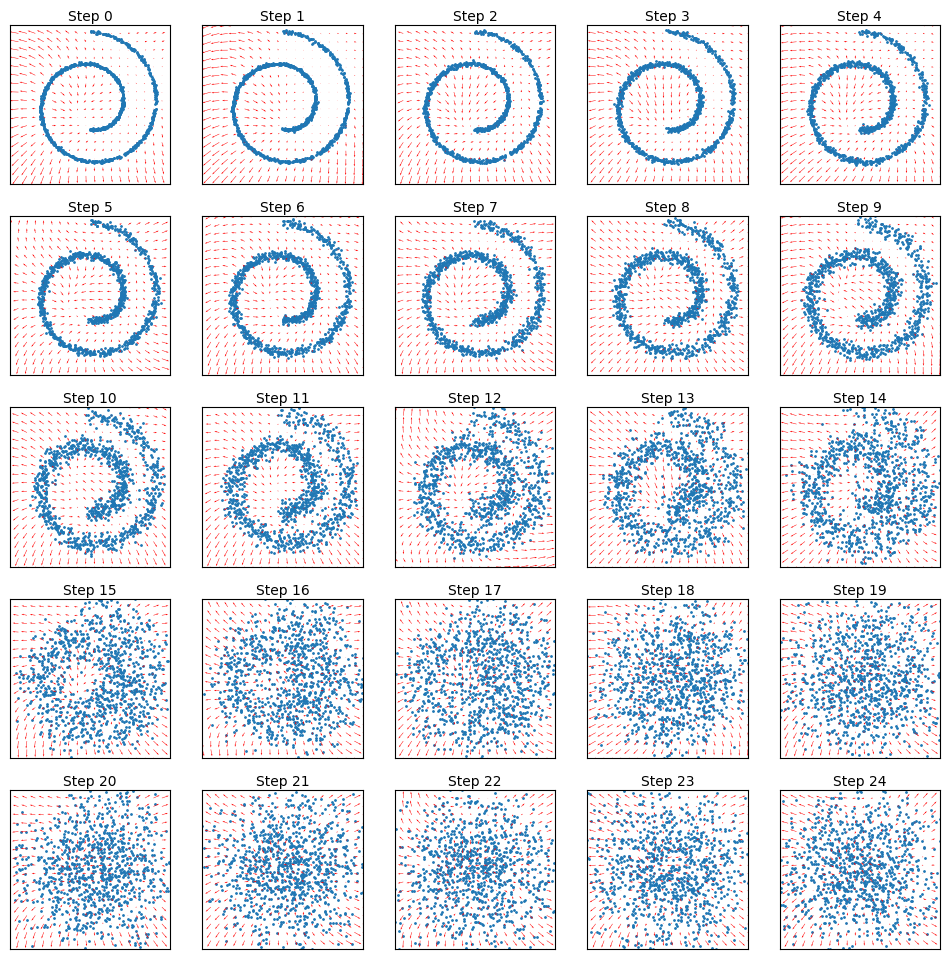
    


You can see that the vector field now changes with time: at late steps it corresponds to a field with a single "sink", where all sample are moved towards too, and than gradually there is more detailed structure introduced. In computational imaging this is also sometimes called a "coarse to fine" scheme.  

Now let's implement the sampling algorithm (aka "reverse process"). It is basically equivalent to the Langevin sampling, except that our "hyper-parameters" $\alpha_0$ and $p_0$ are replaced by well defined combinations of the $\beta$, $\alpha$ and $\bar{\alpha}$ parameters also describing the forward diffusion process. Also we have to make sure to actually reverse the process in time:


```python
Args = namedtuple("Args", ["key", "idx", "x", "alphas", "betas", "alpha_bars"])


def sample(model, args, _):
    key, subkey = random.split(args.key)

    alpha, alpha_bar, beta = args.alphas[args.idx], args.alpha_bars[args.idx], args.betas[args.idx]

    model_cond_at_time_t = partial(model, t=jnp.array([args.idx]))
    dx = jax.vmap(model_cond_at_time_t)(x=args.x)
    
    eps = random.normal(subkey, args.x.shape)
    eps = jnp.where(args.idx == 0, 0, eps)
  
    x = 1. / jnp.sqrt(alpha) * (args.x - (beta / jnp.sqrt(1 - alpha_bar)) * dx) + jnp.sqrt(beta) * eps
    
    return Args(key, args.idx - 1, x, args.alphas, args.betas, args.alpha_bars), x


n_samples = 10_000

key = random.PRNGKey(42)
key, subkey = random.split(key)

init = Args(
    key=key,
    idx=n_t_steps - 1,
    x=random.normal(subkey, (n_samples, 2)),
    alphas=1 - betas,
    betas=betas,
    alpha_bars=jnp.cumprod(alphas),
)

result, sample_trace = jax.lax.scan(partial(sample, model_cond), init, length=n_t_steps)
```

Now let's visualize the final samples:


```python
def animate_trajectory(x, filename, x_range=(-2, 2), y_range=(-2, 2), **kwargs):
    """Animate diffusion trajectory"""
    fig, ax = plt.subplots()

    kwargs.setdefault("markersize", 0.2)
    kwargs.setdefault("linestyle", "")
    kwargs.setdefault("marker", "o")

    line, = ax.plot([], [], **kwargs)
    ax.set_aspect('equal')
    ax.set_xlim(*x_range)
    ax.set_ylim(*y_range)
    ax.set_xlabel('x')
    ax.set_ylabel('y')

    def animate(idx):
        line.set_data(x[idx, :, 0], x[idx, :, 1]) # Update line data
        return line,

    ani = animation.FuncAnimation(fig, animate, frames=len(x), interval=100, blit=True)
    ani.save(filename, writer='ffmpeg')

ax = plt.subplot()

idx = -1
ax.scatter(sample_trace[idx, :, 0], sample_trace[idx, :, 1], s=1)
ax.set_aspect('equal')
scale = 2
ax.set_xlim(-scale, scale)
ax.set_ylim(-scale, scale)
ax.set_xlabel("x")
ax.set_ylabel("y");
```


    
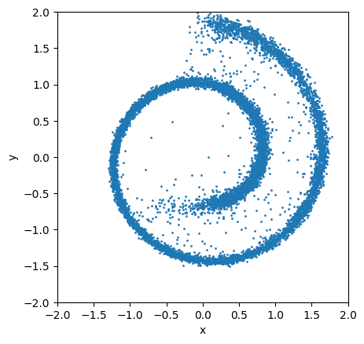
    


```python
animate_trajectory(sample_trace, "images/ddpm-swiss-roll-animation.gif");
```

    MovieWriter ffmpeg unavailable; using Pillow instead.


    
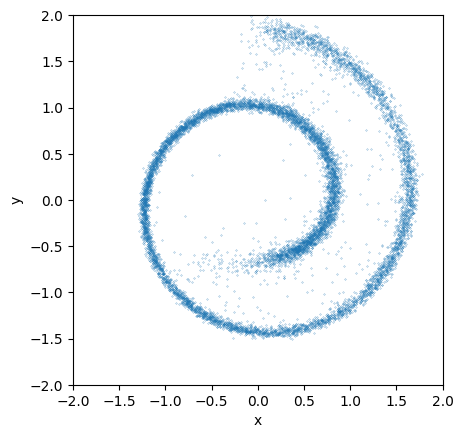
    


Here is what teh animation looks like:

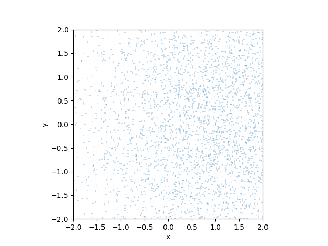

This looks much better than the earlier attempt without the time dependences!

Now we have covered all the necessary ideas for understanding diffusion models. The main advantage of diffusion models 
is the quality / accuray of the sampling. The main disadvantage is that the sampling is rather slow. To arrive at the
final sample we evaluated the model as much times as we had time steps instead of as single evaluation. For "real" large
scale model the nnumber of time steps can be as high as 1000 or more. However the working principle for the larger
production models is exactly the same!

Here are some of the relevant differences:

- "Real" diffusion models are higher dimensional: for images the dimension is a high as the number of pixels
- Instead of an MLP they typically use some time conditioned U-Net architecture.
- There are different ways to schedue the variance parameter $\beta$, such as following a cosine
- Scaling up requires handling GPUs etc.
- It is also common pratcice to use exponential moving weight averaging (EMA)

Here are some links with larger scaled implementations
- [https://github.com/ytdeepia/DDPM](https://github.com/ytdeepia/DDPM)
- [https://github.com/yang-song/score_sde](https://github.com/yang-song/score_sde)

There is a nice connection between diffusion models and stochastic differential equations (SED): instead of the discreete time handling we introduced above one can handle the time as a continues variable and use OED solvers to handle the sampling process. A nice minimal examples is given in the Equinox documentation:

- [https://docs.kidger.site/equinox/examples/score_based_diffusion/](https://docs.kidger.site/equinox/examples/score_based_diffusion/)


Thanks for the attention, I hope this was useful! If you have any further questions or comments please open an issue in this repo or reach out at one of the [contacts](https://axeldonath.com/contact.html) given on my website.


