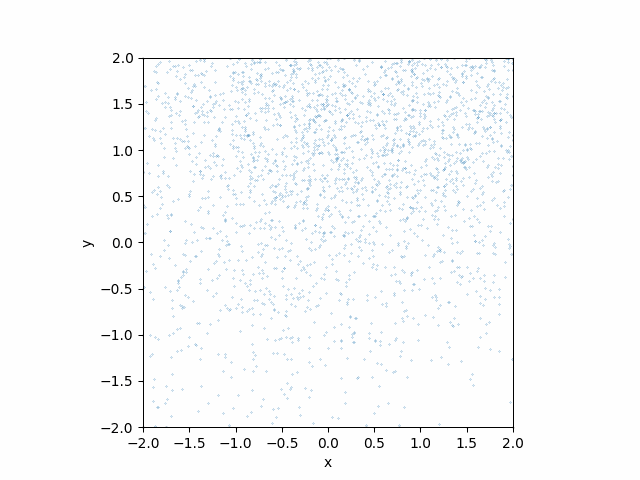

# A Beginner's Friendly Introduction to Diffusion Models in JAX

**Axel Donath**, PyData Meeting Boston June 18th, 2025 


**Who Am I?**
I am a Postdoctoral Researcher at the Center for Astrophysics | Harvard & Smithsonian where I research in the field X-Ray and Gamma-Ray Astronomy. I develop new AI, machine learning and statistical methods as well as scientific open source software for the analysis of astronomical low counts data. I'm also editor for the Astronomy and Astrophysics track of the Journal of Open Source Software [JOSS](https://joss.theoj.org).

You can find out more about me and my work at:

- [https://axeldonath.com](https://axeldonath.com)
- [https://github.com/adonath](https://github.com/adonath)


This tutorial notebook is a beginner's friendly introduction to diffusion models in JAX. It is mostly focused on introducing the core concepts of [diffusion models](https://en.wikipedia.org/wiki/Diffusion_model) from first principles along with teaching the basics of [JAX](https://docs.jax.dev/en/latest/), a differentiable, hardware accelerated, array library for deep learning and scientific computing.


## Prerequisites 

- \>2 years of experience with Python, [Numpy](https://numpy.org) and [Matplotlib](https://matplotlib.org)
    - Python standard library, functools, namedtuple, classes and dunder methods
    - Understanding of global and local scopes in Python
    - array operations, random number sampling, 1d/2d plotting, histograms
- Undergraduate level knowledge of ML, probability, statistics and linear algebra
    - Probability density functions, definitions of variance and mean
    - Multivariate Gaussian distributions
    - Joint and marginal distributions
    - Maximum Likelihood Estimation
    - (Stochastic) Gradient descent
    - Multilayer Perceptron
- No prior knowledge of Diffusion Models nor JAX is required!


## What are Diffusion Models?
Diffusion models are a class of generative models that are based on the concept of iteratively removing noise from an image
or other data. "Generative" means they model a probability distribution and can be used to draw new samples from the distribution and thus generate new plausible images. Or an alternative way of thinking about diffusion models is to think of them as sampling algorithms, that sample from a fixed distribution. Where the distribution we sample from is defined by the distribution of the data we use for training them. 


Image taken from: [https://yang-song.net/blog/2021/score/](https://yang-song.net/blog/2021/score/)

However sampling from high dimensional distributions, such as the distribution of natural images, where each pixel is treated as an independent dimension, can be technically quite challenging. Diffusion models are a way to make this sampling process feasible and scalable. Diffusion model are mathematically well founded and draw many parallels to actual physical diffusion processes, 
denoising methods in image processing as well as theory of (stochastic) differential equations.

In this tutorial We will take a look at a specific type of diffusion models called Denoising Diffusion Probabilistic Models (DDPMs) introduced by [Ho et al. in 2020.](https://arxiv.org/abs/2006.11239). We will use simple "toy examples" on 1d and 2d data to illustrate and understand the method. The goal is to build intuition and provide a solid foundation for working with production scale models. 

**Note**: I personally find that "diffusion models" are to a certain degree a misnomer, as the relevant part of the model is the reverse process, where the diffuson process is inverted. But we will learn about that later.

## What is JAX?
In a single sentence you can think of JAX as Numpy with support for GPUs and automatic differentiation.
It also includes a just in time compilation (JIT) and function transforms, such as vectorization (like np.vectorize)
which is automatically lowered to hardware accelerated XLA (XLA is an open source compiler for linear algebra / machine learnin)
instructions. 

The JAX docs are available at: [https://docs.jax.dev/en/latest/](https://docs.jax.dev/en/latest/)

There is diverse ecosystem of open source tools build around JAX covering:

- Neural Networks: [Flax](https://flax.readthedocs.io/), [Equinox](https://docs.kidger.site/equinox/), [Keras](https://keras.io/)
- Optimizers: [Optax](https://optax.readthedocs.io/), [Optimistix](https://github.com/patrick-kidger/optimistix)
- Probabilistics Programming [Blackjax](https://blackjax-devs.github.io/blackjax/), [Numpyro](https://num.pyro.ai/en/latest/index.html)
- ...

There is also a curated list of resources around JAX here: [https://github.com/n2cholas/awesome-jax](https://github.com/n2cholas/awesome-jax)


## Quick Survey

- Who has worked with JAX before?
- Who has worked with PyTorch and deep learning?
- Who has worked with diffusion models before?
- If you are comfortable sharing: 
  - 2 years of Python experience or less?
  - Between 2 - 5 years?
  - More than 5 years?


## More Ressources 

An excellent intuitive introduction to the math behind diffusion models can be found in the following video series by
[Deepia](https://www.youtube.com/@Deepia-ls2fo) on Youtube:

- [Denoising Autoencoders](https://youtu.be/0V96wE7lY4w?si=h82tsQOYRc7-Vwly)
- [Langevin Algorithm](https://youtu.be/m0OTso2Dc2U?si=_Yld6zr2jkQEGuuI)
- [Diffusion Models](https://youtu.be/EhndHhIvWWw?si=e_s1A9dyOF7NLCsg)

If you would like to prepare for this tutorial I would recommend to watch those videos in advance. They are each 15-30 minutes long and watching them in the given order is recommended.

If you are interested in more details and different perspectives about diffusion models 
I recommend to checkout the following blog posts:

- Key read: [https://yang-song.net/blog/2021/score/](https://yang-song.net/blog/2021/score/)
- [https://lilianweng.github.io/posts/2021-07-11-diffusion-models/#nice](https://lilianweng.github.io/posts/2021-07-11-diffusion-models/#nice)


Other minimal implementations in PyTorch:

- [https://github.com/joseph-nagel/diffusion-demo/blob/main/notebooks/swissroll.ipynb](https://github.com/joseph-nagel/diffusion-demo/blob/main/notebooks/swissroll.ipynb)
- [https://github.com/acids-ircam/diffusion_models/](https://github.com/acids-ircam/diffusion_models/)


## Glossary
- **Score Function**: the score function of a distribution is the gradient of the log-density function with respect to the input
- **Reverse Process**: the reverse process is the process of removing noise from an image / data
- **Forward Process**: the forward process is the process of adding noise to an image / data
- **Sample / Particle**: a sample from a n-dimensional distribution is a n-dimensional vector / point described by its coordinates, a specific realisation (or measurment) of a random variable
- **Distribution / Probability Density Function / Likelihood**: a functional or numerical form describing the probability density of a random variable. 


```python
# uncomment on google collab to install dependencies
#import sys
#!{sys.executable} -m pip install -r https://raw.githubusercontent.com/adonath/jax-diffusion-models-pydata-boston-2025/main/requirements.txt
#!mkdir images 
```


```python
import os
MAX_PRINT_LINES = int(os.environ.get("MAX_PRINT_LINES", 100_000))
```

## Warm Up: the Diffusion Process

Diffusion is typically a physical process where particles spread from regions of high concentration to regions of low concentration over time, driven by random motion. In nature, this can be seen in phenomena like the dispersal of ink in water or the flow of heat through a solid. Mathematically, diffusion is often modeled using stochastic processes or differential equations, capturing how randomness leads to gradual smoothing and homogenization of an initial state. In a more general understanding diffusion can also include convection, meaning a systematic drift of the particles driven by an external force, such as wind, a gravity driven flow in water, or stiring in a mixing process. 

We will first explore the process of diffusion on a simple example in JAX. Let's start with the relevant imports:


```python
from functools import partial
from collections import namedtuple

import numpy as np
import matplotlib.pyplot as plt
from matplotlib import animation

import jax
from jax import numpy as jnp
from jax import random
```

The `jax.numpy` namespace can be thought of as a "drop-in" replacement for Numpy. It was designed to be as similar as possible to the standard `numpy` namespace. In almost all cases you will find the equivalent of some `np.<>` function in `jnp.<>`. Howevere there is one important difference: **array objects in JAX are not mutable**, meaning they cannot be modified in place. Something like `array[2:3] = 3`, **does not work** in JAX, for reasons that become clear later, when we dicuss just in time compilation (JIT). There is a handful  more of these differences which are documented in ["JAX - The Sharp Bits"](https://docs.jax.dev/en/latest/notebooks/Common_Gotchas_in_JAX.html).

For this illustrative example we will work with a simple mixture of Gaussians as the inital distribution of the "particles" (I will use "particles" and "samples" synonymously). In JAX we can just use functionality in the `jnp.<>` namespace to define our model:


```python
def gaussian(x, norm, mu, sigma):
    """Single Gaussian distribution"""
    return norm * jnp.exp(-0.5 * ((x - mu) / sigma) ** 2) / (sigma * jnp.sqrt(2 * np.pi))


def gmm(x, norm, mu, sigma):
    """Gaussian Mixture Model"""
    values = jnp.sum(gaussian(x, norm, mu, sigma), axis=0) / mu.shape[0]

    # later we compute the gradient, which requires a returning a scalar value
    if values.shape == (1,):
        return values[0]
    
    return values

norm, mu, sigma = jnp.array([1, 1])[:, None], jnp.array([-1, 1])[:, None], jnp.array([0.25, 0.25])[:, None]

x_plot = jnp.linspace(-2, 2, 1000)
y = gmm(x_plot, norm, mu, sigma)
```

This is what the model looks like:


```python
ax = plt.subplot()
ax.plot(x_plot, y)
ax.set_xlabel('x')
ax.set_ylabel('p(x)')
```


    Text(0, 0.5, 'p(x)')


    

    


Now we proceed to drawing samples from the distribution. As it is a Gaussian distribution we can directly sample
from it using the build-in sampling methods from JAX. They are found in the `jax.random` namespace. This is
again very much like `numpy`, however there is an important difference: instead of a global `RandomState` object
JAX uses an approach, based on "keys", which can be split locally and are passed to the random sampling method:


```python
n_samples_ = 500_000

key = random.key(9834)

# TBD: this assumes equal norm, draw from bernoulli instead...
x_init = sigma * random.normal(key, (2, n_samples_ // 2,)) + mu
```

Let's make a histogram of the samples to verify the shape of the distribution:


```python
ax = plt.subplot()
ax.hist(x_init.flatten(), bins=100, density=True, histtype='step', label="Initial samples");
ax.set_xlabel('$x_i$')
ax.set_ylabel('$p(x_i)$');
```


    

    


Now we introduce the actual diffusion process. The diffusion process we choose here consists of two distinct steps or terms:

- **Diffusion**: add noise to the sample, by adding a displacement drawn from a Gaussian mean 0 and variance $\beta_t$, this corresponds to a random motion of the particle (think e.g. [Brownian motion](https://en.wikipedia.org/wiki/Brownian_motion))
- **Drift**: move current position of sample towards the origin, by multiplying with a constant factor $\sqrt{1 - \beta_t}$, this is equivalent to an external force acting on the particle.


In addition we assume $\beta_t \in [0, 1] $ and $\beta_t \to 1$ with time. With this specific choice of can achieve that the process finally converges towards a normal Gaussian distribution $\mathcal{N}(0, 1)$. The choice of the factors given above seems a bit "magic" here, but the reasoning is given in more detail in the DDPM paper I linked above (**hint:** in addition to leading to convergence to a unit Gaussian it also allows for computing the n-th time step in closed form, which will see later in the tutorial).

For now we can just numerically convince ourselves that this process indeed transforms our two component GMM into a normal Gaussian Distribution:


```python
n_iter = 100
beta_t = jnp.linspace(0, 1, n_iter)
x = x_init.flatten()

sample_trace_diffusion_beta = []

for idx, beta in enumerate(beta_t):
    key, sub_key = random.split(key)
    x = jnp.sqrt(1. - beta) * x + beta * random.normal(key=sub_key, shape=x.shape)
    sample_trace_diffusion_beta.append(x)

sample_trace_diffusion_beta = jnp.stack(sample_trace_diffusion_beta, axis=0)
```

To visualize the process over time, we can make a histogram of the samples at each point in time `t`. Of course we can use a Python loop for this and call e.g. `np.histogram` and append all results, however this is a good time to introduce a first function transform in JAX, named `jax.vmap`. `jax.vmap` allows to map an arbitrary function over the leading dimension of an array. It is comparable to `np.vectorize`, however the latter literally implements a Python loop, while `jax.vmap` lowers the operation to compiled code and is thus much more performant.

So now we can use it to map `jnp.histogram` over the time dimension of our samples:


```python
default_hist = partial(jnp.histogram, bins=100, range=(-3, 3), density=True)

batched_histogram = jax.vmap(default_hist)
```

For covenience we combined this into a little helper function, we can use to see how the density changes with time and plot the trajectory of some example particles:


```python
def plot_trace(trace, n_traces=5, ax=None, x_min=-3, x_max=3):
    """Plot distribution at multiple points in time as trace"""
    hist_values, _ = batched_histogram(trace)    

    n_iter, n_samples = trace.shape

    ax = plt.subplot() or ax
    ax.imshow(hist_values.T[:, :], extent=[0, n_iter, x_min, x_max], aspect="auto", origin="lower")

    # plot some example traces
    key = random.PRNGKey(9823)
    for idx in random.randint(key, (n_traces,), 0, n_samples):
        ax.plot(trace[:, idx])

    ax.set_ylim(x_min, x_max)
    ax.set_xlabel("# Iteration")
    ax.set_ylabel("x")
    return ax

plot_trace(sample_trace_diffusion_beta);
```


    

    


We can easily convince ourself, that the final (stationary) distribution is indeed a standard Gaussian:


```python
ax = plt.subplot()
ax.hist(sample_trace_diffusion_beta[-1], density=True, bins=50, label="Samples")

x_plot = jnp.linspace(-5, 5, 100)
ax.plot(x_plot, gaussian(x_plot, norm=1, mu=0, sigma=1), label="Unit Gaussian")
ax.set_xlabel("x")
ax.set_ylabel("PDF")
ax.legend();
```


    

    


## "Reversing" Diffusion via Langevin Dynamics

Now that we have "destroyed" our intial distribution (the two component Gaussian) with the forward diffusion process, wouldn't it be great if we could reverse the process? This would give us a sampling algorithm, that allowed us to sample from an arbitrary distribution. Starting from a normal Gaussian distribution we would transform the samples back into the shape of the intial distribution.

It turns out such an algorithm exists, it is named ["Langevin Dynamics"](https://en.wikipedia.org/wiki/Stochastic_gradient_Langevin_dynamics). However the algorithm requires one additional piece of information: the score function of the target distribution. The score function is defined as the gradient of the log of the distribution.

In JAX we can directly get the score function by taking the gradient of the log using `jax.grad()`:


```python
def log_gmm(x, norm, mu, sigma):
    """Log of the GMM"""
    return jnp.log(gmm(x, norm, mu, sigma))

gmm_log_part = partial(log_gmm, norm=norm, mu=mu, sigma=sigma) # the partial just simplifies not parsing the parameters later...
score_fun = jax.vmap(jax.grad(gmm_log_part))
```

Now we can see what it looks like:


```python
ax = plt.subplot()
x_plot = jnp.linspace(-2, 2, 1000)
ax.plot(x_plot, score_fun(x_plot))
ax.set_xlabel('x')
ax.set_ylabel('d/dx log p(x)');
```


    

    


Now let us implement a reverse diffusion process based on "Langevin Dynamics". Starting from an initial sample $x_i$, the algorithm looks like this:

$$\begin{align} \mathbf{x}_{i+1} \gets \mathbf{x}_i + 0.5 \alpha \nabla_\mathbf{x} \log p(\mathbf{x}) + \sqrt{\alpha}~ \mathbf{z}_i, \quad i=0,1,\cdots, K, \end{align}$$

Where $\mathbf{z}_i \sim \mathcal{N}(0, I)$ . When $\alpha \to 0$ and $K \to \infty$, this converges to the target distribution, defined by its score function $\nabla_\mathbf{x} \log p(\mathbf{x})$ .

The intuition behind the algorithm is the following: give a starting point for a sample $x_0$ it is moved along the gradient (gradient descent!) to move towards the region of highest probability. However whith just this component all samples would end up in the same final location, the maximum of the distribution. To prevent this, the scale of the gradient is decreased with time ($\alpha$) and an addititional random update is added, which moves the sample in a random direction. The method was first introduced by [Welling et al. 2011](https://www.stats.ox.ac.uk/~teh/research/compstats/WelTeh2011a.pdf), where they also present proof of convergence. 


While we could implement the algorithm the same way we did above using a Python loop, we make use of another JAX fundemantal, named [`jax.lax.scan`](https://docs.jax.dev/en/latest/_autosummary/jax.lax.scan.html). `lax.scan` allows you scan a function over the leading array axes while carrying along a state. It requires us to define the "body" of the loop in a dedicated function:


```python
# JAX can natively handle "structs of arrays" or "PyTrees"
SampleArgs = namedtuple("Args", ["key", "idx", "x", "alpha_0", "p_0"])

def sample(score, args, _):
    # compute the "learning rate" depending on the iteration
    alpha = args.alpha_0 * (args.p_0 ** args.idx) ** 2

    # sample stochastic update
    key, subkey = random.split(args.key)
    dx = random.normal(subkey, args.x.shape)

    # combine the gradient and the stochastic update
    x = args.x + 0.5 * alpha * score(args.x) + jnp.sqrt(alpha) * dx
    return SampleArgs(key, args.idx + 1, x, args.alpha_0, args.p_0), x
```

**Note on pure functions**: Functions passed to `jax.lax.scan` are automatically JIT compiled, which allows for efficient execution. However this requires functions to be "pure" or alternatively they cannot have "side effects". Side effects include e.g. modifying an object / data that was passed to the function as argument in place,  printing something or interacting with global state in the function. This limitation becomes clear, when you remind yourself that for JIT compilation the Python code only serves as a laguage to define the computational graph and is never really executed. Instead a JIT compiled version of the code is executed, which is compiled to lower level hardware accelerated code. How should a remote GPU "know" how to modify a specific Python object in thh main process place? This would require supporting complex communication between process and platforms. The requirement of pure functions makes the implementation of the JIT much simpler and more stable.

Now we can use that function by defining the initial state first and calling `jax.lax.scan`:


```python
n_samples = 100_000
n_iter = 500

key = random.PRNGKey(42)
key, subkey = random.split(key)

init = SampleArgs(
    key=key,
    idx=0,
    x=random.normal(subkey, (n_samples,)),
    alpha_0=0.002,
    p_0=1.0
)

result, sample_trace = jax.lax.scan(partial(sample, score_fun), init, length=n_iter)
```


```python
plot_trace(sample_trace);
```


    

    


```python
ax = plt.subplot()
ax.hist(sample_trace[-1], density=True, bins=70, label="Samples")

x_plot = jnp.linspace(-2, 2, 100)
y = gmm(x_plot, norm, mu, sigma)
ax.plot(x_plot, y, label="Target distribution")
ax.set_xlim()
ax.set_xlabel("x")
ax.set_ylabel("PDF")
ax.legend();
```


    

    


So we have transformed the samples from a unit Gaussian into the target distribution using Langevin dynamics!

## Score Matching
In this next section we will go from the simple Langevin dynamics example to Denoising Diffusion Probabilistic Models (DDPM) [Ho et al](https://arxiv.org/abs/2006.11239).
The Langevin dynamics example required the knowledge of the score function, which we derived from the bimodal Gaussian 
PDF using `jax.grad`.

However in general we do not have access to the score function, we just have access to the data distribution. Still we can estimate the score function from the data in a process called "score matching", introduced by [Hyvarinen, 2005](https://jmlr.org/papers/volume6/hyvarinen05a/hyvarinen05a.pdf). It is intuitive that to "match the score" we could minimize the expectation value of the squared difference between a model function $\mathcal{F}_{\theta}(\mathbf{x})$ and the score function computed from the data distribution (leaving open how to do this for now):

$$\mathcal{L}_{mse} = E_{\mathbf{x} \sim p(\mathbf{x})} \left[ \left\lVert \mathcal{F}_{\theta}(\mathbf{x}) - \nabla_{\mathbf{x}} \log p(\mathbf{x}) \right\lVert_2^2 \right]$$

The core of the method of "score matching" involves the intesting result, that the MSE loss between the score function and the gradient of the log PDF can be reformulated as:

$$\mathcal{L}_{matching} = E_{\mathbf{x} \sim p(\mathbf{x})} \left[ \text{ tr}\left( \nabla_{\mathbf{x}}  \mathcal{F}_{\theta}(\mathbf{x})  \right) + \frac{1}{2} \left\Vert \mathcal{F}_{\theta}(\mathbf{x}) \right\lVert_2^2 \right]$$

If you are interested in the mathematical derivation of this new loss, you can checkout e.g. http://yang-song.net/blog/2019/ssm/.


```python
from sklearn.datasets import make_swiss_roll
import equinox as eqx
import optax
```


For this next section we will work with another toy dataset,  the "swiss roll":


```python
random_state = np.random.RandomState(8923)

n_samples = 1_000
x = make_swiss_roll(n_samples=n_samples, noise=0.1, random_state=random_state)[0]
x = 0.13 * x[:, [0, 2]] # drop z axis
```

This is what the dataset look like:


```python
ax = plt.subplot()

ax.scatter(x[:, 0], x[:, 1], s=1)
ax.set_aspect('equal')

scale = 2.0
ax.set_xlim(-scale, scale)
ax.set_ylim(-scale, scale)
ax.set_xlabel("x")
ax.set_ylabel("y");
```


    

    


To model the score function we choose a simple multi-layer perceptron. In JAX there are multiple choices of deep learning libraries.
I personally found [Equinox](https://docs.kidger.site/equinox/) easiest to work with. However if you come from PyTorch than [flax / nnx](https://flax.readthedocs.io/en/latest/) might be even closer. 

The model definition in `equinox` looks like:


```python
class MLP(eqx.Module):
    """Simple MLP"""
    fc1: eqx.nn.Linear
    fc2: eqx.nn.Linear
    fc3: eqx.nn.Linear

    def __init__(self, in_dim, out_dim, key, hidden_dim=128):
        keys = jax.random.split(key, 3)
        self.fc1 = eqx.nn.Linear(in_dim, hidden_dim, key=keys[0])
        self.fc2 = eqx.nn.Linear(hidden_dim, hidden_dim, key=keys[1])
        self.fc3 = eqx.nn.Linear(hidden_dim, out_dim, key=keys[2])

    def __call__(self, x):
        x = jax.nn.gelu(self.fc1(x))
        x = jax.nn.gelu(self.fc2(x))
        x = self.fc3(x)
        return x
```

I you have worked with PyTorch before, this should still look familiar to you. Models are defined by inhereting from a `Module` object and implementing the forward pass, here defined in the `__call__` method. New are the class level declarations of class members, which are "borrowed" from dataclasses and the splitting of the random state, we have seen before.

One particular design choice in Equinox is that you never have to handle the "batch axis", but you can always use `jax.vmap` over an entire model definition. This is possible because `eqx.Module` objects are "structs of arrays" supported by JAX. However one thing to keep in mind (a "sharp bit") is that these structures can only be trees and not graphs! This makes for example sharing parameters a bit more complex.

Next we implement the loss function I we have defined above and to make the function more efficient, we will use JAX's built-in "just in time" compilation. The way this works is by decorating the function definition with the `jax.jit` object. 


```python
@jax.jit
def score_matching_loss(model, samples):
    """Score matching loss"""
    logp = jax.vmap(model)(samples)
    # Compute the norm loss
    norm_loss = jnp.linalg.norm(logp, axis=-1) ** 2 / 2.0
    
    # Compute the Jacobian loss
    jacob_mat = jax.vmap(jax.jacobian(model))(samples)
    tr_jacobian_loss = jnp.trace(jacob_mat, axis1=-2, axis2=-1)
    
    return (tr_jacobian_loss + norm_loss).mean()
```

Next we train the model on the dataset, using the Adam optimzer and the `optax` library. Equinox provide some extra methods such as `eqx.filter_jit`, which can be thought of an convenience wrapper around the `jax.jit` decorator, which automacilly filters which attributes of the model are arrays and relevant for JIT and gradient computation. I will not go into forther explanation, but refer to the [Equinox docs](https://docs.kidger.site/equinox/) instead.


```python
model = MLP(2, 2, key=jax.random.key(1234), hidden_dim=128)

optimizer = optax.adam(learning_rate=1e-3)
opt_state = optimizer.init(model)

n_iter = 1000

@eqx.filter_jit
def make_step(model, opt_state, x):
    """Make a single step in the optimization routine"""
    loss_value, grads = eqx.filter_value_and_grad(score_matching_loss)(model, x)
    updates, opt_state = optimizer.update(
        grads, opt_state, eqx.filter(model, eqx.is_array)
    )
    model = eqx.apply_updates(model, updates)
    return model, opt_state, loss_value


for idx in range(n_iter):
    model, opt_state, train_loss = make_step(model, opt_state, x)
    if idx < MAX_PRINT_LINES:
        print(f"Iter {idx}, loss: {train_loss:.4f}", end="\r", flush=True)
```

    Iter 0, loss: 0.0227

    Iter 1, loss: -0.0900

    Iter 2, loss: -0.1967

    Iter 3, loss: -0.2977

    Iter 4, loss: -0.3934

    Iter 5, loss: -0.4842

    Iter 6, loss: -0.5703

    Iter 7, loss: -0.6518

    Iter 8, loss: -0.7290

    Iter 9, loss: -0.8016

Remember that the score function parametrizes the gradient of the log, so it is a vector valued function. 
So we can use a little helper function to visualize the score function we have just fitted as a vector field:


```python
def plot_vector_field(model, ax=None, x_range=(-2, 2, 10), y_range=(-2, 2, 10), **kwargs):
    """Plot vector field of grad(log(p)), aka score function"""
    if ax is None:
        ax = plt.gca()
    
    xx, yy = jnp.meshgrid(
        jnp.linspace(*x_range),
        jnp.linspace(*y_range)
    )
    grid = jnp.stack([xx.ravel(), yy.ravel()], axis=-1)

    scores = jax.vmap(model)(grid)

    scores_norm = jnp.linalg.norm(scores, axis=-1, ord=2, keepdims=True)
    scores_log1p = scores / scores_norm * jnp.log(1 + scores_norm)
    ax.quiver(xx, yy, scores_log1p[:, 0], scores_log1p[:, 1], **kwargs)
    return ax

ax = plt.subplot()

ax.scatter(x[:, 0], x[:, 1], s=10, alpha=0.1)

ax.set_aspect('equal')
scale = 2.0
ax.set_xlim(-scale, scale)
ax.set_ylim(-scale, scale)
ax.set_xlabel("x")
ax.set_ylabel("y")
plot_vector_field(model, ax=ax, x_range=(-2, 2, 20), y_range=(-2, 2, 20), color="red");
```


    

    


If you look closely you can see that the gradient always points towards the direction of the highest probability density at any point in the data space. Which is exactly what we expect from intuition.

Now that we have the score function of the distribution we can actually go back to our Langevin sampling method and replace the analytical score function with our fitted model:


```python
Args = namedtuple("Args", ["key", "idx", "x", "alpha_0", "p_0"])

def sample(score, args, _):
    key, subkey = random.split(args.key)
    alpha = args.alpha_0 * (args.p_0 ** args.idx) ** 2
    dx = random.normal(subkey, args.x.shape)
    x = args.x + 0.5 * alpha * jax.vmap(score)(args.x) + jnp.sqrt(alpha) * dx
    return Args(key, args.idx + 1, x, args.alpha_0, args.p_0), x


n_samples = 10_000
n_iter = 2000

key = random.PRNGKey(42)
key, subkey = random.split(key)

init = Args(
    key=key,
    idx=0,
    x=random.normal(subkey, (n_samples, 2)),
    alpha_0=0.0001,
    p_0=1,
)

result, sample_trace = jax.lax.scan(partial(sample, model), init, length=n_iter)
```

This is what the samples look like:


```python
ax = plt.subplot()

ax.scatter(sample_trace[-1, :, 0], sample_trace[-1, :, 1], s=1)
ax.set_aspect('equal')
scale = 2.0
ax.set_xlim(-scale, scale)
ax.set_ylim(-scale, scale)
ax.set_xlabel("x")
ax.set_ylabel("y");
```


    

    


# (Break)

## Denoising Diffusion Probabilistic Models (DDPM)

The previous result just using score matching was not bad, but also not great either. The sampling process got "stuck" in regions of lower probability and missed details of the distribution. How can we improve upon this?

The answer that will finally bring us to the DDPM "diffusion model" has multiple aspects. The most important ideas is, we can make the model of the score function dependent (conditioned) on time. But how does the training of such a model look like? We can create "diffused" versions of our training data as we did above, which 
change with time and move (or "morph") from a simple Gaussian to the much more complex target distribution. 

Practically we can make another small improvement to the diffusion process: in order to get the "diffused" example data a given $t$, we had to compute all the previous steps (check the simple example above). Now, with a bit of math, because all the transitions between the different stages are Gaussian, one can derive a closed form expression to how much the data is diffused at given time $t$ (check the DDPM paper).

The solution is given by:

$$q(x_t|x_0) = \sqrt{\bar{\alpha_t}}x_0 + (1 - \bar{\alpha_t}) \cdot \epsilon$$

And

$$\bar{\alpha} = (1 - \beta)^t, \textrm{with~} \alpha = 1 - \beta$$

Now let's first define the range of $\beta$ values and compute $\alpha$ and $\bar{\alpha}$ from it:


```python
n_t_steps = 25 # number of time steps
betas = jnp.geomspace(1e-4, 0.9999, n_t_steps)
alphas = 1 - betas.reshape(1, -1, 1)
alpha_bars = jnp.cumprod(alphas, axis=1)
```

This we can use to diffuse the data:


```python
noise = jax.random.normal(jax.random.PRNGKey(1234), shape=(x.shape[0], n_t_steps, 2))
x_diffused_example = jnp.sqrt(alpha_bars) * x[:, jnp.newaxis, :] + jnp.sqrt(1 - alpha_bars) * noise
```

Now we can visualize the diffusion process with time:


```python
fig, axes = plt.subplots(nrows=5, ncols=5, figsize=(8, 8))

for idx, ax in enumerate(axes.flat):
    ax.scatter(x_diffused_example[:, idx, 0], x_diffused_example[:, idx, 1], s=1)
    ax.set_title(f"Step {idx}", fontdict={"size": 10}, pad=3)
    ax.set_xticks([])
    ax.set_yticks([])
```


    

    


We can quickly verify that just as in the other example above the marginal distributions correspond to a unit Gaussian:


```python
ax = plt.subplot()

ax.hist(x_diffused_example[:, -1, 0], density=True, bins=50, label="X Marginal", histtype="step")
ax.hist(x_diffused_example[:, -1, 1], density=True, bins=50, label="Y Marginal", histtype="step")


x_plot = jnp.linspace(-5, 5, 100)
ax.plot(x_plot, jax.scipy.stats.norm.pdf(x_plot), label="Unit Gaussian")
ax.set_xlabel("x")
ax.set_ylabel("PDF")
ax.legend();
```


    

    


Now we modify our model to be dependent on the time coordinate. A common way to do this is via a so called "positional embedding".
For this we consider the time variable to be an integer value, and the embedding consists of a matrix of the size $N_t \times N_{out}$,
where $N_t$ is the number of time steps to consider and $N_{out}$ is the number of dimensions in the intermediate layer of the MLP. 

The given a time idx `t` we can just lookup the vector in the embedding and directly mutliply it to the intermediate activations: 


```python
class TimeConditionedLinear(eqx.Module):
    """Simple MLP"""
    linear: eqx.nn.Linear
    embedding: eqx.nn.Embedding

    def __init__(self, in_dim, out_dim, t_dim, key):
        keys = jax.random.split(key, 2)
        self.embedding = eqx.nn.Embedding(t_dim, out_dim, key=keys[0])
        self.linear = eqx.nn.Linear(in_dim, out_dim, key=keys[1])

    def __call__(self, x, t):
        out = self.linear(x)
        value = jax.vmap(self.embedding)(t)[0]
        result = out * value
        return result


class TimeConditionedMLP(eqx.Module):
    """Simple MLP"""
    fc1: TimeConditionedLinear
    fc2: TimeConditionedLinear
    fc3: eqx.nn.Linear

    def __init__(self, in_dim, out_dim, t_dim, key, hidden_dim=128):
        keys = jax.random.split(key, 3)
        self.fc1 = TimeConditionedLinear(in_dim, hidden_dim, t_dim, key=keys[0])
        self.fc2 = TimeConditionedLinear(hidden_dim, hidden_dim, t_dim, key=keys[1])
        self.fc3 = eqx.nn.Linear(hidden_dim, out_dim, key=keys[2])

    def __call__(self, x, t):
        x = jax.nn.gelu(self.fc1(x, t))
        x = jax.nn.gelu(self.fc2(x, t))
        x = self.fc3(x)
        return x
```

In the training we will apply one more additional modification. We define the model and loss function such that 
the model predicts the noise in each step. There is a nice but somewhat lenghty derivation in the Deepia 
video above and in the DDPM paper. 

But just intuitively: the model is trained to predict the noise in each step. In the sampling process we can
then just subtract the noise from the current iteration and get a less noisy version of the data. If we
do this iteratively we arrive at a final denoised sample of the data distribution, matching the process
illustrated in the figure at the top.

Ok let's implement this in code:


```python
n_t_steps = 100 # number of time steps
betas = jnp.geomspace(1e-4, 0.9999, n_t_steps)
alphas = 1.0 - betas
alpha_bars = jnp.cumprod(alphas)
```


```python
model_cond = TimeConditionedMLP(2, 2, t_dim=n_t_steps, key=jax.random.key(23))

optimizer = optax.adam(learning_rate=1e-3)
opt_state = optimizer.init(model_cond)
```


```python
n_iter = 20_000


def mse_loss(model, x, t, noise):
    """Mean squared losss"""
    pred = jax.vmap(model)(x, t)
    return ((pred - noise) ** 2).mean()


@eqx.filter_jit
def make_step(model, opt_state, x, t, noise):
    """Make a single update step"""
    loss_value, grads = eqx.filter_value_and_grad(mse_loss)(model, x, t, noise)
    updates, opt_state = optimizer.update(
        grads, opt_state, eqx.filter(model, eqx.is_array)
    )
    model = eqx.apply_updates(model, updates)
    return model, opt_state, loss_value


key = jax.random.PRNGKey(1234)

for idx in range(n_iter):
    key, subkey = random.split(key)
    noise = jax.random.normal(subkey, shape=x.shape)

    key, subkey = random.split(key)
    t = jax.random.randint(subkey, minval=0, maxval=n_t_steps, shape=(x.shape[0], 1))

    x_diffused = jnp.sqrt(alpha_bars[t]) * x + jnp.sqrt(1 - alpha_bars[t]) * noise

    model_cond, opt_state, train_loss = make_step(model_cond, opt_state, x_diffused, t, noise)
    if idx < MAX_PRINT_LINES:
        print(f"Iter {idx}, loss: {train_loss:.4f}", end="\r", flush=True)
```

    Iter 0, loss: 0.9840

    Iter 1, loss: 0.9978

    Iter 2, loss: 0.9667

    Iter 3, loss: 0.9926

    Iter 4, loss: 0.9654

    Iter 5, loss: 0.9440

    Iter 6, loss: 0.9776

    Iter 7, loss: 0.9805

    Iter 8, loss: 0.9519

    Iter 9, loss: 0.9188

Now we can visualize the diffused data along with the time dependent score model function:


```python
fig, axes = plt.subplots(nrows=5, ncols=5, figsize=(12, 12))

for idx, ax in enumerate(axes.flat):
    ax.scatter(x_diffused_example[:, idx, 0], x_diffused_example[:, idx, 1], s=1)
    ax.set_title(f"Step {idx}", fontdict={"size": 10}, pad=3)
    ax.set_xticks([])
    ax.set_yticks([])

    model_cond_at_time_t = partial(model_cond, t=jnp.array([idx]))
    plot_vector_field(model_cond_at_time_t, ax=ax, x_range=(-2, 2, 20), y_range=(-2, 2, 20), color="red")
    ax.set_xlim(-2, 2)
    ax.set_ylim(-2, 2)

plt.savefig("images/time-dependent-gradient-field.png", dpi=300);
```


    

    


You can see that the vector field now changes with time: at late steps it corresponds to a field with a single "sink", where all sample are moved towards too, and than gradually there is more detailed structure introduced. In computational imaging this is also sometimes called a "coarse to fine" scheme.  

Now let's implement the sampling algorithm (aka "reverse process"). It is basically equivalent to the Langevin sampling, except that our "hyper-parameters" $\alpha_0$ and $p_0$ are replaced by well defined combinations of the $\beta$, $\alpha$ and $\bar{\alpha}$ parameters also describing the forward diffusion process. Also we have to make sure to actually reverse the process in time:


```python
Args = namedtuple("Args", ["key", "idx", "x", "alphas", "betas", "alpha_bars"])


def sample(model, args, _):
    key, subkey = random.split(args.key)

    alpha, alpha_bar, beta = args.alphas[args.idx], args.alpha_bars[args.idx], args.betas[args.idx]

    model_cond_at_time_t = partial(model, t=jnp.array([args.idx]))
    dx = jax.vmap(model_cond_at_time_t)(x=args.x)
    
    eps = random.normal(subkey, args.x.shape)
    eps = jnp.where(args.idx == 0, 0, eps)
  
    x = 1. / jnp.sqrt(alpha) * (args.x - (beta / jnp.sqrt(1 - alpha_bar)) * dx) + jnp.sqrt(beta) * eps
    
    return Args(key, args.idx - 1, x, args.alphas, args.betas, args.alpha_bars), x


n_samples = 10_000

key = random.PRNGKey(42)
key, subkey = random.split(key)

init = Args(
    key=key,
    idx=n_t_steps - 1,
    x=random.normal(subkey, (n_samples, 2)),
    alphas=1 - betas,
    betas=betas,
    alpha_bars=jnp.cumprod(alphas),
)

result, sample_trace = jax.lax.scan(partial(sample, model_cond), init, length=n_t_steps)
```

Now let's visualize the final samples:


```python
def animate_trajectory(x, filename, x_range=(-2, 2), y_range=(-2, 2), **kwargs):
    """Animate diffusion trajectory"""
    fig, ax = plt.subplots()

    kwargs.setdefault("markersize", 0.2)
    kwargs.setdefault("linestyle", "")
    kwargs.setdefault("marker", "o")

    line, = ax.plot([], [], **kwargs)
    ax.set_aspect('equal')
    ax.set_xlim(*x_range)
    ax.set_ylim(*y_range)
    ax.set_xlabel('x')
    ax.set_ylabel('y')

    def animate(idx):
        line.set_data(x[idx, :, 0], x[idx, :, 1]) # Update line data
        return line,

    ani = animation.FuncAnimation(fig, animate, frames=len(x), interval=100, blit=True)
    ani.save(filename, writer='ffmpeg')

ax = plt.subplot()

idx = -1
ax.scatter(sample_trace[idx, :, 0], sample_trace[idx, :, 1], s=1)
ax.set_aspect('equal')
scale = 2
ax.set_xlim(-scale, scale)
ax.set_ylim(-scale, scale)
ax.set_xlabel("x")
ax.set_ylabel("y");
```


    

    


```python
animate_trajectory(sample_trace, "images/ddpm-swiss-roll-animation.gif");
```

    MovieWriter ffmpeg unavailable; using Pillow instead.


    

    


Here is what teh animation looks like:



This looks much better than the earlier attempt without the time dependences!

Now we have covered all the necessary ideas for understanding diffusion models. The main advantage of diffusion models 
is the quality / accuray of the sampling. The main disadvantage is that the sampling is rather slow. To arrive at the
final sample we evaluated the model as much times as we had time steps instead of as single evaluation. For "real" large
scale model the nnumber of time steps can be as high as 1000 or more. However the working principle for the larger
production models is exactly the same!

Here are some of the relevant differences:

- "Real" diffusion models are higher dimensional: for images the dimension is a high as the number of pixels
- Instead of an MLP they typically use some time conditioned U-Net architecture.
- There are different ways to schedue the variance parameter $\beta$, such as following a cosine
- Scaling up requires handling GPUs etc.
- It is also common pratcice to use exponential moving weight averaging (EMA)

Here are some links with larger scaled implementations
- [https://github.com/ytdeepia/DDPM](https://github.com/ytdeepia/DDPM)
- [https://github.com/yang-song/score_sde](https://github.com/yang-song/score_sde)

There is a nice connection between diffusion models and stochastic differential equations (SED): instead of the discreete time handling we introduced above one can handle the time as a continues variable and use OED solvers to handle the sampling process. A nice minimal examples is given in the Equinox documentation:

- [https://docs.kidger.site/equinox/examples/score_based_diffusion/](https://docs.kidger.site/equinox/examples/score_based_diffusion/)


Thanks for the attention, I hope this was useful! If you have any further questions or comments please open an issue in this repo or reach out at one of the [contacts](https://axeldonath.com/contact.html) given on my website.


